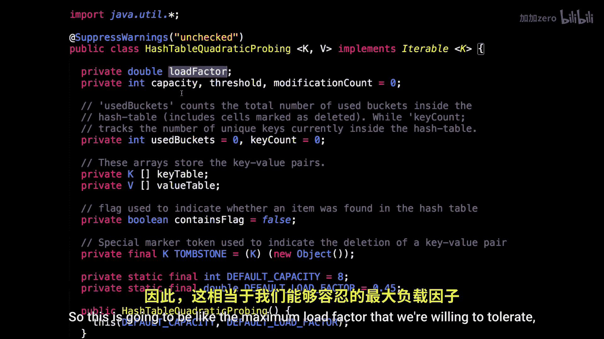

# WilliamFiset【中英⚡数据结构｜Data structures】 p37 P37 Hash table open addressing code -BV1M2JXzhEdp_p37-

All right， today we're going to be having a look at some source code for a hash table that uses open addressing as a collision resolution scheme。

And you can find all the source code on Github at Williammfizza slash data structuress。

 and then just go to the hash table folder to find a whole bunch of hash table implementations。

I have three different open addressing implementations here， in particular。

 we have quadratic probing， linear probing， and double hashing。

They're all very similar to each other。 So I will only be looking at one right now。

 But if you're curious， you can go。On GitHub and check them out for yourself。

 the one that's really different or slightly more different is the double hashing。

But other than that， they are really essentially the same thing。

So today I've decided that we're going to have a look at the quadratic probing file。

 so let's dive into the code。

All right， here we are inside the code for the hash table that uses quadratic prorobing。

So let's dive right in。So I have a class called hash table quadtic probing and notice that it takes into generic types。

 K and V， so this is the key type and this is the value type。

So you're going to have to specify these when you instantiate an object。

 which is a hash table for quadratic probing。So I have a bunch of instance variables that we're going to need。

 the first is the load factor。So this seem to be like the maximum load factor that we're willing to tolerate。

The current capacity of our hack。