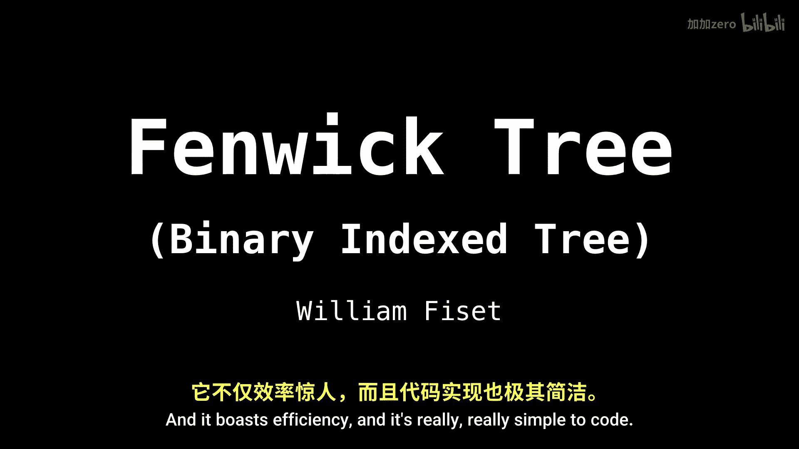
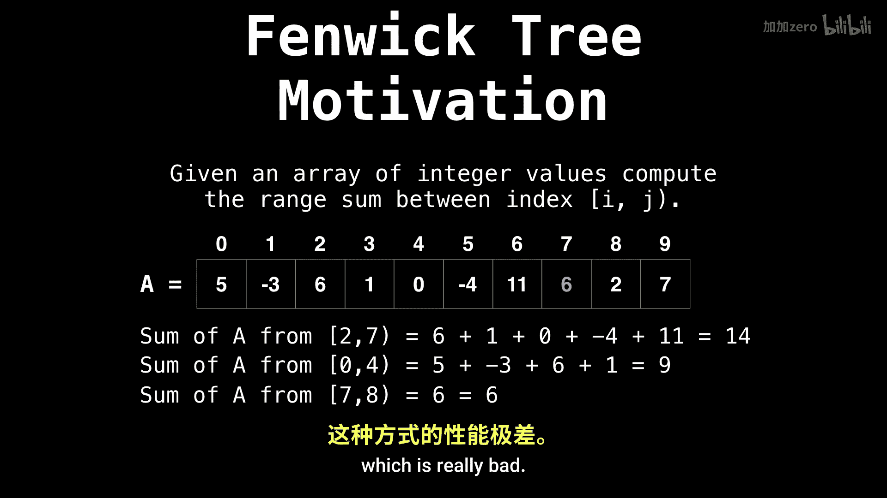

# WilliamFiset【中英⚡数据结构｜Data structures】 p38 P38 Fenwick Tree range queries -BV1M2JXzhEdp_p38-

Today I want to talk about the feenwick tree， also sometimes called the binaryary index tree。

 and you'll see why very soon。This is one of my personal favorites because it's such a powerful data structure and it boasts efficiency and it's really。

 really simple to code。

So let's dive right in。So things going covering the Fenwick Tree video series and just some standard stuff。

 so go over some motivation why this data structure exists， analyze its time complexity。

 and then go into some implementation details。So in this video we'll get to the range query and later videos how to do point updates and how to construct the F tree in the linear time。

 you can also do things like range updates， but I'm not going to be covering that。

In this series。At least not yet。Okay， so what is the motivation behind the feenwick tree。

So suppose we have an array of integer values and we want to query a range。

And find the sum of that range。Well， one thing we can do would be to。

Start at the position and scan up to where we want to stop and then sum all the individual values between that range。

 that's fine。 we can do this。 However， it'll soon get pretty slow because we're doing linear queries。

 which is really bad。

However， if we do something like compute all the prefix sums for the array A。

