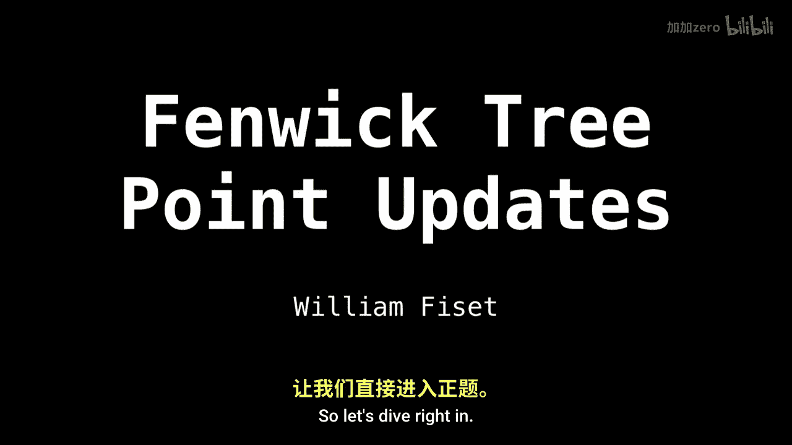
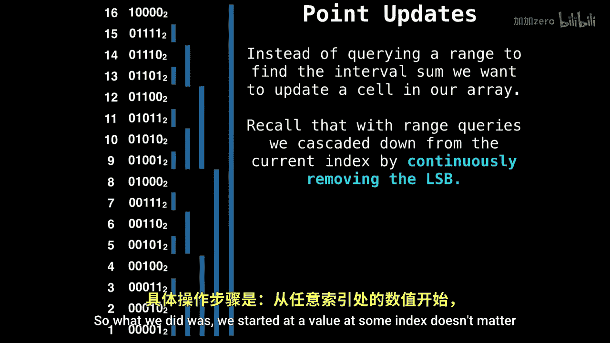
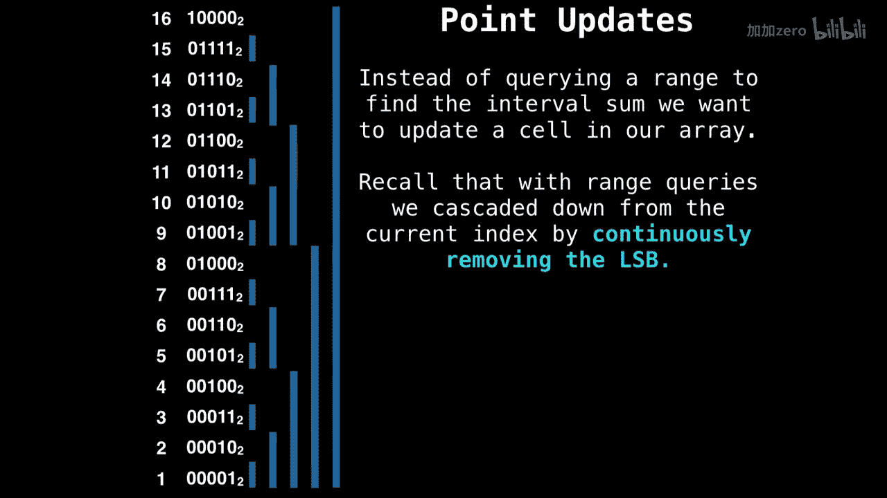
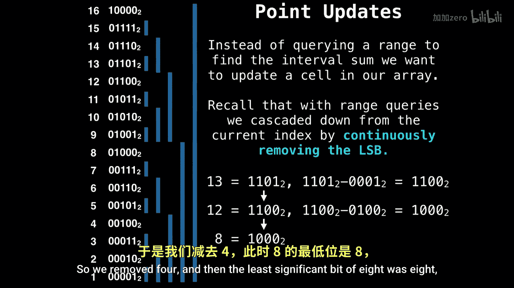
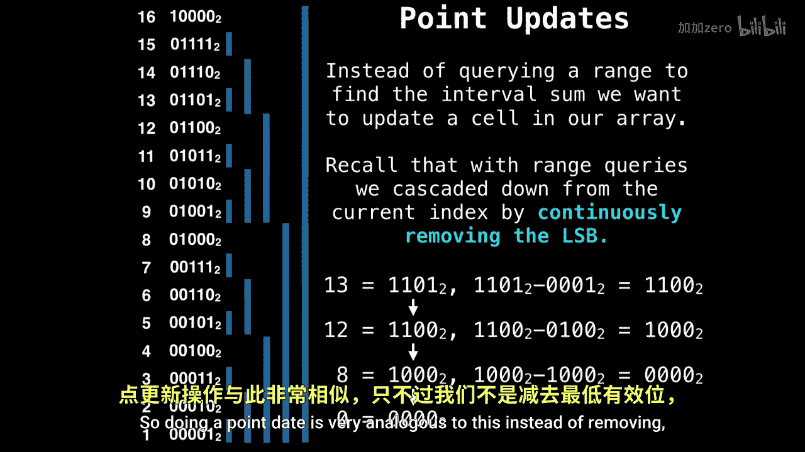

# WilliamFiset【中英⚡数据结构｜Data structures】 p39 P39 Fenwick Tree point updates -BV1M2JXzhEdp_p39-

I want to talk about feenwick trees and point updates。So let's dive right in。

But before we get to that， absolutely make sure you checked out the Fenic T Ra query video。

And I posted last。Just to get the context of how the feenoic tree is set up and。

How we're doing operations on it。

OK。So just to refresh your brain on how we actually did a prefix sum and how did those range queries。

So what we did was we started at a value at some index doesn't matter which。

 and then we continuously removed the least significant bit until we hit zero。

 So that's the cascading down effect that that gave。

So let's say we started at 13。 Well，13's least significant bit was one， So we removed one。

And we got 12， and then we found out that the least significant bit of 12 was four。

And so we remove four and then the least the significant bit of  eight was  eight。

 then we reach zero。

And once we reach zero， we know that we're done。So doing a point update date is very analogous to this。

 but instead of removing， we're going to be adding the least significant bit， as you'll see。

So， for instance， if we want to add a value at index 9， then we have to find out。

