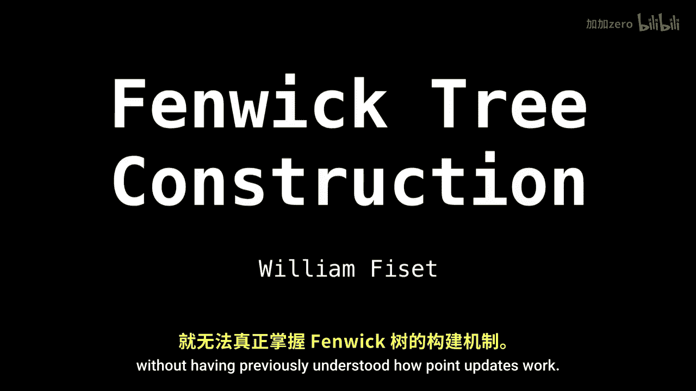
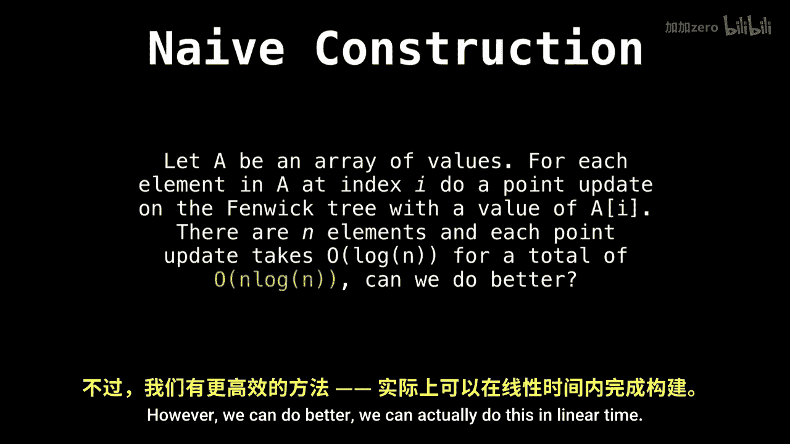
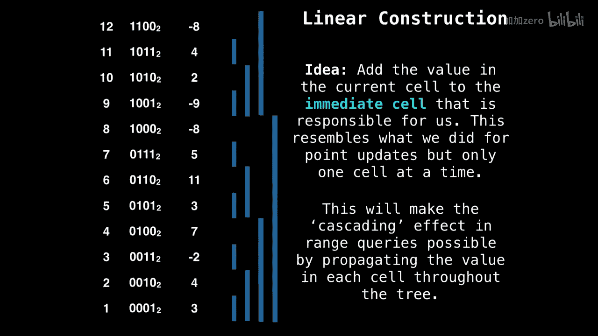

# WilliamFiset【中英⚡数据结构｜Data structures】 p40 P40 Fenwick Tree construction -BV1M2JXzhEdp_p40-

Al right， welcome back everyone。 Let's talk about Fenwick Tree construction。

 We've already seen how to do range queries and point updates in the last two videos。

 but we haven't even seen how to construct the Fenwick tree yet。

And the reason I've kept this for last is you can't understand the F reconstruction without having previously understood how point updates work。

Alright， so let's dive right in。 So we could do the naive construction of a feen tree。

 So if we're given array of values， a。And we want to transform this into a feenwickwick tree。

 What we could do is initialize our feenwick tree。To be an array containing all zeros in add。

The values into the Fer tree one at a time using point updates to get a total time complexity of order and log n。

However。We can do better。 We can actually do this in linear time。 So why bother with n log n。

All right， so in the linear construction。We're going to be given an array of values we wish to convert into the feench tree。

 a legitimate feenix tree， not just the array of values themselves。

And the idea is we're going to propagate the values throughout our Phenic tree in place。

And we're going to do this by updating the immediate cell as responsible for us。

Eventually， as we've passed through the entire tree， everyone's going to be updated。

