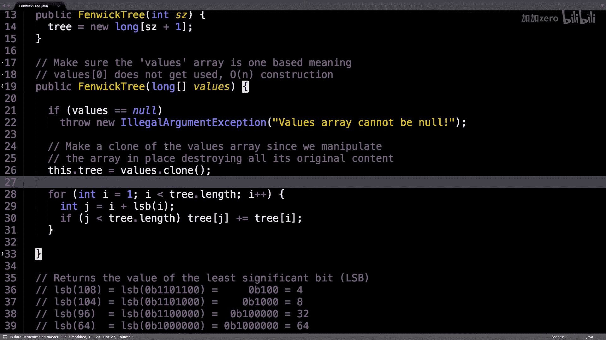

# WilliamFiset【中英⚡数据结构｜Data structures】 p41 P41 Fenwick tree source code -BV1M2JXzhEdp_p41-

Alright， let's have a look at some feenwick Tree source code， I'm here in my Gitthub repository。

 you can find it at this link which I'll put in the description below at Williamfsa slashdaash structures and the feenwick Tree source code is right here。

Under the Feendric tree folder， so let's dive right in。

 I have it here local on my computer in my text editor。

Allright。So this source code is provided to you in Java。

 but it's really easy to translate it to any language you're working in。

So I create a feenwick tree class which has two constructors， one。

 that'll create an empty feenic tree for a given size， and then you populate it yourself。

And another one， which you give it an array of values like we saw in the last video。And。

Constructs the feuix tree in a linear time， so this is probably the constructor you want to use and not the other one。

 but I give you the option to use either or。So one thing that you guys should know is that the values array a pass in。

This thing needs to be one based。 In the last video， I was hesitant on whether or not you had to go。

Les than or less than or equal to the length of the array。

 and that's going to depend on whether the array is one based or zero based。

Usually everything in fe tree is one based， in which case it would be。

