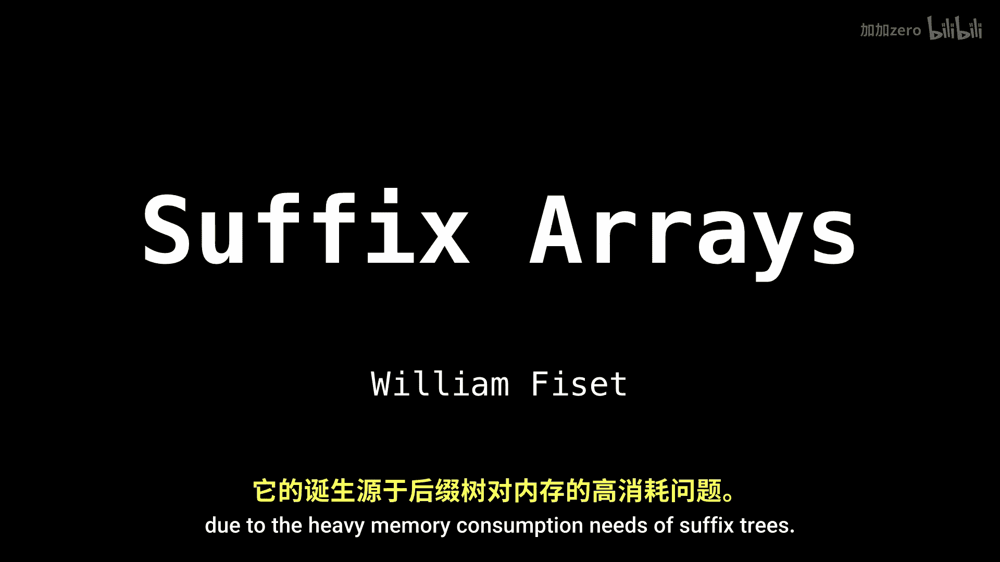
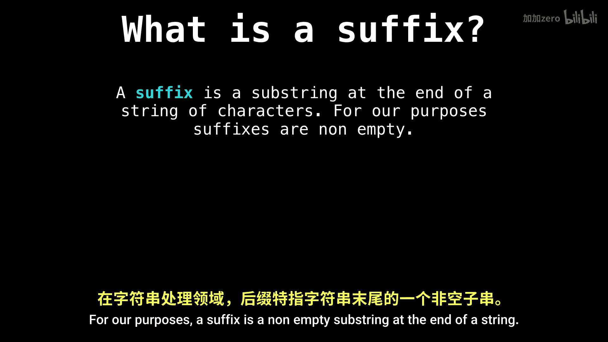
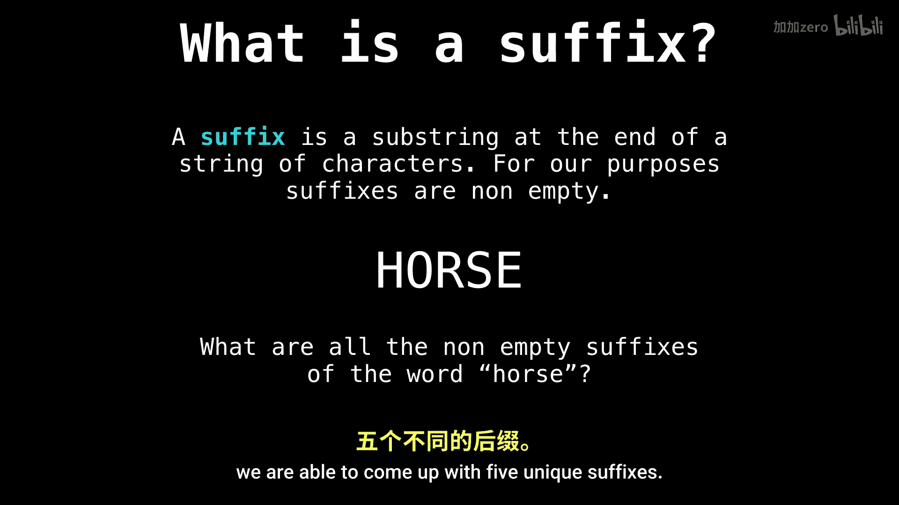
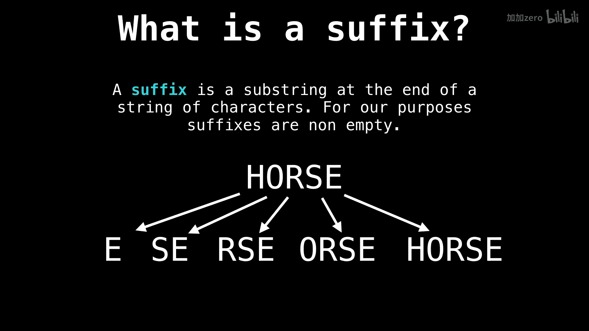
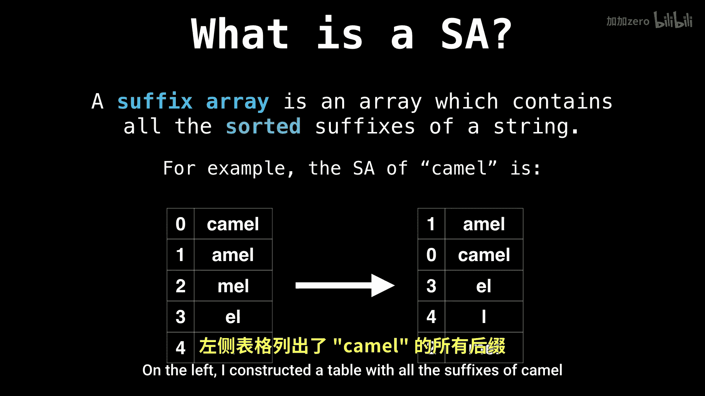

# WilliamFiset【中英⚡数据结构｜Data structures】 p42 P42 Suffix array introduction -BV1M2JXzhEdp_p42-

An interesting topic I want to talk about today is the suffix array。

 This is an incredibly powerful data structure to have in your toolbox when you're doing some string processing。

😊，Suffix arrays are a relatively new data structure appearing around the early 90s due to the heavy memory consumption needs of suffix trees。

Let's start with the basics and talk about just what a suffix is。For our purposes。

 a suffix is a non empty substr at the end of a string。

For example， if we ask ourselves what all the possible suffixes of the string horse are。

 we are able to come up with five unique suffixes。

And they are E， S， E， R， S，E， and so on。

Now， we can answer the question。 what is a suffix array。

 The answer is a suffix array is the array containing all the sordid suffixes of a string。

Let's see an example of this。Suppose you want to find the suffix array for the word camel。

On the left， I constructed a table with all the suffixes of camel and the indices of where that particular suffix started in the string camel。

Then， on the right， hand side。I sorted all the suffixes in lexographic order in a table。

The actual suffix array is the array。