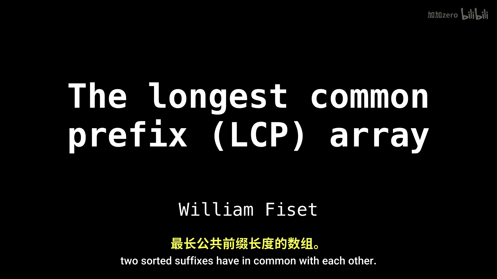
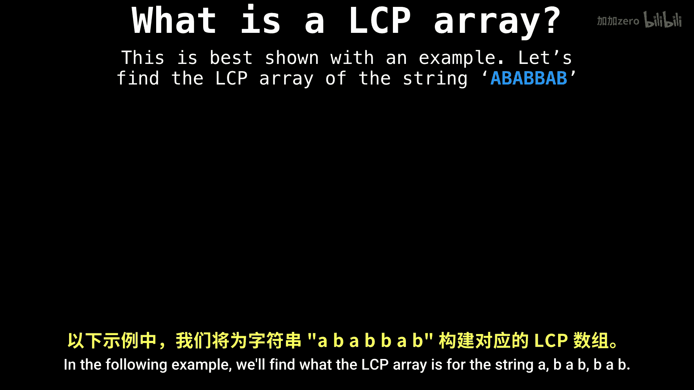
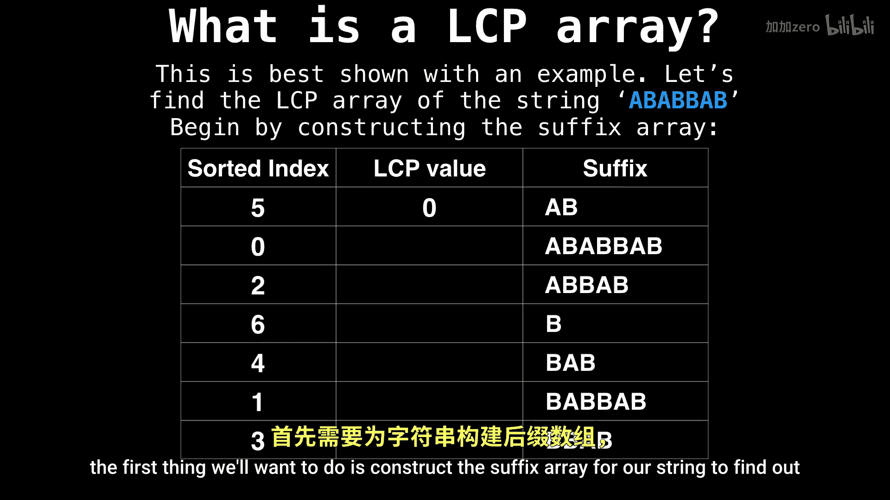
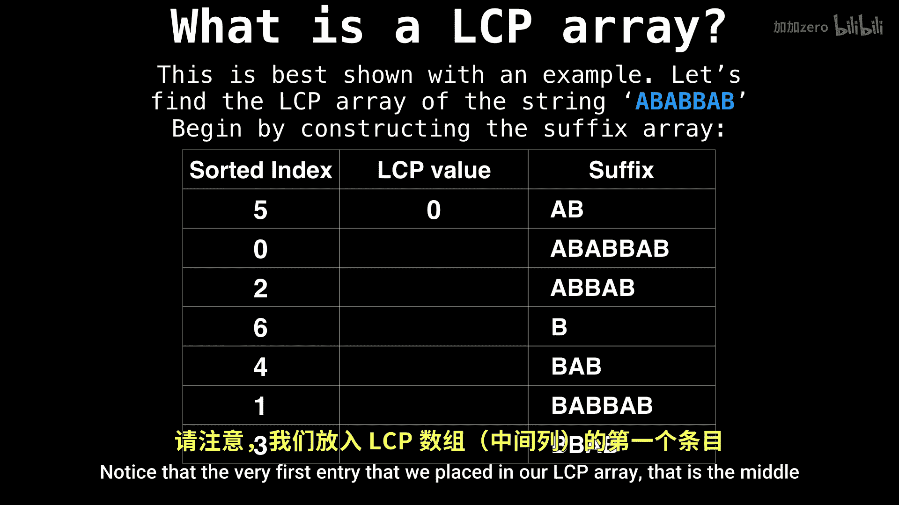
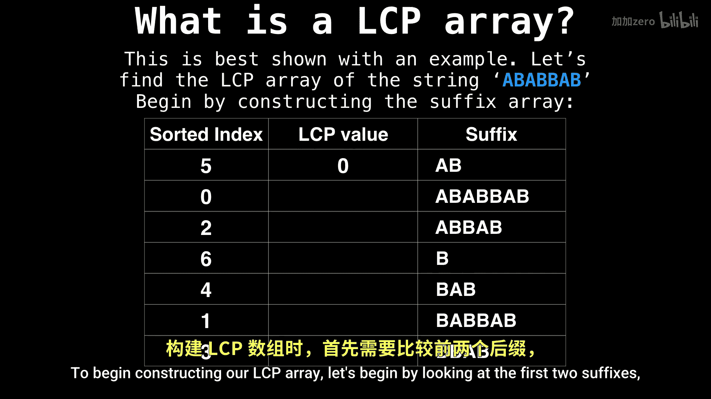
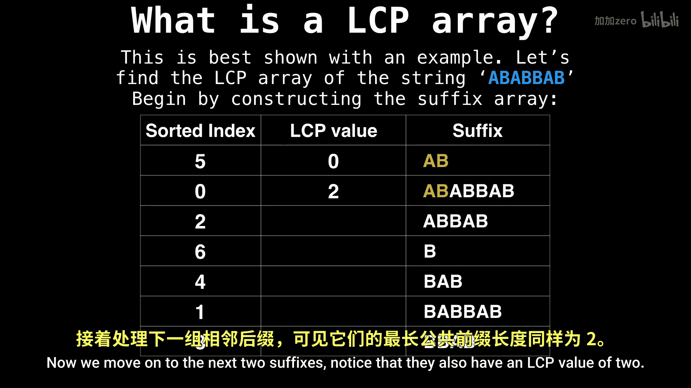
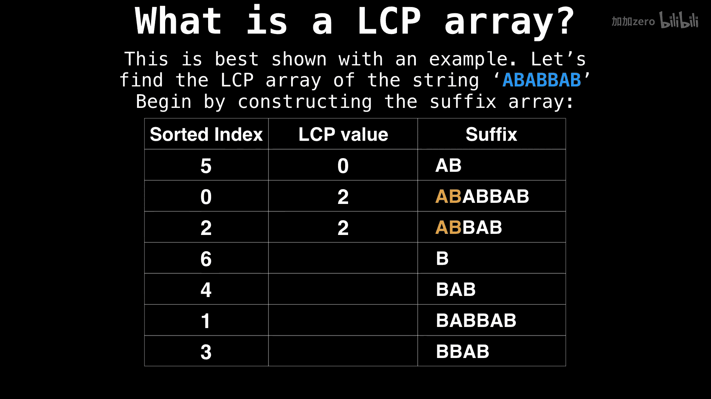
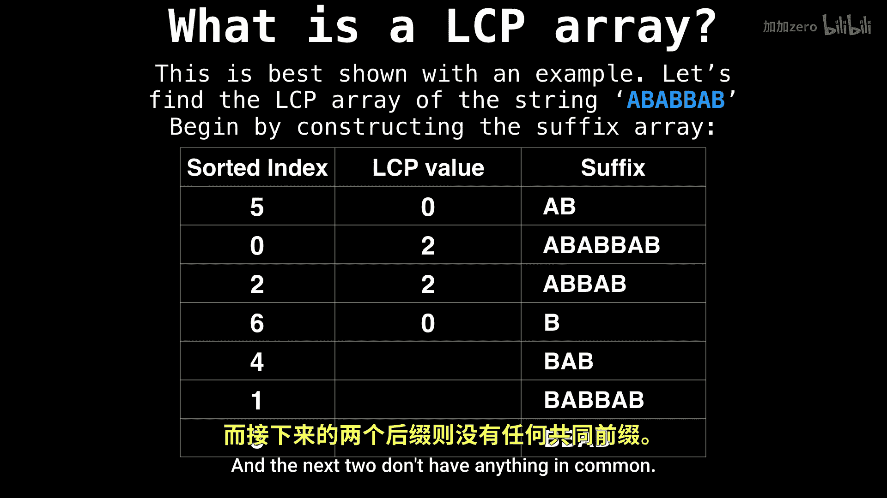

# WilliamFiset【中英⚡数据结构｜Data structures】 p43 P43 Longest Common Prefix (LCP) array -BV1M2JXzhEdp_p43-

Hello and welcome。 In this video， we are going to talk about perhaps the most important piece of information associated with the suffix array。

 And that is the longest common prefix array， also known as the LCP array。😊。

The LCP array is an array where each index stores how many characters two sortded suffixes have in common with each other。

 Let's have a closer look。

Perhaps the best way to show what the LCPRA is is to do an example。In the following example。

 we'll find what the LCPRA is for the string， A， B， A， B， B， A， A B。

The first thing we'll want to do is construct the suffix array for our string to find out what all the sortrded suffixes are。

Notice that the very first entry that we placed in our LCP array。 That is the middle column is 0。

 This is because this index is undefined， so we'll ignore it for now。

To begin constructing our LCP array， let's begin by looking at the first two suffixes and seeing how many characters they have in common with each other。

 We noticed that this is two。 So we place two in the first index of our LCP array。

Now we move on to the next two suffixes。 notice that。

They also have an LCP value of 2。

And the next two。Don't have anything in common， so we place zero。

And the next two only have one。