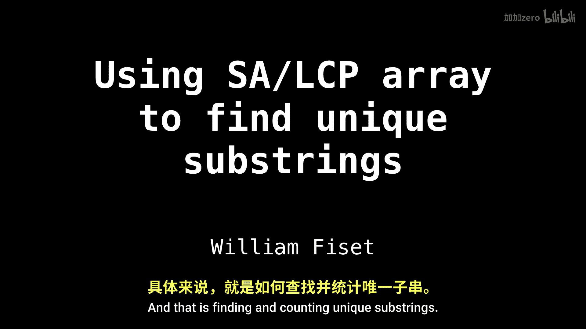

# WilliamFiset【中英⚡数据结构｜Data structures】 p44 P44 Suffix array finding unique substrings -BV1M2JXzhEdp_p44-

In this video， I want to discuss a neat application of suffix arrays and LCP arrays。

 and that is finding and counting unique subs。

There are a variety of interesting problems in computer science， especially bioinformatics。

 that require you to find all the unique substrs of a string。

 The naive algorithm has a terrible time complexity of n squared， which requires a lot of space。

The idea is to generate all the substrs of the string and dump them inside a set。

A superior approach is to use information stored inside the LCPRA。 This provides not only a quick。

 but also a space efficient solution。 I am not saying that this is the canonical way of finding all unique sub strings。

 because there exist other notable algorithms such as rabin carp in combination with bloom filters。

Let's now look at an example of how to find unique substrs。

Let's now look at an example of how to find all the unique substrs of the string， A， Z， A， Z， A。

For every string， there are exactly n times n plus1 over two substrs。 The proof of this。

 I will leave as an exercise。 so listener， but it's really not that hard to derive。Now。

 notice that all the substrs here， there are a few duplicate ones。

I have highlighted the repeated substrs， there are exactly six of them and nine unique ones。

Now， let's use the information。