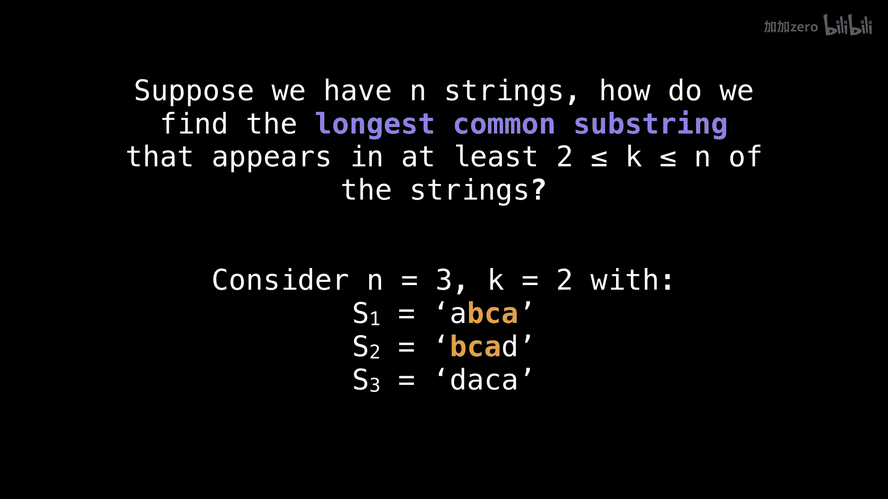
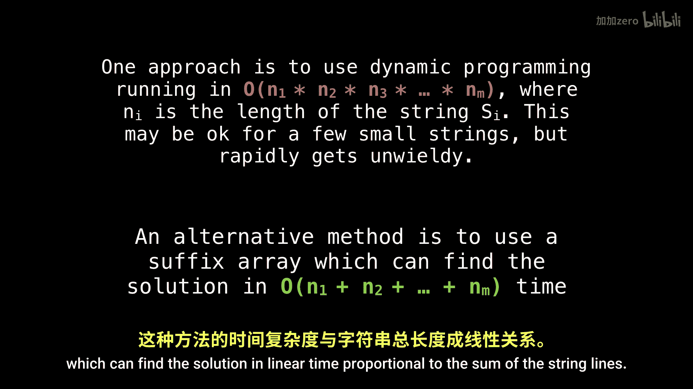

# WilliamFiset【中英⚡数据结构｜Data structures】 p45 P45 Longest common substring problem suffix array -BV1M2JXzhEdp_p45-

There is a really neat problem called the longest common substrate problem， or its generalization。

 the K common substrate problem， which is really what I want to focus on today。

First， let's state the problem and then discuss multiple ways of solving it。

Suppose we have n strings。How do we find the longest common sub string shared between at least K of them with K being anywhere from 2 to n。

 the number of strings。As an example， consider the three strings， S1， S2， and S3。

 with the value of k equal to 2。Meaning that we want a minimum of two strings from our pool of three strings to share the longest common substring between them。

In this situation， the longest common substring is B A。

 but know that the longest common substring is not required to be unique because there can be multiple。

The traditional approach to solving this problem is to employ a technique called dynamic programming。

 which can solve the problem in a time of complexity equal to the product of the string lengths。

Obviously， this method can get unwieldy very quickly。And you should avoid using it whenever possible。

 A far superior approach。 And the way to solve this problem is to use a suffix array。

 which can find the solution in linear time proportional to the sum of the stringlings。

So。