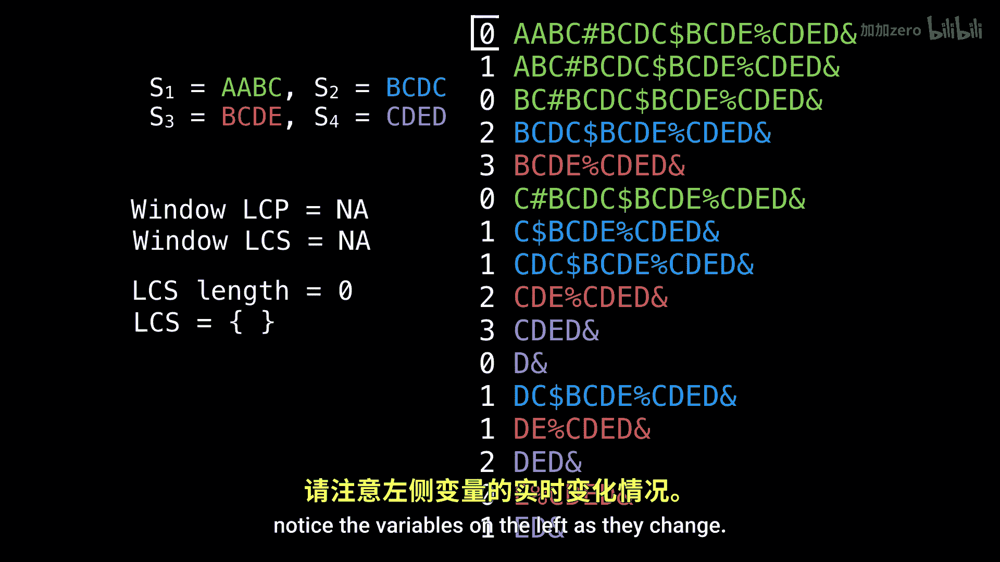
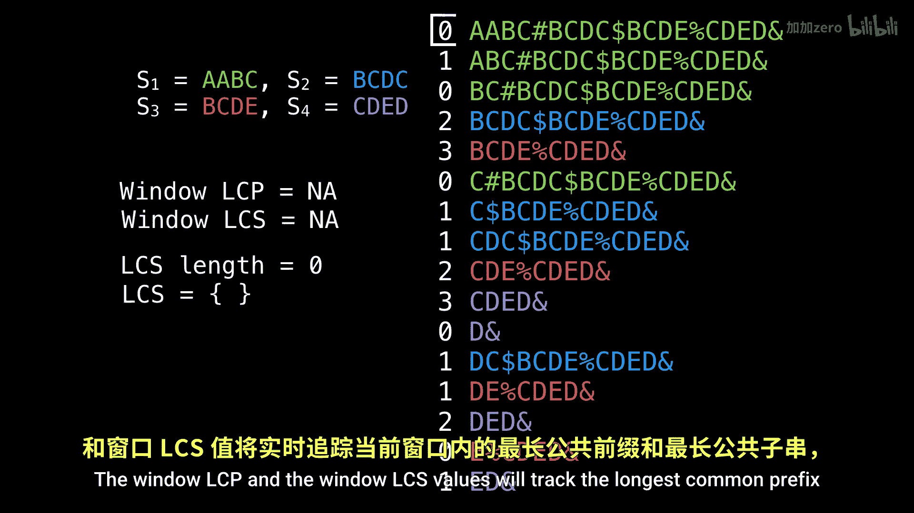

# WilliamFiset【中英⚡数据结构｜Data structures】 p46 P46 Longest common substring problem suffix array part 2 -BV1M2JXzhEdp_p46-

Welcome back。 We're going to finish where we left off in the last video。 In this video。

 I want to do a full example solving the longest common sub stringing problem with a suffix array。😊。

For this example， we're going to have four strings。S1， S2， S3 and S4。

 I have also selected the value of K to be equal to 2。

 meaning that we want a minimum of two strings of our pool of four to share the longest common substring between them。

I have also provided you with a concatenated text we'll be working with。

 as well as the solution at the bottom of the screen in case you want to pause the video and figure it out for yourself。

The first step in finding the longest common substr between a set of our four strings is to build the suffix array and the LCP array。

 which I have displayed on the right side and the left side respectively。

While I will be conducting the longest common substrring algorithm。

 notice the variables on the left as they change。

The window LC CP and the window LC C， S values will track the longest common prefix and the longest common subting values for the current window。

 and the LC C S length and the LC C S set will track the best values so far。 So let's get started。

 Initially， our window starts at the top。 And we want the window to contain two different colors。

 So our rule is to expand downwards。

