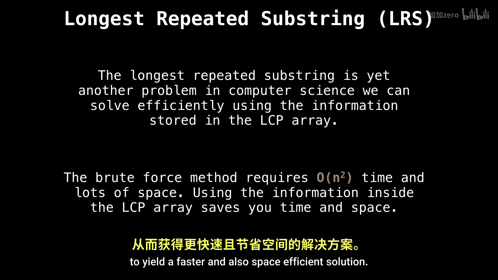
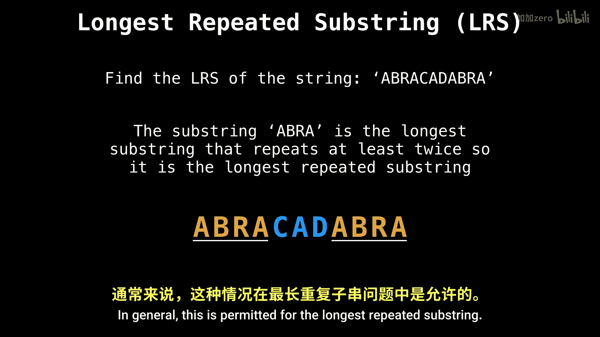

# WilliamFiset【中英⚡数据结构｜Data structures】 p47 P47 Longest Repeated Substring suffix array -BV1M2JXzhEdp_p47-

Welcome back。 Today's topic is going to be on an efficient way to solve the longest repeated sub problem。

The longest repeated subing problem is another one of these fairly common problems in computer science。

 Law of problems can actually be reduced to this problem。

 So it's important that we have an efficient way of solving it。

The naive approach requires n square time and loss of space。

What we want to do instead is use the information stored inside the longest common prefix array to yield a faster and also space efficient solution。

Let's do an example。 What is the longest repeated substr of the string。 Abra cadabra。

 Feel free to pause the video and figure it out yourself。The answer is the substring Abra。

 which is the longest substring that appears at least twice in the string。

 So we call it the longest repeated substr。Here you can see the first instance of Abra on the left。

And now you can see the second repeated instance of Abra on the right。

 Although these substrings are disjoint and do not overlap。 in general。

 this is permitted for the longest repeated substring。

Now， let's solve the problem using a suffix array and an LCP array。

 which I have generated on the right hand side。I'll give you a moment to pause the video and inspect the LCP array in case you notice anything special in relation to the longest repeated substr now that you already know。

