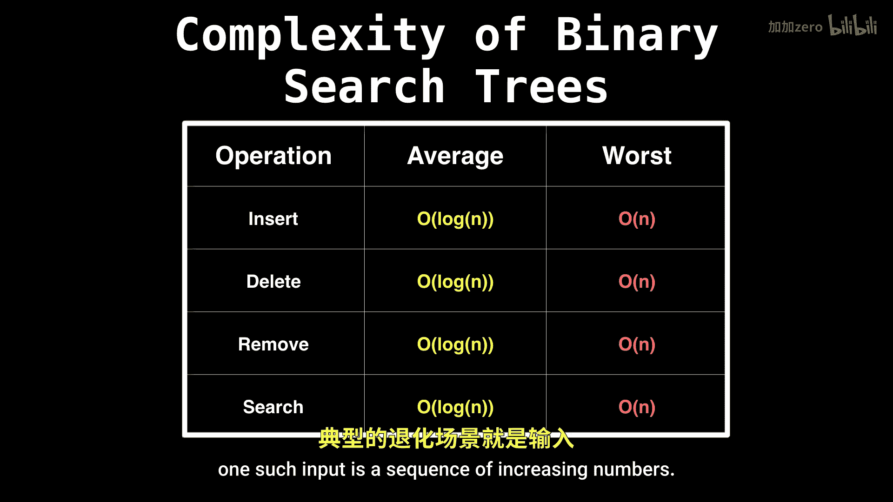
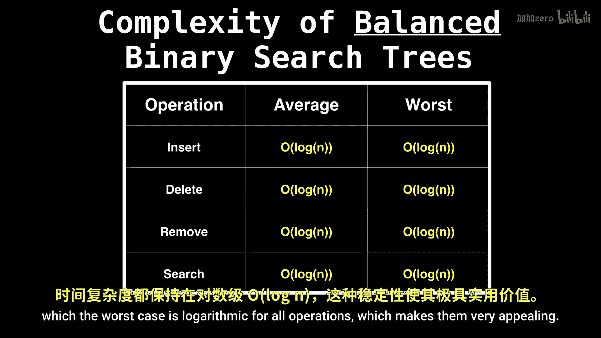
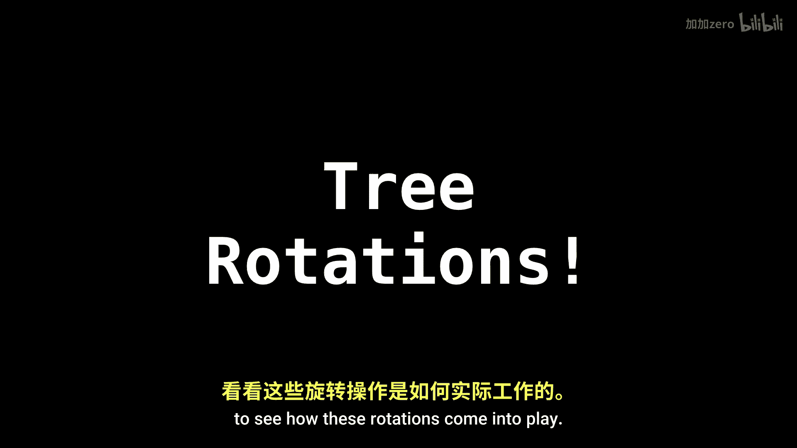

# WilliamFiset【中英⚡数据结构｜Data structures】 p48 P48 Balanced binary search tree rotations -BV1M2JXzhEdp_p48-

Hello and welcome back Today。 I'm going to introduce probably one of the most important types of trees in computer science。

 which are balanced binary search trees。

Balanced binary search trees are very different from the traditional binary search tree because they not only conform to the binary search tree invariant。

 but they are also balanced。 What I mean by balanced is that they are self adjusting to maintain a logarithmic height in proportion to the number of nodes they hold。

This is very important because it keeps operations such as insertion and deletion extremely fast。

 because the tree is much more squashed in terms of complexity。

 a binary search tree has average logarithmic operations， which is quite good。 However。

 the worst case still remains linear because the tree could degrade into a chain for some inputs。😊。

One such input is a sequence of increasing numbers。

To avoid this linear complexity， we've invented balanced binary search trees in which the worst case is logarithmic for all operations。

 which makes them very appealing。

Central to how nearly all balanced binary surgery implementations keep themselves balanced is the concept of tree rotations。

 which is going to be the main topic of this video。 Later。

 we'll actually look at some specific types of balanced binary searchries to see how these rotations come into play。

So， the secret ingredient。