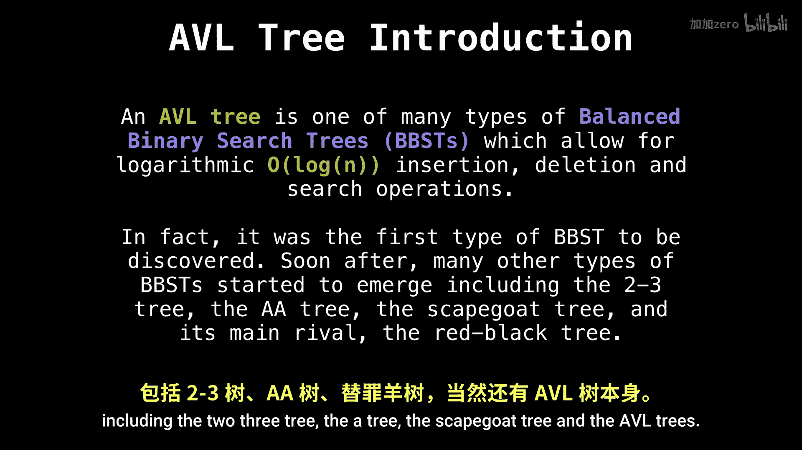
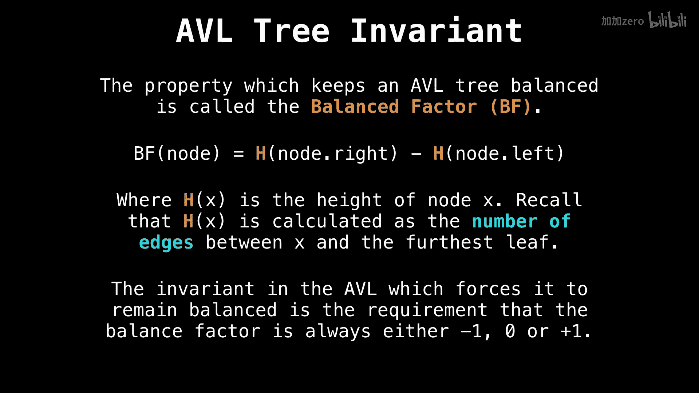

# WilliamFiset【中英⚡数据结构｜Data structures】 p49 P49 AVL tree insertion -BV1M2JXzhEdp_p49-

Hello and welcome back。 Today， we're going to look at how to insert nodes into an AVL tree in great detail。

We'll be making use of the tree rotation technique we looked at in the last video。

 So if you didn't watch that， simply roll back one video。

All right。 before we get too far， I shouldn mention what an avial tree is。

An AVL tree is one of many types of balanced binary search trees。

 which allow for logarithmic insertion， deletion and search operations。

Something really special about the AVL tree is that it was the first type of balanced binary research tree to be discovered。

Then soon after a whole bunch of other types of balanced binary search trees started to emerge。

 including the 23 tree， the Aa tree， the scapegoat tree， and the AVL tree's main arrival。

 the red black tree。 What you need to know about next is the property that keeps the AVL tree balanced。

 And this is the balance factor。 Simply put the balance factor of a note is the difference between the height of the right subtree and the left subtree。

 I'm pretty sure the balance factor can also be defined as the left subtree height minus the right subte height。

 but don't quote me on this。 It would also screw up a lot of what I'm about to say and may also be the reason why a find many inconsistent ideas about what way to do tree rotations on various Google search results pages。

 So for consistency， let's keep the balance factor right。

Subre。