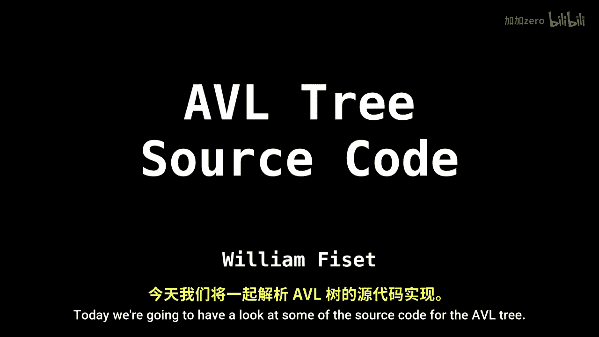
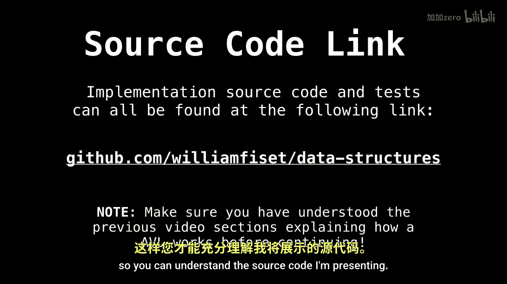
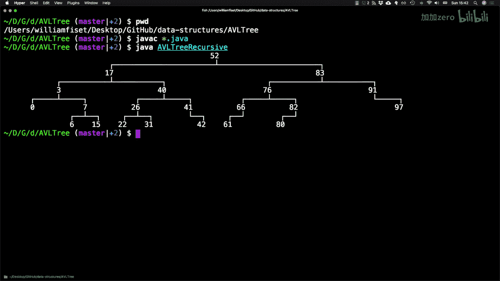
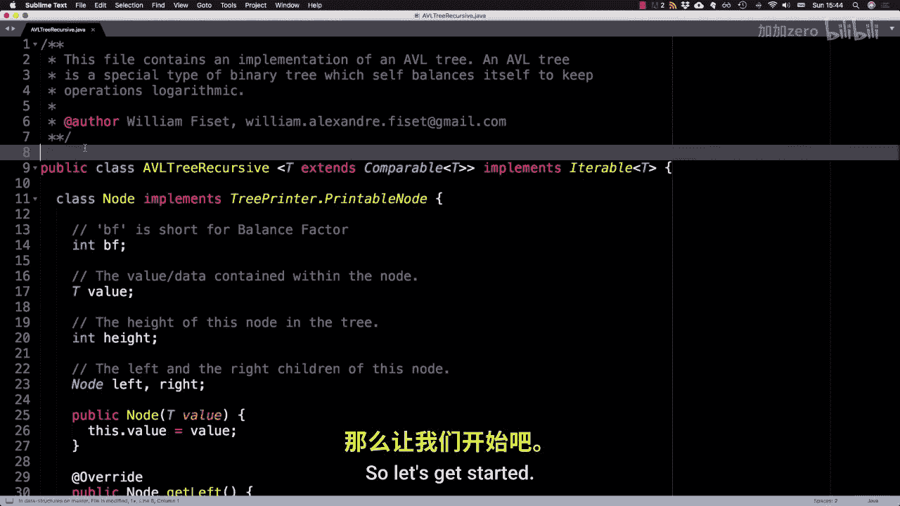

# WilliamFiset【中英⚡数据结构｜Data structures】 p51 P51 AVL tree source code -BV1M2JXzhEdp_p51-

Welcome back today we're going to have a look at some of the source code for the AVL tree。

The link to the source code I'm going to present in this video can be found on Github at Github。

 com sphysia/data structures。 Make sure you have watched the last three videos on the AVL tree about tree rotations。

 insertions and removals in AVL trees before continuing so you can understand the source code I' am presenting。

I don't normally do this， but I'm going to present a live demo of the A VL tree in action。

 So I'm here in my Github reposory。 I'm just compiling some of the Java code for the E VL tree。

 and then I'm going to run it。 And you see that it generated a random tree with some values and notice that the tree is relatively well balanced for the number of nodes that are in it。

So I randomly inserted some notes。And。You might expect the tree to be a bit more sloppy if it were just a simple binary search tree。

 but the AviL tree really keeps the tree quite rigid。

So I think we're ready to dive into the source code now。

Here we are in the source code of a recursive A VL tree implementation and the Java programming language。

So let's get started。 if you look at the class definition for the AVL tree。

