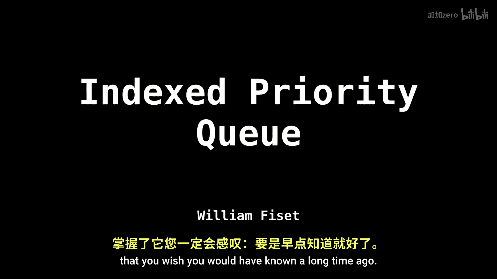
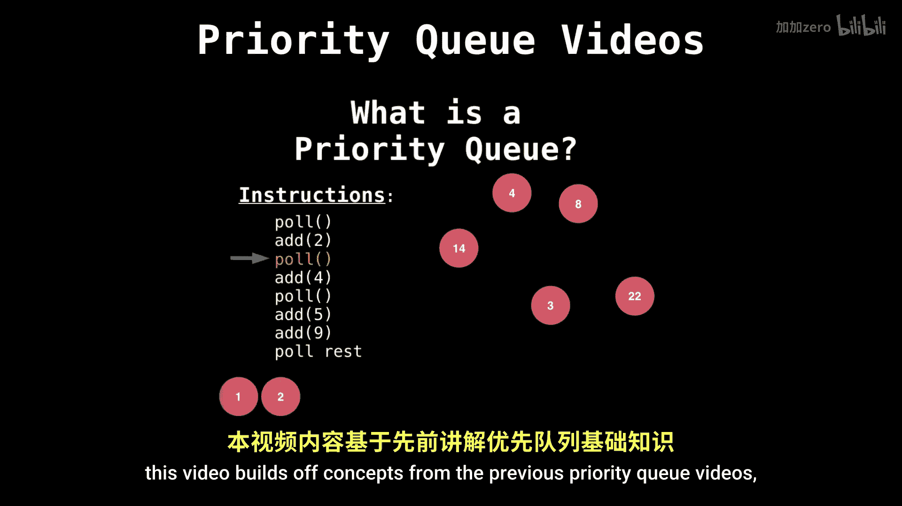
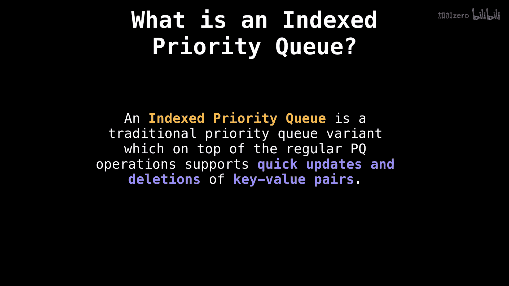

# WilliamFiset【中英⚡数据结构｜Data structures】 p52 P52 Indexed Priority Queue (UPDATED)   Data Structures -BV1M2JXzhEdp_p52-

Hello and welcome。 My name is William， and today's data structure is the indexed priority queue。

 This is going to prove to be a very useful data structure that you wished you would have known a long time ago。

😊。

So just before we get started， this video builds off concepts from the previous priority queue videos。

 which simply go over the basics。 Strly speaking， you can probably get by without watching all those videos。

 as I will be doing a quick recap。 But for those of you who want to know priority queuees in full detail。

 please check out the description for links to those。 So what exactly is an indexed priority queue。

 Well， it's a traditional priority queue variant， which on top of having all the regular priority queue operations。

😊。

Also supports quick updates and deletions of key value pairs。

 One of the big problems that the index party queue solves is being able to quickly look up and dynamically change the values in your party queue on the fly。

 which is often very useful。😊。

Let's look at an example。 Suppose a hospital has a waiting room with N people。

 which need different levels of attention。Each person in the waiting room has a certain condition that needs to be dealt with。

 For instance， Mary is in labor， so she has a priority of 9。 A k has a paper cut。

 He has a priority of one。 James has an arrow in his leg。 He has a priority of 7。

 Naida's stomach hurts。 She gets priority of  three。 Richard has a fractured wrist。

