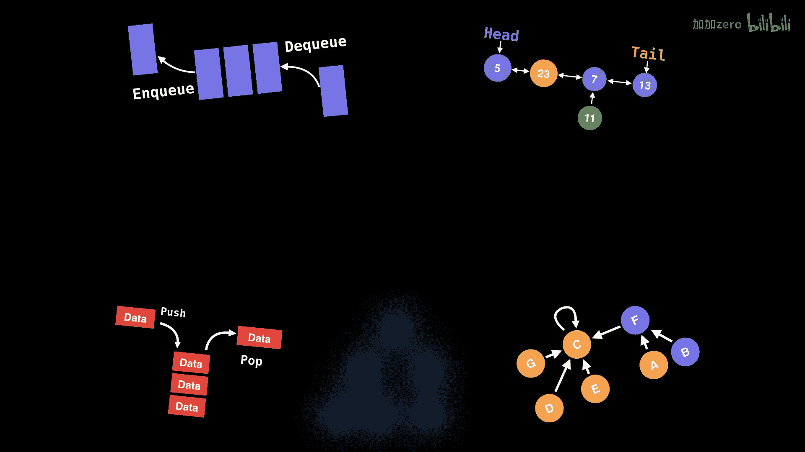
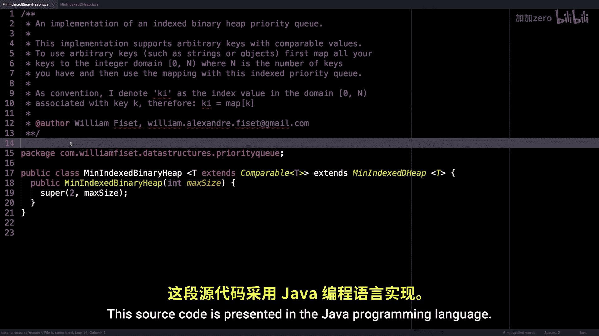
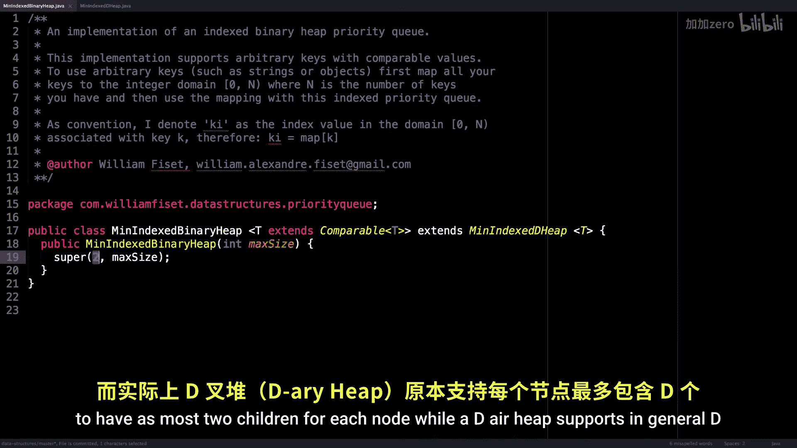
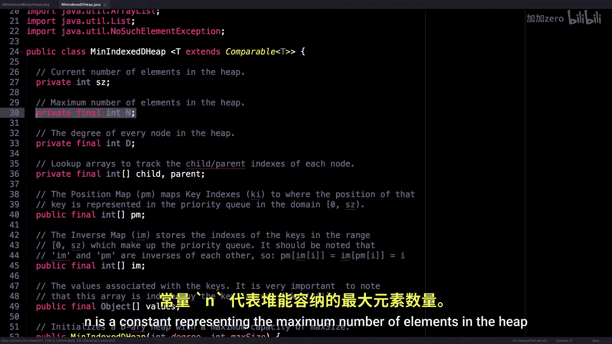
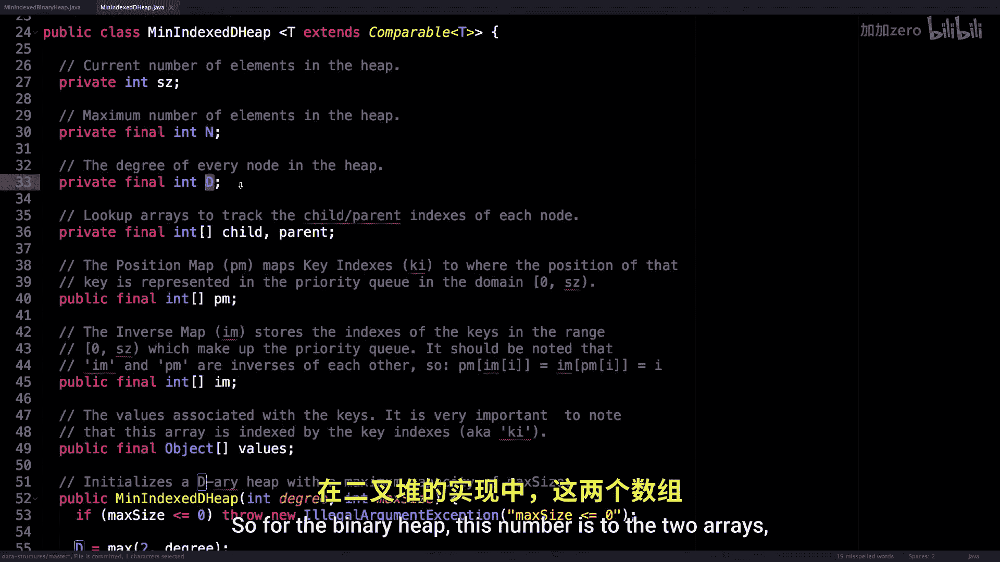

# WilliamFiset【中英⚡数据结构｜Data structures】 p53 P53 Indexed Priority Queue   Data Structure   Source Code -BV1M2JXzhEdp_p53-

Hello and welcome back Today we're going to look at some source code for an indexed priority queue So just before we get started make sure you watch my video on the indexed priority queue where I go over the implementation details and why an index priority queue is an important data structure All the source code for this video can be found on my data structuress repository at Github。

 co swillingfette/ data structures the link can be found in the description below。

Here we are in the source code for a min indexed binary heap。

 This source code is presented in the Java programming language to get started。

 notice that our min indexed binary heap requires that we pass in a type of object。

 which is comparable。 This is so we can order our key value pairs within the heap。

 You'll also notice that I'm extending a mint indexed D heap。 This is just to be more generic。

 And all I do in the constructor is simply initialize this heap to have at most two children for each a node。

 While a D heap supports in general D children。 So let's look at the D heap implementation where all the fun stuff is happening。

So let's just go over， I guess， all the instance variables。

 So S Z is just the number of elements of the heap。 N is a constant。

Representing the maximum number of elements in the heap， D is the degree of each node。

 So for the binary heap， this number is 2。

