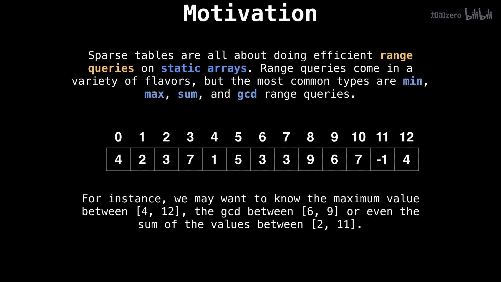
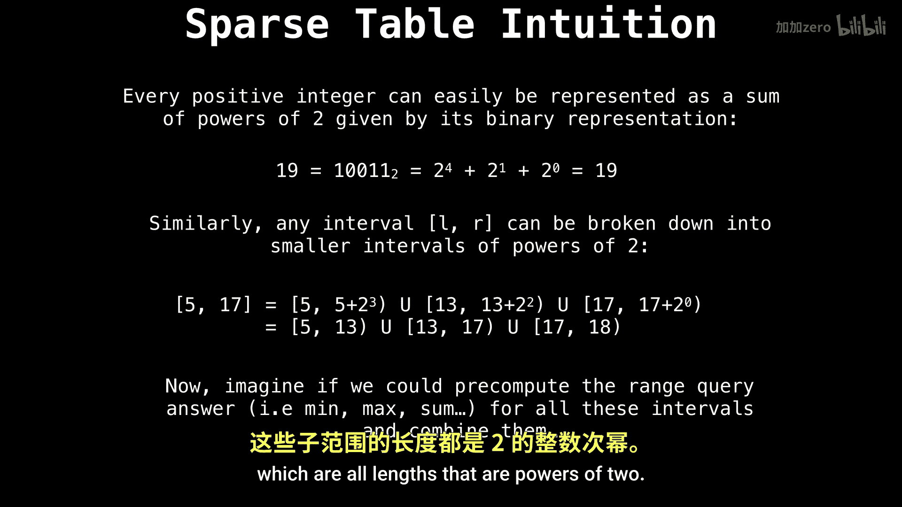

# WilliamFiset【中英⚡数据结构｜Data structures】 p54 P54 Sparse Table Data Structure -BV1M2JXzhEdp_p54-

Hello and welcome。 My name is William， and today we're talking about Sprse tables。

 a niche data structure with a great time complexity when answering range queries on static arrays。

Al right， let's talk about the type of situation you might want to use Sprsetable。

 So sparse tables are all about doing efficient range queries on static arrays。

 So the typical use case is when you're dealing with。

 say an integer array that has immutable data that does not change。

 some common types of range queries that you often want to know are things like finding the minimum value in a certain range。

 maybe finding the sum of all the values in a certain range or the product of all the values in a given interval。

 et cetera。

So I want to give you a brief intuition on how a sparse table works at a high level without getting into too many details。

So if you think about any positive integer， you know that it can easily be represented as the sum of powers of  two given by its binary representation。

 For example， the number 19 in binary is 1，0，0，1，1。

 which is equivalent 2 to the power of 4 plus 2 the power of 1 plus 2 to the 0。Similarly。

 we can break down an interval with a left and a right end point into ranges。

 which are all lengths that are powers of two。

For instance， the range between 5 and 7。