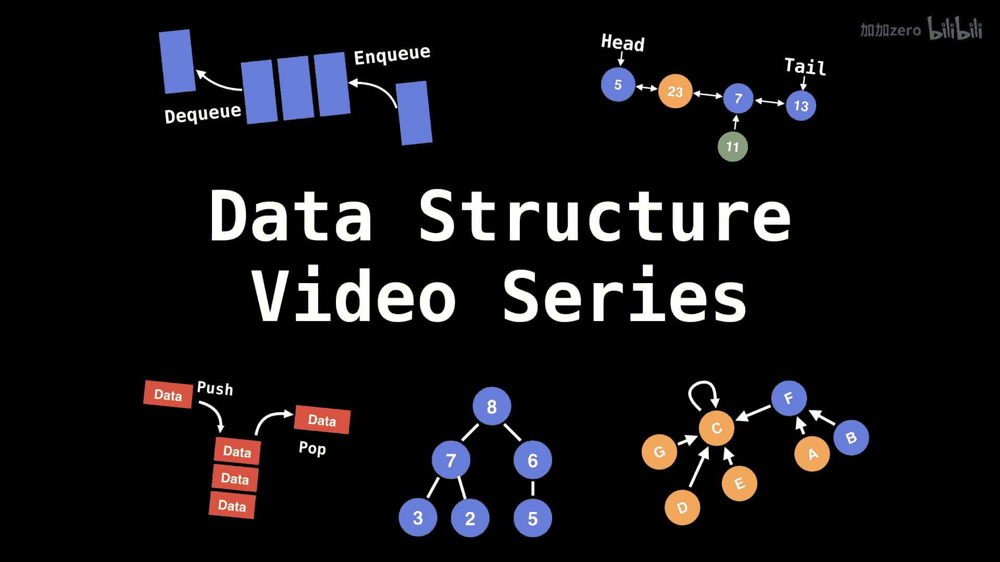
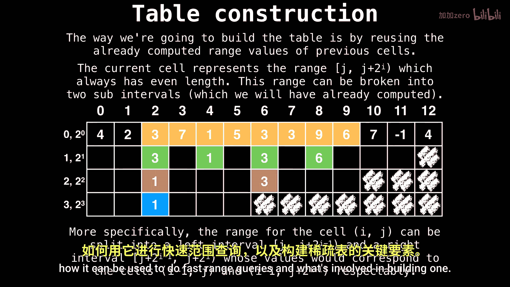

# WilliamFiset【中英⚡数据结构｜Data structures】 p55 P55 Sparse Table Data Structure   Source Code -BV1M2JXzhEdp_p55-

Hello， everyone。 My name is William。 Today， we're taking a look at some source code on how to implement a spae table。

In the last video， we looked at what a sparse table is。

How it can be used to do fast range queries and what's involved in building one。

This video is a follow up to that video， so make sure to give the other video a watch before proceeding。

 I'll make sure to put a link in the description below。

Awesome， so here we are in the source code written in Java。 In this header。

 I put some instructions on how you can download this code and run it yourself。

This particular implementation I'm about to show you is for a min sparse table that can do minimum range queries only if you want to do any other type of range query。

 such as a max range query or a product range query， you will need to modify this code。

I also have another more generic sparsetable implementation on GitthHub。

 which supports various types of range query operations if that is of interest to you。

Right here in the main method， I have a few examples of how this script works。 First。

 you start out with an array of values， then you feed that array to the minimum sparse table class。

 And afterwards， you can start doing minimum range queries In the first example。

 I query the minimum element in the range 1 to 5 inclusive。

 which prints the answer negative 3 with an。

