# freeCodeCamp.org【中英⚡动态规划｜Dynamic Programming - Learn to Solve Al】 -BV1hkFkz9E2b-

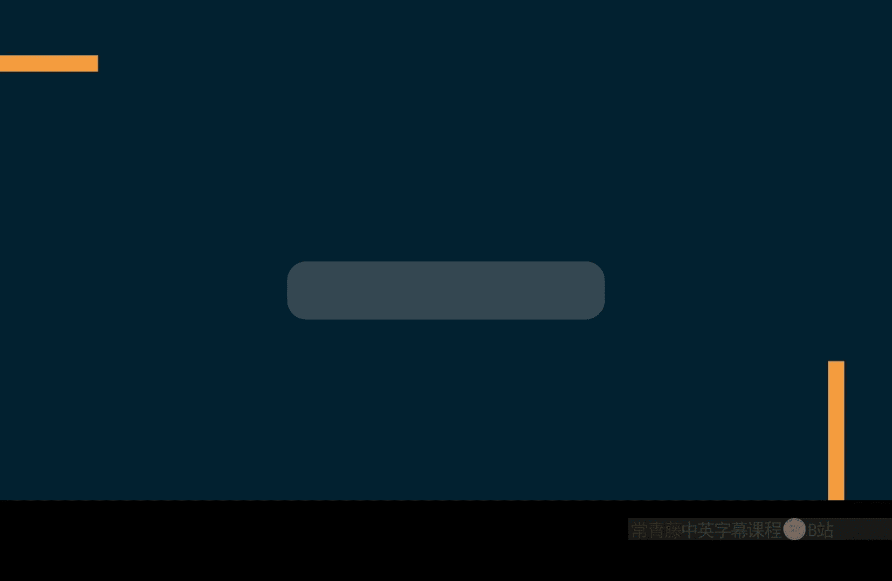

Hey， programmers， I'm Alvin， welcome to our course on dynamic programming。

 So dynamic programming is one of my most favorite topics to teach。 But unfortunately。

 I feel like dynamic programming also has a reputation for being a very difficult topic That being said。

 I think dynamic programming can be very intuitive。

 if we actually take a nice gradual progression through the material right A lot of students have this habit of just trying to attempt a pretty hard dynamic programming problems without going through the necessary steps of really understanding the material right It goes without saying if you want to do well in those data structure and algorithm interviews。

 you definitely need to know dynamic programming。 So I hope to give you all of the background knowledge you need to really crush those types of problems。

 Now That being said， what problems are we going to solve throughout the course。

 Here are a few examples So one question I can ask you is to calculate the 40th number of the Fibonacci sequence seems like a very easy problem。

 can also ask you to count the number of different ways to move through a 6 by 9 grid or something different like given a set of coins。

 how can we make 27 cents in the least number of coins。😊。

A final example would be given a set of substrings。

 where are the possible ways to construct the string potent pot and all of these questions really fall under the umbrella of dynamic programming。

 And this is really why I think the topic has such a bad reputation or being very difficult because the problems range so much It looks like these problems are totally different and there may not be any underlying mechanic that we can use to tackle all of them。

 But the short answer is we really can if we have the correct way of thinking about these problems。

 That being said let's go over the overall formats of this course And this course。

 I think oura Victor is going to be to really visualize all of these algorithms So we're going to spend a lot of time drawing things on the whiteboard as well as visualizing things with animations to me。

 all the heavy lifting on an algorithm interview is really done when you come up with that picture when you describe that process and then translating it into some code is really the easy part the hard part is designing the algorithm in the first place So we're going draw of。

😊。

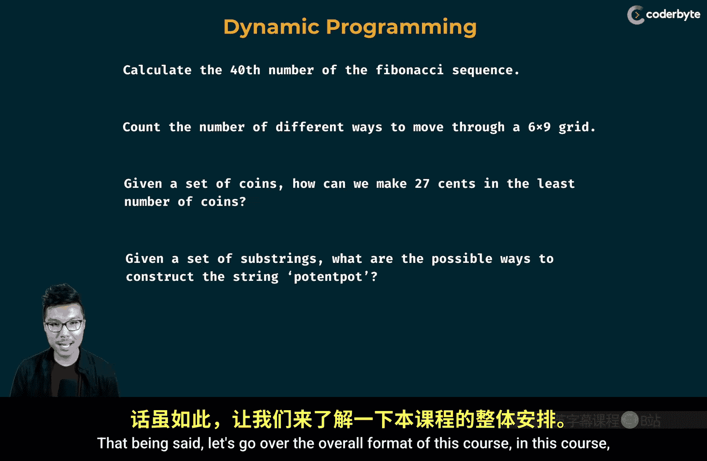

To make sure we understand the structure of the problem， as well as coming up with a solution。

 And then once we're really happy with that pen and paper process， then we'll hop into my。😊。

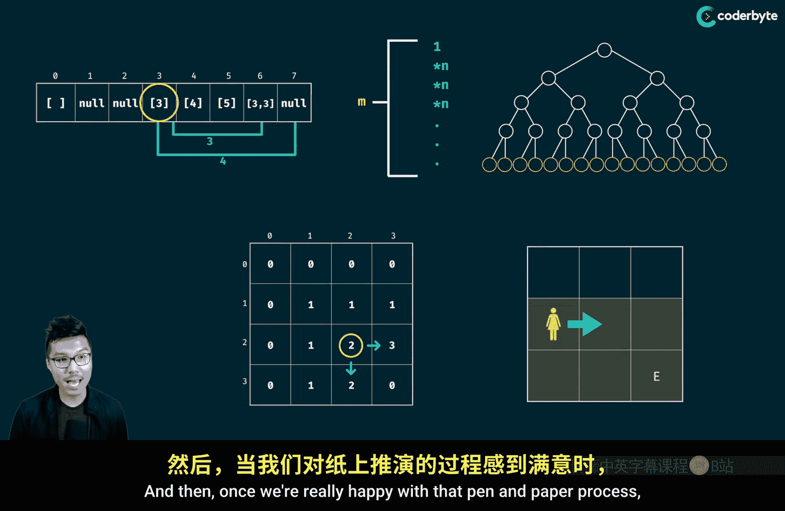

Ediittor and we'll solve it in some code will'll probably have to go back and forth until we end up with an algorithm that runs in an efficient amount of time。

 right So it goes about saying we're also going to analyze the time and space complexity of all of our solutions。

 I'll be writing my code and ja， but you'll find it very easy to translate our solutions into the language of your choice。

😊。

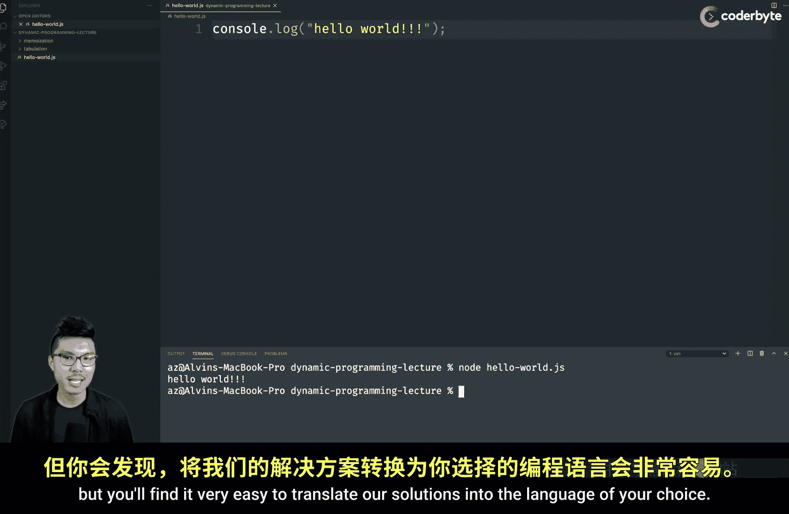

So in this course on dynamic programming， we're going to divide the material into two main parts。

 Part1 is going to be about memorization and then part two is going to be about tabulation and don't so edit it if you have no idea what those two terms refer to don't worry we'll reach all of that material step by step together。

 I think you're going to realize if we actually learn these things in a very logical progression where're almost like discovering these algorithms and I don't just have to tell us what the algorithms are So in terms of prerequisites。

 I won't assume you know anything about dynamic programming but I will assume that you understand a little basic recursion as well as some basics of complexity analysis right so you're sort of familiar with biggo notation and I'm sure that we be able to review some of that notation as we move along。

So I think with all that out of the way and no further ado， let's hop into the course。

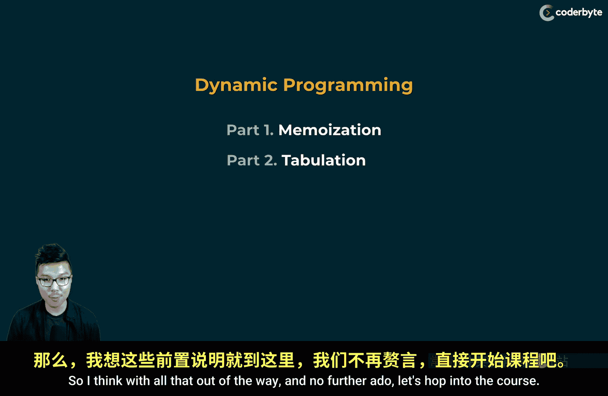

Alright， so where should we start？ Well， I want us to really ease into this new topic。

 And so what we'll do is we'll start by attacking a problem that you've probably seen in the past。

 That is， I want to solve a Fibonacci problem。 And so for us。

 we'll have a particular phrasing of the Fibonacci problem。

 What I want to do is write a function fib of n that takes in a number as an argument。

 And I need to return the n number of the Fibonacci sequence。 And just to review。

 how does a sequence work。 Well， the first and second number of the sequence is just one。

 And then at any point in time to generate the next number of the sequence。

 you can just sum the previous two。😊，So for example。

 these are the first few numbers of the Fibonacci sequence right It starts 1，1，2，3，5，8 and so on。

 What I'm saying is your number needs to take in like a position of the sequence。 In other words。

 if I ask you for the seventh Fibonacci number you need to return the answer 13 right because the seventh Fibonacci number is 13 and how do we actually calculate that 13 Well。

 logically it's just a sum of the previous two elements that is5 plus 8 gives me the 13。 So very。

 very classic function here and to really get us going for what we do later on in the lesson。

 I'm going to require us to solve this one recursively right。

 it's really going to be at the heart of a topic for today。

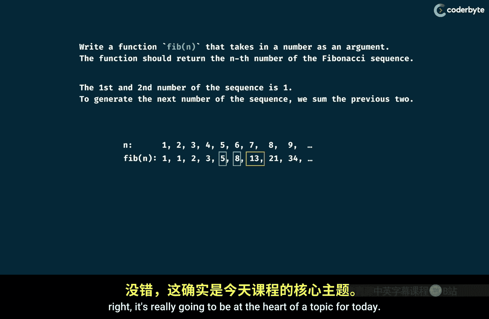

So why don't kick things off by quickly implementing the classic recursive implementation of a Fibonacci function Probably written this function a few times in your program career。

 usually one of the earliest examples of recursion that we face So we'll just lay out the classic implementation here So I want to take in a number n and I want to return the n number of the Fibonacci sequence like we expect the base case is just about know the first two numbers of the sequence。

 In other words， if I'm given some n that's less than or equal to2 then what I should do is just return one and I'm writing this because hey。

 the first two numbers of the Fibonacci sequence are exactly one but in the recursive case in general。

 what I can do is just return the sum of the Fibonacci number right before。

 the one I'm asking for as well as the Fibonacci number to before。

 the one I'm asking for right again， the kind of baked in recursive nature of Fibonacci is to calculate some Fibonacci number you can take these sum of the previous two numbers in the sequence right and of course we should test our over some correctness what I'll do is call a few examples of this。

So I'll try Fb of 6，7 and 8， and I shouldt get the answers of 8，13 and 21 respectively right。

 So let's give this a go I'll run this in some JavaScript。There I have it right 8，13 and 21。

 So this is a very， very classic implementation of Fibonacci。

 you've probably seen this many times before and we did solve it recursively and really what I want to do is give some larger number to this fib function。

 So when if I asked for let's say I don't know the 50th Fibonacci number seems like something reasonable to ask for So if I give this code a shot looks like the first three calls to Fibonacci do work fine right I get 8。

13 and 21 but the fourth calls actually still running my program actually hasn't finished and this is a big issue with this type of implementation with Fibonacci So obviously this Fibonacci function needs some work。

 let's go ahead and head to the drawing board。

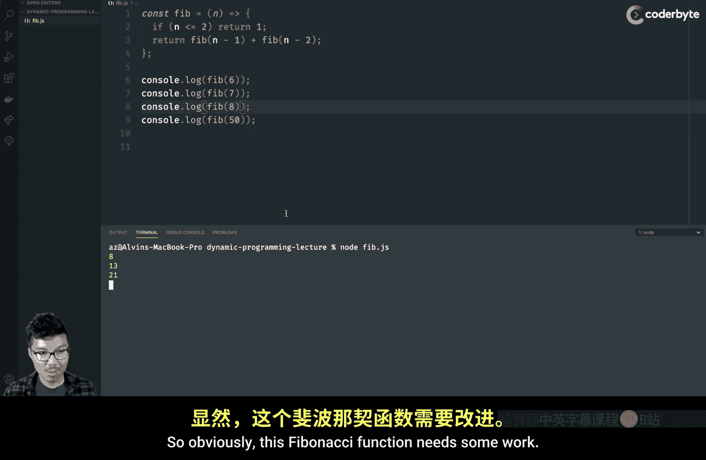

Allright， so it's apparent that our Fibonacci function is correct in that it returns a proper result。

 However， if we give it a large enough value of n， it's pretty slow。

 That is our function has correctness， but lack some efficiency。 in the long run。

 we definitely want to improve this implementation of a recursive Fibonacci。 But to do that。

 it's really important that we identify exactly where there is even room for improvement。

 And to do that， I think we should draw some things。

 This is something I think students actually need to work on。

 students have this habit of trying to like picture everything in their mind。

 And that works for some easier problems。 However， when we want to tackle more complex problems。

 if we just try to capture all this information just mentally without drawing it on pen and paper or marker and whiteboard or chalk and chalkboard。

 you're going really lose track of the finer details in these structures。 So I want us to be very。

 very methodical and we're going to draw or really how you should visualize a problem like Fibonacci。

😊，And so over to my drawing， let's say that I wanted to trace through what happens when we call fib with the number 7。

 That is I'm asking for the seventh number in the Fibonacci sequence。

 I know that in the long run and I should get back a 13 right 13 is the seventh number in the sequence。

 So I'll keep that goal in mind。 But over to my drawing。 Let's say I called fib of 7。

 I'll to note that by really drawing just a circle with my value for n inside。

 So if I think about this call to fib of 7。 What is it going to do。 Well。

 I know that 7 is not the base case right 7 is not less than or equal to 2。

 So this call is going to branch out into some more recursive calls in particular on its left hand side。

 I'm going to call n-1， which is 6 on its right hand side， I'm going to do n -2， which is 5。😊。

And at this point， I carry over the same logic for the other nodes of the structure。

 if I look at the six node， if I'm rooted right there， then that will have a left child of -1。 So 5。

 It will also have a right child of -2， So4。 It can start to see a pattern where really this recursive structure just visualizes as a tree。

 which is really neat。 if I hop over to this five node。 It too will have some children right。

-1 on its left， -2 on its right。 And we will actually just continue this process for most of these nodes。

😊，But let's say we pause right here so you'll notice that these nodes that I have pointed to in red they are actually the base case right for those nodes I have values of two or1 and I know that those function calls will return immediately more importantly that means they don't branch into any further calls so I don't want to start flushing off the tree out of those nodes instead I'll look at things that are not the base case right that is these nodes in yellow so I'll continue to flush out this tree but not branch out further for the base cases。

😊，So at this point， I built out my entire tree and I stopped flushing out the tree whenever we had a base case scenario。

 So this is actually the full recursive tree。 Remember that the numbers inside of the nodes here represent the n that we passed in。

 That being said， if we have this visualization， how does this tree really calculate the Fibonacci answer right So let's start to break it down over here。

 Let's say I looked at some node in particular， this base case node of two right I know that this node is a base case。

 So it's going to return the value of one， according to my base case。 When we say a return。

 that really just means return to your collar right， return to your parent。

 So this node of two is going to return one to its parent of three。 in the same way。

 this node on the right hand side of one is also a base case， it two will return one。😊。

Both of those values that are returning， they go back to the parent of three and three is actually going to add those two values up1 plus1 is2。

 and this makes a lot of sense because we know that the third Fibonacci number is2 so if we can continue this process if I look at this note over here。

 this is also a base case so it returns one。And now the parent node of4 is going to sum up both of its children values。

 2 plus1 is 3， and that makes sense in itself because the fourth Fibonacci number is 3。

So you probably got the picture Now。 Let's speed things up for all of these base cases。

 I know that they're going to return one to their parent and for all parent nodes that have both of their children ready。

 That is both of their children returned， they're just going to add up those values and this process just continues all the way up the tree right。

 just adding our left and right children to get the answer that we should return the very top of our tree at the root of our tree。

 we get the final result of 13， which makes a lot of sense because at the start we said that hey。

 the seventh Fibonacci number is indeed 13。😊，So now that we have a robust understanding of how to visualize this fib function。

 what do we actually know about its speed， What do we know about its time complexity and so you may have heard offhand people mention that a classic recursive implementation of Fb is going to be2 to the n and time complexity and that is the case however you really understand the reason why So hidden in this picture is the reason why Fibonacci for us is going to be2 to the n in terms of its time complexity however something that's kind of unfortunate about this drawing is it's asymmetric and that's I think a big reason why students have a really hard time convincing themselves that a function like this has a two to the n power time complexity so here's what we'll do why don't we warm up and kind of go through some basic understanding of time complexity and I promise we'll answer that Fibonacci question So let's do a warm up let's say that I gave you this fo function noticeice that it's different from our fib function right it's similar in that recursive this function is kind of arbitrary it actually doesn't calculate or solve any particular problem。

So if I wanted to visualize how this fo function behaves， let's draw it out。

 let's say I initially call at the top level F of5。 I know5 is not a base case。

 so it's going to call upon n minus1 or it's going to call upon four calls3。

3 calls2 two calls1 and then here we've actually bottomed out at a base case If I look at the number of calls I made I basically made exactly five function calls。

 which makes sense because in terms of our base case we stop once we hit a number less than equal to1 and in every recursive step。

 we just subtract one from our current value of n So overall I have five calls here。

 but if I generalize that for any arbitrary input， I know that in the long run I'm going to have about n different function calls recursively and so for that reason the time complexity of this is really just o of n time I have to evaluate o of n different function calls while we're at it why don't take a look at the space complexity Well you may have heard in the past that when we analyze these space complexity of our recursive functions we should include any of the additional stack space that are function calls take up。

When we make a recursive call， we add that to the call stack and those must be tracked by our computer and so since we have about five or n different function calls added to the stack before we hit our base case。

 we can say that the space complexity of this code is also O of N space overall we're looking at O ofN time and O of space for this V function pretty straightforward stuff right let's look at another more involved function。

So let's say I gave you now this bar function。 It's another arbitrary function。 It's very。

 very similar to fu， which you should notice is the only difference is when we make a recursive call。

 we do an n minus2 instead of an n minus1 So how does that actually change the time complexity of this function。

 So let's say I wanted to trace through this and I made a top level call to bar of6。

 I know6 is going to call upon44 is going to call upon2 two call 0 and 0 actually hits a base case So this is very similar to our last example except we kind of see that from one call to the next we kind of take a bigger step in time right And so in a way we can say that we're moving twice as far upon every recursive call and this would actually half the number of recursive calls we need overall So I guess we might be tempted to say that the time complexity of this one is n over two time but a key observer would note that according to our big O understanding we can remove any multiplicative constants when we have a time complexity So n over two is the same as one half times n So this simplifies nicely it's just an o of n time complexity。

Using the same exact argument， we can also say that the space complexity from the stack is also o of n space。

 Allright。 So let's take a lay of the la。 I showed you two functions that are very similar。

 They really only differed in how they made their recursive calls one did-1， the other did-2。

 But in the grand scheme of things。 we saw that they had an identical complexity class。

 We have o of n time and o of n space for both of these functions。 So after these two examples。

 you may be able to see the reason I wanted to bring them up。 right。

 maybe you're actually ready to make the logical leap and make some conclusion about our classic Fibonacci recursive function。

 That being said， I don't want to skip any steps， I want to be super methodical。

 I think if we pay the cost of understanding Fb right now。

 And I mean truly in absolutely understanding fib， it's really going to pay off later on in the lesson。

 when I slam you with some much harder problems。 So let's be nice and methodical over here。

 Let's take a look at some other functions。 Let's say I gave you this dib function now。

 very particular name， pay it no mind。 What do we notice about this didb function。 Well。

 it has two recursive calls。😊，Right inside of every single call and they both do an n minus1。

 How should we visualize this one Well， it's kind of similar to。

 I guess our initial fib drawing in shape where if we start with some initial call。

 let's say55 is going to branch to exactly two children because five is not yet the base case and for this didb function it does a minus one on its left and also it's a right child so the next level is just four next level is just threes then twos then just ones which would actually hit our base case over here this is a really nice and like beautifully symmetric tree right so this is the visualization for our dib function but what does it tell us about the time complexity of it something you'll hear me say a lot in this lesson is when we tackle a quote unquote new problem or new pattern we're really trying to do is just leverage our past experience right So when I look at this tree structure I'm trying to notice anything familiar iss there some strand over here that I can grasp at to really feel comfortable and kind of extend my previous learnings where can I find our base inside of this drawing。

Bop right here。 So if I look at this path I have highlighted in yellow。

 it's really just the path starting at the root node going down to some base case here。

 I just designated the leftmost path and what's really nice about this structure is just referring to the nodes in yellow It's all in your structure that we saw before if I start at the root。

 it just goes 5，4，32 and1。 And so I know that in general。

 based on my initial input of n like the length of this path that is a number of nodes highlighted in yellow iss going to be about n different nodes。

 If I kind of adapt that language for like the tree。

 I can also say that the height of this tree is n So the height of a tree is really just the distance from the root node all the way to the farthest leaf in this case that just means the distance from our top level called5 all the way down to a base case。

 which is going to be exactly5 here something you may also here in passing is we can say that the number of levels and this tree is also n this term is pretty straightforward when we say the number of levels。

 a level is just a collection of nodes that are the same。😊，way from the root。 So for example。

 here in yellow， I have highlighted level 0。 This is level 1。 This is level 2。

 this is level 3 and so on。 But if I rewind things a bit。 if I look at the very， very top level。

 there's one node here on the next level， there's two nodes。 on the next level， there's four nodes。

 then8 nodes。 then 16 nodes。 See the pattern。😊，So let's try to generalize that。

 So I know no matter what whenever we call some top level argument for dib。

 we know that we're gonna to have one node at the top level。

 but to get the number of nodes on the next level， oh just multiply that by 2 and the level after that would also multiply by 2 and multiply2 again for the levels after that。

 And I do this a total of n different times right because I know that the height of the tree or the number of levels in this tree is exactly n And so what conclusion can we make over here we're basically saying that to get the total number of nodes or the total number of calls a recursive function would make you would just take the number two and multiply it by itself about n times over。

 And that is really the definition of an exponent right this is the same as two to the n power And so we can say that this tree structure or this recursive function has a  two to the n time complexity。

 Asome。😊，So we identified this dip function as having a two to the end time complexity。

 But what do we know about the space complexity over here。

 I think a common mistake I've seen people make is kind of automatically assume that the space complexity of a recursive function will be the same as the time complexity。

 and that might be a reasonable trap to fall into because we know that in the long run we're going to have to evaluate two to the end function calls。

 And so I guess that means we have to put two to the n function calls on the stack。

 But there's actually some nuance to this。 The time complexity of this is not the same as its space complexity。

 So let's jump in。 let's say that we made our top level call to Db 5。

 We know that that is added to the stack in the same way 5 calls 4。 So it's added to the stack。

 And we add a stack frame for every call that we make down until just the base case So at this point I reached a scenario where I have a base case。

 and I' have about five stack frames on my call stack。

 And the important insight is when we actually hit this base case that I have highlighted the left one over here。

 it actually will return when something returns when a function returns its stack frame is actually removed or popped from the stack and。

😊，point only after I have returned from that left one would I actually add the right one to the stack to be explored。

 And this process continues。 notice at any point in time。

 the most number of stack frames that we use up， it's exactly5， right。

 It's not as if we throw all of these function calls on the stack at once。

 And because we have such a nice tree visual。 we know that the number of stack frames that we're ever going to use is really just the height of the tree。

 right， So the height of the tree is n， like we said before。

 It means our maximal stack depth is also N。 So we have n space complexity coming from the call stack。

 So overall， for our dip function we're looking at two to the n type complexity。

 but only in n space complexity。😊，Alright， so let's look at one more function。

 Say I gave you this very similar Lib function。 Notice that in its recursive calls， it does an n-2。

 So by now， you should be able to visualize what a structure like this would look like。

 Say we initially called Lib with a value of 8。 What would the full tree look like。😊，Well。

 it would just look like this。 Notice that it's still a tree right where every node branches to two children。

 But this time we go by twos， right。 So if I look for some familiar ground here。

 I notice that from one node to the next， I do a minus2。

 And this occurs all the way down to a base case。 So we already know that hey。

 we can identify this tree as having a height of about n over 2。

 So I guess that means that the time complexity is going to be 2 to the n over two power， right。

 because from one level of the tree to the next。 we double the number of nodes。

 So that's that two times 2 times 2 repeating pattern for the number of levels and our number of levels is n over 2。

 right， However， we can actually simplify this time complexity we can take that n over  two in the xonent and simplify that to just an n。

 So overall， we're looking at a two to the n a time complexity。

 I using our same arguments from last time， we know that the space complexity for this from the stack is also going to be n over 2。

 which simplifies nicely to n space complexity。 So we see that overall for our Lib function。

 we're looking at a2 to the n time。 but n space complexity。😊，Alright。

 so now it's time to look at the big picture， we looked at two toy functions of divib andlib and we saw that they only differed in how they made their recursive calls。

 rightib did a 1 and lived at a 2， and we saw that despite their differences both functions had an exponential due to the an complexity and a linearar and space complexity。

That being said， where does our original Fibonacci function fit in this picture？Well。

 you can imagine that kind of falls right in between。 We know that for our fib function。

 it has two recursive calls for the first recursive call it makes。 it does n-1 like dib did。

 but its second recursive call this n -2 like Lib。 So in a sense。

 it's kind of like smack in the middle， right You let me abuse the notation a little bit。

 And just talking about the time complexity。 We can kind of say that the complexity of fib is somewhere between dib and Lib。

 But we've already plugged in some values， right， We know that， hey。

 the lower bound that is dib has 2 to the n and the upper bound。 that is Lib has2 to the n as well。

 So that means that our fib function must have exactly a2 to the n time complexity as well， right。

 all three of these functions have an exponential time complexity。😊，Awesome。

 so that was a really complete analysis of why we have this fib function。

 It's evident that it has a two to the n time complexity and an n space complexity right now。

 the bottleneck that we're experiencing is， of course， the time complexity。

2 to the n overall is not a desirable complexity。 but we really have a nice feel for what this really implies。

 So let's take a look at this two to the n。 So what imimplication of this。 well。

 you could kind of imagine that， hey， if I ask for the 50th Fibonacci number that would take。

 you know roughly2 to the 50th power number of steps。

 And so if you punch this exponent into a calculator we're going to end up with a result like this。

 this is roughly a 16 digit number。 So you should have a vibe for this being a very， very。

 very large quantity。 But I think that， you know to really understand the gravity of what we're really saying here。

 if we expand this number， that quantity is exactly this。

 that's over one quadrillion or 125 trillion。 which is really。

 really interesting right because we just。😊，Our Fibonacci function for just， you know。

 something relatively modest， right the 50th Fibonacci number。

 And it's going to take quite literally a quadrillion steps to do that。 And， of course。

 we can probably do better。 So let's work on making this faster。

 So if I recognize that the bottleneck for this fib function is the temp complexity。

 I know that that comes from the number of recursive calls that I make。

 So what I want to do is look for any patterns that I see in the recursive nature of this problem。

 Let's see a quick snapshot of what the recursion for a Fibo 7 would look like。

 We know that it looks like this tree， just like we sob4。 So take a moment， look at this tree。

 Do you notice any interesting patterns within it。😊。

But one thing that I notice is I can see this subte rooted at3。

 I have two on the left and one on the right。 And if I look at that subtre。

 I can actually see it in many different places in this tree， right。

 the subte rooted at3 appears in a bunch of different places。 It's very duplicate in a similar way。

 I can look at other subtes。 Let's say I root myself at 4。

 I can see that duplicate 4 subtree all over the place。

 and it even carries over for larger values of n like Fibo 5。😊。

So I see that this tree has a lot of duplicate subtes， right。

 And I want to now draw the connection between this diagram and what happens in my code。

 I know that if I root myself at any of these subtes of 5。

 I know that each subtre is trying to answer the question And， hey。

 what's the fifth Fibonacci number。 I know that the fifth Fibonacci number never changes， right。

 If I calculate at once on the left hand side， Then the answer I should get back on the right hand side shouldn't differ at all。

 And so what I want to do is possibly reuse these calculations。 right。

 if I calculate the fifth Fibonacci number over here。 Then I should just store that because later on。

 it might be useful when I need to recalculate it over here。

 And would basically get rid of a lot of the tree， I wouldn't have to travel down this entire recursive tree rooted at 5。

😊，This pattern of overlapping subproms is known as a dynamic programming and so for us。

 dynamic program is going to be any instance where we have some larger problem in this case。

 Fibonacci and we can decompose it into smaller instances of the same problem but we also have an overlapping structure so for us right now I see that I have to calculate let's say Fibo5 twice over to calculate the larger fib of7 solution and something we're going to be doing a lot in this lesson is really trying to visualize problems in terms of like their recursive nature so we're going to be drawing a lot of trees and what I'm always going to do is try to really recognize。

 hey， what pattern in this tree is duplicate if I had do some duplicate work if I do some duplicate drawing that I know I can optimize that out later on but that being let's go ahead and get to the punchline on this fib function and work on optimizing this solution。

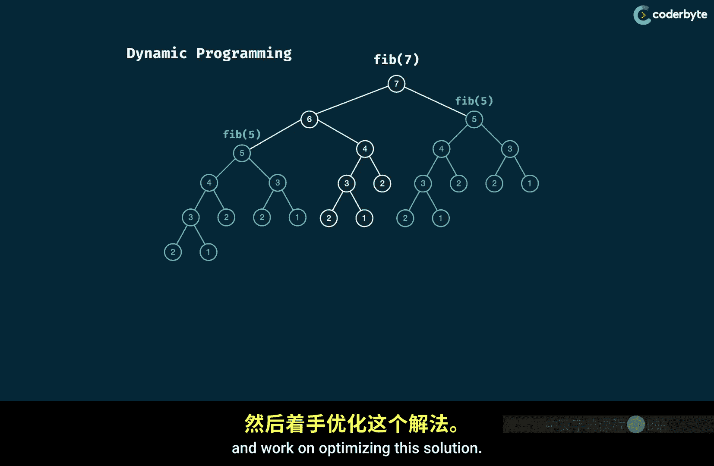

Al right， now that we discussed a plan， I think we're ready to actually implement some code that will actually carry that plan out Here I have our classic Fibon implementation。

 This was the one that we ran earlier and it's definitely too slow right it has an exponential time complexity So now that overall when I want to do is kind of capture a duplicate subproms I want to store any results that I get that way if I have to recalculate those subpros later on I can just use my stored data And so the trick here it's a very common programming pattern。

 we're going to implement some memoization。😊，Memmoization is actually one of the overarching strategies we can use to solve any dynamic programming problems And so just look at the name like why is it called memoization well this refers to like memo right So if I have like a memo in let's say like real life it's really just like a reminder for myself So using memoization what I'm looking to do is store some duplicate subproblems that way I can just get those results later on I think a really neat way to implement memorization in jascript as well as many languages is to use some sort of a fast access data structure usually be like your hashmap equivalent in the programming language of your choice for us that'll be a ja object。

And so our plan is to use some JavaScript object and so what do I want the keys to be。

 so the keys in the object are going to be the argument to our function， right？

And then the value will be the return value。That way I have a nice napping for a argument to the function that is a function call as well as its return value right And so what I can do for my existing fib function is I can kind of just bake in some optional argument so my favorite strategy to do this going assign a memo to be an empty object So if you're unfamiliar with this syntax and JavaScript is's pretty useful what I'm saying is if I were to call our fib function and not pass in a second argument by default。

 it will create this memo as containing a new JavaScript object that is empty of course So it's going to be useful that way。

 whoever is actually testing my code doesn't have to deal with setting up any memo object So what we prefer this strategy over here。

😊，And what I want to do is treat it as if that， hey， this memo is going to store n as the key。

 and values are going to be just the return values for this function。

So what you're going to see us doing a lot in this lesson is at the start。

 we're going to first check for existence inside of our memo。

 So let's say that we're somewhere in the middle of our recursion。

 The first thing I should do is kind of add an additional base case and say hey。

 is my current argument N inside of the memo and if it is then I can just get the stored value from that memo and I'm done。

 so I'm going to do an early return here。 I'm going to return the value that corresponds to that memos key I'm just using the original argument N as a key in my memo and this condition is really just some classic ja syntax。

 I'm just checking if some key is inside of a jascript object。 So really quick。

 maybe just to warm us up maybe you haven't seen that syntax before。 So let's say I had some object。

 and it had some properties inside。 maybe had a name of Alvin that's me then it had a favorite color。

Of like gray。And what I can do is check for an existence of a key in that object。

 so JavaScript keys are mostly strings right， so I can check， hey。

 is name in the object that's true is the fave color。In the object， make sure I spell it right。

That is also true。 I can check for a key that's not there like I don't know。

 is location in the object， that is false。And so here I'm just using that same pattern。

 but for n right which is going to be a number， technically it would be converted into a string key。

 which would still totally work here。 Asome。 So I have my memo fetching logic right I check。

 hey is this argument in the memo but if it's not I'm gonna have to actually manually do the calculation which is okay because I know I need to do a sub tree at least once So what I'll do is I'm going to take the exact return value right so this is my return value in the original brute force what I want to do is actually just store that entire result inside of my memo and the key is。

 of course， n right the key you use to access is always just what your argument is and I want to complete the original return。

 So I can just go ahead and return what I just put in that memo。😊。

So I'm not really changing any return values where I'm returning exactly the expression that I returned before。

 but now I'm actually also saving that value inside of the memo object and what I want to do is make sure that all of these recursive function calls or accessing the same memo so what I'll do is I'll pass in that object to both of these calls a really important pattern here is I know that I only receive a new top levell memo object whenever I make a top levelve call to fit right because I'm not passing in a second argument over here however if I look at my recursive calls I do pass in explicit second arguments and so they're actually going to receive the same memo object and it would be like pass by reference right because when you pass a JavaScriptscript object to a function you actually receive kind of that exact object you don't receive a copy which is really neat so basically I'm giving my function calls away to sort of communicate to each other they all have some sort of global information to reference across the recursive trees。

😊，So this code is looking good again I just want to emphasize I only added a new argument over here。

 I added a new base case on line 5， then I added my memo storing logic on line 7。

 but I didn't change any of the functional logic here let's go ahead and run these test cases and we'll see how our code is doing now so a moment of truth I'm going to run this fi file。

And notice how blazing fast our program was， I still get the results of 813 and 21 and the 50th Fibonacci number is indeed this very large number and it basically executed almost instantly。

 so let's go ahead and head back to the drawing board and really understand what happens when we execute this sort of code。

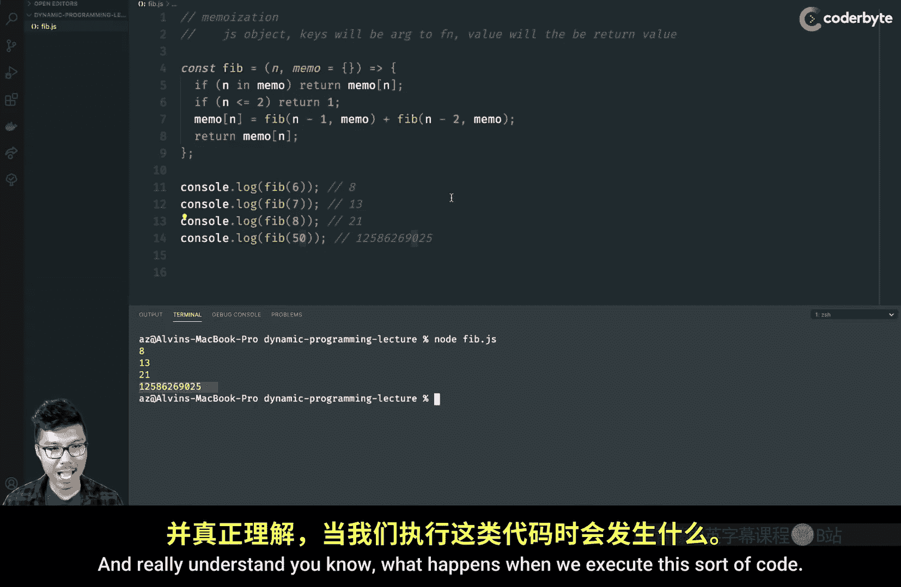

Alright so it looks like we implemented the improved version of Fibonacci by memorizing it and it's clear by running the program that we definitely had an impact on the time complexity however I really want us to understand how the structure of the recursion tree changes once we implemented this memorized version of the code so let's say I want to step through an example of Fibonacci and let's say I pass into number six so really what I'm looking for here is to get back eight because the sixth number of the Fibonacci sequence is indeed8。

So we know that we're gonna have a tree that looks like this， right。

 This is a tree that would really be the full recursive nature。

 So this is how the tree would look like if I did not optimize it。

 And what impact do we have by actually adding this memo object。 All right。

 So let's start tracing through this。 I know that when I call of 6 at the top level。

 important thing to know is I'm not going pass in some memo object。 So by default。

 my code says it will initialize it to an empty object。

 and the really important aspect of this is I'm going to create a new object just for the top level call。

 But then that same object is going be pass down to my recursive calls， right， noticing line 5。

 And so I'm going to travel down my left hand path right，6 calls 5，5 calls 4，4 calls 3。

 and three calls 2。 And right now I've hit a base case。

 So I know that this node of  two is going to return  one。 So that's kind of business as usual。

 right， in the same way now I need to evaluate this other node of one， which is also base case。

 it also returns one。😊，And at this point， my parent of three is actually ready to compute the sum of its children。

 right， So1 plus one just gives me two。 So I just add up those values。 And now3 is returning to。

 However， looking at line 5 of my code not only is this node going to return2 to its parent。

 It's also going to store it in the memo object right， So the key insight is at this point。

 I would add a key to my memo of three whose value is2， basically in my memo。

 I kind of read it as if I'm saying， hey， the third Fibonacch number is2 right。

 that in itself is logical。😊，So I can just continue this pattern right Now I start to evaluate what happens when I'm at this node of two。

 which is also a base case it returns one。 Now my call to4 is ready to compute right it's going to take the sum of it's both children。

 So it's going to do  two plus one gives me three， but of course it's also going to store that inside of the memo It's going to cache that result to be used later on。

 So that means I make the n my key and I make the return value the value right so I'm going to have four points to three inside of my memo object。

 And now here's the beauty of this memo wise solution。😊，At this point。

 I need to compute what happens for fib of 3。 However。

 this is actually going to hit one of the new base cases I added， right。

 I know that3 is in the memo object， looking at line2 of my code， right， It's in the memo object。

 And so I just immediately return。 the stored value。

 And so this call to fib of 3 is just going to return the stored value of 2。 And if I do that。

 I won't have to travel down the full， you know， recursive subree rooted at 3。

 I don't need to travel to these nodes at all。 So I already used some stored value in my memo。

 And at this point，5 is ready to return， right 5 will take the sum of both of its children。

3 plus 2 is 5 and it's going to store that in the memo， right。

 the fifth Fibonacci number happens to be 5。 And now the same thing happens for6 is right child。

 So I have to evaluate this node now。 So what is the fourth Fibonacci number up。

 That's actually stored directly inside of my memo。 So this actually early returns。

 the stored value of3 right， And again， the key insight is。😊。

It will return that stored memo value without having to travel through that full subree。

 And at this point， I can return 45 of 6。 So I do 5 plus 3。 That gives me 8。

 This would actually technically be stored in my memo as well。

 So I have the 6 of boaccho number as 8。 And there you have。 right， The answer is 8。

So it's evident that by memmalizing ourfibonacci function。

 we definitely cut down on the number of recursive calls。

 We wanted to visualize that we ended up with this kind of structure here in a light blue。

 I have a circle the nodes that we technically didn't need to do the full recursion at right So these nodes of 2。

3 and 4 for the small example of my initial fib of 6。

 I was able to kind of fetch a value from my memo and kind of forgo traveling down the recursive subree。

 So what do we actually know about the time complexity of this function now。 Well。

 I think it's really important that we always try to generalized thing。

 So we just step through a relatively small example a fib of 6。 But how does this sort of scale。

 So this is the same tree。 Let's say I kind of tidy up a little bit。

 So I know that in general fib of 6 kind of has this structure。😊，So I want you to take a moment。

 look at this and in your brain picture what fib of seven would look like if I memorize Fib of seven。

 what would its subtrees look like？Well， it really just look like this。

 Notice if I root myself at the seven node。 It left child is still 6， right，-1。

 and itss right child still 5-2。 So this still obeys the laws of fibonacci。

 if I asked for a fib of8 memmoized。 The structure would be like this。 and 9 would look like this。

 See the pattern Look like at this point where're just growing this like memmoized chain in a linear kind of way。

 if you're not convinced by， know that just like structural argument。

 let's say we were a little more methodical。 We know that in this drawing。

 there is some common ground right again， like I always say when you tackle these new problems or new patterns。

 try to find some familiar territory， Where can I recognize stuff I've seen previously。

 So I look at this chain。 I go 9，8，7，6，5，4，3，2， right， So this goes all the way down in a very， very。

 very linear fashion， just counting down。 So I know that if I just look at this highlighted chain in yellow。

 that's definitely just n nodes where n is my initial top level。😊。

So I know that what I have highlighted in yellow is just a linear chain right They're exactly n nodes。

 but I haven't accounted for everything in this picture， right Some of the nodes are still in white。

 meaning I need to kind of work them into my description of what the shape of this tree is。

 Well I know that each of those white nodes is actually connected to some of the nodes I've colored in yellow。

 they're kind of paired off in a way right for every node in my yellow chain。

 it has exactly kind of one partner node， one right hand node on its right hand edge。 And overall。

 if I have n pairs， that means I have two n things overall， right there are two things in a pair。

 So overall， the number of nodes is roughly2 n。😊，And I know that that can actually be simplified right。

 The time complexity here would be to n， which just simplifies to n time complexity and using the same arguments we did for our space complexity。

 we know that the space is going to be n as well。 And this is pretty powerful stuff By memorizing our fib function。

 we brought it down from an exponential time complexity to just a linear time complexity。

 pretty cool stuff， right。😊，All right， I think we're ready to graduate from Fibonacci and what we'll do is work on a more involved problem。

 this one has more of a narrative to it。So say that you're a traveler on a two dimensional grid。

 you begin in the top left corner and your goal is to travel to the bottom right corner of that grid。

 and the rule is you can only move down or to the right。

 that means you can't move up or to the left and you definitely can't move diagonal。That being said。

 in how many ways can you travel to the goal that is。

 how many ways can you travel to the bottom right， if you had a grid of dimensions M by N so the first thing I recognize here is it looks like the grid may be a rectangle not necessarily a square and overall what we want to do is implement a function that calculates this that is our function needs to take in the dimensions of the grid。

And so before we hop into sketching a strategy for this one。

 I think it's really important that we make sure that we actually understand what this question is asking。

So let's say they asked us to calculate grid traveler of two comma 3 That means they're asking us in how many ways can you travel from the top left to the bottom right of a2 by3 grid I will tell you right now that the answer here should be three right so there are three ways to do that and in particular you can imagine that we had you know a two by3 grid so that means two rows as well as three columns。

And we start in the top left， and our end goal is in the bottom right。

 And so why do we say that there are three ways to get from the top left to the bottom right， Well。

 they told us in the problem that we can only either take a right move or a down move。

 So one of the ways would be going right， right down， right。

 that would bring us from the start to the end。 And it would kind of look like this。In a similar way。

 another path we can take is doing a right down right， it would kind of look like this。

And the only other way would be going a down right right， which would look like this path。

 and that's why we say there are only three unique ways to travel not through a two by three grid。

Alright， so that's just one example of how we might call a grid traveler。

 I think what's really important to notice is try to also frame the problem as if you were given some relatively small inputs。

 So I think a a really important case to think about is what happens if they give us like basically the smallest valid grid we could have That is a one by one grid This one is kind of trivially simple right a one by one grid only has one unique way to travel from the start to the end。

😊，And it's kind of concise in that if you had a one by one grid there's really only one position right so that means that the start is really the same as the end and kind of you already have the problem solved out the gate because to travel from the start to the end。

 you kind of just do nothing right so the logic here is in a one by one grid。

 there's only one way to travel from the start to the end you're kind of already there so you don't need to take any moves。

Something else we might think about is what happens when one of our dimensions is zero。

So let's say someone ask us to calculate grid traveler of zero comma 1 This is a kind of strange question to ask because for one。

 if there are zero rows and one column that kind of means that the grid is empty so I would consider that as there being zero ways to travel through that grid because the grid is sort of invalid in a way in a similar way if I ask you for traveling through a one by zero grid there's still no grid to be found here so it should also return zero and likewise when either of the dimensions is0 the answer should just be zero right if one of your dimensions is empty then there really is no grid。

So maybe you're catching on into why I brought up those trivially small grid examples right。

 those kind of sound like base cases which we can use to reconstruct a larger answer。

 but let's stay grounded and look at another grid。 So let's say I asked you to calculate grid traveler of three comma 3 right so I want to answer for a three by3 grid Well how can we reason that one out。

At this point， what I'm looking to do is sort of frame the problem in a way where I can decrease the problem size。

 usually by mutating the arguments to my function column。So let's imagine this three by3 grid。

 as always， I want to move from the top left to the bottom right， so I begin at this position。

 let's say。And so I know that overall， I have this top level problem of saying。

 how many ways can I travel through this？En tirere，3 by3 grid。Let's say I took one of the moves。

 right I can move either right or downward， let's say I made the decision to move downward。Well。

 if I move downward， then I would appear here now， I know in the future I can only move to the right or downward。

 so now it's as if my playable area has been reduced to just this shaded region。

And if I look at what I've actually done to this problem。

 I'm still sort of in the top left corner of some grid where now I'm really trying to answer the question。

 hey， and how many ways can I travel through this2 by3 grid and this is a really important way that where we're shrinking the problem size right I had a  three by3 grid initially now I have a two by three grid。

😊，And this is really like the relative grid from my current position we'll say spanning all the way to the end position So if you look at this coordinate of like two comma 3 technically that is like not the coordinate of the person within the larger grid。

 this is really the size of the rectangle that the person is trying to cover now right？

So in a similar way， let's say that hey， I wanted to move to the right now well that would also shrink the grid along a different dimension so I'd appear over here and now I have a two by two grid that I'm trying to solve and if I keep following this pattern。

 we're going to keep shrinking of the problem size over here now I'm asking for a grid traveler of one by two and then finally if I take a right move over here I'm asking for grid traveler of one by one which I know is one of those sort of base case scenarios that I had previously so that's going to be really useful when we actually implement this in some code and so the key insight here is when we make a move through the grid that is when we go right or downward we basically shrinking the effective size of the playable area our grid gets smaller along one of its dimensions。

Awesome， so I think now we're able to see that hey。

 this grid traveler problem definitely has some overlapping subpros right let's say I tried to take more of like a programmatic approach。

 something that will be doing a ton like basically for every problem in this lesson is whenever we have a problem that we kind of know is going to be recursive the move is to really structure it like a tree I want to really visualize this because I know that if I had a tree structure on pen and paper I can implement that with just some recursive code using some JavaScript right so let's say that I wanted to take more of a tree based visual understanding now a grid traveler of two comma 3。

😊，So I know that usually the way we do this is we encode nodes of the tree using the arguments to this function right now I have two arguments or I have the number of rows and a number of columns。

 whereas before for something simple like Fibonacci I only had a single argument。😊。

So in the long run I know that the answer I should get back is three so we'll just keep that goal in mind。

 so let's start to flush out this diagram so I'm going to start with that top level call of two comma 3 and now I think about how this node can transition to other nodes right how does the state of my game actually change Well I know there are really two options I can take right you can either have one child going downward or another child going rightward right those are the two options based on the gameplay here。

And so if I go down how does that change the number I put in the node。

 that is how does it change the dimensions of the playable grid area， Well if I go downward。

 then I'm reducing the number of rows by one， so that means my left child is just one comma 3。

And if I had moved to the right， that would mean I'm reducing the number of columns by one。

 So my right child is just two comma 2。 Notice that from parent to child。

 all I'm doing is reducing one of the dimensions by one right That means you're either going downward or going to the right and I can just carry over this pattern recursively right So let's say I'm flushing out this node now if I'm at one comma 3。

 then its children would be just 0，3 and 1，2 And a similar way if I root myself at 2，2。

 then I have children of12 and 2，1。But now let's notice something important here I've kind of spotted a node where I have zero comma 3。

 remember what we traced through in terms of the visual drawing what is this node trying to answer well this notice is saying in how many ways can you travel through a0 by3 grid But if you have zero rows and there's really no grid to be dealt with and so I think for this node of0 comma 3 or really any node that contains a zero we don't need to actually flesh out its children So instead I'll work on recursively drawing out these other nodes So we'll carry over this pattern。

😊，At this point we've actually hit， I think all of our base scenarios right。

 so if I look at these nodes。That have one comma1 that was exactly like the affirmative base case。

 meaning that I know trivially I can solve the one by one grid In other words。

 these function calls are going to return one right in a one by one grid there's exactly one way to travel from start to end right you kind of just do nothing。

And on the flip side of that， for all of those nodes that contain a0， they're also a base case。

 but they're kind of like the negative base case， meaning that there is no way to actually travel from start to end。

 So for all of these nodes containing0， they should return0 to their parent right。

 there are zero ways to travel through that grid At this point。

 I just sum of these values at the parent node right So I just lift these and then I add them together。

😊，And if I look at what these things are saying， right。

 if I look at like the node one comma2 above it is one。

 meaning there is one way to travel the way one by two grid， right， you kind of just move rightward。

And so I carry this pattern over I keep adding the children nodes at their parents and this carries up all the way to the root node And what do I know there are three ways to travel through a two by three grid So although there's like a narrative and there's some you know cute story behind this problem it's really just a spinoff of Fibonacci and that's going to be the case with many of these dynamic programming problems So we've confirmed that there are three ways to travel through a two by three grid and there's also some other information encode it in this tree I know that whenever I took like a left hand edge in this tree that represented the choice of going downward And whenever I took a right hand edge in this tree that represented a decision of moving rightward。

And so if I have that pattern in mind that not only have I been able to count the number of ways that I can win the game。

 but I also know exactly which combination of moves lead to a solution。

 one of the ways to win this game is to go down， right， right other ways to go right。

 down right and the final ways to go right， right down so we can glean a lot of information just from the same tree structure。

Cool， so I think that's enough drawing for now， let's go ahead and implement this in some code。

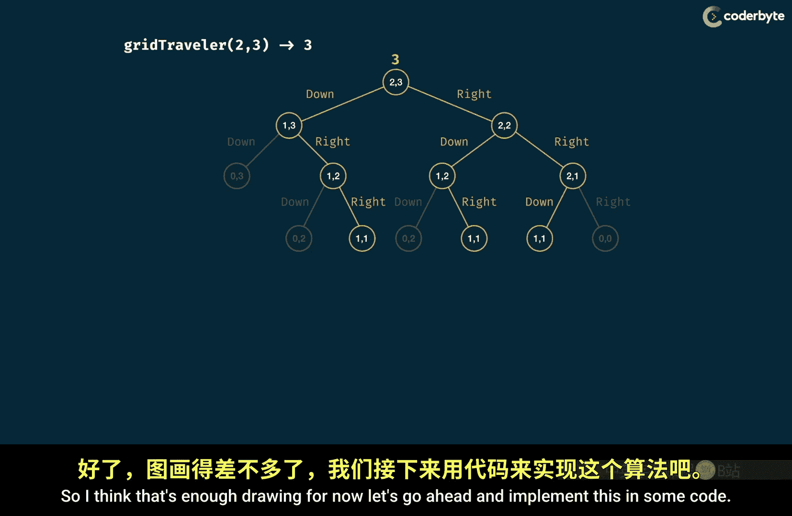

All right， programmers。 Here we are back in my tech editor。

 Let's go ahead and implement this grid traveler function。

 So we want to go with that recursive strategy。 So I'll start by just laying down my base cases。

 I already refer to the fact that， hey， one of our base cases is we have a one by one grid。

 just go ahead and return0 So that's really easy to do。 So I'll check hey， if M is one and n is one。

 then the answer is just trivially one then along with that。

 I also have the base case when I had like an invalid grid。

 that means if either of my dimensions is0。 So I'm using an or here if either dimension is 0。

 then your grid is empty， which means there is definitely no way to travel from top left to bottom right of that grid cool。

 But then my recursive scenario is very straightforward。

 All I need to do is get the sum between me going downward and me going rightward So I go down。

 remember M is the number of rows。 If I go down， then I'm decreasing the number of rows effective rows that is by one。

 but I keep the same number of columns。😊，And then in a very symmetric way， if I move to the right。

 that means I still have the same number of rows so I keep M。

 but I decrease n right I have one less column。So this code is looking pretty sharp。

 really just some reminiscent Fibonacci style code。

 let's go ahead and give this a run so I'm running a few examples over here and these are the expected results in some comments。

We'll go ahead and bang this one out， great traveler。Go so I get the first four results1，3，3。

6 looks like it's working just like a charm， however， for this last example of an 18 by 18 grid。

 it looks like my programs hang right now， it's actually a little too slows to calculate an 18 by 18 grid so you probably see where this one's heading。

 Let's go ahead back to the drawing board and really understand why this code is fairly slow。

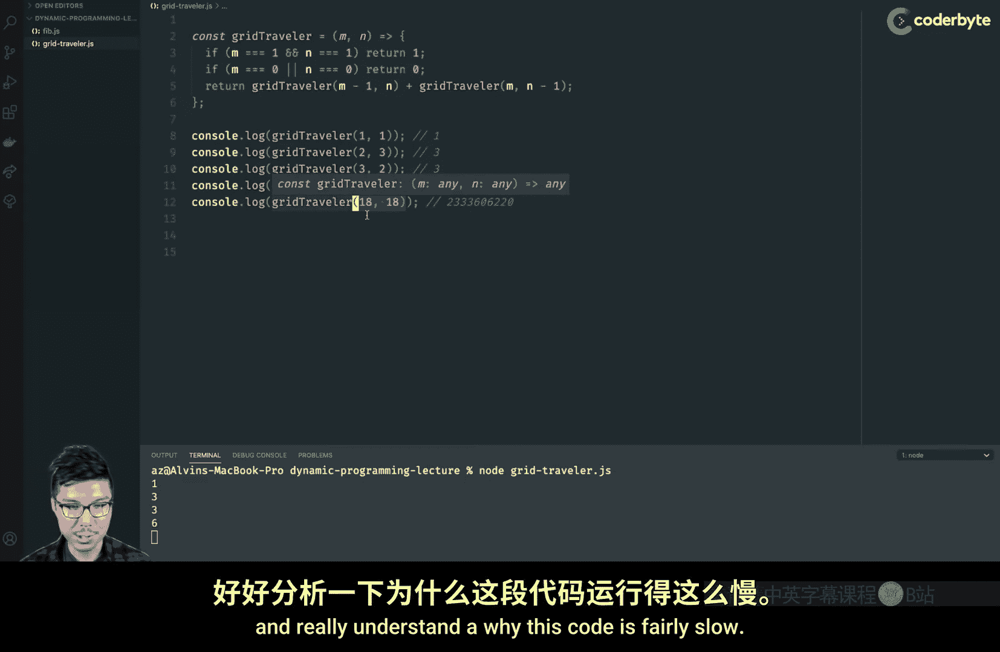

All right， so here we are back in the drawing board because it looks like we hit a wall when it came to our recursive implementation of grid traveler。

 That being said， I think implementing the brute forest solution here is actually a really logical first step。

 And now we can just focus in on where there is room for improvement。 So our first question is。

 you know what is the actual time complexity of this implementation Well。

 I know when I call a grid traveler of2，3， the full tree would explores this And like we said in our afibonacci to understand the time complexity here。

 it's really about to understand the number of function calls we make。

 which is really the number of nodes in this tree。 And of course。

 I want to generalize my understanding for any large inputs。

 So I know that this tree sort of looks you binary in a way。

 meaning that a node can branch to up to two children。

 which makes sense because from one position of the grid。

 I have two choices to make right I either go down or I go to the right。😊，But that being said。

 I need to realize what the height of this tree is。

And this one's pretty interesting because out the gate。

 we actually have two input arguments to our function， I'm given two numbers， M and N。

 and since this function contains two inputs， it shouldt be the case that our final complexity analysis actually describes it in terms of those two number inputs。

So what I'll do is try to recognize the height of the street and so I'll just choose some path from the root to the leaf and kind of in the recursive sense。

 that means I take some path from my top level call all the way down to the base case and preferably the farthest base case So I know my base cases are either when one of my arguments turns to zero or when both of my arguments turn to one And I think in general。

 the farther base case would be a scenario where both of my arguments are one。

 So here I have a path highlighted that ends in a11。😊，And in general。

 I know from one node to the next what I do is either decrease the M by one or I decrease the n by one。

 It's never the case that I can decrease both of the numbers by one because that would kind of entail that you're moving diagonally across the grid。

 which is not allowed in the gameplay。 So if I can either subtract one from M or subtract1 from n。

 And overall， a path from my initial input down to a space like11 is's going to have a distance of n plus m。

 You basically have to subtract you know n and M from your initial node to reach that bottom level of1 comma1 So that kind of tells me the number of levels in this tree using the same arguments as before。

 and it's still the case that most of this tree is going to be binary。

 meaning that a node branches to two children。 And so I have that two times two times two pattern for the number of levels in this tree or saying that there are n plus M levels So really the time complexity is two to the n plus m power So still some sort of exponential。

😊，Now it's just sort of the multi variable exponential because I have two variables of M&N。

And likewise， for the space complexity， you know the space complexity in general for recursive code is just going to be the height of the tree。

 The height of the tree gives us the maximal stack depth of the recursion。

 In this case it'll just be the number of level still。

 which is n plus m Co So obviously the limiting factor here seems to be that time complexity of2 to the n plus M time。

 Allright， so you probably anticipate the time complexity of this one being exponential that being said I think it's really important to still have a nice argument to say what the time complexity is that way you can get a massive buy in from your interviewer right So don't skip these steps of trying to draw it out and actually defend here reason for why the time complexity is exponential。

 let's try to improve this now。 I there any room to actually improve the runtime of this function。

 Well， here's that same drawing just sort of cleaned up。

 So I have grid travel of two comma3 and this would be the full tree。

 we sort of already know now I have this recursive tree structure。

 what I could possibly do is notice any duplicate work I there some work I can prevent myself from doing here。

😊，So take a moment and really remind yourself of the actions we took in the Fibonacci problem and see if there's any patterns in this tree。

Probably from the gate you notice that oh I have some duplicate subtes right I have one comma2。

 so on these two highlighted subtes in blue that's sort of asking the question， hey。

 what is the total number of ways I can travel through a one by two grid？That being said。

 I think there's even more subtrees that correspond to that particular problem。

 What if you look at this far right subte of two comma 1 if you really， really think about it。

 asking the number of ways to travel through a1 by two grid It's the same as the number of ways to travel through a2 by one grid You're just flipping the rows in the columns。

 but then in total number of ways should be exactly the same。

 So that's actually a pretty interesting way you can optimize the solution so I can still memorize it that is I have these duplicate subproblem。

 but possibly a really cool insight you can make in this problem is you can also sort of flip of the arguments。

 In other words， if someone asks you for grid traveler of a comma B。

 then that would be the same answer for a grid traveler of B comma A the order of the arguments technically doesn't matter here。

 and so we can totally encode that in our memo object that being said punchline here is we better memorize this one So I think let's hop to it。

😊。

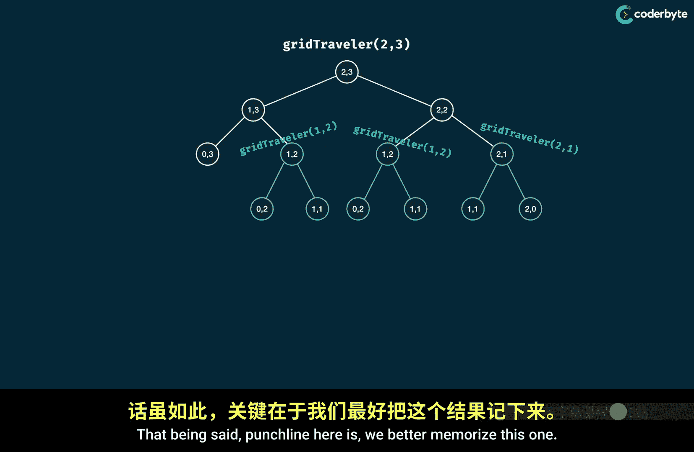

All right， here we are back in my tech editor and hopefully that diagram of how we can improve the time complexityi for this one makes some sense。

 Let'm me go ahead and kill this program still running and my computer's fan is actually going crazy and I was running the entire time let's go ahead and memoize this one to the beauty of solving these dynamic programming like problems is if we have the initial strategy of implementing like the brute force recursion and we wrote like a very wellformed recursion。

 meaning that I actually use return values and I reconstruct the subsolutions all the way up to the tippy top because I have a really nice recursion here memoization is a very like formulaic pattern so it's going to be almost the same strategy we did of Fibonacci and even other problems that we do in this lesson So I'm going to bake in my default memo as an empty object and then along with that I'm going to add my memo checking logic So I know over here in general length to check hey。

😊，Are the arguments？In the memo right I need to key into my memo object using all of the arguments。

 Now I have two arguments。 and since both of the arguments combined sort of dictate the output。

 I need a key that sort of contains both of those in JavaScriptscript keys are either strings or symbols。

 So for us right now， really strings is the most relevant one。

 So what I'll do is I'll concatenate both of these integers together that way I have a string which I can key into the object with。

And what I'll definitely want to do is also。Maybe separate them with a comma， let's say。

 So I'll say let key equals。M plus a comma plus N。 And the reason that you'd probably want like some sort of separator between these two arguments in your key is to make sure the numbers don't get misinterpreted。

 So I've actually ran to this issue。 in the past， Can you imagine。

 like if I had a scenario where let's say M was 42。And then we'll say n was the number three。

So what I don't want to do is just make my key something like4，2，3。

 because this isn't going to uniquely identify the exact input argument。

Because if this was just my key， then I guess I have the same key for a totally separate set of arguments if I gave you 4 and 23 both of these combinations of very different arguments would lead to the same key。

 they would collide the same key， So instead I'll prefer to put a comma between them right now I know without a doubt that this key corresponds to four comma 23 So that's why I put a separator between them。

And depending on the language that you're choosing for your interviews。

 you can find a very similar construct。Cool， so now I'll go ahead and check， hey。If my key。

Is in the memo， then I have the result cache already。

 so I could just return that cache value so return memo at key。

And then what I want to do is look for my old return value。 Right。

 So here's where I actually do the manual recursive calculation。 Before I return that。

 I want to store it in my memo using the same key and then return。That thing I just put in the memo。

 just completing the old return logic。Cool。So you've seen this pattern before。

 I just want to emphasize a few things now it's the second time we're seeing it。

 memmoorization for me， at least is a very， very formulaic thing right so I always take the exact expression that I return previously and I put that entire thing in the memo object right notice that my key encodes the arguments for this function right M and N something that I've seen students do in the past is do like very heavy handed logic where they try to you know check if the child call is in the memo in other words。

 don't write any preemptive logic where you check， hey， if you know M-1。😊，Comea。

And so if you like concatenate those two things together， don't check if like your child's key。

Is in the melow， right， so imagine like this is my key right now。

Right don't check if that is in the memo when you write logic like that it ends up being very very duplicate and a little harder to debug right instead of writing your function as if it's you know reasoning for its children calls you know that once you actually evaluate those child calls。

 they're going to cache themselves right they're eventually going to check this if statement anyway right so don't do any of like the look before you leap logic just make the recursive call that way every recursive call doest like self-service right so I prefer this way to implement it。

And with that， let's go ahead and run this code。So I'll give this a shot grid traveler and I still have that 18 by 18 grid which took way too long last time didn't actually finish while I was waiting。

Looks like I'm still hanging here because I'm actually missing a little bit in my code。

 So take a moment see if you can spot it。 I forgot one really important thing。

 And so I have the logic of check if my key exists in the memo。

 and I also have the logic of storing something in my memo if the key doesn't exist But what I fail to do was actually pass down the memo object to all of the recursive calls。

 So I want to pass it down over here。 remember the trick is only top level when someone calls like2 comma 3 for grid traveler then we're gonna to initialize a brand new empty object which will be shared for the rest of the recursion because it's passed down by reference at this point。

😊，So that's a common mistake， let's go ahead and run this now。Nice and there we have it。

 look how quick our last execution was over here and now is the expected answer for an 18 by 18 grid。

Cool， so here's what we'll do。 It's evident that we definitely sped up the execution of this one。

 Let's head back to the drawing board to wrap up this problem and really see how we cut down the complexity here。

😊。

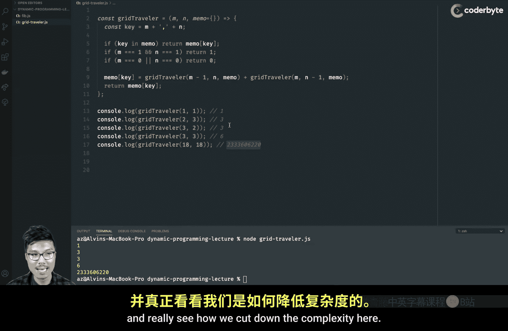

All right so it looks like we definitely improved the runtime of our function。

 but I want to really understand you know what the big O complexity of our improved function is now so sort of a way we can structurally argue for what the new time complexity is is to think about what are the values of the nodes that we'll actually have to travel through so let's say I looked at this example I wanted to find the number of ways a travel through a 4 by3 grid I know in general there would be a top level node of of course4 comma 3 but in general that refers to MN right so I'm trying to think of it in a very general way right now。

And so I know when it comes to the other nodes of this tree。

 they're all going to sort of at most be for comma 3。

 but then probably be less than that right they have like a range of values for the nodes it's not as if to solve grid traveler 43 I would have to solve53 right that would be a larger grid but that doesn't make sense here right I'm shrinking the subproms only in this rendition of grid traveler。

And so if I think about some possible values here， I know that if M is4 top level。

 then all of the values for M in the rest of the tree would be from zero all the way up to and including4。

 right， it's ever going to be bigger than four。In a similar way， since n is3 here。

 the only possible values for n and the rest of my tree are 0 through3。

So roughly you know we're a little off by one here because I have to include zero because we know that that's a base case in ourndition of this problem。

 but that being said， they are roughly n choices for the first number in the node and n choices for the second number in the node。

😊，And along with that， we know that we're not going to have to travel through many duplicate subrees because we memize them away。

 And so I think what I can say here is the total number of nodes we can possibly have is m times n and that would be the number of like distinct nodes because I have M choices for the first number in the node and n choices for the second number and I know that I'm going to really minimize any duplicate exploration through the memo object so that really the implication here is we started out with our brute force recursive implementation。

 which looked like it was exponential in the time it was  two to the m plus m time and then by memorizing this function。

 we were able to bring it down to an m times n time complexity which is much faster notice that the space complexity stays here which is really fine because n plus M is some sort of a multiline function。

😊，Cool， so there we have our nice optimal solution for this grid traveler problem。

So key thing I want you to take away from this one is although the initial narrative in the problem made it seem pretty specific and pretty different from a previous dynamic programming problem like Fibonacci。

 it was really the same sort of story the most important thing that we're going to sort of leverage it throughout this lesson and we leverage twice already is try to think about your recursive functions in terms of a tree I get the most information out of the tree and then from there I can use that tree to not only implement a brute force but to also recognize hey。

 we' can I optimize this brute force that way you can reach for the optimal solution。Alright。

 so we've gone over two different problems together and hopefully we're starting to notice how we tackled them in similar ways。

 I think it's about time we gave ourselves some guidelines for solving dynamic programming problems using a memmoization strategy。

 So we'll call this our memmoization recipe。😊，And there are a few different ways you can go about learning this topic of memorization and you might have different recommendations。

 This is just my particular recommendation。 So I think the most important thing to establish if you want to solve some dynamic programming problem using memmoization is to stick to two like high levell steps。

 we definitely need to at first just have a solution that's recursive。

 So just make it work could be slow。 that's okay And then after that we make it efficient。

 I think this is where a lot of students sort of try to take on too much at once。

 they try to just solve it quickly all in one go to me it should be a very separate process right first I look for correctness in my solution And then once I have correctness。

 then I look for efficiency in my solution So when we go through step one if I just want to get a working solution。

 then I have to start visualizing these problems as trees in dynamic programming problems。

 the gist of them are that we have some large problem。

 then I can break down into smaller instances of the same problem So when I visualize it as a tree。😊。

What I'm looking to do is figure out， allright， in the nodes of the tree。

 that should represent a problem， and when I draw an edge between nodes。

 that should be shrinking the size of the problem。And depending on how your problem is stated。

 you'll have to figure out that logic right in the case of our Fibonacci。

 it was as simple as we know we can decrement our values of N， but in the case of our grid traveler。

 what we had to do was travel rightward or downward。And once we do that。

 you want to implement that tree using recursion。 What's great about a tree is it's already a recursive structure right So how do you start to translate that kind of tree visualization to some recursive code？

 Well， you think about the leaves of that tree as your base case， right lately for us。

 it's been about some small numbers right， So like a grid of size 1 where it could also be in the case of Fibonacci。

 just our initial seed values of n equals 1 and n equals 2。😊，Now。

 once you have that baseline recursion， that's going to be your brute force solution。

 And so you want to test it。 To me， this testing step is really important right。

 so if you pass inputs into your brute force recursion， it should give correct answers。

 although possibly for large inputs， it may take a long time right to me。

 there is a big difference between code that is slow and code that is wrong right So here we should give back valid results。

 although maybe our code is a little slow。That once we have our working brute force solution。

 making it efficient， using memmoization is a very， very canned scenario。

 All we do is start by adding a memo object into the mix。

 So this memo object needs to have keys which represent arguments to our function and the values of that object represent the return values for those function calls。

 We know that in our functions， a unique set of arguments should give me a particular results。

 So we're just having that sort of mapping inside of an object。

 You need to make sure that this object is shared among all of your recursive calls one way you can do that is to pass them along as arguments。

 And lately， I've been doing that by giving myself a default。

 empty object at the top of each of my recursive calls， right through my top level call。😊。

Once we do that， we need to add a new base case into our code。

 So I'm not going to remove any of the old base cases from my brute4 solution to me。

 I'm just adding a new base case that captures the memo。 In other words。

 if my arguments are in the memo object as a key， then I'll return the stored value。

 I refer to that as like my memo fetching logic， right， looking up some stored value in my memo。

And beyond that， the only thing we need to do is implement our memo storing logic。

 and it's as simple as going to exactly where we had our return values in our function。

 And then we just make sure that we add those return values into our memo object before returning so I always look to the exact return expression and just write some code around it right Storing that result into the memo object before I return it step two is actually very。

 very easy to implement， meaning it's very easy to memorize a brute force solution。

 it's really coming up with the brute force in the first place that kind of feels more difficult。

 So as you're learning and practicing memmoization for these dynamic programming problems， I highly。

 highly recommend you stay very methodical and follow these steps right don't try to efficiently implement an algorithm from the get- go get a brute force working solution with recursion and then implement it using memmoization afterwards right。

😊，You get more practice with this technique soon you'll be able to do everything all in one soup。

 but I don't recommend that until you've definitely finished this course。

 so we'll be sure to follow these rules before our falling problems。All right。

 so I think it's time to increase the difficulty and work on another dynamic programming problem。

So let's regard this can sum function。 What I need to do here is take in a target sum as an argument。

 as well as an array of numbers。 My function needs to return a boolean。 so true or false。

 indicating whether or not it is possible to generate the target sum using some numbers from the array。

long with that， we have some constraints here。 We can totally use an element of the array as many times as we want。

 and we can also assume that all input numbers， so the target sum as well as the numbers of the array are non negative。

 So let's try to understand what this question is asking。 So's say I gave you this example case。

 So it looks like our target sum of7 and the array of numbers is 5，3，4 and 7 here。

 the response should be true because it is possible to generate 7 by adding some amount of numbers from the array。

 one way you can generate 7 is by just doing 3 plus 4。

 Another way would actually be to just take the lone 7 because 7 is actually a member of the array。

 So it's definitely possible to generate 7 using know some amount of numbers from the array。

 So that's why we return true。😊，Let's say I gave you another example。

 let's say I gave you a target sum of seven again， but I gave you a different array of just two and four。

This is actually going to return false because there is no possible way that combinations of two and4 can actually sum to seven。

Cool， so that's really what the question is asking。 Now。

 let's try to think about how we can frame this problem recursively， right。

 hopefully very gather in your mind。 if we have a smaller amount of target sum。

 then that'll tend to be a smaller or easier problem than a larger number for target sum。😊，Alright。

 so let's start to think about the recursive structure for the first example。

 we know in the long run， we should be able to derive the answer true from the drawing that we make。

So like we always say， we should encode the arguments to our function into the nodes of our drawing That being said。

 since in the problem， they told us that we can reuse an element of the numbers array as many times as we need。

 I'm just going to omit that from the node drunk because basically every node or every function call is going to receive the same array。

 So I'll just list the target sum in every node。So I start with seven and I have to think about how I can transition to other nodes。

 right how can I shrink the size of this problem？Well。

 I know that I only have four options I can take right。

 have an option for every element of the array。So basically， if I'm at this seven node top level。

 I can branch to some children， and sort of the rule for my transition is you can either take a five。

 take a three， take a four， or take a7。And if I actually take know those elements as a choice。

 they are going to decrease my current target sum。 In other words， 7 minus5 is 2，7-3 is 4，74 is 3。

 and of course， 7 minus7 is 0。 So notice we have a very particular rule from traveling from a parent node to some child。

I can just carry over this pattern。 However， we have to watch out， right。

 So let's say I tried to flush out this node where my target sum is 2。

 If I look at the options I have， right， I still have the options of 5，3，4 and 7。 However。

 none of them are really compatible with this target sum of two right。

 What I don't want to do is take any of these choices because that would kind of give me a negative target sum。

So I can't really flesh out this node to anymore。 That is there are no valid options for this node。

 However， some of these other nodes like this4， I do have valid options。

 So what I can do is take a3 or take a 4。 And of course， I get a1 in0 respectively。

 And I'll also do this for， the three over here， right for this three node。

 I can only take a -3 as a choice。Cool。If I look at all of the nodes that I have now。

 I like the leaf level， it looks like they all sort of bottom out at a base case。

 That is there is no further choice we can take。 And I also notice that some of my nodes have a0 in them。

 If I look at the nodes that have a0 in them， they actually are a really nice base case because I basically have found that I can generate the original target sum right way you can kind of understand the base case when the target sum is 0 is you can always generate a sum of0 by taking no elements from the array。

 right So these zero nodes are trivialally solved。 And to me。

 they should return a true backup to their parent right。😊。

And sort of on the flip side for all of my nodes that are not zero and they also can't break down into any further nodes。

 those return false right because I kind of have a leftover and I know there is no possible options I can take to reduce that further。

 So all of these other nodes should return false to their parent。

And I remember what this question is asking， right， It's really asking， hey。

 is it possible at all to generate the original target sum？ And so the logic is when these values。

 these boolean values return to their parent， the parent should just check if at least one of them is true。

 And if at least one of them is true， then that parent should also return true。

 And if I look at this four node， I have a true above it， and that sort of answers the question， hey。

 can I generate a sum of four using elements of the array。 and you totally can。

 because if you look at the elements of the array， there is exactly one4。

 So I could just take that into my sum。So I'll be sure to bubble up all these boolean values to their parent。

 and again， the parent will just make sure that at least one of the values it gets back is true。

And so if at least one of them is true， then the parent itself will also return true。

 So very reminiscent of some like Fibonacci bubbling up pattern， as well as our grid traveler。

 except now we're kind of adapting this for some Boolean data。

 but it's really the same structural understanding I have。Cool。

 so that was an example where we said true right there is a way to generate these sum。

 but let's look at another example， right， how do we know the flip side？So if we have this example。

 right，7 and an array of 2，4 in the long run， that's going to return false。

 there's no possible way you can generate that target sum of 7。

 And so the tree for this example would look like this。 So this is a full tree。

 notice that all of the leaves get as low as one， but they can't be broken down any further。

 like we just said in our last sketch， all of these ones since they can't be broken down any further。

 and they haven't reached a zero， they're going return a false up to the parent And I know that if I bubble up all these false values。

 of course， a top level call will also return false So it looks like a key insight we have for this problem is if we find at least you know one base case that returns true。

 I know that I can sort of stop early and just return true all the way up to my parent because they're not really asking like how many ways。

 can you generate the target sum。 They're just asking， hey， yes or no。

 can you generate the target sum at all， So that's gonna to be a really nice way to implement this code。

 I think we're ready to jump right into the code。 So let's do it。😊。

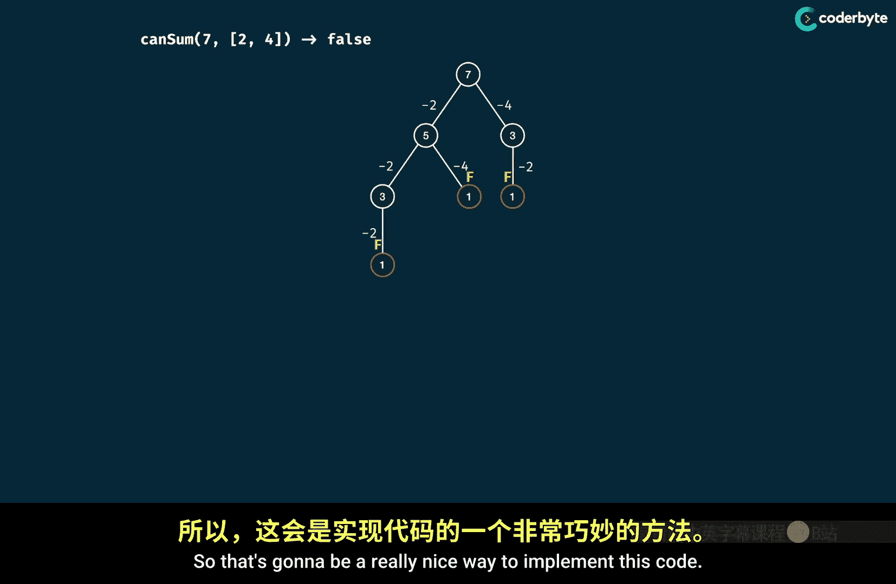

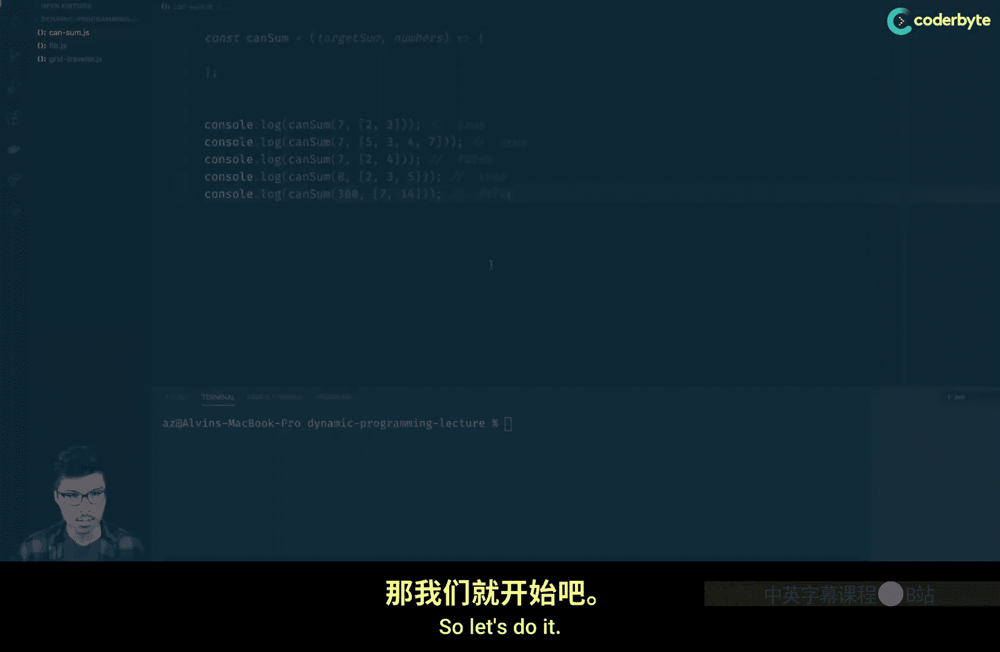

Okay， so let's go ahead and implement this canom function。

 So since we're going to solve it recursively， I think a good starting place as always is to maybe handle some of the base cases。

 So when we drew out the tree， I noticed that one of our base cases was when the target sum reaches the value 0 if our target sum is 0。

 then we have like basically trivially solve the problem because you can definitely always generate the target sum of0 by taking no numbers from the array right so I'm going to return true if ever I reaches 0。

Then apart from that I think let's go ahead and work on the recursive scenario so I know that I need to establish some logic where I make a recursive call or a branch for every element of the numbers array so what I'll do is I'll iterate through that array of numbers so I'll use some four let of syntax while I'll say let nu of the numbers array。

So if you're unfamiliar with the syntax， all it does is iterate through every element of the array。

 so for example。Let's say I just called the first example for Can sum of 7 and an array of 23。

 if I just console that log the nu， then I'm just going to see the elements printed out of 2。

3 right so I'll give this a quick spot check。Nice so just iterating through every number of the array no tricks here。

 but now that I have that number I need the branching logic。

 So remember the logic we use for transitioning from one node of the tree to the next what we did was subtract our current choice of number from the target sum and they basically gave us like the new target sum So I'm going to express that maybe some variable so I'll say all right。

 I'm going to generate the remainder。By calculating the difference between the target sum and the number right so I'm just subtracting the number from my target sum that gives me my new remainder which becomes a target sum right so at this point I think I need to call recursively on Can sum but I'll pass in this remaining quantity。

It does need a second argument still。 I'm still going to pass in the same exact numbers array。

 So I'll still pass in numbers unchanged。 I think that。

 you know the fact that we pass in the same exact numbers array is pretty consistent with the way they stated the problem because we can totally reuse the numbers of the array as many times as we like Co。

 So now that I'm using our function again， I'm making the recursive call。

 I want to think about what this call will return。 I know at any point in time。

 my can some function is going to return Boolean。 And what's great about Boolean data is there's only two possibilities right。

 it's either true or false。 So I think based on what we said about the tree was， if this call。

 if that returns true， then I can just ultimately respond with a true right now。😊。

So we'll write it like this。So this is saying， all right。

 if we figure out that it is possible to generate the remainder using numbers of the array。

 then I can return true for this larger problem of target sum。

So if I find at least one way that works out， then I'm going to do an early return true。

 and the really important pattern here is we don't want to write the else and then return false instead we want to return false after the for loop。

And so here's the reason why we want to return false after the for loop。

 I only know that after I attempted you know all possibilities and I found that none of them worked out。

 can I actually say that it is impossible to generate the target sum right so I need to make sure that this for loop tries all possibilities of number before I can say false the target sum cannot be generated。

Now being said， there's one thing we should add to our code if you look at line 6。

 I'm subtracting our choice of nu from the target sum。

 and that means that sometimes the remainder might become negative。

 So remember in our tree structure， we made sure to sort of return a false whenever we had a sum node that didn't do any branching。

To kind of account for that， I can kind of bake that into another base case。 but this time。

 make sure it doesn't return true。 So I'll say， you know， if my target sum is negative。

 so if it's less than0， then you've gone too far and you can just return false。

Here it's safe to just automatically return false if your target sum hits something less than zero because you've gone too far and there's really nothing else you can add from the numbers array to ever fix that negative target sum。

 remember they told us in the problem that your numbers are always going to be as positive numbers or just zero。

 right？So let's go ahead and give this a go， so I'll try all of these examples。

And we'll see what we get。So I expect a true， true， false， true false。Cool。

 so it looks like a few of them are working， right。

 It looks like the first four are working totally fine， but looks like on that last example。

 my programs still running。 And if you notice I chose a pretty large value for M。

 So kind of like we expect this solution has correctness， but it possibly lacks some efficiency。

 It looks like it just finished that definitely took way too long。😊。

And so this is a very interesting example of a slow input to can sum because for one。

 the length of the array is pretty sure only gave two elements here。

 but it seems like this number as a target sum really affected the runtime。 So's what we'll do。

 let's head back to the drawing board and talk about the complexity of this baseline solution。

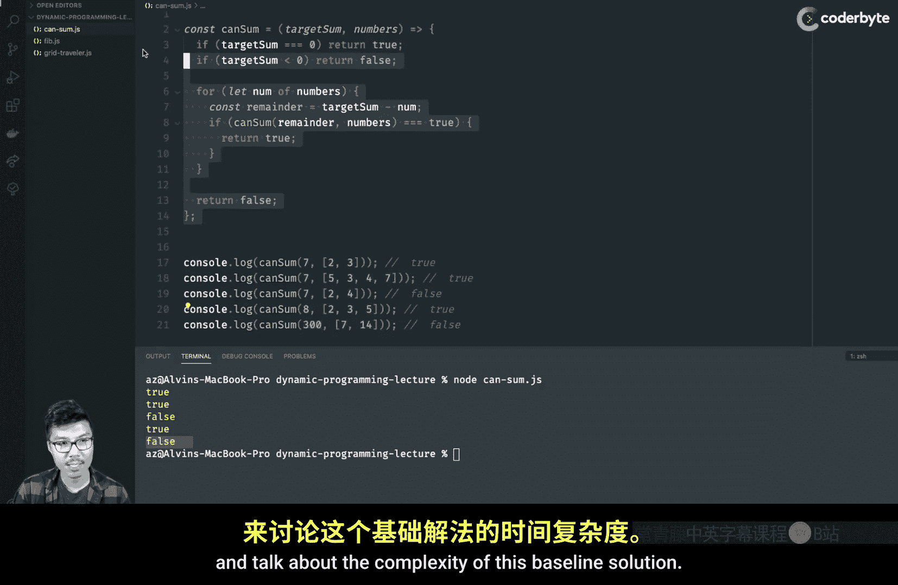

Allright， so we implemented the brute force for our can sum。

 but obviously now we want to make it a little faster。

 but before we kind of just jump into memorizing the solution。

 let's at least describe the complexity of our current brute force。

So let's try to visualize this example， so I have a target sum of eight and my choices for my numbers are two。

 three， and5 in the long run this should return true。

The visual for the full tree would look something like this。

 notice that it's a fairly large tree for some relatively small inputs， right。

 I only have a target sum of eight and only three choices。

So let's try to describe the complexity of this， I'll sort of generalize the shape of it。

 get rid of those numbers。So this is the overall shape of the tree。

 And I know I want to describe my complexity in terms of the input to my function。

 This function has two inputs， though， right， I'll say that M is the size of the target sum。

 and n is the length of the array I'm given。 I know that both of these arguments definitely have an effect on the dimensions of this tree。

So like we did in all of our other examples， I'll start by maybe analyzing the height of this tree。

 That is what would be the maximal distance from the top level call to a base case or in the structure of the tree。

 what is a maximal distance from the root of the tree to the farthest leaf So if you sort of imagine that we have M as the root of the tree Imagine that along the lefthand path。

 we just did a minus1 all the way down right So we kept taking a minus1 right in the worst case。

 maybe there's a minus1 present in our a numbers array In the worst case。

 the distance from the root to a base case would be exactly m because you have to subtract one m times right So I can basically say that the height of this tree is M and kind of like we said in other problems that means that the number of levels is M So now that I've identified the height of this tree the move is now to identify the branching factor that is how does the number of nodes change from one level to the next remember that initially we describe this particular trees。

😊，is having a numbers array length of three。 and you'll notice that the maximal branching factor is exactly3 or in general。

 n because n is the length of the array。 So for example， if I had three numbers in the array。

 then a node would have at most three children because you have three options to take we've seen this pattern before。

 I have M levels and from one level to the next， I would multiply the number of nodes by n right this is the same thing as saying。

 hey， we take n and multiply it by itself， M times and this would definitely give us an exponential complexity in particular。

 N to the M time complexity。 And like we always say another great thing about this type of diagram is we can also derive the space complexity So what would be the space used by the call stack。

 it would really just be the height of the tree， which we already described as M。 So overall。

 our brute force is looking at an n to the M time complexity and m space complexity。😊。

So now that we actually have know those concrete numbers for our complexity。

 let's go ahead and focus on how you can truly improve this。 So here's again。

 the drawing for this particular example。 it's a fairly large one and typically you know when you're trying to notice where there is room to be optimized you might have to give yourself a sufficiently large example to see these scenarios So in this example I do have overlapping subproblem and in the context of my tree that means I have duplicate subtrees。

 So I can look at possibly this subtree rooted at three notice that the roots of that subree is trying to answer the question。

 hey， can I generate a target sum of three using the array and of course once you find that answer。

 that answer is never going to change for your target sum of three so I know that all three of these subtrees or trying to ask the same problem And so what I'll do is I'll just cache those results in my mamo object like we always do。

😊。

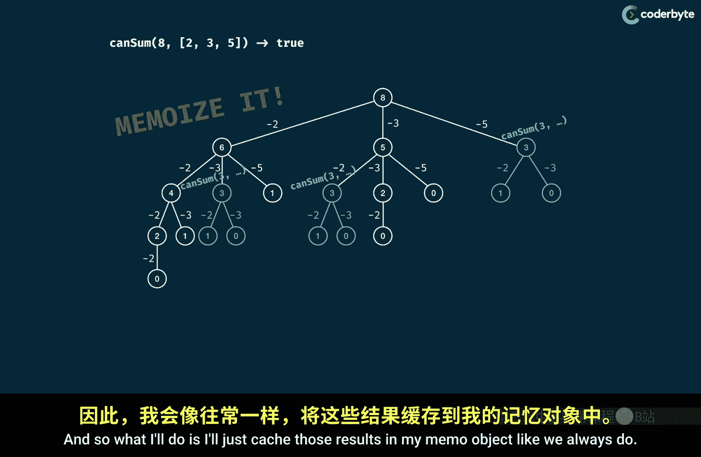

So let's go ahead and work on that。All right， welcome back to my code editor and same stuff different day。

 Let's go ahead and memorize this can sum function right Once we've established the brute force through the recursion。

 then memorization is pretty formulaic right All right。

 so I'll start by just baking in our memo object like we usually do。

 So if someone calls our function without a third argument that is like a top level call。

 well be sure to give them a new object。 And before I forget， be sure to pass down this memo object。

 So I'm going to make sure that every top level call and its recursive tree shares the same memo object。

 now I need to figure out what what should I use to key into the memo object。

 So here I have two arguments of my original function where I have target summ numbers。

 what I want to do is try to notice which of these arguments is actually going to directly impact the return value。

😊。

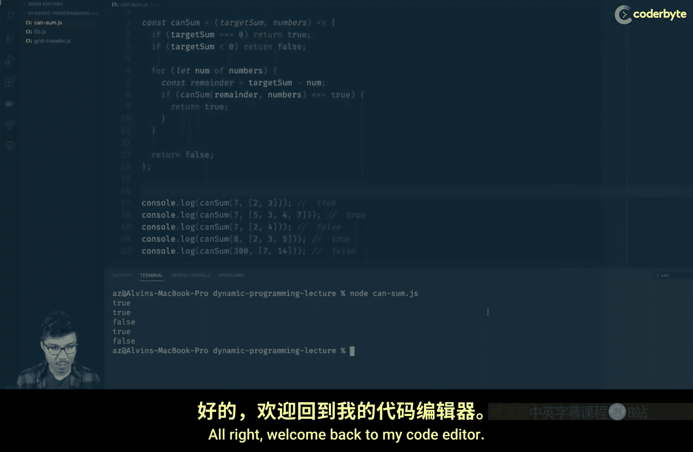

So I know that through the recursive calls like this call over here。

 the numbers argument doesn't change。 And so if it doesn't change。

 then right now it doesn't really affect the return value。

 so I'd be okay to just use the target sum as the key into this memo so I'll go ahead and do that so I'll check if my target sum is in the memo then I've seen that subproblem before so I can just return the stored value。

Cool， and now I have my， you know， memo fetching logic。

 but now I need to actually store things in the memo。 And the trick is。

 what I want to do is look at all of the return values that were not base cases。

 and I need to now store them in my memo。 So I have two return values here。😊，Right， these two lines。

 lines 10 and 14。 And so I need to store data into the memo for both of those lines。

 It's as simple as quite literally going into your memo。

 using your key So target some and then assigning the value you just returned。

 So I'll just write it like this。And this is going to be sort of a hard and fast rule you can always use for a memmalizing a brute force recursive function。

 so I'm just going to take exactly the lines or the expressions that I returned in the recursive scenarios and now just store them in the memo。

Cool， so let's go ahead and give this a shot。 this code is looking pretty good。

And remember before this last call with an input of target sum 300 took notice it be long。

 but I think now when I give this a shot right， it finishes really quick so this is going to be a nice optimized solution for Can some really most of the work of this problem was done in the brute force and then afterwards。

 it's really just a minor adjustment to make it efficient。 So to wrap up this problem。

 let's go ahead back to the drawing board and talk about the improved complexity。

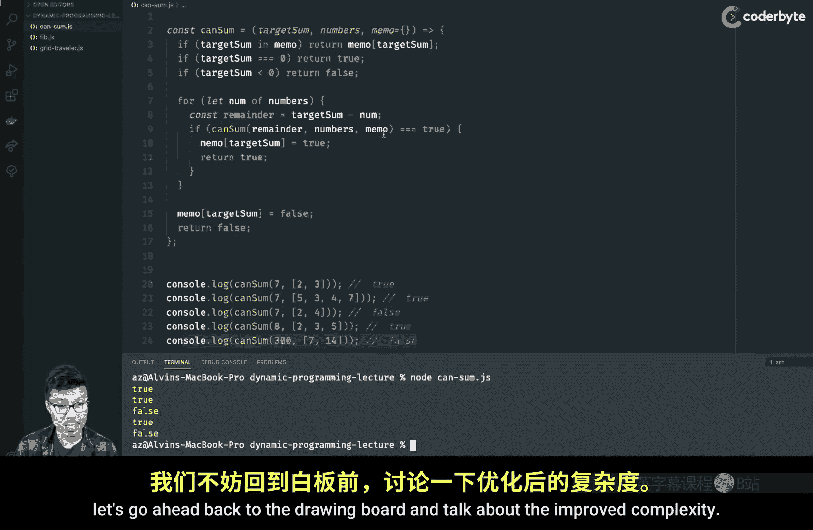

So we definitely memorize the heck out of that code。

 but let's recap by just understanding what the new complexity is。So again。

 we're saying that M is the target sum and N is the length of the array。 Initially。

 we said that our brute force solution had an n to the M time complexity， which is exponential。

 And actually， once we memmalized it， we really cut down on that complexity。

 we brought it down to an M times n time complexity。

 And so here we say that the memmoize complexity is now M times N because of the memo object， right。

 We know that the value of the nodes in the tree are just going to be values up to M or there are M different possible values that we can have in a node。

 However， now， since we are able to cache values or cache results inside of the memo object。

 I'm never going to have to reexplloore a sub treee before M。 That being said。

 I still have the branch n times for each of those nodes， right， So overall， I have M times n nodes。

😊，So hopefully， that can some problem made some sense。

 because what we want to do now is actually carry over a lot of that knowledge to solve this new how some problem。

 So this problem is very similar。 It still asks us to take in some target sum and an array of numbers。

 But this time around， what we want to do is return an array containing a combination that adds up to exactly the target sum。

 And if there is not any combination that actually leads to the target sum。

 Then I should just return null。😊，Along with that， if there are many possible combinations that can reach the target sum then I can return any of those。

 So you're probably already recognizing that this how some problem is very similar in logical structure to the can sum problem right instead of returning a boolean。

 instead now I want to return exactly the combination of elements of the numbers array that leads to my target sum。

 So it's a little more involved。 That being said let's take a look at some examples make sure on the same page。

 So let's say someone asks us to calculate how sum and our target was 7 and our array of numbers are 5。

3，4 and 7。 So there are actually a few different combinations that can give you your target sum of 7。

 one way would be to take 3 plus4。 So that's one possible answer。

 Another possible answer would just be returning an array of 7。

 So no matter which combination array you return， it'll be considered correct in either scenario。

 Let's say I gave you another example where your target sum was 8 and your choice of numbers were 2。

3 and 5。 One possible solution for a combination is 2 plus 2 plus 2 plus2 So I return that in a array。

😊，Another combination would be just 3 plus 5。 notice that no matter what we're always looking to get back in array。

 if it is possible that our target sum can be generated， but let's look at the flip side。

Let's say that we were given this input。 So I have a target sum of 7。

 and my array of numbers is just 2 and 4。 The First thing we notice is it is not possible to actually generate the target sum of 7。

 Like they said， in the problem in this scenario， what you want to do is return noome。

 sort of symbolize that， hey， it's not possible to generate any combination that leads to the target sum。

 All right， I think it's important that we think about one more scenario。

So let's say that I was given a target sum of 0 and we were given really any array of numbers In this case。

 I just gave us1，2 and3。 We already know that in our previous problem we had to return a boolean result we use the target sum of0 as a base case。

 And so what I want to think about now is how is the target sum of 0 just trivially solved。 Well。

 if I want to know the combination that sums to0， then that's really just the empty combination So I think the logical result here is to return an empty array when your target sum of 0。

 Remember that an array represents a combination and if I have an empty array。

 that means I take no elements into my combination if I summed up all of the elements in that empty array。

 it would indeed have a sum of 0。 So that's going to be a really important facet that we need to encode into our logical tree that we draw next as well as our code right。

😊，So let's take a look at how we can structure the tree and try to take a step toward really understanding how we could implement it in some code。

So let's say we're stepping through this particular example of target sum of seven as well as an array of 5。

34 and7。 So the full tree in really the same tree that we drew last time。

 will look something like this from the get go， I see that I have some scenarios or some nodes where I reach zero。

 which means that it's definitely possible to generate the target sum。That being said。

 how can I get back a valid result， Right？ So I need to return an array So you sort of reframe this problem in that。

 all right， all of these base cases that have a target sum of0。

 they are trivially solved because they are combination would just be the empty array。

 right So for now， I'll just kind of trace through how one of these base cases would return。

 So I know that this particular zero is going to return empty array。 And like we always say。

 when it returns， it's really returning that information to its parent， right。

 So this array sort of bubbles up to its parent。And now what I want to do is actually manipulate this return value。

 I want to add something to it。 So I want to really put the number that brought me to that0 in the first place。

 and that would really be the choice of four。 So notice along the edge I have them labeled with a4 meaning that hey。

 I took a choice of4 and I want to actually add that choice into the current array So I'll just really push it into the array。

 of course I actually don't need a negative sign that was just for the sake of understanding the math here。

 but now that my call to how sum of four is returning an array of four。

 that array bubbles up to its parent。 and of course。

 now I need to push that edge that I took which would be that three。

 that three gets pushed to the array as well。 And if I look at what I'm seeing right now。

 it looks like above the7， we have an array of4，3 which makes sense because you can totally generate a target sum of 7 by doing4 plus3 A So4 comma 3 would be a valid answer in this particular problem。

 but like they said you could return really any valid combination。😊，If one exists。

So let's say we chased through this far right base case。

We know that this zero is going to return an empty array。

 that empty array will be returned to the parent， but we also have to add the value according to the edge right So I would put a7 in this array。

 and that makes sense because I could generate the target sum of 7 by just summing up a alonene7。

 So that's still good to go。 So I'm feeling pretty good about how we can return a valid combination if one exists。

 but let's say there are some options that we take that don't work out。 So for example。

 let's say we explored this node first， right this was the first base case we hit and logically in the space of our code it really would be right So I know that this node can't really branch out any further。

 So it's sort of a dead end。 this is a node that should return null， meaning that hey。

 there is no way I can generate a target sum of two using elements in the array。

 If you look at the elements of the array they're all too big So I know that this base case is going to return null。

😊，But along with that， if you look at the next base case it would be this one。

 which also returns null。 And if we look at the next base case to the right。

 that is actually an affirmative one that should return an empty array。

 So it's kind of reason out how these return values should be considered at their parents。

 So I know that both of these values to the left of the node4。

 would return So we kind of bubbles up a little bit。 But for the array on the righthand side。

 I would also have to push the edge that I took， which was a four in this scenario。

 So now I'm sort of comparing the null in this4。 or really。

 I'm comparing all of the branches that I take from a node。

 And if at least one of the branches gives me back an array that I know that it's possible。

 right So basically in this scenario， the array of four actually wins out over the null。

 I know it's possible to generate a4。 Now I just continue this process。

 now I can return these two values to its parent。 So it's considering them at 7 in the same way。

 I would have to add the edge I took， which would be。😊，On this array。And then from there。

 I know the array would always override the null right。

 so I could just ultimately return this four comma 3。

And a really nice pattern in this code is as soon as we find a winning path through the tree or that is we find a combination。

 that creates a target sum， we can actually return early because we don't need to really travel through the rest of this tree。

 we don't need to explore any other options because they're happy with at least one combination。

 right？Awesome， so again to recap the punchline is for this tree。

 I have the information for a combination encoded as a path through edges of this tree right so if you look at this path I have highlighted in yellow。

 I see that I took a three followed by a fort and that eventually led to a0 so I know that one valid combination would be four comma 3。

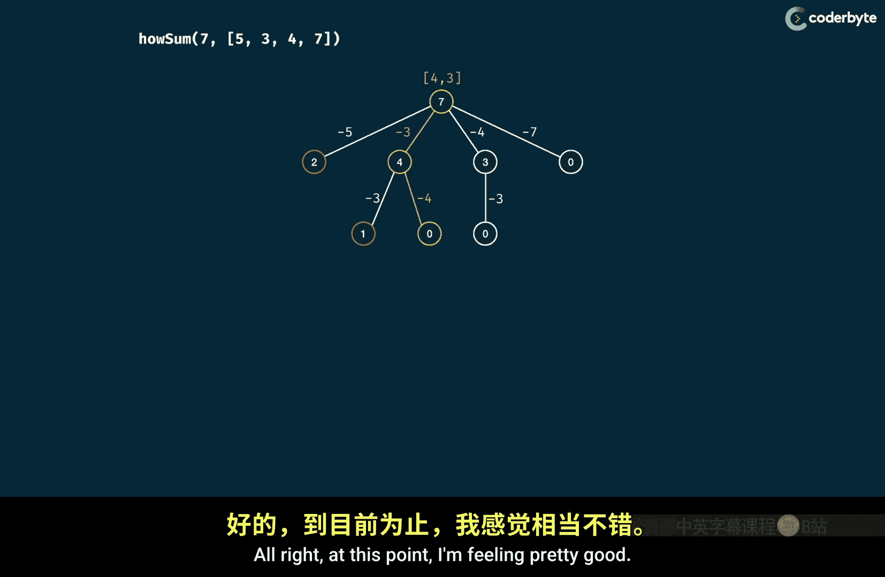

All right， at this point， I'm feeling pretty good， let's go ahead and work on the code for this now。

All right， here we are back in my code editor。 And let's work on solving the house sum implementation。

 So the code's gonna to be pretty similar to the can sum problem。 That's really the whole point。

 We're just kind of going finesse the return data over here。

 So I'm gonna to have a very similar base case， like we said in the tree diagram。

 whenever we have a target sum。 that's0。 we have trivially solve the problem because I could just return an empty array。

 in a similar way what we can do is also have a separate base case。

 if our target sum ever reaches a negative quantity that I'll just return null。

 that's because it's never possible to generate a negative target sum Remember， in this problem。

 the array of numbers is only going to be positive ones。😊。

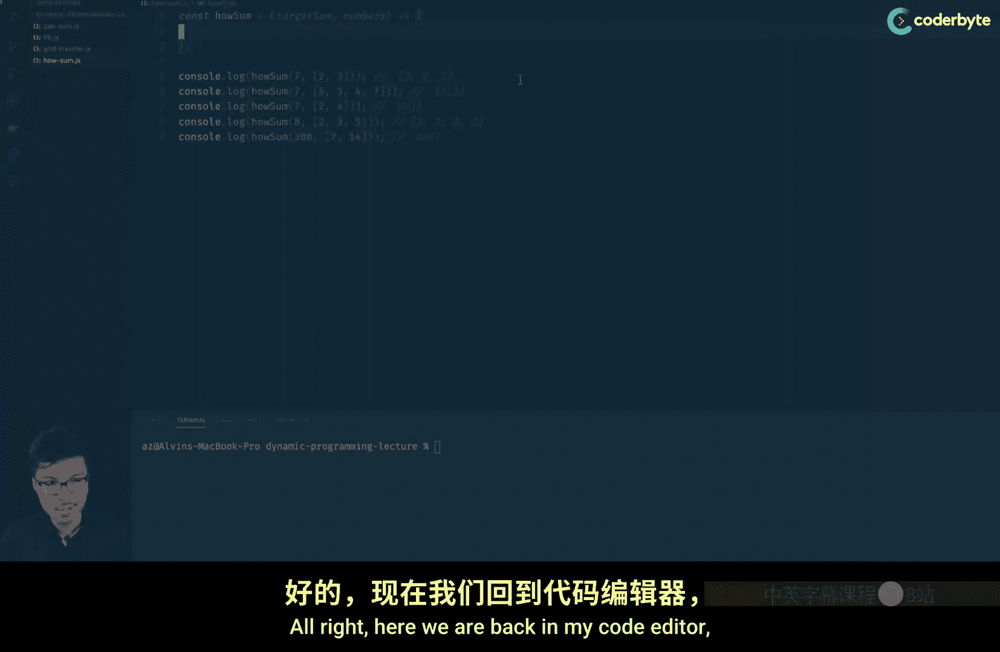

Cool， we ended up writing very similar base cases for our last problem， except now。

 instead of returning true， we return an empty array。 and instead of returning false。

 we return null nice。 So let's go ahead and get the branching logic right。

 How do I want to make my recursive calls。 So I'm going to need to make a recursive call for every element of the numbers array。

 So I'll say let nu of numbers。 So I'm just iterating through every number of this array。

 And I'll go ahead and do the same logic as last time。

 So I'll subtract the number from my target sum that'll give me my remainder right。

 So remainder equals target sum minus my number。😊，Cool。

 so this remainder is now what I want to find the combination for right。

 so here I would make my recursive call。So how some pass in the remainder and the second argument will stay exactly the same。

 I'm going to pass along the same exact numbers array。

 I don't need to remove anything from the numbers array because they tell us in the problem that we can reuse the elements。

 however we see fit， right cool So now I need to really think about what type house some returns。

 So this problem' is interesting because we basically have two different types right。

 we could get back in array of some elements。 if it is possible to generate the remainder or we can get back null when it's not possible to generate the remainder。

 I think no matter what I get back， I'm just going to save into a variable。 So I'll say cons。

 So this is the result for the remainder， I'll call it remainder result。Cool。

 so when I know that in the context of like how I thought about this logic in terms of the tree。

 I wanted to basically do an early return if I found a valid combination。

And so I'll go ahead and check you know if the remainder result is not null， so the implication。

 if I enter this if statement， that means that it is possible to generate the remainder。

And so what I can do is just return early and I can return basically almost the same remainder results。

 So the same array。 However， I need to make sure I include the element that I took recall from the diagram whenever we had a recursive call。

 that returned in array。 the parent had to also add the number that it took to transition to that recursive call in the first place。

 so in the context of the tree， I had to put the labels of the edges into the array here that means I have to put the nu into this array。

 So some syntax， I can use for that to use some spread operator so I can copy all the elements of the remainder result into this new array。

 but I'll also add on the number I just took right So all I'm doing in this return line is I'm returning basically the same array that I get back from my recursive call with the number added to the end of it。

 let's say you're unfamiliar with the syntax， I can preview it really quick。 It's pretty neat。

's hop to the node reple。 So let's say I had some array。😊，I's say it was this the array of just A，BC。

 sort of an isolated example。You can use the spread operator。

 which is the three dots here to like unpack an array， and you can sort of say like new array equals。

Bracket， so this gives me a new literal array。 And then I can spread out the elements of the old R。

 right。 So if I do that， then new array just has all of those same elements。

 If I capitalize that properly。 cool， we can extend that syntax， right。

 So I still have that array of ABC。 Let's say I had another variable。 We'll call it other array。

 What I can do is create a new literal array。😊，Copy all the elements from R using the spread operator。

 and then I can come of separate any additional things I want to add while I'm here。

 So let's say I added a Z。So if I look at my other array now， it contains AB。

C and also this new element Z。 So it's all I'm doing on this line， right。

 I'm returning the same combination that my recursive call gives back with the number that I took added to the end of it。

Cool， so what's really nice about this code is it's very reminiscent to our previous code because we have an early return。

 So if I find at least one way to generate the target sum。

 I could just go ahead and return that first way that I found。

 They say we can return any valid combination here。

 But let's say this for loop finished and we never found a valid way to generate the target sum。

 Then after the for loop。😊，You can just return null because it's not possible not to generate the target some apparently。

Cool， so this code is looking pretty good。 I think let's， let's give it a shot。

 goes without saying sometimes the remainder right， will become negative。

 but we already handled that with this nice base case， right。So let's test this code。

So I already have some example outputs over here。So looks like our first few examples are working obviously our last one seems to take quite a long time。

 so I'll just kill this program early， but before we talk about how to optimize for this larger example over here if you look at these other examples what I can see is this array of3 to2 does add to7 so that's looking good this array of 4。

3 now also adds to 7 so that's good we already saw that this example of7 and2。

4 that should return nu because it's not possible to generate that sum and looks like the array for the eight example is also good to go。

So notice here there are also some other arrays that we could have returned。

 and it would still be considered valid output。 The exact combinations that we get back are really just dictated by the order that we happen to iterate in the array。

 So for example， let's say I switch things around here。 Like I did 3，5，2。

 It's really the same array just in a different order。

 We'll probably get a different answer for that particular one right？ So I'll run this now。

 Notice I get 2，3，3。 But in either case， that still sums to 8。 So where totally good to go。 A。

 they bring this back to the original code。😊，And yeah。

 it seems that now the limiting factor seems to be the speed of our solution， right。

 we've been here before。And so let's go ahead and talk about the complexity of it。

So we know that the time complexity for this is almost identical to what we did in the canom problem。

 which is conveniently over here， but sort of refresh by now you recognize that all right。

 the time complexity should be described in terms of like the recursive tree。

 So let's lay down a little foundation and we already know that M we're going to call the target sum。

😊，And let's also say that n is the numbers dot length。Cool。

And so if I think about the number of recursive calls that I'm going to make。

 it's really the same as last time， right， So I'm going to say that， hey。

 the time of this function seems to be O。And I have an exponential。

 the base of the exponent is the branching factor， which is the length of the array。

And then the depth of the tree would be the expon， which is just M。 right。

 So this was the same time complexity as last time for our brute force， Rights M to the M power。

 However， it looks like we have some additional time that we consume in this function。

 really coming from。This expression， right， So if I look at line 9 in particular。

 this line creates a copy of an array。 So that will actually take sort of a linear number of steps to copy over every element of an array。

 right So I will have to consider the cost of this operation。

 it's sort of under the hood like iterates through the remainder result。

And I know that the maximal length of the remainder result I can get back will be at most M right。

 Remember that remainder result in the worst case is going to be an array。

 The longest that array could be is exactly the target sum right Imagine that we had the most simple。

 you know， sort of a combination to generate the target sum。 If it was just a bunch of ones。

 right my target sum was 50。 And I had an array filled with one。

 that I can just do  one plus1 plus1 plus1，50 times to generate the target sum。 So in the worst case。

 this copying operation will take M steps。 And I need to do that for every recursive call。😊。

And so if I have this many number of recursive calls in addition to that。I do an M operation。

 You just multiply that M right So the time complexity for this brute force so far is n to the m power times M。

 Really， the thing we want to optimize away is this exponential part。

 right So I really want to focus in on that。 But while we're here。

 let's go ahead and talk about the space of this brute force。

 So the space a few things to consider the terms of the stack space。

 it's going to be the same as last time。 So it's going to be O of M。

 But think about any other space I use up。 I guess you could should also consider the array that you return back However。

 we know that we're going to return back like the first array that we find all the way back up to the top level call and the combined length of all of those arrays that we return is really just going to be in worst case M right So I would still say that the space complexity for this function is just M right now。

😊，Cool。Obviously， let's work on optimizing this time complexity。 so this was the brute force。

 so brute force。And you guessed it there is definitely some duplicate sub problemsm in this brute force。

 So we'll just memorize it away。 So very formulaic stuff。Most of the work is always the rootte force。

 So I'll start with my empty memo object。 And like we always say。

 we'll use the target sum as our key。 So if I've seen the target sum before， that is。

 if it's in the memo， then I'll return what I have stored in the memo。And at this point。

 what I want to do is make sure I pass along the same memo object to all of the recursive calls that way they can benefit from any information or any subpros that I worked on over here right in this stack frame。

Cool， at this point， I need to make sure that I take all of the return lines that I had before and I store them in the memo right。

 So the trick here is I can say memo of target some。

I'm going to save that array so notice that now the values in the array or sorry。

 the values in the memo object are going to be arrays because that's the return value of this it's either going to be an array or null。

 right？So I'm just going to complete this return value by returning what I just put in the memo。

And in a similar way， I also want to memize this late return。

 so it will also be memo of target sum equals null， and I can just still return null。Cool。

So with that change， right it's very， very straightforward change。 let's see how this does now。

 I know that for this last example of how sum 300， it is not possible to generate the sum of 300 using just sevens and 14s。

 so I should have get a null for that one。So let's give that a shot。Nice。

 and there I have a really quick running a null over that very last example。

 So we definitely had an effect on the runtime here。

 Let's talk about how we changed the complexity of this code。 So that was the big force。😊。

Let's talk about the memorized version。So it's good with the time over here。

 So we know that in terms of the time complexity from the number of recursive calls that we make。

 it's the same story as our last problem right we just have to consider any other time operations。

 which would still be this array copying but in just terms of the recursive calls that we make it's going to be n times M a recursive calls and then in each recursive call。

 I need to do this copying pattern copying over the contents of an array and the array will be at most M elements long So if I have this many recursive calls and each recursive call needs to make in m length operation that I just multiply by another m term So right now this looks like n times M times M。

 which is the same as n times m squared and now let's talk about the space complexity。

So the space complexity will be at least as big as our brute force。

 So it's going to be at least o of M。 but now we have to consider all the space we use up in the memo object So if think about the keys of this memo object。

 the keys are just going to be all unique values of target sum right because I just literally use target sum as a key on all these lines。

 right。But then I have to think about the value， The values are going to be pretty chunky now because sometimes a value in the object is going to be an array。

 And I already said that the maximumimal length of any of these arrays that I return is going to be of length M right？

 So to me， it's now the case that your space complexity comes from mostly your memo object。

 which is going to be of size M times M， because you have M keys。

And each key has a value which is at worst going to be an array of M elements， so it's m times M。

 which is M squared。Guo。Notice that we definitely cut down on the brute force implementation。

 especially in terms of the time complexity， obviously there' was a little trade off that we made here。

 but now we're able to run our how some function in a reasonable amount of time。

So to wrap up this problem， let's go ahead and hop back into the drawing board。

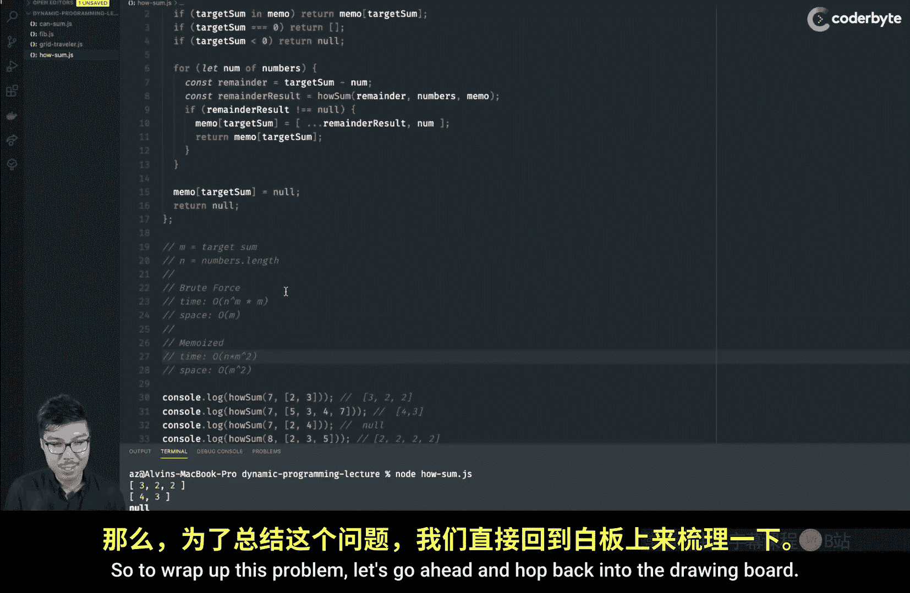

All right， now that we coded the how some problem， let's wrap it up by actually analyzing the complexity of it。

So recall that for our housesome problem， we have multiple arguments， right。

 so I need to describe them so I'll say that M is my target sum and n is the length of the array。

 Remember that the array contains the choices we can take。

And our baseline solution that is our brute force recursion， had an exponential time complexity。

 right， it was kind of in the form of n to the m power times M。

And after we actually optimize it using the memmoorization strategy。

 we actually reduced it from exponential down to a polynomial time complexity。 in particular。

 our new time complexity was n times M squared。 So really important fact about our memmoized time complexity is it is no longer exponential。

 Please recall that when we have M squared。 that is not exponential because the exponent is a constant number。

 Co。 if I look at the space complexity for this。 I had to actually pay a little more cost in terms of the space because of the memorized object。

 but that space complexity we use up is still not exponential。

 still a polynomial or quadratic complexity。 So I'm still satisfied with it overall。

 So we definitely prefer this memmoized complexity over the brute force。 All right。

 that was the how some problem。 but now let's go over one more variation of it。😊。

NowIn this problem I'll still give you a target sum as well as an array of numbers to choose from。

 but at this time what you want to do is return an array containing the shortest combination of numbers that adds up to the target sum。

And along with that， if there's any ties for the shortest combination。

 you can return any of those shortest ones。So from this description。

 you probably recognize that this is similar to our last two problems。

 but now they're asking for a little bit of an optimization right So I want the shortest sum。

 so that means an array containing the least amount of numbers。

 but it still adds up to the target sum。 So're really just going add on top of our previous understanding。

 So let's take a look at a few examples。 So let's say I gave you this example。

So here my target is 7 and the numbers I choose from are 5，3。

4 and 7 so there are a few different ways you can generate your target of 7。

 one way would be to do 3 plus 4 that's one combination。

 but another way would be just take the 7 because notice that 7 is actually a member of the array and here I want to choose the smallest array which would be just the lone 7 so that would be the expected result for this one。

In a similar way， let's say I gave you a target sum of eight and your choice of numbers were  two。

3 and 5， there are plenty of ways to generate eight， you can do 2 plus 2 plus 2 plus2。

 or you can do 2 plus 3 plus3， or you can just do it 3 plus5。

And here I want to return always the shortest combination， which would be the3 plus5。

 so that would be the result over here。Cool， so we definitely have some awareness that， all right。

 this problem a similar structure to our previous one where I need to sort of generate a way to make the target sum。

 but now I want to really specify the shortest array， right？😊。

So let's try to visualize this as a tree like always。

 So's say we were stepping through this example with the target sum of 8。

 So we know that the full tree would look like this。 and we've seen this tree before。

 but now what we're trying to do is come up with a different process for the value we return right It's no longer going to be valid to just return the first way that I find to generate the target sum Now I want the best way。

 So let's start coming up of the strategy for this。 At this point。

 we know that we can definitely implement some logic in our code where we return in array up our recursive calls。

 We did that in the last problem。 So here we'll sort of use some abstraction to assume some return values。

😊，So let's say that I'm breaking this problem down。 My top of a problem asks me。

 what's the best way to generate 8。 But I see that along that path。

 I have to find the subs solutionolution for the best way to generate 6。

 So let's say we're rooted at this sub treee。 and we know that there are a few ways we can make 6。

 if I look at this sub tree rooted at 6。 there are two0 base cases， you know， downward， right。

 So if I look at the first one。 look at this path。 I know that my subree over here will' be able to know that。

 all right， one way to generate 6 would be 2 plus 2 plus 2， right。

 We kind of implemented that logic in the last problem。😊，But now。

 what I also want to do is consider any other paths in case they end up being shorter。 Obviously。

 I know that this path of 3，3 utter return upward。And now I have to kind of make the decision know between these two options for generating6。

 I should just prefer the shorter one so that means it's sort of 222 versus 3。

3 and obviously the 33 wins because the array length is shorter And if I pause right here and I look at what the diagram is saying。

 it does make sense that above the6 we have three comma 3 because that is the shortest way we can ever make a 6 right just 3 plus3。

But now I can return this sub to my parent。But if I do that。

 I should also include the value of the edge along that path right。

 so I also included the two over here。Now， this makes sense because one way I can generate 8 is 3 plus 3 plus 2。

 right， But we know that's not the optimal way。 Let's say we stepped through this a little further。

 Let's say we took the same sort of process for this other child of  five。

So I know that to generate five， there are three options according to the sub， right。

 because I see three different leaves that have0 inside of them。 And so I know that for these paths。

 they would work out for their own subs。And here， I really just want to choose the shortest one。

 right， So obviously， the lone 5 wins out over here。

 So that would be returned all the way up to that five node。

But then that five node will return it to its parent。But then， of course。

 I need to include the edge that connects the 8 to the 5， right。

 How did I transition to that 5 in the first place， So I go ahead and just add it in。

 And now the root node over here has a decision to make。 Which one does it prefer between 3，3，2 or 5。

3， It'll just choose a shorter one， So the 5，3 should win out over here。

And I just need to continue this process for any other branches in my tree right I can't return early in this type of problem because I need to find the optimal way and I can't be sure until I've tried every possibility。

Cool， so it looks like our overall logic is we want to explore and find any ways to generate our target sum。

 But then when we find a way that's shorter than our currently tracked way， we can just replace it。

 I'll continue that process through the entire tree。

 if I check every possibility and keep replacing what I consider the shortest by the end of us exploring every branch。

 we would have the absolute shortest。😊。

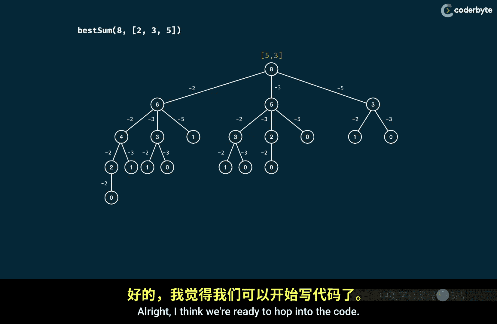

All right， I think we're ready to hop into the code。Al right， programmers。

 welcome back to my text editor。 Let's work on coding this one out。

 So here I have some initial examples that we'll use to test our best sum function。

 I notice for this last one， right I give my initial target sum of 100 and the best way to do that is obviously just take a bunch of 25s 4。

25s。 what I also want to bring our attention to is this third example over here。

 So my target sum is 8 and my choice of numbers are 14 and 5。

 The optimal answer here is 4 and4 That is the shortest way to generate 8。

 a common mistake I see a lot of students make is sort of assume that the best way to generate the target sum always involves taking the largest choice of number as many times as we can right That is not true。

 If you took a5 in your sum then you would have to take31s in the long run。

 which is not going work out to the shortest answer So it's not the case that just taking the biggest choice of number always yields the target sum in the shortest amounts of numbers overall。

 So don't fall into that trap。 which means that we have to do the full tree exploration have to。😊。

An exhaustive sort of search using our recursive code。

 And so let's start with that base case like we always always you。 So written this a few times。

 but I'll still write it here。 So if the target sum is0。

 then I have trivially solved the problem so I can just return an empty array right that is the exact single combination and the shortest combination that can generate the target sum。

Cool， along with that， let's handle that scenario。 If our target sum goes too far downward。

 So if it's less than 0。 So if the target sum is less than 0， I'll just return null。

 meaning that it's not possible to generate that target sum。

And now we'll use our branching logic so I'm going to iterate through all choice of numbers。

 so I'll say four， let nu in numbers。And like we always do， I'll go ahead and create my remainder。

Which I know would be the difference between my target sum and that choice of number so what I'm doing is I'm choosing the number and that decreases my target sum。

 And at this point， I would make my recursive call right with that remainder passing in the same numbers array。

But now I have to do some thinking。 I know that all right。

 best sum is either going to return to me a combination or an array or it's going to return null。

 So I'm going to have to kind of differentiate between the two。 So over here。

 maybe I'll just save this as a result。 I'll call this my remainder。Let's say， combination。

And if this remainder combination is not null， then I can do some other logic， right。

 so I'll say if the remainder combination is not equal to null， then do stuff。

So if I enter this if statement， then that means it is possible to generate the remainder and exactly what remainder combination is is an array containing the shortest way I can generate the remainder。

Cool， so if I enter this if statement， then I also have a way to generate the full target sum， right。

 I can just take the remainder combination， copy the elements over from it like we did last time and also add on the choice of number I just took right So this would be now a complete combination for target sum。

 So I'll just save that as a regular combination。😊，Cool。

 so so far this is very reminiscent to our last one and we need to work in some more logic relevant for this problem。

 that is a very， very important characteristic that we needed implementing。

 The tree was I need to sort of choose the shortest combination right so I'm going to need to work in that logic。

So here's what we can do。 I know that I need to compare basically all of my branches together。

 all of my recursive calls together and pick out the shortest combination。

 So I know that this for loop is the piece of code that sort of iterates and attempts all of my branches。

😊，And so outside of the fore loop， I'm going to need some outer variable。

 I'll call it my shortest combination。 And over time。

 I'll just keep updating this variable if I find a combination shorter than my current shortest combination。

 right， So I'm going to initialize this to null。And the reason is imagine that we set up this shortest combination variable as null and then we iterate through the for loop and there isn't even any way to generate the target sum so this four loop finishes and shortest combination would still be null and that'd be great to return because in this problem they said if it's still not possible to generate the target sum at all。

 you should still return null so this is a good initial default value a4 shortest combination。

But now I need to do my update logic。 So here on line 11。

 I've actually created a combination that gives me the target sum， but now I need to check right。

 so I'll say if the combination，Is shorter。Then， the current shortest。Then I need to update it。

So its translate that into some code， we just using if statement and I'll start by checking if the combination that I currently have。

 which is in array right， I check if that is less than in length than the shortest combination variable。

And really， it looks like shortest combination。 It starts as null。

 so I need to fix this code up a little bit， but if I update it with a valid combination。

 then it's going to be an array， right So I'm really checking the length of the arrays here。So。

What I want to do is assign my shortest combination with the combination that is now shorter。 Good。

 So this means the shorter combination wins out and gets to stay。 right。 If I look at this code。

 it needs a little bit of work because the first time I find some combination。

I know that I'd be comparing that array length to null dot length。

 right because shortest combination。Starts as null。 And I can't do null dot length in jascript。

 So I'll need to like a nice ore clause here。 So I'll say。

If it is the case that your shorts combination is equal to null。

 then you can go ahead and replace it。Cool， so this sort of check over here is going to make sure that I automatically replace this null value with the first valid combination。

 even if right now it may not be the shortest right later。

 I'll compare that combination I have stored to some possibly shorter combinations。Cool。

 so this code is looking pretty good。Let's go ahead and give it a little test run nice notice that on occasions where we call Bessum with a remainder that is negative because remember sometimes we subtract and none of them is maybe too large。

 that's okay because that will actually bottom out at of base case and return null。

 which we sort of check for explicitly in this if statement。Cool， so let's give this code a run。

So node best sum。So I again error over here looks like I get maximum call stack size exceeded。

 which means that we didn't really hit our base case。 So there's some work to be done here。

 So let's take a look at this code。 So if I take a look at this code， it's a very。

 very small typo it's kind of unfortunate that it breaks the entire code。

 but it's really I messed up when I iterated in the for loop over here。

 So here I wrote for letinum in numbers that would actually give me the indices of the array so I'd be like 0。

1，2，3 whereas I want the elements of the array right So instead of in I need of over here。

 So that's on me。 So with that small change， let's give it a run now。

Yeah it looks like we're passing these first three examples where I have 7，3，5 and 4，4。

 notice that the order among the elements in the combination doesn't really matter too much。

 but looks like we're definitely a little too slow on this last example over here。

RightSo obviously we know the move is to memmalize this because we have the brute force recursion。

 but before we do that， let's just talk about the complexity of this。

 So this code is going to be very similar in complexity to our last how sum function。

 we sort of compare the two It's almost the same code if I do these side by side these two functions look very。

 very similar。 So we know in the long run， probably have the same or close to the same complexity。

 But let's be methodical。 So we know that over here we always like to say that M is the target sum。😊。

And then we'll also go ahead and say that n is the numbers dot length。So we just did the brute force。

And our brute force should be the same story as last time。 So talk about the time。

 So the time of the brute force is going to be some sort of exponential。 right。

 If remember that tree drawing in general， the exponential number of nodes in a tree will be the branching factor to the height power。

 So I know that the branching factor here is n， right， I branch for every choice of number。

And then the height of the tree would just be the target sum， so that's n to the M。

But along with that， we also have some additional operations right If I look at this for loop。

 So this for loop gives me the branching factor but then I also do this operation on line 11。

 which is copying over the array of remainder combination and that array in the worst case will be of length M the largest sort of a combination give me back is a combination that is just filled with a bunch of ones right if my target sum was 50 the longest combination possible would be a bunch of ones。

 So 501s in an array。 So what I'll do is I'll say that for each of these n to the M power calls。

 you also have to do a linear operation in M So like before it's n to the M times M。😊，Cool。

 and then the space complexity is sort of interesting in this one because we're maintaining some values。

 So look at this。So if I talk about the space complexity just from the stack space。

 it would just be the height of like the recursion， in other words。

 it would be M over here so I know it's going to be at least M。 so I'll jo that down。

But then we have also like this variable on line 5， right？ So I know that over time。

 I'm going to be storing an array inside of this variable。

 and this array is going to be in the worst case， M in length， right。

 So what I'm saying is every recursive call would have to have its own shortest combination variable。

 if the shortest combination variable is going to be an array of length M。

 That means I have an array of length M for every recursive call。

 right before I bottom out at like my final base case。

 And so also have the space complexity here is M times M。

 which we know is the same thing as M squared。 And sort of the reasoning is your maximal stack depth。

 is still M， like last time。 However， now in each of those stack frames， you need to store in array。

 right as you recurse。😊，Nice， so really， the limiting factor for us right now is going to be the time complexity。

 which is exponential。 And so like we always say， let's go ahead and memorize this。 So memoization。

 pretty trivial right now right， you've done it many times So I'll just bake in my initially empty memo object I'll check if my target sum is in the memo then I should actually return the stored value。

 So return memo at target sum。 So now that I have my memo checking logic。

 What I also want to do is add the memo storing logic right So I need to just go to my return value and store it in the memo before I return it。

 notice at the return value right now。 it's no longer inside of the for loop right in the last problem。

 it was in the for loop because I can return early but this time we're gonna return at the very end。

 so I'll replace it over here。 So I'll say for here。

 the memo at target sum should be stored with the shortest combination I can still return the shortest combination。

😊，And before I forget， let me go ahead and pass down the same memo object by reference。 All right。

 Nothing too much to that。Let's go ahead and try this last example now。Give it a shot。

 awesome and there we have it。We have 425s in this last example。

 and that is the best way to generate 100。 and It is pretty evident that we cut down on the runtime。

 So let's talk about the memo wise complexity。Memmoized。

 And so the time is obviously much faster should not be exponential。 But if I take a lay of the land。

 I know that now every target sum is going to be a key of the memo object and target sum is really just a number。

 right， So if my target sum is 50， then I basically have 50 different keys I can ever store in the memo object。

 So if I have M different keys in my memo object。 I know that I won't be exploring any full duplicate subrees for each of those keys。

 However， I will also have to branch for every number in the array。 right， So overall。

 I'm looking at in M times n。😊，So so far I have m times n。

 but I have some additional work from this array So notice that the n over here that comes from this for loop。

 I'm itering through numbers， but then the additional m comes from copying over this array。

 which would be linear。 So it would be M times n times M。

 and I can just kind of squish these two ms together。 So it kind of boils down to M squared times n。

 which is really the same thing as last time。 Now our space complexity would also be the same as it was last time。

 which was just M squared， mostly coming from the memo right And the logic is your memo keys have M possibilities。

 but for each of those keys， their value can be an array of length M So is m times M or M squared。😊。

Awesome， so looking at this code， you're probably， you feeling that， oh my gosh。

 like this best sum problem is pretty complex。 And I think it you know， to be honest， it is， however。

 what I really want us to focus in on is this like progression we took right I think that everyone could tackle this best sum problem if they warmed up and really understood simpler problems like can sum and how some right the code is very。

 very similar。 So threw wrap things up。 let's do some closing words on the drawing board。

 So in this best sum problem right， we had two inputs。

 we had M as our target sum I'll also say that n is the length of the array。

 So the brute force that we initially implemented with just some recursion was exponential in time。

 And after we optimized it， we brought it down to just a polynomial time complexity。😊。

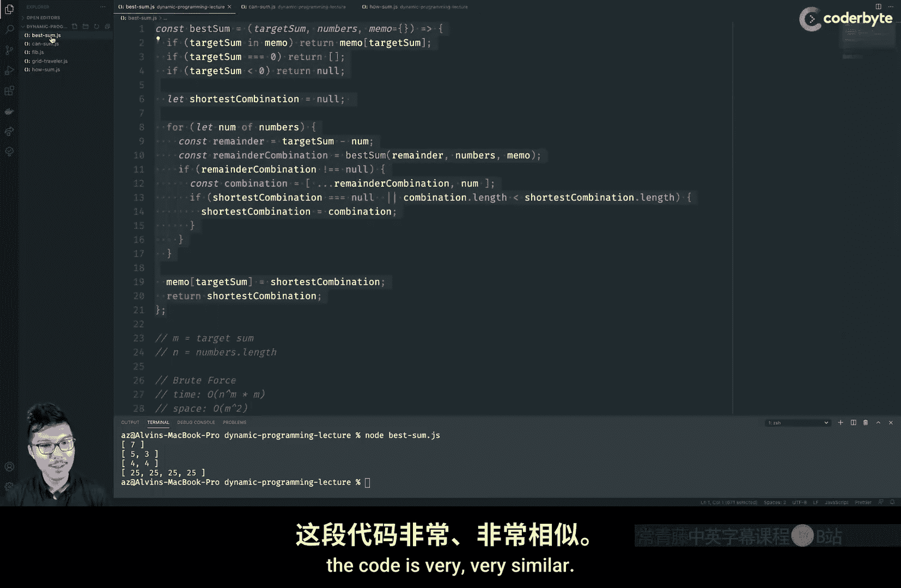

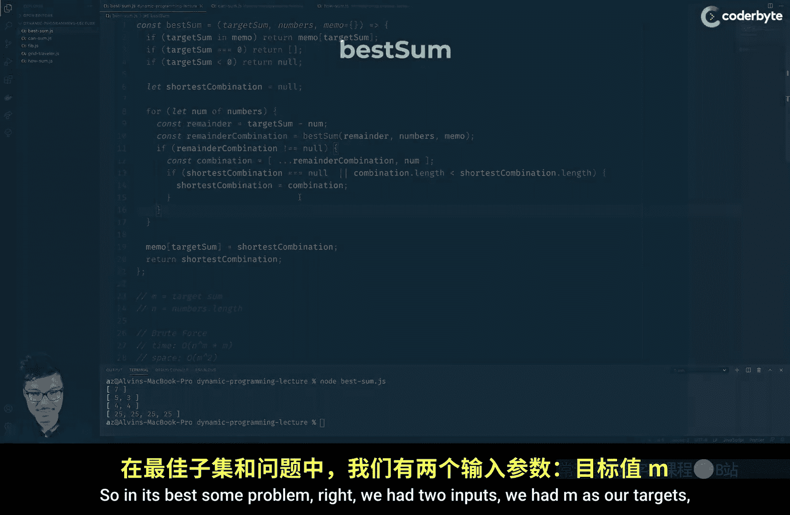

And notice that between our brute force and our memorized solution。

 they actually have the same space complexity。 so we definitely prefer this memorized version。

So I hope you enjoyed the series of problems。 That is， we worked on the can some。

 howsome and best sum problems。 They all had the common frame of us having some target sum that we need to generate with some options given in an array。

 And in particular， if you look at the can some problem It asks us with that task of generating target sum。

 Can you do it， So yes or no， The howsome problem ask us how will you do it。

 So what are the exact combination of elements that you'll use And finally。

 the best sum was the hardest version And it asked what is the best way to do it in terms of the least number of elements of the array。

 So there definitely is a logical progression to these problems。 And in particular。

 they kind of capture a different variation of a dynamic programming problem。

 for our can some problem， right， we had to return boolean there。 that's a type of decision problem。

 Yes or no， can you accomplish this task， Is it possible， along with that。

 the howsome problem was a combinatoryic problem， We want to know the exact combination that works out。

 And the best sum problem was a variation of an optimization problem I want the shortest way to generate the target sum。

 We saw that。😊，These three problem types definitely have some common ground。

 but they also have some nuance depending on exactly of the question we're trying to answer and these all fall under the umbrella of a dynamic programming That being said。

 dynamic programming problems aren't just limited to number inputs。Alright。

 I think it's time to work on another prompt。 Let's say I gave you this What I want to do is write a function called Can construct that takes in some target string。

 as well as an array of words in a word bank。😊，My goal is to return a boolean。

 indicating whether or not I can make the target by concateing together elements of the word bank。

 And along with that， we can reuse as many elements as the word bank as we see fit。Alright。

 notice that in this problem， we're looking for a boolean response to start right， So just yes or no。

 is it possible to generate the target， So let's take a look at an example here。

 Let's say I gave you this。 So my target is ABC， D E F， and I have a nice long array of some words。

 And so I'm basically asking， can you construct ABC， D EF using elements of the array。

So if I kind of take a look at the array， there is exactly just one way to generate the target string。

 which would just be ABC plus DEF。 So the answer here is true because there is at least one way to make the target。

 right。Let's take a look at the opposite example。 So let's say I had this word of skateboard and I gave you all of these words in an array。

 So take a moment to kind of look this one over and you tell me right。

 is it possible to generate skateboard here。And the answer here is no， right。

 It is not possible to generate skateboard using this array of words， so we should return false。

 we can get pretty close to making skateboard， but we can never build the full string， right。

 So here are a few ways that we can attempt， but they don't work out in the long run， right。

This is one series we can take， but we kind of get stuck as well as this。 and also this way， right。

 point being there are zero ways we can ever now generate skateboard。

 So we should return false over here。 Awesome。 So I think let's look at one more example。

 We should already have the vibe that in general， it's easier to create a shorter string than a longer string。

 right， So create a longer string， you're probably going need to use a more elements。

 So if I have that kind of framing in mind。 that I know that possibly the easiest string to create would be the empty string。

 So let's say your target was the empty string。 And I gave you， you know。

 some kind of random array of words， really， the array of words doesn't really matter here。

 I think no matter what this should return true。😊，Because to generate the empty string。

 you can just take， you know，0 elements from the array。

 And that kind of line of thinking is going to help us really start to solve this problem。

 So we'll kind of take this example。 and stride。 what we want to do is return true if our target is empty and that takes place。

 no matter what array of words were given， right。Cool， more or less。

 that kind of sounds like a base case， right？But let's go ahead and start to kind of define some process we can take to explore all of the options。

 right， So I want to really visualize this in a well ordered way。 And that really means a tree。

 right So let's say we're gonna to trace through this example visually。 So my target is ABC， D E F。

 And we already said that in the long run。 we should return or conclude a true about this input right So we'll just start with the input argument that is the target string as the root of this tree。

 And this is sort of a scenario where like， all right， I have two inputs。

 How do I know which one to really encode in my drawing。 Well it's about what will actually change。

 I know from like one instance of like this problem to the next。 the array of words。

 I can actually reuse as many times as I need。 So it's not like I'm taking out elements from the array。

😊，So with that in mind， I think it's better or more reasonable to encode the actual target string to the nodes of this picture。

Cool， so I'm going to start with this original target string of my root。

 Now I have to think about how I transition to the children of this。 right。

 So what moves do I take that hopefully shrink the target string， right。

 I know I need to shrink the target string because I already have the base case of the empty string in mine。

 So I need to get closer and closer to a length of 0。We'll talk about one transition we can make。

 So I know that I need to sort of use the array of words as I transition。

 And so let's say I took A B as a choice right now。 If I take A B， then I guess I could remove。

 you know that sequence of characters from my parent node。 So if I take A B out of A B， C， D E F。

 then the resulting child is just C， D， E F。Cool so notice that as we transition from onen to the next。

 looks like we're taking out that substring in a similar way， I have another。

 you know substr that I can take out for my word bank and that would be ABC。

 and that would yield in the child D EF。And then I can do this for some other string inside of the word bank。

 And the really important thing to know is there's a correct logic to doing this。

 and it's also a common trap。 I see a lot of students fall into when it comes to this logic。

 So right now， I'll talk about like the common mistake。

 So it would be ill advised to sort of take out the C D from our root node。 If we took out C D。

 then the resulting node would be A B， E F。 And so what we're doing right now is if we took out C D。

 you're taking out something in the middle。😊，And if you take out something in the middle。

 that means that your resulting string actually creates a new adjacent sequence of characters。

 In other words， I know that this is kind of suspicious because if I look at this little run of characters。

 A B E， those are now like adjacent next to each other， whereas in the original string of ABC D F。

 A B， E was not present， right， So if I kind of take out strings in the middle。

 then I'll have this sort of mistake of creating new adjacencies。

 and that would actually impact the moves I take later on。 So I don't want to do that right。

 So the move here is to not take out any characters from the middle of the string。😊。

So what to be the correct way of doing it。 Well， if you look at our two nodes that we already branched into。

 a common factor for them is the fact that we actually took a prefix out of our original root node that is A B is a prefix。

 And so is ABC。 recall that a prefix is just a string that kind of begins some other larger string。😊。

So if I want to transition to a third node over here， there's only one more prefix I can take。

 and that would just be ABCD if I take that prefix out。

 then my resulting child is just EF and so the overall logic that we want to use when we build this tree is to only branch to children if we have a matching prefix in the word bank and of course。

 the child would be the resulting string after we remove that prefix。

So let's keep it rolling in and we'll apply this logic again and again recursively。

So let's say I'm rooted at this CEF node， I'll look inside of the word bank and notice any prefixes that actually match here。

 I think there's only one and that would just be CD。If I took out the prefix CD。

 then my result is EF。In a similar way， I can do that for D E F。

 I find that D EF is actually contained in the work bank。 So it's statically also a prefix。

 If I took the prefix D EF out of that node， then my result would be empty， which is pretty good。

At this point， I look at some other nodes like this E F。

 and they have no matching prefixes inside of the word bank。

 So they sort of bottom out in some sort of base case。 in the long run。

 if I can break down E F any further， then I know that it's not possible to construct E F。

 So that can technically return a false to the parent。 in a similar way。

 if I ever run into the empty string， that means the job is done and I can just return true， right。

 something we said earlier was whenever we want to generate the empty string， it is always possible。

 no matter what。And now this pattern should feel a little familiar， right。

 All I have to do now is kind of bubble up these boolean values to the parent。 And overall。

 if one of my children return true， then I myself will return true， right。

 So I'll bubble this up a little bit。Bubble up all the way to the top。

 So our root node chooses basically the true value among these three values it gets from each of its branches。

 And so the ultimate answer here is just true， and it is possible to generate ABC。

 D EF using words of this array。So you're probably having deja vu right now， right。

 We almost use the same exact logic for the previous sum problem。However。

 all we did was adjust how we transition from one note to the next。

 really making it compatible for this string data。 But we're going to carry over a lot of knowledge。

 right， It's really important that we understand， like the general。

 like knowledge of dynamic programming and recursive understanding。

 We can apply that under any circumstances。 That being said， Let's look out one more example。

 What I want to do is see an example where this should return false。

So let's say I gave you that skateboard example from before in the long run。

 this is going to return false。 If I tried to break down skateboard。

 I would always try to transition using any matching prefixes from the array。

 There are two prefixes at the start that match。 and that would be S and S K。

 And those would give me T board and 8 board respectively。And now at this point。

 if I root myself at the T board node， I can only take the T resulting in e board。In a similar way。

 if I am at the8 board node， then I can only transition using the8。

And I'm left over with board at this point， if I look at e board。

 that note over there actually hits a dead end。 right。

 There's nothing I can actually take out of e board。

 There's no matching prefix because I basically need something that starts with E。

 but no words of the word bank start with E。 So I guess well have to focus our effort elsewhere。

 Looking at this board。 I can take either a B O or a B， O， A R。

 And I'm left with R and D respectively。And unfortunately。

 those two nodes at the leaf level also bottom out， right。

 I can't transition further and take out any prefixes from those strings。

 So I know that those will have to return false。 And if all of these leaf nodes return false。

 then my ultimate node at the top that is escapeboard node at the root。

 that's going to just return a false as well。So it's pretty clear to me that the overall logic we want is if we get back a single true。

 then we can just return true all the way up to the call stack， but if everything is false。

 then we'll just go ahead and return a false。

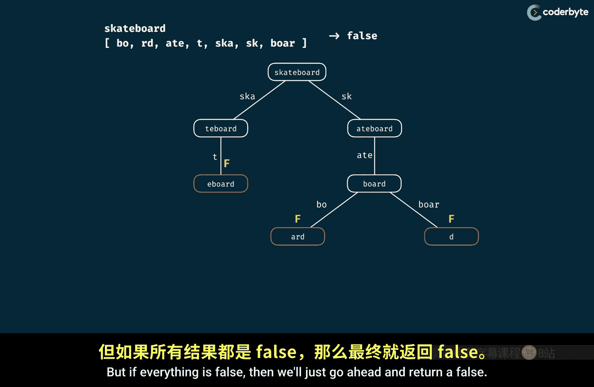

With that， I think we're ready to code this one out。Allright， let's go ahead and code this one up。

 So here I have some initial examples we can use to test our code for correctness。

 looking at the last example over here， it's a fairly long one。

 and notice that the target ends in an F， whereas no words of the word bank have an f in it。

 so we know that that should result in a false。So let's go ahead and lay down the base case for this。

 so like we said， a reasonable base case is to check if your target is empty if you have the empty string。

 then you can already construct the empty string by taking no words from the word bank so you can just return true over here。

And now I need to make my recursive call in a way where my target string gets progressively smaller and smaller toward this empty string。

And so I know that based on the tree I drew， I need to make a choice based on the words in the word bank。

 so I'm going to iterate through all of the words， so I'll say four let word of word bank。

 so I'm iting through every element of the word bank。And now that I have the word element。

 I have to think about to when it's okay to make the recursive call using that word。

 and we spoke about this， we pointed out that we need to make sure that the word is a prefix of the target。

So I can do that， I can just check if the target dot index of Word equals0。

So index of will just give me the index where I can find some substr inside of a larger string。

 if the index I get back is0， that means that the word starts to index 0 of the target。

 So if you're unfamiliar with this method in JavaScript really quick， let's say I did potato。

Dot index of pot。That will tell me the index where I can find it， which happens to be at index 0。

 But if I looked for potato， I would get the index of the T， the first T rather in potato。

 So this is a really nice way I can use to check if some substr is a prefix of another string， right。

 the index should be0 within it。So the way to interpret this if statement is if I have a prefix。

 then I can sort of use it to shrink the target。So I'll create another variable here。

 I'll call it like the suffix， so that's like the string after I remove the prefix。

What I can do is slice my target strings， I can do target that slice。

 and what I want to do is start picking up characters after the length of the words。

 I can say word dot length over here。So it's kind of reason out what this logic is doing。

So we'll trace through this。 let's say that， I don't know， my word， so I'll open up for the noreple。

 let's say my word was the string pot and we'll also say that my current target is potato。

So I know when I do target dot index of word， that is going to get back0。

 so this if statement would be true， and then what I do is target dot slice of word dot length。

So word dot length is just the length of the prefix I took right so it would be three over here。

 but if I target that slice starting at index 3， that would give me everything after the prefix right so I basically have removed pot and got aO。

Cool， so when you use slice， if you pass in a single argument。

 that's going to be the starting position of where you start grabbing characters and you'll go all the way through the end。

Cool， and that's the logic I I definitely want here。So back to the code。Now that I have this suffix。

 I want to make my recursive call on that suffix， so I'm basically asking， hey。

 is it possible can I construct the suffix now， and I'll pass along the same choice of word Bank。

Nice。So here's where I should think recursively。 So I'm focused in on what type of data do I get back from can construct。

 I know I get back a booleing right， true or false。 It tells me whether or not the suffs can be made。

And I want to check you know if。This call returns true， maybe I'll be explicit here。So， if。

The recursive call is true。 Then I know that the original target can also be made。

 So what I'll do is return true early here。Cool， I know that if the suffix could be made and the word that I use to generate the suffix is also in the word bank。

 then the entire target must also be able to be made。Nice， so here I have my nice early return true。

And like you expect， where should I return false， it should be after the for loop。

 right only after I've tried every possible choice of the word and none of them worked out。

 then can I say no， the target cannot be created？So I want to do a late return false over here。

So this code is looking pretty sharp， I think let's go ahead and test these examples。

So I should get true， false， true， and then false for the last one。Give us a go。So I get true。

 false true。 and it looks like the last example over here is taking quite some time to finish。

 So I think our code has correctness， but it's not efficient enough to know reasonably run this last example。

 So I'm going to kill this program。 If you take a look at the example I pass in for this last one。

 It does sort of describe the worst case here。 For one， we know that the answer is going to be false。

 So you will have to do a full exploration of the tree。

 meaning you can't do any early return trues right。

And because of like the length of the string and also the length of the word bank。

 I have a very big tree right， noticeice that there's going to be a lot of prefixes that work here。

 right every element of this array is actually a prefix that could be found over here and that happens again and again。

 So tell you what let's go ahead to the drawing board and we'll try to visualize what the exact complexity of this function is。

😊。

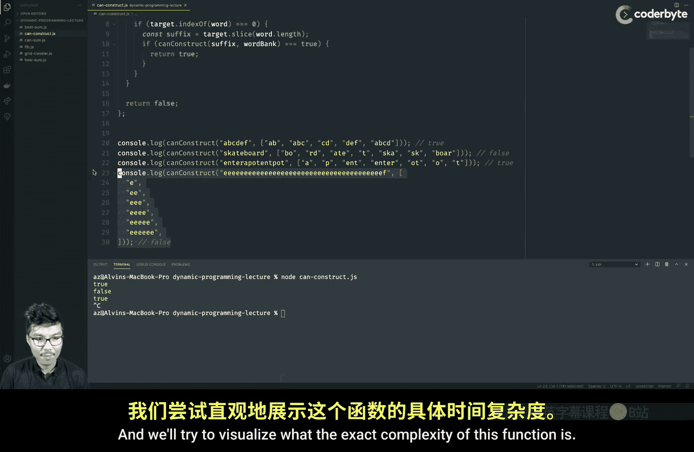

All right， so we implemented looks like the brute force for this solution。

 Let's talk about how we might want to optimize it。

 I think any conversation of optimization should begin with actually understanding what the current complexity is。

So let's say I gave us this kind of large example to sort of visualize with。

 So my target string is enter a potent pot。 And I gave you a pretty diverse array of words in the word bank。

 So I'll just go ahead and kind of give us the full tree in what it would look like。

 It would be this pretty long tree。 So I follow the same logic that we did in our earlier examples。

 noticeice a few things。 There are some occasions where I transition using a single character prefix。

 which is totally fine。 and that kind of tends to feel like the worstcase scenario。

 right If you take single characters out of your target string over time。

 then you're going to have a very， very tall a tree height。 or you're going to have to take many。

 many steps。😊，So that kind of reminds us of a worst case scenario like we saw when we ran the code。

 but that being said， we want to generalize this understanding。

 right for basically some generic size of our input。

So let's say we kind of just looked at this tree in terms of its overall shape。

 and then we'll kind of generalize it。So to me， this tree has this sort of basic structure。

And let me start by defining the terms I'll use to describe the complexity， right。

 So I'll say that M is the target string length and n is the number of words in the word bang， right。

 So I'm really trying to use a different variable for each of my inputs because I have the vibe that both of them contribute to my complexity。

 possibly in different ways。So you've seen， you know。

 us analyze trees before in terms of like their structure， right we're visualizing as the call tree。

 I know that the time complexity would be the number of nodes in the call tree， right？

And so let's start with some familiar territory。 I kind of already know that I need to realize the height of this tree。

The height of this tree is going to be M。RightRemember that M is our target string。

 And so imagine in the worst case that we took or we had to take a bunch of single character choice of words to construct our target string。

 That means that the number of things I would have to take all the way from the root to a base case or the root to the leaf would be exactly M。

 right if I had to take a bunch of single characters。

 So we can be confident that the height of this tree would be M。So if I talked about the height。

 now I need to realize the branching factor that is from one level of the tree to the next。

 How does a number of nodes change in the worst case。 Well。

 I know that the branching factor is dictated by how many words I have in the word bank。

 And so that would be some relation on n。 So I know at the root level I have about one node but then in the worst case to get to the next level。

 I would multiply by n imagine that basically almost every element of the word bank was a matching prefix right So you'd multiply by n and let's say that carried over further。

 let's say almost every word of the word bank with still a prefix of those resulting nodes。

 I would keep multiplying by n。 and I would do this overall M times right So we already know that this is going to be exponential。

 I need to multiply n by itself M times over And so this would give me an n to the M time complexity in general。

 if you visualize your recursion using a nice call tree like this。 then the overall time。😊。

Pplexity is going to be the branching factor to the height power。

 So we have a branching factor of n and a height of M。That being said。

 this will just really consider the number of calls that we make。

 I want to be super sure and make sure we didn't do any other kind of performance or costly operations inside of our code So here's our code same code as we did before。

If you look at this code， some things I need to consider are probably line 6 right if I look at line 6。

 that was where I did a target dot slice， so that's like copying over a part of the target string and to do that operation I would actually have to iterate through the target string。

RightSo that would actually contribute to my complexity here。 So in the worst case。

 what would I be slicing， Well， if I'm slicing a target string。

 that would have like a maximum length of M right， And so in every call to can construct。

 I'm going have to do an additional M operation。 If I have N to the M calls。

 then I can just multiply an additional M over here So I added some additional term into our complexity just multiplying by M。

Cool， and so overall， if you look at that time complexity， it was already exponential。

 So that multiplication by M doesn't really make it that much slow。

 It's really the end to the M that makes it unbeably slow in the first place。

So that was the time complexity。 Now let's look at the space complexity。

 So if we just refer to the space complexity due to the call stack。

 it looks like it's going to be the height of this tree right， like we always say。

The height of the tree would mean the maximum number of stack frames we would need on the call stack before we bought them out at the base case。

 right， Because when we were from a call， we would actually remove something from the call stack。

 right， The height of this tree is definitely just M。

 So we'll say the space from the call stack is just O of M。 But again， we should also， you know。

 look at our code and see if we created any other like growing structures。

So if I look at the code right now。I see that on line 6 kind of talking about that slice statement again。

 the slice returns you a new string right， and that new string is going to tend to B of length M。

 So on every call to can construct， I'm creating a new string and I actually need to maintain it through the recursion。

 right because I actually slice before I return out on line 8。So because of that。

 I know that each of my M stack frames will have to store a string of length M。

 So that just means M times M in my space complexity， which is really just M squared。Cool。

 which isn't too bad of really a space complexity overall。All right。

 so it looks like our final complexity for our brute force solution is exponential in time and it looks like quadratic in space。

 so obviously let's work on improving the time complexity over here。

And so hopefully you're seeing where this is heading。

 Let's say we jumped back into my enterpotent pot example。 So this was a huge tree。 Take a moment。

 look at this tree and where can we actually optimize some work away。😊。

So what we're trying to do is notice any overlapping sub problemsm。 And in the context of our tree。

 that means I'm looking for any duplicate subtes。 And I see duplicate subtes right here。 right。

 They follow the same structure all the way down even to their base cases。 So if look at these subre。

 they're really trying to solve these same problem， right， That is they're both trying to figure out。

 can we construct the string and pot。 right， And if I solve that once on the left hand side。

 the answer is going to be the same on the right hand side。

 So I can just store that information in a memo， right， So the trick is here to of course。

 memmalize it using our classic strategy。 So let's hop to it。😊。

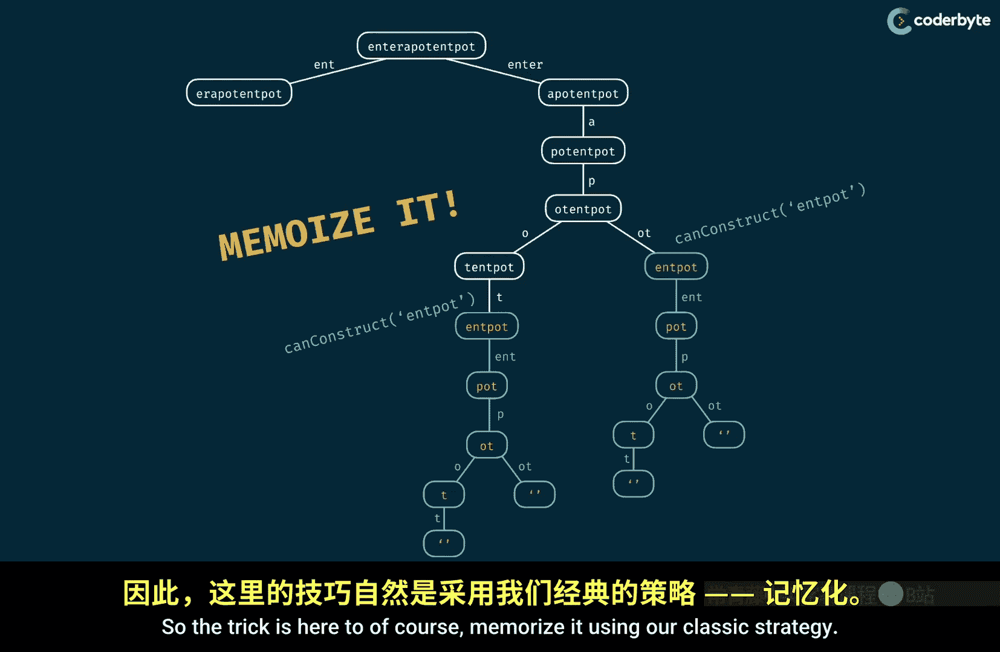

Alright， here we are back in my code editor。 Let's go ahead and just memorize this one。

 So I'll create my memo object。And here I'll prefer to use the target as the key to my memo。

 I know from one call to the next the word bank doesn't change right so I don't need to actually make it a part of the key for my memo object so I'll just check hey。

 if my target is in the memo then what I'll do is return the stored value of that target。Cool。

 while I'm here， let me also squish us down to a one liner。 So I have the memo checking logic。

 Now I need to make sure I pass down that memo to all of my recursive calls。

And then I need to actually store data in the memo and the rule is wherever you have your recursive returns。

 now you should also store that return value in your memo before you actually complete the return right so for both of these lines。

 I'll make sure I store them in the memo so I'll say memo at target equals that and then I still want to return that same value so I'll return true and return false over here。

Again， notice that I'm using my exact argument target。

 right I don't need to write any memorization logic about the suffix right imagine if we made the callta can construct suffix becomes that frames target So the memorization would still work properly right So that looks pretty good and it wasn't that much code right memmoorization is always this slightly extra layer we add on top of our brute force solution。

 So let's try this now can construct。Nice， and there we have that last example finishing fairly quickly。

 or we do get the correct answer of false over here。Allright， so here's what we'll do。

 we're going to head back to the drawing board and of course。

 we'll come up with the final complexity analysis for this function。

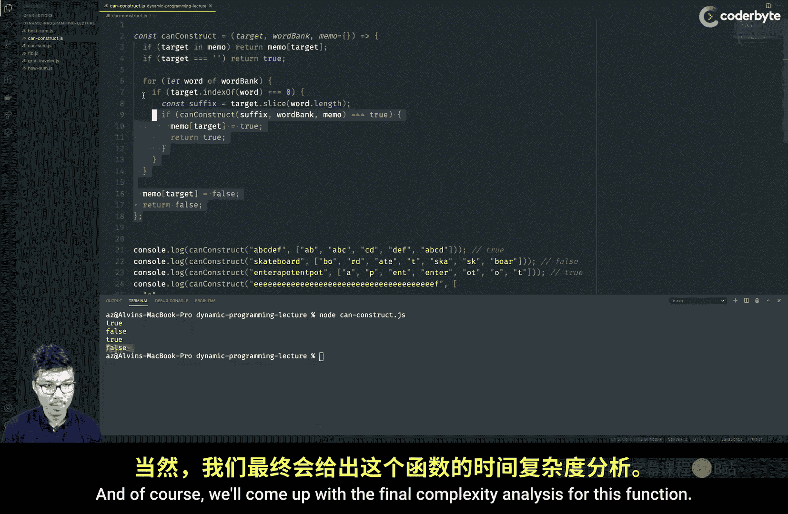

Some classic memorization， right。 Let's take a lay of the land over here。

 So we wrapped up this can construct problem。 Let's describe its final optimized complexity。

 So again， like before we'll say M is the target length。 and n is a number of words in the word bank。

 our original brute force had an exponential time complexity， And that was N to the M times M。

 And when we memmoize our solution， we actually improved it from exponential。

 So now the time complexity of our solution is n times M squared。

 And the reasoning is now we don't have to fully explore any duplicate subte every time we run into it。

 instead， we just store the result in the memo， and we can just kind of short circuit and fetch the stored result in the memo。

 notice that I have an m squared in the memowise time complexity。

 that second M really comes from the fact that we still have to do the slice。

 So we still have to pay for that cost。 So although we added an additional object in our memo Y solution。

 our space complexity would remain in the polynomial class。 So overall。

 we definitely prefer this second solution because we removed some exponential。😊。

Com so now it is reasonable to actually run this in an amount of time。

 And I think that wraps up this can construct problem。Now。

 let's work on the counting version of this problem。 In particular。

 I want to work on count construct。 So we have the same setup here。

 I want to take in still a target string and also an array of words in a word bank。

 But this time I want to return a number。 I want to return the total number of ways that the target can be made using words of the word bank。

 And like before， we can reuse elements of the word bank as many times as we want。

 So notice that this question ask us to do something slightly different。

 We don't want just sure or false if it's possible。

 We want the exact number of ways that we could construct the target string。

 So let's take a look at some examples and also， you know。

 take a high level view of the strategy here。So let's say I gave you this string of ABC， D。

 E F and this array of words。 this particular example we saw before， and it is possible。

 And there's actually one exact way we can generate ABC， D， E F。

 So we can construct the tree in the same way we did before。 And we end up with this。However。

 this time around， we want to choose a different value to return for our base cases。

 as well as changing the logic for reconstructing our sub solutionsutions， right？

And so if I look at the base cases here， I wanted to kind of just adapt the return value for this new type of data that I need to return。

 which is number。So I think the move is for these scenarios where we can't break down our current target any further。

 that should return0， right EF can't be broken down because it doesn't have any more matching prefixes from the array。

 So that means there are zero ways to break down EF。 And so we should return0 in those scenarios。

 and then when we have the empty string。 we know it was successful。

 so we could always you know create the empty string。And so， that should return one。

And we've seen this logic before in problems like Fitbonacci， as well as our grid traveller problem。

 We just want to bubble up these values to their parents and make sure every parent will add up all the numbers that come back from their children。

 So it just bubbles up like this。 And top level， we do 0 plus1 plus 0。

 which means that we can generate AB，C， D， E， F in exactly one way。

And if you look at the way that actually is symbolized inside the tree。

 it's exactly the path from this root node all the way down to that lone base case that returned an empty string。

 right， ABC plus D， E F。Let's take a look at another example。

 So here I have the target string purple， and I have some other characters and words inside of the array。

 So take a moment to look at the input here and predict what number this should return。

AndSo the answer here is two， right， there are two ways to create purple。So if we construct a tree。

 we know we start with the initial a node of purple。

 and then we have about three prefixes that match here。 and those yield some children。

 and we can follow the same pattern recursively down the tree。

 So the full tree really looks like this。 Notice that I have two base cases that actually end up as the empty string。

 So I know those are going to turn one to their parent。 And on the right hand side。

 I have a alone E that can't be broken down any further。 that returns 0。 And like always， right。

 I just bubble up these values。 until at the parent， I actually do1 plus 1 plus 0。

 which gives me two right， there are two distinct ways to create purple using this choice of word bank。

😊，Alright， I think I'm feeling pretty good about jumping to the code for this one。

 It's really just a small variation of the last problem we did。 So let's hop right in。😊。

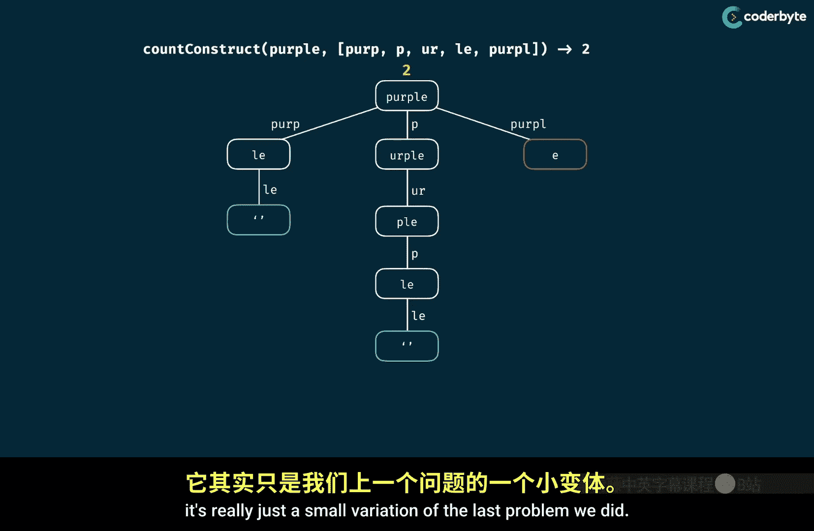

All right， programmers back in the code editor。 Let's go ahead and bang this one out。

 So they already have some examples that show us what numbers we should return for this count construct。

 right， So have some examples here。 notice I even have that big example with our large input。

 So we know that that will probably need to be optimized。

 Let's lay the foundation with the brute force。 So we'll start with the same base case， as always。

 right。 So if the target is the empty string， then we have trivially solved the problem。

 Mean that there is definitely one way to generate the empty string， right。

 Just take no elements from your word bank。

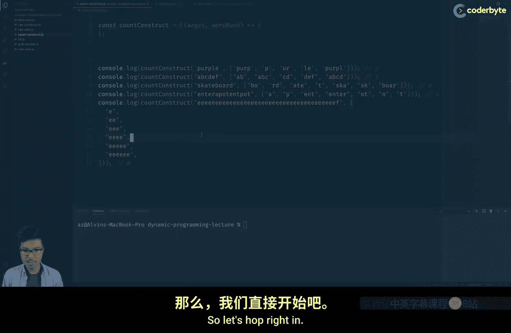

Along with that， I need to make my recursive call， so the usual structure， right。

 I want to iterate through every choice of word， so for let word of Wordbank。

And then for every word of that word bank， I need to check if it's a prefix。

 so we've done this before。If the target dot index of word bank。Or rather index of word。

 If that is equal to 0， then it must be a prefix。 And if it's a prefix。

 and I can go ahead and take like the rest of the word。

 or that is the suffix and call recursively on it。 So I'll do this in line now， say count construct。

 And I'm going to pass in the rest of the word， which would be Taet dot slice。

Then I'll slice starting at word dot length。So this means that the slice contains everything after the word or everything after the prefix。

And so I'll also be sure to pass into a second argument， the same word Bank。Nice。

And now I need to think about what count construct returns。 So it's returning a number now， right。

 So in particular， this will be the， we'll say numb ways。Then I'll say numb ways for the rest。

 maybe a little wordy of a variable name， but I think it does describe exactly what this returns here right。

 so this is a number of ways that we can generate the suffix or like the rest of the target。

What I want to do is keep a running total so outside this for loop。

 I need a way to add everything that the for loop iterates through right so I'll create a total count over here so I'll say let I'll say total count and I'll start it as0 and now inside of my for loop whenever I get the number of ways to create the rest of the string I'll go ahead and just add that into my total count So it's as simple as total count plus equals the number of ways to generate the rest of the string right after Ive removed the word。

And after I take the total through the entire for loop， then I can just return the total counts。

Something really great about this， this programming pattern is。

 let's say that none of the choice of words were a valid prefix。

 So that means I finished this for loop and this if statement is never true。

 If this if statement is never true， that I never add anything into the total count。

 So if I return total count afterwards， I return a still0。

 which makes sense because apparently there are zero ways to make the target， right。

 I have no initial step to take in the word bank。So let's go ahead and test this one out。

So it looks like we should get2，1，0，4， and then also a0 at the end。Let's give that a go。So 210。

4 and it looks like the last example is just a little slow for us。

 So you already know where this one is heading and we kill the program。

 and let's just go ahead and just memoize this one off the bat right hopefully。

 I think through all these examples， you're feeling really good about memorization and it's a pattern that we basically have drilled into our minds already。

 So if the target is in the memo and just return the stored value。😊，Memo at Targ。

And then I'll need to adjust my return value right so where I return over here is I'll store that total count as the value corresponds to the target。

 and let's not forget to also pass in the memo to all recursive calls right so memo goes right here。

Nice， so let's get that around again。I expect a0 for that last answer， right？

So it looks like I have an error over here and of course I forgot to actually replace my return value so I can still return the total count and in addition to that I'm actually adding it into my memo。

So let's try that now。Again， these answers look correct right I get0 for the last one。

 notice that the last one is not possible because it ends in an f and all my words only contain E's。

Nice， and if you look at this code， it's pretty similar to our previous problem of can construct if I kind of split these。

Can construct basically has the same shape。 Really。

 the only difference is this number variable that I add into。 And， of course， the return values。

 So we do expect the complexities to be the same for these two functions。

 let's wrap this one up on the drawing board。 Let's look at the complexity of this， As always。

 for this count construct problem。 our M is going to be the length of the target string。

 and our n is going to be the length of the array， right。

 So that means a number of elements in that array。 Our brute force is the same as it was in the can construct problem。

 right， So it's still exponential。 And using memorization。

 we just brought that down from an exponential to a polynomial time complexity。

 And the space complexity remain the same。 really， there is no additional cost that we pay in our implementation for this counting version of the problem。

 right The only difference is now we're maintaining a number that we just add to。 You know。

 on every iteration of that for loop。 But that doesn't really affect the run time or the space complexity at all。

 So I think this wraps up this count construct problem。😊。

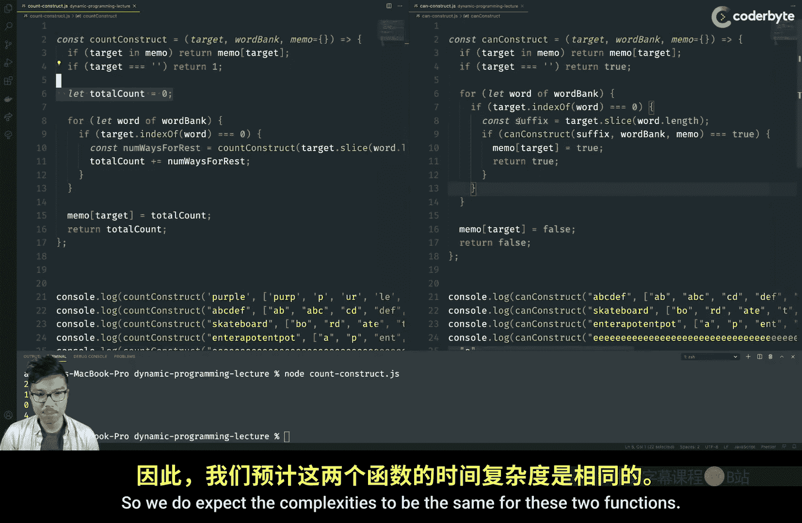

Now I want to do one more variation of this string problem。

So what I want to do is write a function called all construct that has the same setup， right。

 So I'm going to take in a target string， as well as an array of words in a word bank。 But this time。

 what I want to do is return all of the ways that the target can be constructed by concatenating elements inside of that word bank。

 And that means I should return a two dimensional array。

 A single element of that2D array is going to represent one of the combinations that can construct the target right。

 And I want to return all of the ways within a 2D array。 And as always。

 we can reuse elements of the word bank as many times as we need。😊。

So let's make sure we understand this question by looking at some examples in their output。

So here's an example using purple。 and in someone you've seen before in the last problem in the last problem。

 I had us return to because there were two ways to create purple， but now I don't want the number。

 I want the exact ways that actually create purple。

 That means you need to return a two dimensional array。

 The outer array or the outer set of brackets represents the collection of all combinations。

 whereasas a set of inner brackets or a subarray represents one of the combinations that creates purple。

😊，Let's take a look at another example let's say I gave you ABC DEF and I gave you this long array of word bank notice that I actually added some elements inside of this word bank array。

 it's a little more complex than our previous examples because of this there are actually many ways you can create ABC DEF and this contains all of them right so there are four ways to create our target string and again notice that each subarray represents one of those combinations of words in the word bank that create the target。

😊，Cool， so now that we kind of understand like the shape of this problem in terms of the data we should return。

 let's take a look at some base scenarios。So let's say I gave you this example， right。

 So I have the target of hello， and my words in the word bank are just cat dog and mouse。 Obviously。

 you know that it is not possible to generate hello。 So there are really zero ways to create this。

 How should we actually return an answer here。 Well。

 I think it would be reasonable to return in empty array。

 Remember that we're saying the outer array in this context represents the collection of all of the combinations that can create hello。

 Since there are zero ways to create hello。 that means that our collection is empty， right。

 This has a length of 0， meaning there are zero ways to create hello。😊，Now。

 let's say we had another base scenario。Let's say we had to generate the empty string using the same array of Word Bank。

In that scenario， I think it's reasonable to return an array containing an empty array。 And again。

 the reason is， if it is possible to create the target string， then we need to return a 2D array。

 where the outer array represents the collection。 And if there's one subar inside of that outer array。

 That means there's one way to create the empty string。 And what is that one way。 Well。

 let's take no elements from the word bank。 So I think this is going to be consistent logic。

 This is going to be a really important way to think about this problem。

 That is when we're given a target that cannot be constructed using the word bank。

 we should return an empty array a one dimensional empty array because there are zero ways to create it on the flip side。

 if I're given the empty string， we know that it's always possible And so we should return like a two dimensional empty array。

 Co， So with that， let's look at some tree examples now。

 So let's say have this large example from before。 We know that the overall tree like we've always no created。

 would look something like this。 Obviously， now we're just reraming this problem in the return values that we do for。

😊，This cases。So you notice that there are four base cases here that kind of reach the empty string and I know that those represent the four ways to create ABC。

 D E F。 And now I have to adjust the return values here。

 So I'm already saying that if I have the empty string， then that should return an empty2 D。

 So it looks something like this， right？And how will I actually reconstruct the entire solution from these very small sub solutionsutions。

 So let's just stay focused on the left sub tree right now。

 I know that these arrays are going to return back to their parents。And when I do that。

 I also need to make sure that I include the edge that I actually use to transition to the child。

 In other words， I'm going to be sure to push the label for the edge into each of those subs。

 So the key insight is this， right， I'm just pushing those edges into their subs。And from here。

 I continue the pattern up a little further， right。

 So I know that these arrays return to their parent over here， and I still。

 you know push the edges that I took to get to those children。 So on the left。

 I'm going to put C D in the front and on the right。

 I'm going to put C in the front resulting in this。And then at this point。

 notice that this node rooted at C D E F that is actually going to receive both of these collections And what should this node do。

 Well， it really needs to just combine a both of these arrays。 recall that， you know。

 we technically receive a two dimensional arrays， which means that a suburray represents one of the ways to create the actual target。

 So if I just cancateate these two dimensional arrays， that yields this construct。

 And if I do a quick spot check， I'll see if this is compatible with what the question is asking。

 right， This is a two dimensional array。 And I know there are actually two ways that we can create C DF。

 If I look at what this is saying the first ways to do C D plus E F。

 and the other ways to do C plus D EF。 And so this cell problem is correct in itself。

 So I'm going to use the same exact logic to trace through the right hand side。

 I know that these cases return to their parent。😊，And then the parent is responsible for adding the edge to each of those subres like this。

 Now I'm just going to reorganize everything at the top just to give us some more room。

 and maybe I'll even spread out these brackets to make it look more symmetric。But I'm not done here。

 I still need to consume each of the edges at the very top of the tree。

 So if I look at my left hand set of arrays， I know that those need to receive A B。 In other words。

 they need to have A B placed at the front of each of those。

 So I'll just do that right in the same way， all of the arrays in the middle。

 which is really just a one sub arrayray need to add ABC to the front of them like this。 And finally。

 same thing on the right hand side with ABC D。Cool， and if I look at what I have。

 these represent the four ways that we can actually create our original target string。

 but at this point， the root node just needs to concatenate each of these two dimensional arrays together。

 So it really just combines them into a single2 D array like this。😊，And if I do a quick sanity check。

 I know that each of these subars represents one of the paths that I can take to a base case down my tree。

 which is exactly what we intended at the start。So this type of recursion is definitely more complex in the previous examples。

 but hopefully you can recognize what's similar to our last examples right。

 Let's do one more together though。Let's go back to this purple example。

 The full tree would look like this。 And we'll trace through this。 So on the left hand side。

 we're going to start with a 2D empty array， right because that's the base case for the empty string。

 meaning that， hey， it is possible to create the empty string in one way。

 And that is to just take nothing。 So I do the same logic as our last example。

 meaning I return to my parent。 But I'm being sure to also include the value of the edge right。

 so the key insight here is I'm being sure to add the edge label。 and not the actual node label here。

 the node and the edge happened to have the same thing Le。

 but I'm really looking forward to adding the edge right， So I add L over here。 And likewise。

 this returns to its parent even further。 And so I'll add that last edge of purplep。😊，Cool。

 now I need to do everything for this middle path。 And so what I'll do is return the empty 2D at the very bottom。

 and this really bubbles up all the way to the top。

 and we just accumulate every edge label as we go right So it sort of looks like this。😊。

And what's really interesting about this right hand path。

 this is actually a base case that doesn't work out， meaning we kind of hit a dead end at E。

 And what we said in our initial examples was whenever we have a target string that cannot be created at all using words of the word bank。

 then we're going to return a one dimensionsal empty array。

 and that actually works out in our favor because if we return this empty array to our parent。

 our parent is going to try to add the edge into every elements of this empty array。

 but if there are no elements in this array， then it's going to add nothing。 In other words。

 this one dimensionmenal empty array， really just bubbles to the very top。 And like always。

 if I just cancatenate all three of these arrays together， I actually end up with my final answer。

 noticeice that when I cancatenate an empty array to the rest of these。

 I will actually contribute nothing to my final answer。

 which makes sense because there are no paths that work out on that right hand side。 So our final。😊。

TheAner is just this。 And like we know， both of those subs represent the two different ways that we can create purple。

 All right， I'm feeling pretty good about this process Now。 Let's go ahead and code it up。

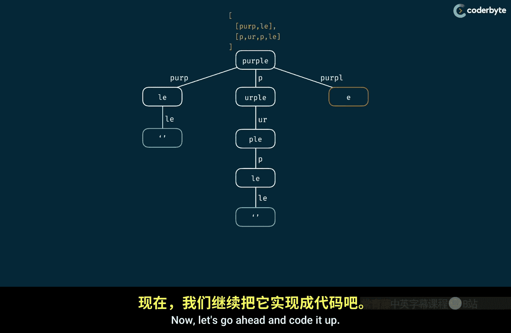

All right， programmers back in the code editor， another problem， another solution。

 So let's start by laying out the base case over here。 Now， like we said。

 we'll say if the target is the empty string， then we want to return a two dimensionmensional empty array right the single sub array here represents the one way you can create the empty string by taking nothing right by taking no words of the word bank。

 nice。 And then besides that， we need to make our recursive logic。

 So that's going to be very similar to what we've always done for this style of problem。

 So I'm going to iterate through every word of the word bank。 So I'll say let word of word bank。

Word bank。And I need to still check if there's a prefix， right， if this word is a prefix。

 So if target dot index of word， if that index is0。

 then I know that it must be a prefix so I can continue some code inside。Nice。

 and so what I'll do is I'll go ahead and create an extra variable just to store the target after I remove the word。

 which would give me like the suffix。 So I'll say con suffix equals。

 and I'll say target dot slice of word dot link。 So we've seen this pattern before。

 but just to refresh。 This just gives us everything after the word。 So basically。

 once you remove the word， what is the remainder of the string all the way to the end。

 now that I have this suffix， I actually want to call my function recursively on that remainder。

 right， just like this。 And I'll pass along the same word bank。😊，Cool。

 and now here's where things gets a little intense， right， So we've been doing a lot of problems。

 You know， using this a recursive structure。 and then we me wise it in the long run。

 I think the most important thing to do is when you make your recursive call。

 you really just assume that your function works， right。

 So I think about what type I should get back from all construct。

 So I know that all constructs gonna to give me back an array， right。

 It's going to give me back an array containing all of the ways to make the suffix。

 if there are no ways to make the suffix。 then it's going to give me like an empty array， right。😊。

And so I'm going to assume that here， so I'll create a variable and I'll call it。

 let's say the suffix ways。 and the reason I'm naming it like this is I really want us to in our head think about the return value from this as an array of all of the ways to build the suffix。

Cool， so that's going to be a two dimensional array， right， if there are many ways to do it。Nice。

 so if this gives me all the ways to make the suffix。

 how can I get all of the ways to make the original target like in this current stack frame。Well。

 what I need to do is really just take each of those suffix ways and add my word to the front of it。

 right， I used this word to even create the suffix in the first place。

 So what I can do is I'm going to say my target ways。

So now I want to relate how the suffix ways can be used to build my original target right All I need to do is really iterate over every subur over here and add my word to the front of it。

 that's exactly the process we took in the tree diagram right。

 So I can use some nice javascript methods here。 If I just want to basically manipulate every element of the array。

 I can do a map here。 So I'll say suffix wayss do map。

 And I know that a single element there is going to be one way， I'll say singular。😊。

And then what I want to do is just take that same way， copy it over。

Meaning I just spread out elements。 but then I'm also going to put the word that I took in the front。

 We've seen this a syntax before， although maybe this like map method is maybe new free。

 Maybe you're not super familiar with jascript。 I think that's fair game。

 So let's hop into the node Ra or just to demo this。 Let's say I had some array。

I'll just make this array 1，234。So there's my array。

 what I can do in general is use array do map and map is a function and you should pass in a callback so that means another function。

And what I'll do is this callback is going to take in every element。

 and it's going to be an arrow function。 what's going to return is really just how I want to modify the elements。

 let's say I wanted to multiply every element by 2 the return value of this callback function is going to become a new element of the new array。

So notice I get back 246，8， my original array was 12，3，4， and I get back a new array using map。

And so essentially what I'm doing in this example on line 8 in my actual code。

 I'm just taking every subur and just inserting my word at the front of every sub。

 So an example that speaks closer to our exact code would might look something like this like suffix ways。

And it's going to be a 2D array。 So I'll make a sub array。

 maybe just an array of some strings kind of arbitrary right now。 So I'll say X， Y， and then Z。

And then the second subarray will be maybe， I don't know， like a X and then a Y Z， right。

 So that's my original array。And what I want to do is if I say suffixways dot map。

 now let's say for every way。That is every subar。 I just want to copy over that way by spreading out。

 And then I'll just go ahead and put， I don't know， like an a at the front just like this。

 So notice when I get back， I basically have every subar from before。

 except now I have a as the first element of both of those。

Cool that's all I'm doing in this particular chunk of code。Awesome， so we'll leave the nodereple。

Back to our running solution。Now that I have the target ways。 Oh that's good。

 It's basically just like a piece of the answer I need。 However。

 now this is really only going to give me all of the ways to make the target that use this word that I'm currently like on in my iteration。

 However， I know that this for loop gives me multiple branches。

 It's going to use all of the words that are possible to create the target。

 So I need to kind of gather them all together。 So I'll create a variable on the outside。

 I'll call it result and I'll store everything right。

 So across all of these iterations I just want to add the target ways into the result。

 I'm going to do result not push target ways and I need to actually spread this out that way。

 I don't nest things too deeply remember that this is a one dimensional array， right now。

 target ways would be two dimensional。 I don't want to just push target ways into result。

 Otherwise I get like a three dimensional array。 So I'm going to be sure to spread out target ways right。

😊，So with that， let's actually go ahead and give this around。

 I think all I need to do now is after my for loop。

 right after I'm done getting all of the ways then I can just return the results。

And this should just work recursively。So let's just try maybe the first example from now and see how we do。

 So I should get， you know， a two dimensional array where I have two ways to make purple， right。

 Let's give that a go， all construct。Nice， and that's looking up pretty good。

 That is a correct answer。 Let's try these other ones now while we're here。 So we should get a nice。

 large array for that second example。 Nice， here it is。

 And then the third example skateboard should return just an empty array because it's not possible。

 And it looks like that last example is also not possible。 So we do get an empty array。

 And if you kind of notice。😊，To get that last answer like we did in our other examples。

 it does noticeably take some amounts of time。 But before we get to that。

 let's take a look at this code， make sure we really understand it。

 So the biggest logical leap we made here was really you know assuming that we get back valid data from line 9 right And then it's all about how we can know adjust that subreult to get our full answer right So if I get all the ways to make the suffix。

 then for each of those ways I can just add my word in front of them。

 and that would give me all the ways to make my target。😊。

And then I need to continue that process for every choice of word。

 which is why I'm maintaining this like a massive results variable outside of the for loop is pushing all of the ways into this result over time。

 and maybe just to be super clear， you're not familiar with like this push method。

 especially when you use the spread operator with it as well。

 you can really easily step through that。 So in isolation right。

 this is just using push and spread in general。 if I had some let's say array and let's say it was just an array of just some elements 1。

2，3，4。Then I had another array， I'll call it just nus， and let's say in nus， I had elements。

 I don't know， seven and eight。So here's my original array。And here's my nus。

And if I did array dot push nus。You're actually going to force some nesting in this array。

 so array dot push returns of the new length， but it also actually manipulates or mutates the argument you call it on。

 So if I look at the array now， notice that it actually has another array nested inside。

And that's because I literally just pushed the entire nus。

 If you wanted to do something a little different， what you can say is。

A radar push and you spread out numbs。 what's going to do is comma separate of the7 and8。

 basically removing the outer brackets from it。 So if you look at this now。Look at the array。

 Notice that with that second push。 Now I just added a 7 and 8 without those additional brackets。

 So that's all I'm doing over here。 Like I said， I don't want to add another level of nesting to the result array。

 right， It should just always remain at most a two dimensional array。Cool， but overall。

 it looks like we have solved this one。And let's kind of talk about if there is even a way to make this fast。

 this is kind of an interesting problem。So this is looking pretty good。So earlier。

 when we were on the drawing board， we said that， all right。

 because of what they're asking in this problem， it is basically going to require a full exploration。

 if I want you to return every possible way to make the target string you'll just have to kind of do all the work of creating all of those subars。

 So we can't really avoid that stuff over here And if you think about this example on like 33，34。

 this is actually not the worst worst case anymore， right here。

 we know that eventually we're going to return just an empty array。

 because we can never generate the final Z in this example， However， if I remove the Z。

 then the result would be a very， very massive 2D array because there are a bunch of ways to actually make this target string right So weve kind of change the direction of what it means to be like worst on this example。

 let's say we brought this to use the Z。😊，If you really cared about optimizing like this particular scenario。

 you would find some benefit to like memmoizing it。

 although it wouldn't really affect the worst case。

 because a worst case is actually where you return a two dimensional array and not just an empty array。

 So maybe just because it's good practice。 We'll memmoize this But when we go to the drawing board。

 we'll see that this actually doesn't affect the true a big O worst case。

 But if you just want to optimize it slightly。 Let's say we baked in our memo over here。

 then we check， you know， if our target is in the memo。 And if it is。

 then we return the memo at the target。We'll be sure to pass along that memo to our recursive calls。

 and then we just need to make sure that for our return value on line 16。

 we actually store that inside of our memo。Using the target as a key。

 and then we still complete the return by returning result like we once did。Cool。

 so let's run this now。And I would agree that the last example now runs faster。

 but it is not the worst case is a really important thing to understand here。

 right the worst case is when you actually have to create a massive subaret right and so let's head to the drawing board and see our final conclusion about the complexity here。

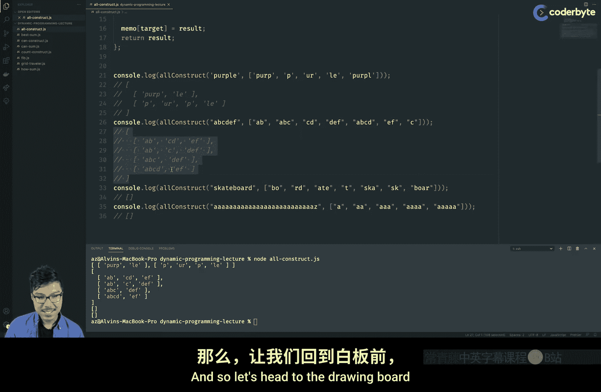

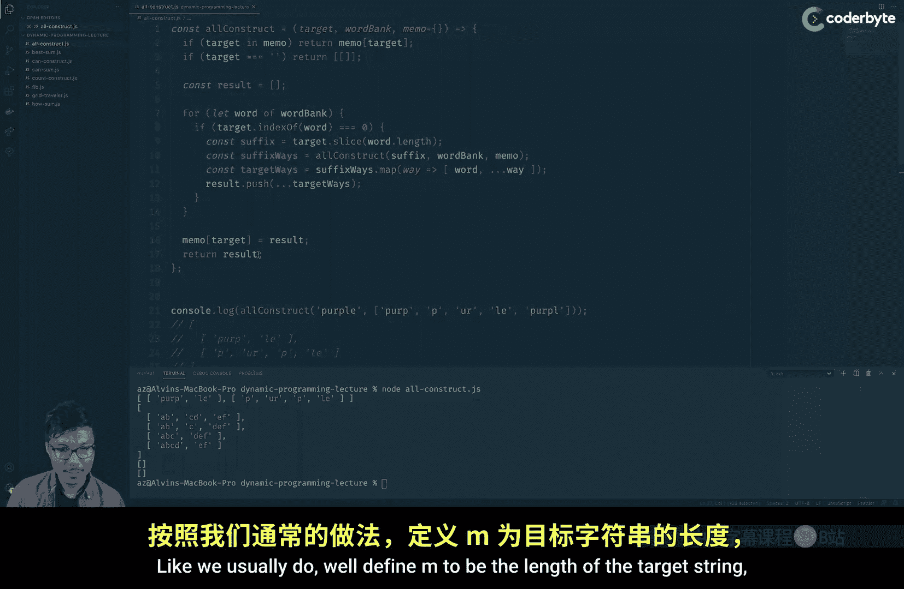

Like we usually do， we'll define M to be the length of the target string。

 and N will be the number of words in the word bank。

 We know that this problem asks us to return an array containing every combination that generates the target string。

And to come up with that answer， we had to visualize it like a tree sort of like this in our previous drawing。

 we saw how each leaf of this tree represents one way we could create the target string。

 In other words， if we can figure out the total number of leaves in a tree like this。

 then we would basically have the number that represents how many different ways or how many subs we have to generate in this problem。

And we already know that based on our process we described that there are dimensions to this tree。

 we know that the height of this tree is going to be M， and we know that from one level to the next。

 we really just multiply the number of nodes by n。 and that means at the base of this tree。

 we would have n to the M number of nodes So we have n to the M leaves。

 which means that we have n to the M different combinations that generate the target string。

And if we have to represent each of these n to the M combinations。

 then we definitely need n to the M subs in our output。

 And so what we're saying here is no matter what clever implementation， we create。

 we really have to return a result that is exponential in size。

 And that's really going to drive the complexity of this one。

 you can't do any better than exponential over here。 And so overall。

 we'll say that the time complexity of this is n to the M or just exponential。

 if you want to split hairs here， you can really multiply by some additional factors of M。 However。

 the exponential nature of this alone， really gives us the overall complexity because once something is exponential。

 there's really no coming back from that。 And in a different vein。

 we can say that this space complexity for this is O of M。

 like we usually say it's really just the height of the recursion tree。😊。

In an example like this where our output is very large。

 we usually don't include the size of the output or the size of the result into our space complexity。

 in which case obviously would also be exponential in space because of the result that is exponential right So here we'll just refer to the additional space we use for the call stack。

 which would be O of M Any solution you come up with for this problem would be just about this fast。

All right， and there we have our all construct problem。So at this point。

 we've gone over many dynamic programming problems。

 and we use that memmoorization strategy to work out a solution for all of them。 However。

 memorization is only one of the ways we can actually implement a dynamic programming solution。

 right now， I want to revisit all of those problems， but this time。

 use a different lens of understanding。 As always， I want us to ease into things。

 So we'll warm up with this fib function。 This is the same problem as last time。 In other words。

 I want us to return the n number of the Fibonacci sequence here。

 I'll say that the0th number of the sequence is 0。 and the first number of the sequences1。😊。

You may notice that this time around， I'm saying that the0th number is 0。

 and the first number is one。 whereas in the first time we did this， we said the first number is one。

 and the second number is1。 However， no matter how you start the sequence。

 they will both actually give you the same series of numbers。 In other words， down below here。

 I have some examples for n， as well as what the output for our fib function should be。

 In other words， if I ask you for these6 Fi boacci number。 The answer there is 8。

 like we always expect。 All right， let's get into the heart of this strategy。 right。

 What does tabulation even mean。 Well， it's all about building a table。

 So what we'll do now is step through a tabulated strategy for calculating fib of 6。

 I know that in the long run， I ought to return the final answer of 8， right。

 So I hope that I get the answer of 8 by the end of this little trace。😊，So with tabulation。

 what we're choosing to do is really think about this dynamic programming problem still in terms of subproble but instead of doing it recursively。

 we do it iteratively by building a table， really just an array。

 and I'm going to begin it with roughly the size of the input In other words。

 if my input here is the number 6 then I basically want an array of length6 noticeice that if I want the indices of this array to kind of line up perfectly with the original input number。

 and I'm going to have to actually add an extra position。 In other words。

 this array spans indices 0 through 6 which kind of means that they actually are seven different elements here the length of this array is 7。

 So something very common that I see when students try to implement a tabulated strategy is they kind of overlook this off by one nature so technically I'm creating an array that has one greater length than my number input。

😊，By any case， if this is my array， what do I want it to represent。 Well， in the long run。

 I want to actually fill out this array in a way where each subpro corresponds to an element of this array。

 So here's I'm going to begin this table。 the move here is to actually initialize every position of this table with 0。

 And the reason for me initializing 0 everywhere in this array is the fact that I know Fibonacci requires me to take a sum and 0 is a really great starting value when I need to calculate a running sum。

 right But along with that， I need to be sure to seed the starting values within this table。

 In other words， if I look at the zero position of this table， it already has a0。

 which makes sense because the zeroth number of the Fibonacci sequence is 0。

 But what I should also do is make index 1 contain a value of1。 And that kind of entails that， hey。

 the first Fibonacci number is indeed one。😊，And now at this point。

 once I've seeded those initial values， now I can actually run the general algorithm to fill out this table。

 So now it's just a matter of iterating through this table。 So I'm going to start。

 you know at the very first position of the table， probably just with a regular for loop。

 And what I need to do is really remember the definition of Fibonacci right So if I have this number currently in the array 0。

 that's the zero Fibonacci number。 what I can do is just add this current number that I have kind of pointed to in yellow。

 to the next two positions。 And the reasoning there is a Fibonacci number is used to contribute to the sum for the next two Fibonacci numbers。

 So I'm going to do is take the0 and add it to the next two positions。 Obviously， since it's0。

 I actually don't change the values of those next two positions。

 So nothing really is calculated on that first iteration。 So in any case。

 I can continue on to the next iteration。 So my current position is always in yellow。

 and the next two positions are pointed to in blue。 At this point， my current position says one。

 So what I should do is take one。😊，And add it to both of my next positions。

 So that means2 and3 or indices 2 and 3 contain both a 1 and a1。

 which so far makes some sense because at least for the two。

 the second number of the femenacati sequence is indeed one。 I can do the same thing， right。

 My current position contains a one。 So I'll add that one into my next two positions。Keep doing this。

 I add two to my next two positions。Add three to my next two positions。And at this point。

 I sort of reached the end of my array， so I know that I probably shouldn't step out of bounds。

 so I really just want to look one position ahead over here。And at this point。

 I just add five into my next position， which actually works out to an eight being stored in index 6 of this array。

 which makes sense because logically the six number of the Fibonacci sequence is8。

 just like we intended。And that's all there is at tabulating Fibonacci。

 The most apparent difference from our previous like recursive strategy was this is not recursive。

 right this really just requires us to iterate through an array。 So it's a fully iterative process。

 And at this point， the actual complexity of this is really straightforward to kind of foresee。

 We know that we're just going to iterate through an array of size N。

 So that must mean that our time complexity is just n。 in the same way。

 the only space we use is really just the space of the array。

 which I know is still going to be size N as well。 So overall we're looking at a linear solution for fib。

 So before we hop into the code for this1， I just want to draw a really important connection。

 So although at face value， this iterative strategy looks very different from the recursive solution。

 a lot of the logic really carries over I'm still using my overlapping subpro to solve this one。

 So for example， I know that every index of this array really corresponds to some number input for Fb of n So it can kind of visual。

😊，Is it like this。RightLike we said， the six Fibonacci number is 8。

 So I'm just going to choose a position of this table。 let's say I looked at fib of6。

 So I know that to calculate fib of6。 what I did was really add the previous two numbers into this position And if you kind of see that the shape of this if I kind of drop the table and even just ignore the rest of the subproblem。

 this is basically just a tree where I can kind of shift things around and it really looks like this。

 So overall， you're looking at really the same relationship for calculating Fibonacci。

 it's just encoded in a table instead of the recursive tree。 But overall。

 if you understand you know the recursive solution。

 you should still find some comfort inside of this iterative solution。😊，But I think at this point。

 let's hop into the code for this one。

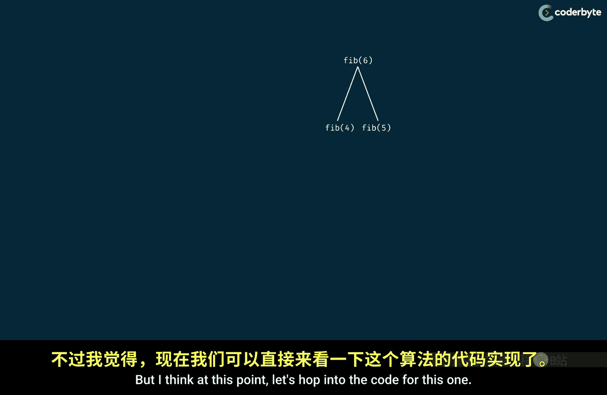

Alright， programmers， let's go ahead and translate that strategy into some code。

 So I'll start by creating a table， which really just means creating an array。

 So I'll call this table。 and I need this array to have certain dimensions that are roughly the size of n。

 So to do that in jascript， I can say array and call the static method and pass in my desired size。

 So here I want to say n plus1。 for the reason we did in the sketch。

 right I need to make sure that the last index of this array is exactly n。

 I have to do the plus one here because of course， indices started at0。Cool。

 so that should give me an array of that n plus one size。 And then at this point。

 what I want to do is assign particular values into this table。

 So let's just say I have console that log what this table looks like。

Now I'll just run this first example of fib of 6。 So I'll give this a go。

So notice that the array that prints out is this。 It says like 7 empty items。

 which means that the elements are undefined right now。 According to our strategy。

 what we should do is assign these all to 0。 So what I can do is after I initialize the array over here。

 I can fill it up with all zeros using the dot fill method。 right， It's an array instance method。

 So with that change， now I should have a 70s inside of this array。Cool。

 so that's looking pretty good。At this point， I also need to fill up a particular value inside of the table。

I really need to make sure that the index1 contains a value of one right so I can say table at index 1 equals1。

So we're seeding index one with a value of one to symbolize that the first Fibonacci number is one。

 Remember that we kind of have like two base scenarios in Fiacci。

 Let's just console that log what this table looks like now to make sure it's in the correct state before we actually iterate through it。

Cool， so this is a good starting point for our table。 So at this point。

 what I want to do is iterate through the table。 So use a regular for loop for that。

 I'm going to need access to the indice。 So I'll say it I equals 0。

And I'll go up to and including and basically give me iterations through the entire table。

 and I'll do I+ plus， I'm going to hit every position。Cool。

 and according to what we did in our strategy， what I should do is look at the next two positions after I right So I'll say is I'm going to look ahead in the table and I'll look at positions I plus 1 and also I plus2 right Of course。

 right now I'm currently situated at position I。And what I did was I added into those two neighboring positions。

 I added my current value in the table。 So what I'll say is。In my next position， I plus1。

 I'm going to increment it by exactly。What table I says， right。

 So I'm incrementing my next position by the value in my current position。

 and the same will hold true for the next position two spaces away。

 So they both get plus equals table I。Nice， so this is looking pretty good After we're done doing this process for the entire table right we're just going left to right。

 filling in our next two neighboring positions。 what we'll do is just return our answer which should be table at position N right to finish this off。

 I just want to return the table at index N because the elements of this array correspond to the Fibonacci number right and the index is sort of the input to my function。

😊，So let's try these examples。We'll give them all a go。Cool， so I get 8，13。

21 in this very large number and this actually looks correct。

 so this is a fair implementation of a Fibonacci。 noticeice that because we're already using an iterative strategy。

 we already satisfy a decent complexity for even this this last example over here。😊。

We already mentioned the time and space complexity of this strategy， right。

 It gives us a linear time and space。 However， you may already have in your head that we could actually optimize a little more here and just use a constant amount of space。

 However， if you want to kind of subscribe to just a generic tabulation strategy that I know is gonna to be useful in most problems we'll kind of stick to this overarching pattern right of initializing our table up front。

 that is roughly the size of the input and then iterating through that table。 Of course。

 you can probably finesse this fib function to only track two variables represent your last benaci number。

 as well as your last last off the beacci number， but I'll leave that to you because it's not really a classic tabulation。

 which is a topic。 I want to drill into our heads right now。

 Let's head back to the drawing board and do another problem。😊。

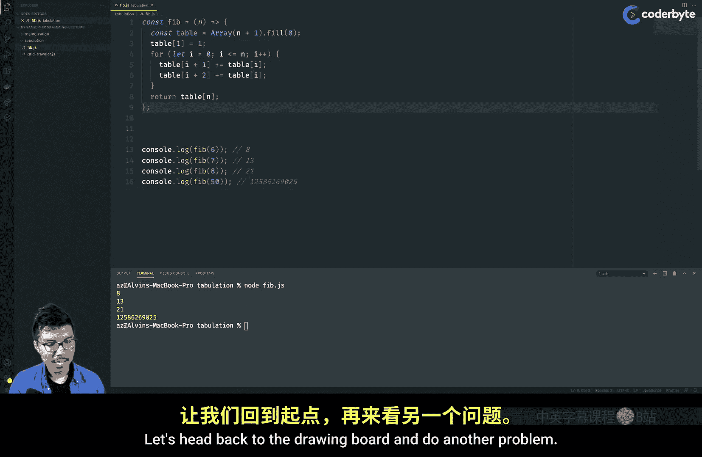

Allright， now let's revisit that grid traveler problem using tabulation。 So like before。

 we're going to have a 2D grid， and we start in the top left corner。

 and our goal is to go to the bottom right corner。 We only have two possible moves at any point in time。

 that is to move down or to the right。😊，And how many ways can we actually travel to the goal if we had a grid of dimensions M by N？

And we want to write our function to actually calculate this。

 So let's trace through how we can build a table for this one。

 So let's say we're going through grid traveler of a 3 by3 grid。

 That means that our output should be 6 in the long run。 So like before。

 our first step in this tabulation recipe is to create a table that is roughly the size of the input。

And so here I have two inputs and they really represent the number of rows and number of columns so I can create a 2D array to correspond to that。

Like before， if I want the indices to match up here。

 I'm going to have to make sure that this two dimensional array has dimensions 4 by4 if I give it a4 by4 array。

 that means that the bottom right index is really three comma 3。

 which works out nicely very similar to what we did in that last fib problem。Cool。

 so I established the dimensions for my table。 Now I have to figure out what should I actually begin my table with。

 right， What are the good seed values to use here， Well， I know this is a counting problem， right。

 because they're asking me to count the number of ways to travel through this grid for these counting problems。

 a good initial value to choose is usually 0。 So I'm going to put 0 everywhere in this grid。😊。

But at that point， I may need to seed another value， another position in this table。

 If you recall our previous discussion about this grid traveler problem。

 we said that it's a really important case that all right。

 grid traveler of a one by one should return one， right there is one way to travel the gray1 by one grid。

And so I'll go ahead and actually take that information and encode it into my table。

 so I'll make index 11 actually contain the element of one。

And that should give me a nice starting point for this algorithm。 So at this point。

 what we want to do is iterate through this table and come up with some logic that combines the values in this table。

 right， basically combining different subproblem to solve my larger problem at hand。

 So let's just begin in the top left corner of this grid in the long run。

 we can really implement this kind of iterative pattern through a grid using just some nested for loops。

 right。😊，And the key insight is， I know if I'm at this position。 if I see a 0 at indices 0 comma 0。

 that means in a0 by 0 grid， there are0 ways to move through it， which makes sense， right。

 because if any of your dimensions contain a0， then that must mean that your grid is empty right So the game isn't even valid。

But if we want to have some consistent logic， the move is to use your current position highlighted in yellow right now。

And add it to your neighbors， right， According to the game， I can only move to the right or downward。

 So technically what I'm doing right now is I'm taking my current positions element and adding it to my down neighbor and my right neighbor。

 Obviously， if I just have a0 in my current position。 then really no arithmetic takes place。

 But let's go ahead and do these iterations， just to make sure we have consistent logic。

 So if I keep adding these zeros to their right and down neighbors， nothing changes for now。

 until I get to the next row。 right， This first iteration in next row。

 still just add 0 to its down and right。 But once I'm at this point， I'm going to take this one。

 I'm going to add it to my right and down neighbor。 So that means they both turn into a one。😊。

I keep following this pattern right， both of my neighbors turn into a one。And obviously。

 whenever I kind of reach like the bounds of my grid。

 I need to probably make sure that I don't do any illegal array operations。

 but that's really an implementation detail for the code。So on to our next row。

We contribute zero to both of our neighbors here we contribute one to both of our neighbors。

Now we contribute too to both of our neighbors。And here we contribute three to both of our neighbors。

And finally， things get interesting in the very， very last row。I contribute zero to my neighbors。

 I contribute one to my neighbor。I contribute3 to my neighbor。 And at this point。

 we've kind of finished iterating through the entire grid。 And if I look at this position。

 it contains a6， symbolizing that， hey， how can you actually travel through a 3 by3 grid？ Well。

 there are actually six different ways you could do that。

 So before we jump into the code for this one， you can probably already foresee the complexity of this。

So we know that the complexity is really driven by the dimensions of this table。

 I know that this table is going to have M rows and n columns。

 So if I need to iterate through this table， it's just going to take M times n time。

And along with that， what is the space that we need。 Well。

 it's really just a space for this 2 D array， which is， of course， still M by n。 So overall。

 I have m times n time and space。 Let's jump into the code for this one now。

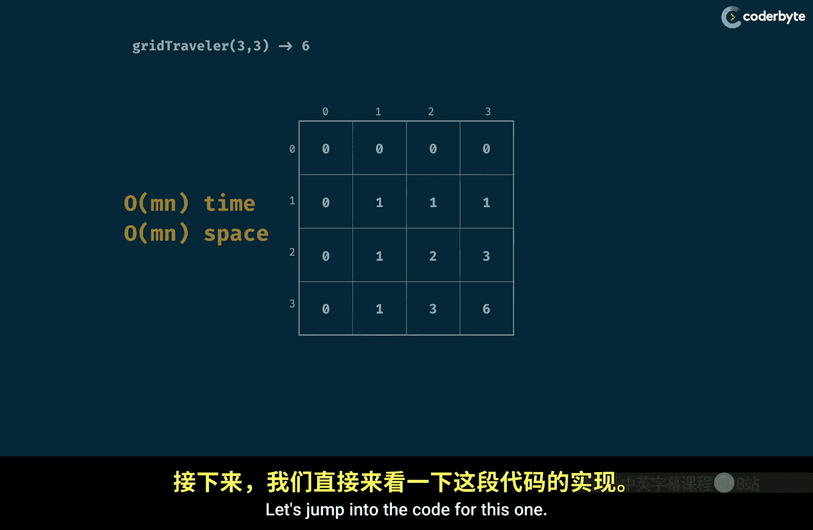

All right， back in the code editor， let's work on implementing this grid traveler tabulation strategy。

 So we'll start by initializing our table。 She's going to be a little more complex here compared to our last food function because it needs to be a 2D array。

So what I'll do is I'll start by creating， let's say the correct number of rows。

 so that will be as simple as calling array and I want really dimensions m plus1 again。

 I have to adjust for that off by one error because I want the max index in this table to actually be exactly M right and I know indices C start at zero so I'm going to up it by one over here。

Cool， so I'll give me the correct number of rows。 and I want to make sure that the elements inside of this array are also other subs。

 So trick I can do for that is I'm going to fill this up。

 It kind of just a very particular JavaScriptscript pattern。

 I'm going to call Phil on this array I just created。 and afterwards， I'm able to map over it。😊。

Co so maybe I'll spread this out like this。And when I map over this array。

 what I want to do is make sure that every element of the array is going to be a new array like this。

 This time of dimensions n plus one， though。 So I have roughly M rows and N columns。

So let's go ahead and just see what the shape of this is。 I'm going to print out， let's say。

 the3 by two example。 So we'll go ahead and run this code。

So notice that if I look at the arrays I printed out here。

 it looks like I have a four by three array， which makes sense because again。

 I increase my initial dimensions by one， so that looks good to go。However。

 what we'll want to do is really understand what this map is useful for。

 so a very common mistake that you might be tempted to do is can't I just skip this map part and then do the fill with the array of n+1。

So that will look like it gives you the same thing。 So I'll run that code。

 But if you write it this way， what you're doing is you're filling the entire outer array with a single array instance multiple times right。

 So the shortcoming of this code is， let's say I kind of change only one position of the table。

 Let's say I just made it in X kind of arbitrarily。

That would actually look like it changed many positions of the grid， right。

 And that's because this is technically just one array that's inserted multiple times into the outer array。

 whereas I need a really unique array references。 So that's how we need the map pattern here。

 I know every time we evaluate the callback function to map。

 it's actually going to execute this entire function。

 which means it's going to give us a new inner array instance。 right So if I use this map pattern。

 I run again。😊，This is really the intended behavior， right， I have a unique array as a subrase here。

And so let's take out this X part。 But that being said now that I have the correct shape of my table。

 I need to insert some good starting values right， So what are the seed values here。

 Well recall in our strategy， we said that basically the entire table could contain mostly zeros。

 so maybe I'll bake that right into this line。 So after I make a new subreet。

 I'll be sure to fill it with some zeros。If if I run that now， I should have a nice table。

 Google says it's looking pretty good。At this point， I also need to seed another value， right。

 We talked about it in that we should seed table at position 1。

1 with exactly one because it's sort of like our base case。 when we have a one by one grid。

 there's definitely only one way to travel through it。

 So now we have the elements of one in position 1，1。Nice， so at this point。

 now I need to iterate through my table and fill in the position。

 So I'm going to use just nested loops for this。So I'll say let's I equal 0。

 and I want to make sure that I goes up to n including M， basically the dimensions of the table。

 and I'll do I plus plus and very similar for my inner loop being sure this time to reference J and J is going to go up to n this time。

Also， I just have classic nested loops just iterating through this two dimensional array， right。

 So as I'm iterating through the table， what was the logic we traced through in our drawing。 Well。

 what I needed to do was take my current element that I'm at。 So maybe I'll call it。

 let's say my current。So my current element would be at table ij。

 so I need to take this current element and I need to add it into my right neighbor and my down neighbor right so if my row is I and my columns J。

 that just means I do some arithmetic on I and J so if I want to increment my let's say right neighbor what I can say is look at table at position I J plus 1 that would be directly to my right and I'm going to increase it by whatever this current is。

If I want to look at my down neighbor， then that would be i plus1， but I keep J the same。Cool。

 so this will add to my two neighbors that are to the right of me and below me。 And at this point。

 what we have to be aware of is like what happens at our edges of this table we know that if we're already at like the last position of a row。

 if I do J plus1， I'm going to go out of bounds。 And so to make sure I don't step out of bounds on these increment expressions。

 I'll need some conditional logic。 So I'll say if the right position is inbound。

 So if j plus 1 is less than or equal to n。 then I'll go ahead and increment it and should be okay。😊。

And likewise， if I plus 1 is less than or equal to M， then I'll also increment， right？

Notice that when I check my like J value， that should be using n right because that's the number of columns and then I is the number of rows。

 so it should use M。Cool， so what I have so far is all right。

 I'm iterating through every position of my table。And I'm going to take the element at my current position。

 and I'm going to add it into my right neighbor， as well as my down neighbor。

 but only if they actually exist。Cool， so once I'm done filling up the table。

 then my final answer should just be at position M N， right， just the very bottom right corner here。

So let's give this code a run， so I should get 1，3，36， and then there's a very large number。

We'll run G traveler。Nice and it looks like the solution is totally working。

 and we're already satisfying the last example here， right if you tabulate off the bat。

 you will have a pretty quick solution and we already traced through the complexity for this。

So take a moment to you know look at this code， let it sink inll really try to understand how we took that whiteboard strategy and implemented it in some code right we do have to do some like kind of fine implementation details。

 especially with the bound checking here but I think the most important logic is about how our current position of the table contributes to our immediate neighbors to the right and downward with that I think I'll head back into the drawing board。

😊。

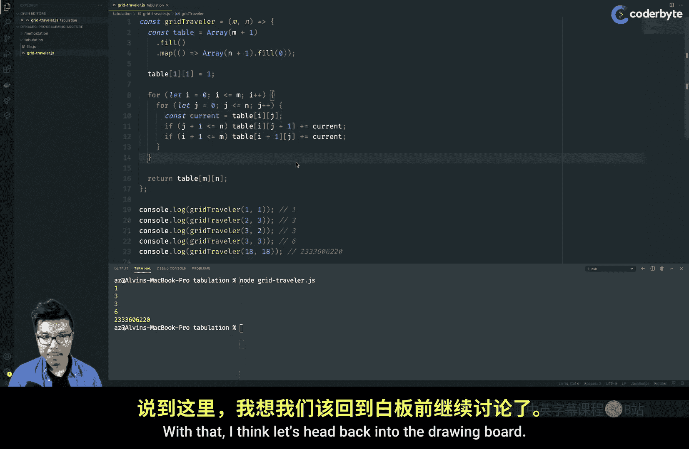

All right， now that we've seen tabulation in two different problems。

 hopefully you're noticing some patterns， right， let's give ourselves some rules we can follow to tackle any dynamic programming problem using a general tabulation strategy。

With this tabulation recipe， it's going to be pretty different compared to our memorization recipe in that there aren't like two main steps。

 when I talked about memorization， I said， make sure you implement the brute force first。

 and then add the memorization afterwards， whereas if you just try to tabulate a problem。

 you're really going to have the most efficient version of your solution all in one swoop。

And so what is our first step for tabulation。 Well， of course， you have to visualize it as a table。

 And that really begins with a conversation of what should like the size or dimensions of the table be。

 that should definitely be correlated based on the size of the input。

 So in the case of Fibonacci of n。 we made our table roughly you know n elements long。

 Sometimes you definitely have to watch out for like an off by one scenario now which we've been seeing lately。

 in the case of our grid traveler problem。 We saw that because our you problem represents a grid。

 we had to create a two dimensional table at that。 So figure out the size of your table based on the inputs to the problem。

😊，Cool， and once we do that， we need to initialize some values within the table。To me。

 this is always about choosing compatible types。 In other words。

 if your problem asks you to return a number， then it' would be wise to initialize the values of your table with numbers right on the flip side of that。

 if I was asked to return a boolean in a problem， then I'll consider initializing true or false within the table。

Cool， and once I have all of the kind of generic values filled up in the table。

 then I choose my very important seed value， right。

 I know that this seed value should capture the scenario where I have a trivially small instance of the input where I automatically know the answer So in the case of our classic fibonacri。

 That means I just seed the n1 and the N2 values of my table with one and one respectively。

 And in the case of our grid traveler we were sure to。

 you know capture the scenario where we had a one by one grid。

 So you're going to need to seed those values， because that's the basis upon which we fill the rest of the table。

😊，And then we have the hard part， which is really iterating through the table。

 and you have to come up with some logic， right as you iterate through the table。

You have to design some logic that fills further positions of the table based on the current position。

 and you really have to， know look to the problem to figure out what the logic is。

 in the case of Fibonacci， it's as simple as if I'm at some position of the table。

 I look one space ahead and two spaces ahead。 very reminiscent of the pattern Fibonacci。

 In the case of our grid traveler problem。 It was about looking the unit to the right or the unit downward。

 effectively shrinking the size of our grid。 So it's really。

 you know up to you to figure out the logic。 look for it language in the problem。😊。

What I always do is focus on what options I have at any point in the problem， right， My options are。

 do I go rightward or do I go downward in that grid traveler problem。

 So we'll stick to these rules as we tackle our tabulation problems and we'll utilize them right now。

Okay， so let's work on tabulating our can sum problem now。

 So recall that in this problem we want to do is take in a target sum as an argument。

 as well as an array of numbers。 and we want to return a boolean indicating whether or not we could generate the target sum by adding numbers in the array。

we can reuse an element of the array as many times as we want。

 we can also assume that all the input numbers over here are non negative。

So we've solved this problem before， right， recursively using memorization。

 but now I want to use a tabulation point of view。So let's come up with the strategy here。

 So let's say I gave you this input of 7 and an array of 5，3，4。 in the longer run。

 the answer is true because it is possible at to generate 7 right you can either do a3 plus 4 or a 4 plus3。

 and that would give you your original target。So you know that in the first step for tabulation。

 what we need to do is create a table， but I guess the question here is what size table do I create。

 I have two inputs。 I have the target as well as the array of numbers。

 which of those actually contribute to my initial table。

And so the key insight is to think about you know what's going to change throughout the problem In other words。

 if we can reuse the numbers of the array as many times as we need。

 that it's not like we're shrinking the size of that array。However。

 if we think about the target number or the target sum that were' given。

 we do have a goal of actually reaching that target sum and we're going to increase to it over time。

 And so I'm going to use that as a basis for my table that is I want to create an array that is roughly the size of my target sum。

 So because the target sum is 7 I want to make sure that the indices line up perfectly。

 So I'll actually have to create an array with length 8。 And in general。

 I just be creating an array of length target sum plus one。Co。

 we have that classic off by one error over here。 Allright。

 now that we have the correct size of table， what do I actually want to store inside。 That is。

 what should the eventual elements of this array be。

So a really nice rule of thumb you can use for that is to just recognize what type your answer should be in the long run。

 right， So here they're asking for a Boolean answer。

 So that really tells me that I should probably put some Boolean data as the elements of this array。

 So I'm going to start by initializing every element of this array with a false value。😊。

And the reasoning is right now， we're kind of assuming before we check anything that none of these target sums are actually possible to be generated。

Cool， but I have to think about any particular seed values I need。

 Something inherent to this can some problem is we treat the target sum of 0 very special， right。

 sort of the base that we use。 In other words， someone gave me a target of 0。

 I know that that is always possible， no matter what elements I have in the array。

 because to generate 0， I can just take no elements of the array。😊。

So that's going to be a really important seed value here。

 So I'm going to populate index0 with the element true。Cool。

 so now that we have some good seed value。 Now we want to think about how we can flesh out the other elements of this array。

 sort of in a linear fashion， right， So I know I'm going to have to iterate through this table。

 So let's just start at the very first index。 So right now， I'm looking at index 0。

 And if I'm situated in any position of this array。

 then the value I'm currently looking at should basically say。

 you know is it possible to generate that index amount。 In other words。

 since I have a true at index 0， then I know that it is possible to generate 0 using the coins of the array。

 But now that I'm at of this position， how can I actually transition into the further positions of this table。

 And So what I want to do now is consider the possible numbers that I can take into my sum。

 So I'm going to start by looking at this first element of5。😊。

I know that if it's possible to generate to zero。Then if I also have a five in the array。

 then it's also possible to generate 5 in the context of my array。

 that means I should look about five spaces ahead from my current position。 So I look at this spot。

 right， exactly five indices ahead。And right now， I should actually replace this false value that's stored at index 5 with a true。

 And again， the reasoning is， if it's possible to generate my current amount right。

 right now I have a true in the0， it's possible to generate my current amount， and I could take a5。

 then it means that the position five steps later should also be true， right。

And I want to actually continue this process for the other values in my numbers array。

 So I'm just going to look at the next element of three。 And that's basically telling me that， hey。

 the next spot three places away should also become a true。

 So I'll just go ahead and make that a true。 And finally， likewise for the last element of four。

 right， The element four spaces ahead should also be turned to true。Cool， and at this point。

 I think I finish like my very， very first iteration。 That is when my current is at index 0。😊。

And at this point， I just want to keep iterating through the array。

 so I'm just going to shift my point of view one space to the right。

So now I'm looking at my current as index 1。 notice that over here。

 my current element is actually false。 So what that means is it is not possible to generate one using the numbers of the array。

 which logically makes sense or I only have 5，3 and 4。

 So there's no way you can ever give me back a one， right。

So if I have a false value at my current position， then I should not modify like my further values by looking ahead。

 So notice that if I look at my edge for5。 If I look five faces ahead。

 I am not going to make that a true because my current position is not true， right？

 So I'm going to keep iterating。 Same thing happens when I'm at index 2。

 because the current value is false， there's nothing to be done here。

 things get really more interesting on this iteration， right， If I'm at index 3 as my current。

 Then I see a true at this position。 So that means I need to look ahead to my future positions and actually assign them to be true。

Obviously， you'll notice over here if I look five positions ahead when I'm currently at index 3。

 then that would actually be out of bound so I don't need to look that far ahead。

 so we'll kind of drop that connection。But at this point。

 I should make the space three positions ahead true。 as well as the space 4 positions ahead。

 So that means that indices 6 and 7 are set to true， right。

 And I keep doing this process all the way through the entire table。

 Notice that as I keep iterating toward the right， these forward looking references kind of stop being useful because it goes out of bounds。

But the point is， by the end of all of these iterations， I do have a true stored at index 7。

 which means that it is possible。 not to generate a quantity of 7。 And if I do a quick spot check。

 and I look at just my entire table right now， it has very consistent data。 In other words。

 if I notice where all of the true values are right， they're at 0，3，4，5，6 and 7。

 That means that all of those quantities for target are actually possible on the flip side。

 If I look at the only elements and indices that are false， like one and 2。

 that makes sense because those are the only quantities that are not possible。

 you can't possibly generate a 1 and 2， using a 5，3 and 4， as your options for adding up， right。

 So we know by the end of this algorithm， the element that is stored at the last position of our table would be the final answer right。

 So if it's true， then it's possible if it's false， it is definitely not possible。😊，Alright。

 so let's wrap up this sketch by actually talking about the complexity of this。 As always。

 we'll define our terms。 So we'll say that M is going to be the target sum， which is just a number。

On the flip side of that we'll say that n is going to be the length of the numbers array。

And we already have the vibe that， hey， both of these terms definitely affect our complexity。 right。

 if you give me a larger target sum， that's probably a harder thing to calculate in the same way。

 if you give me more numbers to choose from， it's even harder to calculate， right。

And we can recognize that the algorithm just has us a flesh out this table。

 and I know that the table is of size M。 so we're going to have at least M， however。

 as I iterate through every position of the table， what I had to do was actually look ahead in the table for every single element of the numbers array。

So I know that that is going to be accomplished basically using some nested loops or I'm going to have a loop to iterate through just the table and then a nested loop iterate through every number of the numbers array。

 So overall I'm looking at an n times n time complexity。😊，And along with that。

 what does the space here， well， the space is really just the exact size of this table。

 which is based solely on M， so I have just M space overall。Nice。

 so this is already looking like inefficient implementation。

 especially because we're not dabbling with any exponential complexity over here。

 I think let's work on the code now。

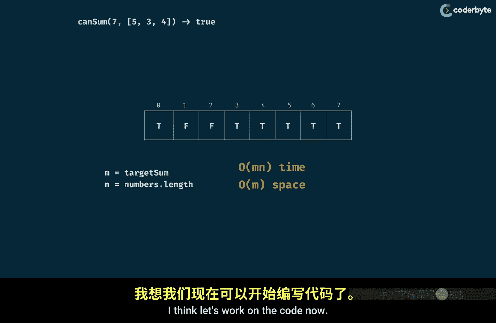

So here we are， back in the code editorit， let's start like we usually do by creating our table。

So I'll store this table and like we discussed in our drawing。

 we need to make it roughly the size of our target sum。

 so I'll create an array and I need to make sure that the indices line up directly right I want an index that is exactly the target sum。

 So I'm going to initialize it to target sum plus1 So that means if I pass in target sum is 7 I'm going to create an array of length 8。

 which means that its's very last index of 7 which is perfect。Cool， and while we're here。

 we'll go ahead and actually initialize this array with all false values。So I'll do that。

And I need to make sure that I seed index 0 with a true symbolizing that the target sum of 0。

 it's always possible to be made even before I look at you know what's in the numbers array。

 So I'll just go ahead and say table at index0 is equal to true。

So let's just console our log what this table looks like so far， and I'll just run， let's say。

 the second example here。So I should see my array of length 8。

Now need to go into this tabulation folder。 Now I'm going to run this guy。Cool。

 so that looks like a good table， right， eight elements， and I do have a true at index0。Nice。

 so at this point now I want to actually lay out the core algorithm by iterating through the table。

 so I'm going to use a regular for loop here to say let I equals 0 go up to and I can even include if I wanted to up to an including the table dot length。

I guess you could also say a target sum here， some。hing based on target sum。

 I'll do i+ plus and here I'm going to choose to iterate using you know the manual index because I know I have to do some arithmetics to look ahead in the array。

But as I iterate through every element of the array。

 I want to actually check if this position is true， so I'll check if table at index I is true。Cool。

 because I know inside of this if statement， I need to basically jump ahead or look ahead based on what's in my numbers array。

 but I only need to do that if my current position is true， right。

 I only get to look ahead if it's even possible to get to this current amount right the current amount I'm sort of tracing through。

 it would be at index I。So at this point inside of my if statement。

 what I want to do is now look ahead for each a number of this array， so I'll nest a loop here。

And I just want to look at the elements of this array。 So I'll say four， let's say let nu of numbers。

 So I'm grabbing each element this time。And now for this number element。

 I want to look that many spaces ahead， so I want to look at basically table at index I plus the number。

Cool， so imagine that I'm on like the first iteration of this。 I know I is going to be 0。

 So that's the very， very first index of my table。 And if my numb is 5。

 then I'm going to do 0 plus 5 looking5 spaces ahead， right， just like we did in our trace。😊。

And for this position that is like five spaces ahead， I want to assign it to be true。

 basically saying that， hey， if my current position is reachable and I can take a step of exactly numb then that must mean position I plus nu is also a reachable right and that entire for loop goes inside of this if statement。

 right。So this code is looking pretty good so far。 I think the last thing we need is just to return our final answer after we're going to entering through the table。

 So here I'll just return。Table。At index targets sum。Cool。

 so let's let's go ahead and run these examples， maybe we'll have to debug some stuff。

Looks like I have probably an infinite loop。 Yeah， and my program crashed with some massive error。

 So let's debug this one together。 There's something that I'm not considering my code。

 but we did consider when we drew it out。So something that is probably breaking right now is having to do with like the bound checking。

Something that's kind of unfortunate in JavaScript is this characteristic。

 This may have different behavior depending on the programming language that you're following along in。

 but I know in JavaScript， if I had some array， let's say array。

 and I said it equal to just a handful of elements， let's say A， B and C。

If you actually do like array at some out of bounds index， like index， I don't know 10。

 And I assign it like X， that will actually。Change like the effect length of this array。

 So if I take a look at what happens here， I'm just running this kind of。offffhand example。

 when we run this， notice that we have about seven empty items before we have the X。

 Basically when you do this type of weird assignment in JavaScript。

 it's going to like lengthen your array that way and make sure that this， hey。

 new element of X is placed at exactly index 10。And so why is that relevant， Well in my code here。

 I don't really check if I'm out of bound right And I just assign to something that's potentially outside of the current length of my array of my table rather。

 And if I do that， then this condition is a little suspicious because if I do this assignment on line 9 to an out of bound position then the length will get longer and that's sort of like a circular argument right I keep iterating only to make more stuff out of bounds only to lengthen the table even more So that's why I ended up with like an infinite loop over here。

One way I can fix that is to just maybe limit this。

 so I won't make a table at length that's a little too dynamic。

 I know I can basically stop once I reach the target sum so that might actually be the better move over here。

Pretty， pretty fair bug， though。With that， let's go ahead and run this code again。Give that a shot。

And here we see trueo true false， true and false。 and that is the correct answer over here。 Nice。

 so here's a nice tabulated solution for our canom problem。

 and we already spoke about this code having an M times n time complexity now it's really obvious right because I can see how these exact loops and our space complexity is simply based off of M right。

😊，Cool， with now let's head back into the drawing board for another problem。

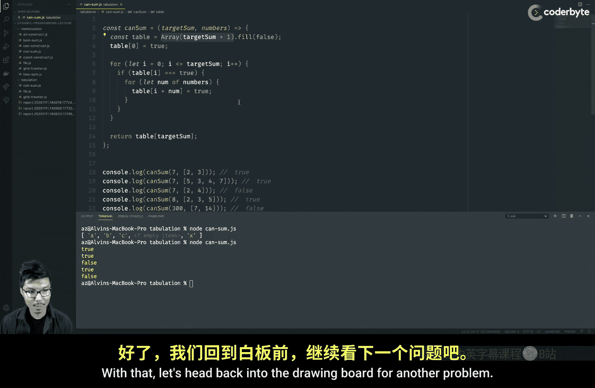

All right， Now let's work on the how sum variation of this problem。 So like before。

 I'm going to take in the target sum， as well as an array of numbers。 But this time around。

 what I want to do is return an array containing a combination of elements that actually adds up to the target sum。

 right。 So here I want to return exactly one way， if it's possible。And along with that。

 let's say that it's actually not possible to return the target sum。

 then I should just return the null value。 And if it's the case that there are actual multiple combinations that can generate the target sum。

 I can return any one of those。So we expect the strategy for this one to be very similar to our last problem。

 however， we will need some nuanced logic to return the array now because I don't want just Boolean data once to return an array。

So let's sketch this one out。 Let's say I'm stepping through this example where my target is 7 and my array is 53。

4 For this input， a reasonable answer to return would be an array of 3 comma 4 because I can add 3 plus 4 to get 7 you can also I guess。

 switch around the order of these elements。 So if you also return4 comma 3。

 I think that would also be a valid answer point being I just want to return at least one way that I can generate the target。

So we know we want to solve this one with tabulation。 And so we'll just follow our recipe。

 right I need to construct and initialize some table。

 And we already know that the size of this table is going to be based on the target sum。

 So roughly seven elements。 but we of course， have that classic off by one nature right because I want the last index of this table to align with the actual number argument。

 And in general， I'm going to initialize this array with a length that is target sum plus one。Cool。

 so now that I have the correct shape of table， what do I actually have to initialize as elements inside of this table。

 previously， in like the boolean version of this problem， we initialized everything as false。

 And the reasoning there was before we actually try all the possibilities。

 we're going to just assume that it's not possible to generate every quantity。

 And we just want to adapt that for this new type of problem。

 So tell us that if it's not possible to generate an amount， then we should just return null。

 So I think null is actually a grit initial value to just put everywhere in your table。😊。

So at the start， we're going to assume that none of the values or none of the amounts are actually possible to be generated。

 null is sort of the analog for false in this rendition。Cool。

 so now that I have most of the values added to the table。

 now I need to figure out what's an appropriate seed value That is I need some actual data to begin and get the ball rolling on this one。

So like we expect， it's about having an amount of0， right。

 no matter what if you're given an amounts or a target sum of0。

 and no matter what array of numbers you're given， you're going to always actually generate that quantity of0 by just returning the empty array right you can take zero elements from the numbers array。

 and there you have an array whose sum is0。So， of course， that means that index 0 of our array。

 we're going initialize it with just an empty array。 And at this point， what we want to do is。

 of course， iterate through our table and come up with some logicging we can use to fill out further positions of the table based on our current position。

 So let's say we begin at index 0。 So here I am。 And I have to figure out which of further positions of the table。

 should I be looking at。 we've seen this pattern before。

 I should just base that off of what I have as options in my numbers array。

 So look at my first number of five。 That means I could look exactly five spaces ahead in the table。

 at this position。😊，And so if I know that my current position is possible。

 I see that I have an array in my current position that I know it's possible。

 If this current position is possible， then a position exactly five steps later would also be possible。

 right？ And so what I'll do is I'm just going to copy my current value into my further value。

 In other words， I'm going to put an empty array at position 5， right。However。

 I also have to include the number that I'm using right now。

 I took a five to actually get to this position in the first place。

 so I'm also going to add a five into that array。Cool， if I do a quick spot check。

 this is a reasonable thing to do because if I look at the state of that index 5。

 it contains an array of 5， meaning that， hey， you can return a sum of 5 by just taking a single five。

 And with this， I want to do the same logic for the other numbers of the numbers array， right？

 So if I have the three， I'll look three positions ahead and of my current place。😊。

And I'll also start by copying over the array at my current position。 so I copy over the empty array。

 and after I copy that array， I actually want to populate it with the number that I took to get to the spot in the first place。

 So I just go ahead and put a three in that array。And the same thing happens for before。

So if we go to the next iteration， we see that our current element is null。

 That means that the amount， right， In other words， our index amount is actually not possible。

 it's not reachable， meaning we can't get an amount of one by adding up any numbers of the given array。

 So what I should not do is actually manipulate any further values from this position。

 So I just continue these base iterations。 same thing happens when I'm at index 2。

 but things get more interesting when I'm at index 3， I see that the element here is not null。

 So it is possible to generate 3。And so what I want to do is go ahead and look at my my forward values and sort of copy my current array over。

 So I know I don't need to look five spaces ahead because that would be out of bounds。

 So I'm going to look at the position exactly three spaces ahead in the table and copy over my current array like this。

What I also need to do is make sure that I include the number that I'm using right now。

 which is  three right because I'm looking three spaces ahead。

 So I end up with three comma 3 at index 6 of my table， which is reasonable， right。

I also want to do something very similar for the position four spaces ahead。

 so I'm going to copy over my current array。But then also include the four that I'm using up right now。

 so now I have three， four over here。Cool， at this point。

 you can kind of see where this is heading right， I've actually already populated index 7 of my table and 3 comma 4 is exactly one way we could create the 7。

 So we could stop here。 However， let's say that you continued the algorithm。😊。

So in the next iteration， I know that this space4， the indices head would be out of bound。

 so I don't need to look there。But according to our general logic。

 I would actually manipulate the spot of the table three moves ahead And so what I'll do is if I follow the same exact logic I'm being consistent and not really changing any of the rules here。

 I would copy over my current array into that position。

 so I'd basically overwrite index deck 7 with adjust an array of 4。But then at this point。

 I would also be sure to include the number that I'm using right now。

 which is three because I'm looking three spaces ahead， So I end up with four comma 3。

 which happens to be like another way I can generate these7。

 So it doesn't matter if you actually continued this algorithm So if I continued I basically just keep iterating until I hit the very end and what do I know the element at index 7 is exactly an array of 4。

3 Co， So the point is you actually don't have to like exit early as you iterate through the table。

 you'll be okay to just finish all of your iterations and you'd still have a valid answer because in this problem that just want any way to actually make the target。

😊，And if I take a quick look at my table， I think all of these stored values here make some logical sense。

 For example， if I look at index 2， there's a null。

 meaning that it's not possible to make a two using elements of the array in a similar way。

 if I look at index 4， there's a sub of 4， meaning you can just take one，4 to make a sum of4。

 Similarlyly， you can take two，3s to make a sum of 6。 and of course， you can make a7 by doing4 and 3。

So now that we have a plan of attack， let's look at the complexity for this。 So of course。

 the m will represent the target sum and our n will represent the length of the numbers array。

So if we begin with just the time complexity， we know that we're going to at least iterate through the table and the tables of size M right So I have at least an M in my time complexity。

But for every space in the table or in every iteration of that loop。

 I need to also iterate through all of the numbers in my number input array。

And so I can multiply by n over here。Nice， but at this point， now。

 let's say that I actually need to take a valid step here。

 Then what I also did was copy over the array at my current position into that forward looking position。

 And I know that a suburray will be at most of length M。 remember that M is our target amount。

 The worst possible or largest way we can generate the target sum would be to have an array of exactly M1s。

 right。And so we'll say that in the worst case， we have to copy over an array of an additional length M。

 so that means our time is really M squared times n。Now。

 let's come up with the space complexity for this。 We know that the initial size of the table is definitely based on M。

 However， in the long run， we could be storing a sub race as elements。

 So this is going to actually be a 2D table， in a sense。

I know that the size of any particular sub here is also going to be M for the same reason we just said。

 and so we have a M squared space complexity。So overall。

 we were pretty satisfied with the complexity of this because it's polynomial， right。

 it's not an exponential quantity， so it should run in a reasonable amount of time。All right。

 I think we're ready to hop into the code for this one。

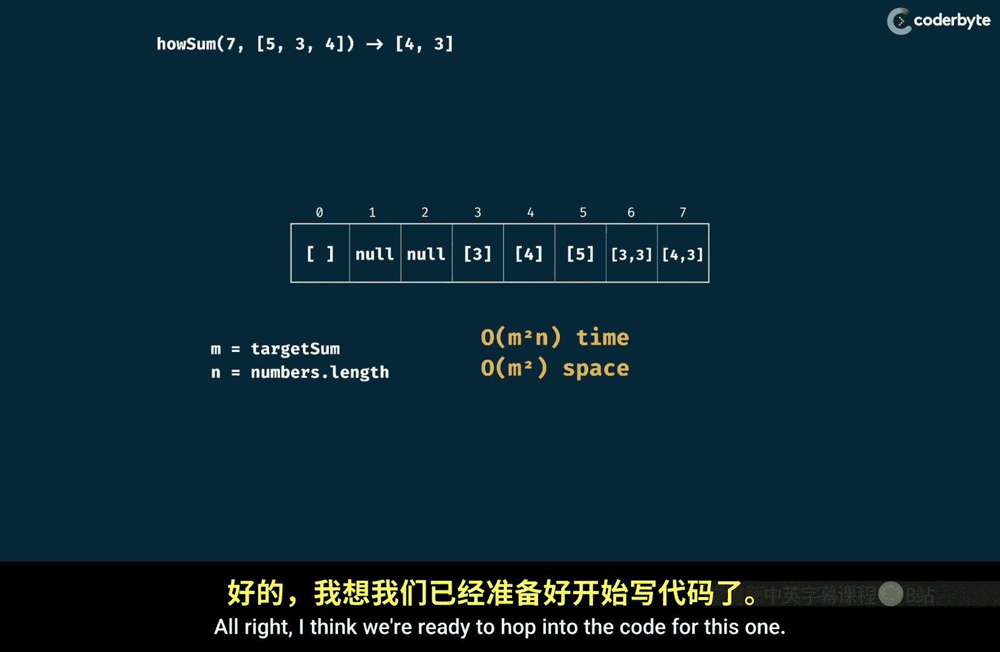

All right， programmers back in my trusty editor。 Let's go ahead and tabulate this one out。

 So we'll need to create the table to begin， right， So I'll create my table。

 and it should have roughly target sum positions in it。 Really， I need to increase it by one。

 So I'll say array。 and I'll pass in target sum plus one。 that way， the final index aligns。

 And I'm going to go ahead and fill this table up with all of those nulls， right。

 exactlyact what we did in our drawing。😊，What I also need to be sure to do is make sure we populate index0 of our table with an empty array。

Serves as sort of like a base case in that we know that the target sum of 0 can always be generated。

 right you can generate the target sum of0 by taking no elements from the numbers array right if you took the sum of this array。

 it would be 0。Nice， this point we need to iterate through our table。 So we've seen this code before。

Equs0， go up to and I won't mess this up this time I'll go up to and including target sum。

And I'll do I plus plus。 So so far， very similar in shape to our last problem。

 Now that I'm iterating through every element of the table， I need to add some conditional logic。

 If remember from my drawing， we only did like the heavy logic when our current position was not null。

 right， because if it is null， then you can't even reach this current position in the first place。

 So I'm going checky， if my current amount is attainable。 In other words， if table at index I。

 which is my current amount。 If that is not null。 if it's not null， then I can generate amount I。

Cool， so if I can generate amounts I， then I know some other things could also be generated。That is。

 I want to look forward in my table for every number in the numbers array。

So I'll say let nu of numbers， so I'm getting the elements of the numbers array。

And I need to look that number of positions ahead， right， So if I'm at I right now。

 that means that a forward looking position would be at table I plus nu。Cool。

 and I need to assign something over here。So I'm going to do is start by copying over the subarray at position I at my current position。

 right， I know that if table I is not null， then the only possibility that it could be is an array right。

 It could be an array of0 elements or it going to be an array of many elements。

 So no matter what that array looks like， I'm just going to copy over that array。

 I'm going to spread out all of the elements of table I。And so far。

 like this logic is looking pretty good because I'm basing my assignment on table i+ nu。

Off of table I， right， But in addition to that， I also need to include this choice of numb。

 So I'm just going to add that into this new array as well。

 using some syntax that you've seen previously in the course。

 So I'm just copying over all of the elements of the subarray at table I and adding on in addition to that。

 my current number。Nice， so this code is looking pretty good。I think at this point。

 all we need to do is let all these iterations finish and then wrap up by returning the last entry of the table or really the table at index targets some。

Cool， so not that much different from our last piece of code。Let's give this a shot。

 so I'll run how some and here I have a few diverse examples written。

 notice that some of them should return null because they're not possible。If we check these 3，2，2，4。

3， null， bunch of twos， and another null。 nice， it looks like this code is totally working。

 Notice that we already have a very efficient algorithm， kind of off the back。

 kind of comes free with tabulation。 We definitely have M iterations in this for loop。

 We have n iterations on the inner loop。 But then we also have to consider this copying over logic。

 Coing over an array will be at most M。 So it's M times n times M， which is just M squared n。

 exactly how we spoke about it before。😊，It's something I really want to emphasize is， you know。

 in isolation， if someone just asks you to solve like this howsome problem。

 I don't think it's an easy problem。 However， it probably feels almost trivial。

 especially since we just did can some right there's a really。

 really straightforward progression to these problems。

 If you compare the howsome and can some functions。 they're very， very similar right。

 really just changing the type that we store inside of our table as well as the assignment that we do when we transition into our further elements of that table。

 really just adjusting that logic for the data type that they're asking this for right I had like some array answers here。

 And here I have some boolean answers。 All right， so we're smashing through all of these tabulation exercises。

 Let's do one more variation of this target sum problem。

 that way we'll have a little bit of an increase in the difficulty。😊。

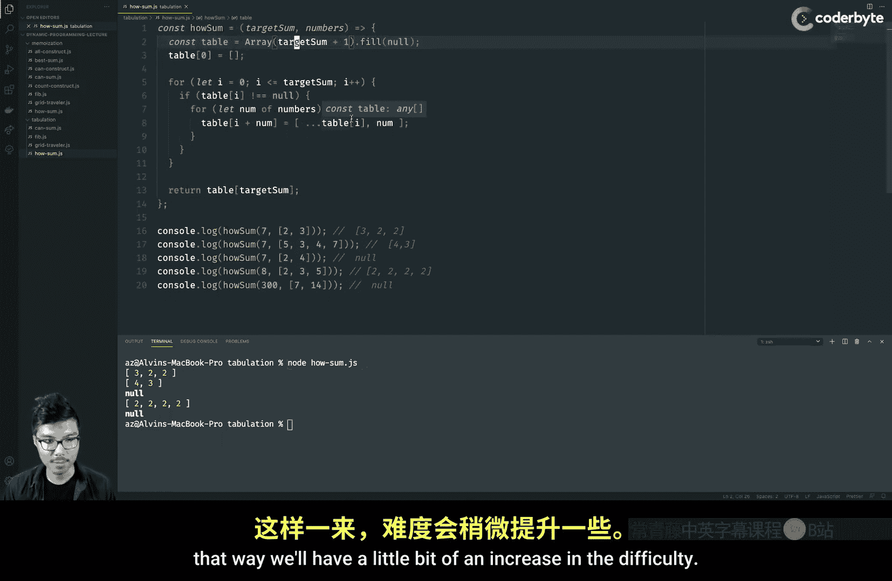

It's time for revisit the best sum problem， so we're going to take in again the target sum as well as an array of numbers。

 but this time what we want to do is return an array containing the shortest combination that adds up to the target sum。

And if we have any ties for the shortest combination， we can return any one of those shortest。

So you take a look at an example kind of like we did before， if we have8 and an array of 2，3，5。

 there are a few different combinations that can yield 8 where I can do 2 plus 2 plus 2 plus2 or I can do 2 plus 3 plus3 or I can do 3 plus5 and among these options。

 the shortest one is obviously the3 plus5 so that should be the return value over here。

 Obviously if you return 5 comma 3， that would also be a valid answer。Nice。

 so let's start tackling this with our classic tabulation recipe。

 so we need to decide on the size of our table。 like we usually say。

 it's going to be based on the target sum and not so much the length of a numbers array。

And like we've been saying recently， it would be nice if the last index of the table aligns with the original target。

 so although the last index of this table is 8， that does mean that its length would be 9， right？

And let's start by seeding the proper values here。 I always want to begin my my value seed with the type that's kind of relevant to this problem。

 In other words， I want us to always return an array if there is at least one valid way to generate the sum。

😊，And I know that trivially， if I wanted to calculate the best sum for0。

 no matter what array of numbers I'm given， the answer there is always an empty array。

 so I'm going to be sure to store that value at index0 of my table。

And now for the rest of the values in the array， I can't be sure if I can generate them yet。

 so I'm going to initialize them as null， just like our last problem。

Now at this point we can begin our general algorithm by iterating through the table。

 and so what I'll do now is look ahead from my current position based on the numbers of the numbers array。

 so I'm going to look two spaces ahead。All right now。

 I see that there's a null inside of that position。

 which means I haven't quite found a way to create two， but I'm actually finding a way right now。

 right I can copy over the array from my current position。

 but I also need to populate it with how far I'm looking ahead by。 So just a two inside。

And do this for the other numbers of the numbers array。 So something similar happens for three。

 as well as for the5。 Not that since I just began the algorithm。

 this is really the first time'm finding any solution for these further values。

And so let's keep these iterations going， I'm going to shift my frame of reference by one。😊。

Since my current position contains a null that kind of entails that one is unreachable， right。

 I have no way to generate a sum of one。 so I actually don't do any logic from this current position。

 So we move ahead to two。Since I do have a non null value I have an array over here。

 that means I should look ahead to my future values。 So if I start by looking two spaces ahead。

 I see that at index 4， there's a null， which means that I actually need to replace that now。

 I'm going to copy over my current array， but then I also add the value for how far I'm looking ahead by。

So now I have two comma 2 inside of that index of four。 So now I look ahead three spaces。

 which means I' am analyzing index 5。 I'll notice that index 5 already has an array there。

 And if I actually continue my sort of standard process。

 I would consider this array I would copy over my current array yellow， which is an array of two。

 but I would also add the element I'm looking ahead by， which is three。

 and technically two comma 3 is one of the ways I can generate5。

 but it's definitely not the shortest way I can basically compare the length of these arrays and notice that the original array of just5 is definitely shorter。

 so that one should get to stay in this spot。😊，Cool， I'll do something similar for P spaces ahead。

 I see phi spaces ahead from my current position yellow， there's a null right at index 7。

 which means that I can just go ahead and put this new array in size so I copy over the array of two then I add the p right because that's how far I'm looking ahead。

Now keep this process rolling。😊，I'm going to modify two spaces ahead。

Notice that this sub I'm considering would still be longer than what's already stored at index 5。

 so I actually don't use the three comma 2， right the5 gets to stay。Now I look three spaces ahead。

And this would actually be the first time I found at least a way to generate 6。

 so I copy over my current array and also add my look head value。And now if I look Phi spaces ahead。

 there's a null currently in that index8， which means that I'm actually finding the first way to generate 8。

 so I copy over my array of  three， and then I add my phi for my look ahead。Cool， and at this point。

 we've actually already found a way to generate 8。 And you can probably foresee that this would be the shortest way in the long run。

 However， if we kind of continued this algorithm， there would actually be nothing wrong with continuing it。

 right。 Its not like we're ever going to put something longer in that spot。

 So if we continue our algorithm as normal。 if I look two spaces ahead from my current position。

 that would mean I'm considering2 comma 2 comma 2 to my array of 3，3。 And obviously。

 I just maintain the shorter one。 So the 3 comma 3 gets to stay。 If I look three spots ahead。

 then I would be comparing two comma 2 comma 3，2 a2，5。 And of course， the 25 is shorter。

 So it gets to stay。😊，And this process really just continues for the rest of the array。

And by the end of this algorithm， you have the correct sub stored at index 8。

So before we jump into the code， let's look at the complexity of this one。

 so we'll say that m is our targets sum and n is the length of the numbers array。

And so we know that in terms of the time complexity， it's going to be the same as last time， right。

 still m squared times n。We don't really add any additional like costly logic。

 All we're really adding into the mix is just some conditional logic。

 which I know is just a very simple if statement， so that's not going to add any additional time。

In the same way， our space complexity is still m squared right because I have a table of size M。

 but I know every element of that table could be an array， really just a two dimensional array。

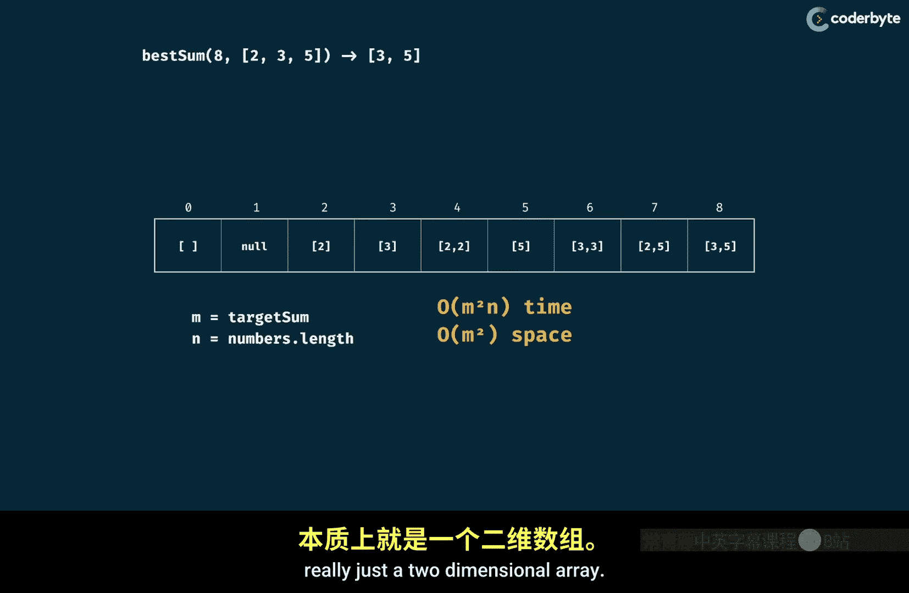

I think with that， let's hop into the code for this。Back in the editor。

 let's go ahead and code this one out。 so we'll start by creating our table。

And I'll make this table have roughly size of target sum。

But really target some plus one that way the final index aligns and when I actually initialize this table。

 I want to actually make sure I have null values inside。 so by default， all elements will be null。

 basically symbolizing that hey， these quantities cannot be generated yet。

 we have to actually prove that there is some combination that can make them。

Then the really important seed value is to make sure that index 0 is an empty array。 Basically。

 the one guaranteed way I can make 0 is by adding no numbers of the array。

AtThis point I need to iterate through every index of my table， we always do。

And I'll go up to and including why not the target sum？Nice。

 and as I iterate through every position of the table。

 I only need to do the heavy logic if my current position is not null right So if my table and my current position So table at I that is not null。

 then I need to do some additional logic。 So just to review。

 why do I need to only do the logic if my current position is not null Well。

 let's say that it was null right if my current position is null。

 then I don't need to bother considering any further moves from this position。

 if this position isn't reachable in the first place right。So only if I have a non null position。

 then I'll actually iterate through my options in the numbers array I'll consider possible moves。

 So I'll say let nu of numbers。And as I iterate through these additional numbers。

 then I need to actually look ahead in the table， basically buy that number amount。

 So I need to write some logic about table at index I plus nu right just looking forward in the table。

And we know based on our previous problem right the can we ended up doing this logic。

 we just replaced that position with a new array where we took all of the elements from our current position。

 So table I we spread out that array。 then we added additionally this current number that we're using right so we have to actually add that to our move list。

Cool， however， now we want to actually add some like min value logic。

 I want to prefer to always keep the combination array that is shorter， right， I want the best way。

 not just anyway。And so I think the move is， we'll refactor this code a little bit。

I'm going to actually do this step maybe separately above， so I'm going to save this to a variable。

And I'll call this my say combination。 So this is like my candidate combination。

 I'm not sure if this one is actually the shortest right now。And so if I do the assignment over here。

 then I'll just use combination。But I only want to do this assignment on line 9。

 if a condition is met， right， So what I want to express is like。If。🤢，This current combination。

Is shorter。Then what is already stored， right， I only get to replace something if it's shorter。

 That's pretty straightforward to express and an if statement， right， So I want to check， hey， if。

And my condition needs to be if the thing already there， so the element at index I plus nu。

If that thing is actually bigger。Then my current combination， so combination dot length。

 and I'll also need to be sure to do that element dot length right if my combination is shorter than my current thing being stored at that future position。

 then I'll go ahead and replace it。Nice， so this code is looking pretty good。

 There's one thing that's kind of missing。 but I think we'll just run it and we'll kind of debug it together。

 So let's say at the end， I return my table at index targetrg sum。So compared to our last code。

 we only added this conditional logic。So if I run this， something's going to gory can kind of4 C。

So you an error and the error message is pretty on the nose over here， it's saying all right。

 cannot read property length of null so it's really about particularly this expression。

So we know that our initial state of the table has a bunch of null values。

 So when I look ahead to a future value and for the first time I actually have a way to make it。

 then I'm going to check the element， which is null dot length or I cannot do null dot length and so I need a way to kind of get around that if ever I have like a null value in my table then I can just go ahead and do the assignment because I found at least one way to make that So what I'll say is I can put an or here。

So I can still do the assignment， we'll say not table。A。😔，Plus， no。In jascript。

 null is a falsey value。 So let's say table at index I plus nu is null。 So this expression is null。

 which is really false。 So if I say not false and evaluates to true。

 So I'll go ahead and still assign that combination to that position， even if it is null。

 Another great reason for using this syntaxes， we know toward like the tail end of our algorithm。

 we're going to potentially look out of bound， which means that these elements。

Could be undefined and undefined is also a falsey value So here I'm saying not false。

 which triggers as true， which means I would still correctly assign those positions。

 The important thing is I need to be sure to not do this expression when the element is null or undefined because you can't say null dot length。

 and you also can't say undefined do length。 So this expression will guard against that。

So would that change？Let's go ahead and run this。Coolal 7，3544 and a bunch of 25s， nice。

 and especially looking at that last example， the 25s is obviously the best way to make 100。

And just to be super sure， should be no different if I even switched around the order of these sort of ways。

 So what if I put like one， five and2。That should still give me a bunch of 25s right because it's really looking for the best way to generate each sum。

 which would mean the smallest subar。 So there we have it， a pretty interesting tabulation problem。

 However， I do want us to recognize how similar it is to our last how sum problem。

 right So here I have best sum on the left and how sum on the right。 notice how similar the code is。

 Really the only difference is this if statement right。😊，For the best sum problem。

 I just added this conditional logic and all this does is prefer to keep these shorter combinations over the longer combinations。

 right， because that's what I want to return in the long run。

 whereas in how some we don't really have any preference in either direction。

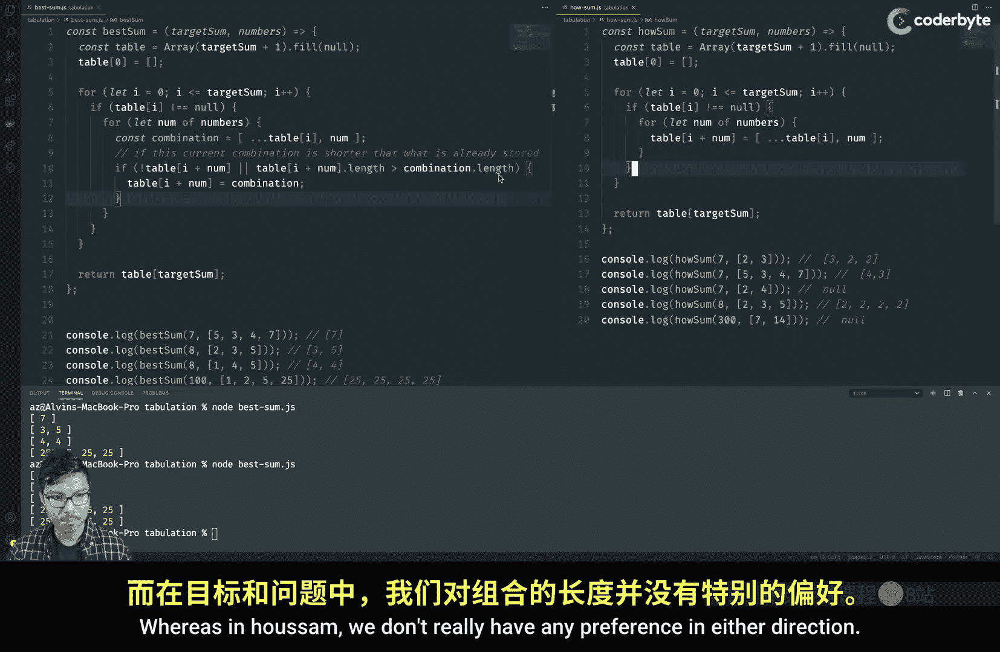

Awesome， so let's go ahead and go back to the drawing board and I think we'll kind of switch things up。

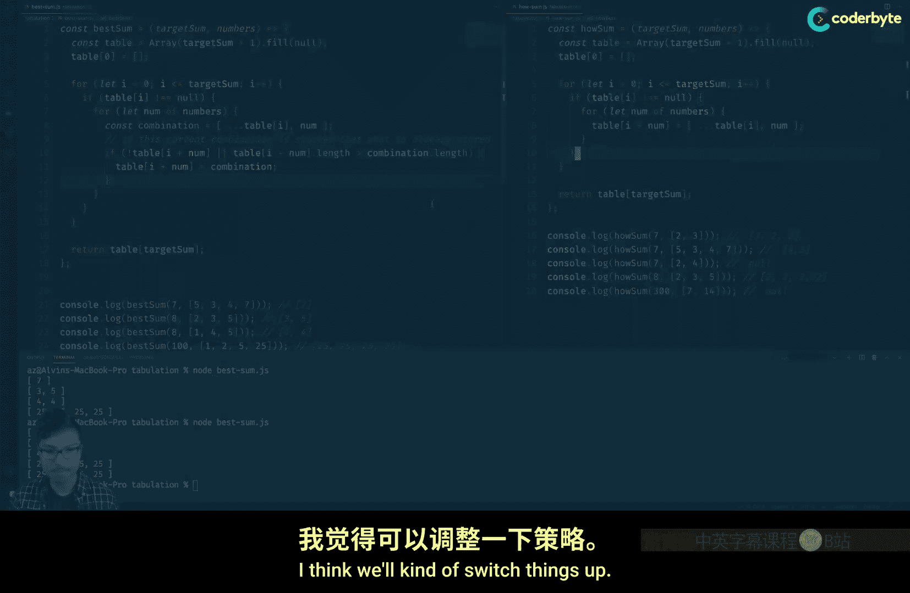

Let's switch gears a little bit and revisit those string problems with tabulation。

 Let's begin with that can construct problem。 So here we're going to take in a target string。

 as well as an array of words in a word bank。And this version of the problem。

 what I want to do is your' 20 Booleion right， Sure false indicating whether or not I can make the target by concatenating any number of elements from the word bank array。

And I can reuse elements in the word bank as many times as I want。So we've seen this problem before。

 but just to refresh， let's take a look at an example， so let's say my target was ABC， DEF。

 and I gave you this array of some different substrs。In this particular scenario。

 it is possible to create ABC DEF using members of the array， so the answer here is true。

 and one way you can actually create your target string is by just doing ABC plus DEF， right？

All right， let's start to apply our tabulation to this one。

So I'm going to create a table and you probably already recognize that I want to base the size of this table off of the target string right because that's really where I have subprom。

 I'm going to be decreasing the size of my target or in other words。

 building up to my original target over time。And so I know that I'm going to make it about the target string and not the array of words because I'm never going to remove a word out of the word bank。

 so I'm going to start with this table。😊，And here the sizing is is kind of particular。

Because we need a way to have this table represent information of a string right。

 whereas before with our number problems， it's very straightforward to just use the index as the actual number So we're going have to use a little clever of an encoding here。

And so what you'll notice is here I created an array of size7 right table dot length is 7 right now。

And in general， you'll want to size your table by doing target dot length plus one。

 so we still have that sort of off by one scenario that's kind of a very characteristic of these tabulation problems。

And so what will this table represent， Well， if I just think of the characters of my original a target string。

 I know they have corresponding indices sort of like this。

And you're probably wondering then what's the point of having that extra spot at the very end of the array。

 right， what would I need to store at index 6 if it has no corresponding character？

And the reasoning is we need a way to actually represent information about the empty string。

 And so here's the pattern we're going to use。 If I look at index 0 of this table。

 then I'm actually making a statement about the empty string。

 So pretend that if you look at a spot of this table。 depending on what that index is。

 you're considering the substr that starts at index 0 and goes up to but not including your current position。

 So we'll see how the scales or for the rest of the indices here。

 So imagine that now is that index 1。 I'm looking at index1。

 then you're really just looking at the a string。If you're at index 2， then you're looking at A B。

 if you're at index 3， then you're looking at ABC， if you're at index 4。

 then you're going a through D。 if you're at index 5， you're looking at a through E。

 And so the really key insight here is if I'm looking at index 5 of my table。

 that means I'm making some logical statement about the substr starting from index 0 going up to but not including index 5 So if I wanted to make a statement about the entire target string then I should actually look at index 6 because imagine you start your substr at index0 always。

 and you go up to but not including your current index。And again。

 the whole reason for this is I need a way to actually make a statement about the empty string。

And so speaking of the empty string， let's go ahead and talk about our seed values。

 We know that a really core know pattern in this can construct problem is to use the fact that， hey。

 if your target string was empty， no matter what array of words you were given in your word bank。

 that is always possible， so it's always true。And so that means at index0 of my table。

 I can go ahead and seed a Boolean value， How do I know what type to even store as the elements of my table。

 well if the problem is asking me to return a Boolean。

 then it's probably a good bet to actually just begin with some Boolean data in your table。

So if index zero is going to start as true， I'm going to initialize the rest to be false。

 So I'm going to consider all of these other， the substrs or prefixes as not possible until I prove them otherwise。

Alright， so let's begin our general algorithm， So we'll begin like we always do by just iterating from left to right through our table and just as we have some notation。

 I make it easier to kind of translate the information and the table to the statement it makes about our target string。

 I'm going to have the characters up top and I'm going to light them up based on the substrs that we're really considering here。

😊，So if I begin at index 0， like we said before， that means I'm making a statement about the empty string。

 right， I see a true inside of this position， which entails that the empty string can be constructed using the word bank。

Cool， at this point， I have to figure out how I can look ahead to my further values in the table。

 And I know that I can do that based on the choice of words in the word bank。

 So let's look at one of our words like A B。 So something great about this option of A B is it actually is something that begins from my current position。

 right， In other words， if you look at my current position in yellow。

 The characters below it start with A and falls with B。

 So taking an A B right now would be a totally legal move。 right， Those characters align。

 So so what I'll do is I'll go ahead and look two characters ahead。😊。

If I look two characters ahead in my table， that just means look two indices ahead。

 So now I know that this position of the table is actually reachable by just taking A B。

 So I put a true here。 And now at this point， I would do the same logic for the other words that have their characters aligned。

 In other words， ABC is also a sum matching word。 So I'll go ahead and make that a true。

And ABCD would be the only other one that actually aligneds its characters。

 so I'll make that one true。And again， how do I know to actually put this information in the table。

 It's really just the length of the word， right， My current position right now is at index 0。

 and I'm looking at a word that is four characters long。

 So that means I just look four characters ahead to store my Boolean。Cool， at this point。

 I'm actually done looking at all the words for this current position。

 so now I could move my current ahead one。So now I'm at this position。

 And so what you'll notice is in this current position at index 1， we have the value of F。

 which means that it's false， right， It is not possible to actually generate in a right。

 there's no way you can ever just give me back in a because all of your substrs in the word bank or too long。

 right So I don't actually need to do any of my heavy logic from this position。 However。

 on the next iteration when I have something that's true。 then I need to do my heavy logic。

 And if I do a quick spot check， I have a true stored in this position。

 If I'm looking at the value stored at index2， that means I'm making some statement about ind C 0 up to but not including two。

 So really just the substring A B。 And I know that if it's true， that means it's possible。

 And looking at the elements of the array， it's definitely possible right。

 you just took a A B to even get to this position。But I need to look ahead because I'm going to look at any words of the word bank that match starting from my current position。

 Really， the only option here is Cd right So if you look at my glowing characters right now。

 that means I can take this Cd。And so what I'll do is I'll look two characters ahead and place a value at that position。

 That's true， but the value stored at this position of the table is already true。

 so nothing really changes here， and there are no other words of the word bang that actually begin with a C。

 so I'm actually done with this pass。So now I move my current again。

And I look for any matching words that begin with like a D and potentially other characters after that。

 Really the only one here that works out is DF。 And so looking at my glowing characters。

 Now I'm basically considering this chunk right， ABC followed by D EF。

 so I'm going to look three positions ahead because the word I'm considering right now is three characters。

 right， DF is just three characters。 And if I do that， I'd be looking at this position。

 and I'd be making this one a true now， basically saying that it is possible to construct ABC， D EF。

😊，Cool， and at this point， I would do the same thing for the rest of the table。

 we know that nothing else is really going to change within this table。

And so by the end of the algorithm we have a true stored at index 6。

 which means that our entire string is possible to be constructed and so if we do a quick sanity check。

 if I look at the table at index 6， that means I'm making some statement about the substring that starts at0 and goes up to but not including index 6。

 which is really B the entire A through F。And I know that it's true。

 So that substr is possible to be generated， right， which was our final answer。 Far like elsewhere。

 like maybe at index 5， theres a false here。Which means that I'm making some statement about indices 0 through 4。

 So ABC D E， and since there's a false at this position。

 that means that it's not possible to generate this string and looking at just the elements of the word bank。

 it's definitely not possible to ever get ABC D E。Coolso the data within En tableable does look consistent。

With that， let's actually talk about the complexity。

 So when you know that M is going to be our target string。

 whereas n is going to be the number of words in the word bank。

And so if we just consider the time complexity right now。

 we know that we're at least iterating through every element of our table and our table was roughly size M right however。

 once we were at some current position of the table。

 we had to look ahead based on all of the words in the word bank。😊。

And so that would be an in operation for every iteration of M。And even still。

 as I was considering the words coming from my current position。

 I had to make sure that their characters aligned right I can't just take arbitrary words from the word bank。

 I have to choose the ones that have their characters matching right now。

And I know that the maximum length of any word or the maximum length of a match I would have to do would basically just be in terms of M。

 So I' give me an additional m term。So overall， I'm looking at m squared n for the time complexity of this one。

And besides that， we already know that the space complexity comes from the table。

 which is just a array of Boolean， so just M space overall。

And so from a bird's eye view it looks like this strategy would be an efficient one， right。

 we have a polynomial time complexity， but more importantly a non exponential complexity。

 so let's code this one up now。

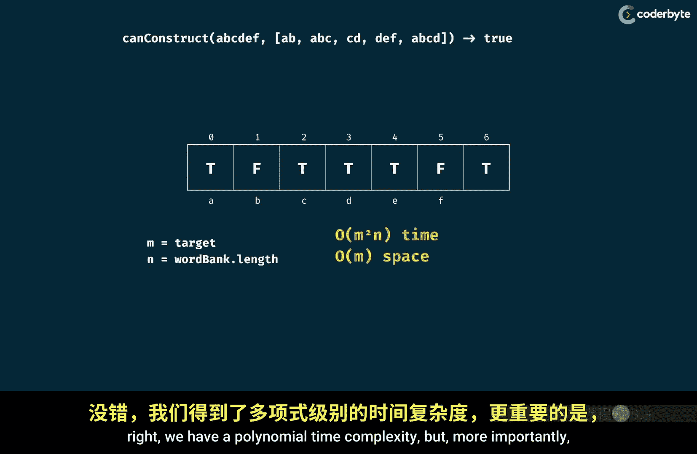

Al right， let's code up this can construct problem。 So we'll start by creating our table。

And so we'll say create a new array of size target dot length plus one。

 just like we spoke about in our drawing。Then from there I need to give some initial values to my table。

 so I'm going to go ahead and fill this one up with all falses。

 so we're going to assume that every prefix of our target cannot be constructed until we prove it otherwise。

 but then I need to actually also initialize table index 0 to be true。

 symbolizing that the empty string can always be generated right。Then from there。

 I need to iterate through every index of my table。

 so I'll say let I equals 0 and just go up to the entire table and here just be safe。

 I'll say I is less than or equal to target dot length。Nice， and as we iterate。

 we actually need to check our current positions value。 recall that in our strategy。

 we said we only need to do like the heavy logic。 if our current position is reach。

 So our current position should be true。 So I'm going to go ahead and check。 hey， if my。

Table at index I is true。Then I'll do some additional logic If I enter this if statement。

 then I need to consider any further choice of words I can use to progress to other spots in the array right so over here in this if statement。

 I want to iterate through every word of the word bank right So I'll say four， let word of word bank。

Nice。And so what I want to do as I iterate through all my possible words is。

I need to make sure that these words I iterate through actually match their characters to my current spot that I'm at。

 In other words， if I am at my very first index of a over here。

Then when I iterate through all the option of words。

 I need to make sure that I only use valid words that match like A B or ABC or ABC D， right。

 It is no point of me trying to use DEF right now， I need to actually kind of narrow down my words based on whether or not they match characters。

 right。So to do that， I can check， hey， if。And what I want to express is， you know。

 if the word matches the characters starting at position I。Po I。Cool。

 so how can I translate that into some code。 Well， checking if a string matches to something straightforward It just about using equality。

 right， Then I have to figure out how can I look at the correct， you know。

 subturing of characters within my original target right， And it's pretty straightforward。

 All I need to do is say target dot slice。Now I'm going to slice starting at index I。

And how far do I want to go。 Well， I basically want to go like the length of my word。

 So the move here is say go from I up to I plus word dot length。

 And so let's kind of break down this logic。 So what it's trying to do is check if your word matches your characters starting at position I。

 So let's check an easy scenario。 let's say that my current position is 0。 right， So right now， I 0。

 That means I'm at this position in like this ABC， D， E F example。

Now let's say right now that my word is ABC。 So if I look at this slice。

 it's going to slice starting at index 0 up to and not including0 plus 3。

 right the length of my word is 3， 0 plus3 is just three。

 that would actually look at this run of ABC。Good， and let's say we were somewhere further in the string。

 Let's say we were actually at this D character over here。 And so if I'm at this D character。

 that means my value for I is going to be 3。 right， I go 0，1，2，3。

And the current word I'm considering， let's say， is this D EF。 The length of this word is 3。

 So this ending index is going to be 3 plus3， which is 6。

 And so I would actually slice starting at this character 3， going all the way through the n， right。

3，4，5， and I always exclude the ending index of 6 here。 So this logic is good， right。

 All it does is check if my current word matches the characters starting at index I cool。

 So if I enter this if statement， then I have a successful word。

 So I should actually set a true in that forward looking position。 So I can just set table。😊。

And when I look ahead， how far do I need to look， Well， you need to look exactly。This far ahead。

 right， I plus word not length。Imagine we were at index0 of our target string， if I take ABC。

 then I end up word dot link characters later or three characters later in this example， right？

So I'm saying table of i plus word dot length， that should be set to true。Cool。

 notice how similar this is to our previous number， like our target some problems。

 except now we have to adapt this for string data。 So now I jump ahead based on the length of the word I'm choosing。

So this code is looking pretty good。 Let's go ahead and do our final return value。

 so I want to return the table at target dot length。Basically。

 if I am at the last position or at target length， a position of my table。

 that means I have the information for the entire target rate sorting at index0 all the way through the end of the target。

So here have some examples， let's give this a run。So I get true false， true false， nice。

 and there we have a nice working solution。So take a moment to let this code sink in。Really。

 the most tedious logic here is probably this particular slice。

So really try to make sure you kind of understand how this comment is implemented using this code。

 If you remember our previous recursive meization strategy for this problem。

 we needed to actually have logic to make sure our prefixes match。

 this is sort of the analog for that right。So we already spoke about the tank complexity for this one。

 but it's already in plain sight， right， we have M iterations here， we have n iterations here。

 and then the additional work we do is this slice， right I'm slicing from my target， which is also M。

 So overall I have M times n times M or M squared n and of course。

 the table just takes up definitely M space。Cool， so with that。

 let's head back into the drawing board。

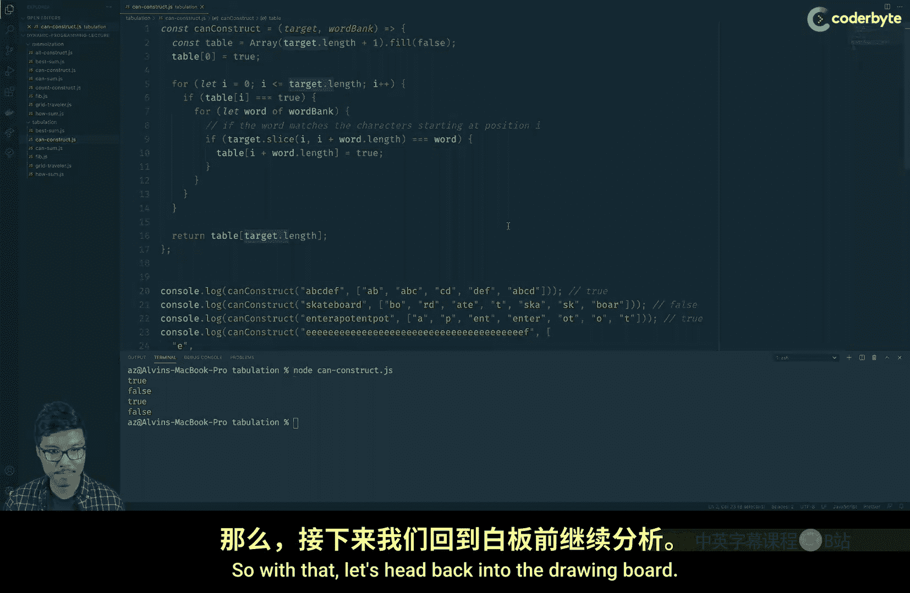

Alright， now let's revisit the count construct problem。

 so we're looking to take in a target string as well as an array of words in a word bank and this time we want to return a number。

 right we want to turn the number of ways that the target can be created by concatenating elements of that word bank。

We can reuse elements of the word bank as many times as we want。

So let's take a look at an example of this， So let's say I had this input。

 so I have the target of purple and I have an array with some substrings。

 The return value here should be  two because there are exactly two ways to create purple。

 you can do purplep plus L or you can do P plus U R plus P plus L and those are two distinct ways。

So notice in this problem， we really just want to return the number， so I'll just keep that in mind。

So let's follow that classic tabulation recipe。 we'll initialize our table with roughly the size of the input that changes。

 which is really going to be the target string， right we want to actually use overlapping subpro on the target string。

And like we always say， we're going to have a little off by one scenarioarrow here。

 although the number of characters in my purple string is6。

 I want to initialize a table of length 7 in general。

 you want to make sure your table has target dot length plus one a number of elements inside that way I have a way to represent the empty string just like our last tabulation。

And so we'll start by thinking about what are some proper seed values for this problem？

I know that when I have an empty string， empty target strings my input。

 no matter what array I'm given， you can always generate the empty string by taking no elements of the word bank。

 And so the answer for the target string should be one right there's one way to make the target string and that is to concatenate nothing together。

 So I'm going to store the value of one at index0 of my table。

 Now I have to decide how to initialize the other values in my table。 Well。

 I know that it should be number data， It's really important that you try your best to make your table contain a consistent data type。

 If I remember my similar counting problems like Fibonacci or even the grid traveler the move here is to actually start those other spots in the array at0。

 basically saying， you know at the start， I have zero ways to generate these different prefixes of purple。

 And then as I actually find distinct ways， I'll go ahead and increment those spots in the table。😊。

But we'll get to that， and so we'll iterate through our table from left to right， of course。

 beginning at index0 of the table。And as we do this。

 I'll also up top show the characters that we're considering within our table。 Remember。

 the really important pattern here is when I'm at some position of my table that means I'm encoding some information about the substring that starts index 0 up to but not including my current index right So if I have some information stored at index0。

 that information is about the empty string from my current position。

 now I need to consider any words of the word bank that I can take right now So give me another spot within the table。

 In other words， since I'm at index 0， I need words that start with P。

 So let's say we looked at this first word of perp。And so if I looked at that word and I took it。

 that would bring me a somewhere else within the table， I have to look forward like we usually do。

So that'll end up at this position index 4 again， notice that we have the kind of off by one scenario here。

 so although I'm going to write information into index4。

 that information is about the substr that spans from zero up through index 3 right and what I need to do now is take my current value in yellow and actually add that into my future position。

So I just add one into the zero and now index4 contains a one right。

 basically saying that so far we found a one way to construct the string perp。

And then from there I look at any other words of the word bank that match， right。

 so I'll just look at the next word of P again， just moving left to right through our word bank right now。

 I'm still at my current position。 And what I do if I use this P is I only look one character ahead right because P dot length is only one。

And what I do in this feature position is of course。

 just take my current value in yellow and I add it into this position， so0 plus1 is just a one。

There is one more word I can use right now from my current position， that's purple without the E。

And if I look at that corresponding position， that'll bring me all the way over here。

 and again I add the one into that position。Nice， I think that ends our very first pass。

 and now we move our current position to the right。So now my current is at index 1。

 So now I need to consider words of the word bank that begin with a U and kind of match characters throughout。

 The only option here is really just you are in the word bank。 If I took a U R。

 that would bring me two characters ahead。 right， So bring me over here。 What I should do。

 like always， is just take my current value and add it into that position。

 Now I have a one over here。There are actually no other words of the word bank that match from my current location。

 so I can just move ahead to the next spot in the table。If we're at index2。

 it looks like we need something that starts with an R and there's actually no words of the word bank that we can use from this position。

 And what we also notice is there's also a0 at this R position。

 so this wouldn't really do anything in our table anyway。

 so we can progress just in next spot in the table。

Here's where things start to get interesting right So right now my current is at index3。

 so I need to grab words from the word bank that start with P and potentially have an L and an E。

 So what I can do here is just take this loanne P， which would bring me one character ahead。

If I look one character ahead， what I do now is I take my current value right circled in yellow and I add it into my look ahead value。

 so I increment that to two now。Nice。And then from there I need to continue my logic by just moving rightward in my table。

 I shift my current point of view。At this point， what I do is I again look at any words that start with an Ellie。

And there's really only one that matches perfectly。

 I look two characters head because the length of L is 2。

 and what I do is I take my current value in yellow and add it into that position right my logic throughout this entire algorithm is very consistent。

And there I have a two in the last spot。You could probably already foresee that we have our final answer。

 but if we continue the algorithm as normal， or really we've noticed that if we move to the next position。

 there's no word of the word bank that starts with E so I don't do anything here and once we hit the very end。

 we're actually done with our algorithm。😊，And we see that， hey。

 we have a two in the last spot of our table， which is consistent with our expected answer。

Something I think is really important to do is not only recognize that our final answer is in the last position of the table。

 but really any element of this table should make some logical statement about our target string right So let's say I look at index 4 over here I see that there is a two in that spot in the array。

 So what is that really saying well if I am looking at the value stored at index 4。

 that means I'm considering the substr that starts at0 and goes up to but not including 4。

 So that really means I'm looking at perp right。😊，And if there is a two inside of the spot in the array。

 that means that there are apparently two ways to create PEp。

 and if I do a quick check in my word bank， that's exactly true， right。

 you can just take the straight up perp because that's actually a literal word of your word bank or you can do P plus U R plus P。

Cool， that's some consistent information。And then from there。

 if I actually consider what I can do from that position at index 4， well you could have taken an LE。

 that's basically what we did when we traced through the algorithm。If you take an L。

 then what are you really doing， why is that value in the index6 also two Well for one。

 L has a length of two， so that's why I'm looking just two spaces ahead in my table and if I think about what like a logical operation I'm doing。

If I were to take an L E and add it to all of the ways that I have in blue right now。

 then I would end up with all of the ways to generate purple right in my last spot。

 literally just taking。The Eley as an additional move， right？Pretty elegant logic。

Let's talk about the time complexity for this though。 So we know that， hey。

 our M is going to be the target and n is going to be the number of words in the word bank。

 This is really going to be about to the same complexity as our last rendition。

 that you can't construct。 So we're gonna to have M squared times n time right We definitely have M time for just iterate through every spot of the array And we also have an initial n because we have to actually look forward for every element of the word bank。

 And so where does that final m come from like we've been saying it comes from actually performing the match have to check of for matching characters。

😊，In a similar way， the space complexity is just going to be M。

 really just based off of the size of the table， we're only ever storing just some numbers within this table。

 so our space just stays at linear o of M space。All right， I'm feeling good about this plan。

 time to code it up。

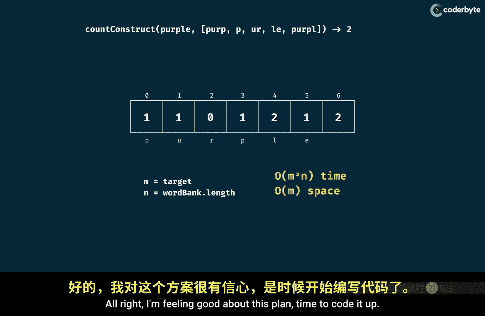

Alright， let's code this one out。 I'll start by creating my table。

It's going to begin as an array with roughly target length size， really target length plus one。

 that way， the index aligns， right， And I'm going to fill this entire table with zeros for now because I know in the long。

 I'm going to add into it。 So 0 is a great starting value。 That being said。

 I have a really important seed value。 I need to make sure that my table at index 0。

 actually starts as one because there is one way to make the empty string， right， And then from here。

 I can start my core algorithm by just iterating through every position of the table。

 So set I equal to 0， go up to and including target dot length。And hit every index， right？

And so what I'll do is iterate through every word of the word bank。 So well that's word of。B bank。

And as I iterate through every word， I need to check if the word matches my current location or if it has aligning characters。

 so you've seen this pattern before， I'll check if target that slice。

 I'm going to slice some characters out of my target。Starting index I。

 right because I is my current position。 I need to look at the next couple of characters based on the length of my word。

 I'm going to slice I to I plus word not length。So my current position is I。

 this will give me the next word dot length number of characters starting at position I。

 So I'll check if that little segment is equal to the word I'm considering right now。

And if it is equal， then I have a word that I can actually take and I can modify some further position of the table。

In particular， what I should do is need to modify my table at index I plus word No length。

 I'm looking ahead。 Remember that our current position is I。

 So I'm looking ahead in the table based on my current words's length。

 What I want to do is actually increase that by some value。 I want to increase it by。

The number stored in my current position。 That's what we did at every point of the algorithm。Nice。

 a common mistake that I see suits make is usually they have a tendency to just increment by one here。

 right that's not the move， what you want to do is increment by exactly the number that's in your current position。

 right。And at this point， I think all we need to do is just return our final answer。

 which like we always know is basically table at target dot length。Cool。

 so I have some examples below。With their expected results， let's give this a shot。 count construct。

 So I get 2，1，0，4 and 0。 notice that we have a fairly large example which should return 0。

 You can't possibly generate this final F here because your word bank only contains a bunch of eases。

 and it ran fairly quick。So this solution is looking pretty good。

Notice how small of a variation it is from our last problem。

 hopefully you're really feeling the progression， so let's go on quickly just take a look at that that was our can construct problem。

So let me split these guys。Very， very a trivial difference， right。

 instead of assigning a true value now I actually just increment because I have numbers within my table。

That was short and sweet。 Let's head back into the drawing board。

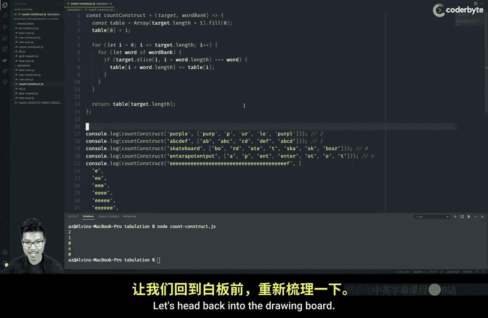

Let's do one more problem together。 Let's revisit that all construct problem。

 So we're still taking in our target string as well as an array of words in a word bank。

 but this time you want to return all of the ways that you could construct the target by concatenating elements of the word bank。

 So here you need to return a 2D array That means a single element of the array represents one combination that makes the target。

 and like usual， we can reuse elements of the word bank as many times as we see fit。

So if you take a look at an example， let's say I gave you the target of ABC DF。

 and I gave you this array of words。You actually have many ways to create the target string。

 there are four ways over here。So each subarray represents one combination where if you concatenate it together。

 you get the target， and so notice that I want to return every single combination as an element of the outer array over here so if there are many ways to create something。

 then I want to return a 2D array。That being said， there are a few examples that we should keep really in mind having to do with our seed values that we kind of foresee right So let's say I gave you this example where your target is the empty string and I gave you just some words in the word bank。

 The point is since your target string is empty， your result should really be a 2D empty array。

So recall that the outer array here represents like the collection of a multiple combinations。

 and here there's only one combination that makes the empty string， right。

 so the inner array represents like that empty combination when we take no words of the word bank。

And this is a reasonable thing to do because let's say I gave you this example。

 if your target was birds and I gave you an array of cat and dog。

 then the result there should be just a one dimensional empty array， right。

 The array over here represents the collection of combinations and there are no elements here right There are no combinations that ever yield birds。

 So we'll keep those sort of seed value based case scenarios in mind。

So let's trace through this example of ABC， DEF。I'll start by initializing our table。

 we're going to need a lot of room in this one。And so we know that the size of this table is going to be based on the target string。

 right， just like we usually do。And then we have to figure out what our seed values are。

 we kind of just spoke about them。 We know that if I have the empty string。

 then I need to have a 2D empty array。And so we'll initialize that in our table。

I know we're going to need a lot of room， so I'm going to spread out these outer brackets。Now。

 for all of the other elements of our table， we want to make them just one dimensional empty arrays。

And here's the reason why right for these further values in the table。

 I have to actually check for ways to generate them。 So for now there are no ways that I've found。

 right， That's why I just have an array with zero combinations inside except for index 0 index 0 has one combination inside that happens to be the empty combination。

😊，Cool， so let's start with our general algorithm。 A lot of this logic will feel very similar to our last few problems。

 Now we're just adjusting it of to generate these combinations right So we know that we're going to try to visualize how we look at our string in terms of some prefixes。

 right， I know that if I'm highlighting some spot in my table。

 then that grabs the prefix starting at index 0 all the way up to not including my current index of the table and I'll light up those characters at the top over here。

😊，So what I need to do now is since I'm currently at index0 of my table。

 I consider words of my word bank that have matching characters from this position so I can look at this AB first。

And if I took this A B move， then I should look two characters ahead。

 right because A B has a length of two。 So that brings me to this position in light blue。

 And what I should do is take all of the combinations in my current location in yellow and actually copy them over into this future position。

😊，But when I do that， I also need to be sure to include in those combinations the move of the word I just took right。

 so that would just be adding an A B inside。So again， kind of repeating that step。

 I copy over the contents of my current position in yellow。

 but then I have to make sure I add my word that I'm consuming right now into each of those combinations I just added。

Cool， and now we would actually keep our current position here because there are still some other words of the word bank that have matching characters。

 right， I can take an ABC from this position and something very similar happens， right。

 I copy over my current array。😊，And then I go ahead and add ABC to it。

This happens one more time for ABCD。Awesome， at this point。

 I've considered all of the words that match from this current position so I can move forward a little bit。

At this point， though， I need something that starts with a B。

 because my current position has a B on it。And I actually don't find any words of the word bank that kind of match from this position。

 So I actually can move my current once more。When I'm at this position。

 I have to consider words of the word bank that have a C right， and there are a few I can use here。

 I can use C D right， And if I do that， I look two characters ahead or two indices ahead for my current position。

 So I'm looking at this index。So if I look at index4， I have a really interesting situation， right。

 I already have a sum combination stored inside of index 4。

 and that represents one way we could make ABCD， by just taking that loan word， ABCD。

But what I can also do is I should take all of the combinations from my current position and just add them into that index 4 right so I'm taking the AB from index 2。

 just adding it to index4， but then I also need to add to that new combination of the word I'm using right now。

 which was CD。Cool， and then from here， you've already noticed that， hey。

 there are so far two ways to create ABC D， you can just take that lone word， ABC D。

 or you can do A B plus CD。 So this logic is taking some nice shape here from my current position is actually one more word that matches is's really just a single character C。

So like I do， I look one character head or one index head in my table just next door。

 and I copy over the combinations from my current location in yellow。

But then I also append the word I'm consuming， which is just an additional C。

 right so so far I have two ways to make ABC。At this point， I can progress my current spot in table。

And I look for any matching words that start with a D right， so that would be the DEF over here。

D F has a length of three。 so I look three spots ahead in my table。

 and I need to add some information here。 I copy over my current combinations in yellow。

And then I have to append at the end of all of them， the DEF word that I'm using right now。

 so it looks like this。At this point， I can iterate my current position。

 So now I'm at index 4 as my current。 and I look at any words that start with an E。

 And there's actually just one over here just this E F。

 And so I look two characters ahead or two indices ahead from my current position。And again。

 this is a scenario where I need to append new combinations to this existing list So if I look at my current position at index 4 in yellow。

 I'm going to take all of those combinations and copy them over into my light blue position at index6。

And then from there， I also need to make sure that I append to them the word I'm using right now。

 which is an EF， so those two combinations also get an EF at the end of them。Nice， at this point。

 you see our final result at the last spot in the table。 If we continued the general algorithm。

 we would just move our current position to index 5。

 when there' is actually a no words that could start with an F over here。

 So nothing happens on this iteration。😊，And there we have our algorithm， right。

 That index 6 of the table contains all of those four ways we describe that we can use to create our original target string。

 Take a moment to look at this table and notice how every position of the table should make some logical statement about the target string。

I can see that if I chose some position， let's say index 3 that's giving me some information about the substring ABC。

 right that prefix of my original target。 what's saying is there are two ways to make ABC。

 you can just take ABC because that's actually a word of my word bank or you can do A B plus C right That's the only other way。

 that applies for all positions within my table。 If I look somewhere else like index 5。

 That means I'm writing some information about A through E。

 And if there is no combinations at this position， it means there's no way you can ever generate ABC D E。

 And if you take a quick glance at the words in the word bank that is correct。

 you can't possibly just generate ABC D E。So overall。

 the information in our table and our logic that we did was very consistent。

Before we hop into the code for this one， let's do the analysis。

So we know that m is going to be the length of word target string。

 and we'll define n to be the number of words in the word bank。

So like we described when we did the memorization and recursive solution for this problem。

 we really can't do better than a sort of brute force right because they're asking us to return literally every single way to generate our target string here So really the time complexity is going to be the shape of an exponential right so about n to the M again。

 it will have some extra like multiplication in terms of M in it。

 but overall we're looking at exponential time complexity and what's the reason behind that。

 Well we know there's going to be an exponential number of actual combinations that we need to return and I have to actually construct all of those combinations piece by piece and so I'm looking at at least exponential time and really once something gets exponential that's really the limiting factor right。

In a similar way， we can say that the space complexity for this is also going to be exponential again。

 roughly we know that we're going to have at least M space just from the straightforward sides of the table。

 but notice that every element of the table itself is going to be a 2D array。 So in a sense。

 we're really dealing with like a 3D table in this instance。😊。

And so we know that at any particular position of our table。

 we're going to have potentially an exponential number of things， right。

 if you consider the very last spot in our table， just the last spot that already has an exponential number of combinations inside of it。

 But then I would actually have that throughout my entire table。

 So it'd be really a little more than just n to the M。 but overall。

 I'll say it's roughly exponential complexity。 and you can't really do any better here。

 especially in terms of the time， I'm really asking you to just do this in a brute force way。

 and I think we'll actually be able to see that once we create the solution。 Let's hop into it。😊。

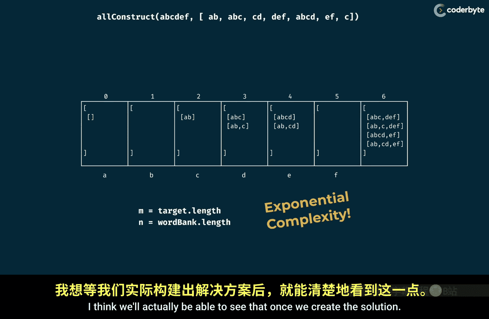

All right， for one last time， let's solve this all construct problem。

 So I'll begin by creating my table by now where tabulation masters。 So this is very， very formulaic。

Create my table with roughly target size， really target dot length plus one。

And here I need to initialize the elements of my table as arrays。

 so here I to be very particular and make sure I get a unique array in every spot of the array。

 so I'm going to do a fill we've seen the syntax before。

 and then I'll map over it that way I can generate a new array for every element here。

Cool let me to style this up。 And so this should give me an array as every element of my table noticeice that the elements right now are just one dimensional empty arrays。

 right， these arrays represent the collection of combinations at the start， they're empty。

 meaning that I have no combinations for most of these elements except for one， right。

 we already spoke about table at index 0 right that should be a 2 d empty array。And the reason was。

 still the outer array here represents the collection of combinations for the empty string。

 there is one combination that you can use to make it and that is the empty combination where you take no words of the word bank。

Cool， so now I can begin my general algorithm by just iterating through my target。

 We've done this many times before。 So I'm iterating through my table。

 And what I'll also do is look at all of the words， right。 So in every iteration。

 I'm going consider some words of the word bank。 So I'll say let word of word bank。😊，And like before。

 I still need to check that all right these words better have matching characters based on my current position。

 So I'll use that classical logic right've seen it many times by now。

 and I'll slice a segment out of my target string。 I'll say target do slice starting index I。

And grabbing the next word dot length number of characters。Cool。

 and'm going to compare that chunk to the current word that I'm iterating through。Nice。

 so using this statement， I'm sort of filtering down all of the words and only going do some logic on the words that match based on my current position。

Nice， and so we've seen， you know this nested for looppin if statement before， right。

 now we're adding our new logic within this if statement。Cool。

 all I need to do is really understand what types of data I'm dealing with here。All right。

 so let's say I just wrote this expression table at index I。

What that's going to do is just reference my current spot in the table and if I think about what data it's going to be。

 it's definitely going to be an array it's either going to be like an empty array。

 meaning there are no ways to make this current target or it could be a multi-dimensional array where every sub arrayray represents one way I can make the current target。

 So if this is all of the combinations that generate my current。

 then what I'll do is I'm going to map over them。Remember in our drawing what we did was kind of copy over all of our current combinations。

 but then make sure we also add our word that we're using right now to the end of each of those combinations。

 so that's what I'm doing right here。And to map over every sub。And what I'll do is。

I'll just copy over the elements of that sub using that spread syntax that we've seen before。

And then I'll also be sure to add on at the end my word。Nice。And then that will give me， let's say。

 our new combinations。So I'll just say that to a variable， maybe。

 So new combinations is going to be a 2D array， right where every sub representss some combination。

And I want to take these combinations and add them into that further spot inside of my table。

 so I know I need to kind of look ahead in my table so I can look at table at index I plus word dot link。

And I know that all positions of the table are going to be arrays right so this is going to be an array。

 There's going to be some data that might already exist at this position right so what I don't want to do is just assign new combinations because then that would overwrite any previous existing combinations that I already found for this position。

😊，Instead， I need to make sure that I just add these new combinations to that list right。

 So what I'll do here is I'll push to that array。And I'll push all of the elements of my new combinations right。

 so here I can spread this out when I spread it out that way。

 I don't add any additional nesting over here， right？So this is looking pretty good。

 I think let's go ahead and return the table at target dot length。

Here I have some examples down below。Let's give this a shot。Nice， and these answers look correct。

 right， noticeice that these last two examples should return empty arrays because they are impossible to generate。

Cool， let's hover over this code for a moment。Probably the most tedious logic here would be these two lines。

 right？Really try to understand how these two lines translate into the logic we did in our drawing。

 so let's break down these lines again right Line 11 is going to take all of the combinations in my current position in my drawing that was like my yellow box and it's going to add our current word to each of those combinations。

And then we're going to take each of those new arrays and add them to the list at our further position。

Being sure not to overwrite。we already spoke about the complexity of this one。

 it's definitely going to be exponential， probably a little more than exponential right if you imagine all the work we have to do using these maps and like spreading we have to actually construct our result array。

 which is going to contain an exponential number of things。😊。

So even when I look at this last example， let's say that I made it a little longer so let's say I actually pull up the size of that input。

It's going to be very， very slow might even crash， but let's just do it。

 So let's say I had a bunch of A's here。Just for fun。 So if we try this example。Yeah。

 it looks like our program still crashes， right， This is going to return a really。

 really a massive array， probably can't even fit it into memory over here， right。

 we still get like a stack size exceeded， even though this isn't even recursive right。

 just calling functions way too much over here。😊，So no matter what we do。

 we really expect this problem to sort of demand an exponential solution。

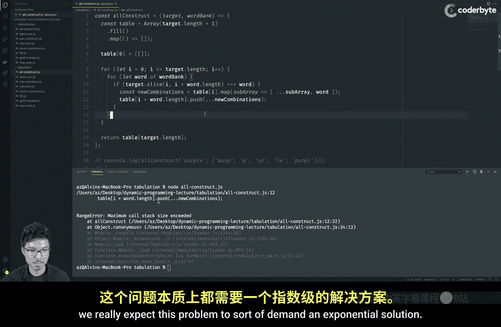

With that， let's head back into the drawing board where we can wrap up this course。

 All right programmers by now we solved many different dynamic programming problems together。

 and I want to leave us with some final advice。 So whenever you're starting to attack any dynamic programming problem。

 start by really taking a moment and noticing any overlapping subproble。

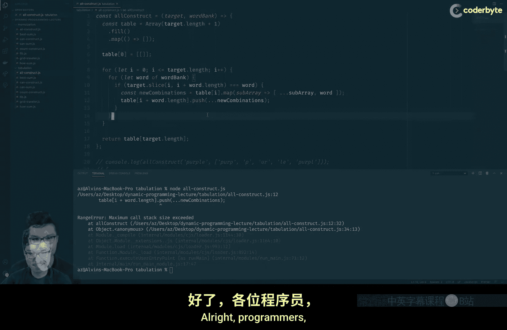

And then from there， really focus on like the input to the problem in particular， its type。

 and from there you should be able to recognize what is the trivial smallest input。

 So in our string problems， usually that means the empty string in our array problems。

 It's the empty array or in our number problems， it's usually a number like0 or one right I there some input where we don't really have to do any extra work to know the answer。

 the answer just sort of is what it is。Once you've recognized this trivial scenario or the base case really。

 then you't want to realize how you can relate this base case toward your larger inputs and then you have two options right you can either think recursively and use memmoorization or you can think more iteratively and build a table using our tabulation formula I think as you practice dynamic programming problems。

 I would actually always solve problems in two ways。

 one using memorization and one using tabulation then of course。

 from that point on it's okay if you have like a favorite strategy for me personally that's memorization but that being said it really helps to have options when you're in an interview。

And once you've made that decision on know which route you're going to take。

 definitely slow it down and draw a strategy first。

 this is I think of the most important thing about just data structures and algorithms in general。

 usually when we draw our pseudocode or draw our process on the whiteboard。

 we can recognize all of these edge scenarios and it's much harder to do when we just write like the code out of the gate。

And so I promise if you slow it down and take a moment to draw a visual。

 you're going to find your work a lot more productive。

 as well as more intuitive when you explain it to someone else。 And of course， through all of that。

 you're gonna to have a lot more fun dealing with these quite hard topics。

 All right programmers that's all I got for this course。

 Hopefully you had fun know learning this new topic。 I definitely had fun teaching it to all of you。

 So what you want to do now is head down to the links in description and head to codederbitte do co where you can actually practice this new topic。

 Thanks for watching and I'll see you in the next one。😊。

