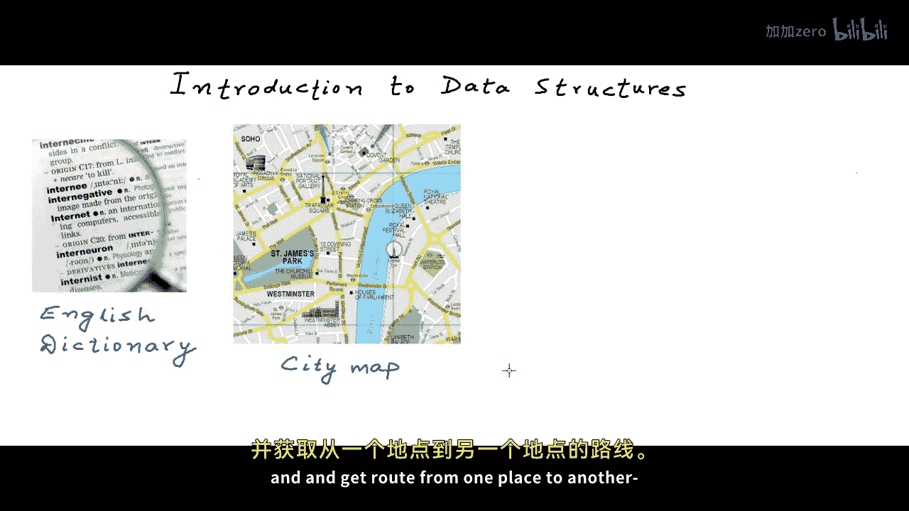
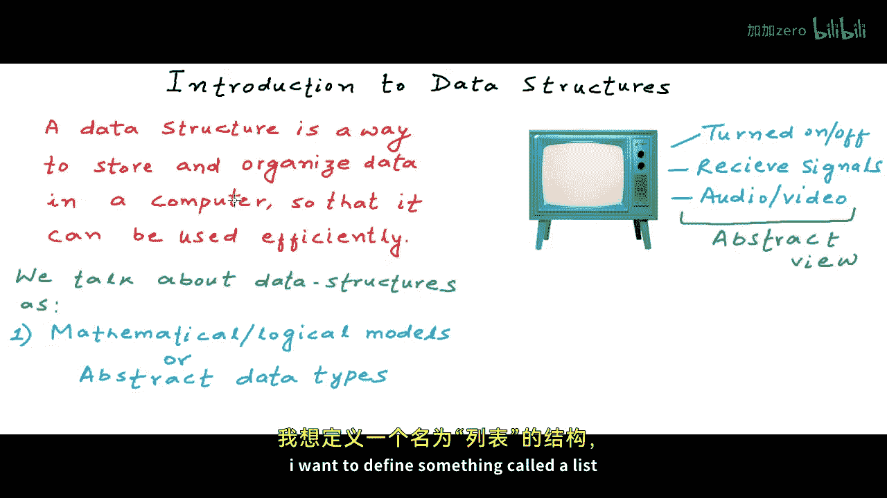
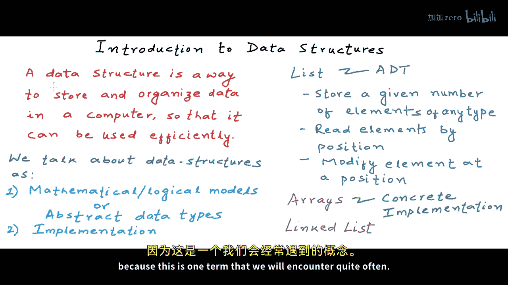
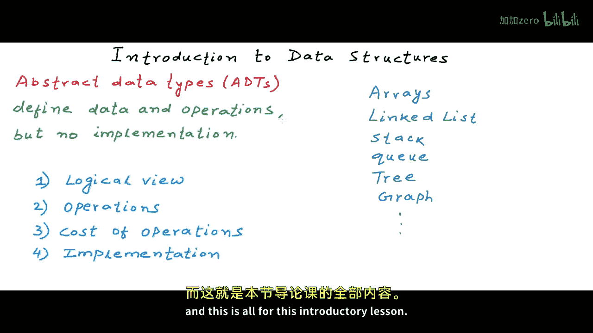

# mycodeschool【中英⚡数据结构｜Data Structures】 p01 p0 Introduction to data structures -BV1ckrLYREn2_p1-

In this lesson and in this series of lessons， we will。

Introduce you to the concept of data structures。 Data structure is the most fundamental and building block concept in computer science and good knowledge of data structures is a must to design and develop efficient software systems。

Okay， so let's get started。We deal with data all the time and how we store。

 organize and group our data together matters。Let's pick up some examples from our day to day life。

 where organizing data in a particular structure helps us。

 We are able to search a word quickly and efficiently in a language dictionary， because the。

Words in the dictionary are sorted。What if the words in the dictionary were not sorted。

 It would be impractical and impossible to search for a word among millions of words。

 So dictionary is organized as a sorted list of words。

Let's pick up another example。If we have something like a city map。

 the data like position of a landmark and road network connections。

 all this data is organized in the form of geometries。

 we show the map data in the form of these geometries on a two dimensional plane。

So map data needs to be structured like this so that we have scales and directions and we are effectively able to search for a landmark and get route from one place to another and Ill pick one more example for something like daily cache in and cash out statement of a business what we also call a cashbook in accounts it makes most sense to organize and store the data in the form of a tableular schema it is very easy to aggregate data and extract information if the data is organized in these columns in these tables so different kind of structures are needed to organize different kind of data now computers work with all kind of data computers work with text images。

 videos relational data， geospatial data and pretty much any kind of data that we have on this planet how we store organize and group data in computers matters because computers deal with really。

 really large data。

Even with the computational power of machines， if we do not use the right kind of structures。

 the right kind of logical structures， then our software systems will not be efficient。

Formal definition of a data structure would be that。A data structure is a way。

To store and organize data。In a computer so that the data can be used efficiently。

When we study data structures as ways to store and organize data， we study them in two ways。

 so I'll say that we talk about data structures as one。

 we talk about them as mathematical and logical models when we talk about them as mathematical and logical models we just look at an abstract view of them we just look at from a high level what all features and what all operations define that particular data structure example of abstract view from real world can be something like the abstract view of a device name television can be that it is an electrical device that can be turned on and off。

 it can receive signals for satellite programs and play the audio video of the program and as long as I have a device like this。

 I do not bother how circuits are embedded to create this device or which company makes this device So this is an abstract view So when we study data structures。

As mathematical or logical models， we just define their abstract view or in other words we have a term for this。

 we define them as abstract data types。An example of abstract data type can be。

 I want to define something called a list。

That should be able to store a group of elements of a particular data type。

 and we should be able to read the elements by their position in the list。

And we should be also able to modify element at a particular position in the list。

I would say store a given number of elements of any data type。 So we are justifying a model。 Now。

 we can implement this。In a programming language in a number of ways。 So this is definition of。

An abstract data type we also call abstract data and data type as ADT。

 And if you see all the high level languages already have a concrete implementation of such an ADT in the form of arrays。

 So arrays give us all these functionalities。 So arrays are data types which are concrete implementation。

 So the second way of talking about data structures is talking about their implementation。

So implementations would be some concrete types and not an abstract data type。

 We can implement the same ADT in multiple ways in the same language， for example。

 in C or C plus plus we can implement this list ADT as a data structure named linked list。

And if you have not heard about it， we will be talking about them a lot。

 We will be talking about linked list a lot in the coming lessons。Okay。

 so let's define an abstract data I formally because this is one term that we will encounter quite often。

Abstract data types are entities that are definitions of data and operation。

 but do not have implementations， so they do not have any implementation details。

We will be talking about a lot of data structures in this course。

 we will be talking about them as abstract data types and we will also be looking at how to implement them some of the data structures that we will talk about are are a linked list stack。

Q。3 graph and the list goes on。 There are many more to study。

So when we will study these data structures， we will study their logical view。

Well study what operations are available to us with these data structures。

We'll study the cost of these operations。Mostly in terms of time。

And then definitely we will study the implementation in a programming language。

So we will be studying all these data structures in the coming lessons。

And this is all for this introductory lesson。 Thanks for watching。

