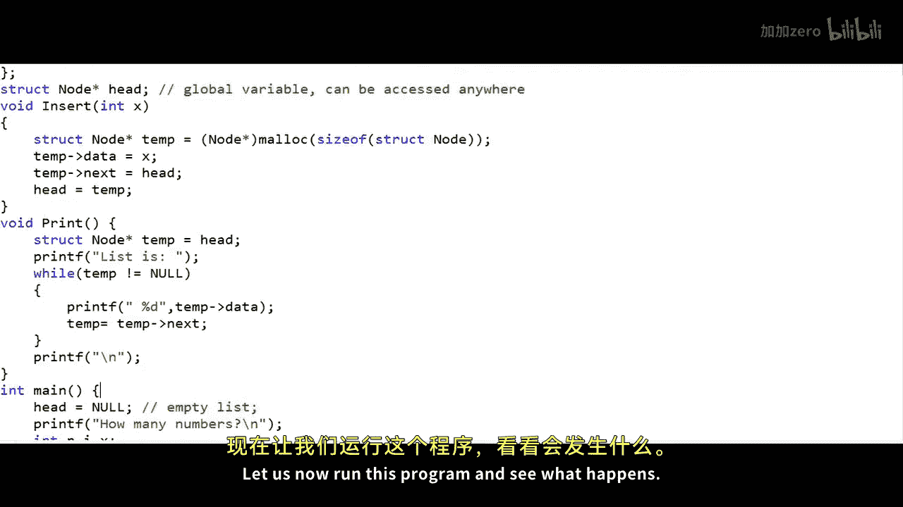
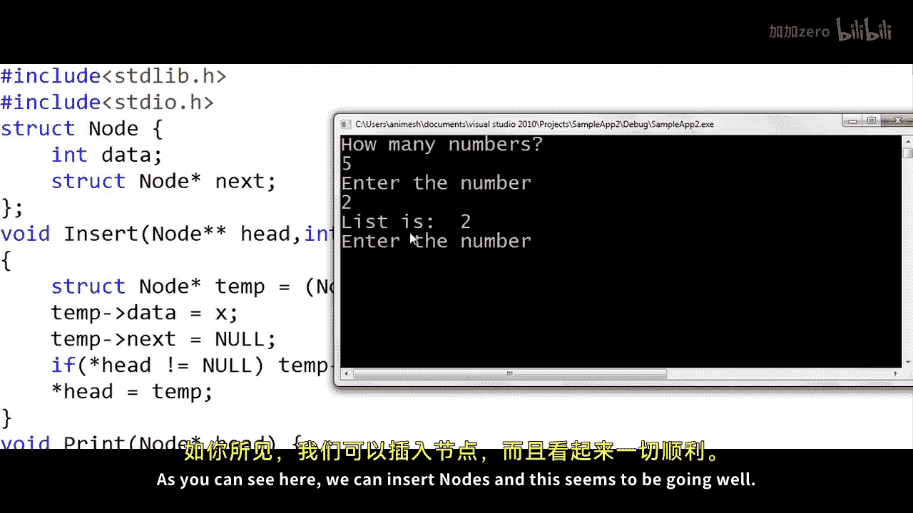
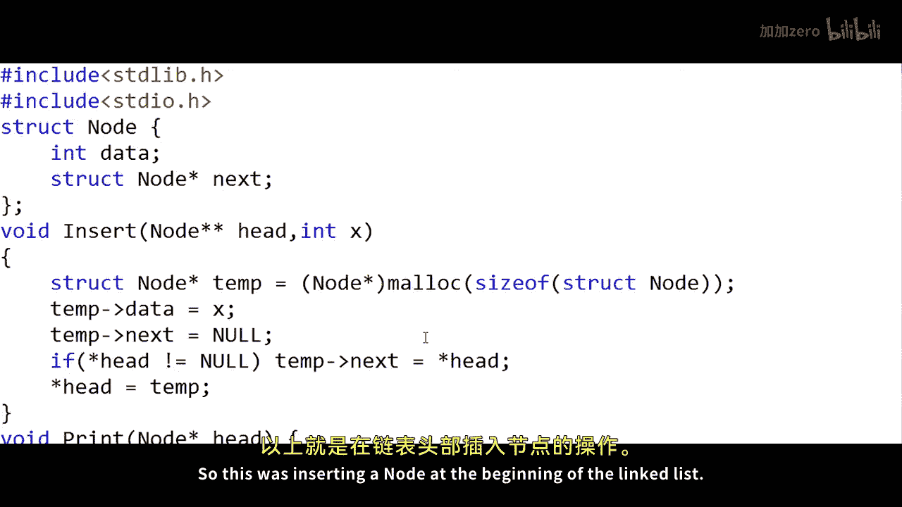

# mycodeschool【中英⚡数据结构｜Data Structures】 p06 p5 Linked List in C⧸C++ - Inserting a node at beginning -BV1ckrLYREn2_p6-

In our previous lesson we saw how we can map the logical view of a linked list into a C or C plus plus program。

 we saw how we can implement two basic operations， one traver cell of the linked list and another inserting a node at the end of the linked list in this lesson we will see a running code that will insert a node at the beginning of the linked list So let's get started。

I will write a C program here。 The first thing that we want to do in our program is that we want to define a node。

A node will be a structure in C。 It will have two fields one to store the data。

 let's say we want to create a linked list of integers， so our data type will be integer。

 if we wanted to create a linked list of characters， then our type would be character here。

So we will have another field that will be pointer to node that will store the address of the next node。

 we can name this variable link or some people some people also like to name this variable next because it sounds more intuitive this variable will store the address of the next node in the linked list。

And see， whenever we have to declare。Notode or pointer to node。

 we will have to writestruct node orstruct node star in C plus plus we will have to write only node star。

And that's one difference。Okay， so this is the definition of our node。Now to create a linked list。

 we will have to create a variable that will be pointer to node and that will store the address of the first node in the linked list。

 what we also call the head node， so I will create a pointer to node here struck node star we can name this variable whatever often for the sake of understanding we name this variable head。

Now， I have declared this variable as a global variable。

 I have not declared this variable inside any function， and I'll come back to why Im doing so。 Now。

 I'll write the main method。 This is the entry point to my program。

 The first thing that I want to do is I want to。Say head is equal to null。

 which will mean that this pointer variable points nowhere。 So right now the list is empty。

 so far what we have done here in our code is that we have created a global variable named head which is of type pointer to node and the value in this pointer variable is null So so far the list is empty。

 Now what I want to do in my program is that I want to ask the user to input some numbers。

 and I want to insert all these numbers into the linked list。

 So I'll print something like how many numbers let's say the user wants to input n numbers。

 So I'll collect this number in this variable N。 and then I'll define another variable I to run the loop and so I'm running a loop here if it was C plus plus I could declare this ntej variable right here inside the loop。

Now I'll write a print statement like this。And I'll define another variable X and each time I'll take this variable X as input from the user and now I will insert this particular number x。

 this particular inteser x into the linked list by making a call to the method insert and then each time we insert we will print all the nodes in the linked list the value of all the nodes in the linked list by calling a function named print there will be no argument to this function print Of course we need to implement these two functions insert and print let me first write down the definition of these two functions。

So let us implement these two functions insert and print。

 let us first implement the function insert that will insert a note at the beginning of the linked list。

Now in the insert function， what we need to do is we first need to create a node and see we can create a node using malloc function we have talked about this earlier。

 a malloc returns a pointer to the starting address of the memory block we are having to type cluster here because malloc returns a void pointer and we need a pointer to node a variable that is pointer to node。

 and then only if we de reference we de reference using an asterisk sign。

 then we will be able to access the fields of the node， so the data part will be X。

And we have an alternate syntax for this particular。Senttax， we could simply write something like。

Temp and this arrow， And it will mean the same thing。 And this is more common。

 with these two lines in the insert function。 all we are doing is we are creating a node。

 Let's say we get this node， and let's assume that the address that we get for this node is 0。 Now。

 there is a variable temp where we are storing the address。

 we can do one thing whenever we create a node。 We can set data to whatever we want to set。

 and we can set the link field initially to null。And if needed， we can modify the link field。

 So I'll write one more statement。 T dot next is equal to null。

 Remember temp is a pointer variable here， and we are dereferencing the pointer variable to modify the value at this particular node temp will also take some space in the memory。

 That's why I have shown this rectangular block for both the pointer variables head and temp and node has two parts。

 one for the pointer variables and one for the data。

 So this part the link part is null we can either write null here or we can write it like this。

 It's the same thing logically it means the same。Now。

 if we want to insert this node in the beginning of the list。

 there can be two scenarios one when the list is empty like in this case。

 So the only thing that we need to do is we need to point head to this particular node and of pointing to null so I will write a statement like head is equal to temp and the value in head now will be address 00 and that's what we mean when we say a pointer variable points to a particular node we store the address of that node。

 So this is our linked list after we insert the first node let us now see what we can do to insert a node at the beginning if the list is not empty like what we have right now once again we can create a node fill in the value X here that is past as argument initially we may set the link field as null and let's say this node gets addressed 115 in the memory and we have this variable temp through which we are referencing this particular memory block Now unlike the previous case if we just。

Seet head is equal to temp this is not good enough because we also need to build this link we need to set the next or the link of the newly created node to whatever the previous head was so what we can do is we can write something like if head is not equal to null or if the list is not empty first set temp dot next equal head so we first build this link the address here will be 100。

And then we say head equal temp， so we cut this link and point head to this newly created node。

 and this is our modified linked list after insertion of this second node at the beginning of the list。

Now， one final thing here， this particular line， the third line， temp dot next equal null。

 This is getting used only when the list is empty。 If you see when the list is empty head is already null。

 so we can avoid writing two statements。 we can simply write this one statement temp dot next equal head。

 and this will also cover the scenario when the list is empty。

 Now the only thing remaining in this program to get this running。

 is the implementation of this print function。 So let us implement this print function。

 what I will do here is I'll create a local variable， which is pointer to node named temp。

 and I need to writestruct node here。 I keep missing this in C you need to write it like this。

 and I want to set this as address of the head node。

 So this global variable has the address of the head node。 Now I want to traverse the linked list。

 So I will write a loop like this。While temp is not equal to null。

I'll keep going to the next node using this statement temp is equal to temp dot next。

And at each stage， I'll print the value in that node。As temp dot data。Now I'll write two more print。

One outside this while loop and one outside。After this while loop to print an end of line。 Now。

 why did we use a temporary variable， Because we do not want to modify head。

Because we will lose the reference of the first node。 So first。

 we collect the address in head in another temporary variable。

 and we are modifying the address in this temporary variable using temp is equal to temp dot next to traverse the list。

Let us now run this program and see what happens。

So this is asking how many numbers you want to insert in the list。

Let's say we want to insert five numbers。 Initially， the list is empty。

 Let's say the first number that we want to insert is 2。At each stage we are printing the list。

 so the list is now2， the first element and the last element is2。 we will insert another number。

 The list is now5 to5 is inserted at the beginning of the list。 again。

 we inserted 8 and8 is also inserted at the beginning of the list。Okay， let's insert number one。

 The list is now 1852。 and finally I insert it number 10， so the final list is 101852。

 This seems to be working。

Now， if we were writing this code in C plus plus we could have done a couple of things。

 we could have written a class and organized the code in an object oriented manner。

 we could also have used new operator in place of the malloc function now coming back to the fact that we have declared this head as global variable。

 What if this was not a global variable。 This was declared inside this main function as a local variable。

 So I'll remove this global declaration。Now， this head will not be accessible in other functions。

 so we need to pass。Address of the first node as argument to other functions to both these functions print and insert。

 So to this print method we will pass， let's say we name this argument as head。

 we can name this argument argument as head or a or temp or whatever。

If we name this argument as head， this head in print will be a local variable of print and will not be this head in main。

 these two heads will be different。 these two variables will be different when the main function calls print passing its head。

 then the value in this particular head in the main function is copied to this another head in the print function。

 So now in the print function we may not use this temp variable what we can do is。

We can use this variable head itself to traverse the list。And this should be good。

 We are not modifying this head here in the main。Similarly to the insert function。

 we will have to pass the address of the first node and this head again is just a copy。

 This is again a local variable。 So after we modify the linked list。

The head in main method should also be modified。 There are two ways to do it。 One。

 we can pass the pointer to node as return from this method。 So in the main method。

 insert function will take another argument head， and we will have to collect the return。

Into head again so that it is modified。 Now， this code will work fine。 oops。

 I forgot to write a return here， return head。

And we can run this program like before。 we can give all the values and see that the list is building up correctly。

There was another way of doing this Instead of asking this insert function to return the address of head。

 we could have passed this particular variable head by reference。

So we could have passed insert Amperserson head head is already a pointer to node。

 So in the insert function， we will have to receive pointer to pointer。

 node star star and to avoid confusion， let's name this variable something else。 This time。

 let's name this pointer to head。 So to get head we will have to write something like we will have to de reference this particular variable and write asterisk pointer to head everywhere。

And the return type will be void。Sometimes we want to name this variable as head。

 this local variable as head doesn't matter， but we will have to take care。Of using it properly。

Now， this code will also work， as you can see here， we can insert node。

 and this seems to be going well。 If you do not understand this concepts of scope。

 you can refer to the description of this video for additional resources。

 So this was inserting a note at the beginning of the linked list。 Thanks for watching。

