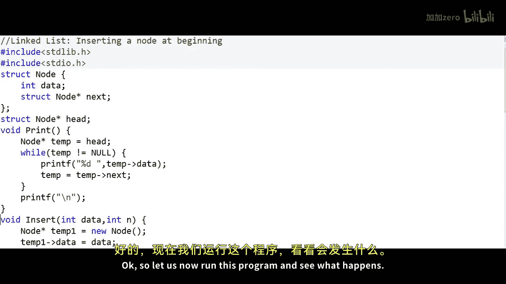
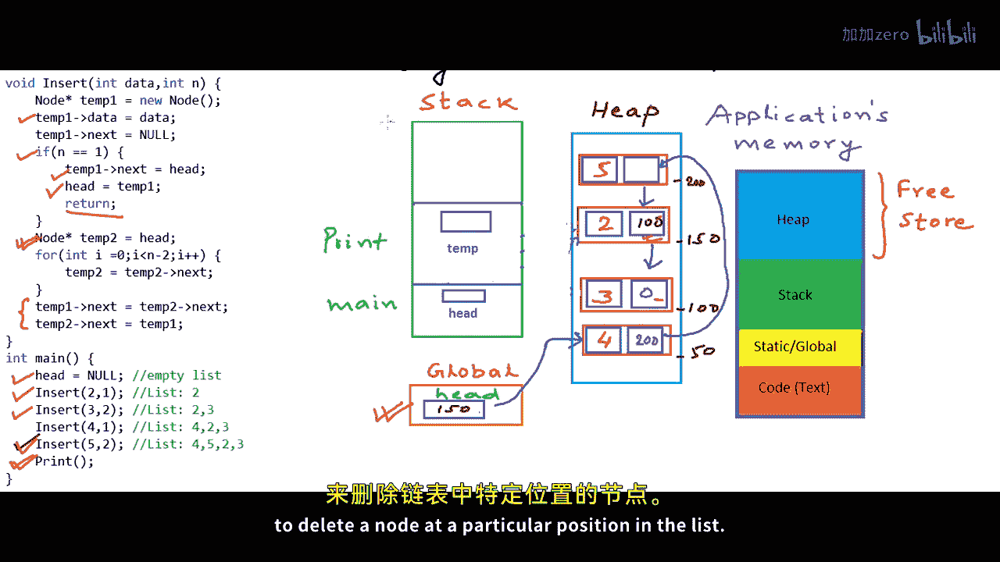

# mycodeschool【中英⚡数据结构｜Data Structures】 p07 p6 Linked List in C⧸C++ - Insert a node at nth position -BV1ckrLYREn2_p7-

In our previous lesson we had written code to insert a node at the beginning of the linked list now in this lesson we will write program to insert a node at any given position in the linked list so let me first explain the problem in a logical view let's say we have a linked list of integers here there are three nodes in this linked list let us say they are address as 20000 and 250 respectively in the memory and we have a variable head that is pointer to node that stores the address of the first node in the list now let us say we number these nodes we number these positions on a onebased index so this is the first node in the list and this is the second node and this is the third node and we want to write a function。

Insert， that will take。The data to be inserted in the list and the position at which we want to insert this particular data so we will be inserting a node at that particular position with this data。

 there will be a couple of scenarios， the list could be empty so this variable head will be null or this argument being passed to the insert function the position n could be an invalid position for example5 is an invalid position here for this linked list the maximum possible position at which we can insert a node in this list will be four if we want to insert at position1 we want to insert at the beginning and if we want to insert that position4 we want to insert at end so our insert function should gracefully handle all these scenarios let us assume for the sake of simplicity for the sake of simplifying our implementation that we always give a valid position we will always give a valid position so that we do not have to handle the error condition in case of invalid。

Position。The implementation logic for this function will be pretty straightforward。

 we will first create a node， let's say in this example we want to insert a node with value8 at third position in the list。

So I'll set the data here in the node， the data part is8 now to insert a node at the nith position we will first have to go to the n minus1ethth node in this case n is equal to three so we will go to the second node now the first thing that we will have to do is we will have to set the link field of this newly created node equal to the link field of this n minus1ethth node so we will have to build this link。

Let's say the address that we get for this newly created node is 150。Once we build this link。

 we can break this link and set the link of this newly created node as address of this。

 set the link of this n minus1 at node as address of this newly created node we may have special cases in our implementation。

Like the list may be empty or maybe we may want to insert a order at the beginning。

 let's say we will take care of special cases if any in our actual implementation。

 so now let's move on to implement this particular function in our program。In my C program。

 the first thing that I need to do is I want to define a node， so node will be a structure。

 we have seen this earlier。So node has these two fields。

 one data of type in teacher and another next of type pointer to node， now to create a linked list。

 the first thing that I need to create is a pointer to node that will always store the address of the first node or the head node in the linked list so I will create struck node star let's name this variable head。

And once again， I have created this variable as a global variable to understand linked list implementation。

 we need to understand what goes where， what variable sits in what section of the memory and what is the scope of these variables。

 what goes in the stack section of the memory and what goes in the heap section of the memory。

 So this time as we write this code we will see what goes where。In the main method。

 first Ill set this head as null to say that initially the list is empty。

So let us now see what has gone where so far in our program in what section of the memory the memory that is allocated to our program or application is typically divided into these four parts or these four sections we have talked about this in our lesson on dynamic memory allocation there is a link to our lesson on dynamic memory allocation in the description of this video I'll quickly talk about what these sections are one section of the application memory is used to store all the instructions that need to be executed Another section is allocated to store the global variables that live for the entire lifetime of the program of the application one section of the memory which is called stack is used to store all the information about function call executions to store all the local variables and these three sections that we talked about are fixed in size their sizes decided at compile time the last section that。

We call heap or free store is not fixed and we can request memory from the heap during runtime and that's what we do when we use malloc or new operator。

Now I have drawn these three sections of the memory stack。

 heap and the section to store the global variables in our program we have declared a global variable named head which is pointer to node so it will go and sit here and this variable is like anyone can access it initially value here is null。

Now， in my program， what I want to do is。I first want to define two functions insert。

 and this function should take two arguments， data and the position at which I want to insert a node and insert that particular node at that position。

 insert data at that position in the list。And another function print that will simply print all the numbers in the linked list。

Now in the main method I want to make a sequence of function calls first I want to insert number two。

 the list is empty right now so I can only insert at position1 so after this。

Insert list will be having this one number。this particular number two。

And let's say again I want to insert number 3 at position2 so this will be our list after after this insertion and I will make two more insertions and finally I'll print the list。

So this is my main method I could have also asked。User to input a number and position。

 but let's say we go this way this time。Now， let us first implement insert。

I'll move this print above。So the first thing that I want to do in this method is I want to create a node so I will make a call to mallO in C++ we can simply write a new node for this call to malloc and this looks a lot cleaner let's go C++ way this time now what I can do is I can first set the data field。

And set the link initially as null。I have named this variable temp1 because I want to use another temp variable。

In this function， I'll come to that in a while。We first need to handle one special case when we want to insert at the head。

 when we want to insert at the first position， so if n is equal to1。

 we simply want to set the link field of the newly created node as whatever the existing head is。

And then adjust this variable。To point to the new head， which will be this newly created node。

 and we will be done at this stage， so we will not execute any further and return from this function。

 If you can see， this will work even when the list is empty。

Because the head will be null in that case。 I'll show a simulation in the memory in a while。

 So hold on till then things will be pretty clear to you after that。Now， for all other cases。

 we will first need to go to the n minus1th node， as we had discussed in our logic initially。

 So what I'll do is I'll create another pointer to node， name this variable temp to。

And we will start at the head and then we will run a loop。And go to the n minus1th node。

Something like this。 We will run the loop n minus two times because right now we are。

Pointing to head， which is the first node。 So if we do this temp 2 equal temp 2 dot next and minus two times we will。

Be pointing temp 22 and -1 at node。 And now the first thing that we need to do is set the next or the link field。

Of newly created node as the link field of this n minus18th node。

 and then we can adjust the link of this n minus18th node to point to our newly created node。

And now I am writing this printprint here， after written and this printprint here。

 we have used a temporary variable， a temporary pointer to node initially to pointed it to head。

 and we have traversed the whole list。Okay so let us now run this program and see what happens we are getting this output which seems to be correct the list should be 4。

523 in this order now I have this code I'll run through this code and show you what's happening in the memory when the program starts execution initially the main method is invoked some part of the memory from the stack is allocated for execution of a function all the local variables and the state of execution of this function is saved in this particular section we also call this stack frame of a function。

Here in this main method， we have not declared any local variable。 We just set head to null。

 which we have already done here。 Now the next line is a call to function insert。

 so the machine will set the execution of this particular method main on hold and go on to execute this call to insert so。

Insert comes into this stack and insert has a couple of local local variables， it has two arguments。

 data and this variable n， this stack frame will be a little larger because we will have a couple of local variables and now we create this another local variable which is a pointer to node temp 1 and we use the new operator to create a memory block in the heap and this guy temp 1 initially stores the address of this memory block let's say this memory block is at address 150。

So this guy stores the address 150 when we request some memory to store something on the heap using new or malllo。

 we do not get a variable name and the only way to access it is through a pointer variable。

 So this pointer variable is the remote control here kind of So here when when we say temp1 dot data is equal to this much through this pointer which is our remote we are going and writing this value2 here and then we are saying temp dot next equal null So null is nothing but address 0 So we are writing address 0 here。

 So we have created a node and in our first call n is equal to1 so we will come to this condition。

 Now we want to set temp1 dot next equal head。Temp 1 dot next is this section。

 this second field and this is already equal to head head is null here and this is already null null is nothing but0。

 The only reason we set temp dot next equal head will work for empty cases is because head would be null and now we are saying head is equal to temp 1 so head guy now points to this because it stores address 150 like temp 1。

And in this first call to insert after this， we will return so the execution of insert will finish。

 and now the control returns to the main method。 we come to this line where we make another call to insert with different arguments This time we pass number 3 to be inserted at position2 Now once again。

 memory in the stack frame will be allocated for this particular call to insert stack frame allocation is corresponding to a particular call。

 So each time the function execution finishes all the local variables are gone from the memory Now once again in this call we create a new node we keep the address initially in this temporary variable temp 1 let's say we get this node at address 0。

 This time now n is not equal to1， we will move on to create another temporary variable temp2。

 Now we are not creating a new node and storing the address in temp 2 here。

 we are saying temp 2 is initially equal to head。So we store the address 150 so initially we make this sky point to the head node and now we want to run this loop and want to go keep going to the next node until we reach n minus1th node in this case n is equal to2 so this loop will not execute this statement even once n minus-1 node is the first node itself now we execute these two lines the next of the newly created node we be set first so we will build this link oops no temp2 do next is0 only So even after reset this will be0 and now we are setting temp2 dot next as temp1 So we are building this link and now this call to insert will finish so we go back to the main method So this is how things will happen for other calls also So after everything we have inserted when we will reach this print statement in the main function our list will be something like this in the memory this is a little messy。

Chsn these addresses as per my convenience for the sake of example and now print will execute。

 And once again， I'm using a temp variable in print by now it should have been clear to you why we use temp variable again and again and why this variable head that stores the address of the first node is so important Now what if this head was not global what if we would have declared this head inside the main method。

 we have talked about this in our previous lesson head will not be accessible everywhere。

 So in each call to these functions in each call to insert we will have to return some value from the function to update this head。

 or we will have to pass this head by reference we have talked about this in our previous lesson So this is it for this this lesson in our next lesson we will see program to delete a node at a particular position in the list。

 So thanks for watching。

