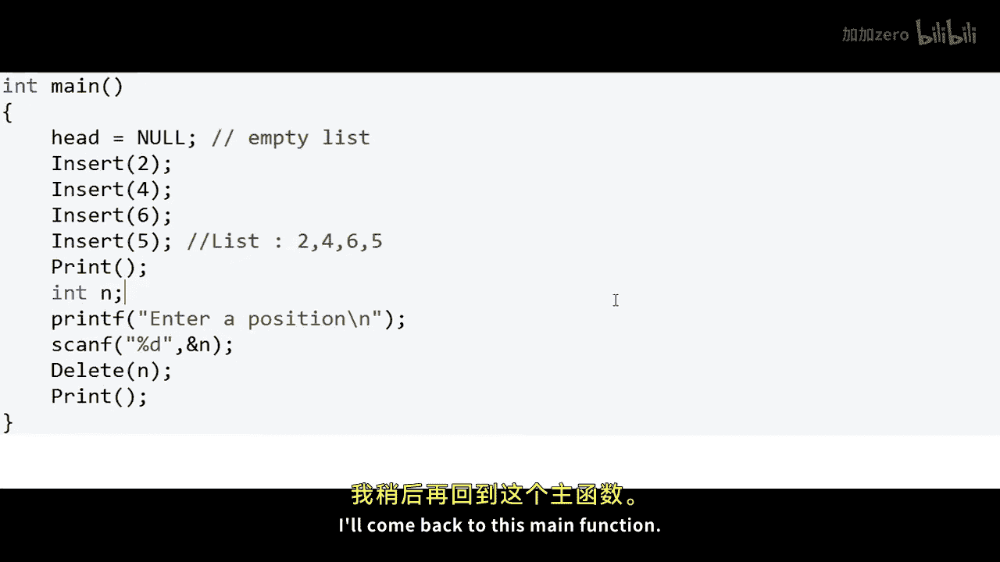

# mycodeschool【中英⚡数据结构｜Data Structures】 p08 p7 Linked List in C⧸C++ - Delete a node at nth position -BV1ckrLYREn2_p8-

In our previous lesson， we wrote program to insert a node at an position or a given position in a list in a linked list now in this lesson we will write a program to delete a node at any given position in a linked list。

 so once again I have drawn a linked list here。We have four nodes in this list at addresses 100 200150 and 250 respectively。

 so this is my example of a linked list of integers。

 and let's say we number the positions on a one based index so this is the first node in the list and this is the second node。

 this is the third node and this is the fourth node。

When we talk about deleting a node from the linked list， we will have to do two things。

First we will have to fix the links so that the node is no more a part of the list let's say in this case we want to delete the node at third position。

 so we will go to the second node for Nith node we will have to go to the n minus1th node and we will have to set the link part of the n minus1th node as the link of the Nith node。

Which will be the n plus18 node so we will cut this link and now this node at address 150 is not part of the linked list because when we will traverse the linked list we will go from address 00 to 200 and from 200。

 we will go to 250。This is one scenario for deletion in which we have a node before and a node after there will be special cases like we may want to delete the node at the first position or the head itself。

 in that case we will have to point head to the second node， we will have to build this link。

We will talk about all these special cases in our implementation， let's first understand the logic。

Now fixing the links is not good enough because all that we do when we fix the links is that we detach the node from the linked list so that it is no more accessible but it is still occupying space in the memory as we know a node is allocated space from what we call the dynamic memory or the heap section of the memory we have talked about this earlier。

In C or C plus+， we have to explicitly free this memory when we are done using it because it is not automatically de allocated。

And memory being a crucial resource， we do not want to consume it unnecessarily when we do not need it。

 So the second thing that we will have to do is we will have to free the space that is being taken by the node。

 and thats when the node will actually be deleted from the memory。So let us now write code for this。

I'm writing my C program here， the first thing that I have done is I have defined a node which is a structure with two fields。

 one to store data and another。To store address of the next node so the second field is a pointer to node now to create a linked list we will have to first create a pointer to node。

 a variable which is pointer to node and that will store the address of the head node or the first node in the list and now I want to define three functions first insert function that will take some value some data to be inserted into the list and always insert this value at the end of the list。

Then I want to define a print function that will print all the elements in the list。

We have defined this variable head as a global variable。

 so it will be accessible to all these functions and the third function that I want to write is delete that will take the position。

N of the note to be deleted。And delete the node at that particular position。

We will go back to implementing these methods first I'll write the main method。

 So in the main method first what I'll do is。I'll set head as null。

 So at this stage the list is empty。And then I'll make a couple of calls to insert function。

To insert some integers in the list。 So after this fourth insert， the list will be 2，4，6。

5 because we are always inserting at the end of the list， this insert function will insert。

The node at the end of the list。 Now what I want to do in my main method is I want to ask user for a position。

 and I'll input this position from the console and then I'll delete the node at this particular position and then。

I'll print the whole linked list。Let's also make a call to print after all the inserts Okay so this is what we want to do in our main method we want to insert four integers in a linked list to create a list to 465 in this order then I want to print the list then I want to input a number from the console and delete the node at that particular position now let us assume that we will always give a valid position and in my implementation also I will not handle the error condition when position will not be valid。

We have seen implementation of insert and print earlier。

So I will not go into their implementation details。

What I'll do now is I'll implement delete function。Now in my delete function。

 let's first handle the case when there is a node before the node that we want to delete。

 so we have an n minus18 node。What I'll do is I'll first create a temporary variable that is point to node and point this to head。

And using this temporary variable， we will go to n minus1th node to go to the n minus18th node。

 we will have to run a loop n minus2 times and we will have to do something like this。

Temp 1 is equal to temp1 dot next。 Now what I'll do is I will create a variable to point to the innet node。

Name this temp 2。And this will be equal to temp 1 dot next。And now I can fix the link。

 I can say that adjust the link section， the link part of n minus18th node。2。

2 n plus 1 at node which will be temp 2 dot next。Now， our link link is fixed。

And this variable temp 2 stores the N node reference to the N node so we can make a call to free function。

Free function D allocates whatever memory is allocated through malloc if we were using C++ and used。

And if we would have used new operator， we should have said delete temp 2。Okay。

 now we should be good。This much code will work for scenarios when we have an n minus1h node and even if there is no n plus 1 node if n plus 1 position is null。

 this will work for this that scenario I'll leave that as an exercise for you to validate it we have not handled one special case when we want to delete the head node so if n is equal to1 then what we want to do is we just want to set head as temp1 dot next temp1 is right now equal to head。

And now head has moved on to point to the second node and1 points still points to the first node。

 so links are fixed and we can free the first node which is now detached from the linked list because head is now pointing to the second node okay so this is our delete function。

I have missed one thing here for n not equal to1， we should not execute this section of the code。

 so either we put an else statement after this or what we can do is we can say return。

After we execute these statements for this condition now this code should work if I've got everything right so let us now run this and see what happens I have already written the insert and print functions I'll come back to this main function this is my list2。

46，5 and I can enter any of the positions123 or4 so let's first say we want to delete the head node and we are printing the list after deleting a particular node so the list now is 465 this seems to be correct let us run this again and this time I delete number 5 from position 4 the list is now 246 which is correct again similarly if I enter position 2 the list is 265 which is correct so we seem to be good。

I'll quickly walk you through this code in the logical view to make things further clear。

Let's say we first make a call to delete。Notode from the first position that is we want to delete the head node so in this code what we are doing is we are first creating a variable temp1 which is pointer to node initially temp1 is equal to head so it stores the address00 so it points to the head node now n is equal to1 so we come to this instruction head is equal to temp1 dot next actually this is temp arrow dot next but while reading we read this as temp1 dot next this is nothing but a syntactical sugar for this statement as strict temp 1 dot next。

So we are de referferencing this pointer variable to go to this node and then accessing the next field of this node Now we are saying head is equal to temp1 dot next。

 so head is now 200。So we are building this link。And breaking this link And now in the next line we say free temp1。

 So we want to free the memory which is being pointed to by this variable temp1 temp1 still points to this node at address 00。

 So this node now will be。Cleared from the memory。And now we return。

 so this function does not execute any further it finishes its execution once the function execution finishes temp1。

 which was a local variable also gets cleared from the memory head is a global variable so it does not get cleared This is how we know the linked list this is the identity of the linked list。

 this particular variable head。Let's read on this code again and this time I want to delete the node at third position in the list。

 I have drawn this initial list， so once again we create this variable temp1 we say that the address here is equal to 100 so it points to the head node or the first node and now n is not equal to 1 it is equal to 3 so we come to this particular loop。

N is equal to3， so this loop will execute exactly once。 this statement will execute exactly once。

 so temp1 will now move to address 200 so temp 1 is now pointing to the second node This is what we wanted to do。

 We wanted temp1 to point to n minus1 node n is3 here now we create another variable another pointer to node temp2 and we set this guy as temp 1 dot next temp 1 dot next is 150 so we set this guy as 150 so this guy points to the n at node or the third node now in the next line we are saying that temp 1 dot next this value which is 150 right now is now temp 2 dot next address of the n plus1 node or fourth node so this guy will now be 250 so we are building this link。

And we are breaking this link， so we have fixed the links。

 and now finally we are saying that free the memory which is being pointed to by temp2。

 So now this third node， the memory block will be deleted from the memory and once this function execution finishes。

All the local variables temp 1 and temp 2 will be cleared， and this is what the list will be。

This node at address 250 will now be the third node。

So this was deleting a node at a particular position in the linked list。

 we can also have a problem where we may want to delete a node with a particular value you can try implementing it。

In the coming lessons， we will see more problems on linkeded list。

So thanks for watching。