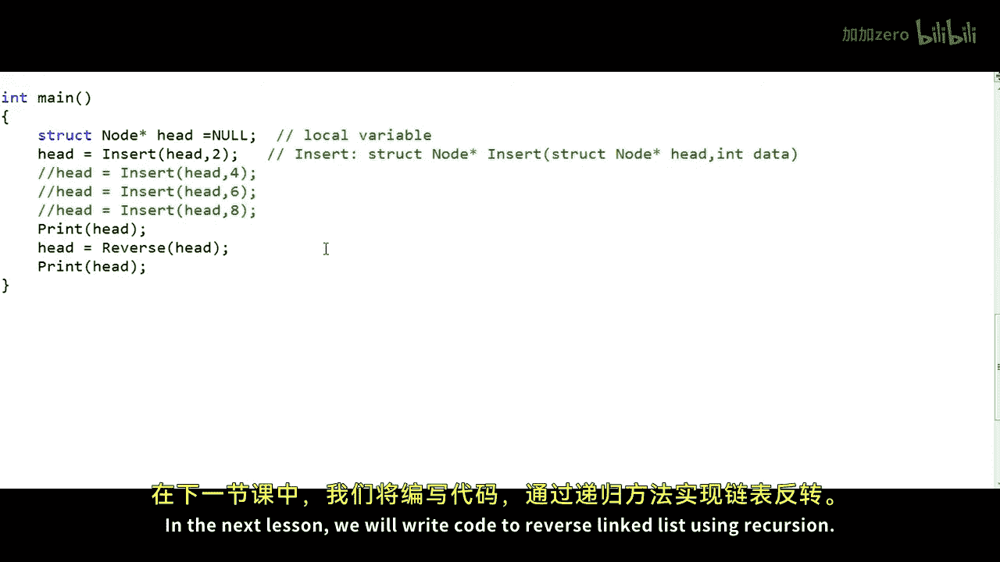

# mycodeschool【中英⚡数据结构｜Data Structures】 p09 p8 Reverse a linked list - Iterative method -BV1ckrLYREn2_p9-

In our lessons on linked list so far we have implemented some of the basic scenarios like inserting a node in linked list and deleting a node from linked list in this lesson we will write code to reverse a linked list This is one of the most favorite interview questions。

And this is a really interesting problem。 So let me first define the problem。

 let's say we have been given a linked list of integer。Like this， So this is our input。

 We have four nodes in this linked list。That addresses 100，200，150 and 250 respectively。

I always write these addresses in the logical view because it's really important that we visualize how things are in the memory and what is what like this first node that we also call the head node is being pointed by this particular variable named head so this variable is basically storing the address of the head node this variable is only appointed this is not the head node itself and we do not have any other identity of the linked list except the address of the head node so given a linked list like this if we have to reverse it and by reversing we do not mean moving around data like we cannot move5 at address 00 to at address 250 and do something like this we actually have to adjust the links so our output should be something like this。

The head pointer should point to this node at address 250 and we should go like 250 to 250150 to 200 and this node at address 100 should have a address zero or null in each of these nodes this first field in red is the data part and the second field is the address part so this is what we will get when we will reverse the list there are two approaches to solve this problem one is an iterative approach where we will be using a loop we will traverse through the list and at each step we will revert one of the links。

Another solution is using recursion。In this lesson， we will try to understand the iterative solution。

 so coming back to our input list。The iterative solution is relatively easier to understand what we can do is we can traverse the whole list and as we go to each node we can adjust the link part of that node to make it point to the previous node instead of the next node so we will start at the first node at each step we want to reverse the link so we want to make the node point to the previous node instead of the next node for the first node there is no previous node so let's say the previous node is null and now we want to cut this particular link and we want to build this particular link so we will simply change the address field to0 and we have reverse the link part of this particular node and now we will go to the next node in the list we will come to this node of course the question would be how would we go to the next node if we have broken this link here we will come back to that in our implementation details let's say we are able to。

Traverse the list and go to each of the nodes at each step。

 let's say we store all the relevant information to do that in some temporary variables。

 Now at this node again， we will reverse the link。 So the address part will be set as 100 here。

Now we will go to the next node at address 150 once again to reverse the link we will set the address as 200 here so we will break this link and basically we are building this link and now we will go to address 250 the next node we will set the address 150 here so we will cut this link and build this link and finally when we have reached the last node we will adjust the address in this head variable to 250 so this particular variable。

 this particular pointer we will point to this node at address 250 and our linked list is reversed now。

So let us implement this particular logic in a real fee program。

 I will redraw the original input list。In my C code I will define node as a structure like this。

 this is how we have defined a node in all our previous lessons so there will be two fields one to store the data which will be of type in teacher and another to store the address of the next node。

 we will name this field next and it will be of type pointer to node。And let's see。

Head is a global variable， so head is a pointer to node head is a variable。

 which is a pointer to node。And it is a global variable， so it is accessible to all the functions it。

We do not need to pass it around to functions now all I want to do in my code is I want to write a reverse function that will reverse the linked list which is pointed to by this particular pointer head。

As we said， we will traverse the whole list and at each step we will modify the link field of the node to make it point to the previous node instead of the next node。

So how do we traverse the list we would traverse the list in our C code， something like this。

 we will first take a variable which will be pointeder to node。

 let's say we will name it temp then first we will set temp to head by saying this we will make temp point to the first node and then we will run a loop like this we will say that what temp while temp is not equal to null。

Take temp to the next address with a statement like temp is equal to temp dot next。

In our problem here we don't just have to traverse the list as we traverse the list we have to reverse the link so we have to set the address field of a particular node as the address of the previous node instead of the next node now in a linked list we would always know the address of the next node but we would never know the address of the previous node so as we traverse the list we will have to keep track of the previous node in another variable so what I will do here is something like this I will also declare a variable named previous and initially set it to null because for the first node or the head node the previous node is null and now in my loop we will have to update both these variable the variable temp that will store the current node and the variable pre that will store the address of the previous node。

And now in my loop I can do something like this at each step if temp is our current node as we are traversing the list then we will say that temp dot next is equal to previous so we will set the link part of the current node as the address of the previous node in our example here at the first step we will say that temp dot next will be0 null is nothing but address 0 so we will cut this link and we will build this link now we should be able to move temp to 200 now and we should be able to move previous 200 now in the next step but there is a problem as soon as we adjusted the link of this particular node at address 00 to make it point to null。

We lost the address of the next node so how do we move temp to this particular node at address 200。

 we cannot set temp equal temp dot next now if we set temp equal temp dot next now we will go to null so this is a problem。

So at each step in our iteration before we set the link field of the current node to make it point to the previous node。

 we should store the address of the next node in a temporary variable in another temporary variable so what I'll do here is something like this first of all I want to name this particular variable temp as current to mean that this is the current node at any stage in my iteration。

So we initially set current to head and then we are running the loop as while current is not equal to null and then I've also declared one more temporary pointer variable named next what I'll do at each each step in myration inside the while loop is that first I'll say something like next is equal to current dot next so first I'll store the address of the next node in this particular variable next so in our example here for the first node initially things will look something like this now we can set the link part of the current node as address of the previous node with a statement like this so when we will write the address0 here initially we will break this link and create this link we will not lose the information about the next node。

Now we can redefine our previous and current， so we will first move previous to current and then we will move current to next。

Please note that this particular variable next is a local variable in the reverse function and when we say something like current dot next we mean the link field in the node while when we say when we simply say next we mean this particular local pointer variable so they're different this is not current dot next actually this is current arrow next which is an alternate syntax for asterisk current dot next so we use the asterisk operator to dereence that address and then we access the next field for the sake of saying we say current dot next temp dot next so with these two lines in our loop we are resetting our previous current pointers this is how we are traversing the list if you see in the next iteration current is 200 it is not equal to null null is0 so we will go to this particular statement next is equal to current dot next so next we'll now storedt address 150 and now we will say current dot next is equal。

previous so we will cut this link， previous is 100 right now so we will set 100 here。

 so basically we will build this particular link and then we will move we will first move previous to current and then move current to next and we will go on like this。

So finally we will reach a stage like this when current will be equal to null we will come out of the loop and when we will come out of the loop this particular variable previous this particular pointer previous will store the address of the last node and there is one more thing remaining here we need to adjust this particular variable head this link at this stage does not exist and in my code I'll say head should now be equal to the addressing variable previous so head is now 250。

This is our new head， and now our list is reversed。

There are a couple of things that I want to point out here。

One thing is that we must see whether our implementation is working for all test cases so we must also verify it for special or coronary test cases in this case co test case will be when the list is empty in that case head will be null or when the list is having only one node if you see this particular implementation will work for these two scenarios and give it give it some time and you should be able to figure it out lets now run this code with complete implementation of all the functions to insert and print nodes in my code here I have written reverse function to accept the address of the head node as argument and then return the address of the head node after modification of the list after reversal of the list and then I have written the main method in which I' am declaring head as a local variable。

And then I'm using a couple of insert functions， I'm making a couple of calls to insert function。

Insert function also takes two arguments， the address of the head node and the data to be inserted and it returns back the address of the head node。

It could either be modified or not modified let's say we are inserting at the end of the list。

 so initially our list will be 2468。And then we are making a call to the。Print function。

 which I have written to print the elements in the list。

 and then Im making a call to reverse and finally printing again my logic of the reverse function remains the same except that Ive changed the method signature。

And in the end， I'm returning head。Which will return the address of the head note。

Let's say we have written all the other functions， insert and print correctly。

These are the two functions insert and print， so let's now run this code and see what happens before the list is reversed the output is 2468 and after the list is reversed the output is 8642。

Let us try this for the case when we have only one element in the list。

So I'll remove I'll comment out these three insert statements and this also seems to be working so this was reversal of linked list through iteration in the next lesson we will write code to reverse linked list using recursion so thanks for watching。

