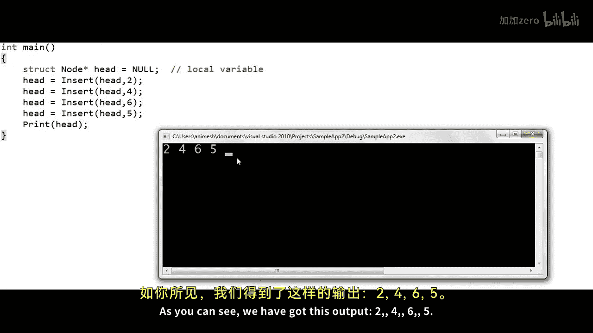
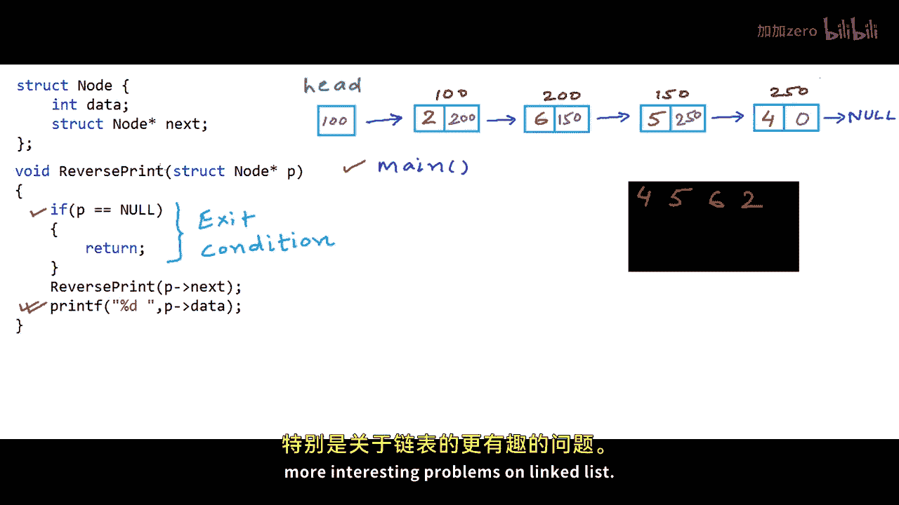

# mycodeschool【中英⚡数据结构｜Data Structures】 p10 p9 Print elements of a linked list in forward and reverse order using recursion -BV1ckrLYREn2_p10-

In our series on linked list so far， we have implemented some of the basic operations like insertion。

 deletion， and traversal。Now in this lesson， we will write code to traverse and print the elements of a linked list using recursion。

Prequisite for this lesson is that you should understand a recursion as a programming concept。

 recursive traversal of linked list actually helps us solve a couple of interesting problems but in this lesson we will keep it simple。

 we will just traverse and print all the elements in linked list using recursion and we will write one simple variation to print all the elements in reverse order using recursion we will actually not reverse the list。

 we will just print the elements in reverse order。So once again I have taken example of a linked list of integers here。

 we have four nodes， each rectangle here is a node， it has two fields。

 one to store the data and another to store the address of the next node let's say we have four nodes that addresses 100200150 and 250 respectively and of course we will also have a variable that will store the address of the head node。

 let's name this variable head programmatically in our C or c plus plus program a node will be defined something like this we will have a structure with two fields one to store the data and another to store the address of the next node。

What we want to do in this particular lesson is that we want to write two functions first we want to write a function named print that will take address of a node as argument。

 we will pass this function the address of the head node so let's name this argument head and in this function we will use recursion to print the elements in the list so for this particular example here if we want to print a space separated list of all the elements our output will be something like this and we also want to write another function named reverse print here also we will take the。

Address of a node， so we will pass this guy the address of the head node。And in this function。

 we will use recussion to print the elements in the list in reverse order。

 so if we have to print a space separated list for this example。

And the R output will be something like this。So let's first implement the print function in my C code here。

 I'll declare print function like this， it will take as argument the address of a node。

 so the argument is of type pointer to node。Initially we will pass the address of the head node。

 we can name this argument head or we can name this argument P。

 we can name it whatever but we must understand that this will be a local variable and lets not bother about other infrastructure in the code like how how we would create a linked list and how we would insert a node in the linked list let's assume that they are in place so let's keep the name of this particular argument P。

Now recursion is a function calling itself so we have been past the address of a node initially the head node so what we can do in our code is first we can print the value at that particular node with a print F statement like this and then we can make another call to the print function and this time we will pass the address of the next node with a statement like this。

This next field is also a pointer to node。This will pass the address of the this will be the address of the next node。

There is one more important thing in recursion that we should never forget。

 and its the exit condition from recursion。 We should not go on making recursive calls infinitely。

 So in this case， if we go。From the first node to the second node and from the second node to the third node using recursion。

 then finally at one stage p will be equal to null in one of the calls at this stage we can avoid making a recursive call we will exit。

We will show you a simulation of how things will happen in memory， hold on for a while。

 so once we will reach the end of the list P will be equal to null and we will exit the recursion at that stage now I'll write the main method Ive already written the insert function here。

So I'll declare a variable head。As null in the main methods。

 so head will be a local variable once again we could name this particular variable A or B or whatever。

Just because this variable points to the head node or the first node in the list。

 we name this variable as head， and then we will insert some nodes in the linked list using。

By making call to the insert function that takes the address of the head node as argument。

 initially head is set as null to say that the list is empty and there should be two arguments to head。

The to the function insert， the address of the head node and the value that needs to be inserted。

And why is it that this particular function insert is returning a pointer？

It's because this head in the main method is a local variable and if we pass it to the function we just pass a copy of the address of the headn in this head which will be a local variable of insert function so this guy returns back the address of the modified head so we can update it in the main function。

This function inserts a node at the end of the list。 So initially when head is null， head will be。

Modified in the insert function。For other cases it will not be modified if we are inserting at the end。

 so we will make four such calls to the insert function to create a linked list of four integers 2465。

And now we will make a call to print function and pass it the address of the head note。

Let us now run this code and see what happens as you can see， we have got this output 24，65。

The print function here in our code， which is a recursive implementation to print the lists is working。

Now I'll make one slight change in the print function instead of printing the value in the node and then making a recursive call。

 I'll first make a recursive call and then when the recursive call finishes。

I'll print the value in the node。And I'll not modify anything else in the code。

 the main method will remain the same and if we run this code we can say we can see that the elements in the list are printed in reverse order。

 so we just implemented the reverse print function that we had talked about let us now analyze these two recursive implementations in a logical view in our example here if we want to print this particular list we will do something like from the main method we will make a call to the print function passing it the address of the head node。

 so initially this。

Print function is being called with p equal 00。 Now in the execution of this function。

 we will come here if p is equal to null null is address 0 and our argument is hundred so control will not go inside this if condition we will come here we will print P arrow data P arrow data means that we will first dereence the address so we will go to the address hundred and then we will look at the data field there so on the console we will print the data field of。

Data field at address 00， and now we will make a recursive call。

 we will make a call to print function。Passing it， address P arrow next， which is 200。

And the execution of this particular call will not finish。

 It will finish only after print 200 finishes。 we will come back to it。 Now， print 200 once again。

 print the。Data address 200。And then makes a recursive call to print function passing address 150。

And we will go like this in this call to print with address 250， we will first print the data。

And the address field the value of p dot next p arrow next is0 what we can also say null so we will make a call like this now for this call with argument null we have reached the exit condition recussion will not grow any further so we will just print an end of line and return。

This particular structure that we have drawn here is called recursion tree。

So print null function call will finish and control will return back to print 250。

 there is no statement。After this particular recursive call finishes so we will simply exit this function call also and control will return back to print 150 and we will go on like this finally we will come back to the main method。

If you want to see how the recursion will execute in the memory。

 then I'll have to draw a diagram like this applications memory。

 the memory that is allocated for the execution of a program。Has these two sections。

All the details of function call execution and the local variables they are stored in the stack section of the memory and any memory that is allocated using the mallO function or the new operator in C++ they go into the heap section the memory for the nodes in a linked list is allocated。

From the heap so that's why these four nodes in our example are sitting in the heap if you want to know in detail about stack and heap check the description of this video for a lesson on dynamic memory allocation when the program will start executing first the main function will be invoked anytime a function is invoked some amount of memory from the stack is allocated for the execution of that particular function it's called the stack frame of that function so let's say main is executing we have already inserted some nodes in the linked list we have this variable head in the main function so all the local variables sit in the stack frame of the function so head will sit here now at this stage let's say main makes a call to print function so main was executing and now it makes a call to print function execution of main will be paused and we will go on to execute the print function the argument passed to the print function is。

Hundred， which is。Sttored in a local variable， This argument P is a local variable in the print function。

 Now print function again makes a recursive call。 Now stack frame is always allocated corresponding to each recursive each call of a function So a function calling itself is not different from a function calling another function at any time whatever function call is at the top of the stack is executing finally when we will reach the exit condition of the recursion stack will be something like this and then first this call where P is0 will finish we will come back to this particular call and then this will finish and we will go on like this。

So this is how recursion works， this is how things will happen in the memory。

Okay so now I'll clear this diagram of stack and heap in the right and I'll make some change in my print function What I've done is I have renamed my function print as a reverse print and in my function I'm first making a recursive call and after coming back from that recursive call I'm writing a print statement and from the main function I'll make a call to reverse print let's write Rp as shortcut for reverse print and initially I'll pass the address off the head node so I'll make a call like this reverse print00 the control will come inside this function p is 0 it is not equal to null and I've also drawn the console like before now this particular function call does not print first it first makes a recursive call so this guy will go ahead and make a recursive call to the reverse print function passing it address 200 nothing will be written on the console and。

Once again。This particular function will make a recursive call like this。And once again。

 this particular function we will go ahead and make a recursive call like this and finally we will have a recursive call where the function is past address null。

At this stage we will come to the exit condition in the recursion。

 the recursion will not grow any further， we will simply return the control will return to this particular call reverse print 250 so we will come here now。

To this print of statement the data field at address 250 is 4。

 so 4 will be printed on the console and now this particular function call will finish and we will go to reverse print 150 and now this call will print 5 and exit and we will go on like this。

Finally， we will return back to the main function with this output on the console。

 the elements of the list printed in reverse order。

So this was recursive traversal of linked list to print its elements。

 I must point out here that for normal traversal of the linked list， not for the reverse print。

 for the normal print and iterative approach will be a lot more efficient than the recursive approach because in iterative approach we will just use one temporary variable while in recursion we will use space in the stack section of the memory for so many function calls so there is implicit use of memory there for reverse print operation we will anyway have to store elements in some structure so if we use recursion it is still okay。

In the coming lessons， we will solve more problems， more interesting problems on linked list。

 so thanks for watching。

