# mycodeschool【中英⚡数据结构｜Data Structures】 p12 p11 Data structures： Introduction to Doubly Linked List -BV1ckrLYREn2_p12-

Hello， everyone。😊，In our lessons in this series so far we have discussed linked list quite a bit。

 we have seen how we can create a linked list and how we can perform various operations with linked list linked lists。

 as we know are collections of entities that we call nodes。

So far in all our implementations we have created linked lists in which each node would contain two fields。

 one to store data and another to store address of the next node。

 let's say we have a linked list of integers here so I'll fill in some values in data field of each node。

Let's assume that these nodes are at addresses 200， 250 and 350 respectively。

I'll also fill in the address field in each node the address field in first node will be the address of second node which is 250 the address field in second node will be address of third node which is 350 and address part in third node will be0 or null the identity of a linked list that we always keep with us is the address of head node or reference to head node let's say we have a variable named head only to store the address of the head node remember this variable named head is only a pointer to the head node ideally we should have named there something like head pointer It's only pointing to the head node it' is not。

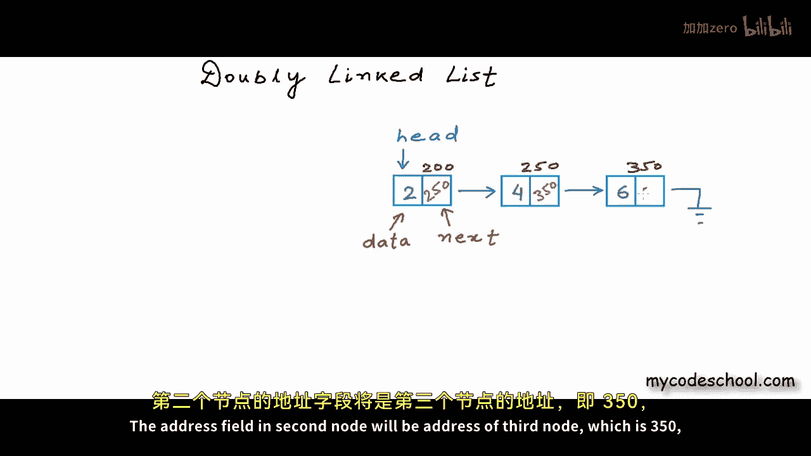

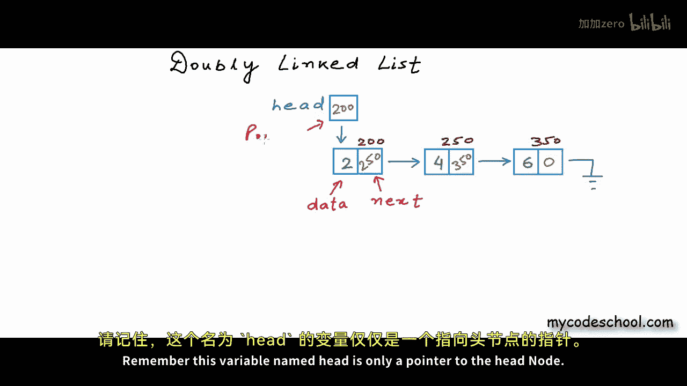

The head node itself。Head nor is this guy。The first node in the linked list。Okay。

 so right now in the linked list that we are showing here， each node has only one link。

 a link to the next node。😊。

In a real program， node for the linked list that I'm showing here will be defined like this。

This is how we have defined nodes so far in all our lessons， we have two fields here。

 one of type integer to store data and another of type pointer to nodestruct node asterisk。

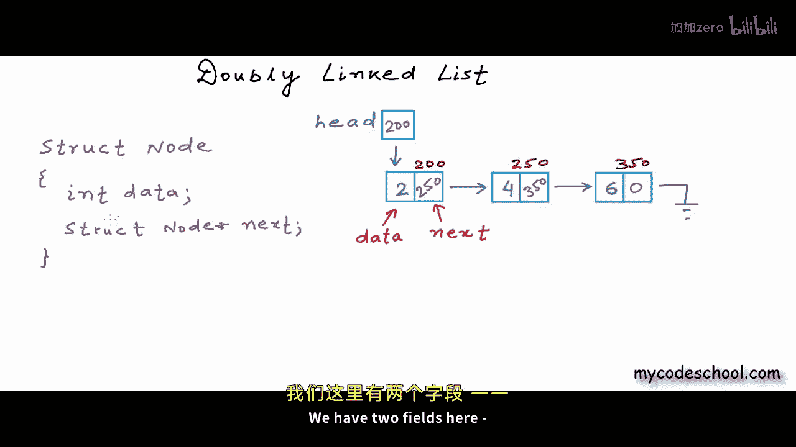

I'm calling this field next when we say linked list by default we mean such a list that we can also call singly linked list what we have here is a singly linked list what we want to talk about in this lesson is idea of a doubly linked list the idea of a doubly linked list is really simple。

😊。

In a double linked list， each node would have two links。

 one to the next node and another to the previous node。

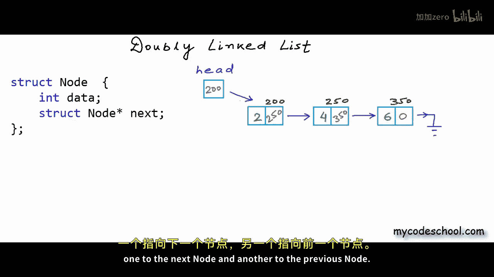

Programmatically， this is how we will define node for a doubly linked list in C C++。

I have one more field here which once again is appointed to node so I can store the address of a node。

 I can point to a node using this field and this field will be used to store the address of the previous node in a logical representation I will draw my node like this now I have one failed to store data one to store address of previous node。

And when to store a address off next node。

Let's say I want to create a w linkeded list of integers， I have created three nodes here。

 let's say these address these nodes are at addresses 400， 600 and 800 respectively。

 Ill fill in some data let's say the cell in the middle in each node is to store data the right most cell is let's say to store the address of the next node so for first node this field will be。

600， which means we have a link like this for second node this field will be 800 for third node this field will be0 for first node there is no previous node so this leftmost cell which is supposed to contain the address of the previous node will be0 or null。

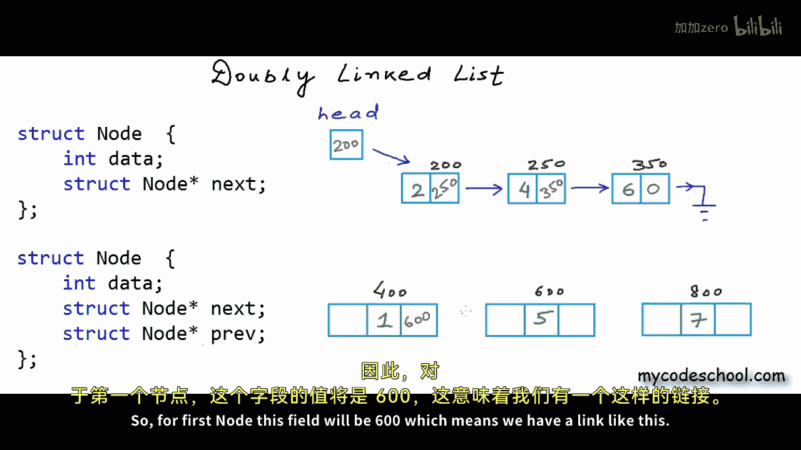

The previous node for second node will be 400。And the previous node for the third node is the node at address 600。

And of course we will have a variable to store the address of the head node Okay。

 so what we have here is a doubly linked list of vintagetegers with three nodes。

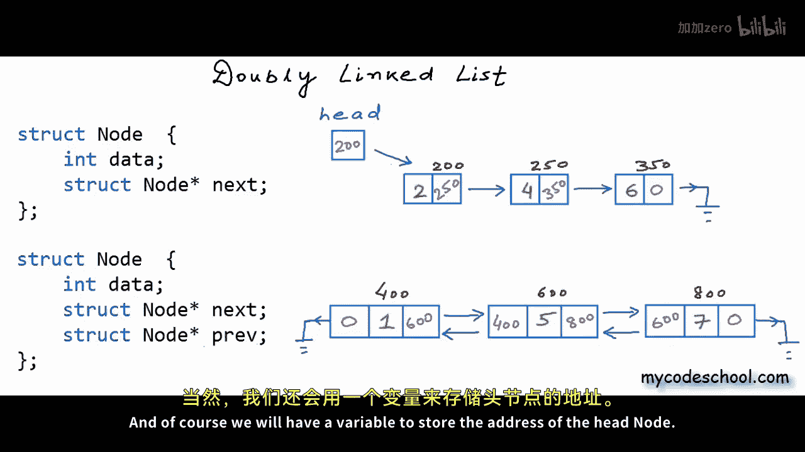

Okay so with this much you already know doubly linked list。

 if you have ever implemented a singlely linked list。

 then it should not be very difficult implementing a doubly linked list。

 one obvious question would be why would we ever want to create a doubly linked list。

 what are the advantages or Hes cases of a doubly linked list？

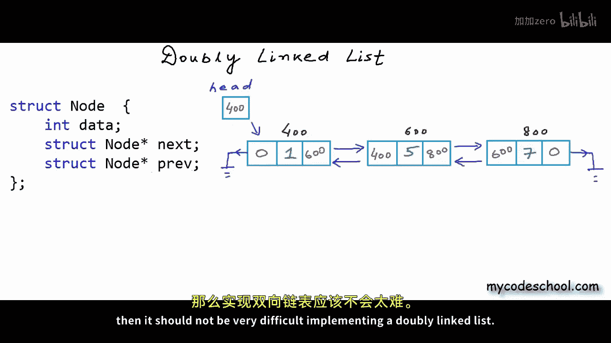

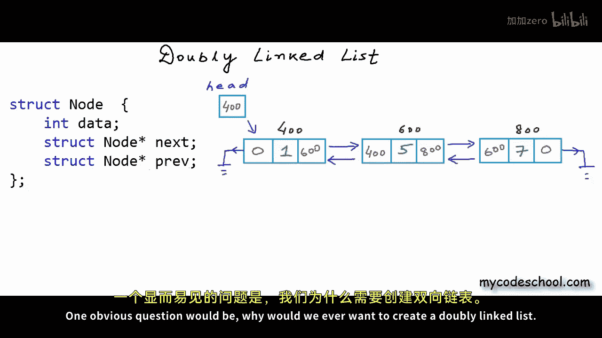

First advantage is that now if we have a pointer to any node then we can do a forward as well as reverse lookup with just one pointer we can look at the current node。

 the next node as well as the previous node I am showing a pointer named temp here if temp is a pointer pointing to a node then temp dot next is a pointer pointing to the next node its the address of the next node and temp dot previous or rather temp arrow previous this is actually a syntactical sugar for asteriskx temp dot prev。

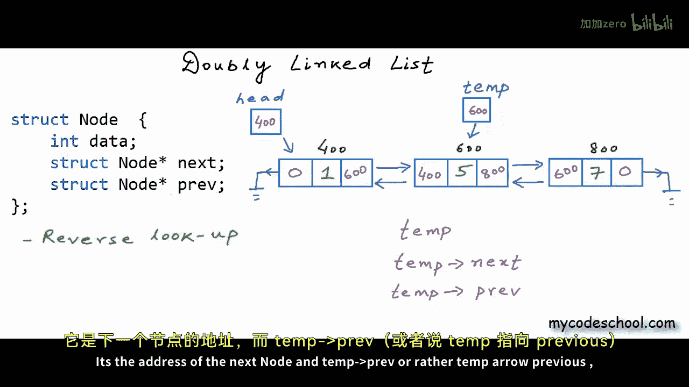

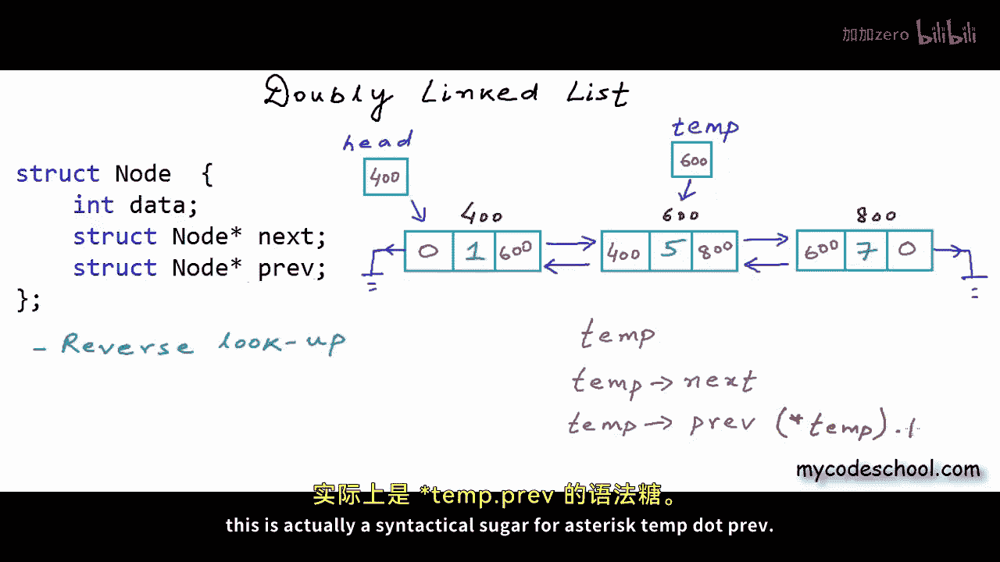

So this guy temp arrow pre is previous node or in pure words pointer to previous node。

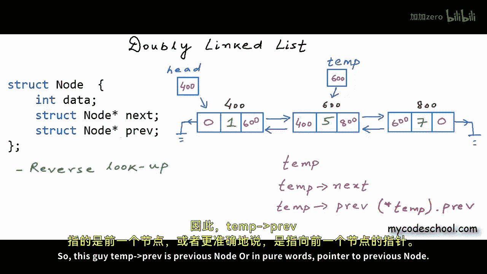

The value stored in temp for this example right now is 600。

 temp dot next is 800 and temp dot pre is 400 in a singlely linked list there is no way you can look at the previous node with just one pointer。

You will have to use an extra pointer to keep track of the previous node。

In a lot of scenarios， the ability to look at the previous node。

Makes our life easier， even implementation of some of the operations like deletion becomes a lot easier in a singlely linked list to delete a node you would need two pointers。

 one to the node to be deleted and one to the previous node。But in our doubleubly linked list。

 we can do so using only one pointer， the pointer to the node to be deleted。All in all。

 this ability that we can do a reverse lookup in the linked list is really useful。

 we can flow through the linked list in both directions。

Disadvantage of doubly linked list is that we are having to use extra memory for pointer to previous node for a linked list of integers。

 let's say integer takes4 bytes in a typical architecture and pointer also takes4 bytes pointer variable also takes4 bytes then in a single linked list each node will be8 bytes4 for data and 4 for a linked to the next node in a doubly linked list each node will be 12 bytes。

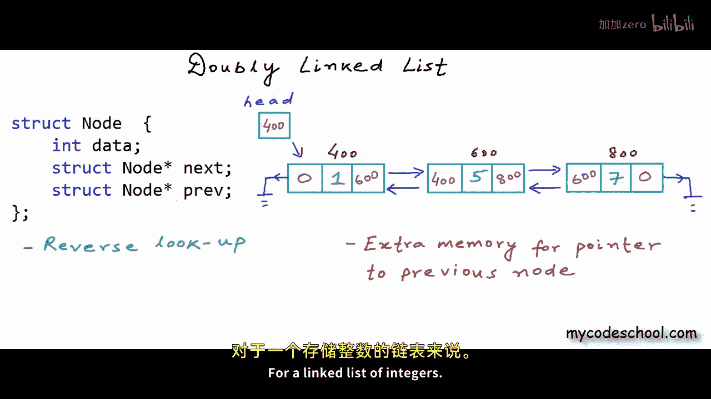

We will take four bytes for data and8 bytes for links， for a linked list of integers。

 we will take twice for links than data。

With a doubly linked list we also need to be more careful while resetting links while inserting or deleting we need to reset a couple of more links than a singlely linked list and so we are more prone to errors we will implement doubly linked list in a C program in next lesson we will write basic operations like traversal insertion and deletion this is it for this lesson thanks for watching。

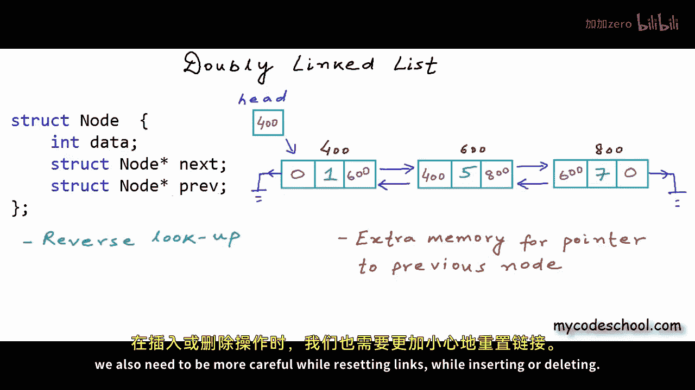

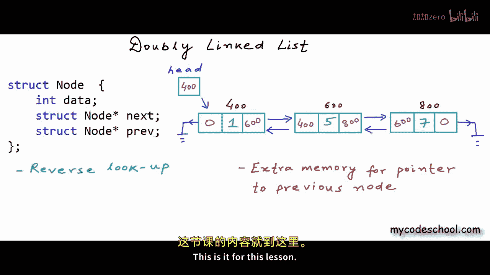