# mycodeschool【中英⚡数据结构｜Data Structures】 p13 p12 Doubly Linked List - Implementation in C⧸C++ -BV1ckrLYREn2_p13-

In our previous lesson we saw what doubly linked lists are now in this lesson we are going to implement wubly linked list in C we are going to write simple operations like insertion traveral and diletion in a doubly linked list as we saw in our previous lesson each node contains three fields I have drawn logical representation of a doubly linked list here1 to store data one to store address dress of next node and one to store address of previous node for a linked list of integers node will be defined like this in a C or C plus+ program in the logical representation I'll fill in some data in each node let's say these node are at addresses 400600 and 800 respectively I'll also fill in next10 previous fields and we must also have a pointer variable pointing to the head node。

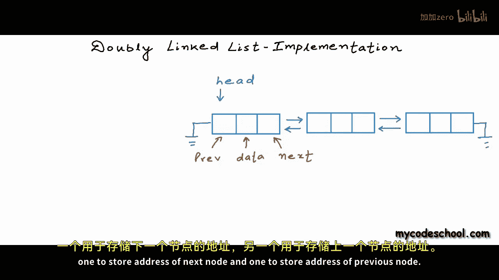

Quite often we name this point of variable head。In my implementation I'm going to write these functions I'm going to write a function to insert a node at beginning or head of linked list this function will take an integer as argument I'll write another function to insert a node at tail of linked list I'll write one function to print elements in linked list while traversing it from head to tail I'll write another one to print the elements in reverse order while traversing the list from tail to head reverse print function will validate whether reverse link for each node is created properly or not let's now write these function in a real C program in my C program here I have defined node as a structure with three fields first field is of type integer to store data second field is of type pointer to node to store reference of next node。

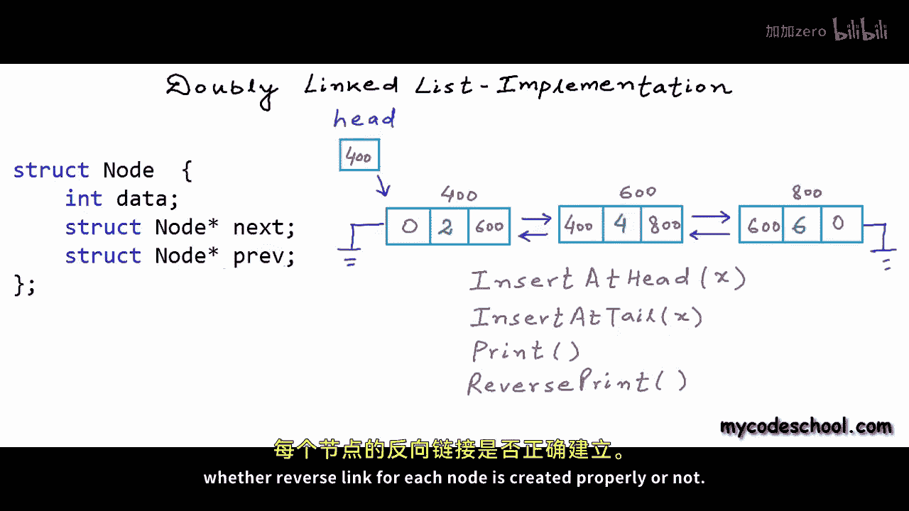

And the third field is appointed point to node to store the reference of previous node。

 I have defined a variable named head which once again is a to node and I have defined this variable in global scope head is a global variable。

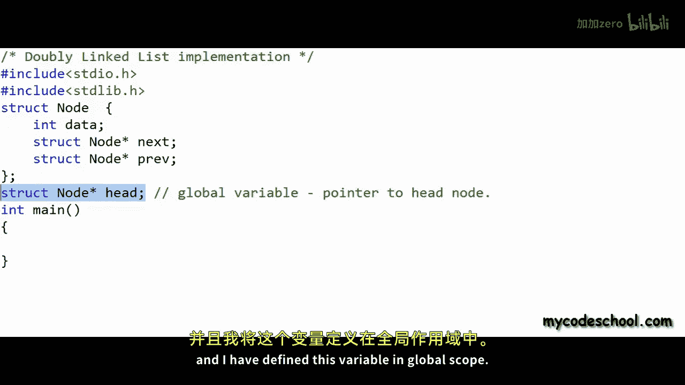

When we define a variable inside a function it is called a local variable。

 the lifetime of a local variable is lifetime of a function call。

 it is created during a function call execution and it is cleared from the memory when function call execution finishes but global variables live in the memory for whole lifetime of and application they live till the time program is executing global variables can be accessed everywhere in all functions local variables are not accessible everywhere unless you access them through pointers in all our previous implementations we have mostly declared head as global variable。

Okay so lets now write the functions the first function that I want to write is insert at head this function will take an integer as argument。

 the first thing that we want to do here is we want to create a node。

 we can always declare a node like this just like declaration of any other variable we can saystruct node。

And then we can give an identifier or name and now in this my node that Ive created。

 I can fill in all the fields。

But the problem here is that when I'm creating a node like this。

 Im creating it as a local variable and it will be cleared from memory when function call will finish a local variable lives in what we call stack section of applications memory and we cannot control its lifetime it's cleared from memory when function call finishes we do not want this our requirement is that a node should be in memory unless we explicitly remove it so that's why we create a node in in dynamic memory or what we call heap section of memory anything in heap is not cleared unless we explicitly free it to create a node in heap we use mall function in C or new operator in C+ plus all malloc function does is it。

Resserves some memory in heap， and this memory can be used for writing anything any variable。

 any object。Access to this memory always happens through a pointer variable we have talked about this concept quite a bit in our previous lessons but I keep on repeating because this is a really important concept。

 so here with this statement I have created a node in dynamic memory or heap that can be referenced through a variable which is pointer to node。

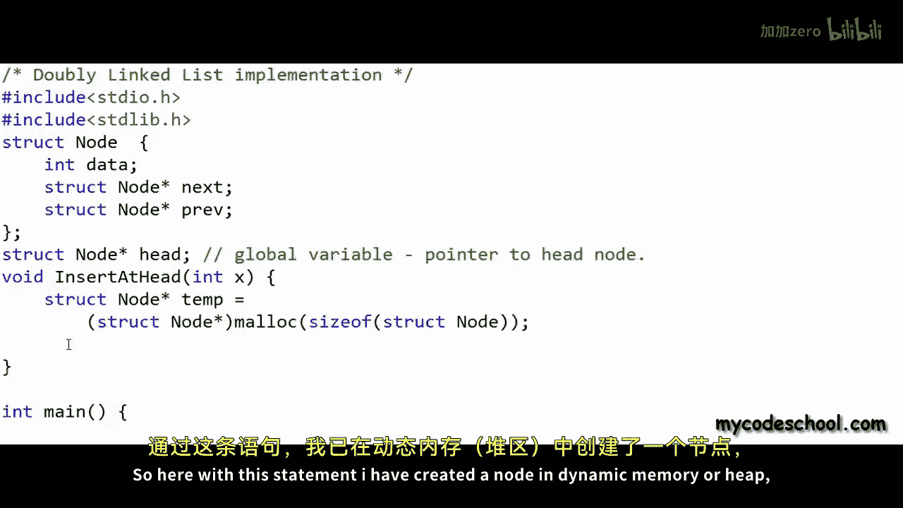

I have named this variable temp now I can use this pointer variable to fill in values in various fields of the node。

 Ill have to dereence this point of variable using asteriskx operator。

And then I can access various fields like data， prev or next。

There is an alternate syntax for this asterisk。Temp dot data， we can simply write temp arrow data。

And similarly， I can access other fields also， so to access pre field， I can say temparrow pref。

 let's set this as null and let's also set the next field as null。

If you want to understand or refresh the concept of stack and heap in memory。

 then you can check the description of this video for a link to our lesson on dynamicy memory allocation。

Okay so in my function insert at head I have created a node in heap section of memory and I' am referencing that node using this point of variable named temp temp is not a very meaningful name let's use a name like。

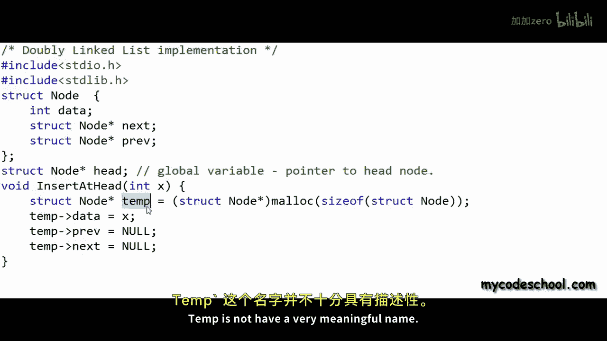

New node or new node pointer。

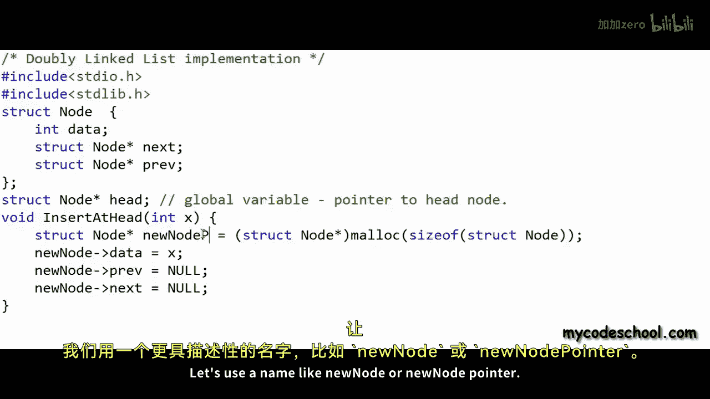

I would like to separate out this logic of node creation。

 these lines for node creation in a separate function。

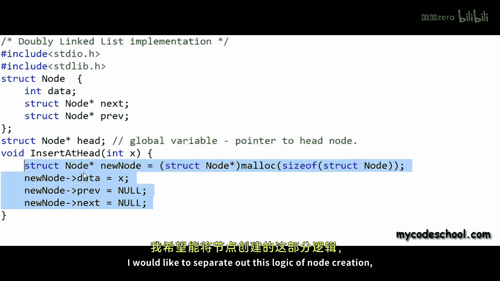

I've written a function here named Catt new node that will take an integerous argument。

 create a node filling in data field as x and setting both previous and next pointers。

As null， this function will return a pointer to node so I will return new node from here。

 I am writing a separate function because I can avoid duplicate code by using a separate function for creation of node because I'm going to create a node for function in function insert at head as well as in function insert at tail that I'll be writing after some time。

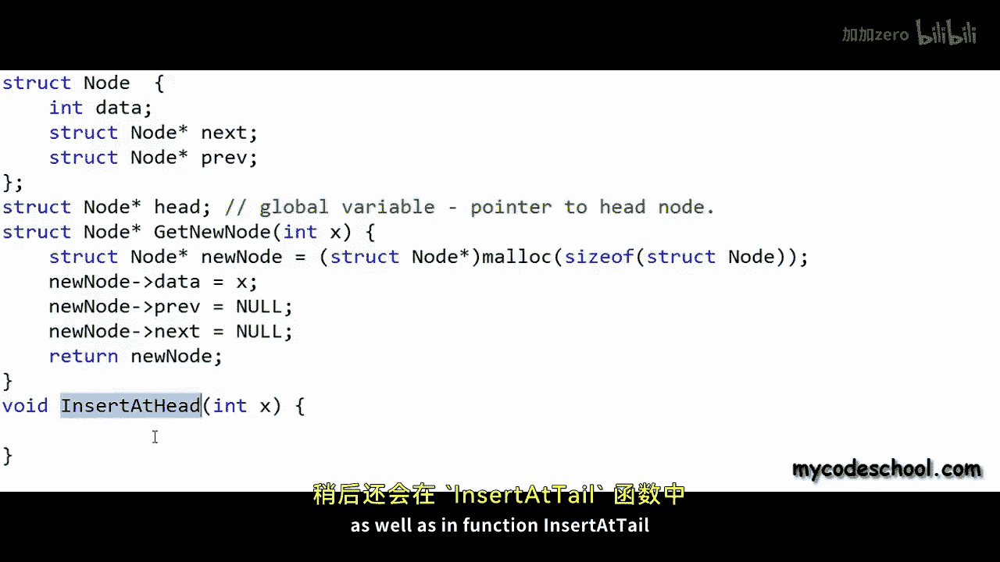

Now in insert at head function， I can simply call this function get new node passing at X this function is returning a pointer to newly created node that I am going to receive in this variable which once again is appointed point to node named temp。

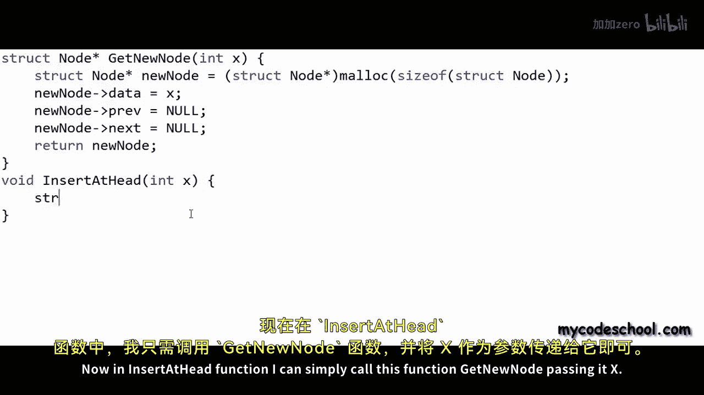

We can name this variable also as new node。This new node in insert at head is different from this new node in get new node。

 These are local variables。 This new node is local to insert at head and this new node is local to get new node Now there will be two cases in insertion at head list could be empty so head will be equal to null in this case we can simply set head as the address of new node and return or exit。

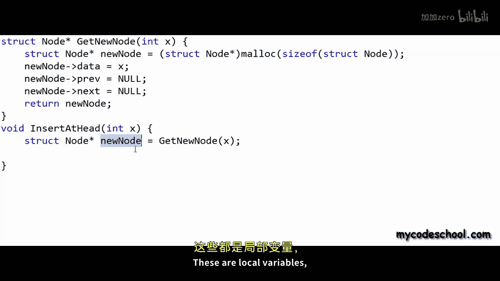

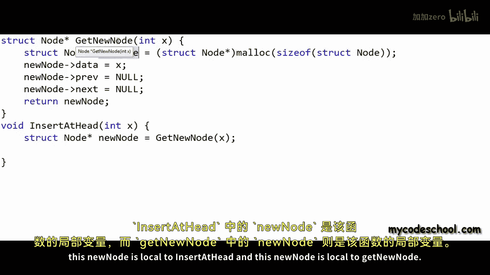

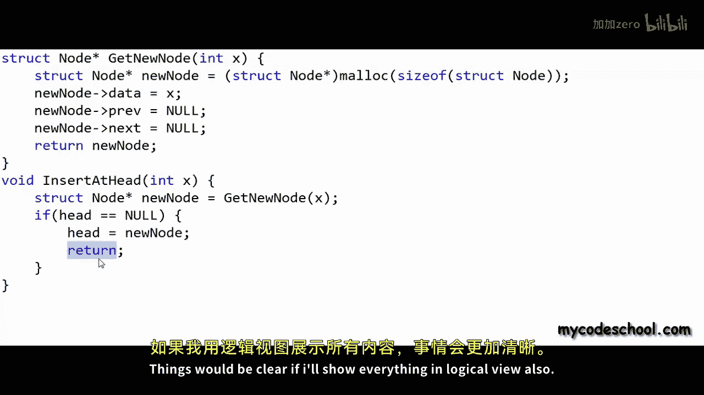

Things will be clear if Ill show everything in logical view also right now my linked list is empty here in this logical view that I am showing let's say I have made a call to insert at head passing it number two get new node function will give me a new node let's say a new node is created at address 400 with this statement Head equal new node we are setting the address stored in new node variable in head null is nothing but address 0。

As soon as this function insert at head will finish。

 this variable new node will be cleared from memory。

 but the node itself will not be cleared if we would have created node like this struck node new node。

And in this declaration， new node。Is not pointed to node。

Noode and we are not sayingstruct node as risk so if we would have created node like this the node also would have been cleared Okay coming back to the function here。

 let's write rest off the logic to insert a node when list is not empty This is what I'll do Now I' am making a call to insert at head passing it number 4。

Once new node is created， I'll first set the previous field of existing existing head node as the address of this new node。

 so I'm building this link。Then I'll set the next field of new node as the address of current head。

And now I can break this link and build this link。So I'll set head as address of new node。

 this is how things will look like finally。Let's also quickly see how things will actually move in various sections of applications memory the memory that is allocated to a program is typically divided into these four segments we have seen this diagram quite a bit in our earlier lessons code or text segments stores all the instructions to be executed there is a segment to store global variables there is a section that we call stack that is used just like scratch pad or whiteboard for function call execution stack is where all the local variables go and not just local variables all the information about function call execution heap is what we also call dynamic memory I'm showing stack heap and global section separately here in our program we had declared head as a global variables initially for an empty list well set head as null or zero。

Let's say we will do that in main function now when a call to insert at head is made at this stage。

 let's say I'm making a call passing number two as argument let's say we are making a call to insert at head from main function When program starts execution first main function is invoked whenever a function is invoked some amount of memory from the stack is allocated for execution of that function that section is called stack frame of that function and all the local variables of that function live inside its stack frame when function call execution finishes the stack frame is reclaimed。

When main will make a call to insert at head， the execution of main will pause at。

At at the line where it' is making a call， a stack frame will be allocated for the execution of insert at head。

 I'm writing shortcut IAH for insert at head because I' am short of space here。

 all the arguments of insert at head。 All the local variables will live inside this stack frame we are creating a variable named new named new node which is a pointer to node as local variable and we are making a call to get new node function。

Execution of insert at head will pause and we will go on to execute get new node。

 we could try and get new node like this。😊。

Here I am creating a node on stack X is a local variable and get new node also then I'm creating a node filling in data as the value of x which is2 I'm setting previous and next fields as null or0 and then because I need to return a pointer to node I have used ampersent operator here using ampersent operator gives us pointer to a variable let's say this new node that we have in the stack frame of get new node has addressed 50 with this return when get new node will finish the value in this new node of insert at head will be 50。

Please note that with this code， this new node in get new node function is of typestruct node。

While this new node in insert at head is of type pointer tostruct node， so they are different types。

We can return this address 50。 That's fine。 But the stack frame forget new node will be reclaimed once the function finishes。

 So now， even though you have the address 50， there is no node there。

 We cannot control allocation and de allocationloc of memory on stack。 It happens automatically。

 That's why we use the memory on heap。😊。

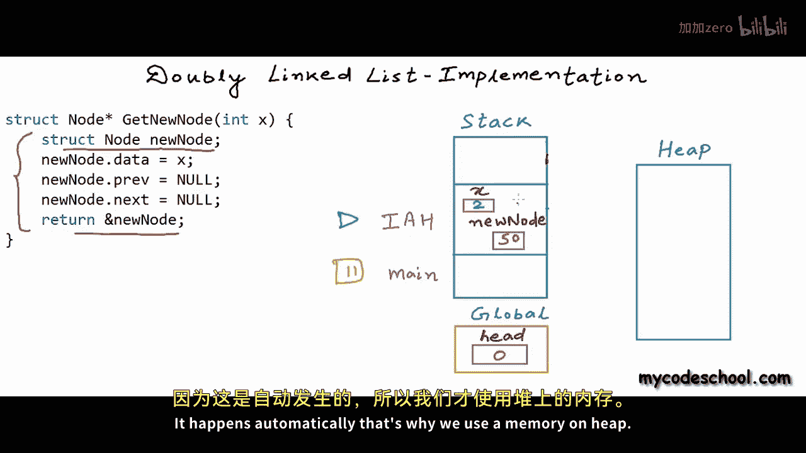

If I am using this code for creation of new node， then what I'm doing is I am declaring this variable new node not as struck node but as struck node as risk。

That is pointer to node， Im using malloc to create the actual node in heap section let's say I'm getting a 400 for this node now for a section of memory in heap for something in heap we cannot have a direct name the only way to access something in heap is through a pointer if we will lose this pointer we will lose this node。

Okay， so now what we are doing is using this point， a new node。

 which is local to get new node function。 We are accessing this node， filling in data， filling in。

Address fields。And now we are returning this address 400。Now when get new node is finishing。

 I am collecting the return， this address 400 in this variable in this local variable， new node。

 we are returning back to insert at head function at this line， head at this stage is null。

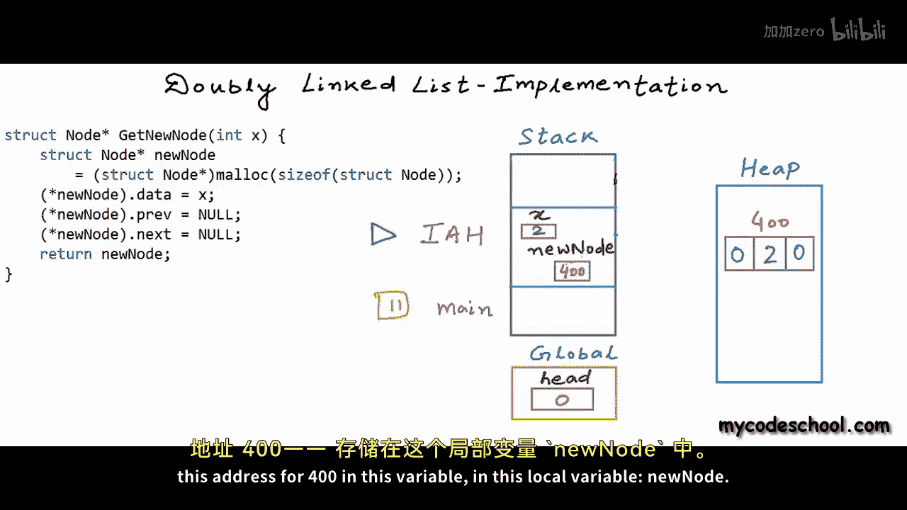

So now we are saying that set head is equal equal new node， head is a global variable。

 it is not going to be cleared for whole lifetime of application and now we are returning stack frame of insert at head will be cleared and this is what we finally have when we will make another call to insert at head once again fresh stack frames will be allocated in the execution of functions appropriate links will be created so our linked list will be modified accordingly。

I hope all of this is making some sense with another call to insert at head when everything will finish and control will return back to main。

 we can have a picture like this。 let's say I got a node at 600 right cell is for next node right cell is storing the address of next node and left cell is stor the address of previous node。

 so this will and this is what we will have。

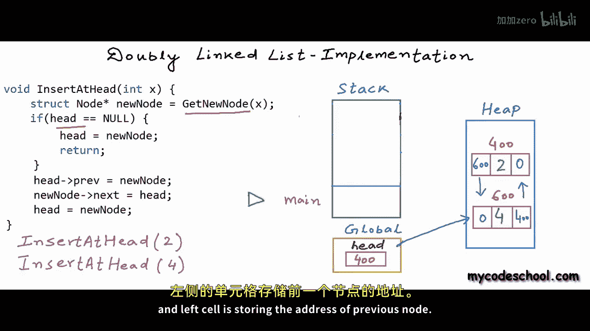

Let's now go and write rest of the functions Pri function will be same as print for singlely linkeded list。

 we will take a temporary pointer to node initially set it to head and then we will use this statement temp equal temp next to go to the next node and we will keep on printing in reverse print we will first go to the end node of the list using next pointer and then we will traverse backward。

Using this statement temp equall temparrow prev so we will use the previous pointer and while traversing backward we will print the data okay let's now test all these functions that we have written so far in the main function I am setting head as null and null to say that the list is empty initially and now I am writing a couple of insert statements。

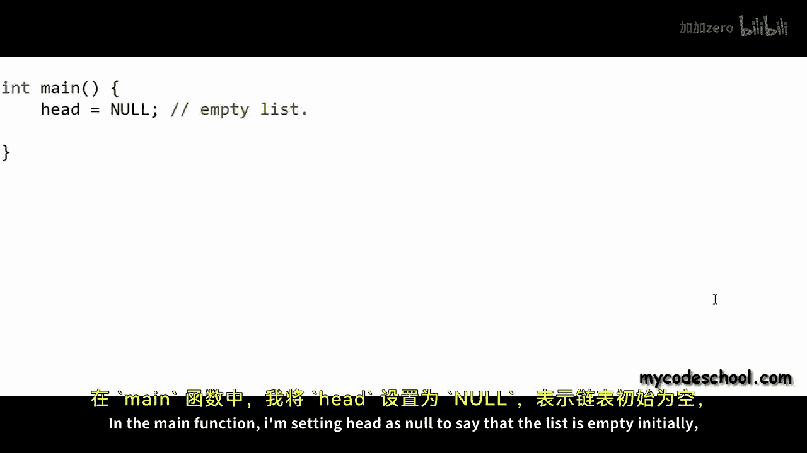

I'm making a couple of calls to insert at head function and after each call I'm printing the list both in forward as well as reverse direction。

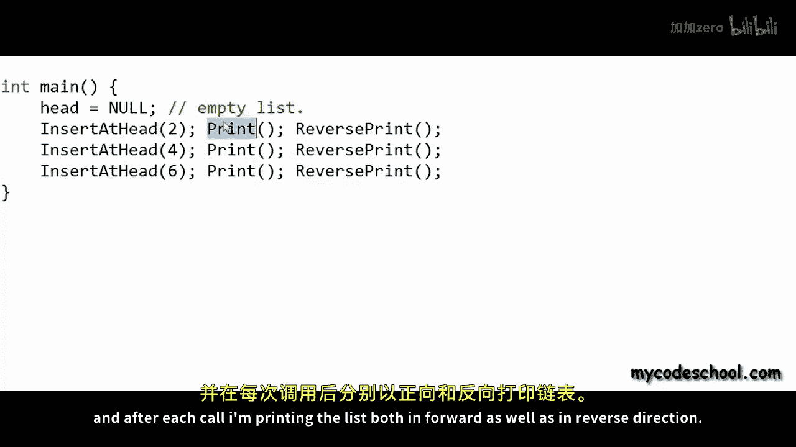

Let's run this code and see the output。This is what I'm getting and I think this is as expected there is one more function insert at tail that I had said I'll write if you have understood things so far it should not be very difficult for you to write this function insert at tail I'll leave this as an exercise for you I'll stop here now if you want to get this source code check the description of this video for a link in coming lessons we are going to talk about circular linked list and we will see some more interesting problems on linked list thanks for watching。

