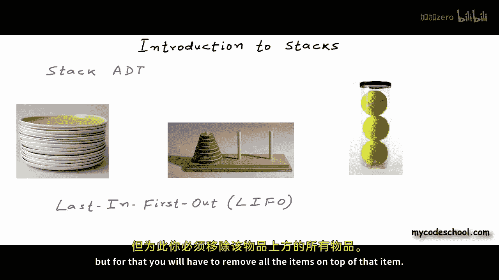

# mycodeschool【中英⚡数据结构｜Data Structures】 p14 p13 Data structures： Introduction to stack -BV1ckrLYREn2_p14-

In this lesson， we are going to introduce you to stack data structure。

Data structures as we know are ways to store and organize data in computers so far in this series we have discussed some of the data structures we have talked about arrays and linked lists now in this lesson we are going to talk about stacks and we are going to talk about stack as abstract data type or ADT when we talk about a data structure as abstract data type。

We talk only about the features or operations available with the data structure。

 we do not go into implementation details。So basically we define the data structure only as a mathematical or logical model we will go into implementation of stack in later lessons in this lesson we are going to talk only about stack ADT so we are only going to have a look at the logical view of stack stack as a data structure in computer science is not very different from stack as a way of organizing objects in real world。

Here are some examples of stack from real world first figure is of a stack of dinner plates。

 second figure is of a mathematical puzzle called Tower of Hanoi where we have three rods or three pegs and multiple disks and the game is about moving a stack of discs from one peg to another with this constraint that a disc cannot go on top of a smaller disk third figure is of a pack of tennis balls。

Stack basically is a collection with this property that an item in the stack must be inserted or removed from the same end that we call the top of stack in fact this is not just a property this is a constraint or restriction only the top of a stack is accessible and any item has to be inserted or removed from the top。

 a stack is also called last in first out collection most recently added item in a stack has to go out first。

In the first example you will always pick up a dinner plate from top of the stack and if you will have to put a plate back into the stack you will always put it back on top of the stack。

 you can argue that I can slip out a plate from in between without actually removing the plates on the top so the constraint that I should take out a plate always from the top is not strictly enforced。

 for the sake of argument this is fine， you can say this in other two examples when we have discs in a peg and tennis balls in this box that can open only from one side there is no way you can take out an item from in between any insertion or removal has to happen from top。

You cannot slip out an item from in between you can take out an item。

 but for that you will have to remove all the items on top of that item let's now formally define stack as an abstract data type。

A stack is a list or collection with the restriction that insertion and deletion can be performed only from one end that we call the top of stack let's notify the interface or operations available with stack ADT there are two fundamental operations available with a stack and insertion is called a push operation push operation can insert or push some item X onto the stack。

Another operation second operation is called P P is removing the most recent item from the stack。

 most recent element from the stack push and pop are the fundamental operations and there can be few more typically there is one operation called top that simply returns the element at top of the stack and there can be an operation to check whether a stack is empty or not。

So this operation will return through if the stack is empty， false otherwise。

So pushush is inserting an element on top of stack and pop is removing an element from top of stack。

 we can push or pop only one element at a time， all these operations that have written here can be performed in constant time or in other words the time complexity is big o of1。

Remember an element that is pushed or inserted last onto a stack is popped or removed first。

 so stack is called last in first out structure what goes in last comes out first last in first out in short is called Lifo logically a stack is represented something like this as a three sided figure as a container open from one side this is represented of an empty stack let's name this stack s。

Let's say this figure is representing a stack of integers right now the stack is empty。

 I will perform push and pop operations to insert and remove integers from the stack。

 I will first write down the operation here and then show you what will happen in the logical representation let's first perform a push I want to push number two onto the stack。

The stack is empty right now so we cannot pop anything after the push stack will look something like this。

 there is only one integer in the stack， so of course it's on top。Let's push another integer。

 This time I want to push number 10。And now let's say if we want to perform a pop。

 the integer at top right now is 10 with a pop， it will be removed from the stack。

Let's do a few more push。I just pushed 7 and 51 to the stack at this stage。

 if I will call top operation， it will return me number5 is empty will return me false。

At this stage a pop will remove5 from the stack as you can see the element。

 the integer which is coming last is going out first。

That's why we call stack last in first out data structure。We can pop till the stack gets empty。

One more P and stack will be empty。So this pretty much is stack data structure now one obvious question can be what are the real scenarios where stack helps us let's list down some of the applications of stack stack data structure is used for execution of function calls in a program we have talked about this quite a bit in our lessons on dynamic memory allocation and linked lists we can also say that stack is used for recursion because recursion is also a chain of function calls it's just that all the calls are to the same function to know more about this application you can check the description of this video for a link to my code schools lesson on dynamic memory allocation。

Another application of stack is we can use it to implement undo operation in an editor and we can perform undo operation in any text editor or image editor right now Im pressing control Z and as you can see some of the text that Ive written is getting cleared you can implement this using a stack。

Stack is used in a number of important algorithms， like for example。

 a compiler verifies whether parenthses in a source code are balanced or not using stack data structure。

 corresponding to each opening curly brace or opening parenthesis in a source code there must be a closing parenthesis at appropriate position and if parenthses in a source code are not put properly if they are not balanced。

 compiler should throw error， and this check can be performed using a stack。

We will discuss some of these problems in detail in coming lessons。

 just much as good for an introduction。In our next lesson， we will discuss implementation of stack。

 This is it for this lesson。 thanks for watching。

