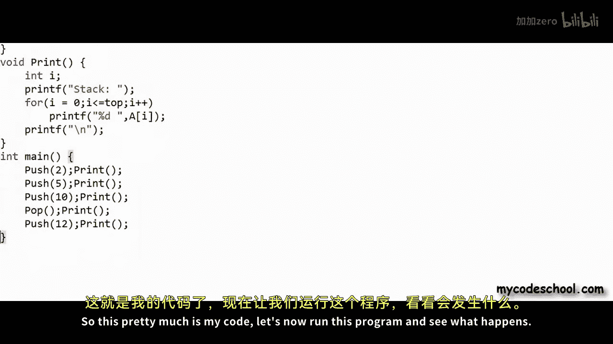
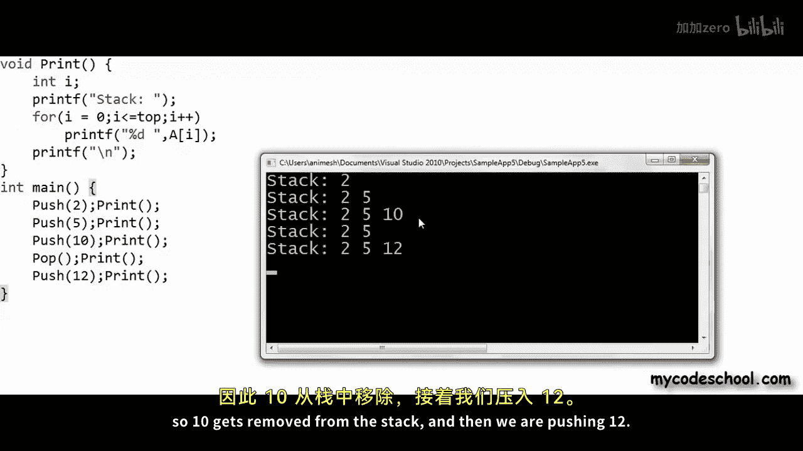
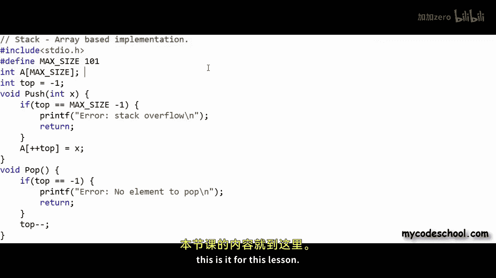

# mycodeschool【中英⚡数据结构｜Data Structures】 p15 p14 Data structures： Array implementation of stacks -BV1ckrLYREn2_p15-

In our previous lesson we introduced you to stack data structure。

 we talked about stack as abstract data type or ADT。

 as we know when we define a data structure as abstract data type。

 we define it as a mathematical or logical model， we define only the features or operations available with the data structure。

 and do not bother about implementation。Now， in this lesson。

 we will see how we can implement stack data structure。

We will first discuss possible implementations of stack and then we'll go ahead and write some code。

Okay， so lets get started as we had seen a stack is a list or collection with this restriction with this constraint。

 that insertion and deletion that we call push and pop operations in a stack。😊。

Must be performed one element at a time and only from one end that we call the top of stack so if you see if we can add only this one extra property。

 only this one extra constraint to any implementation of a list that insertion and deletion must be performed only from one end then we can get a stack。

 there are two popular ways of creating lists， we have talked about them a lot in our previous lessons。

 we can use any of them to create a stack， we can implement stacks using a or is and B linked lists。

Both these implementations are pretty intuitive， let's first discuss array based implementation。

Let's say I want to create a stack of integers， so what I can do is I can first create an array of integers。

 I am creating an array of 10 integers here。 Im naming this array a now I'm going to use this array to store a stack what I am going to say is that at any point some part of this array starting index 0 till an index marked as stop will be my stack。

We can create a variable named top to store the index of top of stack for an empty stack top is set as minus1。

Right now in this figure top is pointing to an imaginary minus1 index in the array and insertion or push operation。

Will be something like this。 I will write a function named push that will take an integer X as argument。

In push function， we will first increment top。And then we can fill in integer X at top index。

Here we are assuming that a and top will be accessible to push function even when they are not passed as arguments。

In C， we can declare them as global variables or in an object oriented implementation。

 all these entities can be members of a class。 I am only writing pseudo code to explain the implementation logic。

Okay， so for this example array that I am showing here right now。😊，Top is set as minus-1。

 so my stack is empty。 Let's insert something onto the stack。

 I will have to make call to push function。Let's say I want to insert number two onto the stack in a call to push first top will be incremented and then the integer past as argument will be written at top index so two will be written at index 0 let's push one more number let's say I want to push number 10 this time Once again top will be incremented 10 will now go at index 1 with each push the stack will expand towards higher indexdices in the array。

To pop an element from the stack， Im writing a function here for P operation。

 all I need to do is decrement top by one with a call to pop。

 let's say I'm making a call to pop function here。Top will simply be decremented whatever cells are in yellow in this figure are part of my stack we do not need to reset this value before popping if a cell is not part of stack anymore we do not care what garbage lies there next time when we will push we will modify it anyway so let's say after this pop operation I want to perform a push I want to insert number 7 onto the stack so top once again will be incremented and value at index2 will be overwritten the new value will be 7。

These two functions push and pop that I have written here will take constant time。

 we have simple operations in these two functions and execution time will not depend upon size of stack while defining stack Ed we had said that all the operations must take constant time or in other words the time complexity should be big o of1。

In our implementation here， both push and pop operations are big O of1 one important thing here we can push onto the stack only till array is not exhausted only till some space is left in the array。

We can have a situation where stack would consume the whole array。

 so top will be equal to highest index in the array。

 a further push will not be possible because it will result in an overflow。

This is one limitation with array based implementation to avoid an overflow we can always create a large En4 for that we will have to be reasonably sure that stack will not grow beyond a certain limit in most practical cases large N4 works but irrespective of that we must handle overflow in our implementation there are a couple of things that we can do in case of an overflow。

Push function can check whether array is exhausted or not。

 and it can throw an error in case of an overflow， so push operation will not succeed。

This will not be a really good behavior we can do another thing we can use the concept of dynamic array we have talked about dynamic array in initial lessons in this series what we can do is in case of an overflow we can create a new larger array。

We can copy the content of stack from older filled array into new array。

 if possible we can delete the smaller array。The cost of copy will be big o of n or in simple words。

 time taken to copy elements from smaller array to large array will be proportional to number of elements in stack or the size of the smaller array because anyway stack will occupy the whole array。

There must be some strategy to decide the size of large array Op strategy is that we should create an array twice the size of smaller array。

There can be two scenarios in a push operation。In a normal push。

 we will take constant time in case of an overflow。

 we will first create a large array twice the size of smaller array。

 copy all elements in time proportional to size of the smaller array。

 and then we will take constant time to insert the new element。

The time complexity of push with this strategy will be big O of1 in best case and big O of n in worst case in case of an overflow time complexity will be big O of n but we will still be big o of1 in average case if we will calculate the time taken for n pushes then it will be proportional to n。

 remember n is the number of elements in stack。Big O of n is basically saying that。

Time taken will be very close to some constant times n in simple words time taken will be proportional to n if we are taking C into n time for n pushes to find out average we will divide by n average time taken for each push will be a constant hence big of one in average case。

I will not go into all the mathematics of why its biggo of n for n pushes to know about it you can check the description of this video for some resources Okay so this pretty much is core of our implementation we have talked about two more operations in definition of stack ADT top operations simply returns the element at top of stack so top function will look something like this we will simply return the element at top index。

To verify whether stack is empty or not， this is another operation that we have defined。

 we can simply check the value of top if it is equal to minus1， we can say the stack is empty。

 we can return true else， we can return false。Sometimes pop and top operations are combined together。

 In that case， P will not just remove an element from top of stack。

 It will also return that element Laguage libraries in a lot of programming languages give us implementation of stack signature of functions in these implementations can vary slightly。

Okay， now I will quickly show you a basic implementation of stack in C in my C code here I'm going to write a simple array based implementation to create a stack of integers the first thing that I'm going to do is Im going to create an array of integers。

As global variable and the size of this array is max size where max size is defined by this macro as 101。

I will declare another global variable。nameamed top and set it as-1 initially remember top equal minus1 means an empty stack when a variable is not declared inside any function it is a global variable。

 it can be accessed anywhere so you do not have to pass it as argument to functions。

And now I will write all the operations。This is my push function I' am first incrementing top and then setting the value at top as x x is the integer to be inserted past as argument。

Instead of writing these two statements， I can write one statement。Like this。 and I will be good。

I'm using pre increment operators so increment will happen before assignment。

I also want to handle overflow we will have an overflow when top index will be equal to max size minus1 highest index available in the array。

In case of an overflow， I simply want to print an error message。Something like this。 And return。

So in this implementation， I'm not using a dynamic array。In case of overflow， push will not succeed。

Okay， now this is my pop function。I am simply decrementing top here also we must handle one error condition if stack is already empty。

 we cannot pop。So I'm writing these statements here， if top is equal to minus-1， we cannot pop。

 and I will print this error message that there is no element to pop and simply return。

Now let's write top operation。Top operation will simply return the integer at top index。

 So now my basic operations are all written here。 I have already written push pop and top。

In main function I will make some calls to push and pop and I want to write one more function named print and this is something that I am going to write only to verify that push and pop are happening properly。

 I will simply print all the elements in the stack in my main function after each push or pop operation I will make a call to print。

I'm writing multiple function calls two function calls on same line here because I'm short of space remember print function is not a typical operation available with stack Im writing it only to test my implementation so this pretty much is my code lets now run this program and see what happens this is what Im getting as output we are pushing three integers to 5 and 10 and then we are performing a pop so 10 gets removed from the stack and then we are pushing 12。

So this is a basic implementation of stack in C this is not an ideal implementation。

 an ideal implementation should be something like we should have a data type called stack and we should be able to create instances of it。

 we can easily do it in an object oriented implementation we can do it in C also using structures check the description of this video for link to source code of this implementation as well as of an object oriented implementation。

In our next lesson we will discuss linked to list implementation of stack。

 this is it for this lesson， thanks for watching。

