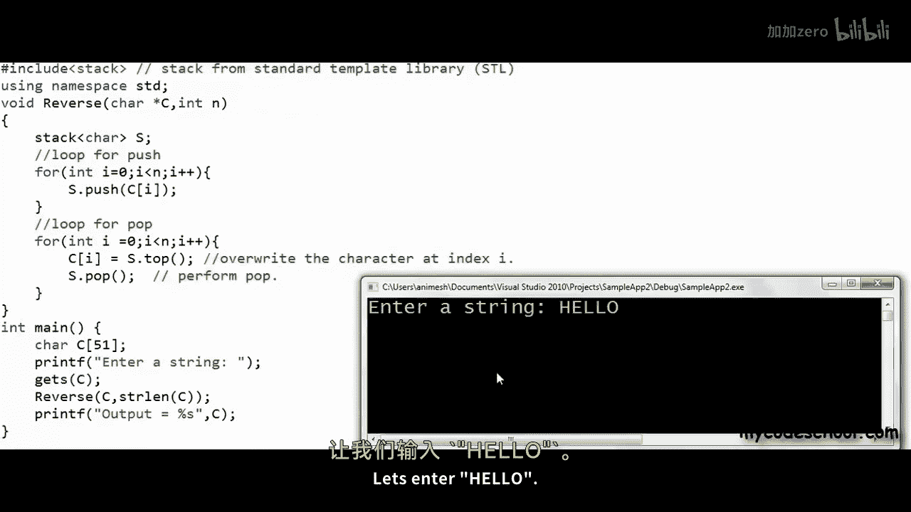

# mycodeschool【中英⚡数据结构｜Data Structures】 p17 p16 Reverse a string or linked list using stack. -BV1ckrLYREn2_p17-

In our previous lesson we saw how we can implement a stack。

 we saw two popular implementations of stack， one using arrays and another using linked list。

A warrior should not just possess a weapon； he must also know when and how to use it as programmers we must know。

In what all scenarios we can use a particular data structure in this lesson I am going to talk about one simple use case of stack a stack can be used to reverse a list or collection or simply to traverse a list or collection in reverse order。

I'm going to talk about two problems， a reversal of string。And reversal off linked list。

 and I'm going to solve both these problems using stack。Lets first discuss reversal of string。

 I have a string in the form of a character array here， I have this string hello。

 a string is a sequence of characters， this is a C style string in C a string must be terminated with a null character so this last character is a null character reersal means characters in the array should be rearranged like what I'm showing here in the right。

Nll character is used only to mark the end of string It is not part of string Okay there are a couple of efficient ways in which we can reverse a string。

 let's first discuss how we can solve this problem using a stack and then we will see how efficient it is What we can do is we can create a stack of characters I am showing logical representation of a stack here。

This is a stack of characters and right now it's empty and now what we can do is we can traverse the characters in the string from left to right and start pushing them onto the stack so first edge goes into the stack then the next character is E。

Then L， then we have another L， and then the last character is O。

Once all the characters in the string have gone into the stack。

 we can once again start at the zero widthth index now we need to write the topmost character in the stack at this index。

 we can get the topmost character by calling top operation and now we can perform a pop and now we can go to the next index。

 fill in whatever is at top of stack and perform a pop again， we can go on doing this。

Until stack is not empty， so all the positions in the characteristic array will be overwritten。

So finally we have reversed our string here。In a stack whatever goes in last comes out first。

 so if we will push a bunch of items onto a stack and once all items are pushed。

 if we will start popping we will get the items in reverse order first item pushed onto the stack will come out last。

Let's quickly write code for this logic。I'm going to write C+ plus here things will be pretty similar in other languages so it doesn't really matter what Im going to do in my code is I'm going to create a character array。

To store a string， and then I will ask user to input a string once I input the string。

I will make a call to a function named reverse passing it。

The array and length of string that I will get by making a call to string length function。

And finally， I'm printing the reversed string。Now I need to write the reverse function。

In reverse function I want to use a stack， a stack of characters。

 we have already seen how we can implement stack in C++ we can create a class named stack that would have an array of characters and an integer variable named top to mark the top of stack in a array and these variables can be private and we can work upon the stack using these public functions in reverse function we can simply create an object of stack and use it。

This class can be an array based implementation of stack or a linked list based implementation of stack。

 it doesn't really matter。In C++ and many other languages language libraries also give us implementation of stack in this program I am not going to write my own stack I am going to use stack from what we call standard template library in C++。

I will have to use this include statement hash include stack and now I have a stack class available to me to create an object of this class I need to write stack and within angular brackets。

 data type for which we want a stack， then after space， name or identifier。

With this one statement here I have created a stack of characters lets now write the core logic。

 this n in the signature of reverse function is number of characters in string。This array。

 as we know， array in C or C++ is always passed by reference through a pointer。

 this C followed by brackets is only an alternate syntax for asterisk C。

It's interpreted like this by the compiler。Okay， so now what I'm going to do is I'm going to run a loop starting0 till n minus1。

So I will traverse the string from left to right and as I traverse the string。

 I will push the character onto stack by calling push function。I will use a statement like this。

 Once push is done， I'll do another loop for pop。 I will run a loop with this variable I starting。

At 0， going till n -1， and I'll first set。C I top off stack， and then I will perform a P operation。

If you want to know more about functions available with stack in STL。

 like their signatures and how to use them， you can check the description of this video for some resources。

 this is all I need to do in my reverse function， let's run this code and see what happens。

I need to enter a string let's enter hello。This is what I get as output which seems to be correct。

 let's run this again and this time I want to enter my code school。

This looks all right too， so we seem to be good so this function is solving my problem of reversal lets now see how efficient it is。

Let us analyze its time complexity we know that all operations on stack take constant time so all these statements within loop inside loop will take constant time。

 the first loop is running n times and then the second loop is also running end times。

First loop will execute in big O of n and the second loop will also execute in big O of n the loops are not nested they are one after other。

 so in such scenario complexity of the whole function will also be big O of n。

Time complexity is big O of n， but we are using some extra memory here for stack。

 we are pushing all the characters in the string onto stack the extra space taken in stack will be proportional to number of characters in the string will be proportional to n so we can say that space complexity of this function is also big O of n。

In simple words， extra space taken is directly proportional to n。

 there are efficient ways to reverse a string without using extra space。

 the most efficient way probably would be to use just two variables to mark。

The start and end index in the string initially， let's say I' am using variables。 I and J initially。

 I for this example is 0， and J is 4。While I is less than J。

 we can swap the characters at these positions。And once we have swapped。

 we can increment I and decreement J。If I is less than J， we can swap again。And once again。

 increment I in decreement J。Now I is not less than J I is equal to J at this stage we can stop swapping and we are done this algorithm has space complexity big o of one we are using constant extra memory here。

Time complexity of this approach once again is big O of n。

We will do n by two swaps so time taken will be proportional to n definitely because of space complexity this approach is better than our stack approach sometimes when we know that our input will be very small and time and space is not much of concern we use a particular algorithm for ease of implementation for its being intuitive it' is clearly not the case when we are using stack to reverse our string but for this other problem reversal of linked list that we had said we will discuss using a stack gives us a neat and intuitive solution。

I have drawn a linked list of integers here。As we know。

 linked lists are collections of entities that we call nodes each node。Contains two fields。

 one to store data and other to store address of next node。

 I have assumedd that these nodes in this example here are at addresses 10105250 and 300 respectively identity of a linked list is address of the head node we typically store this address in a variable named head。

In an array it takes constant time to access any element。

 so whether it is the first element or last element， it takes constant time to access it。

 it is so because array is stored as one contiguous block of memory。

 so if we know the starting address of the array。Let's say the starting address of this array is 400 and size of each element in the array character takes1 byte。

 so for this example each element is1 byte， then we can calculate a address of any element so we know that a4 is at 400 plus 4 or 404。

But in a linked list， nodes are stored at disjoint locations in memory。To access any node。

 we have to start at the head node so we can't do something as simple as having two pointers at start and end and accessing the elements。

We have already seen in this series two possible approaches that can be used to reverse a linked list。

 one was an iterative solution where we go on reversing links as we traverse the linked list using some temporary variables Another solution was using recursion。

The time complexity of iterative solution is big O of n space complexity is big O of1 in recursive solution。

 we do not create a stack explicitly。But recursion uses the stack in computers memory that is used to execute function calls In such a case we say that we are using implicit stack stack is not being created explicitly。

 but still we are using an implicit stack I will come back to this and explain in detail the time complexity of recursive solution once again is big of n。

But the space complexity is big O of n this time。Space complexity is also big O of n。

Now let's see how we can use an explicit stack to solve this problem once again I have chronological representation of stack here right now the stack is empty。

In a program， this will be a stack of type pointer to node。

What I'm going to do now is I'm going to traverse this linked list using a temporary pointer to node。

 the temporary variable will initially point to head when we will go to a particular node we will push the address of that node onto the stack。

So first00 will go to stack and now we will move to the next node now 150 will go in stack and now we will go to 250。

And then to the last node at 300。We are showing addresses here in the stack。

 but basically the objects that we are pushing are pointers to node。Or in other words。

 references to nodes if node is defined like this in C++。

We will have to use these statements to traverse the linked list and push all the references let's say head is appointed to node which Im assuming is a global variable that will store the address of head node I'm using a temporary variable that is point to node initially I am storing the address of head node in this temporary variable and then I'm running a loop and I am traversing the linked list and as I'm traversing I'm pushing the reference onto stack。

Once all the references are pushed onto stack， we can start popping them and as we will pop them we will get references to nodes in reverse order it would be like going through the list in reverse order while traversing the list in reverse order we can build reverse links the first thing that I'll do is I'll take a temporary variable that will be pointed to node and store the address of address at the top of stack which right now is 300 now I will set head as this address so head now becomes 300 and then I will pop。

I'm running you through this example here as I'm writing code。Head and temp right now are both 300。

And now I will run a loop like this like what I have written here。While stack is not empty。

 this function empty returns true if stack is empty。

Im using stack from standard template library in C++ so while stack is not empty I' am going to say that set temp dot next as address at top of stack basically Im using this pointer to node temp to data reference and set this particular address field。

Right now top is 250， so I am building this reverse link next statement is a pop and in the next statement I am saying temp equal temp dot next it means temp will now point to this node at 250 stack is not empty so loop will execute again。

We are writing address here now。😔，Then we should pop and then move to 150 using this statement temp equal temp dot next。

Now we are building this link popping and then oops， this should have been 150。

And with the next temp equal temp dot next。We are going here。

Even though we have built this link by setting this field here。

This node is still pointing to this guy。Because the stack is empty now we will exit the loop after the loop。

After exit from the loop， I have written one more line， temp dot next equal null。

So I'm setting the last。Link part of last node in reversed list as null。

Finally this is my reverse function I have assumed that head is a global variable and it's appointed to node if you want the complete source code you can check the description of this video for a link using a stack in this case is making our life easier reversing a linked list is still a complex problem try to just print the elements of linked list in reverse order if you will use a stack it will be really easy I will stop here for this lesson if you if you want to know what I meant by implicit stack you can once again check the description of this video for some resources so this is it for this lesson thanks for watching。

