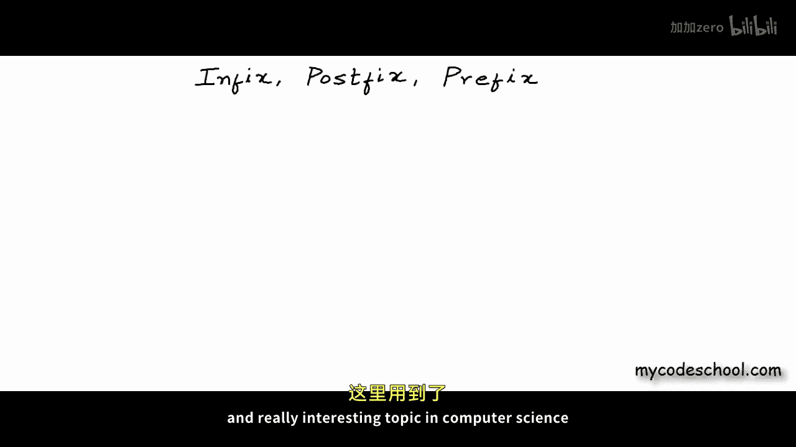
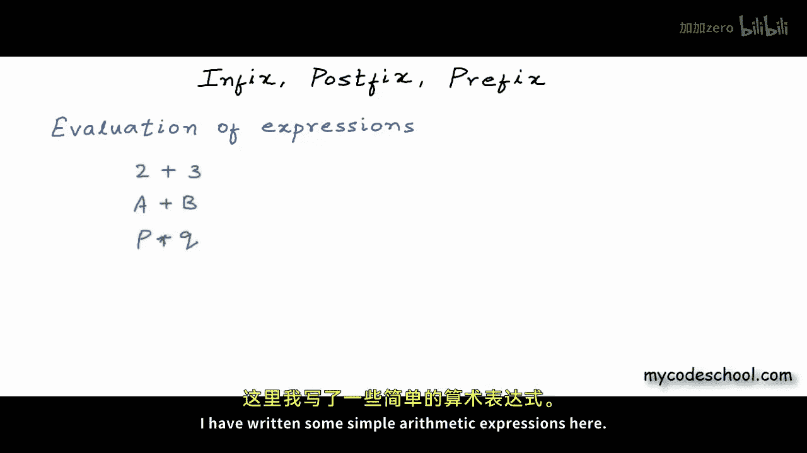
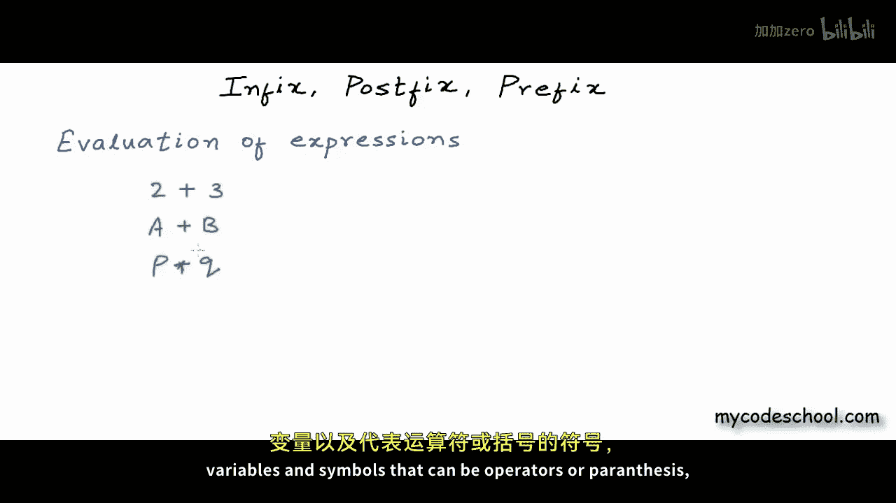

# mycodeschool【中英⚡数据结构｜Data Structures】 p19 p18 Infix, Prefix and Postfix -BV1ckrLYREn2_p19-

Hello everyone in this lesson we are going to talk about one important and really interesting topic in computer science where we find application of stack data structure and this topic is evaluation of arithmetic and logical expressions so how do we write an expression I have written some simple arithmetic expressions here and expression can have constants variables and symbols that can be operators or parenthses and all these components must be。

