# mycodeschool【中英⚡数据结构｜Data Structures】 p20 p19 Evaluation of Prefix and Postfix expressions using stack -BV1ckrLYREn2_p20-

In our previous lesson we saw what prex and postfi expressions are。

 but we did not discuss how we can evaluate these expressions in this lesson we will see how we can evaluate prefix and postfi expressions。

Algorithms to evaluate prefix and postfix expressions are similar but I am going to talk about postfix evaluation first because it is easier to understand and implement and then I'll talk about evaluation of prefix okay so let's get started I have written an expression in infi form here and I first want to convert this to postfix form as we know in infi form operator is written in between opera。

And we want to convert to post fixed in which operator is written after opera we have already seen how we can do this in our previous lesson。

 we need to go step by step just the way we would go in evaluation of infi。

We need to go in order of precedence and in each step we need to identify opera of an operator and we need to bring the operator in front of the operators what we can actually do is we can first resolve operator precedence and put parenthesis at appropriate places in this expression we first do this multiplication this first multiplication then we' will do this second multiplication then we will perform this addition。

And finally， the subtraction， okay， now we will go one operator at a time Opera for this multiplication operator are A and B。

 so this a asterisk B will become。ABS to disk。Now next we need to look at this multiplication。

 this will transform to CDS risk。And now we can do the change for this edition。

 the two opera are these two expressions in Post fix。

So I'm placing the plus operator after these two expressions。Finally， for this last operator。

 the opera are this complex expression and this variable E。

So this is how we will look like after the transformation。

 finally when we are done with all the operators， we can get rid of all the parenthesesis。

They are not needed in post fixed expression。This is how you can do the conversion manually we will discuss efficient ways of doing this programmatically in later lessons。

 we will discuss algorithms to convert inF to prefix or postfix in later lessons in this lesson we are only going to look at algorithms to evaluate prefix and postfix expressions okay so we have this postfi expression here and we want to evaluate this expression。

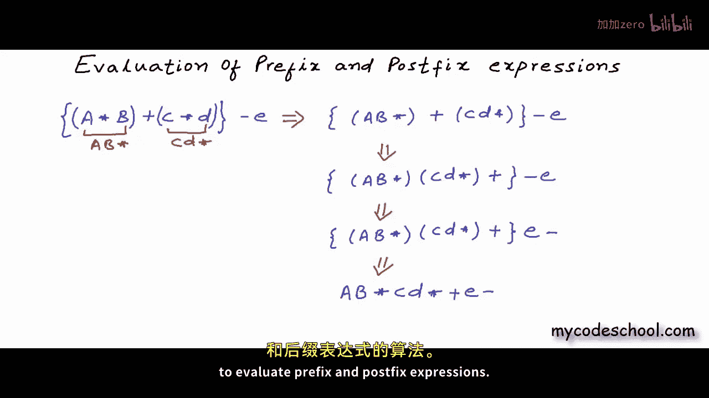

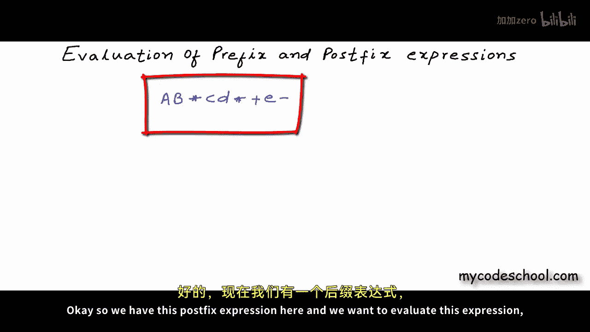

Let's say for these values of variables， A， B， C， D， and E。

 So we have this expression in terms of values to evaluate。

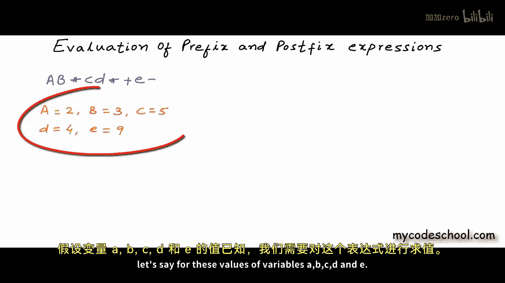

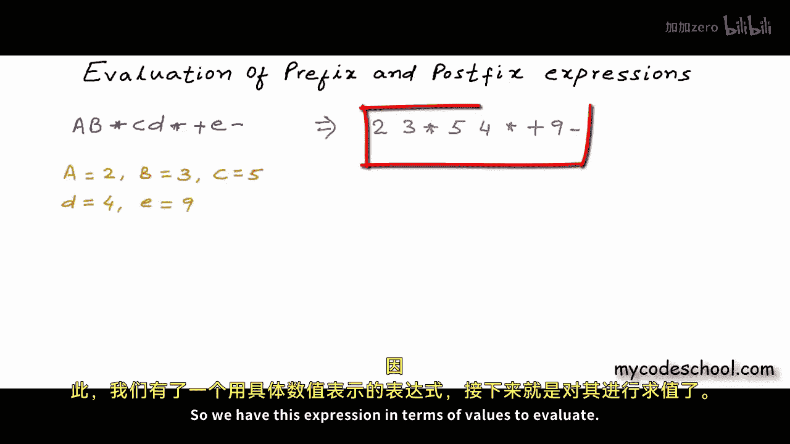

I'll first quickly tell you how you can evaluate a postF expression manually。

 what you need to do is you need to scan the expression from left to right and find the first occurrence of an operator。

 like here multiplication is the first operator in postF expression opera of an operator will always lie to its left for the first operator。

 the preceding two entities will always be operator。

You need to look for the first occurrence of this pattern opera operator operator in the expression and now you can apply the operator on these two opera and reduce the expression so this is what I'm getting after evaluating23 asterisk now we need to repeat this process till we are done with all the operators once again we need to scan the expression from left to right and look for the first operator if the expression is correct it will be preceded by two values so basically we need to look for first occurrence of this pattern Opera opera operator so now we can reduce this we have6 and then we have5 into420。

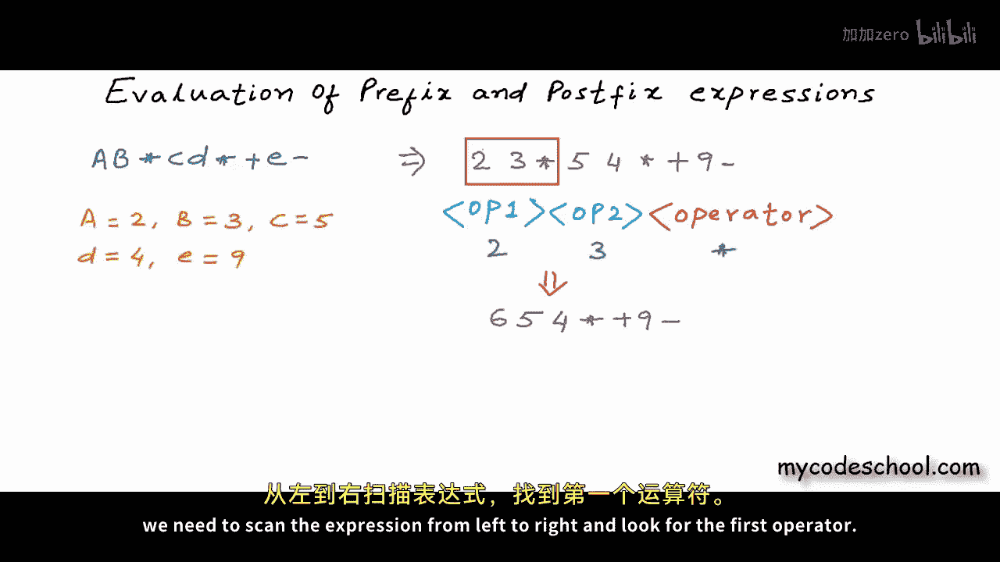

We are using space as telelimit here， there should be some space in between two operas okay so this is what I have now once again I look for the first occurrence of opera opera and operator。

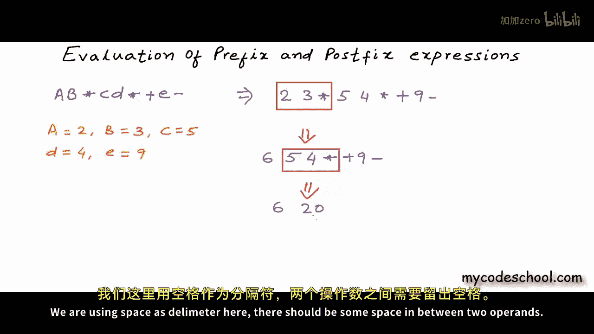

We will go on like this till we are done with all the operators。

When I'm saying we need to look for first occurrence of this pattern opera opera and operator。

 what I mean by opera here is a value and not a complex expression itself。

 the first operator will always be preceded by two values and if you will give this some thought you will be able to understand why。

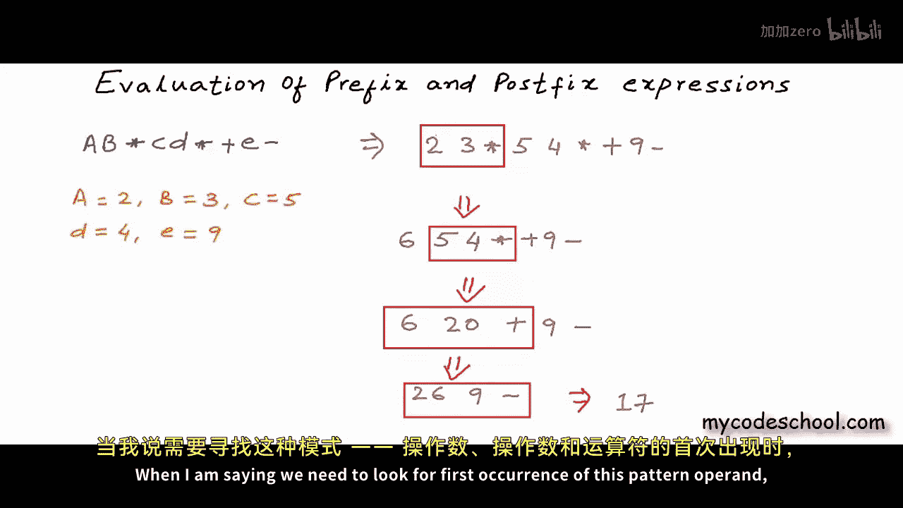

If you can see in this expression we are applying the operators in the same order in which we have them while parsing from left to right。

 so first we are applying this leftmost multiplication on two and3 then we are applying the next multiplication on5 and4 then we are performing the addition and then finally we are performing this subtraction and whenever we are performing an operation we are picking the last two preceding the operator in the expression so if we have to do this programmatically if we have to evaluate a postfi expression given to us in a string like this and let's say operators and operators are separated by space we can have some other delimitter like comma also to separate operators and operator now what we can do is we can parse the string from left to right。

In each step in this parsing in each step in this scanning process we can get a token that will either be an operator or an opera。

 what we can do is as we passse from left to right we can keep track of all the opera seen so far and I'll come back to how it will help us so I'm keeping all the opera seen so far in a list。

The first entity that we have here is2 which is an opera so it will go to the list next we have three which once again is operating so it will go into the list next we have this multiplication operator。

Now this multiplication should be applied to last two opera preceding it。

 last two opera to the left of it because we already have the elements stored stored in this list。

 all we need to do is we need to pick the last two from this list and perform the operation。

It should be two into three。with this multiplication we have reduced the expression this 2。

3 asterisk has now become6， it has become an opera that can be used by an operator later we are at this stage right now that I am showing in the right Ill continue the scanning next we have an opera well push this number 5 onto the list next we have four。

Wwhich once again will come to the list and now we have the multiplication operator and it should be applied to the last two operas in the reduced expression。

And we should put the result back into the list。 This is the stage where we are right now。

So this list actually is storing all the opera in the reduced expression preceding the position at which we are during passing now for this edition we should take out the last two elements from the list and then we should put the result back next we have an opera end。

We are at this stage right now。Next we have an operator， this subtraction。

 we will perform this subtraction and put the result back。Finally。

 when I'm done scanning the whole expression， I'll have only one element left in the list and this will be my final answer。

 this will be my final result。This is an efficient algorithm we are doing only one pass on the string representing the expression and we have our result the list that we are using here if you could notice is being used in a special way we are inserting opera one at a time from one side and then to perform an operation we are taking out opera from the same site whatever is coming in last is getting out first this whole thing that we are doing here with the list can be done efficiently with a stack。

which is nothing but a special kind of list in which elements are inserted and removed from the same side in which whatever gets in last comes out first。

 it is called a last in first out structure。Let's do this evaluation again。

 I haveronological representation of stack here and this time I'm going to use this stack I'll also write pseudocode for this algorithmm I'm going to write a function named evaluate postfi that will take a string as argument let's name this string expression Exp for expression in my function here I'll first create a stack now for the sake of simplicity let's assume that each operator or operator in the expression will be of only one character so to get a token or operator we can simply run a loop from0 till length of expression minus1 so expression I will be my opera or operator If expression I is operator I should put push it onto the stack else if expression I is operator we should do two pop operations in the stack store the value of the opera in some variable I'm using variables named op1 and O2。

Let's say this P function will remove an element from top of stack S and also return this element。

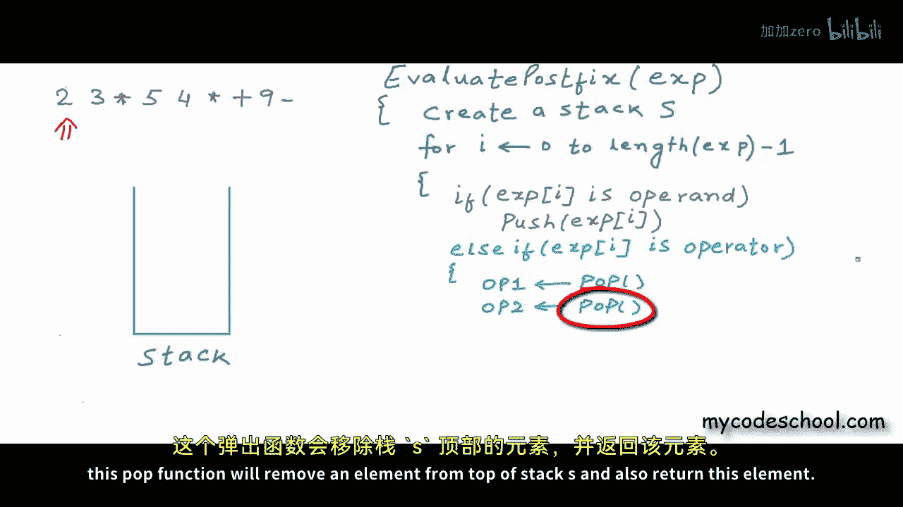

Once we have the two operations， we can perform the operation。

 I'm using this variable to store the output， and let's say this function will perform the operation。

Now the result should be pushed back onto the stack if I have to run through this expression with whatever code I have right now。

 then first entity is 2 which is opera so it should be pushed onto the stack next we have three once again this will go to the stack next we have this multiplication operator so we will come to this LCif part of the code。

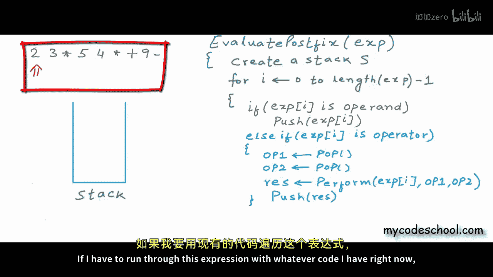

I'll make first pop and I'll store three in this variable O1 well actually this is the second opera so I should say this one is O2 and next one will be OP1 once I have popped these two elements I can perform the operation as you can see I'm doing the same stuff that I was doing with the list the only thing is that I' am showing things vertically stack is being shown as a vertical list I am inserting or taking out from the top now Ill push the result back onto the stack。

Now we will move to the next entity which is opera， it will go into the stack。

 next4 will also go into the stack and now we have this multiplication。

 so we will perform two P operations。After this operation is performed。

 result will be pushed back next we have addition， so we will go on like this。

 We have 26 pushed onto the stack now now it's 9 which will go in。

And finally we have this subtraction， 26 minus 9， 17 will be pushed onto the stack。

At this stage we will be done with the loop we are done with all the tokens all the operators and operators the top of stack can be returned as final result at this stage we will have only one element in the stack and this element will be my final result you will have to take care of some parsing logic in actual implementation opera can be a number of multiple digits and then we will have delimiter like space or comma so you will have to take care of that parsing opera or operator will be some task if you want to see my implementation you can check the description of this video for a link okay so this was postfix evaluation let's now quickly see how we can do prefix evaluation。

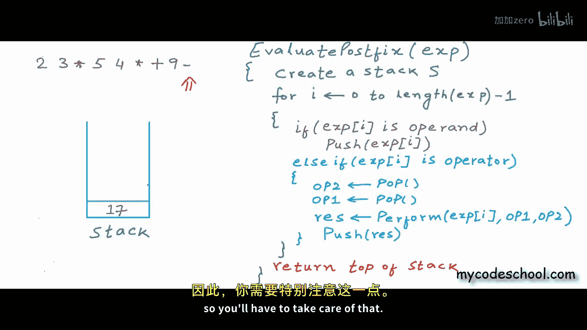

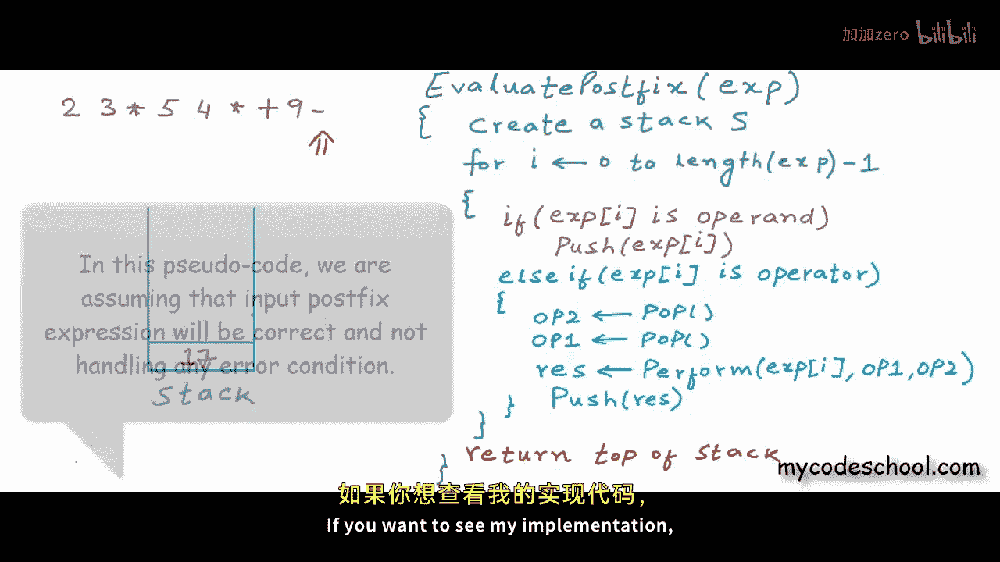

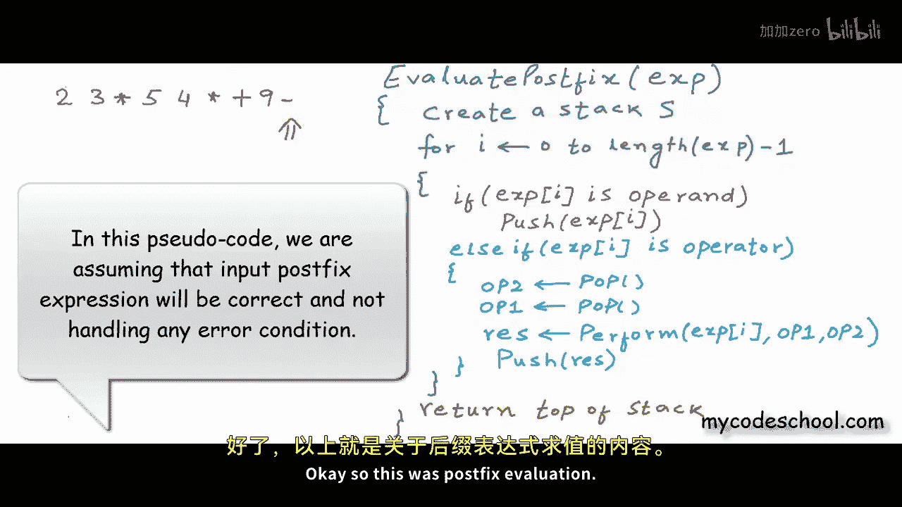

Once again， I've written this expression in infi form and I'll first convert it to prefix。

We will go in order of precedence， I first put this parentheesis。

 this two asterisks 3 will become asterisk 23， this 5 into 4 will become asterisk 54。

And now we will pick this plus operator whose operations are these two prefix expressions。Finally。

 for the subtraction operator， this is the first opera and this is the second opera。In the last step。

 we can get rid of all the parenthsesis， so this is what I have finally。

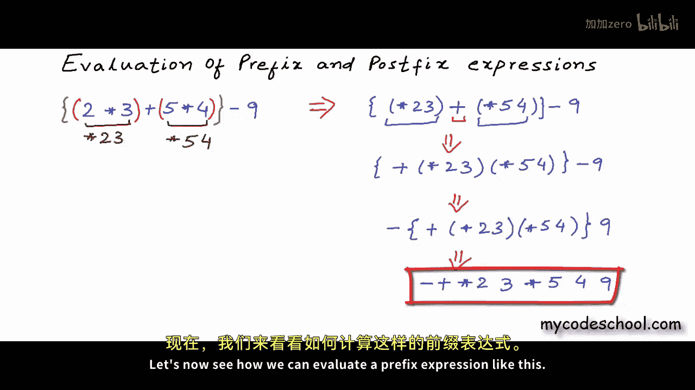

Let's now see how we can evaluate a prefix expression like this we will do it just like postfix this time all we need to do is we need to scan from right so we will go from right to left once again we will use our stack if its an opera we can push it onto the stack so here for this example9 will go onto the stack。

And now we will go to the next entity in the left， it's4， once again we have an opera。

 it will go onto the stack， now we have five，5 will also be pushed onto the stack。

 and now we have this multiplication operator。At this stage we need to pop two elements from the stack this time the first element popped will be the first opera in post fixed the first element popped was the second opera。

 this time the second element popped will be the second opera for this multiplication first opera is5 and second opera is4 this order is really important for multiplication。

The order doesnt matter， but for say division or subtraction this will matter result 20 will be pushed onto the stack and we will keep moving left now we have3 and 2 both will go onto the stack and now we have this multiplication operation。

3 and2 will be popped and their product6 will be pushed。

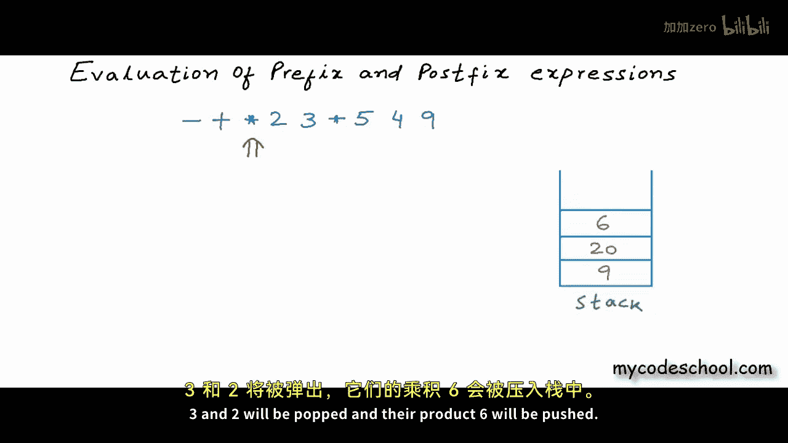

Now we have this edition， the two elements at top are 20 and6。

 they will be popped and there some 26 will be pushed。

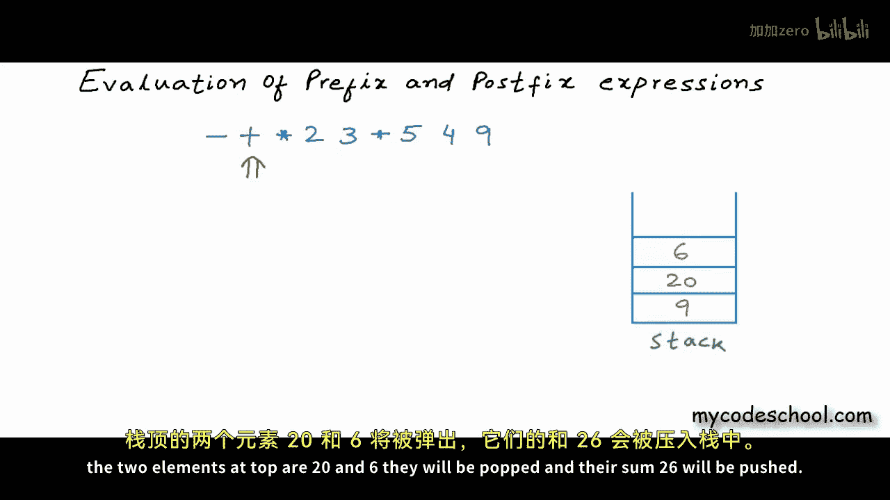

Finally we have this subtraction 26 and 9 will be popped out and 17 will be pushed and finally this is my answer Tfixs evaluation can be performed in a couple of other ways also。

 but this is easiest and most straightforward。

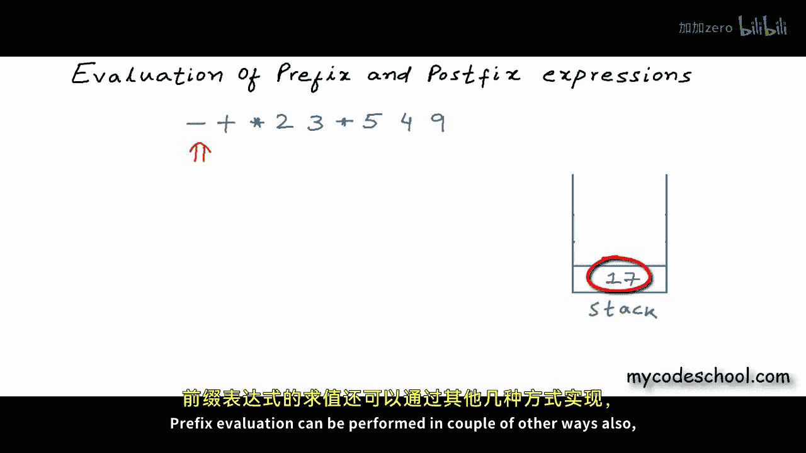

Okay so this was prefix and postfix evaluation using stack in coming lessons we will see efficient algorithms to convert infi to prefix or postfix。

 this is it for this lesson， thanks for watching。

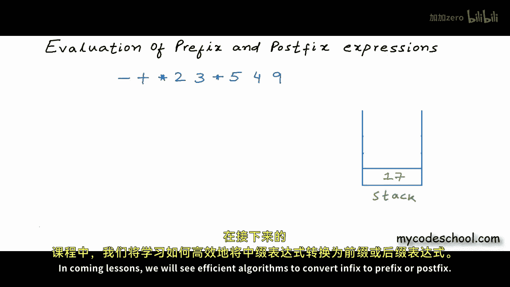