# mycodeschool【中英⚡数据结构｜Data Structures】 p23 p22 Data structures： Array implementation of Queue -BV1ckrLYREn2_p23-

In our previous lesson we introduced you to Q data structure we talked about Q as abstract data type or ADT as we know when we talk about a data structure as abstract data type we define it as a mathematical or logical model we define only the features or operations available with the data structure and do not go into implementation details in this lesson we are going to discuss possible implementations of Q I will do a quick recap of what we have discussed so far a Q is a list or collection with this restriction with this constraint that insertion can be performed at one end that we call rear of Q or tail of Q and deletion can be performed at other end that we call the front of Q or the head of Q and insertion in queue is called in Q operation。

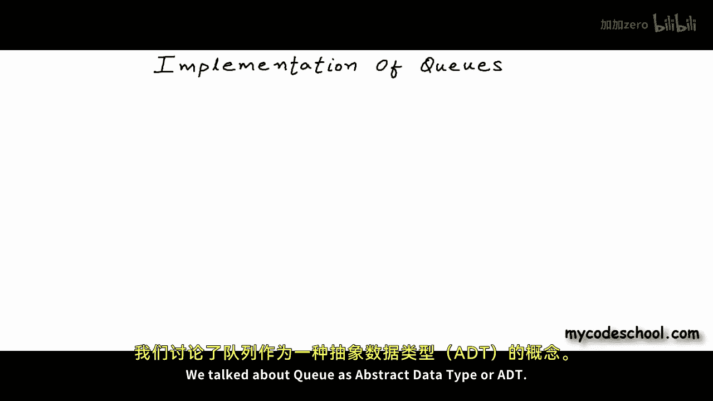

A deletion is called Dque operation。I have defined QAT with these four operations that I have written here。

In an actual implementation， all these operations will be functions。

Front operation should simply return the element at front of Q it should not remove any element from the Q is empty should simply check whether Q is empty or not。

 and all these operations must take constant time and Q the Q or looking at the element at front the time taken for any of these operations must not depend upon a variable like number of elements in Q or in other words time complexity of all these operations must be big o of1。

Okay so let's get started we are saying that a queue is a special kind of list in which elements can be inserted or removed one at a time and insertion and removal happen at different ends of the we can insert an element at one end and we can remove an element from the other end。

 just the way we did it for stack we can add these constraints or extra properties of Q to some implementation of a list and create a queue there are two popular implementations of Q we can have an array based implementation and we can have linked list based implementation。

Let's first discuss array based implementation let's say we want to create a Q of integers What we can do is we can first create an array of integers I have created an array of 10 integers here I have named this array a now what I am going to do is I' am going to use this array to store my Q what I am going to say is that at any point some part of the array starting an index marked as front till an index marked as rear will be my Q in this array I' am showing front of the Q towards left and rear towards right in earlier examples I was showing front towards right and rear towards left。

Doesn't really matter any side can be front and any side can be rear。

It's just that an element must always be added from rear side and must always be removed from front。

So， if at any stage a segment of the array from an index marked as front till an index marked as rear is my Q and rest of the positions in the array are free space that can be used to expand the Q to insert an element to N Q。

 we can increment rear so we will add a new cell in the Q towards rear end and in this cell we can write the new value element to be inserted can come to this position。

I'll fill in some values here at these positions， so we have these integers in the queue and let's say we want to insert number5。

To insert we will increment rear， of course there should be an available cell in the right。

 an available empty cell in the right and now we can write value 5 here。After insertion。

 new real index is 7。And the value at index 7 is 5 now the means we must remove an element from front of the Q in this example here a Dq operation should remove number2 from the queue to theq we can simply increment front because at any point only the cells starting front till rear are part of my queue by incrementing front I have discarded index 2 from the Q and we do not care what value lies in a cell that is not part of the Q we we will include a cell in the Q we will overwride the value in that cell anyway。

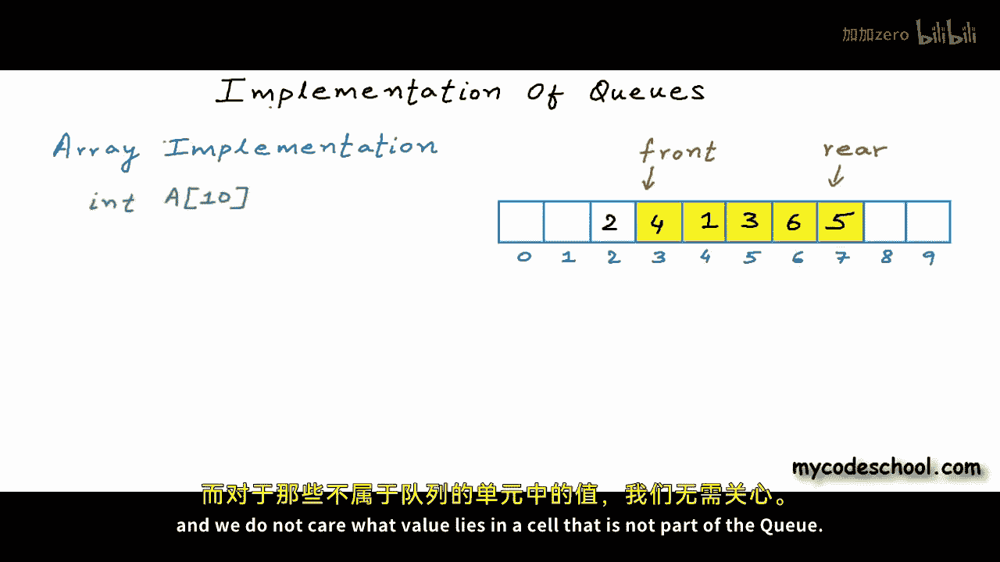

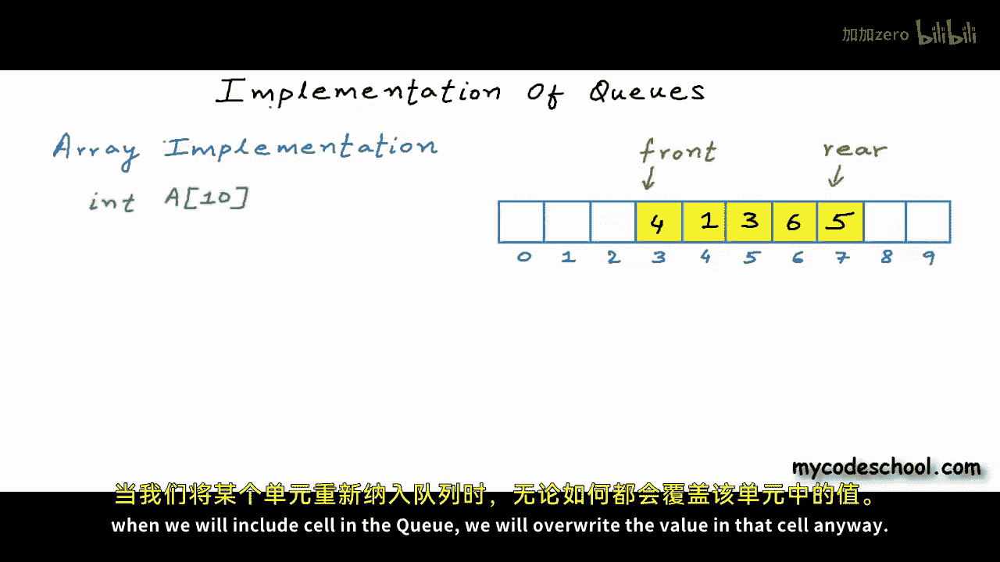

So just in crementing front is good enough for Dque operation。

Let's quickly write pseudo code for whatever we have discussed so far。

In my code I will have two variables named front and rear and initially I'll set them both as minus1。

 let's say for an emptyQ， both front and rear will be minus1。To check whether Q is empty or not。

 we can simply check the value of front and rear and if they are both minus1。

 we can say that Q is empty I just wrote is empty function here minus1 is not a valid index for an empty Q there will be no front and rear in our implementation we are saying that we will represent empty state of Q by setting both front and rear as minus1。

Now let's write the NQ function Nq will take an integer x as argument。

 there will be a couple of conditions in Nq if rear is already equal to maximum index available in RAA。

 we cannot insert or Nq an element in such scenario we can return and exit。

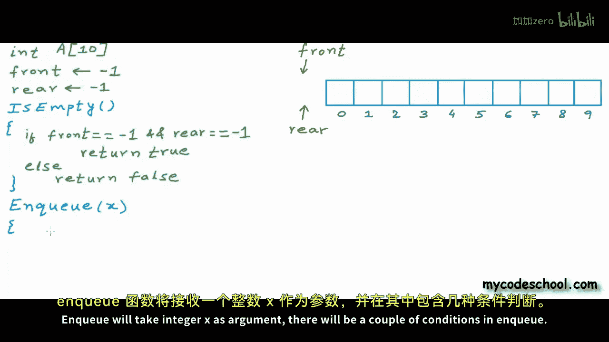

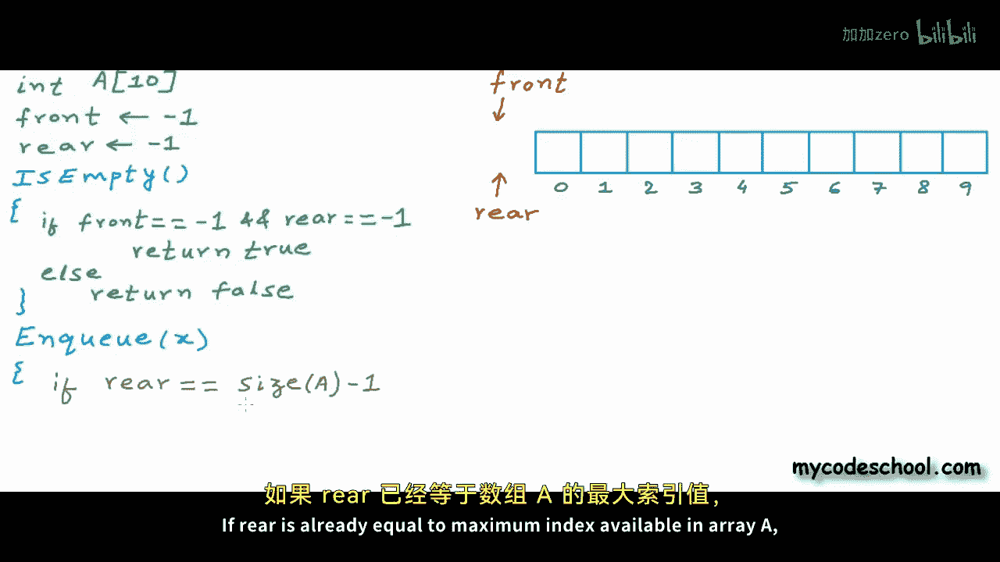

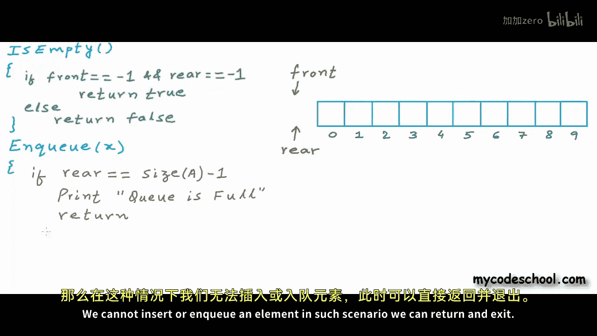

I would rather use a function named is full to determine whether Q is full or not。

 if Q is already full we can't do much， we should simply exit else if Q is empty we can add a cell to the Q。

 we can add cell at index 0 in the Q。

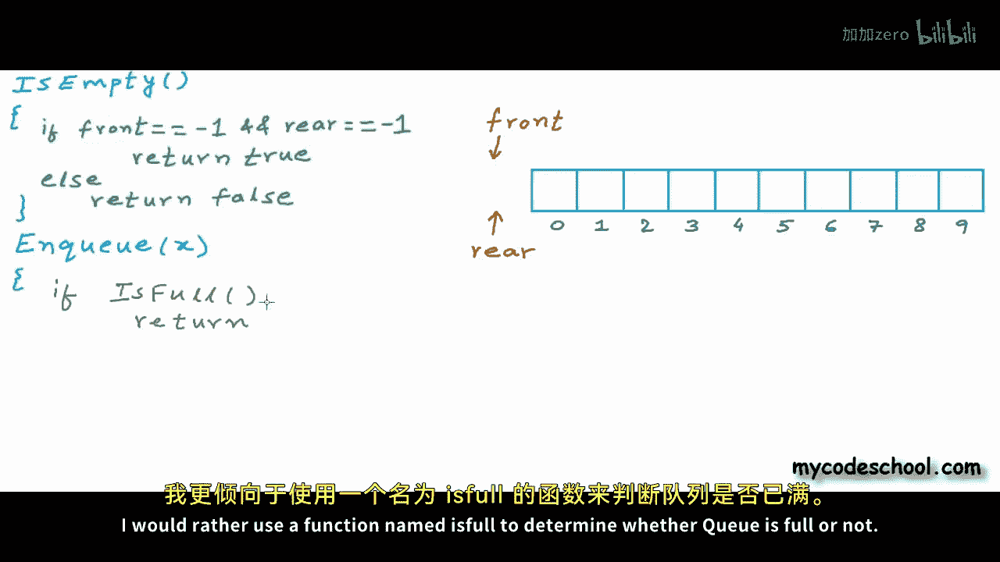

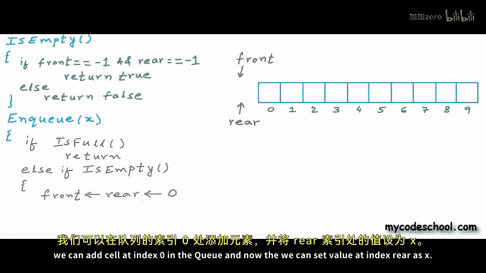

And now we can set the value at index rear as x。In all other cases， we can first increment rear。

And then we can fill in value x at index3。I can get this statement area equal X outside these two conditional statements。

Because it's common to them， so this is my NQ function。

In the example array that Im showing here let's en queue some integers。

 I'll make calls to Nq function and show you the simulation in the figure here。

 let's say first I want to insert number two in the queue I'm making a call to Nq function passing number two as argument the Q is empty so。

We will set both front and rear as0， now we will come to this statement。

 we will write value 2 at index 0， so this is my Q after one Nq operation front and rear of the Q is same let's make another call to Nq this time I want to insert number5。

This time Q is not empty， so rear will be incremented。

 we have added a cell to the Q by incrementing rear and now we will write the value 5 at the new rear index。

Let's en one more number。 I have encured 7。

Let's now write theq operation There will be a couple of cases in Dq If the Q is already empty we cannot remove an element in this case we can simply print or throw an error and return or exit there will be one more special case if the Q has only one element in this case front and rear will not be minus1 but they will both be equal because we are already checking for minus one case in is empty function in the previous if in this elses if we can simply check whether front is equal to rear or not if this is the case a d will make the Q empty and to mark the Q as empty we need to set both front and rear as minus1 this is what we had said that we will represent an empty Q by marking both front and rear as minus1 in default or normal scenario we will simply increment front we should really be careful about corner cases。

In any implementation， that's where most of the bugs come。 Okay， so this finally is my DQ function。

In this example here at this stage let's say we want to perform a DQ Q is not empty and we do not have only one element in the Q。

 so we will simply increment front before incrementing we could set the value in this cell at index0 as something。

 but the value in a cell that is not part of Q anymore， doesnt really matter。

At this stage it doesn't really matter what we have at index 0 or index 3 or any other index apart from the segment between front and rear。

 when we will add a cell in the queue we will overwride the value in that cell anyway。

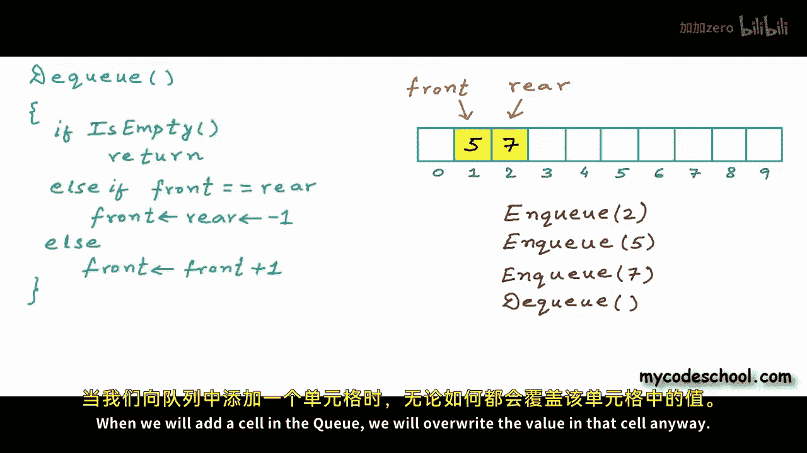

Let's now perform some mode in Qs and theqs。 I'm in queuing 3， and then I'm inqueuing1。

We teach NQ， we are in crementing rear， I just performed some more NQ here。

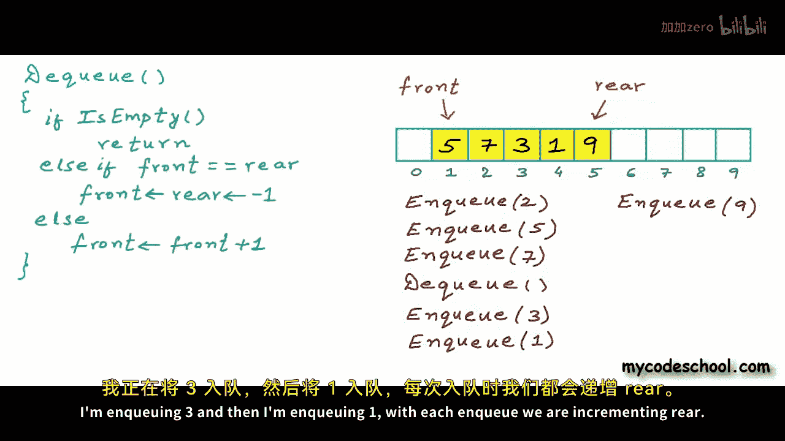

Now lets perform a Dq if I perform one more in queue here rear will be equal to maximum index available in the array lets en one more now at this stage we cannot in an element anymore because we cannot increment rear。

Nque operation will fail now there are two unused cells right now。

 but with whatever logic we have written we cannot use these two cells that are in the left of front。

 in fact this is a real problem as we will de more and more all the cells left off front index will never be used again they will simply be wasted。

Can we do something to use these cells？

Well， we can use the concept of a circular array circular array is an idea that we use in a lot of scenarios。

The idea is very simple as we traverse an array， we can imagine that there is no end in the array。😊。

From0 we can go to1 from1 we can go to2 and finally when we will reach the last index in the array like in this example when we are at index 9 the next index for me is index 0 we can imagine this array something like this remember this is only a logical way of looking at the array in circular interpretation of array if I'm pointing to a position and my current position is I then the next position or next index will not simply be i plus 1 it will be i plus1 modo the number of elements in array or the size of array let's say n is the number of elements in array。

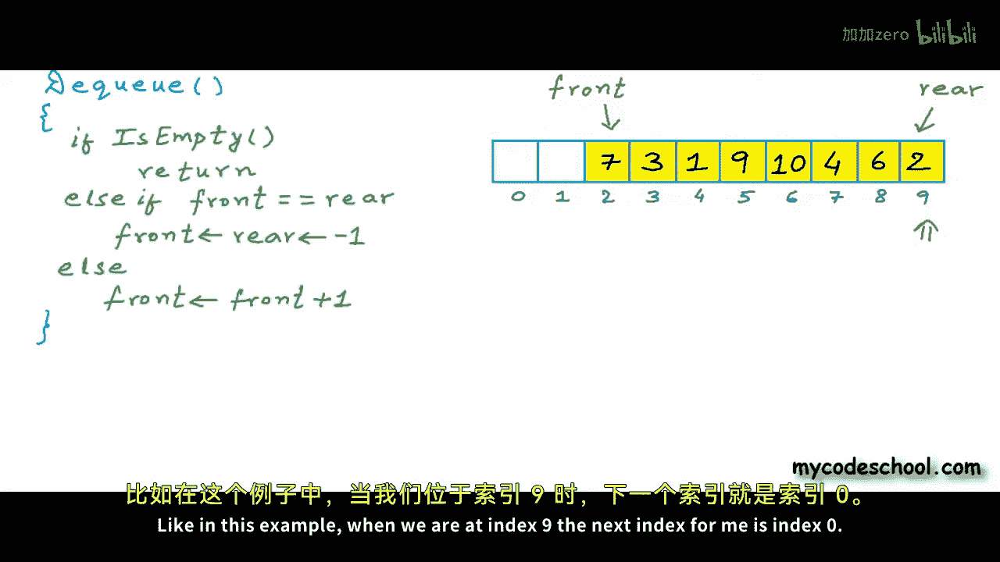

Then the next position will be i plus 1 modulo n， the modulo operation will get us the remainder upon dividing by n for any i other than n minus 1。

 this modulo operation will not have any effect but for i equal n minus1 next position will be n modulo n which will be equal to 0 when you divide the number by itself the remainder is 0。

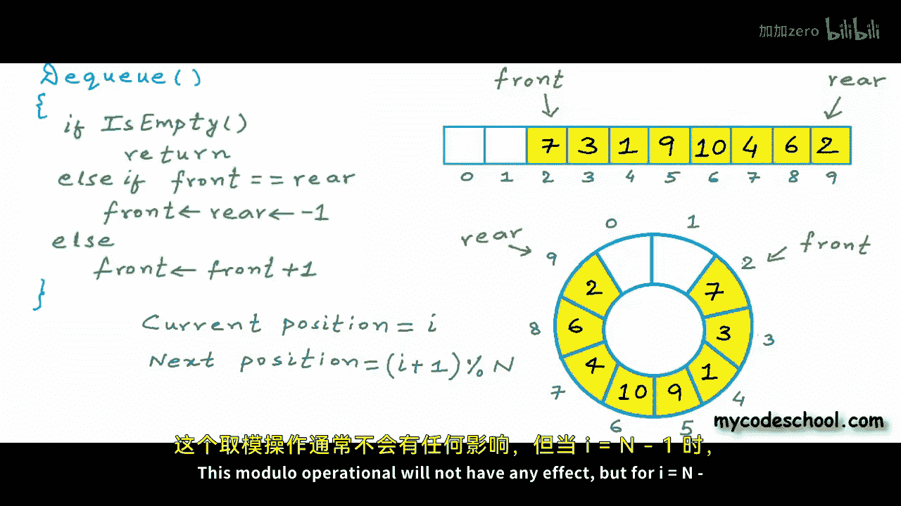

Previous position in circular interpretation of array will be i plus n minus 1 modular n。

 we could simply say i minus1 modular n just to make sure this expression inside the parenthesis is always positive。

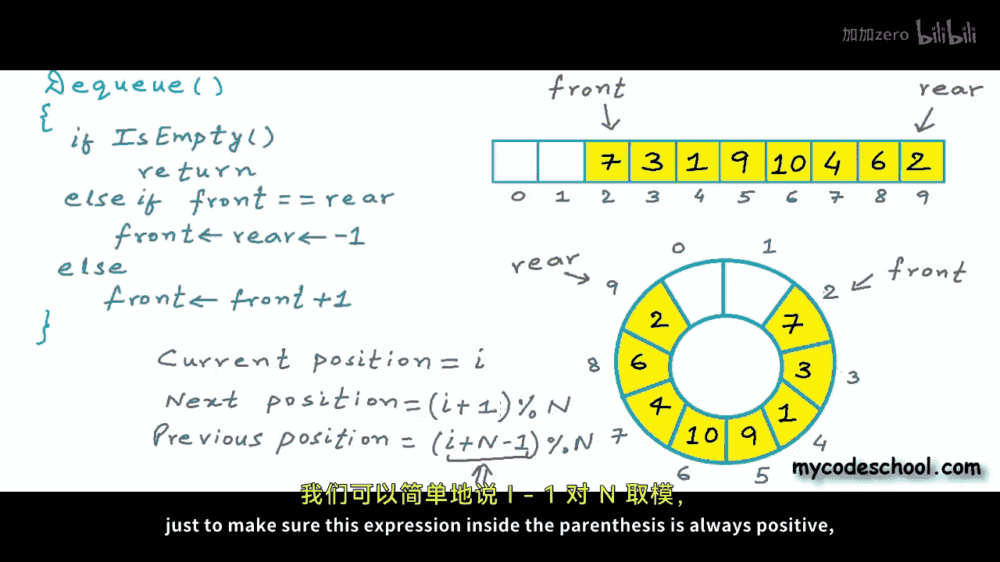

I'm adding n here， give this some thought you should be able to get why it should be i plus n minus1 modular n。

 Now with this interpretation of array， we can increment rear in an nq operation as long as there is any unused cell in the array I'm going to modify functions in my pseudocode now is empty will remain the same we are still saying that for an emptyq front and rear will be minus1 let's scroll down and come to nq Now in circular interpretation I will call my Q full when the position next to rear in circular interpretation that we will calculate as rear plus1 modular n will be equal to front so we will have a situation like this right now the next position to rear in circular interpretation is front so there is no unused cell the complete array is exhausted nothing will change in this condition。

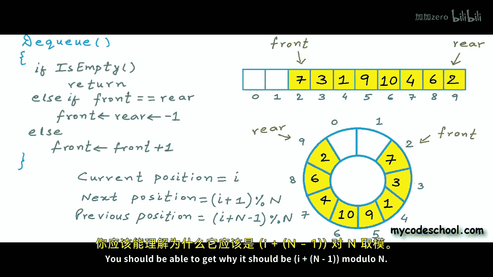

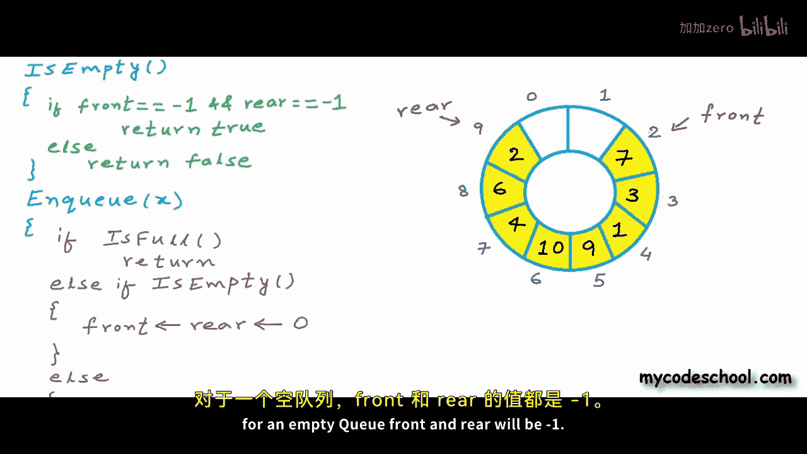

If  Q is empty we can simply set front and rear as0 in the last else condition we will increment rear like this。

 we will say rear is equal to rear plus 1 modular n where n is number of elements in the array。

With this much change my Nq function is good now lets make a call to Nq and insert something in this array here I want to insert number 15。

We will come to this last else condition hereea right now is 9。

 so this expression will be 9 plus 1 modo n n is 10 here， the size of this array a is 10 here。

This will evaluate20 now my new rear is0， I will write number 15 here。

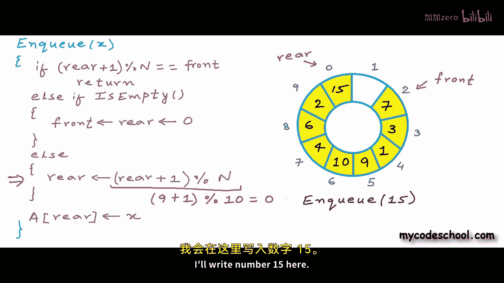

Let's now see what we need to do in theq function Nothing will change in the first two conditions if Q is already empty or if there is only one element in the Q we will handle these cases in same manner in the final L when we are incrementing front we need to increment it in a circular manner so we will say front equal front plus1 modulo n where n is number of elements in the array。

 total number of elements in the array or size of array now let's perform a dq we will come to this condition front right now is2 so this will be 2 plus1 modulo 10 one more cell is available to us now。

This much is the core of our implementation front operation will be really straightforward we simply need to return the element at front index here also we first need to check whether queue is empty or not we should return。

A front only when front is not equal to minus1 all these operations。

 all these functions that have written here will take constant time their time complexity will be big o of1 we are performing simple arithmetic and assignments in the functions。

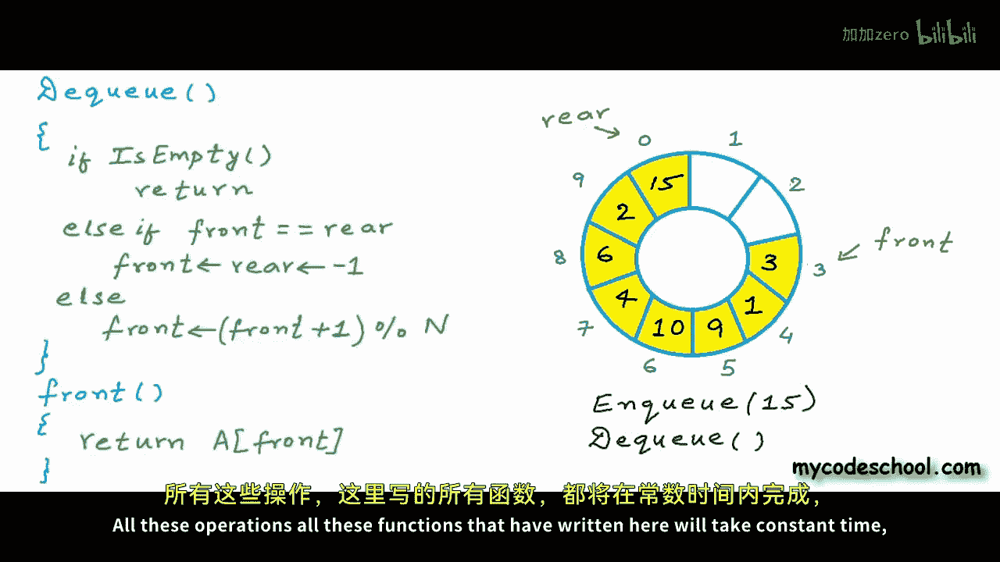

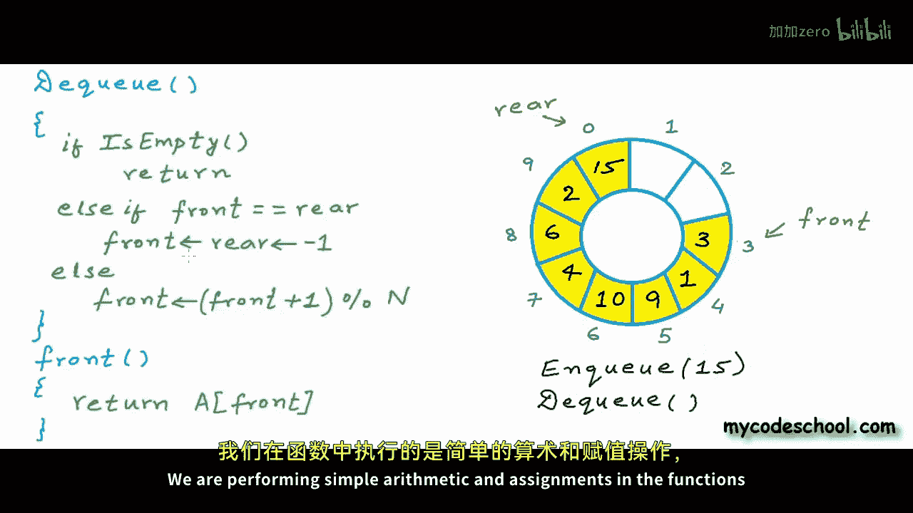

And not doing anything costly like running a loop， so time taken will not depend upon size of Q or some other variable。

I leave this here， it should not be very difficult converting this pseudocode to a running program in a language of your choice if you want to see my code you can check the description of this video for a link thanks for watching。

