# mycodeschool【中英⚡数据结构｜Data Structures】 p24 p23 Data structures： Linked List implementation of Queue -BV1ckrLYREn2_p24-

In our previous lesson we saw how we can implement Q using arrays now in this lesson we will see how we can implement Q using linked list Q as we know from our previous discussions is a structure in which whatever goes in first comes out first Q data structure is a list or collection with this restriction that insertion can be performed at one end and diletion can be performed at other end。

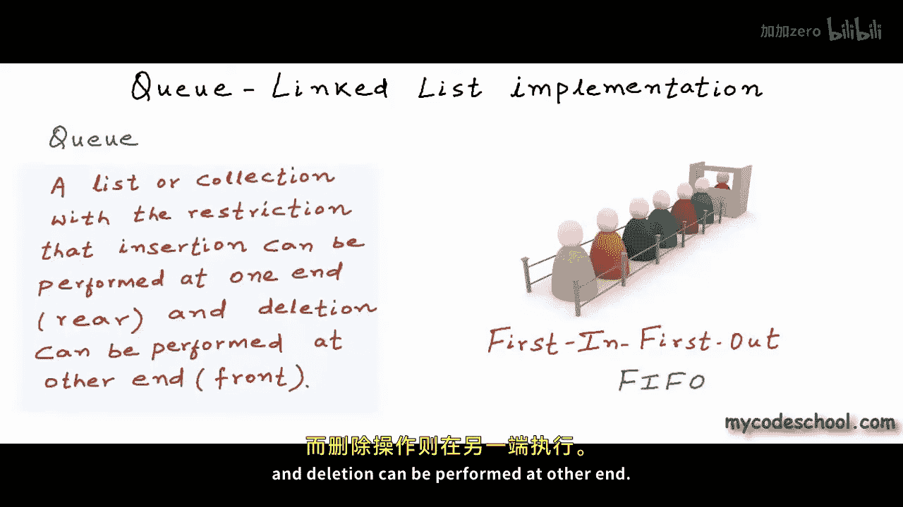

These are typical operations that we define with Q and insertion is called in Q operation and a deition is called theq front operation front function should simply return the element at front of list and is empty should check whether。

Q is empty or not， and all these operations must take constant time that time complexity should be big O of1。

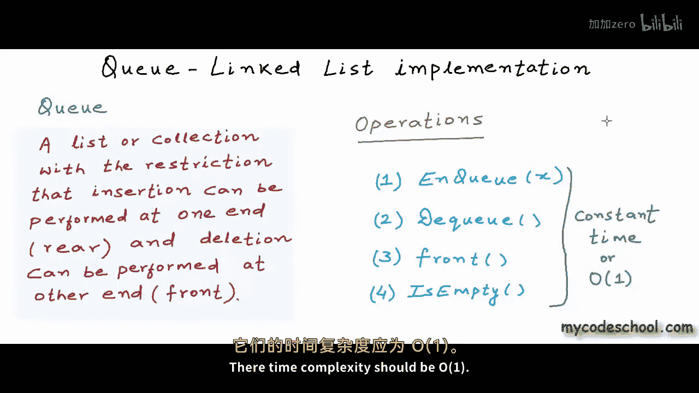

When we were implementing Q with arrays， we used the idea of a circular array to implement Q。

 then in this case we have a limitation， the limitation is that array will always have a fixed size。

And once all the positions in the array are taken， once the array is exhausted。

 we have two options we can either deny insertion so we can say that the queue is full and we cannot insert anything now or what we can do is we can create a new larger array and copy the elements from previous array to the new larger array。

Which will be a costly process。 We can avoid this problem if we will use linked list to implement Q。

Please note that this representation of circular array that I'm showing here is only a logical way of looking at an array we can show this array like this also as I was saying in an array implementation we will have this question what if array gets filled and we need to take care of this we can either say Q is full or we can create a new large array and copy elements from previous field array into this new large array the time taken for this copy operation will be proportional to number of elements in field array or in other words we can say that the time complexity of this copy operation will be big o of n there is another problem with array implementation we can have a large enough array and Q may not be using most of it like right now in this array90% of the memory is unused memory is an important resource and we should always avoid blocking memory unnecessarily It's not that some amount of unused memory will be a real problem in a modern day machine It's just that。

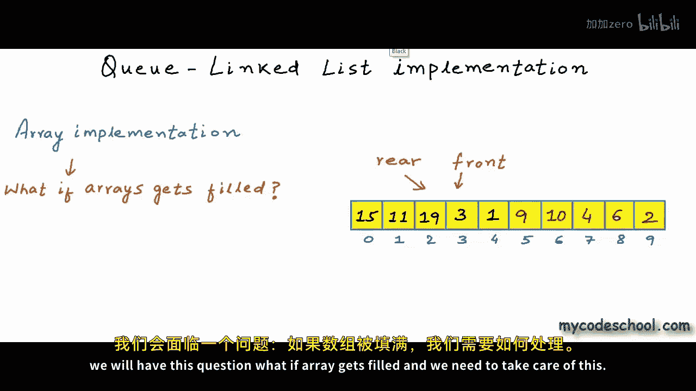

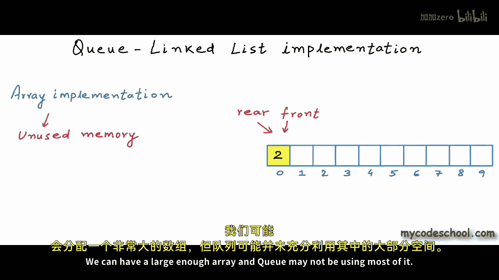

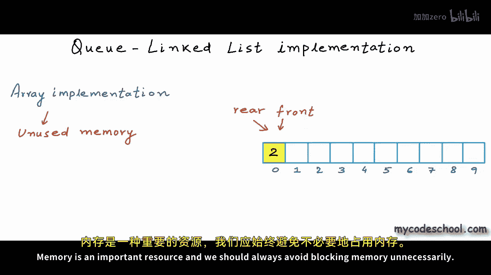

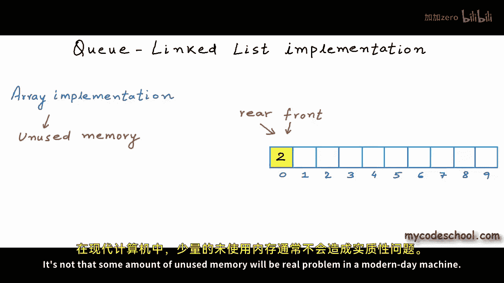

While designing solutions and algorithms， we should analyze and understand these implications。

Let's now see how good we will be with a linked list implementation I have drawn logical view of a linked list of integers here coming back to basic definition of Q as we know a Q is a list or collection with this constraint with this property that an element must always be inserted from one side of the queue that we call the rear of Q and an element must always be removed from the other side that we call the front of Q it's really easy to enforce this property in a linked list a linked list as we know。

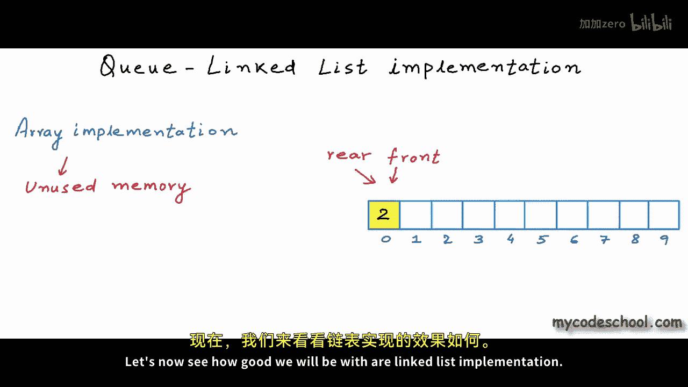

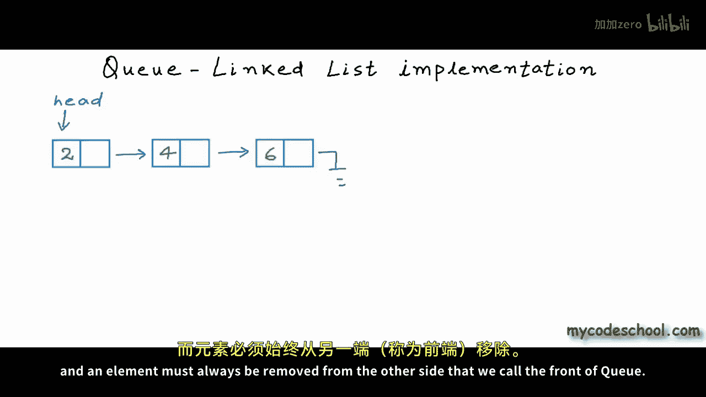

Is a collection of entities that we call nodes and these nodes are stored at non contiguous locations in memory Each node contains two fields。

 one to store data and another to store address of the next node or reference to the next node。

Let's assume that node in this figure are at addresses 100，200 and 300 respectively。

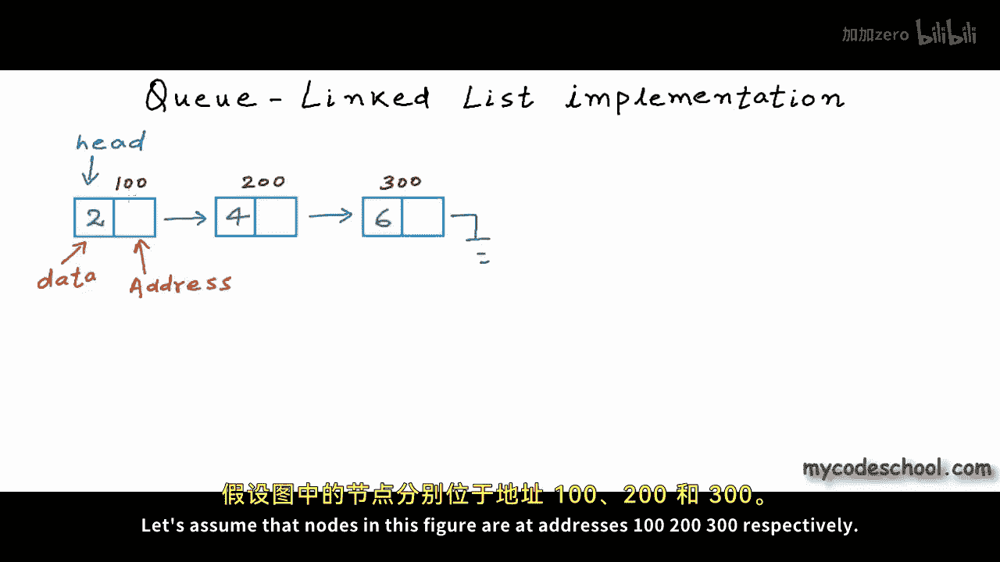

I have also filled in the address fields the identity of linked list that we always keep with us is address of the head node。

 we often name the pointer or reference variable that would store this address head。

Okay so now now we are saying that we want to use linked list to implement Q these are the typical operations that we define with a Q we can use a linked list like a Q we can pick one side for insertion or Nq operation so a node in the linked list must always be inserted from this side the other side will then be used for D so if we are picking head side for Nq operation or Dq must always happen from tail if we are picking tail for Nq operation then theq must always happen from head whatever side we are picking for whatever operation we need to be taking care of one requirement and the requirement is that these operations must take constant time or in other words the time complexity must be big O of1 as we know from our previous lessons the cost of insertion or removal from head side is big O of1。

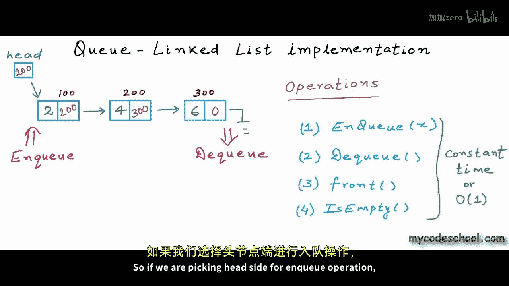

But the cost of insertion or removal from tail side is big O of n so here is the deal in a normal implementation of linked list if we will insert at one side and remove from other side then one of these operations inq or deq depending on how we are picking the side will cost us big O of n but the requirement that we have is that both these operations must take constant time so we definitely need to do something to make sure that both in Q and theq operations take constant time let's call this site front and this side rear so I want to enq a node from this side and I want to deq from this side。

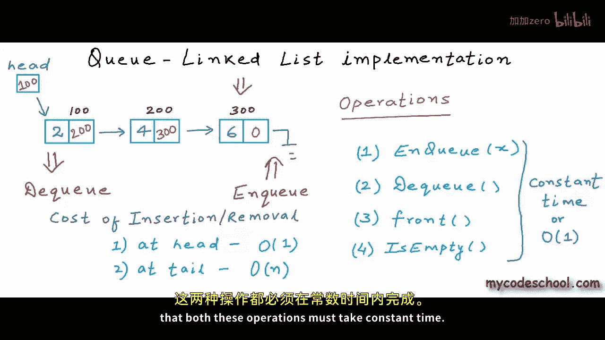

We are good for theque operation because removal from front will take constant time。

 but insertion or N queue operation will be big O of n。

Let's first why insertion at tail will be costly and then maybe we can try to do something to insert at rear end what we will have to do is first we will have to create a node we have a new node here let's say I've got this node at address 350。

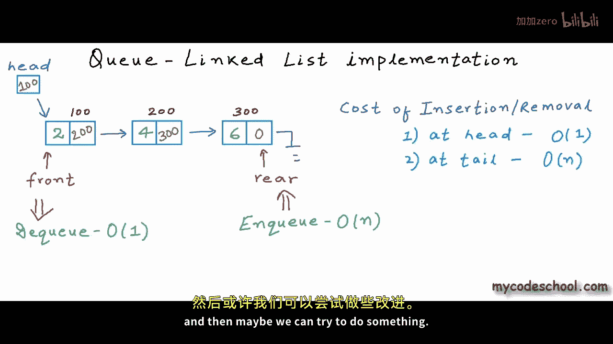

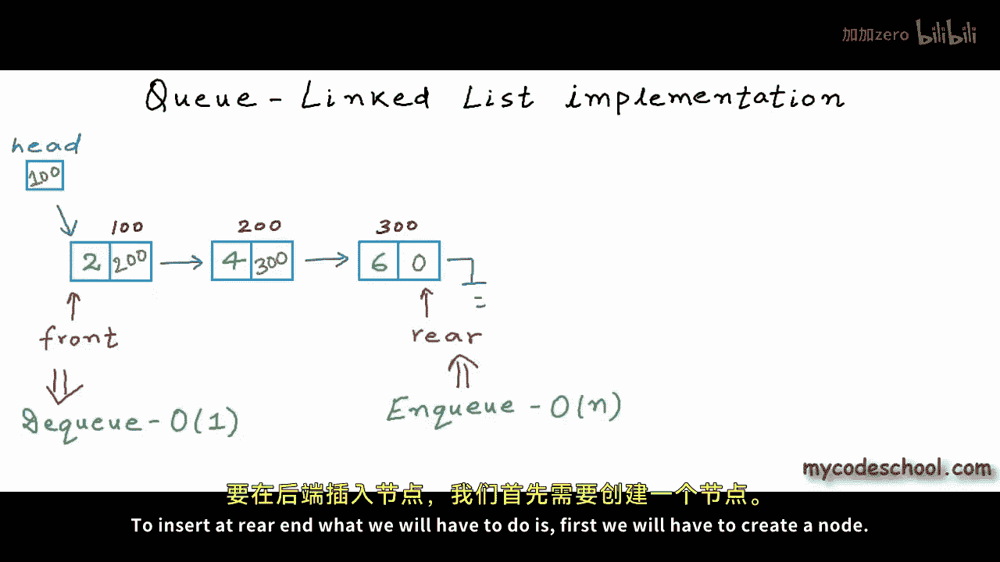

And the integer that I want to in queue is 7。 the address part of this node can be set as null。

 Now what we need to do is we need to build this link。

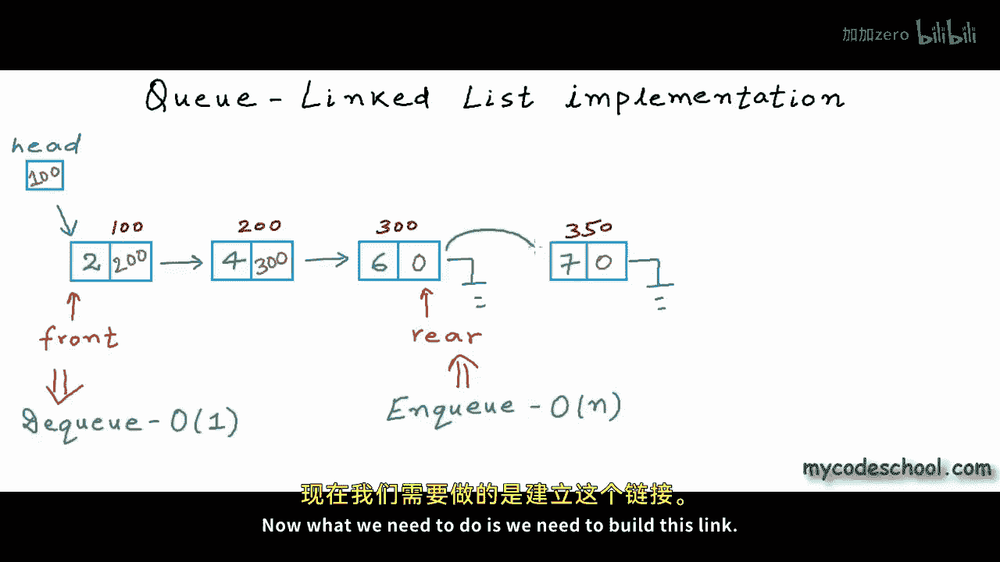

We need to set the address part of the last node as address of this newly created node and to do so we first need to have a pointer pointing to this last node st the address of this last node in a linked list the only identity that we always keep with us is address of the head node to get a pointer to any other node we need to start at head so we will first create a pointer temp and we will initially set it to head and now in one step we can move this pointer variable to the next of whatever node it is pointing to it's pointing to we use a statement like temp equal temp next to move to the next node so from first node we will go to the second node and then from second we will go to the third node in this example third node is the rear node and now using this pointer temp we can write the address part of this node and build this link。

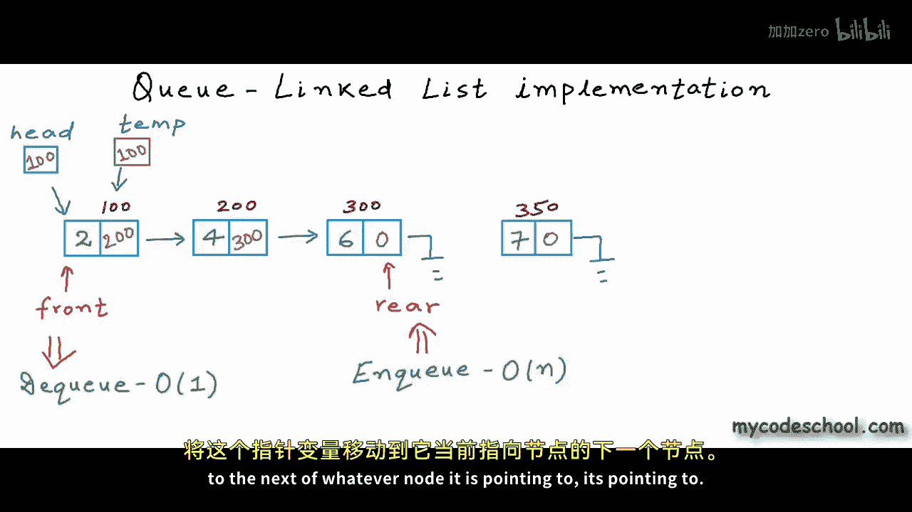

This whole traversal that we are having to get a pointer from head to tail is what is taking all the time What we can do is we can avoid this whole traversal we can have a pointer variable just like head that should always store the address of rear node I can call this variable tail or rear let's call this rear and let's call this variable that is st the address of head node front。

In any insertion or removal we will have to update both front and rear now。

 but now when we will in queue let's say I have got a node at address 450 and and I want to insert this node at rear end now using the rear pointer we can update the address field here so we are building this link。

And now we can update rear， we will only have to modify some address fields and time taken for in queue operation will not depend upon number of nodes in the linked list。

 So now with this design， both in queue and the queue operations will be constant time operations。

 The time complexity for both will be big O of1。Let's quickly see how real code in C will look like for this design I have declared node as a structure with two fields。

 one to store data and another to store address of next node and now instead of declaring a pointer variable named head。

 a pointer to node named head， I am declaring two pointers a pointer to node named front and another pointer to node named rear and initially I am setting them both as null let's say I' am defining these two variables in global scope so they will be accessible to all functions。

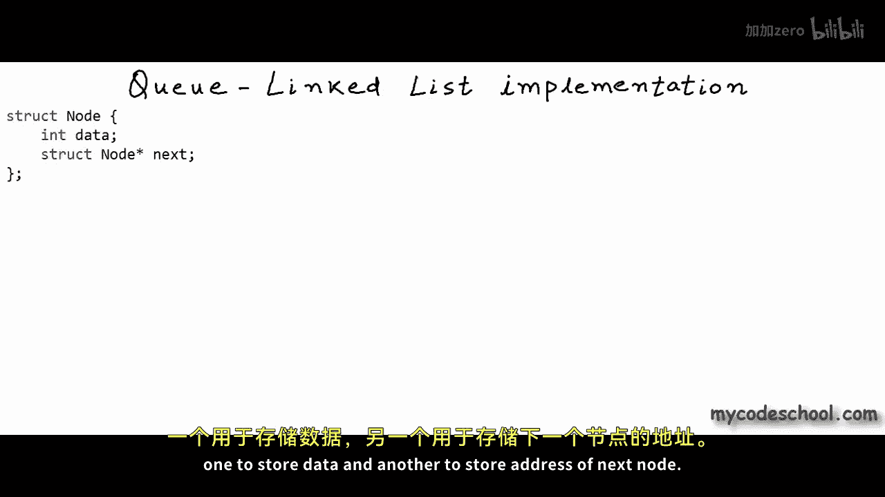

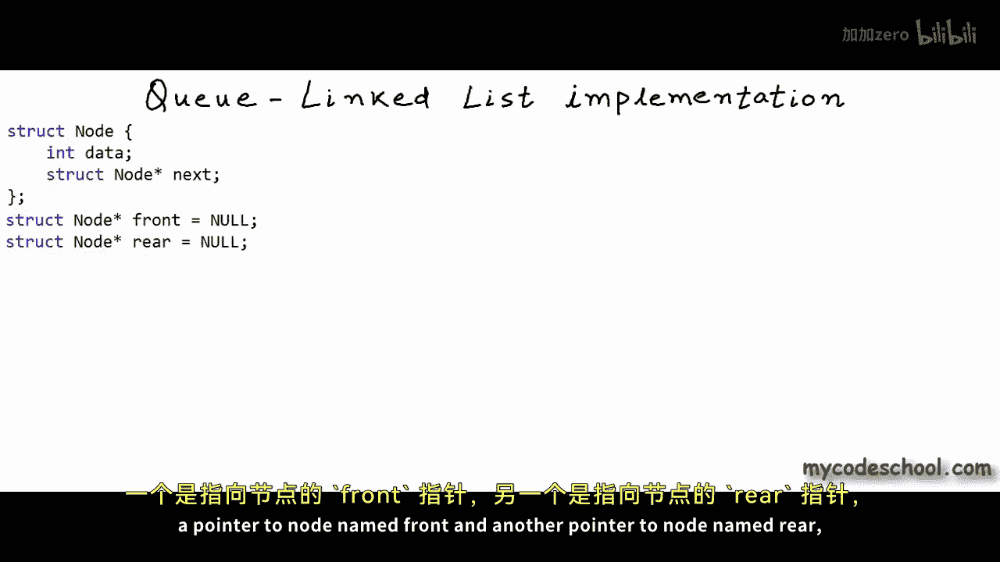

My Nq function will take an integer as argument in this function I'll first create a node I'll use malloc in C or new operator in C plus plus to create a node in what we call dynamic memory I am pointing to the newly created node using this variable which is pointed to node named temp now we can have two cases in insertion or in Q operation if there is no element in the Q if the Q is empty in this case both front and rear will be null we will simply set both front and rear as address of this new node being pointed to by temp and we will return or exit else because we already have a pointer to rear node we will first set the address part of current rear as the address of this newly created node and then we will modify the address in rear variable to make it point to this newly created node。

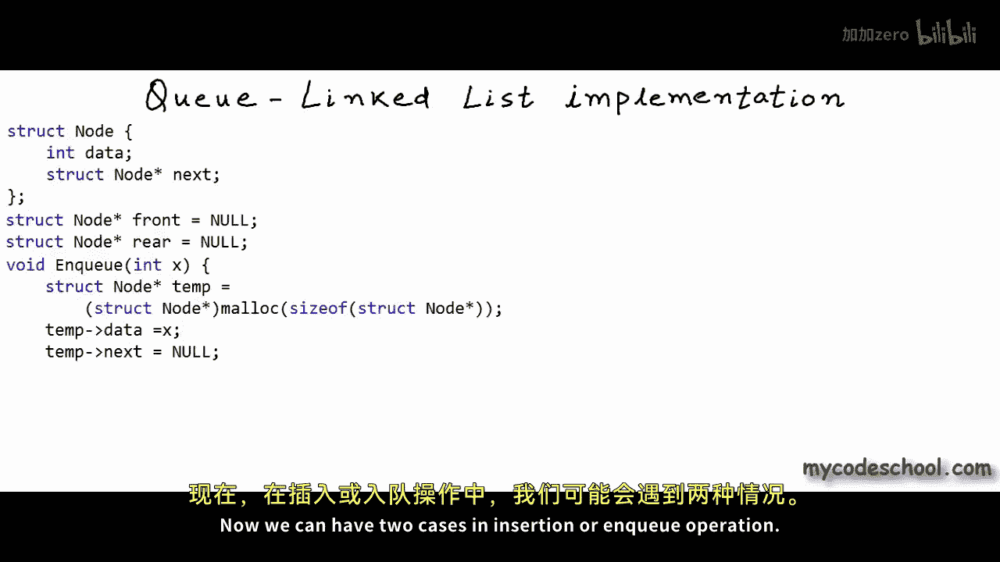

While writing all of this I'm assuming that you already know how to implement a linked list if you want to refresh your concepts。

 you can check earlier lessons in this series。

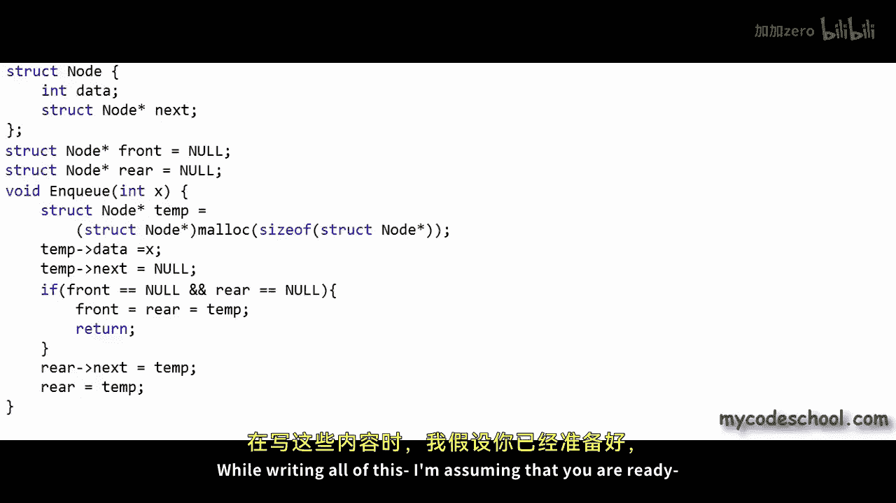

Or you can check the description of this video for a link to lesson on linked list implementation in C or C plus+ this code will be further clear if I'll show things moving in a simulation let's say initially we have an emptyq so both front and rear will be null null is only a macro for address0 at this stage let's say we are making a call to NQ function passing it number2 Now let's go through the Nq function and see what will happen first we will create a node data part of this node will be set as2 and address part initially will be set as null let's say we got this node at address temp at address hundred so a variable named temp is is storing this address this variable is pointing to this node right now front and rear are both null So we will go inside this if condition and simply set both front and rear as00 when the function will finish execution temp which is a local variable。

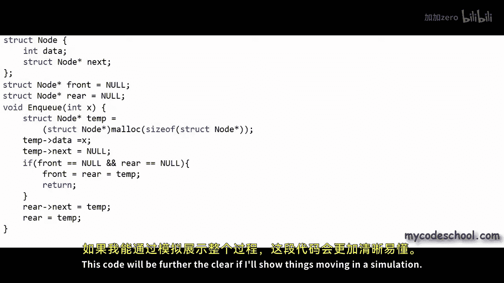

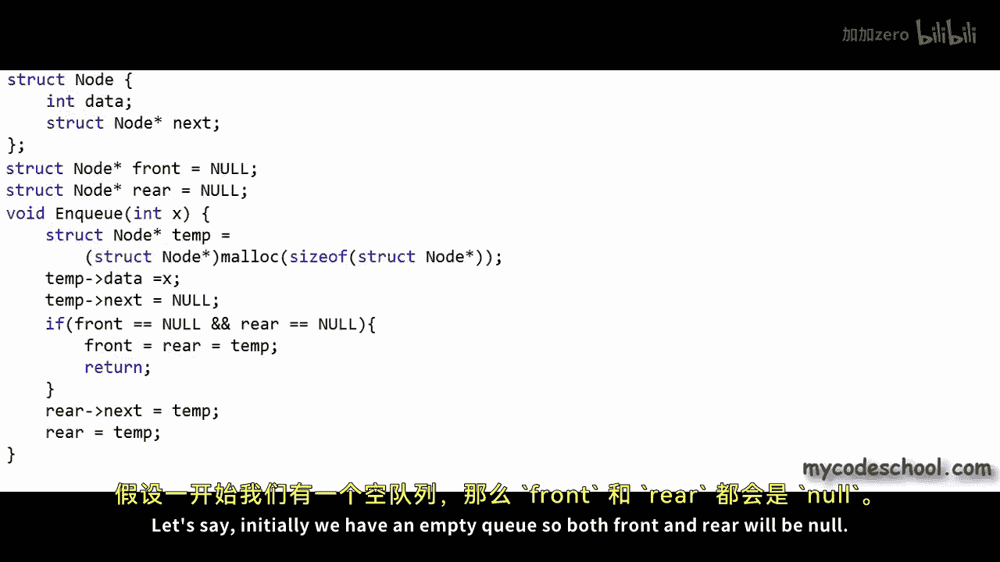

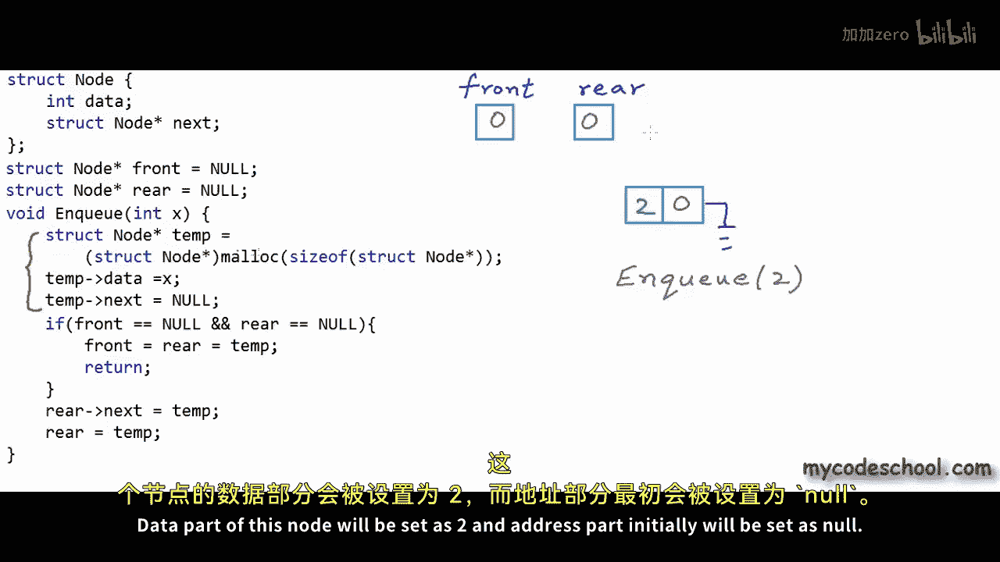

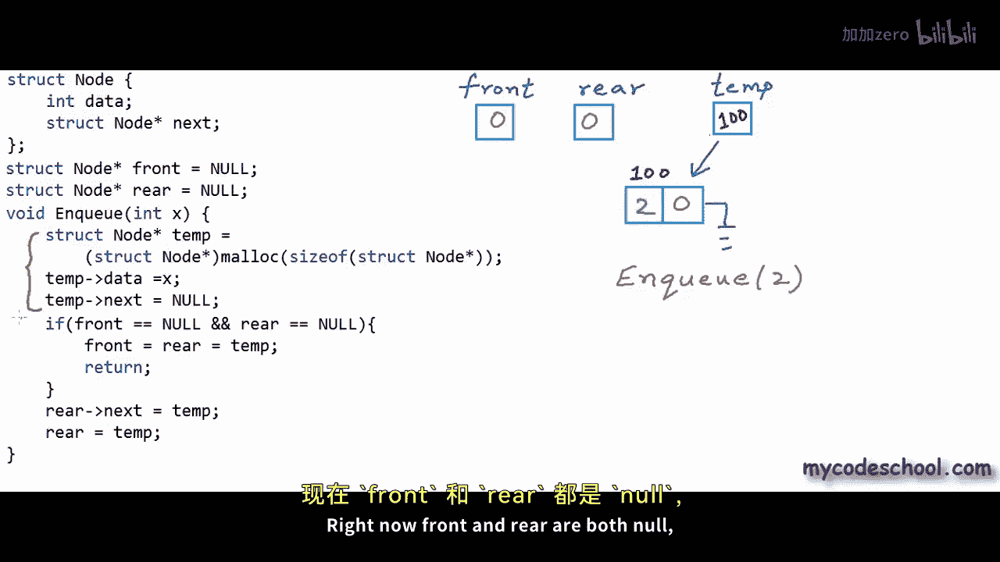

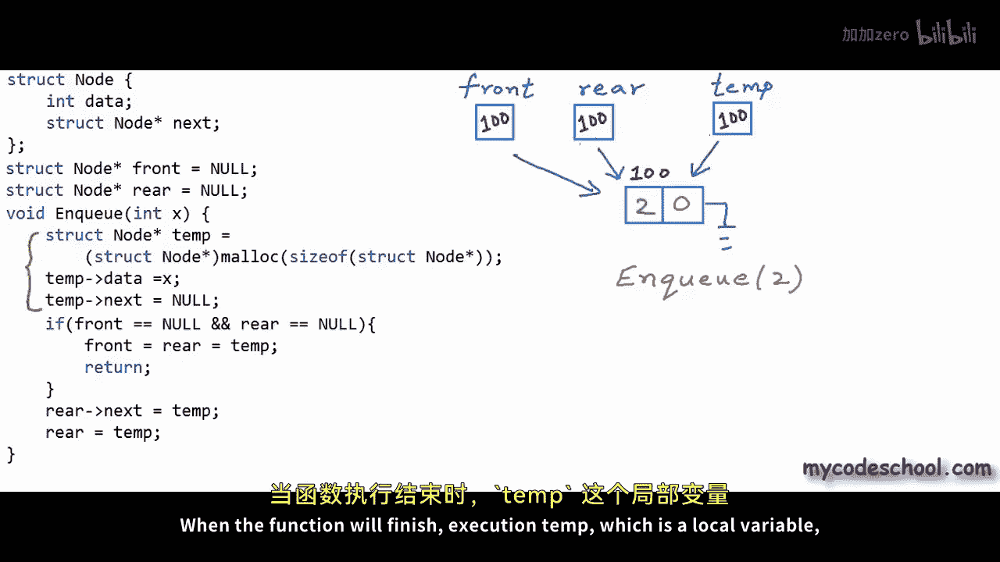

Will be cleared from memory after setting both front and rear as address of this newly created node we are returning。

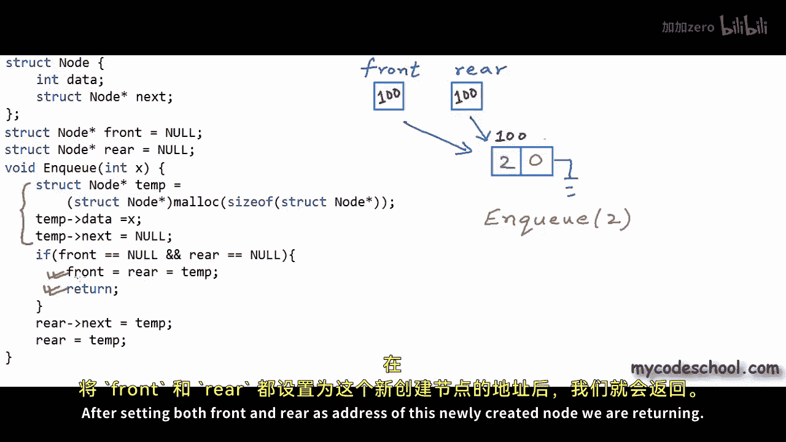

So this is how the queue will look like after first N Q。

 let's say we are making another call to Nq function at this stage passing number 4 as argument。

 Once again， a new node will be created。 let's say I got the new node at address 200。

 this time the queue is not empty。 so in this function we will first go to this statement。

Rear dot next equal temp so we will set the next part of this node at address 00 as the address of the newly created node which is 200 so we will build this link and now we will store the address of the new rear node in this variable named rear。

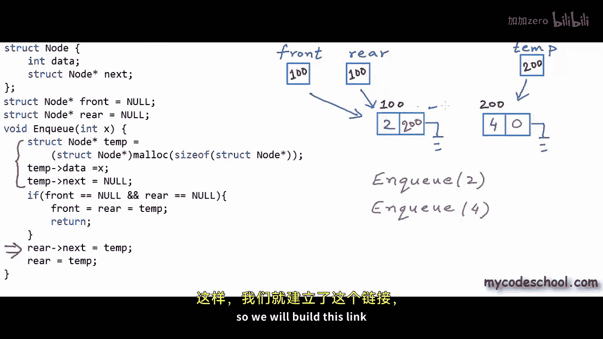

So this is how my Q will look like after this second N Q。 Let's do one more N Q。

 Let's send Q number 6。 Let's say we got our new node this time after address 300。

 So this is how our Q will look like。

Okay lets now write DQ function in DQ function， I'll first create a temporary point at a node in which I'll store the address of the current head or current front。

 let's say for this example at this stage I am making a call to DQ function。

We will have a couple of cases in the queue also the queue could be empty so in this case we can print an error message and return in case of empty queue front and rear will both be equal to null we can check one of these and we will be good in the case when front and rear will be equal we will simply set both front and rear as null in all other cases we can simply make front point to the next node so we will simply do a front equal front dot next but why have we used this temporary pointer to node why have I declared this temporary pointer a node in this code well simply incrementing front will not be good enough in this example when I'm calling the queue I'm first creating temp let's walk through whatever code I've written so far so in the first line I'm creating temp and then because Q is not empty and there are more than one elements in the Q I'm setting front as address of the next node So my queue is good now。

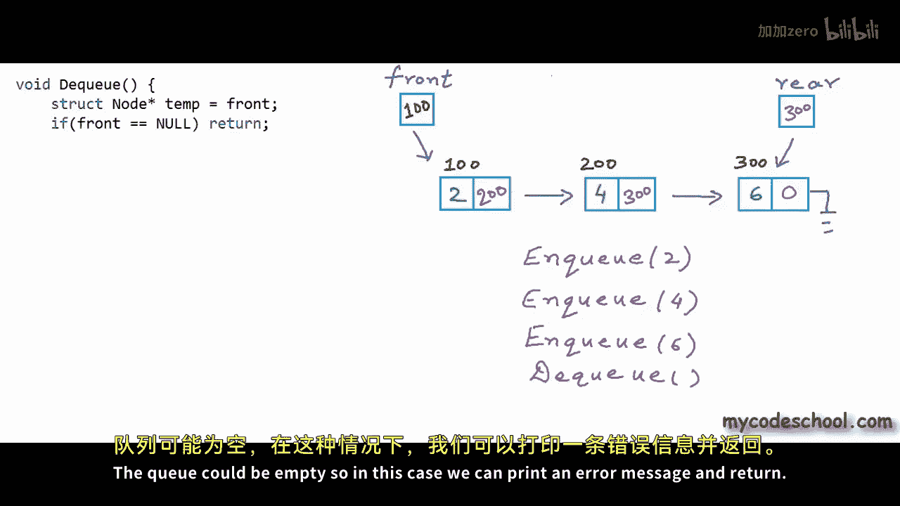

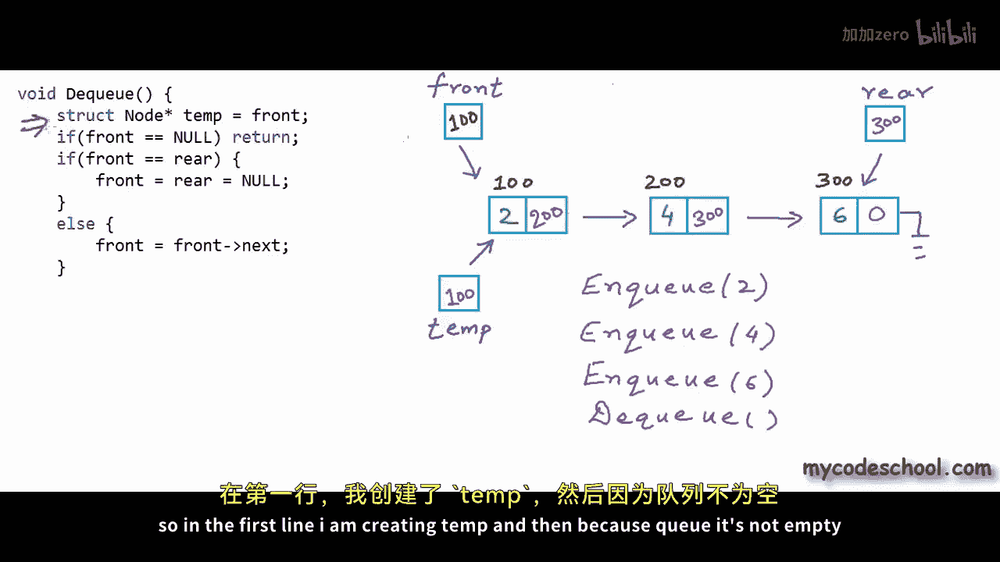

The links are appropriately modified， but this node， which was front previously。

 is still in the memory。 Anything in dynamic memory has to be explicitly freed。To free this node。

 we will use free function。And to this free function， we should be passing address of the node。

 and that's why we had created temp with this free， the node will be wiped off from memory。

So these are in queue and DQ operations for you and if you can see there are simple statements in these functions there are no loops so these functions will take constant time the time complexity will be big of one in the beginning of this lesson we had also discussed some limitations with array implementation like what if array gets filled and that of unused memory we do not have these limitations in a linked list implementation we are using some extra memory to store a rest of next node but apart from that there is no other major disadvantage I'll stop here now you can write rest of the functions like front function to look at the element at front or is empty function to check whether queue is empty or not yourself if you want to get my source code then you can check the description of this video for a link so thanks for watching。

