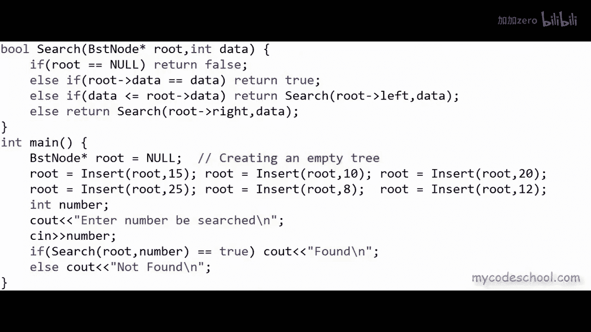

# mycodeschool【中英⚡数据结构｜Data Structures】 p28 p27 Binary search tree - Implementation in C⧸C++ -BV1ckrLYREn2_p28-

In our previous lesson we saw what binary search trees are now in this lesson we are going to implement binary search tree we will be writing some code for binary search tree prerequisite for this lesson is that you must understand the concept soft pointers and dynamic memory allocation in CC++ if you have already followed this series and seen our lessons on linked list。

Then implementation of binary search tree or binary  tree in general is not going to be very different。

We will have notes and links here as well。Okay， so let's get started binary search tree or BST as we know is a binary tree in which for each node value of all the nodes in left subree is lesser or equal and value of all the nodes in right subre is greaterter we can draw BST as a recursive structure like this。

Value of all the nodes in left subree must be lesser or equal and value of all the nodes in right subree must be tter and this must be true for all nodes and not just the root node so in this recursive definition here both left and right subtes must also be binary search trees I have drawn a binary search tree of integers here Now the question is how can we create this nonlinear logical structure in computers memory I have talked about this briefly when we had discussed binary trees the most popular way is dynamicically created nodes linked to each other using pointers or references just the way we do it for linked lists。

Because in a binary search tree or in a binary tree in general each node can have at most to children we can define node as an object with three fields。

 something like what I'm showing here we can have a field to store data another to store address or reference to left child and another to store address or reference to right childil if there is no left or right child for a node reference can be set as null in C or C plus plus we can define node like this there is a field to store data here the data type is integer but it can be anything there is one field which is pointer to node node asterisk risk means pointer to node this one is to store the address of left child and we have another one to store the address of right child this definition of node is very similar to definition of node for doubly linked list remember in doubly linked list also each node had toolings one to previous node and。

to next node but doub linkeded list was a linear arrangement this definition of node is for a binary tree we could also name this something like BSt node but node is also fine let's go with node now in our implementation just like linked list all the nodes will be created in dynamic memory or heap section of applications memory using malloc function in C or new operator in C plus+ we can use malloc in C++ as well now as we know any object created in dynamic memory or heap section of applications memory can have a name or identifier it has to be accessed through a pointer malloc or new operator return as pointer to the object created in heap if you want to revise some of these concepts of dynamic memory allocation you can check the description of this video for link to a lesson its really important that you understand this concept of stack and heap in application。

Memory really well。Now， for a linked list， if you remember。

 the information that we always keep with us is address of the head node。

If we know the head node we can access all other nodes using links in case of trees the information that we always keep with us is address of the root node。

 if we know the root node we can access all other nodes in the tree using links to create a tree we first need to declare a pointer to BST node。

I'll rather call node BST node here BST for binary search tree， so to create a tree。

 we first need to declare a pointer to BST node that will。Always store the address of root node。

I have declared a pointer to node here named root PTR PTR 4 pointer。In C。

 you can't just write BST node asterisk root P， you will have to writestruct space BST node asterisk。

 you will have to writestruct here as well。I'm going to write C++ here。

 but anyway right now I'm trying to explain the logic we will not bother about my new details of implementation in this logical structure of three that I' am showing here each node as you can see has three fields three cells leftmost cell is to store the address of left child and rightmost cell is to store the address of right child let's say root node is at a address 200 in memory and I'll assume some random addresses for all other nodes as well。

Now I can fill in these left and right cells for each node with addresses of left and right children in our definition data is first field but in this logical structure Im showing data in the middle okay so for each node I have filled in addresses for both left and right child address is0 or null if there is no child now as we were saying identity of the tree is address of the root node we need to have a pointer to node in which we can store the address of the root node we must have a variable of type pointer to node to store the address of root node all these rectangles with three cells are nodes they are created using malloc or new operator and live in heap section of applications memory we cannot have name or identifier for them they are always accessed through pointers this root PTtR root pointer has to be a local or global variable。

We will discuss this in little more detail in some time quite often we like to name this root pointer just root we can do so but we must not confuse this is pointer to root and not the root itself to create a BSt as I was saying we first need to declare this pointer initially we can set this pointer as null to say that the tree is empty a tree with no node can be called empty tree and for empty tree root pointer should be set as null we can do this declaration and setting the root as null in main function in our program actually let's just write this code in a real compiler I' am writing c plus plus here as you can see in the main function I have declared this pointer to node which will always store the address of root node of my tree and I' am initially setting this as null to say that the tree is empty with this much of code we have created an empty tree but what。

The point of having an empty tree， we should have some data in it。

 so what I want to do now is I want to write a function to be able to insert a node in the tree。

I will write a function named insert that will take address of the root node and data to be inserted as argument and this function will insert a node with this data at App position in the tree in the main function Ill make calls to this insert function passing it address of root and the data to be inserted。

 let's say first I want to insert number 15。And then I want to insert number 10。And then number 20。

We can insert more but lets first write the logic for insert function before I write the logic for insert function。

 I want to write a function to create a new node in dynamic memory or heap。

This function get new node should take an integer the data to be inserted as argument。

 create a node in heap using newer malloc and return back the address of this new node I am creating the new node here using this new operator。

 the operator will return me the address of the newly created node which I am collecting in this variable of type pointer to BST node。

In C， instead of new operator we will have to use Maoc， we can use Maoc in C++ as well。

 C++ is only a superet of C。Maoc will also do here now anything in dynamic memory or heap is always accessed through pointer。

Now using this pointer new node， we can access the fields of the newly created node。

 Ill have to dereference this pointer using asterisk operator so I'm writing asterisk new node and now I can access the fields。

We have three fields in node data and two pointers to node left and right。

 I've set the data here instead of writing asterisk new node do data we have。

This alternate syntax that we could use， we could simply write new node。

Arrow data and this will mean the same We have used this syntax quite a lot in our lessons on linked list now for the new node we can set the left and right child as null and finally we can return the address of the new node。

Okay， coming back to the insert function。We can have a couple of cases in insertion。First of all。

3 may be empty for this first insertion when we are inserting this number 15，3 will be empty。

 if3 is empty we can simply create a new node and set it as root with this statement root equal get new node。

Im setting root as address of the new node， but there is something not all right here。

This root is local variable of insert function and its scope is only within this function we want this root root in main to be modified this guy is a local variable of main function there are two ways of doing this we can either return the address of the new root so return type of insert function we be pointed to be a node and not void and here in the main function we will have to write statement like root equal insert and the arguments so we will have to collect the return and update our root in main function。

Another way is that we can pass the address of this route of main to the insert function。

 this route is already a pointer to node， so its address can be collected in a pointer to pointer so insert function in insert function first argument will be a pointer to pointer and here we can pass the address will say am percent root to pass the address we can name this argument route or we can name this argument root pR we can name this whatever now what we need to do is we need to dereence this using asterisk operator。

To access the value in root of main and we can also set the value in root of main。

 so here with this statement we are setting the value and the return type now can be void this pointer to pointer thing gets a little tricky I'll go with the former approach。

Actually there is another way instead of declaring root as a local variable in main function。

 we can declare root as global variable global variable as we know has to be declared outside all the functions if root would be global variable it would be accessible to all the functions and we will not have to pass the address stored in it as argument。

Anyway coming back to the logic for insertion as we were saying if the tree is empty we can simply create a new node and we can simply set it as root at this stage we want it to insert 15 if we will make call to the insert function address of root is0 or null null is only a macro for0 and the second argument is the number to be inserted in this call to insert function we will make call to get new node。

Let's say weve got this new node at address 200。Get new node function will return U address 200。

 which we can set as root here。But this root is a local variable。

 we will return this address 200 back to the main function and in the main function we are actually doing this root equal insert so in the main function we are building this link。

Okay our next call in the main function was to insert number 10 at this stage root is 200。

 the address in root is 200 and the value to be inserted is 10 Now the tree is not empty so what do we do？

If the tree is not empty we can basically have two cases if the data to be inserted is lesser or equal we need to insert it in the left subree of root and if the data to be inserted is crter we need to insert it in right subtree of the root so we can reduce this problem in a self-simil manner in a recursive manner recursion is one thing that we are going to use almost all the time while working with trees。

In this function I'll say that if the data to be inserted is less than or equal to the data in root。

 then make a recursive call to insert data in left sub3 the root of the left sub3 will be the left child so in this recursive call we are passing address of left child and data as argument and after the data is inserted in left sub3 the root of the left sub3 can change insert function will return the address of the new root of the left sub3 and we need to set it as left child of the current node in this example to here right now both left and right sub3 are empty we are trying to insert number 10 so we have made called to this function insert from main function we have called insert passing it address 200 and value or data 10 now 10 is lesser than 15 so control will come to this line。

And a call will be made to insert data in left sub3 now left sub3 is empty。

 so address of root for left sub3 is 0 data past data to be inserted past as argument is 10 now this first insert call will wait for this insert below to finish and return for this last insert call root is null let's say we got this node at address 150 Now this insert call will return back 150。

And execution of first insert call will resume at this line。

 and now this particular address will be set as 150， so we will build this link。

And now this insert call can finish it can return back the current route actually this return route should be there for all cases。

 so I am taking it out and I have it after all these conditions。

 of course we will have one more else here if the data is crter we need to go insert in right sub 3。

The third call in insert function was to insert number 20 now this time we will go to this else statement this statement in L let's say we got this new node at address 300 so this guy will return 300 for this node at 200 right child will be set as 300。

And now this call to insert can finish， the return will be 200。Okay， at this stage。

 what if a call is made to insert number 25？We are at root right now the node with address 200 25 is crters so we need to go and insert in right sub3 right subre is not empty this time so once again for this call also we will come to this else's last elses because 25 is crreta than 20 now in this call we will go to the first if a node will be created let's say weve got this node in he at address 500 this particular call insert 025 will return 500 and finish now for the node at 300 right child will be set as 500 so this link will get built now this guy will return 300 the root for this sub3 has not changed。

And this first call to insert will also wrap up， it will return to 200。

So we are looking good for all cases this insert function will work for all cases we could write this insert function without using recursion I encourage you to do so you will have to use some temporary pointer to node and loops recursion is very intuitive here and recursion is intuitive and pretty much everything that we do with trees so it is really important that we understand recursion really well okay I'll write one more function now to search some data in BSt。

In the main function here I have made some more calls to insert now I want to write a function named search that should take as argument address of the root node and the data to be searched and this function should return me true if data is there in the tree false otherwise once again we will have a couple of cases if the root is null then we can return false if the data and root is equal to the data that we are looking for then we can return true else we can have two cases either we need to go and search in the left subre or we need to go in the right subre so once again I'm using recursion here I am making recursive call to search function in these two cases。

If you have understood the previous recursion， then this is very similar。

 let's test this code now what I've done here is I've asked the user to enter a number to be searched and then I'm making call to this search function and if。

This function is returning me true I am printing found else I am printing not found let's run this code and see what happens I have moved multiple insert statements in one line because I am short of space here。

 let's say we want to search for number 88 is found and now let's say we want to search for 22 22 is not found so we are looking good。

I'll stop here now you can check the description of this video for link to all the source code we will do a lot more with trees in cominging lessons in our next lesson we will go a little deeper and try to see how things move in various sections of applications memory how things move in stack and heap sections of memory when we execute these functions it will give you a lot of clarity This is it for this lesson thanks for watching。

