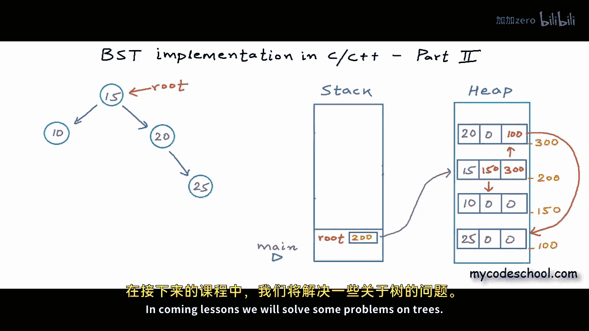

# mycodeschool【中英⚡数据结构｜Data Structures】 p29 p28 BST implementation -  memory allocation in stack and heap -BV1ckrLYREn2_p29-

In our previous lesson we wrote some code for binary search tree。

 we wrote functions to insert and search data in BSD now in this lesson we will go a little deeper and try to understand how things move in various sections of applications memory when these functions get executed。

And this will give you a lot of clarity， this will give you some general insight into how memory is managed for execution of a program and how recursion which is so frequently used in case of trees works。

😊，The concepts that I am going to talk about in this lesson have been discussed earlier in some of our previous lessons。

 but it will be good to go through these concepts again when we are implementing trees so here is the code that we had written we have this function get new node to create a new node in dynamic memory。

And then we have this function insert to insert a new node in the tree。

And then we have this function to search some data in the tree。And， finally。

This is the main function you can check the description of this video for a link to this source code Now in main function here we have this pointer to BST node named root to store the addressof root node of my tree and I' am initially setting it as null to create an empty tree and then I'm making some calls to insert function to insert some data in the tree and finally I' am asking user to input a number and I'm making call to search function to find this number in the tree if the search function is returning me true I'm printing found else I'm printing not found let's see what will happen in memory when this program will execute the memory that is allocated to a program or application for its execution。

In a typical architecture can be divided into these four segments。

There is one segment called textex segment to store all the instructions in the program。

 the instructions would be compiled instructions in machine language。

There is another segment to store all the global variables a variable that is declared outside all the functions is called global variable。

 it is accessible to all the functions the next segment stack is basically scratch space for function call execution all the local variables the variables that are declared within functions live in stack and finally the fourth section heap which we also call the free store is the dynamic memory that can grow or shrink asspar a need the size of all of segments is fixed the size of all other the segments is decided at compile time but heap can grow during runtime and we cannot control allocationation or deallocation of memory in any other segment during runtime。

But we can control allocation and the allocation in heap we have discussed all of this in detail in our lesson on dynamic memory allocation you can check the description for a link Now what I'm going to do here is I'm going to draw stack and heap sections as these two rectangular containers I'm kind of zooming into these two sections now I'll show you how things will move in these two sections of applications memory when this program will execute when this program will start execution first the main function will be called now whenever a function is called some amount of memory from the stack is allocated for its execution the allocated memory is called stack frame of the function call all the local variables and the state of execution of the function call would be stored in the stack frame of the function call in the main function we have this local variable root which is pointer to BSt node so Im showing root here in this stack frame we will execute the instruction sequence。

in the first line in main function we have declared root and we are initializing it and setting it as null null is only a macro for address 0。

 so here in this figure I am setting address in root as0。

Now in the next line we are making a call to insert function。

 so what will happen is execution of main will pause at this stage and a new stack frame will be allocated for execution of insert main will wait for this insert above to finish and return once this insert call finishes main will resume at line2。

We have these two local variables root and data in insert function in which we are collecting the arguments now for this call to insert function we will go inside the first if condition here because root is null at this line we will make call to get new node function。

So once again， execution of this insert call will pause and a new stack frame will be allocated for execution of CAt new node function。

We have two local variables in get new node data in which we are collecting the argument and this pointer to BST node named new node Now in this function we are using new operator to create a BST node in Heap let's say we got a new node at address 200。

New operator will return us this address 200， so this address will be set here。In new node。

 so we have this link here。And now using this point at new node。

 we are setting value in these three fields of node， let's say the first field is to store data。

 so we are setting value 15 here。And let's say this second cell is to store address of left child this is being set as null and the address of right childil is also being set as null and now get new node will return the address of new node and finish its execution whenever a function called finishes the stack frame allocated to it is reclaimed。

Call to insert function will resume at this line and the return of get new node address 200 will be set in this route。

which is local variable for insert call and now insert function this particular call to insert function will return the address of root。

 the address stored in this variable root， which is 200 now and finish and now main will resume at this line and root of main will be set as 200 the return of this insert call insert root 15。

Will be set here。Now in the execution of main control well go to the next line and we have this call to insert function to insert number 10 once again execution of main will be paused and a stack frame will be allocated for execution of insert now this time for insert call root is not null so we will not go inside the first if we will access the data field of this node at address 200 using this pointer named root in insert function and we will compare it with this value 10 10 is lesser than 15 so we will go to this line and now we are making a recursive call here。

Recussion is a function calling itself and a function calling itself is not any different from a function A calling another function B。

 so what will happen here is that execution of this particular insert call will be paused and a new stack frame will be allocated for the execution of this another insert call to which the arguments past our address0 in this local variable root left childil of node at address。

200 is null so we are passing zero in root and in data we are passing 10 now for this particular insert call control will go inside first if and we will make a call to get new node function at this line so execution of this insert will pause and we will go to get new node function here we are creating a new node in heap lets say we got this new node at address 150 now get new node will return 150 and finish。

Execution of this call to insert will resume at this line， return of gett new node will be set here。

And now this call to insert will return address 150 and finish insert below will resume at this line and now in this insert call left child of this node at address 200 will be set as return of the previous insert call which is 150。

 so now these two nodes are linked and finally this insert call will finish。

Control will return back to main at this line root will be redwritten as 200。

 but earlier also it was 200， it is not changing。Next in the main function we have called to insert number 20 I'm not going to show the simulation for this one once again the allocated memory in stack will grow and shrink and finally when the control will return back to main function after this insert call is over we will have a node in heap with value 20 set as right childil of this node at 200 let's say we got this new node with value 20 at address 300 so as you can see the address of rightchil in node at address 200 is set as 300 now next one is to insert number 25 this one is interesting let's see what will happen for this one main will be paused and we will go to this call to insert in the root which is local to this call address past is 200 and we have passed number 25 in data now here 25 is greatertter than the value in this node at address 200 so we will go inside。

last L condition we need to insert in the right sub3 so another call to insert will be made we will pass address 300 as root and data pass will be 25 only now for this call once again the value in node at 300 for this call root is 300 is lesser than 25 25 is greater greater than 20 so once again we will come to this last L and make a recursive call to insert in the right sub3 the right subre is empty this time so for this insert call at top the address in root here will be0 so for this call we will go to the first if。

And make a call to get new node let's say this new node returns us node at address00 I'm short of space so I'm not showing everything in get new node stack frame here。

 we will return back to this insert call at top and now this route is set as hundred address of the newly created node。

And now this call to insert will finish， we will come back to this insert below and this insert will resume at this line inside the lastels and the right child of node that address 300 will be set as 00。

 and now this insert will return back address 300， whatever is set in its root。

And this insert below will resume at this line inside the last L right childil of node that address 200 will be set as 300 it was 300 previously also so even after overwriting we will not change and this insert will finish now Finally main will resume at this line root of main will be set as return of this insert call it will only be overwritten with same value it's really important that this root in main and all the links in nodes are properly updated quite often because of bugs in our code we lose some links or some unwanted links are created now as you can see we are creating all the nodes in heap here heap gives us this flexibility that we can decide the creation of node during runtime and we can control the lifetime of anything in heap any memory claimed in heap has to be explicitly delocated using3 in C or delete。

Operator in C plus+ else the memory in heap remains allocated till the program is running the memory in stack。

 as you can see， gets delocd when function call finishes。

The rest of the function calls here in main function will execute in similar manner Ill leave it for you to see and think about right now we have this tree in the heap logically memory itself is a linear structure and this is how tree which is a nonlinear structure which is logically a nonlinear structure will fit in it the way I'm showing the node at random locations linked to each other in this heap I hope this explanation gave you some clarity in coming lessons we will solve some problems on tree this is it for this lesson thanks for watching。

