# mycodeschool【中英⚡数据结构｜Data Structures】 p30 p29 Find min and max element in a binary search tree -BV1ckrLYREn2_p30-

In our previous lessons we wrote some basic code for binary search tree。

 but to solidify our concepts， we need to write some more code so Ive picked this simple problem for you。

Given a binary search tree， we want to find minimum and maximum element in it。

Let's see how we can solve this problem。I have drawn logical representation of a binary search tree of integers here as we know in a binary search tree for all nodes。

 value of nodes in left subree is lesser and value of nodes in right subree is Creta this is how we can define node for a binary search tree in CC++ we can have a structure with three fields one to store data another to store address of left childil and another to store address of right childil as we had seen earlier in BST implementation identity of the tree that we always keep with us that we pass to functions is address of the root node。

 so what I want to do here is I first want to write a function named find min that should take address of the root node as argument and return me the minimum element in the tree。

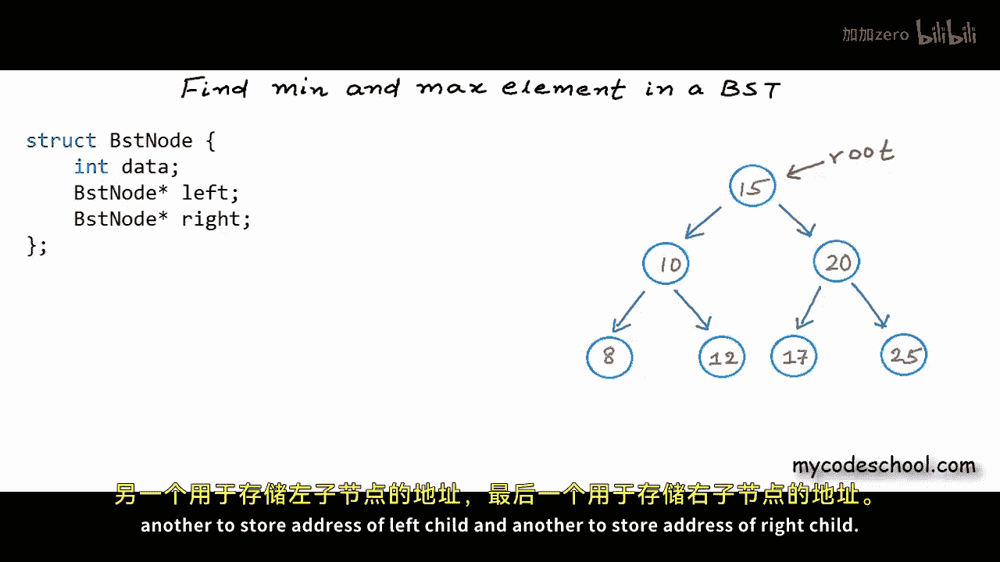

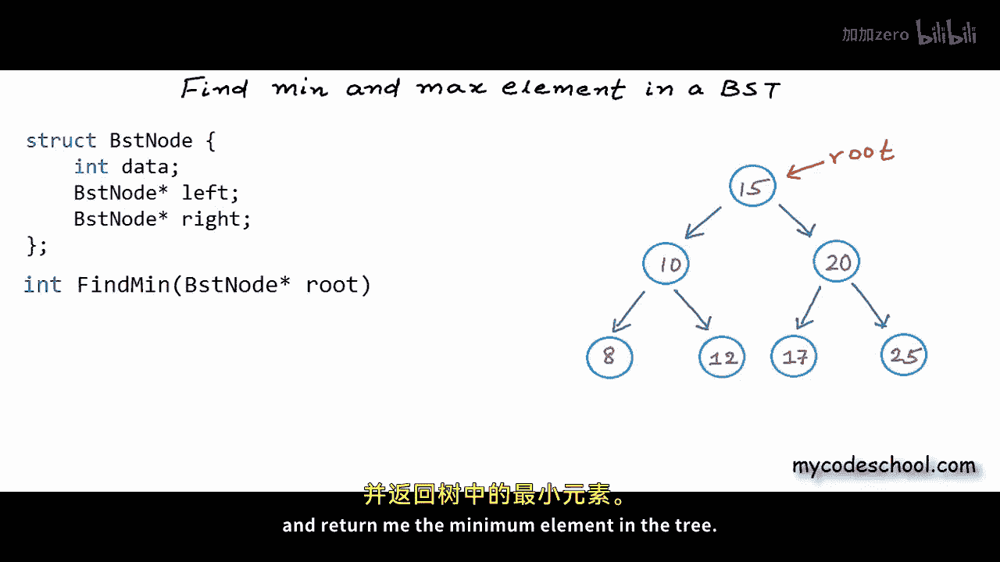

And just like find min， we can write another function named Find Max that can return us the maximum element in BSD。

 lets first see how we can find the minimum element。

There are two possible approaches here we can write an iterative solution in which we can use a simple loop to find the minimum element or we can use recursion。

 lets first see the iterative solution。

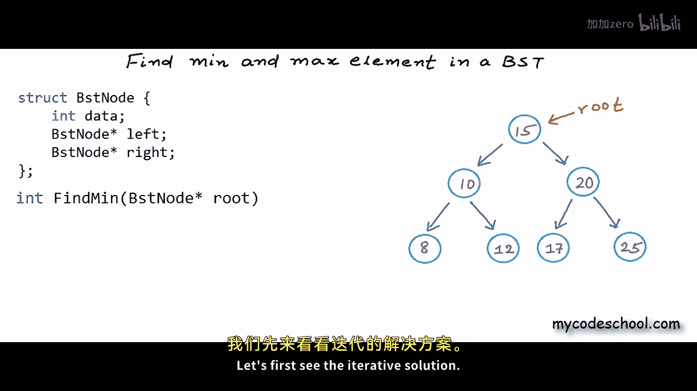

If we have a pointer to the root node and we want to find the minimum element in BSD。

 then from root we need to go left as long as it's possible to go using the left links because in a BST for all nodes nodes in left have lesser value and nodes in right have crta value so we need to go left as long as its possible we can start with a temporary pointer to root node we can name this pointer temp or we can name this pointer current to say that we are currently pointing to this node in my function here I have declared this pointer to BST node named current and initially I am setting the address of root in it and with this pointer we can go to the left child we a statement like current equal current arrow left we first need to check if there is a left child and then we need to move the pointer。

We can use a while loop like this if the left child of current node is not null we can move this point of current to the left child with this statement current equal current arrow left here in this example currently we are pointing to this node with value 15 it has a left child so we can move to this node with value 10 once again this node2 has a left child so we can go left again now this node with value 8 does not have a left child so we cannot go towards left any further。

We will come out of the while loop and at this point the node that we are pointing to has minimum value so we can return the data in that node there is one case that we are missing in this function if the tree is empty we can throw some error we can return some value indicative of empty3 if I know that the tree would have only positive values I can return something like minus1 so here in my function I' have added this condition if root is equal to null that is if the tree is empty print this error and return minus1 one more thing we do not need to use this extra pointer to BST node named current root here is a local variable and we can use this root itself。

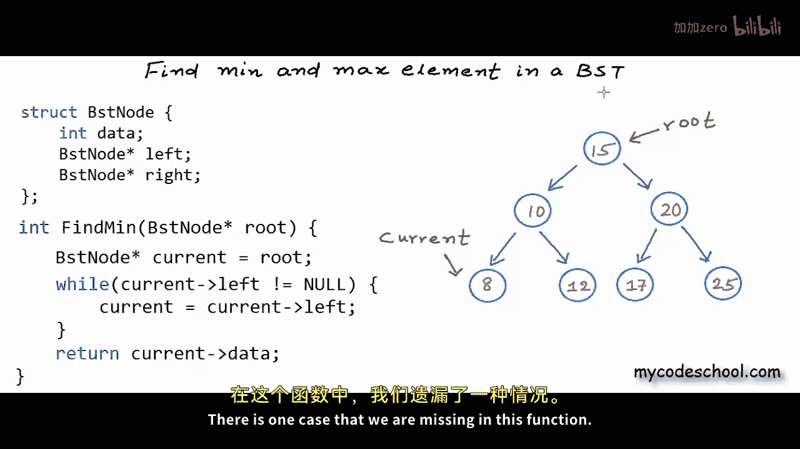

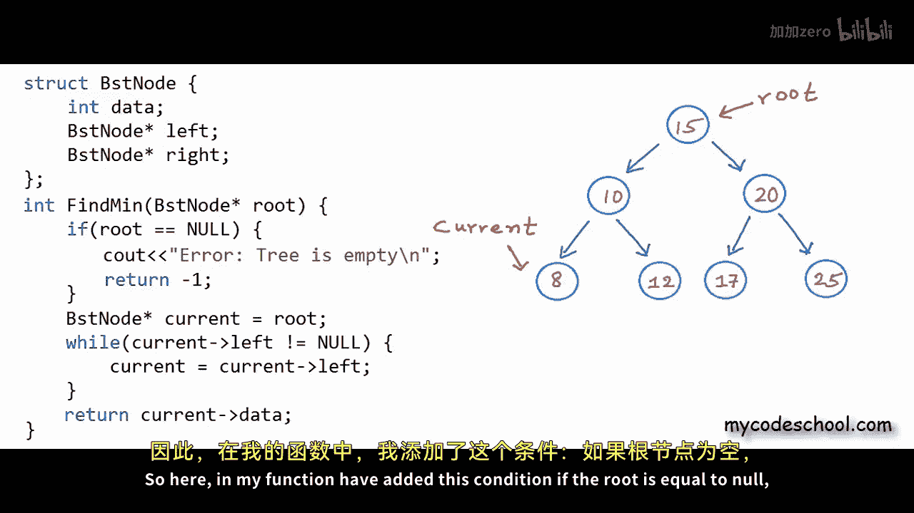

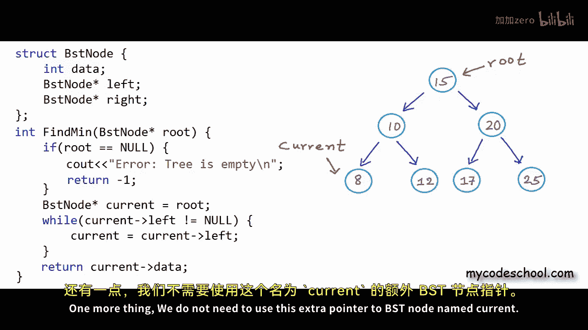

So we can write our code like this while left of root is not equal to null we can go left with this statement root equal root arrow left and finally we can return root arrow data which is only an alternate syntax for asterisk root dot data modifying this local root is not going to modify my root in main function or whatever function I'm calling this find main function from so this is our iterative solution to find minimum element in BSt the logic for finding maximum is similar the only difference will be that instead of going left we will have to go right all the time I leave it for you to implement let's now see how we can find minimum element using recursion。

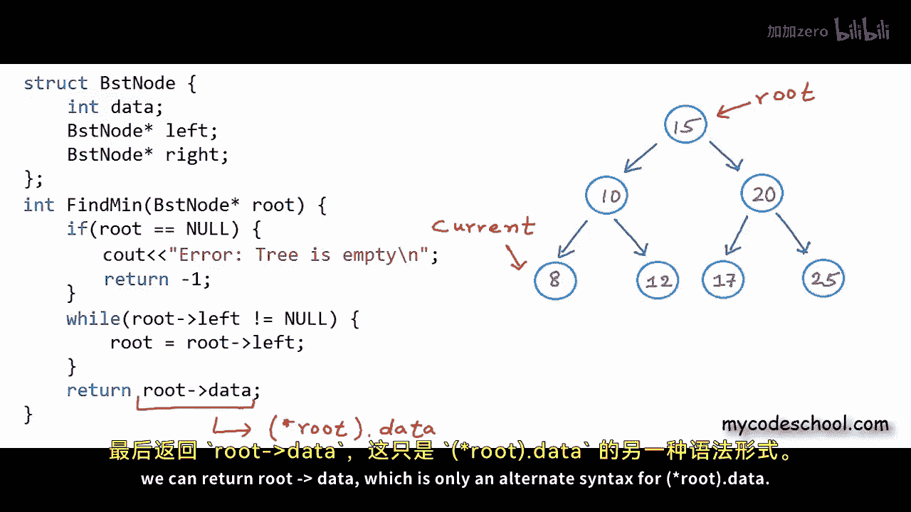

If we want to reduce this problem in a recursive manner in a self-similar manner。

 then what we can say is if the left subree is not empty then we can reduce the problem to finding minimum in left subre。

 if left subre is empty we already know the minimum because we cannot have a minimum in right subre。

 here is the recursion that we can right root being null is a corner case if root is null。

 that is if the tree is empty we can throw error else if left child of root is null。

 we can return the data in root， else if left child is not null or in other words if the left subree is not empty。

 we can reduce the problem to searching minimum in the left subt so we are making this recursive call to find min passing it address off the left child passing it address of the root of left subree。

 left child would be the root of left subre。

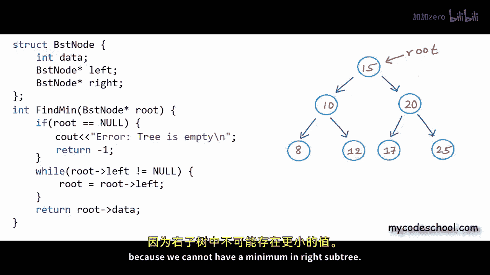

This second Elsif is our base condition to exit from recursion。

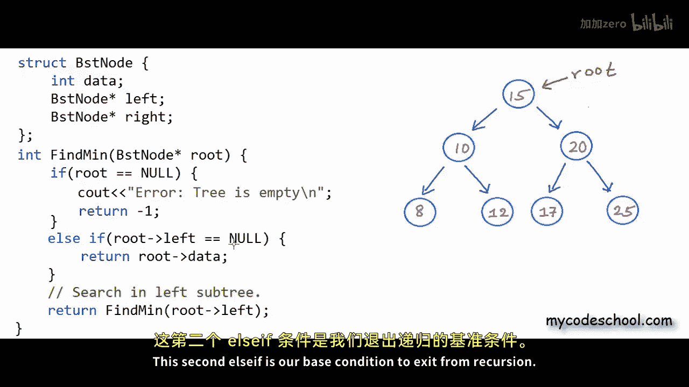

If you had understood the recursion that we had written earlier to insert a node in BST then this recursion should not be very difficult for you to understand so here is a recursive solution to find minimum in BST to find maximum element all we need to do is we need to go searching in right sub3 okay I'll stop here now in coming lessons we will solve some more interesting problems on BST thanks for watching。

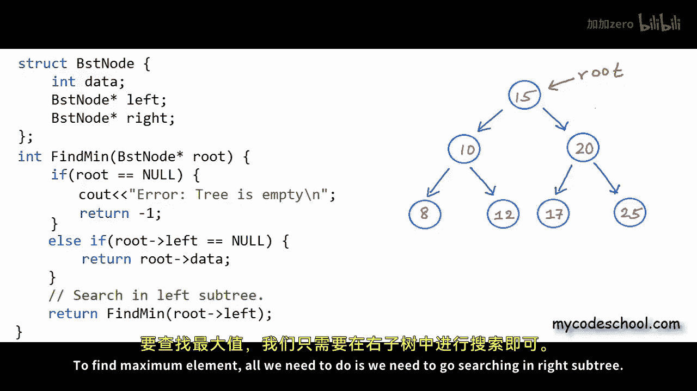

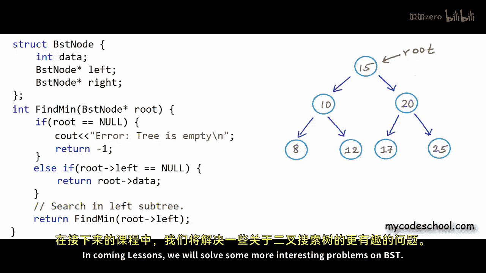