# mycodeschool【中英⚡数据结构｜Data Structures】 p31 p30 Find height of a binary tree -BV1ckrLYREn2_p31-

In this lesson we are going to write code to find height or what we can also call maximum depth of a binary tree we have already discussed depth and height in our first introductory lesson on trees but I'll do a quick recap here first of all I' have drawn a binary tree here I have not filled in any data in the nodes data can be anything binary tree as we know is a tree in which each node can have at most two children so a node can have01 or two children I'll just number these nodes so I can refer to them I'll say this root node is number one。

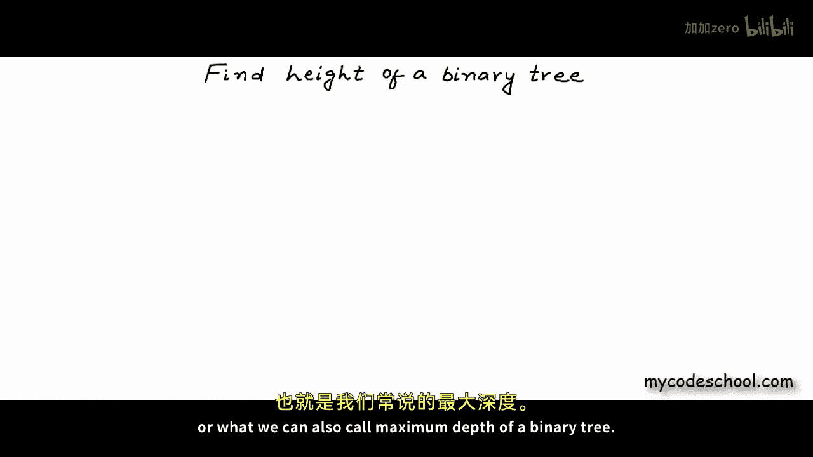

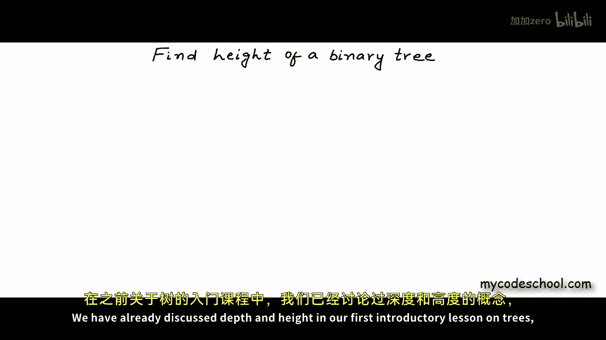

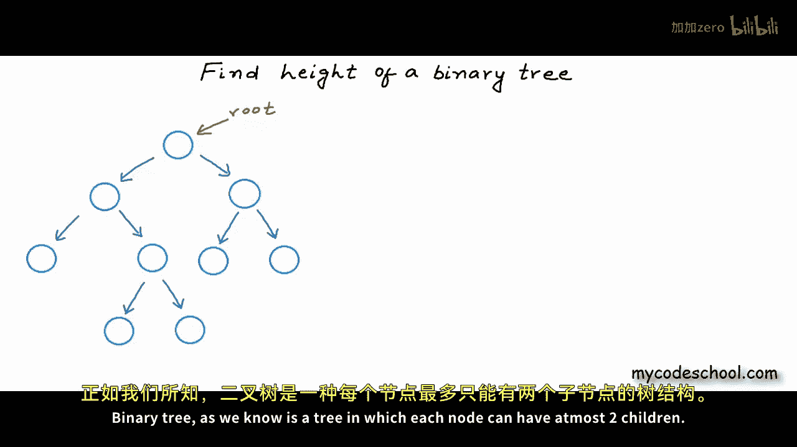

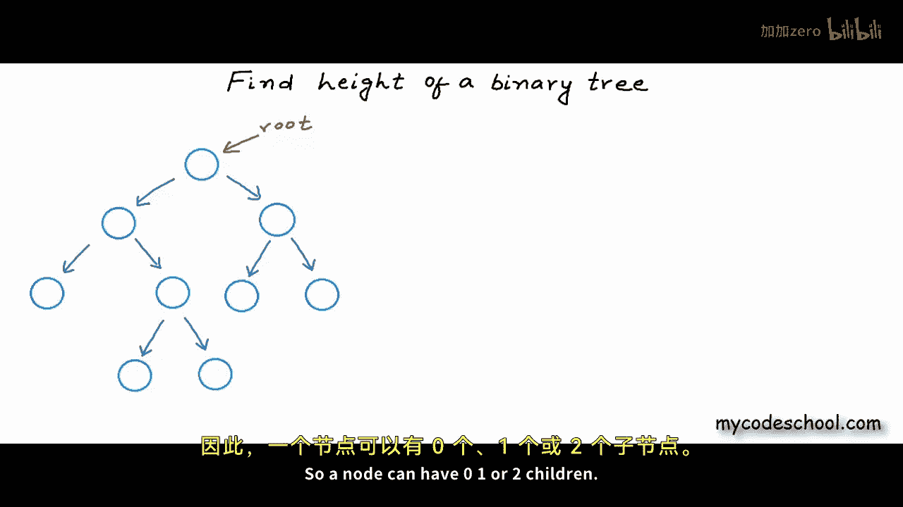

And I'll go level by level from left to right counting，2，3，4， and so on。

Now height of a tree is defined as number of edges in longest part。

From root。To a leaf note。In this example 3，4，6，7，8 and9 are leaf nodes。

 a leaf node is a node with zero children， number of edges in longest part from root to a leaf node is 3 for both eight and9 number of edges in part from root is3 so height of the3 is3 actually we can define height of a node in the tree as number of edges in longest part from that node to a leaf node so height of a tree basically is height of the root node in this example 3 height of node 3 is1。

 height of node 2 is 2 and height of node 1 is3 and because this is the root node this is also the height of the tree。

Height of a leaf node would be zero so if a tree has only one node then the root node itself would be a leaf node and so height of the tree would be zero so this is definition of height of a tree we often also talk about depth and we often confuse between depth and height but these two are different properties depth of a node is defined as number of edges in path from root to that node。

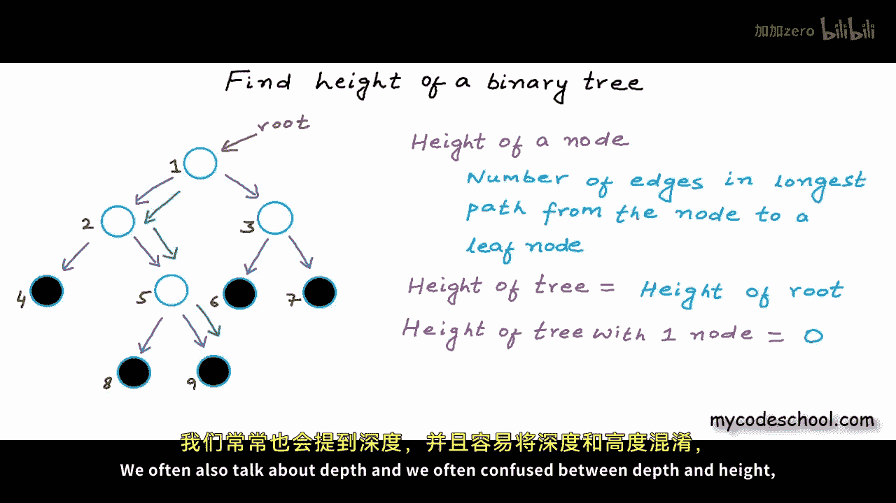

Basically， depth is distance from root and height is distance from deepest accessible leaf node for node 2 in this example 3。

 depth is 1 and height is 2 for node number 9 which is a leaf node。

 depth is 3 and height is0 for root node depth is0 and height is 3。

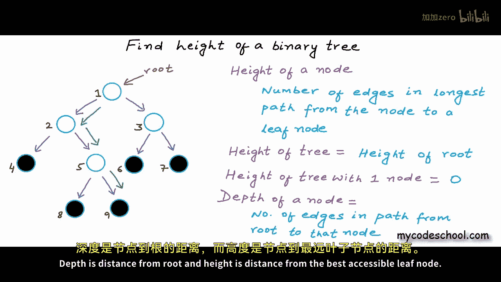

height of a tree would be equal to maximum depth of any node in the tree。

 so height and max depth these two terms are used for each other okay let's now see how we can calculate height or max depth of a binary tree I'm going to write a function named find height that will take reference or address address of the root node as argument and return me the height of the binary tree。

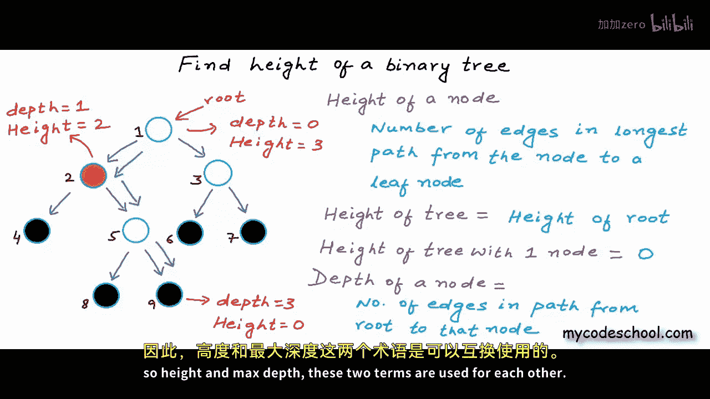

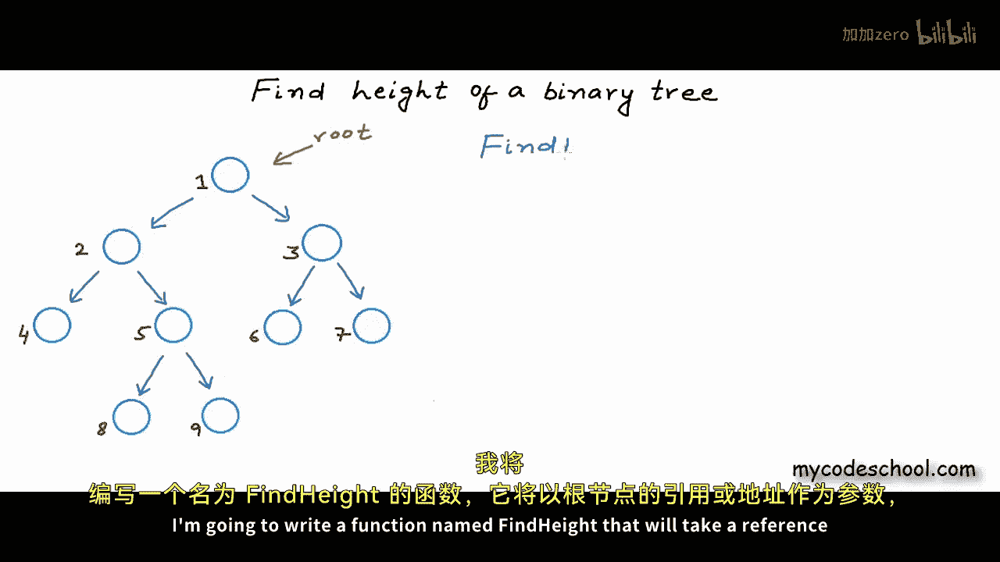

Now the logic to calculate height can be something like this for any node if we can somehow calculate the height of its leftre and also the height of its right subre。

 then the height of that node would be greaterter of the height of left and right subtes plus one for the root node in this tree height of the left subre is2 and height of the right subre is1。

 so height of the root node would be greaterter of these two values。Plus1。

Plus one for the edge connecting the root node to the sub3。So height of the root node。

 which would also be the height of the 3 is 3 here。In our code。

 we can calculate height of left and right subtes using recursion。

 what I'll do here in find height function is I'll first make a recursive call to find height of the left subre。

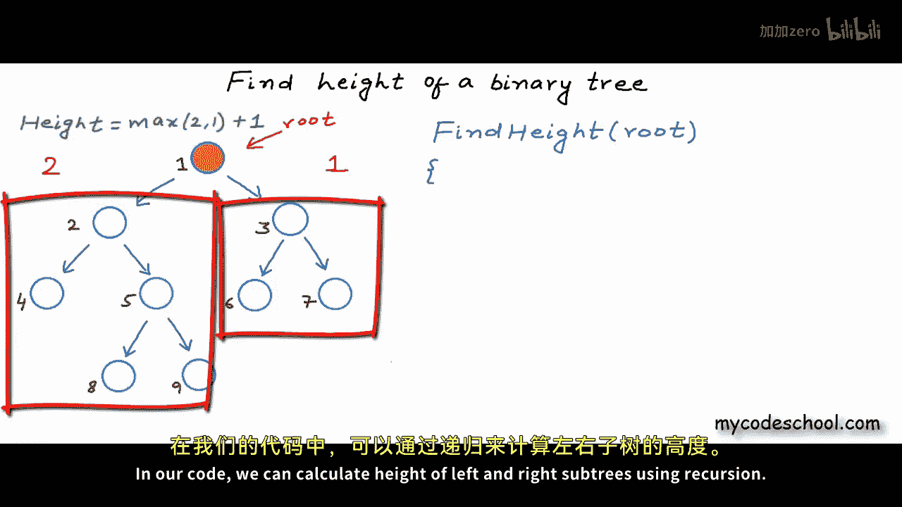

We can say to find height of left sub tree or to find height of left child。

 both will mean the same Im collecting the return of this recursive call in a variable named left height and now I'll make another recursive call to calculate height of right sub tree or right child now height of the tree or height of whatever node for which we have made this function call would be cratter of these two values。

 left height and right height plus 1。

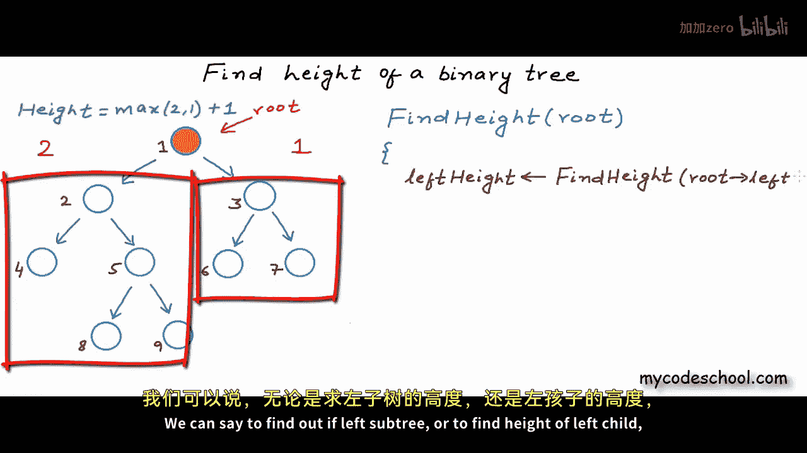

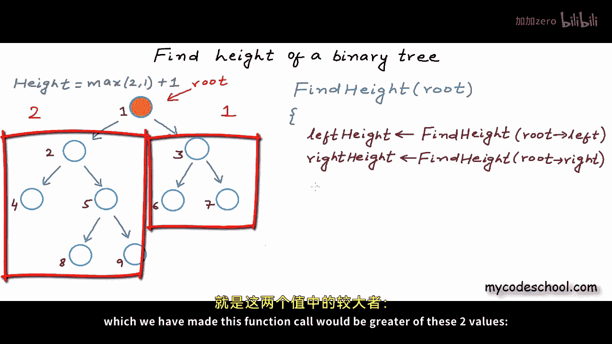

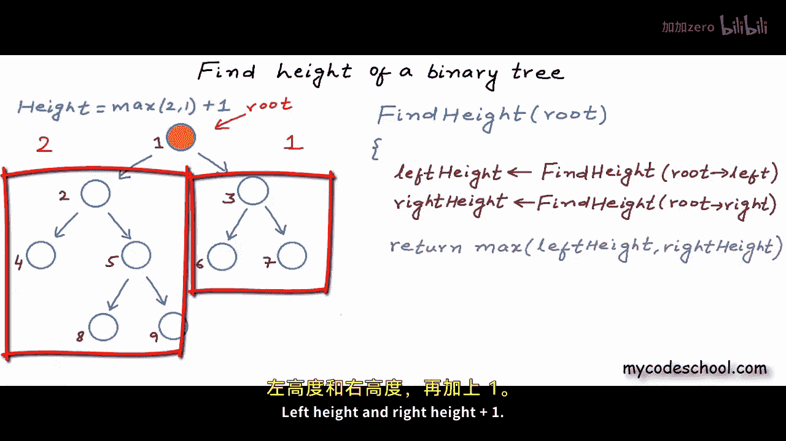

Now there is only one more thing missing in this recursion。

 we need to write the base or exit condition， we cannot go into recursion infinitely。

 what we can do is we can go on till we make a recursive call。

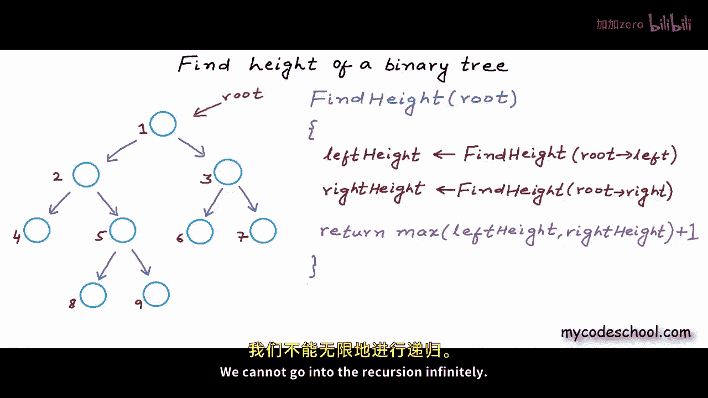

With root equal null， and if root is null that is if the tree or sub3 is empty we can return something。

 what should we return here， give this some thought if I have made a call to find height of let's say this leaf node this node with number7。

 then for this guy both left and right children on null in call for this node number7 we will make two recursive calls passing null in both the calls。

So what should we， should we return zero？If these two callss will return 0， then height of 7。

Will be1。Because in the return statement here， we are saying max off left and right right。Plus1。

 but as we had discussed earlier height of a leaf node should be 0。

 so if we are returning0 for root equal it's not al right， what we can do is we can return minus1。

When we are returning minus1， then this edge to null that does not exist but still was getting counted will be balanced with this minus1。

 I hope this is making sense。And going by convention also height of an empty3 is set to be minus1。

So this is pseudocode for my function to find height of a binary tree。

 some people define height as number of nodes in longest path from root to a leaf node。

 we are counting edges here and this is the right definition if you want to count number of nodes then for a leaf node height would be1 and for empty tree height would be zero so all you need to do is return zero here and this is the code if you want to count number of nodes but I think the right definition is number of edges so Ill return minus1 here。

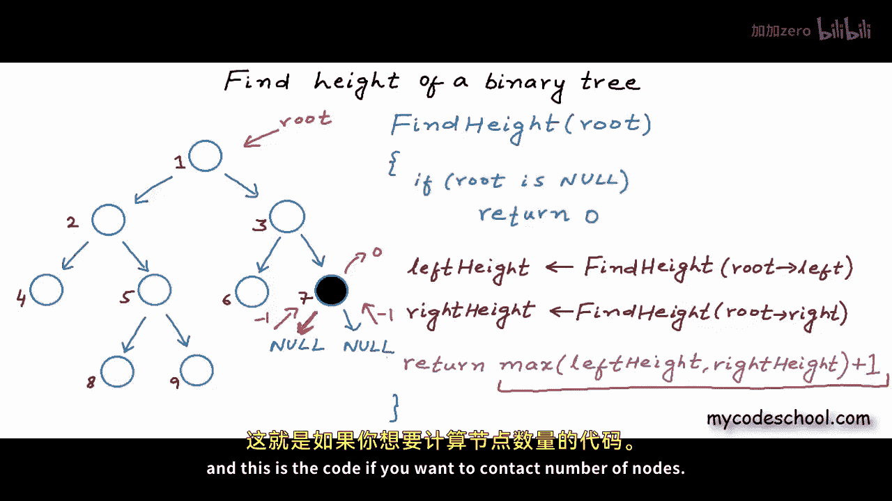

Time complexity of this function is big O of n where n is number of nodes in the tree。

 We will make one recursive call corresponding to each node in the tree。

 so we are kind of visiting each node in the tree once and so running time will be proportional to number of nodes。

 I'll skip detailed analysis of running time in this lesson。

 This is what my fine height function will look like in C or C plus plus Max here is a function that will return greater of to values past to it as arguments。

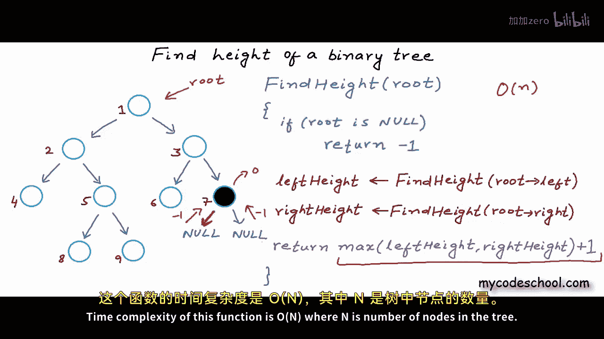

So this is it for this lesson， thanks for watching。

