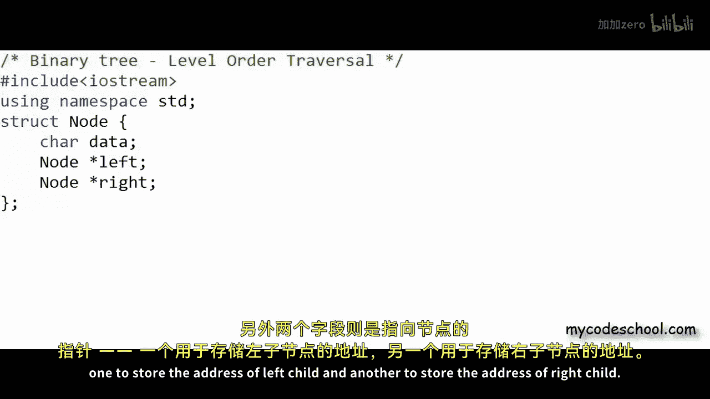
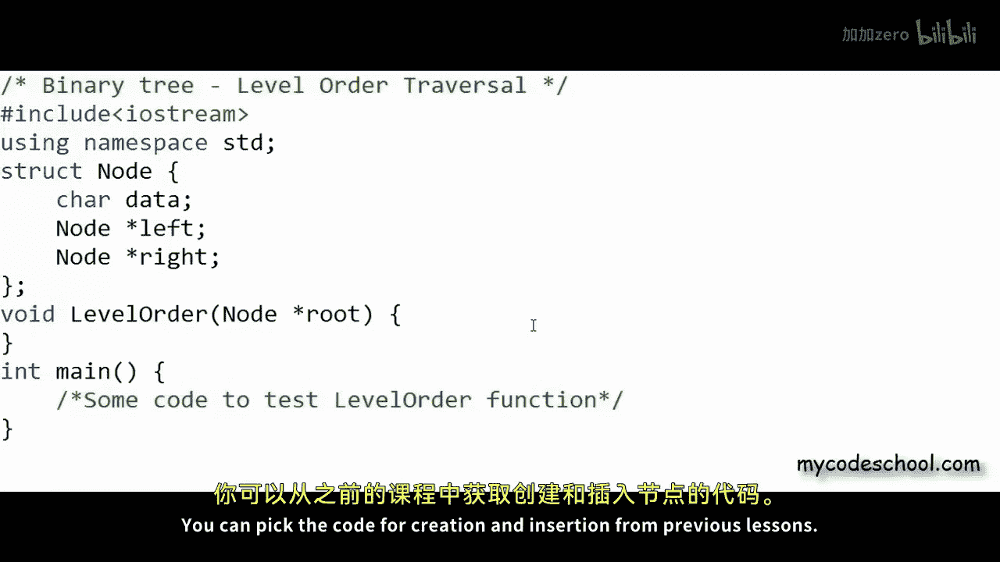
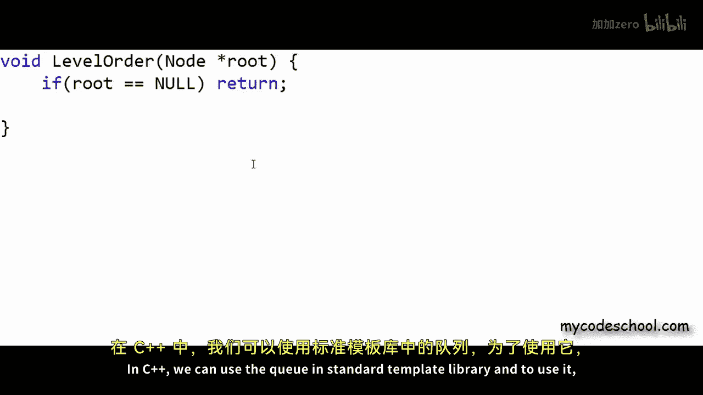
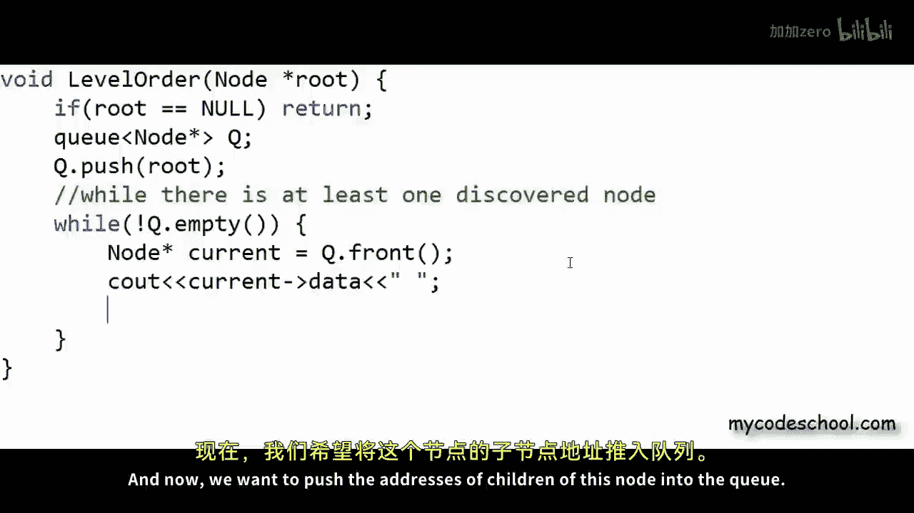
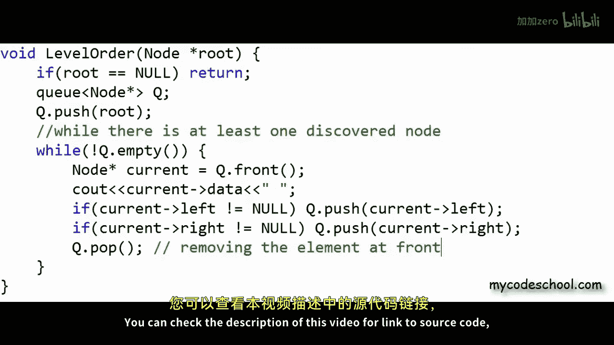
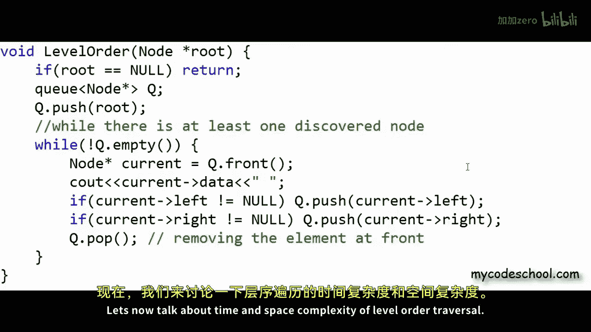
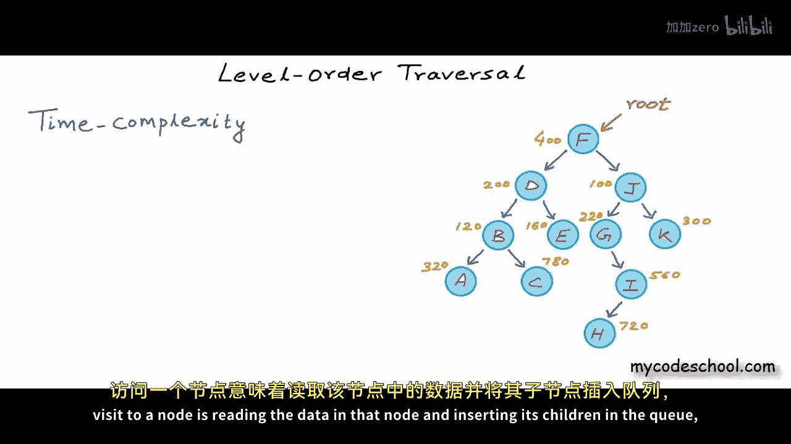

# mycodeschool【中英⚡数据结构｜Data Structures】 p33 p32 Binary tree： Level Order Traversal -BV1ckrLYREn2_p33-

In this lesson we are going to write code for level order traver cell of a binary tree as we have discussed in our previous lesson in level order traveral we visit all nodes at a particular depth or level in the tree before visiting the nodes at next deeper level for this binary tree that I'm showing here if I have to traverse the tree and print the data in nodes in level order then this is how we will go we will start at level 0 and print F and now we are done with level0 so we can go to level 1。

And we can visit the node at level 1 from left to right from F we will go to D and from D。

 we will go to J now level 1 is done so we can go to level 2。So we will go like B， E G， and then K。

And now we can go to next level， ACI， and finally we will be done at H。

This is the order in which we should visit the notes but the question is how can we visit the notes in this order in a program like linked list we can't just have one pointer and keep moving it if Ill start with a pointer at root let's say I have a pointer named current。

To point to the current node that I am visiting， then it's possible for me to go from f to D using this pointer because there is a link。

 so I can go left to D， but from D I cannot go to J because there is no link from D to J the only way we can go to J is from F and once we have moved the pointer to D we can't even go back to F because there is no backward link from D to F。

So what can we do to traverse the nodes in level order clearly we can't go with just one pointer What we can do is as we visit a node we can keep reference or address of all its children in a queue so we can visit them later a node in the queue can be calleddi node whose address is known to us but we have not visited it yet initially we can start with the address of root node in the queue to mean that initially this is the only discovered node let's say for this example tree address of the root node is 400。

And I'll assume some random addresses for other notes as well。

I will mark a discovered node in yellow okay now initially I am enqueing the root node and by storing a node in the queue I' means storing the address of the node in the queue。

So initially we are starting with one discovered node now as long as the queue has some discovered node。

 at least one discovered node， that is as long as the queue is not empty。

 we can take out a node from the front， visit it and then N queue its children visiting a node for us is printing the value in that node so I'll write f here。

And now I'll encue the children of this root node first I'll encue the left child。

And then the right child。I'll mark visited node in another color。 Okay。

 now we have one visited node and two discovered node。

And now once again we can take out the node at front of the queue visit it and in queue its children by using a queue we are doing two things here。

 first of all as we are moving from a node we are not losing reference to its children because we are storing the references and then because queue is our first in first out structure so a node that is discovered first that is inserted first we be visited first so we will get this ordered that we are desiring give this some thought and it is not very difficult to see。

Okay， so now we can de queue and visit this node at address 200 and once again before I move on from this node。

 I need to en queue its children。So now at this stage we have two visited nodes， three Disc nodes。

And six undiscovered nodes。 And now we can take out the next node from front of Q。

 We'll visit it and N queue its children。If we will go on like this all the notess will be visited in the order that we are desiring at this stage we can de queue node at 120。

 visit it， and then queue its children， so we will go on like this until all the notes are visited and the queue is empty。

After B， we will have E here， nothing will go into the Q this time， Next we will have G here。

And the address of I will go into the Q。 Now K will be visited。

Now at this stage we have reference to three nodes in the queue now we will visit this node at 320 with value a。

AndThen we have C， and now we will print I and the node width value edge。

 the node width data edge will go into the queue。Finally， we will visit this node。

 and now we are done with all the nodes， the queue is empty。

Once the queue is empty we are done with our traversal so this is the algorithm for level order traversal of a binary tree As you saw in this approach at any time we are keeping a bunch of addresses in the memory in the queue instead of using just one pointer to move around so of course we are using a lot of extra memory and I'll talk about the space complexity of this algorithm in some time I hope you got the core logic right let's now write code for this algorithm I'm going to write C plus plus here this is how I'm defining node for my binary tree I have a structure here with three fields one to store data and the data type is character this time because in the example tree that we were showing earlier data type as character and we have two more fields that are pointers to node one to store the address of left child and another to store the address of right childil now what I want to do here is I want to write a function named level order that should take a of the root node。

As argument and print the data in the nodes in level order now to test this function I'll have to write a lot of code to create and insert nodes in a binary tree。

 I'll have to write some more functions， I'll skip writing all that code you can pick the code for creation and insertion from previous lessons all I'll write is this function level order。

Now in this function here， I'll first take care of one corner case if the tree is empty。

 that is if root is null。We can simply return else if the tree is not empty。

 we need to create a Q I'm not going to write my own implementation of Q here in C plus plus we can use the Q in standard template library and to use it first we will have to write a statement like hash include。

Q here。 And now I can create a Q of any type in this function。

 I'll create a Q of pointer to node with a statement like this。Now as we had discussed earlier。

 initially we start with one discovered node in the queue the only node known to us initially is the root node with this statement Q do push root I have inserted the address of root node in the queue and now I'll run this while loop for which the condition is that the queue should not be empty and what I really mean here is that while there is at least one discovered node we should go inside the loop and inside the loop。

 we should take out a node from the front this function front returns the element at front of the queue and because the data type is pointer to node I am collecting the return of this function in this pointer to node named current now I can visit this node being pointed by current and by visiting if we mean reading the data in that node I'll simply print the data and now we want to push the addresses of children of this node into the queue so I'll say that if。

Left child is not null。

Insert it into the Q and similarly， if right child is not null。

 push it into the queue or rather push its address into the queue and I'll write one more statement to remove the element from front of the Q with call to front the element is not removed from the Q with this call pop we are removing the element。

Okay so this is implementation of level order traversal in C++ you can check the description of this video for a link to source code and there you can also find all the extra code to test this function let's now talk about time and space complexity of level order traversal。

If there are n nodes in the tree and in this algorithm visit to a node is reading the data in that node and inserting its children in the queue then a visit to a node will take constant time and each node will be visited exactly once so time taken will be proportional to the number of nodes or in other words we can say that the time complexity is big O of n for all cases irrespective of the shape of the tree time complexity of level order traveral will be big O of n now let's talk about space complexity。

Space complexity as we know is the measure of rate of growth of extra memory used with input size。

 we are not using constant amount of extra memory in this algorithm。

 we have this cu that will grow and shrink while executing this algorithm。

 assuming that the queue is dynamic maximum amount of extra memory used will depend upon maximum number of elements in the queue at any time we can have couple of cases in some cases extra memory used will be lesser and in some cases extra memory used will be greaterter。

For a tree like this where each node has only one child we will have maximum one element in the queue at any time and during each visit one node will be taken out from the queue and one node will be inserted。

 so the amount of extra memory taken will not depend upon the number of nodes。

Space complexity will be bigger of one。But for a tree like this the amount of extra memory used will depend upon the number of nodes in the tree。

 this is a perfect binary tree all the levels are full if you can see as detan will execute at some point for each level all the nodes in that level will be in the queue。

In a perfect binary tree， we will have n by two nodes at the deepest level。

So maximum number of nodes in the queue is going to be at least n by 2。

 so basically extra memory used is proportional to n the number of nodes。

 so space complexity will be pi of n for this case。I'm not going to prove it， but for average case。

 space complexity will be big O of n。So for both worst and average cases。

 we will be bigger off n in terms of space complexity and when we are saying best average and worst cases here。

 it's only going by space complexity。Time complexity will be big go off and for all cases so this is time and space complexity analysis of level order traveral I'll stop here now in next lesson we will discuss depth first traversal algorithms。

3re order in order and post order。 This is it for this lesson。 Thanks for watching。

