# mycodeschool【中英⚡数据结构｜Data Structures】 p35 p34 Check if a binary tree is binary search tree or not -BV1ckrLYREn2_p35-

In this lesson， we are going to solve a simple problem on binary tree。

 which is also a famous programming interview question。And the problem is given a binary tree。

 we need to check if the binary tree is a binary search tree or not。😊。

As we know， a binary tree is a tree in which each node can have amoOS to children。

All these trees that I have drawn here are binary trees， but not all of them are binary search trees。

Binary search tree as we know， is a binary tree in which for each node。

 value of all the nodes in left subtree is lesser and if we want to allow duplicates we can say lesser or equal and value of all the nodes in right sub tree is greaterta。

We can define binary search tree as a recursive structure like this。

Elements in left sub 3 must be lesser or equal and elements in right sub3 must be greaterter。

 and this should be true for all nodes and not just the root node。

 so left and right sub trees should themselves also be binary search trees。

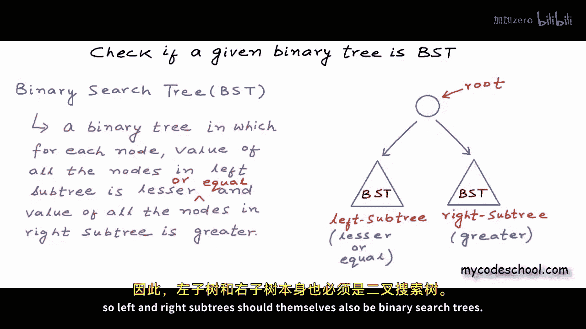

Of these binary trees that I'm showing here， A and C are binary search trees。

But B and D are not in B for the root node with value 10。

 we have 11 in its left sub tree which is greater than 10 and in a binary tree for any node all values in its left subre must be lesser。

Indeed we are good for the root node， the value in root node is 5 and we have1 in left sub3 which is lesser and we have 8。

 9 and 12 in right sub3 which are greaterta， so we are good for the root node but for this node with value 8 we have9 in its left。

So this tree is not a binary search tree so how should we go about solving this problem Basically I want to write a function that should take pointer or reference to root node of a binary tree as argument and the function should return true if the binary tree is BST false otherwise this is how my method signature will look like in C++。

In C， we do not have Boolean type， so return type here can be int， we can return1。

For true and0 for false。I'll also write the definition of node here。For a binary tree。

 node would be a structure with three fields。One to store data and two to store addresses of left and right children。

In my definition of node here， data type is integer。

 and we have two pointers to node to store addresses of left and right children。

Okay coming back to the problem there are multiple approaches and we are going to talk about all of them the first approach that I am going to talk about is easy to think of but it is not so efficient。

But let's discuss it anyway。We are saying that for a binary tree to be called binary search tree。

 it should have a recursive structure like this。For the root node。

 all the elements in left sub3 must be lesser or equal and all the elements in right sub3 must be greaterta。

 and left and right subtes should themselves also be binary search trees。

So let's just check for all of this。I'm going to write a function named is sub3 lesser that will take a dress off root node of a binary tree or sub3 and an integer value as argument。

And this function will return true if all the elements in the sub 3 are lesser than this value and similarly I'll write another function named it sub3 crta that will return true if all the elements in a sub3 are greaterta than a given value。

I have just declared these functions I'll write body of these functions later let's come back to this function is binary search3 in this function I'm going to say that if all elements in left sub3 are lesser and I'll verify this by making a call to a sub3 lesser function passing it address of left child of my current root left child would be the root of left sub3 and the data and root this function call will return true if all elements in left sub3 would be lesser than the data and root now the next thing that I want to check for is if elements in right sub3 are greater than the data and root or not。

These two conditions are not sufficient， we also need to check if left and right subtes are binary search trees or not。

 so I'll add two more conditions here I have made a recursive call to is binary search tree function passing it address of left childil and I have made another call passing address of right childil and if all these four function calls is subre lesser is subre crreta and is binary search tree for left in right sub trees return true if all these four checks pass then our tree is a binary search tree we can return true else we need to return false。

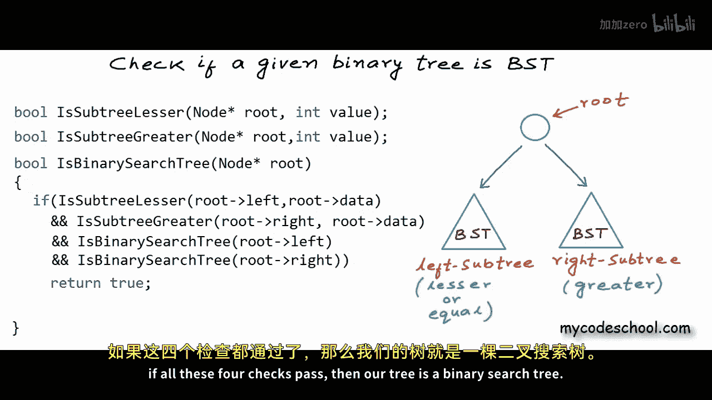

There is only one thing that we are missing in this function now we are missing the base case。😊。

If root is null that is if the tree or sub3 is empty we can return true。

 this is the base case for our recursion where we should stop with this much of code is binary search tree function is complete。

 but let's also write it sub3 lesser and its sub3 retro functions because they are also part of our logic。

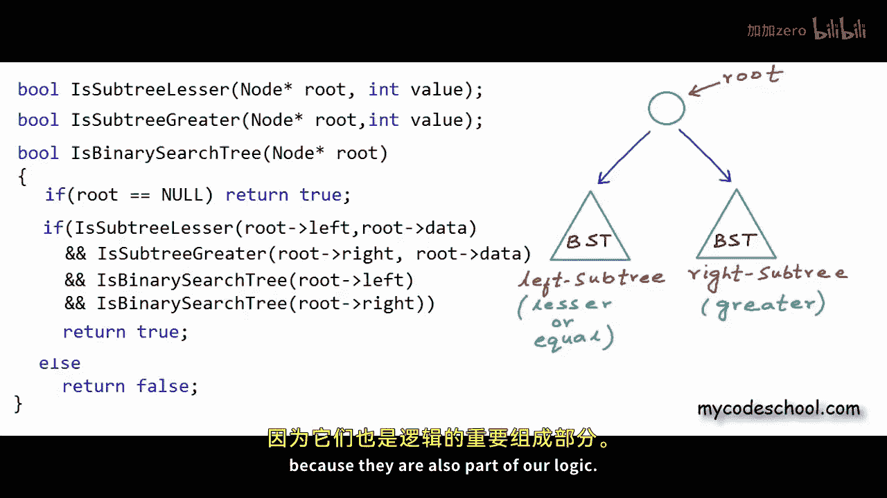

This function has to be a generic function that should check if all the elements in a given tree are lesser than a given value or not。

We will have to traverse the complete tree or sub3 and see value in all the nodes and compare these values against this given integer I'll first handle the base case in this function if the tree is empty we can return true else we need to check if the data in root is less than or equal to the given value and we also need to recursively check if left and right subtes of the current root have lesser value or not so Im adding two more conditions here I'm making two recursive calls one for the left sub3 and another for the right sub3 if all these three conditions are true then we are good else we can return false if subre crreta function will be very similar instead of writing these two functions is sub3 lesser and its sub subre crreta we could also do something like this we could find the maximum in left sub3 and compare it with the data in root if maximum of a sub3 is lesser。

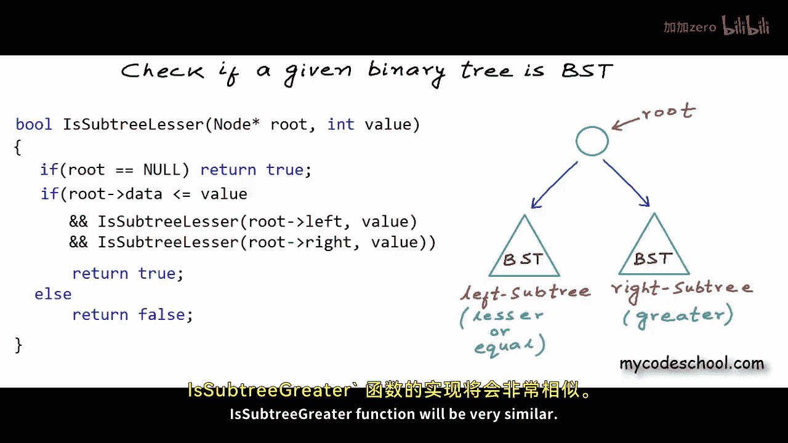

Then all the elements are lesser and similarly if the minimum of a sub 3 is crter all the elements are greaterta for the right sub 3 we could find the minimum so instead of writing these two functions it's sub3 lesser and it sub3 crreter we could write something like find max and find min and this would also fit so this is our solution using one of the approaches。

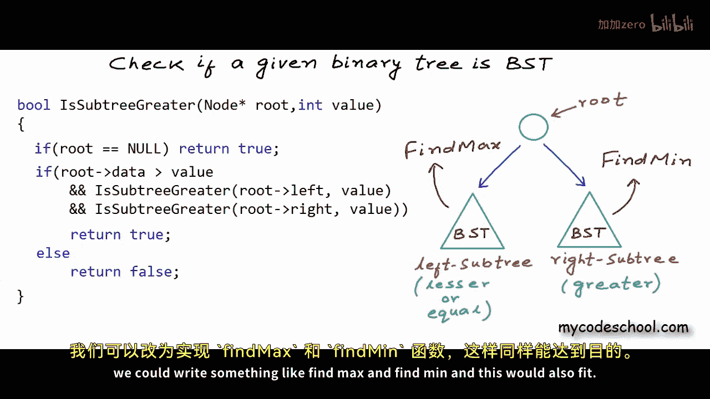

Let's quickly run this code on an example binary tree and see how it will execute。

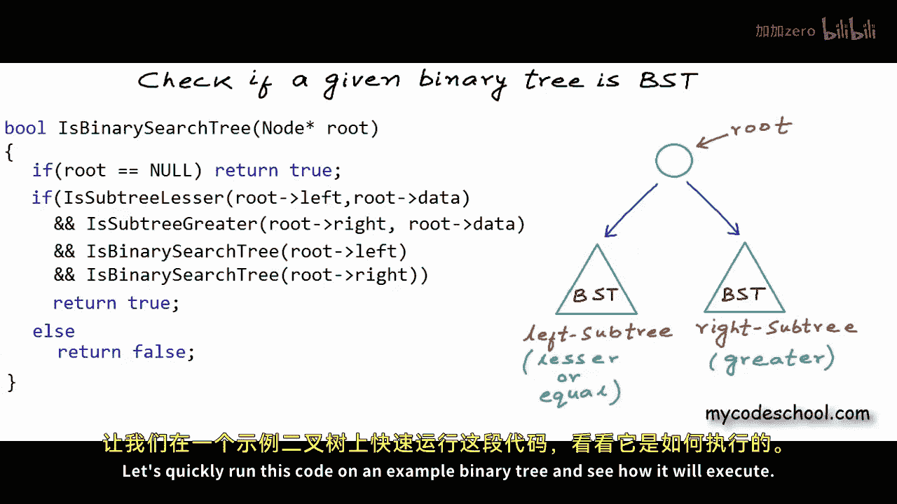

I have drawn a very simple binary tree here， which actually is a binary search tree。

Let's assume some addresses for these nodes in the tree。

 let's say the root node is at address 200 and I'll assume some random addresses for other nodes as well。

To check if this binary tree is a binary search tree or not。

 we will make a call to is binary search tree function。

 I'm writing IBST here as shortcut for is binary search tree because I'm short of space here。

 so I'll make a call to this function， maybe from the main function passing address 200。

Address of the root node。For this function call address in this local variable address collected in this local variable root will be 200。

Root is not null； null is only a macro for address zero。For this call root is not null。

 so we will not return through at this line。We will go to the next if。

Now here we will make a call to is sub3 lesser function。

Arguments passed will be address of left child， which is 150 and 7 the data in node at 200。

Execution of the calling function will pause and will resume only after the called function returns。

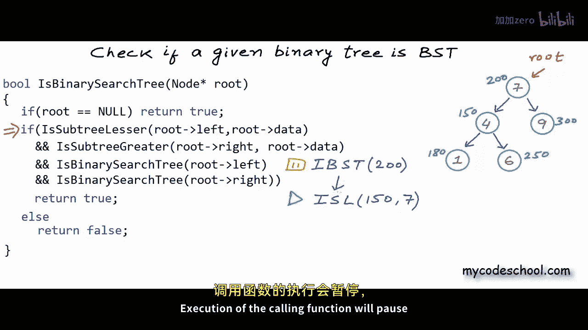

Now in this call to is sub 3 lesser root is not null so we will not return true at first line。

 we will go to the next f now here the first condition is if theta in root and root this time is 150 because this call is for this left sub 3 and for this left sub 3。

Address of route is 150 data in route is 4。Which is lesser than 7。

So the first condition is true and we can go to the second condition， which is a recursive call。

This call will pause and we will go to the next call。😔。

Here once again the data in node at 1801 is lesser than 7。

 so first condition is true and we will make a recursive call left subree for node at 180 is null there is no left child so we will return at first line root is null this time。

This particular call will simply return true now in this previous call when route is 180 second condition for if is also true。

 so we will make another call for right sub3。Once again。

 at riskpers will be 0 and we will simply return true。And now for this call is sub3 lesser 187。

 all three conditions are true so this guy can also return true and now this call IL 157 will resume now this guy will make a recursive call for the right sub3。

And this guy after everything， will also return true。Now for this call。

 because all three conditions in the if statement are true。

 this guy will also return true and now is binary search tree function will resume。

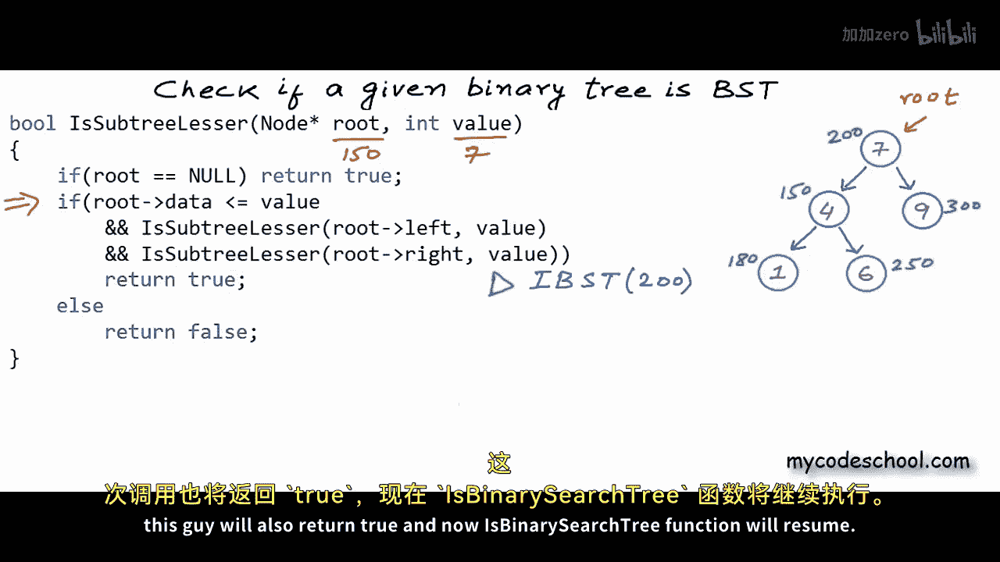

For this call we have evaluated the first condition we have got true now this guy will make another call to its sub3 crter。

Passing address of right childil and value 7， this guy after everything will return true。

And now we will have two recursive calls to check if left and right subrees are binary the research trees or not。

 we will first have a call for the left subtree。The execution will go on like this。

 but I want you to see something in each call binary search tree function we are comparing the data in root with all the elements in left subre and then all the elements in right subre。

This example tree could be really large then in that case。

 in the first call to is binary search tree for this complete tree。

 we would recursively traverse this whole left subre to see whether all the values in this subre are less than7 or not。

 and then we will traverse all nodes in this right sub tree to see if values are greater than7 or not。

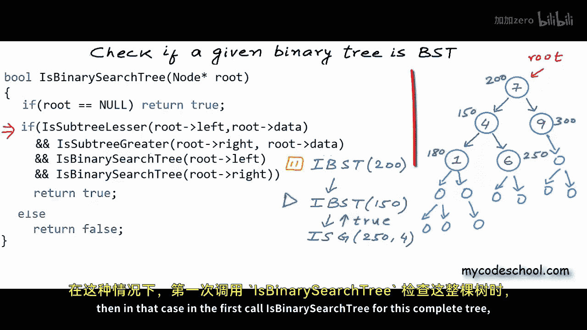

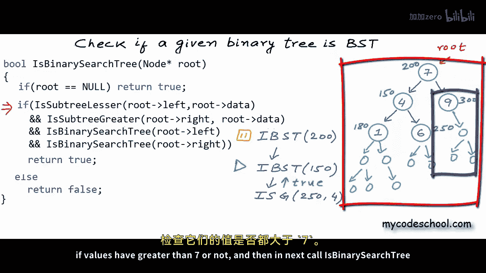

And then in next call to a binary search tree， when we would be validating whether this particular subree is PST or not。

 we would recursively traverse this subre if values are lesser than 4 or not。

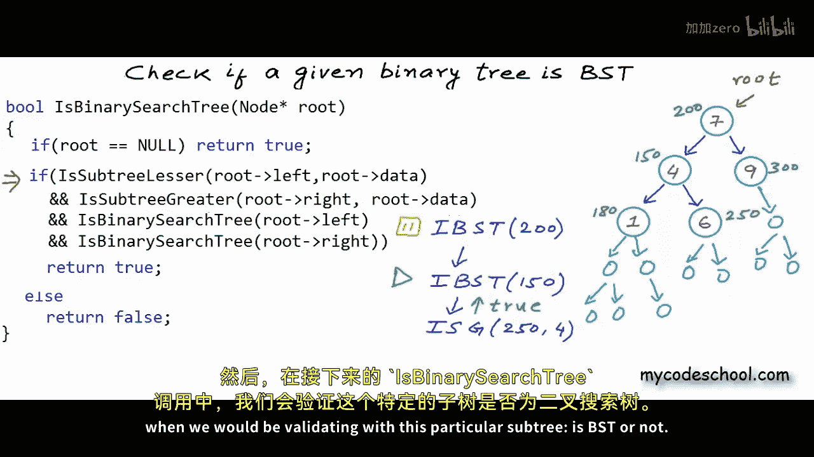

And this sub to see if values are greater than 4 or not。

 so all in all during this whole process there will be a lot of traversal data in notes will be read and compared multiple times。

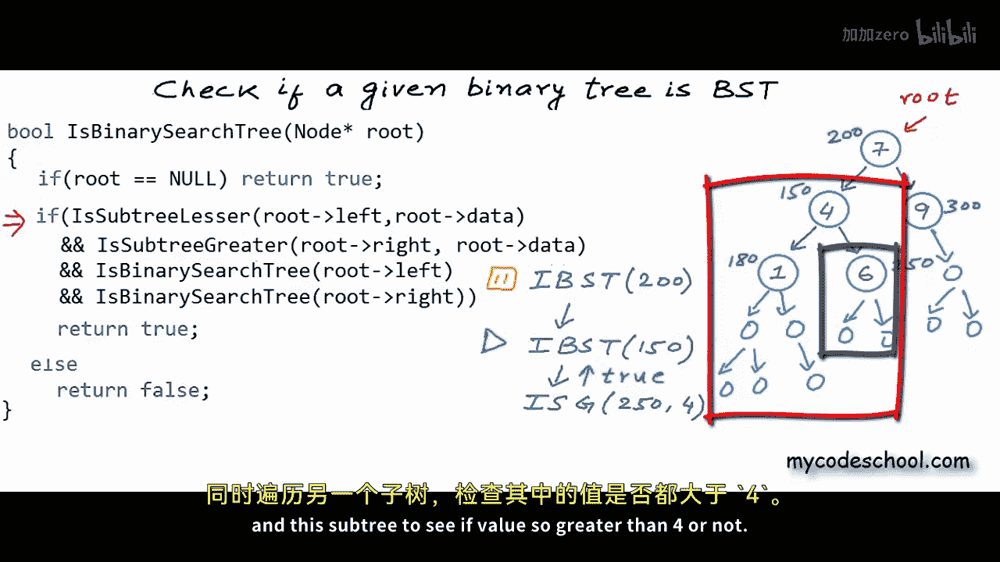

If you can see all nodes in this particular subree will be traversed once in called to a binary search tree for 200 when we will compare value in these nodes with 7 and then these node will once again。

Be traversed in call to is binary search 3 for 150 when they will be compared with4 they will be traversed in call to its subre lesser all in all these two functions it sub3 lesser and its sub3 crta are very expensive for each node we are looking at all nodes in its subrees there is an efficient solution in which we do not need to compare data in a node with data in all nodes in its subrees and let's see what the solution is。

What we can do is we can define a permissible range for each node and data in that node must be in that range。

We can start at the root node with range minus infinity to infinity because for the root node there is no upper and lower limit and now as we are traversing we can set range for other nodes when we are going left we need to reset the upper bound so for this node at 150 data has to be between minus infinity and 7。

Data in left child cannot be greater than data in root if we are going right we need to set the lower bound for this node at 300 range would be 7 to infinity。

7even is not included in the range data has to be strictly greater than 7。For this node at 180。

 the range will be minus infinity to 4 for this node with value 6。

 lower bound will be4 and upper bound would be 7。Now my code will go like this。

 my function as binary a search tree will take two more arguments。

An integer to mark the lower bound or min value and another integer to mark the upper bound or max value and now instead of checking whether all the elements in left subre are lesser than the data and root and all the elements in right subre are greater than the data and root or not we will simply check whether data in root is in this range or not so I'll get rid of these two function calls its subre lesser and its sub greater which are really expensive and I'll add these two conditions data and root must be greater than min value and data and root must be less than max value these two checks will take constant time its subre lesser and its subre greaterta functions where not taking constant time running time for them was proportional to number of nodes in the sub3。

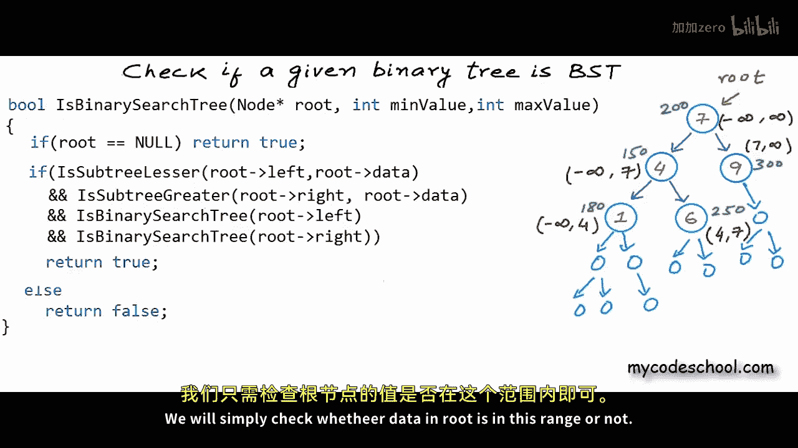

Okay now these two recursive calls should also have two more arguments。

For the left child lower bound will not change； upper bound will be the data in current node and for the right child upper bound will not change and lower bound will be the data in current node。

This recursion looks good to me， we already have the base case written。

The only thing is that the color of his binary search tree function may only want to pass the address of root node。

 so what we can do is instead of naming this function is binary search tree。

 we can name this function。

As a utility function like is BST u and we can have another function named is binary search3 in which we can take only the address of root node and this function can call BST is BST u function passing address of root minimum possible value in integer variable for minus infinity and maximum possible value in integer variable for plus infinity int min and int max here our macros for minimum and maximum possible values in int。

 so this is our solution using second approach which is quite efficient。

In this recursion， we will go to each node once and at each node we will take constant time to see whether data in that node is in a defined range or not。

Time complexity would be big O of n where n is number of nodes in the binary tree。

For the previous algorithm at time complexity was big O of n square one more thing in this code have not handled the case that Min research tree can have duplicates。

 I am saying that elements in left subt must be strictly lesser and elements in right sub3 must be strictly greater。

 I leave it for you to see how you will allow duplicates。

There is another solution to this problem you can perform in order traveral of binary tree and if the tree is binary search tree you would read the data in sorted order in order traver cell of a binary search tree gives a sorted list you can do some hack while performing in order traversal and check if you are getting the elements in sorted order or not during the whole traver cell you only need to keep track of previously red node and at any time data in a note that you are reading must be greater than data in previously red node try implementing this solution it will be interesting okay I'll stop here now in common lessons we will discuss some more problems on binary tree thanks for watching。

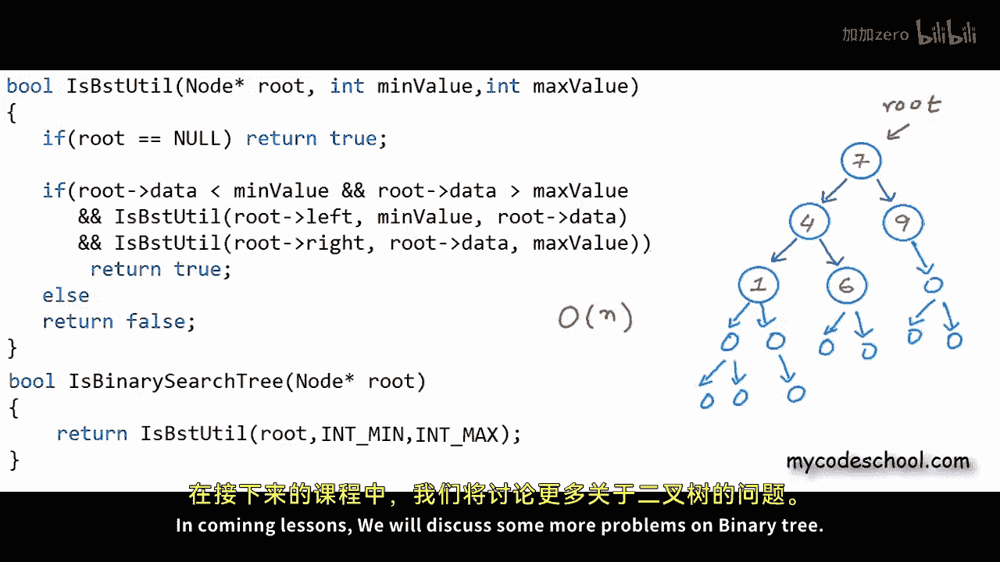