# mycodeschool【中英⚡数据结构｜Data Structures】 p38 p37 Data structures： Introduction to graphs -BV1ckrLYREn2_p38-

Hello everyone， so far in this series on data structures we have talked about some of the linear data structures like array。

 linked list， stack and Q in all these structures data is arranged in a linear or sequential manner so we can call them linear data structures。

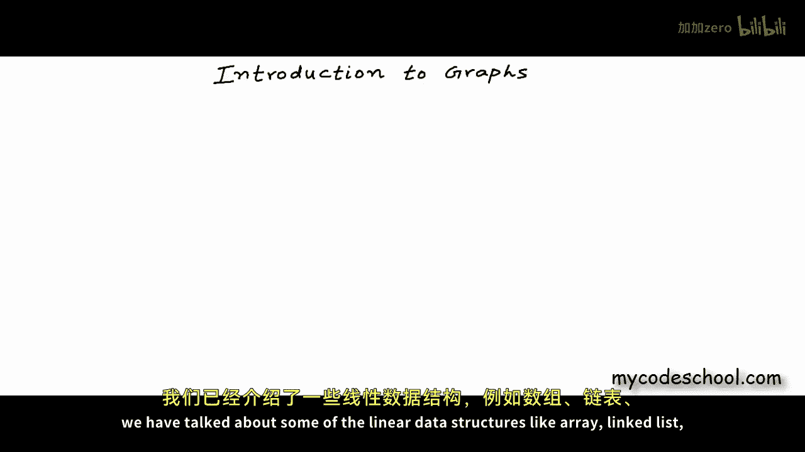

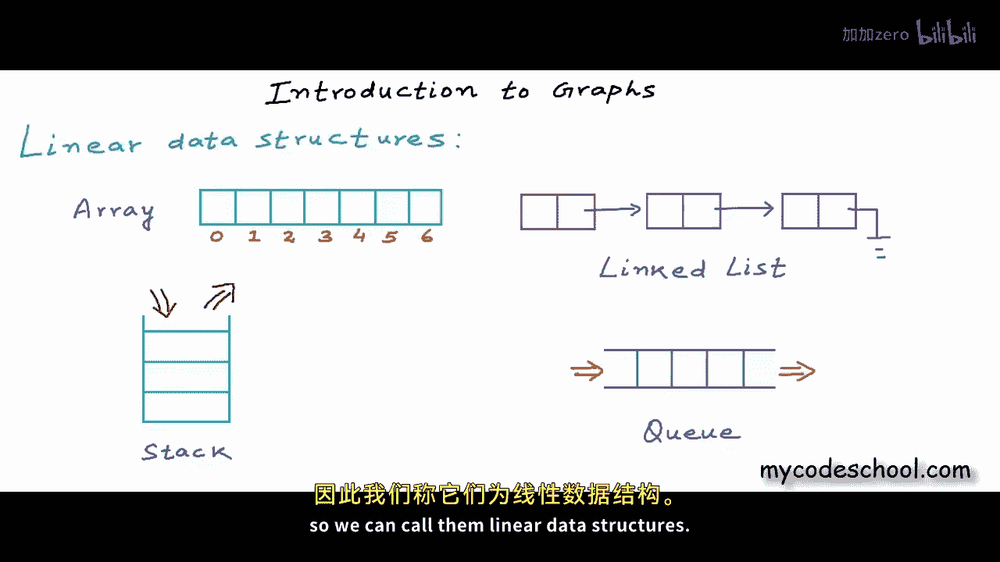

And we have also talked about3， which is a nonlinear data structure。😊。

Threee is a hierarchical structure now as we understand。

 data structures are ways to store and organize data and for different kinds of data we use different kinds of data structures。

In this lesson we are going to introduce you to another nonlinear data structure that has got its application in a wide number of scenarios in computer science。

 It is used to model and represent a variety of systems and this data structure is graph When we study data structures we often first study them as mathematical or logical models here also we will first study graph as a mathematical or logical model and we will go into implementation details later Okay。

 so let's get started。 a graph just like a tree is a collection of objects or entities that we call nodes or vertices connected to each other through a set of edges but in a tree connections are bound to be in a certain way in a tree there are rules dictating the connection among the nodes in a tree with n nodes。

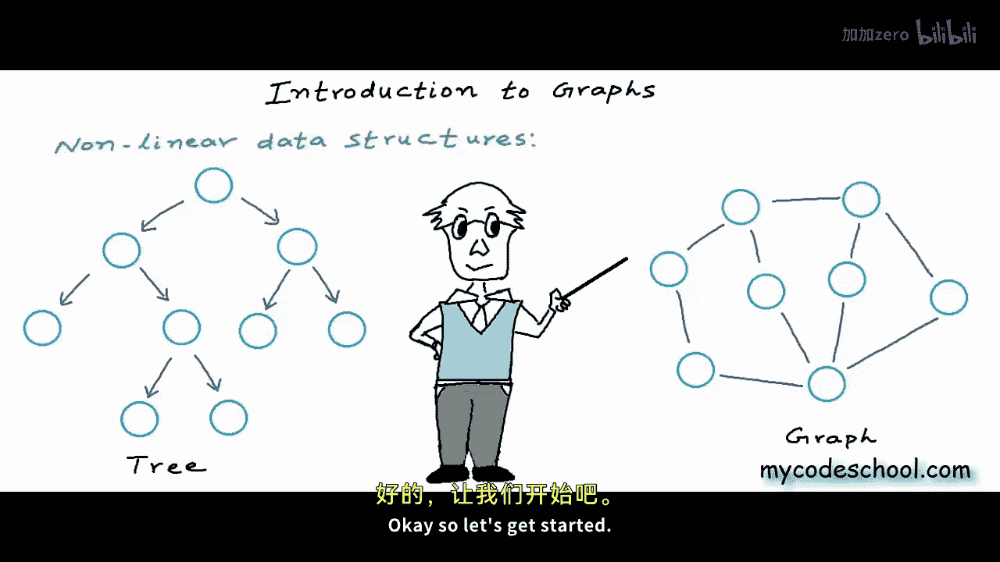

We must have exactly n-1 edges。One edge for each parent child relationship as we know an edge in a tree is for a parent child relationship and all nodes in a tree except the root node would have a parent would have exactly one parent and that's why if there are n node there must be exactly n minus1 edges in a tree all nodes must be reachable from the root and there must be exactly one possible path from root to a node。

Now in a graph， there are no rules dictating the connection among the nodes。

A graph contains a set of nodes and a set of edges。

 and edges can be connecting nodes in any possible way。 tree is only a special kind of craft。

 Now graph as a concept has been studied extensively in mathematics。

If you have taken a course on discrete mathematics。

 then you must be knowing about graphs already in computer science we basically study and implement the same concept of craft from mathematics The study of graphs is often referred to as craft theory。

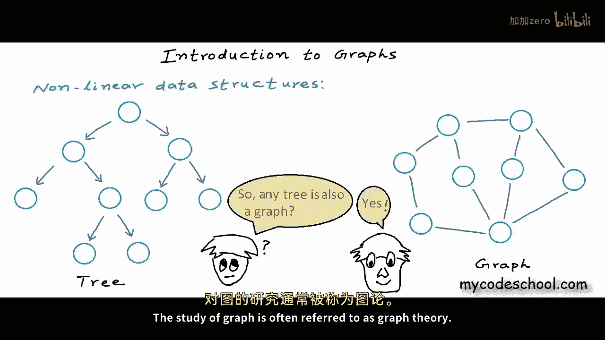

In pure mathematical terms， we can define graph something like this。

 A graph G is an ordered pair of a set v of vertices and a set E of edges。

 Now I am using the mathematical jargon here。 An ordered pair is just a pair of mathematical objects。

In which the order of objects in the pair matters。 This is how we write and represent an ordered pair。

Objects separated by comma put within parenthesis。Now， because the order here matters。

 we can say that v is the first object in the pair and E is the second object an ordered pair A B is not equal to B A。

Unless A and B are equal in our definition of graph here。

 first object in the pair must always be a set of vertices。

And the second object must be a set of edges。That's why we are calling the pair an ordered pair。

 We also have concept of anaudered pair。 and unaudered pair is simply a set of two elements。

 Order is not important here。 We write an unaudered pair using curly brackets or braces。

Because the order is not important here， unaued pair A B is equal to B A。

 it doesn't matter which object is first and which object is second。Okay。

 coming back So a graph is an ordered pair of a set of vertices and a set of edges and G equal V E is a formal mathematical notation that we use to define a graph。

 Now I have a graph drawn here in the right。 This graph has8 vertices and 10 edges。

 What I want to do is I want to give some names to these vertices。

 because each node in a graph must have some identification。 It can be a name or it can be an index。

 I'm naming these vertices as v1 v2 v3， v4 v5 and so on。

 and this naming is not indicative of any order。 There is no first second and third node here。

 I could give any name to any node。 So my set of vertices here。

 is this we have8 elements in the set v1 v2 v3， v4 v5 v6 v7 and v8 So this is my set of vertices for this graph。

 Now what's my set of edge。

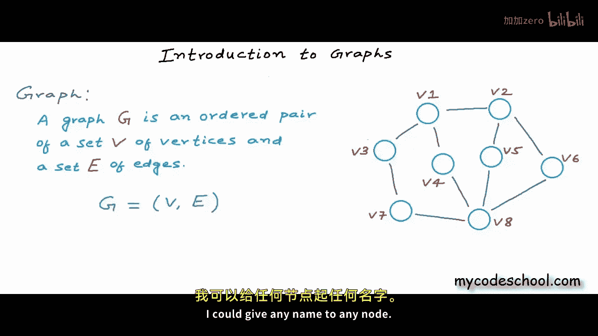

Yes。To answer this， we first need to know how to represent an edge。

 and edge is uniquely identified by its two end points。

So we can just write the names of the two endpoints of an edge as a pair and it can be a representation for the edge。

But edges can be of two types。 We can have a directed edge in which connection is one way。

Or we can have an undirected edge in which connection is2 way in this example graph that I'm showing here。

 edges are undirected， but if you remember the tree that I had shown earlier。

Then we have directed edges in that tree with this directed edge that I am showing you here。

 we are saying that there is a link or path from vertex U to v。

 but we cannot assume a path from v to U this connection is one way for a directed edge one of the endpoint would be the origin and the other endpoint would be the destination and we draw the edge with an arrowhead pointing towards the destination。

For our edge here， origin is U and destination is V。

 A directed edge can be represented as an ordered pair。

 First element in the pair can be the origin and second element can be the destination。

So with this directed edge represented as audit pair UV。

 we have path from U to v if we want path from v to U。

 we need to draw another directed edge here with V as origin and U as destination。

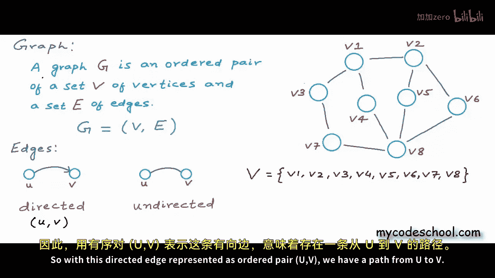

And this edge can be represented as ordered per V U。

 The upper one here is Uv and the below one is V U。And they are not same。 Now。

 if the edge is undirected， the connection is2 way an undirected edge can be represented as an unordered pair here because the edge is bidirectional origin and destination are not fixed。

 We only need to know what two endpoints are being connected by the edge。

 So now that we know how to represent edges， we can write the set of edges for this example graph here。

 we have an undirected edge between v1 and v2。 then we have one between v1 and v3。

 Then we have v1 v4。 This is really simple I'll just go ahead and write all of them。

 So this is my set of edges。Typically in a graph all edges would either be directed or undirected its possible for a graph to have both directed and undirected edges but we are not going to study such graphs we are only going to study graphs in which all edges would either be directed or undirected a graph with all directed edges is called a directed graph or diegraph and a graph with all undirected edges is called an undirected graph there is no special name for an undirected graph。

Usually， if the graph is directed， we explicitly say that it's a directed graph or digraph。

So these are two types of graph directed graph or digraph in which edges are unidirectional or audit peerers and undirected graph in which edges are bidirectional or unau peerce now many real world systems and problems can be modeled using a graph graphs can be used to represent any collection of objects having some kind of pairwise relationship。

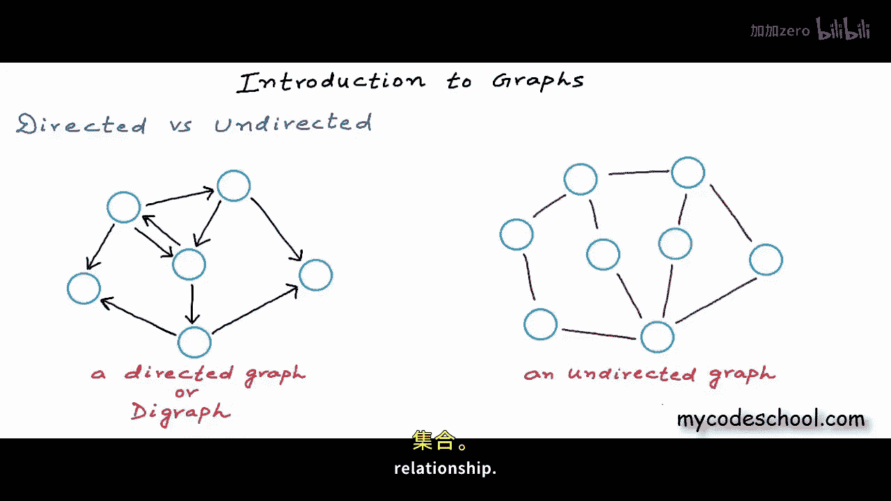

Let's have a look at some of the interesting examples。

A social network like Facebook can be represented as an undirected craft。

 a user would be a node in the graph， and if two users are f there would be an edge connecting them。

A real social network would have millions and billions of nodes。

I can show only few in my diagram here because I'm short of space now social network is an undirected graph because friendship is a mutual relationship if I'm your friend you or my friend too so connections have to be two way Now once a system is modeled as a graph a lot of problems can easily be solved by applying standard algorithms in graph theory like here in this social network let's say we want to do something like suggest friends to a user。

Let's say we want to suggest some connections to drama。

One possible approach to do so can be suggesting friends of friends who are not connected already。

 Rama has three friends， Ella， Bob and Kaie and friends of these three that are not connected to Rama already can be suggested there is no friend of Ella。

 which is not connected to Rama already Bob however， has three friends Tom。

 Sam and Li that are not friends with Rama so they can be suggested。

 and Katie has two friends Li and Suwati that are not connected to Rama we have counted Li already so in all we can suggest these four users to Rama。

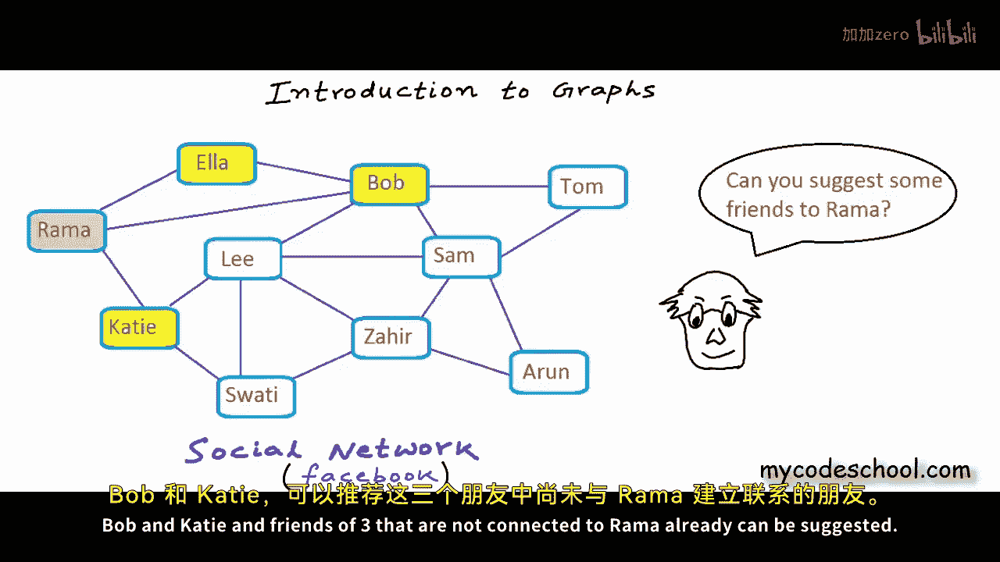

Now even though we described this problem in context of a social network。

 this is a standard graph problem， the problem here in pure graph terms is finding all nodes having length of shortest path from a given node equal to two standard algorithms can be applied to solve this problem。

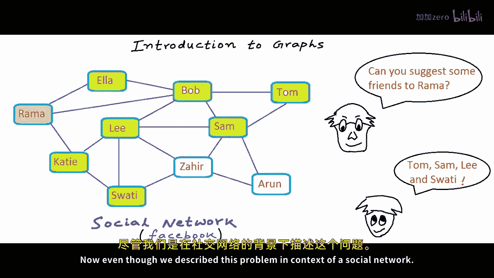

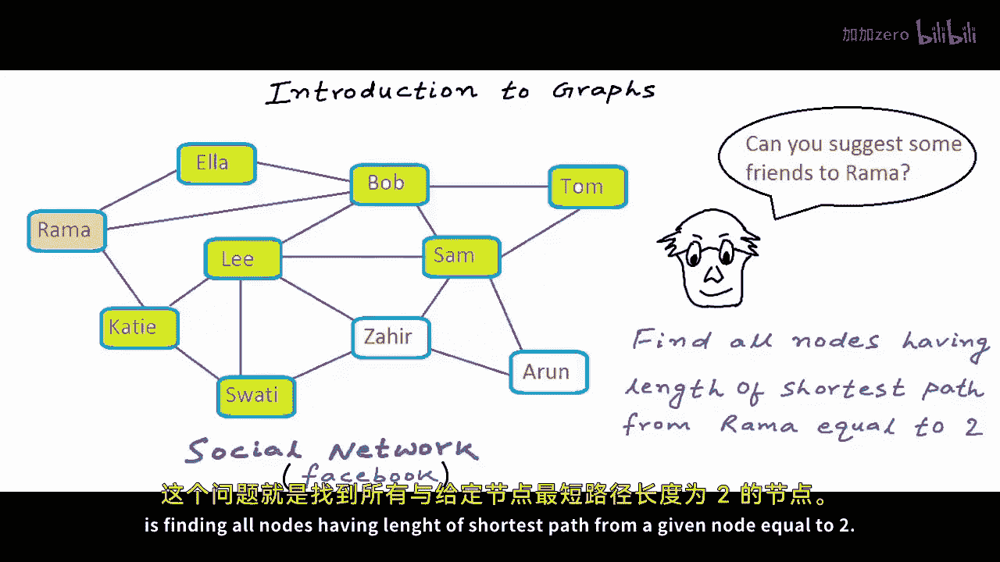

We'll talk about concepts like path in a graph in some time for now just know that the problem that we just described in context of a social network is a standard craft problem。

Okay so a social network like Facebook is an undirected graph now let's have a look at another example。

 interlinked web pages on the internet or the worldwide wide web can be represented as a directed graph a web page that would have a unique address or URL would be a node in the graph and we can have a directed edge if a page contains linked to another page。

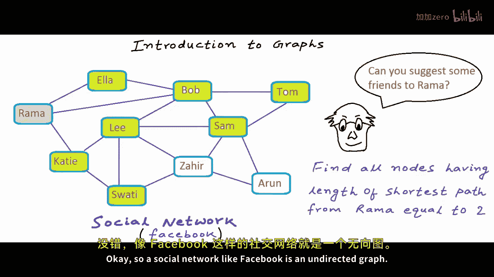

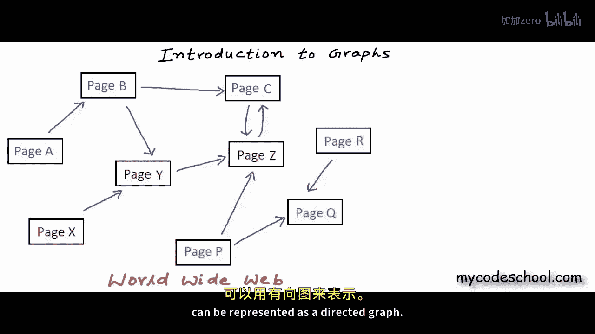

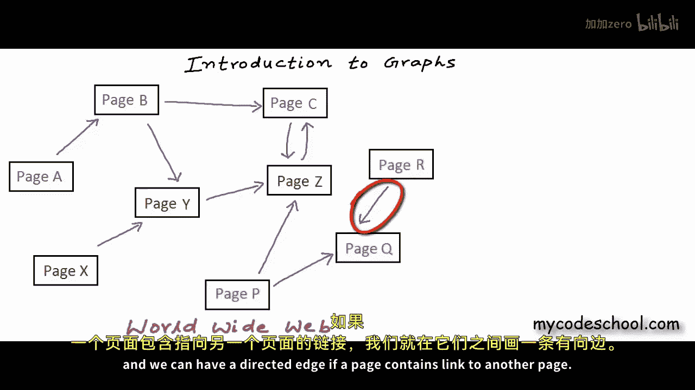

Now once again， there are billions of pages on the web。

 but I can show only few here the edges in this graph are directed because the relationship is not mutual this time。

If page A has a link to page B， then it's not necessary that page B will also have a link to page A let's say one of the pages on Mycodeschool。

com has a tutorial on craft and on this page I have put a link to Wikipedia article on graphra let's assume that in this example graph that I'm showing you here page P is my Mycodechooltu on graphra with this address or URL Mycodeschool。

com/vios/lash graph and let's say page Q is the Wikipedia article on graph with this URL Wikipedia。

org/wiki/ graph now on my page that is page P I have put a link to Wikipedia page on graphra if you are on page P you can click on this link and go to page Q。

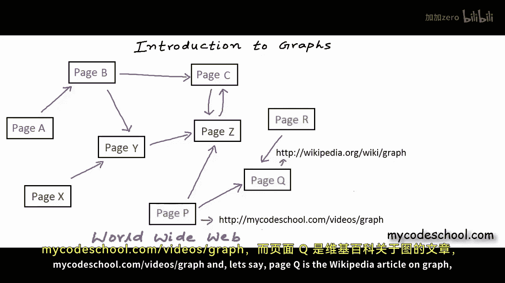

But Wikipedia has not reciprocated to my favor by putting a link back to my page。

 so if you are on page Q you cannot click on a link and come to page P connection here is one way。

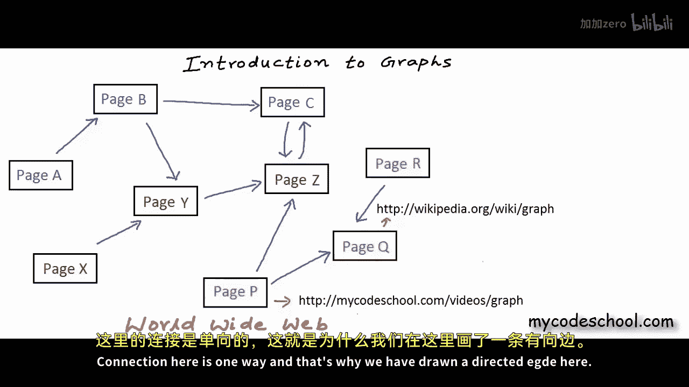

And that's why we have drawn a directed edge here okay now once again。

 if we are able to represent web as a directed graph。

 we can apply standard craft theory algorithms to solve problems and perform tasks One of the tasks that search engines like Google perform very regularly is web crawling。

Search engines use a program called webcrawler that systematically browses the worldwide web to collect and store data about web pages search engines can then use this data to provide quick and accurate results against search queries now even though in this context we are using a nice and heavy term like web crawling web crawling is basically graph traversal or in simpler words act of visiting all node in a graph and no prizes for guessing that there are standard algorithms for graph traveral will be studying graph traveral algorithms in later lessons okay now the next thing that I want to talk about is concept of a weighted graph sometimes in a graph all connections cannot be treated as equal some connections can be preferable to others like for example。

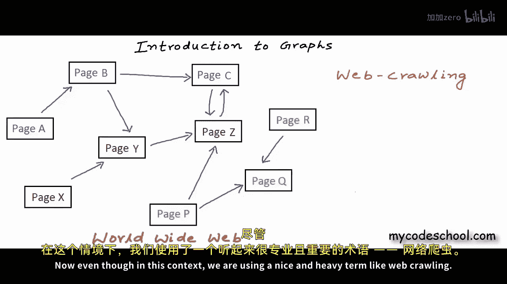

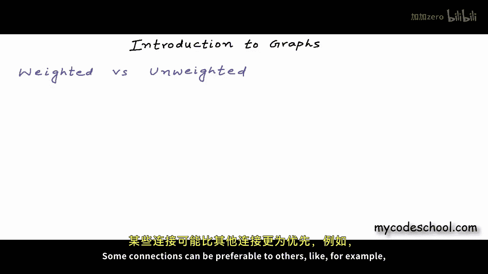

We can represent intercity road network that is the network of highways and freeways between cities as an undirected craft I am assuming that all highways would be bi directionional intrac road network that is road network within a city would definitely have one way roads。

And so intracity road network must be represented as a directed craft。

 but intercity road network in my opinion can be represented as an undirected craft Now clearly we cannot treat all connections as equal here roads would be of different length and to perform a lot of tasks to solve a lot of problems we need to take length of roads into account In such cases we associate some weight or cost with every edge we label the edges with their weights in this case weight can be length of the roads so what I'll do here is I'll just label these edges with some values for their lens。

Let's say these values are in kilometers。And now edges in this graph are weighted and this graph can be called a weighted graph let's say in this graph we want to pick the best route from city A to city D have a look at these four possible routes I am showing them in different colors now if I would treat all edges as equal then I would say that the green route through B and C。

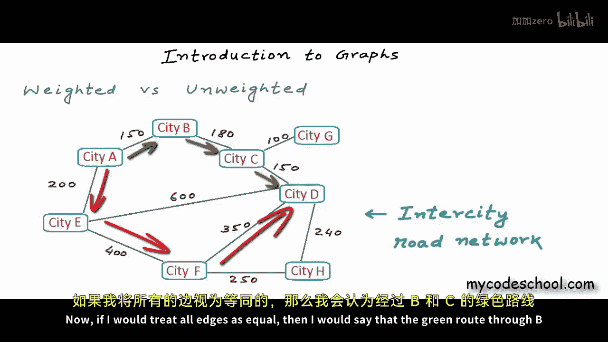

And red route through E and F are equally good。 Both these parts have three edges。

And this yellow route 3 E is the best because we have only two edges in this path。

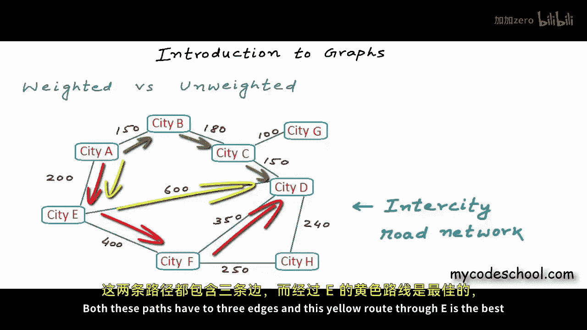

But with different weights assigned to the connections。

 I need to add up weight s edges in a path to calculate total cost when I am taking weight into account。

 shortest route is through B and C connectionsions have different weights and this is really important here in this graph。

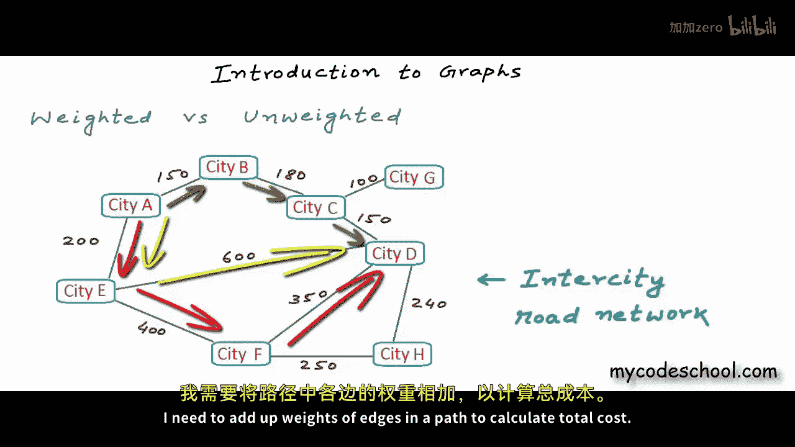

Actually， we can look at all the graphs as weighted graphs。

An unweighted graph can basically be seen as a weighted graph in which weight of all the edges is same and typically we assume the weight as1。

Okay， so we have represented Intercity's Road network as a weighted undirected graph。

Social network was an unweighted undirected graph and World W Web was an unweighted directed graph and this one is a weighted undirected graph。

Now， this was interc road network。 I think intra city road network that is road network within our city can be modeled as。

A weighted directed craft because in a city there would be some one ways Inters in intrac road network would be nodes and road segments would be our edges。

And by the way we can also draw an undirected graph as directed it is just that for each undirected edge we have two directed edges。

 we may not be able to redraw a directed graph as undirected。

 but we can always redraw an undirected graph as directed。

Okay I'll stop here now this much is good for an introductory lesson In next lesson we will talk about some more properties of craft。

 This is it for this lesson thanks for watching。

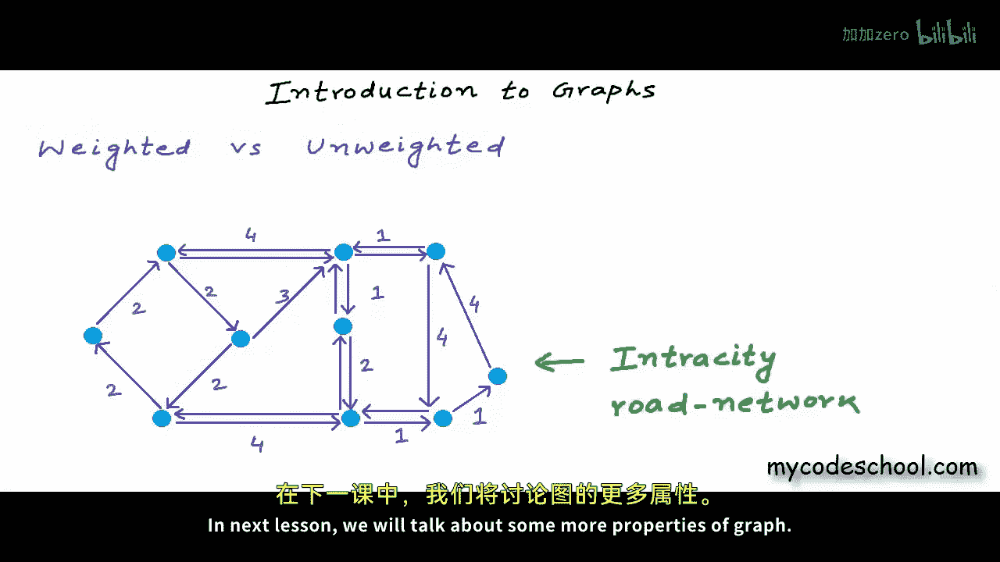