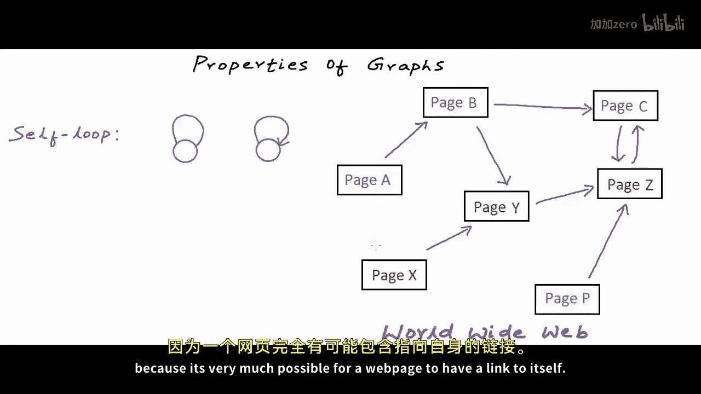
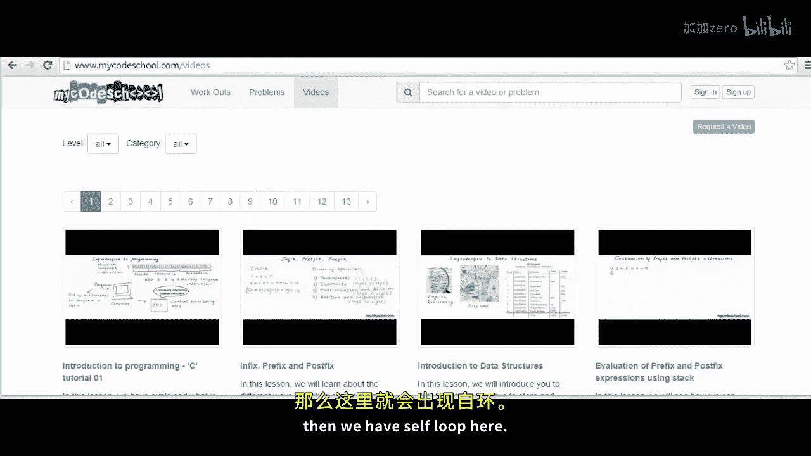
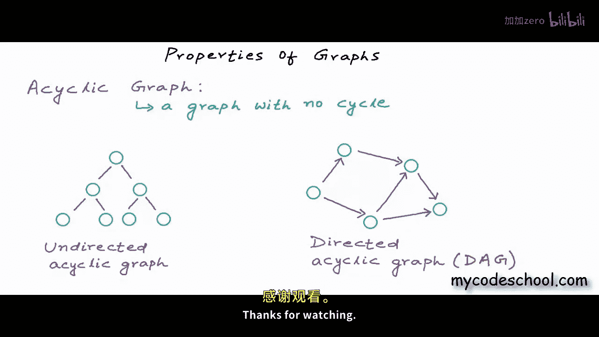

# mycodeschool【中英⚡数据结构｜Data Structures】 p39 p38 Data structures： Properties of Graphs -BV1ckrLYREn2_p39-

In our previous lesson we introduced you to graphs we defined graph as a mathematical or logical model and talked about some of the properties and applications of graph Now in this lesson we will discuss some more properties of graph but first I want to do a quick recap of what we have discussed in our previous lesson a graph can be defined as an ordered pair of a set of vertices and a set of edges we use this formal mathematical notation G equal V E to define a graph here V is set of vertices and E is set of edges ordered pair is just a pair of mathematical objects in which order of objects in the pair matters it matters which element is first and which element is second in the pair Now as we know to denote number of elements in a set that we also call cardinality of a set we use the same notation that we use for modulus or absolute value。

So this is how we can denote number of vertices and number of edges in a graph。

Number of vertices would be number of elements in set V and number of edges would be number of elements in set E moving forward。

 this is how I'm going to denote number of vertices and number of edges in all my explanations Now as we have discussed earlier edges in a graph can either be directed that is one way connections or undirected that is two way connections a graph with only directed edges is called a directed graph or tie graph and a graph with only undirected edges is called an undirected graph now sometimes all connections in a graph cannot be treated as equal so we label edges with some weight or cost like what I'm showing here and a graph in which some value is associated to connections as cost or weight is called a weighted graph a graph is unweighted if there is no cost distinction among edges okay now we can also have some special kind of edges in a graph these edges comp。

Goarris and make working with crafts difficult。But I'm going to talk about them anyway an edge is called a self loop or self edge if it involves only one vertex if both end points of an edge are same then its called a self loop we can have a self loop in both directed and undirected graphs but the question is why would we ever have a self loop in a graph well sometimes if edges are depicting some relationship or connection that's possible with the same node as origin as well as destination。

Then we can have a self loop， for example， as we had discussed in our previous lesson。

 interlinked web pages on the internet or the worldwide web can be represented as a directed graph。

 a page with a unique URL can be a node in the graph and we can have a directed edge if a page contains link to another page now we can have a self loop in this graph because it's very much possible for a web page to have a link to itself。

Have a look at this web page， Mycodeschool。com/vios in the header， we have links for workouts page。

 problems page and videos page。Right now I am already on videos page but I can still click on videos link and all that will happen with the click is a refresh because I' am already on videos page my origin and destination are same here so if I'm representing World wide web as a directed craft the way we just discussed then we have a self loop here now the next special type of fetch that I want to talk about is。

Multi edge and edge is called a multi edge if it occurs more than once in a graph。

 once again we can have a multi edge in both directed and undirected graphs first multi edge that I'm showing you here is undirected and the second one is directed。

Now once again the question why should we ever have a multi edge Well let's say we are representing flight network between cities as a graph a city would be a node and we can have an edge if there is a direct flight connection between any two cities but then they can be multiple flights between a pair of cities these flights would have different names and may have different costs if I want to keep the information about all the flights in my graph I can draw multi edges I can draw one directed edge for each flight and then I can label an edge with its cost or any other property I just labeled edges here with some random flight numbers now as we were saying earlier self loops and multi- edges often complicate working with graphs their presence means we need to take extra care while solving problems if a graph contains no self loop or multied it's called a simple graph in our lessons we will mostly be dealing with simple graphs。

Now I want you to answer a very simple question， given number of vertices in a simple graph that is a graph with no cell flu or multi edge。

 what would be maximum possible number of edges？Well， let's see。

 let's say we want to draw a directed graph with four vertices， I have drawn forwardtices here。

 I'll name these vertices v1 v2， v3 and V4。So this is my set of vertices number of elements in set V is4。

Now it's perfectly fine if I choose not to draw any edge here。

 This will still be a graph set of edges can be empty nodes can be totally disconnected。

 so minimum possible number of edges in a graph is0 Now， if this is a directed graph。

 what do you think can be maximum number of edges here。 Well。

 each node can have directed edges to all other nodes in this figure here。

Each node can have directed edges to three other nodes， we have four nodes in total。

 so maximum possible number of edges here is 4 into 3 that is 12。

I have shown edges originating from a vertex in same color here。

 this is the maximum that we can draw if there is no cell flu or multi edge in general。

 if there are in vertices， then maximum number of edges in a directed graph would be。N into n -1。

 So in a simple directed graph。Number of edges would be in this range 0 to n into n minus1。 Now。

 what do you think would be the maximum for an undirected graph。

In an undirected graph we can have only one bidirectional edge between a pair of nodes。

 we can't have two edges in different directions， so here the maximum would be half of the maximum for directed。

So if the graph is simple and undirected， number of edges would be in the range 0 to n into n minus1 by 2。

Remember this is true only if there is no cell loop or multi edge now if you can see number of edges in a graph can be really really large compared to number of vertices。

 for example， if number of vertices in a directed graph is equal to 10 maximum number of edges would be。

90。If number of vertices is 100， maximum number of edges would be。

9900 maximum number of edges would be close to squarere of number of vertices。

A graph is called dense if number of edges in the graph is close to maximum possible number of edges。

 that is if the number of edges is of the order of square of number of vertices。

And a graph is called sparse if the number of edges is really less。

Typically close to number of vertices and not more than that there is no defined boundary for what can be called dense and what can be called spars it all depends on context。

 but this is an important classification while working with graphs a lot of decisions are made based on whether the graph is dense or sparse for example we typically choose a different kind of storage structure in computer's memory for a dense graph we typically store a dense graph in something called a decency matrix。

And for a spars graph， we typically use something called aG list。

I'll be talking about adjacency metrics and adjacency list in next lesson。 Okay。

 now the next concept that I want to talk about is concept of。

Part in a graph a part in a graph is a sequence of vertices where each adjacent pair in the sequence is connected by an edge。

Im highlighting a path here in this example graph， the sequence of vertices A B FH is a path in this graph now we have an undirected graph here。

 edges are bidirectional in a directed graph all edges must also be aligned in one direction。

 the direction of the path。A part is called simple part if no vertices are repeated and if vertices are not repeated then edges will also not be repeated so in a simple part both vertices and edges are not repeated this part a B F edge that I have highlighted here is a simple part but we could also have a part like。

This。Here stacked vertex is a and n vertex is D in this path， one edge and two vertices are repeated。

In graph theory there is some inconsistency in use of the term part。

 most of the time when we say part， we mean a simple part。And if repetition is possible。

 we use this term walkok， so a path is basically a walk in which no vertices or edges are repeated。

A walk is called a trail if vertic can be repeated， but edges cannot be repeated。

Im highlighting a trailer in this example graph okay now I want to say this once again。

vooc and part are often used as synonyms， but most often when we say part we mean simple part。

 a part in which vertices and edges are not repeated。Between two different vertices。

 if there is a walk in which vertices or edges are repeated。

 like this walk that I am showing you here in this example graph。

 then there must also be a path or simple path that is a walk in which vertic or edges would not be repeated。

In this walk that I am showing you here we are starting at a and we are ending our walk at C there is a simple path from a to C with just one edge all we need to do is we need to avoid going to B E H D and then coming back again to a。

 so this is why we mostly talk about simple path between two vertic Cs。

Because if any other walk is possible， simple part is also possible and it makes most sense to look for a simple part so this is what I'm going to do throughout our lessons I'm going to say part and by path I'll mean simple part and if it's not a simple part I'll say it explicitly。

A graph is called strongly connected if in the graph there is a path from any vertex to any other vertex。

 if it's an undirected graph we simply call it connected and if it's a directed graph we call it strongly connected。

In leftmost and rightmost graphs that I am showing you here。

 we have a path from any vertex to any other vertex。

 but in this graph in the middle we do not have a path from any vertex to any other vertex。

We cannot go from verex C to a， we can from a to C， but we cannot go from C to a。

 so this is not a strongly connected graph。Remember if its an undirected graph we simply say connected and if it's a directed graph we say strongly connected。

 if a directed graph is not strongly connected but can be turned into connected graph by treating all ages as undirected。

 then such a directed graph is called weakly connected。

If we just ignore the directions of the edges here， this is connected。

But I would recommend that you just remember connect it and strongly connect it。

This leftmost undirected graph is connected， I removed one of the edges and now this is not connected Now we have two disjoint connected components here。

But the graph overall is not connected。Connectedness of a graph is a really important property if you remember intracity road network road network within a city that would have a lot of one ways can be represented as a directed graph。

Now， an intrac road network should always be strongly connected。

We should be able to reach any street from any street。

 any intersection to any intersection okay now that we understand concept of a path next I want to talk about cycle in a graph。

A walk is called a closed walk if it starts and ends at same vertex， like what I'm showing here。

And there is one more condition the length of the walk must be cracker than zero length of a walk or path is number of edges in the path。

Like for this closed walk that I'm showing you here。

Length is5 because we have five edges in this walk。

 so a closed walk is walk that starts and ends at same vertex。

And the length of which is greaterta than 0 Now some may call closed walk a cycle。

 but generally we use the term cycle for a simple cycle。

A simple cycle is a closed walk in which other than start and end vertices。

 no other vertex or edge is repeated right now what Im showing you here in this example graph is a simple cycle。

Or we can just say cycle。A graph with no cycle is called an acyclic graph。

A tree if drawn with undirected edges， would be an example of an undirected acyclic graph。

Here in this tree， we can have a closed walk。🤢，But we cannot have a simple cycle。

In this closed walk that I'm showing you here， our edge is repeated。

 there would be no simple cycle in a tree。Andpart from tree。

 we can have other kind of undirected acyclic graphs also a tree also has to be connected now we can also have a directed acyclic graph。

As you can see here also we do not have any cycle， you cannot have a path of length greaterta than zero starting and ending at the same vertex。

A directed acyclic graph is often called。A dag。Cyes in a graph cause a lot of issues in designing algorithms for problems like finding shortest route from one vertex to another and we will talk about cycles a lot when we will study some of these advanced algorithms in coming lessons for this lesson I'll stop here now in our next lesson we will discuss ways of creating and storing graph in computers memory this is it for this lesson thanks for watching。

