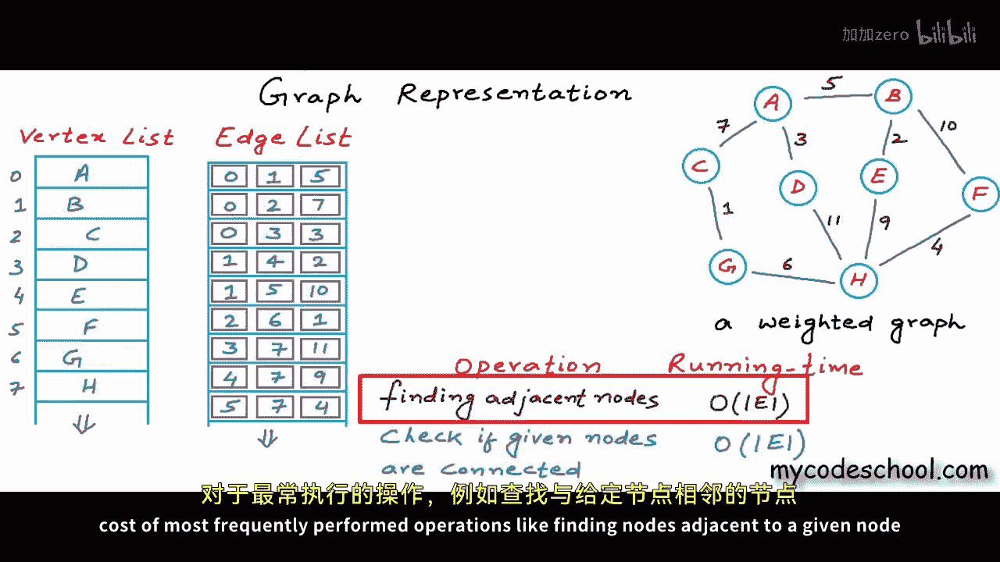
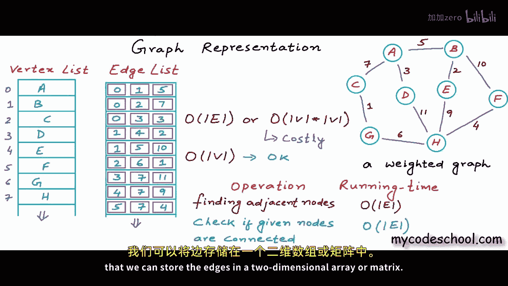
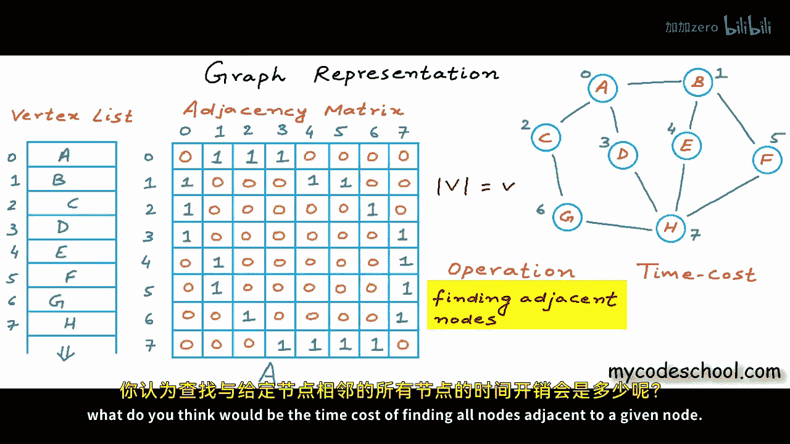
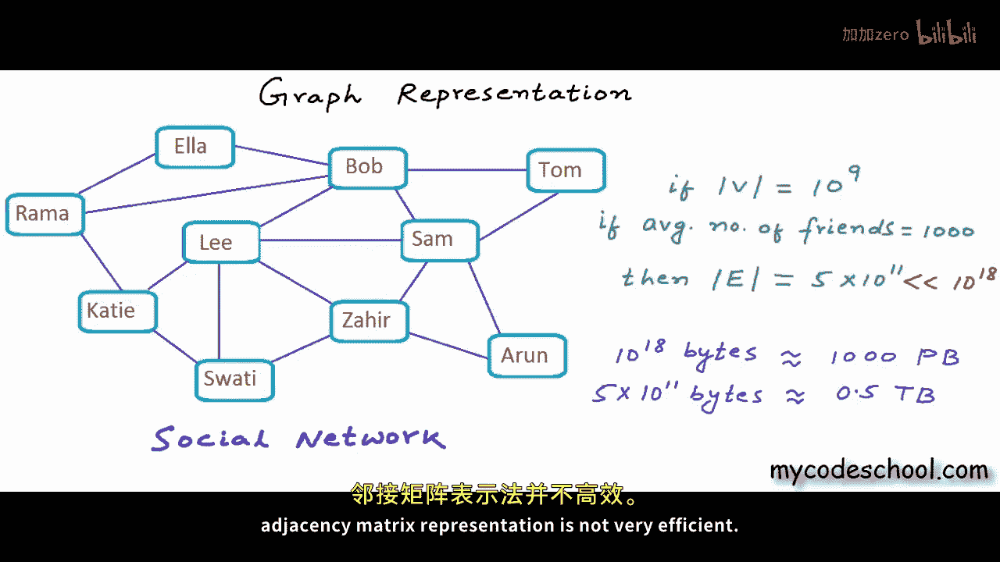

# mycodeschool【中英⚡数据结构｜Data Structures】 p41 p40 Graph Representation part 02 - Adjacency Matrix -BV1ckrLYREn2_p41-

So in our previous lesson， we discussed one possible way of storing and representing a graph in which we used two lists。

One to store the vertices。😊，And another to store the edges。

A record vertex list here is name of a node and a recording in edge list is an object containing references to the two end points of an edge and also the weight of that edge。

Because this example graph that I'm showing you here is a weighted graph。

We called this kind of representation E list representation。

But we realized that this kind of storage is not very efficient in terms of time cost of most frequently performed operations。

Like finding nodes， it chis't to a given node or finding if two nodes are connected or not to perform any of these operations we need to scan the whole edge list。

 we need to perform a linear search on the edge list。

 so the time complexity is big O of number of edges and we know that number of edges in a graph can be really really large in worst case it can be close to square of number of vertices。

In a graph， anything running in order of number of edges is considered very costly。

We often want to keep the cost in order of number of what disease。

So we should think of some other efficient design， we should think of something better than this。

One more possible design is that we can store the edges in a two dimensional array or matrix。

 We can have a two dimensional matrix or array of size v cross v， where v is。

Number of vertices， as you can see， I have drawn an8 cross 8 already here because number of vertices in my example graph here is 8。

Let's name this array a。Now if we want to store a graph that is unweighted。

 let's just remove the weights from this example graph here。

 and now our graph is unweighted and if we have a value or index between 0 and v minus1 for each vertex。

Which we have here， if we are storing the vertic in a vertex list。

 then we have an index between 0 and v minus-1 for each vertex。 We can say that a is zeroethth node。

 B is one e node， C is2th node and so on。We are picking up indices from the vertex list so if the graph is unweighted and each vertex has an index between 0 and v minus1。

 then in this matrix or to the array， we can set i at row and J at column that is AI J as 1 or Boolean value true if there is an edge from i to J0 or false otherwise。

If I have to fill this matrix for this example graph here， then I'll go vertex by vertex。

Vex 0 is connected to vertex 1。2 and3。What x1 is connected to 0。F and5。This is an undirected graph。

 So if we have an edge from 0 to 1， we also have an edge from 1 to 0。

 So1 at row and08 column should also be set as one。Now let's go to node2， it's connected to0 and6。

3 is connected to 0 and 7。4 is connected to 1 and 7。5 once again is connected to 1 and 7。

6ix is connected to 2 and 7。And 7 is connected to 3，4，5 and 6。

All the remaining positions in this array should be set as0。

Notice that this matrix is symmetric for an undirected graph。

 this matrix would be symmetric because AI J would be equal to A J I。

 We would have two positions filled for each edge。In fact， to see all the edges in the graph。

We need to go through only one of these two halves。Now。

 this would not be true for our directed graph。Only one position will be filled for each edge and we will have to go through the entire matrix to see all the edges。

Okay， now this kind of representation of a graph in which edges or connections are stored in a matrix or to the array is called ajacency matrix representation This particular matrix that I have drawn here is an adjacency matrix Now with this kind of storage or representation what do you think would be the time cost of finding all nodes adjacentdja to a given node。

 let's say given this vertex list and adjacency matrix。

 we want to find all nodes adjacentdja to node named F。 if we are given name of a node。

 then we first need to know its index。

And to know the index we will have to scan the vertex list。

 there is no other way once we figure out the index like for F index is 5。

 then we can go to the row with that index in the adjacency matrix and we can scan this complete row to find all the adjacentdjacent nodes。

Scanning the vertex list to figure out the index in worst case will cost us time proportional to the number of vertices。

Because in worst case， we may have to scan the whole list。And scanning a row in the adjacency matrix。

Would once again cost us time proportional to number of vertic because in a row。

We would have exactly v columns where v is number of vertices。

 so overall time cost of this operation is big O of v。Now。

 most of the time while performing operations， we must pass indices to avoid scanning the vertex list all the time if we know an index。

 we can figure out the name in constant time because in an hurry。

We can access element at any index in constant time。

 but if we know a name and want to figure out the index， then it will cost us we go of v。

We will have to scan the vertex list， We will have to perform a linear search on it okay。

 moving on now what would be the time cost of finding if two nodes are connected or not。

Now， once again， the two nodes can be given to us as indices or names。

 if the nodes would be passed as indices， then we simply need to look at value in a particular row and particular column。

We simply need to look at AI J for some values of I and J， and this will cost us constant time。

 You can look at value in any cell in a two dimensional array in constant time。

So if indices are given time complexity of this operation would be big O of1。

 which simply means that we will take constant time， but if names are given。

 then we also need to do the scanning to figure out the indices， which will cost us big O of v。

Overall， time complexity would be big O of v。The constant time axis would not mean anything。

The scanning of vertex list all the time to figure out the indices can be avoided。

 We can use some extra memory to create a hash table with names and indices as key value pairs。

And then the time cost of finding index from name。Would also be big O of1 that is constant。

Hash table is a data structure， and I have not talked about it in any of my lessons so far。

 If you do not know about hash table， just search online for a basic idea of it。 Okay。

 so as you can see。With AGSNi matrix representation。

 our time cost of some of the most frequently performed operations is in order of number of vertices and not in order of number of edges。

 which can be as high as squarere of number of vertices。Okay。

 now if we want to store a weighted graph in a JNC matrix representation。

Then AI J in the matrix can be set as weight of an edge。For nonexistent edges。

 we can have a default value， like a really large or maximum possible integer value that is never expected to be an edge weight。

I have just filled in infinity here to mean that。We can choose the default as infinity。

 minus infinity or any other value that would never， ever be a valid edge weight。Okay。

 now for further discussion， I'll come back to an unweighted graph。

It justens matrix looks really good so should we not use it always well with this design we have improved on time。

But we have gone really high on memory usage。Instead of using memory units。

 exactly equal to number of edges。What we were doing with an edge list kind of storage here we are using exactly v square units of memory。

 we are using big O of v square space， we are not just storing the information that these two nodes are connected。

 we are also storing not of it， that is these two nodes are not connected。

 which probably is redundant information。If a graph is tense if the number of edges is really close to v square。

 then this is good， but if the graph is spae， that is if number of edges is lot lesser than v square。

 then we are wasting a lot of memory in storing these zeros。

Like for this example graph that I have drawn here in the edge list， we were consuming。

10 units of memory， we had 10 rows consumed in the edge list， but here we are consuming 64 units。

Most crops with really large number of vertices would not be very dense。

 would not have number of edges anywhere close to v square。

Like， for example。Let's say we are modeling a social network like Facebook as a graph such that a user in the network is a node and there is an undirected edge if two users are friends。

 Facebook has a billion users， but I'm showing only a few in my example graph here because I'm short of space。

Let's just assume that we have a billion users in our network。

So number of whattic in our graph is 10 to the part 9， which is a billion。Now。

 do you think number of connections in a social network can ever be close to square of number of users？

That will mean everyone in the network is a friend of everyone else。

A user of our social network will not be friend to all other billion users。

We can safely assume that a user on an average would not have more than1000 friendss with this assumption we would have 10 to depart 12 edges in a craft。

Actually， this is an undirected graph， so we should do a divide by2 here so that we do not count an edge twice。

So if average number of friends is thousand0， then total number of connections in my graph is 5 into 10 to the par 11。

Now this is a lot lesser than squarere of number of vertices。

 so basically if we would use an ajacency matrix for this kind of a craft。

 we would waste a hell out of space。And moreover， even if we are not looking in relative terms。

 tend to depart 18 units of memory。Even in absolute sense is a lot。

10 to depart 18 bytes would be about 1000 petabytes。Now this really is a lot of space。

This much data would never ever fit on one physical disk。

 5 into 10 to the 11 bytes on the other hand。Is just 0。5 terabytes。

A typical personal computer these days would have this much of storage。

 So as you can see for something like a large social graph。

 adjacency matrix representation is not very efficient。

 adjacency matrix is good when a graph is tense。 That is when the number of edges is close to square of number of vertices。

Or sometimes when total number of possible connections that is v square is so less that wasted space would not even matter。

But most real world graphs would be sparse and adjacency matrix would not be a good fit。

Let's think about another example， let's think about World W Web as a directed graph if you can think of web pages as node inenograph and hyperlinks as directed edges。

 then a web page would not have link to all other web pages and once again number of web pages would be in order of millions。

A web page would have linked to only a few other web pages。So the graph would be sparse。

 most real world graphs would be sparse and adjacency matrix。

 even though it's giving us good running time for most frequently performed operations。

Would not be a good fit because it's not very efficient in terms of space。So what should we do？Well。

 there' is another representation。That gives us similar or maybe even better running time than a Jcency matrix and does not consume so much space。

It's called a JN list representation， and we will talk about it in our next lesson。

 This is it for this lesson。 Thanks for watching。

