# mycodeschool【中英⚡数据结构｜Data Structures】 p42 p41 Graph Representation part 03 - Adjacency List -BV1ckrLYREn2_p42-

So in our previous lesson， we talked about a JNi matrix as a way to store and represent graph。

 and as we discussed and analyzed this data structure。

 we saw that it's very efficient in terms of time cost of operations。

With this data structure it costs big O of1 that is constant time to find if two nodes are connected or not。

 and it costs big O of v where v is number of vertices to find all nodes adjacent to a given node。

But we also saw that a Jensi matrix is not very efficient when it comes to space consumption；

 we consume space in order of squarequire of number of vertices。In adjacency matrix representation。

 as you know， we store edges in a two dimensional array or matrix of size v cross v where v is number of vertices in my example graph here we have8 vertices。

That's why I have an eight cross 8 matrix here， we are consuming eight square that is 64 units of space here now what's basically happening is that for each vertex。

 for each node we have a row in this matrix where we are storing information about all its connections。

This is the row for the zeroth node that is a， this is the row for the 1ethth node that is B。

 this is for C， and we can go on like this。😊，So each node has got a row and a row is basically a one dimensional array of size equal to number of vertices that is v。

And what exactly are we storing in a row let's just look at this first row in which we are storing connections of node a。

 this two dimensional matrix or array that we have here is basically an array of one dimensional arrays。

 so each row has to be one dimensional array， so how are we storing the connections of node a in these eight cells in this one dimensional array of size 8。

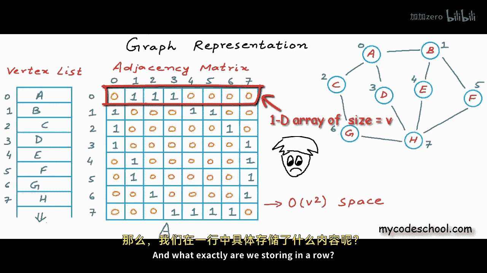

A 0 in the zero8 position means that。There is no edge， starting a。And ending at sitz node。

 which again， is a an edge starting and ending at itself is called a self loop。

And there is no self loop on a。Of1 in oneeth position here means that there is an edge from a to oneeth node that is B。

The way storing information here is that index or position in this one dimensional array。

Is being used to represent end point of an edge。For this complete row。

 for this complete one dimensional array。Start is always the same；

 It's always the zeroeth node that is a。In general， in the HSN C matrix。

 row index represents the start point and。Coollumn index represents the endpoint。

Now here when we are looking only at the first row。Start is always a， and the indices，0，1，2。

 and so on are representing the end points， and the value at a particular index or position tells us whether we have an edge ending at that node or not One here means that the edge exists。

0 would have meant that the edge does not exist。Now， when we are storing information like this。

 if you can see， we are not just storing that B C and D are connected to a。

 we are also storing the n of it， we are also storing the information that A， E， F。

G and H are not connected to a。If we are storing what all nodes are connected through that。

 we can also deduce what all node are not connected。 These zeros， in my opinion。

 are redundant information causing extra consumption of memory。

 Most real world graphs are sparse that is number of connections is really small compared to total number of possible connections。

So most often there would be too many zeros and very few ones。

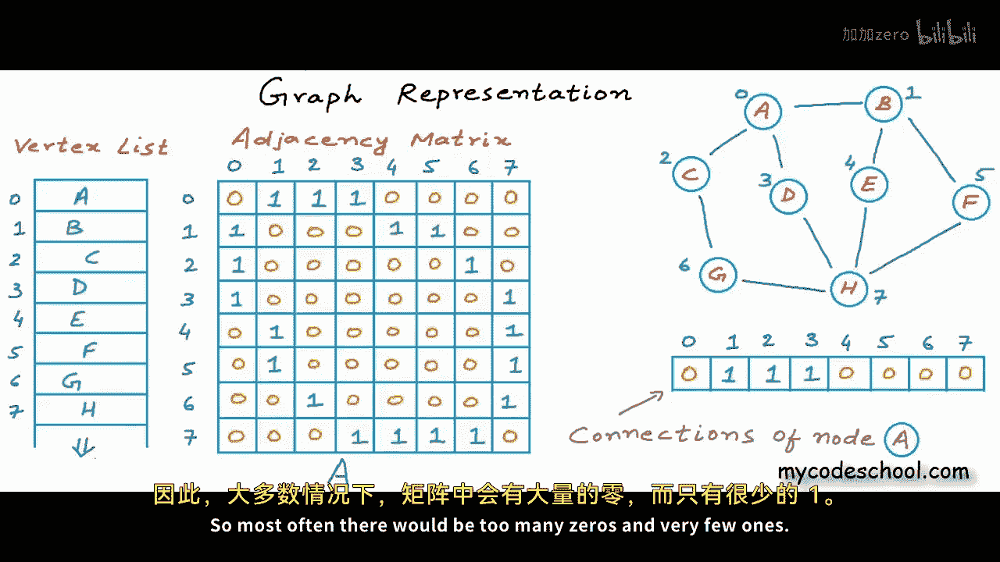

Think about it， let's say we are trying to store connections in a social network like Facebook in an HSNC matrix。

 which would be the most impractical thing to do， in my opinion。😊，But anyway。

 for the sake of argument。😊，Let's say we are trying to do it。😊，Just to store connections of one user。

 I would have a row or one dimensional matrix of size 10 to the bar9。On an average。

 in a social network， you would not have more than thousand friends。If I have thousand friends。

 then in the row used to store my connections。I would only have thousand ones。

And rest that is 10 to the bottom 9 minus thousand00 would be zero。

And I'm not trying to force you to agree， but just like me。

 if you also think that these zeros are storing redundant information and are extra consumption of memory。

 then。Even if we are storing these ones and zeroes in just one byte as Boolean values。

These many zeros here is almost one gigabyte of memory。😊，Ones are just 1 kiloB。

 So given this problem， let's try to do something different here。

Let's just try to keep the information that these nodes are connected and get rid of the information that these nodes are not connected because it can be inferred。

 it can be deduced。And there are a couple of ways in which we can do this here to store connections of a instead of using an array such that index represents end point of an edge and value at that particular index represents whether we have an edge ending there or not。

We can simply keep a list of all the nodes to which we are connected。

This is the list or set of nodes to which a is connected， we can represent this list。

Either using the indices or using the actual names for the nodes。

Let's just use indices because names can be long and may consume more memory。

You can always look at the vertex list and find out the name in Constantine Now in a machine we can store this set of nodes which basically is a set of integers in something as simple as an array and this array as you can see is a different arrangement from our previous array。

In our earlier arrangement， index was representing index of a node in the graph and value was representing whether there was a connection to that node or not here index does not represent anything。

And the values are the actual indices of the nodes to which we are connected。Now。

 instead of using an array here to store this set of integers， we can also use a linked list。

And why just array or linked list， I would argue that we can also use a tree here， In fact。

 a binary search tree is a good way to store a set of values。

There are ways to keep a binary search tree balanced。

 and if you always keep a binary search tree balanced。You can perform search， insertion。

 and deletion all three operations。In order of log of number of nodes。

 we will discuss cost of operations for any of these possible ways in some time right now。

 all I want to say is that there are a bunch of ways in which we can store connections of a node for our example graph that we started with instead of an adjacency matrix。

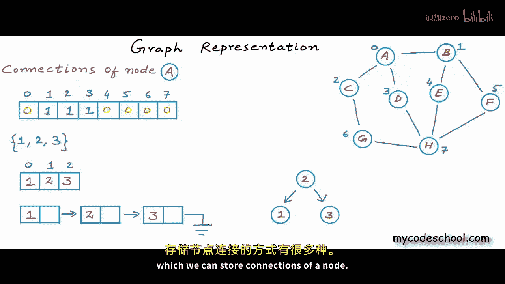

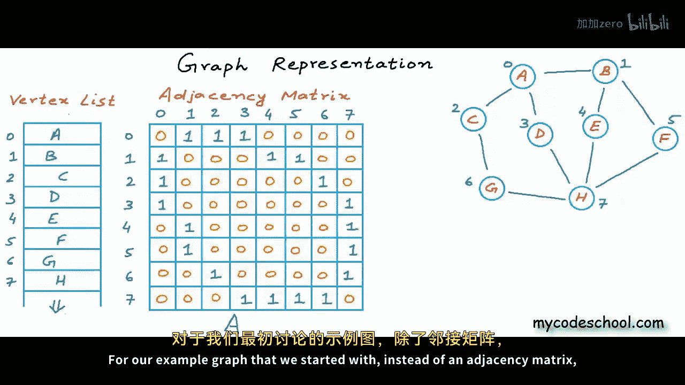

We can try to do something like this。We are still storing the same information。

 We are still saying that0eth node is connected to1 at2 at and3ethth node。

1ethth node is connected to0 et， fourth and fifth node。

2ethth node is connected to0eth and6 node and so on。

But we are consuming a lot less memory here programmatically this adjacency matrix here is just a two dimensional array of size 8 cross 8。

 so we are consuming 64 units of space in total。😊，But this structure in right。

 does not have all the rows of same size。How do you think we can create such a structure programmatically？

Well， it depends in C or C++ if you understand pointers， then we can create an array of pointers。

Of size 8。 and each pointer can point to a one dimensional array of different size。

0 at pointer can point to。An array of size 3 because zero its node has three connections。

And we need an array of size 3。One at pointer can point to。

And array of size 3 because one it node also has three connections。2 width node， however。

 has only two connections， so2 width pointer should point to an array of size2。

And we can go on like this。 The seventh node has four connections。

 So seventh pointers should should point to。An array of size 4。

If you do not understand any of this pointer thing that I'm doing right now。

 you can refer to my code school's lesson titledPoers and Us。

The link to which you can find in the description of this video， but think about it。

 the basic idea is that each row can be a one dimensional array of different size。

And you can implement this with whatever tools you have in your favorite programming language。

Now let's quickly see what are the pros and cons of this structure in the right in comparison to the matrix in the left。

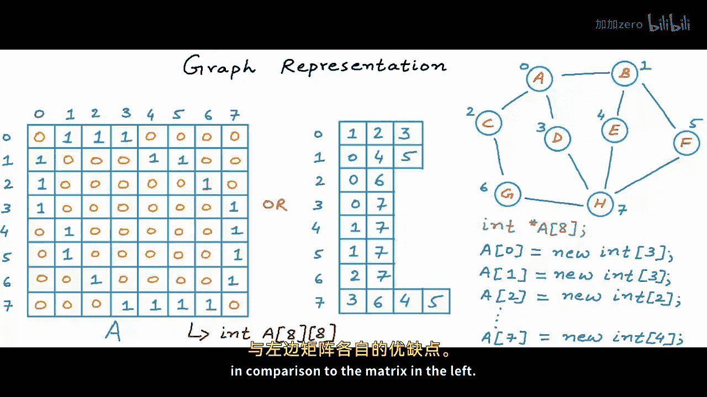

We are definitely consuming less memory with the structure in right， with a JNC matrix。

 our space consumption is proportional to squarere of number of vertices。

While with the second structure， space consumption is proportional to number of edges。

And we know that most real world crafts are spars， that is。

The number of edges is really small in comparison to square of number of vertices。

 squarere of number of vertices is basically total number of possible edges。

 and for us to reach this number every node should be connected to every other node in most graphs a node is connected to few other nodes and not all other nodes。

In this second structure we are avoiding this typical problem of too much space consumption in an HTSN matrix by only keeping the ones and getting rid of the redundant zeros。

Here for an undirected graph like this one， we would consume exactly two into number of edges units of memory。

And for a directed graph， we would consume exactly E that is number of edges units of memory。

But all in all， space consumption will be proportional to a number of edges。Or in other words。

 space complexity would be big O of E。 So the second structure is definitely better in terms of space consumption。

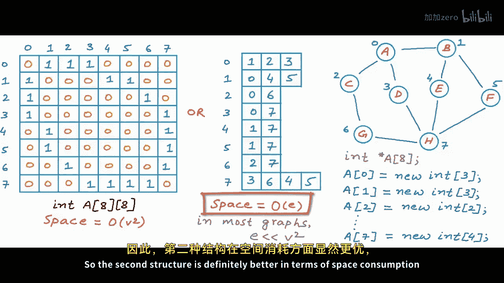

But let's now also try to compare these two structures for time cost of operations。

What do you think would be the time cost of finding if two nodes are connected or not？

We know that it's constant time or big O of1 for an ASN matrix。

Because if we know the start and end point， we know the cell in which to look for0 or 1。

But in the second structure we cannot do this， we will have to scan through a row。

 so if I ask you something like can you tell me if there is a connection from node 0 to 7？

Then you will have to scan this zero at row， and you will have to perform a linear search on this zero at row。

To find seven right now， all the rows in this structure are sorted。

You can argue that I can keep all the rows sorted and then I can perform a pier search。

 which would be a lot less costlier。That's fine， but if you just perform a linear search。

 then in worst case we can have exactly V that is number of vertices。😊，Cells in a row。

So if we perform a linear search in worst case， we will take。😔。

Time proportional to number of whattices。

And， of course， the time cost would be。B go of log v if we would perform a binary search。

Loarithmic runtime are really good， but to get this here， we always need to keep our rows sorted。

Keeping an array always sorted is costly in other ways， and I'll come back to it later。For now。

 let's just say that this would cost us big of v。Now。

 what do you think would be the time cost of finding all nodes adjacent to a given node that is finding all neighbors of a node？

Well， even in case of adjacency matrix， we now have to scan a complete row。

So it would be big of v for the matrix。As well as this second structure here。

Because here also in worst case， we can have v cells in a row。

Equivalent to having all once in a row in an HSNC matrix。

When we try to see the time cost of an operation， we mostly analyze the worst case。

So for this operation， we are big go of v for both。So this is the picture that we are getting。

 looks like we are saving some space with the second structure， but we are not saving much on time。

Well， I would still argue that it's not true。When we analyze time complexity。

 we mostly analyze it for the worst case， but what if we already know that we are not going to hit the worst case if we can go back to our previous assumption that we are dealing with a sparse graph that we are dealing with a graph in which a node would be connected to few other nodes and not all other nodes then the second structure will definitely save us time。

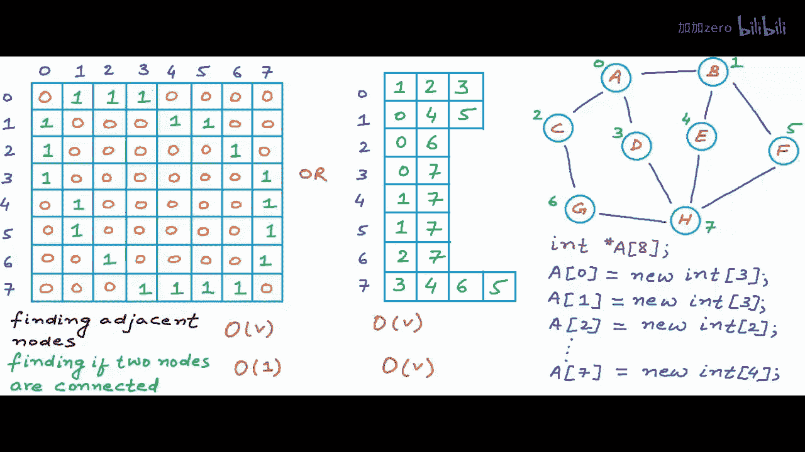

Things would look better once again if we would analyze them in context of a social network。

I'll set some assumptions， let's say we have a billion users in our social network。

 and the maximum number of friends that anybody has is 10，000。

And let's also assume computational power of our machine。

Let's say our machine or system can scan or read 1 to depart6 cells in a second。

This is a reasonable assumption because machines often execute a couple of millions instructions per second。

Now what would be the actual cost of finding all nodes adjacent to a given node in A JSNC matrix？

Well， we will have to scan a complete row in the matrix that would be 10 to depart9 cells。

Because in a matrix， we would always have cells equal to number of whattic。

And if we would divide this by a million， we would get。The time in seconds。

To scan a row of 10 to the about 9 cells， we would take thousand seconds。Which is also 16。66 minutes。

This is unreasonably high。But with the second structure。

 maximum number of cells in a row would be 10，000。Because the number of cells would exactly be equal to number of connections。

And this is the maximum number of friends or connections a person in the network has。

 So here we would take 10 to the bar 4 upon 10 to the bar 6， that is。10 to the bar minus2 seconds。

Which is equal to 10 milliseconds。10 milliseconds is not unreasonable。Now。

 let's try to deduce the cost for the second operation。

 finding if two nodes are connected or not in case of adjacency matrix。

 we would know exactly what cell to read。 We would know the memory location of that specific cell and reading that one cell would cost us one the bar 6 seconds。

Which is one microsecond。In the second structure we would not know the exact cell。

 we will have to scan a row， so once again maximum time taken would be 10 milliseconds。

Just like finding adjacent nodes。So now given this analysis。

 if you would have to design a social network， what structure would you choose？No brainer， isn't it。

Machine cannot make a user wait for 16 minutes。 Would you ever use such a system。Miseconds is fine。

 but minutes its just too much， so now we know that for most real world crafts。

 this second structure is better because it saves us space as well as time。

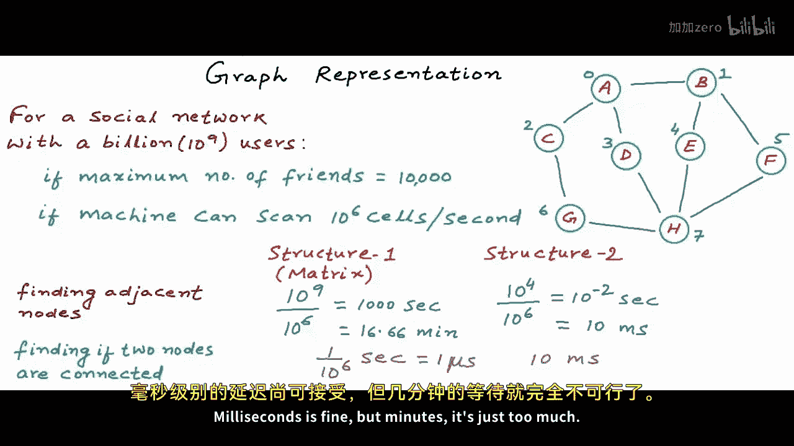

Remember， Im saying most and not all， because for this logic to be true。

 for my reasoning to be valid， graphra has to be sparse numberumber of edges has to be significantly lesser than square of number of vertices。

So now having analyzed space consumption and time cost of at least two most frequently performed operations。

Looks like this second structure would be better for most graphs。 Well。

 there can be a bunch of operations in a graph， and we should account for all kind of operations。

So before making up my mind， I would analyze cost of few more operations。

What if after storing this example graph in computer's memory in any of these structures？

We decide to add a new edge。Let's say we got a new connection in the graph from A to G。

Then how do you think we can store this new information， this new edge in both these structures？

The idea here is to assess that once the structures are created in computer's memory。

 how would we do if the graph changes？How would we do if a node or edge is inserted or deleted if a new edge is inserted in case of an adjacency matrix。

 we just need to go to a specific cell and flip the0 at that cell to  one In this case。

 we would go to 0 at row。And sixth column and overwrite it。With value 1。And if it was a deletion。

 then we would go to a specific cell and make the one0。Now， how about this second structure？

How would you do it here， We need to add a6 in the first row。

And if you have followed this series on data structures。

Then you know that it's not possible to dynamically increase size of an existing array。

This would not be so straightforward。We will have to create a new array of size 4 for the zero row。

Then we will have to copy content of the older array。😔，Write the new value。😔。

And then wipe off the old one from the memory。It's tricky implementing a dynamic or changing listist using arrays。

This creation of new array and copying of old data is costly。

 and this is the precise reason why we often use another data structure to store dynamic or changing lists。

And this another data structure is linked list。😊，So why not use a linked list。

 why can't each row be a linked list， something like this？

Logically， we still have a list here， but concrete implementation wise we are no more using an array that we need to change dynamically。

 we are using a linked list。It's a lot easier to do insertions and deletions in a linked list。Now。

 programmatically to create this kind of structure in computers memory。

We need to create a linked list for each node to store its neighbors。

So what we can do is we can create an array of pointers。

Just like what we had done when we were using as。The only difference would be that this time each of these pointers would point to head of a linked list。

That would be a node I have defined node of a linked list here。

 node of a linked list would have two fields， one to store data and another to store address of the next node a0 would be a pointer to head or first node of linked list for a。

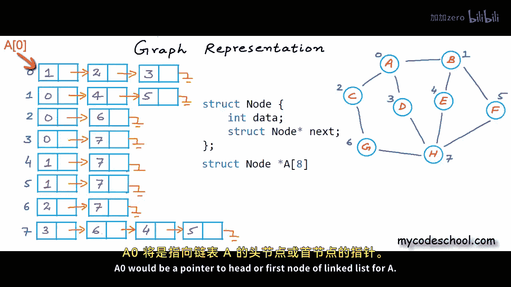

A1 would be appointed to head of linked list for B。And well go on like A2 for C， A3 for D and so on。

 Actually， I have drawn the linked lists here in the left。

 but I have not drawn the array of pointers。

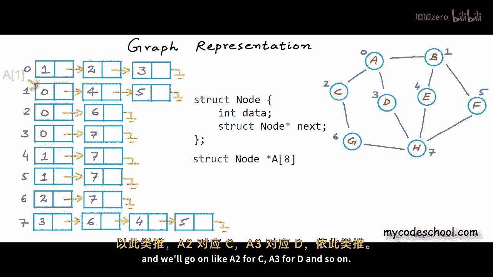

Let's say this is my array of pointers now a0 here。

 this one is a pointer to node and it points to the head of linked list containing the neighbors of a。

Let's assume that head of linked list for A has addressed 400。So in a0， we would have 400。

It' is really important to understand what is what here in this structure。

 This one a0 is appointed to node， and all a pointer does is store an address or reference。

This one is a node。And it has two fields， one to store data and another a pointer to node to store the address of next node。

Let's assume that the address of next node in this first linked list is 450。

 then we should have 450 here。And if the next one is at， let's say， 500。

Then we should have 500 in address part of the second node。

The address and last one would be zero or null Now this kind of structure in which we store information about neighbors of a node in a linked list is what we typically call an a JNC list。

What I have here is an adjacency list for an undirected unweighted graph。

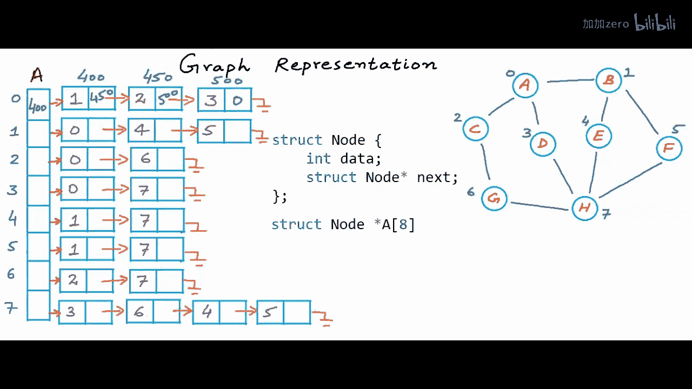

To store a weighted graph in an HSN list。I would have one more field in node to store weight。

I have written some random weights next to the edges in this graph。

And to store this extra information。I have added one extra field in node。

Both in logical structure and the code All right， now finally。

 with this particular structure that we are calling a jaed list。

 we should be fine with space consumption， space consumed will be proportional to number of edges and not to squire of number of vertic。

Most crafts are sparse， and number of eds。In most cases。

 is significantly lesser than square of number of otices。

Ideally for space complexity I should say big O of number of edges plus number of vertices because storing vertices will also consume some memory。

But if we can assume that number of vertices will be significantly lesser in comparison to number of edges。

Then we can simply say we go off number of edges。But it's always good if we do the counting， right。

Now for time cost of operations， the argument that we were earlier making using a sparsecraft like social network is still true。

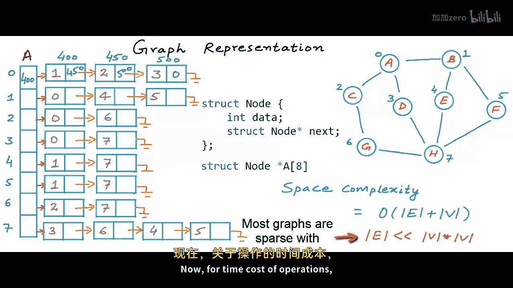

A JN list would overall be better than a JN matrix。

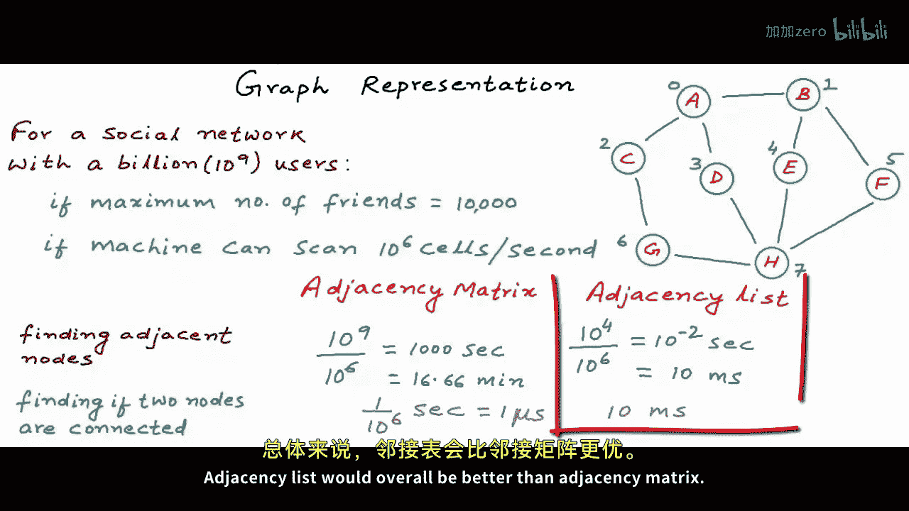

Finally， let's come back to the question， how flexible are we with this structure if we need to add a new connection or delete an existing connection。

And is there any way we can improve upon it？Well， I'll leave this for you to think。

 but I'll give you a hint， what if instead of using a linked list to store information about all the neighbors？

We use a binary search tree。Do you think we would do better for some of these operations？

I think we would do better because the time cost for searching， inserting。

 and deleting a neighbor would reduce。

With this thought， I'll sign off， this is it for this lesson， thanks for watching。

