# 《计算机科学和Python编程｜6.100L Introduction to CS and Programming using Python, 2022》 - P10：-10-Lecture 10_ Lists and Mutability (FIXED).zh_en - GPT中英字幕课程资源 - BV1PAxJzVEs3

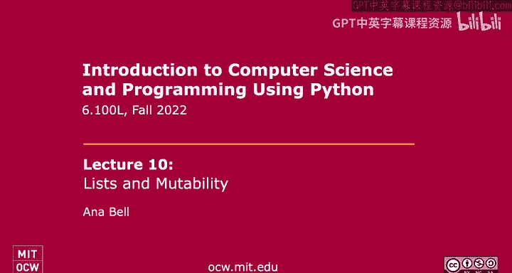

All right， so hello， everyone， let's get started。This is lecture 10。 So last lecture。

 we introduced two new data types。 We talked about a data type called a tuple and a data type called a list。

 So today， we not gonna talk about tus anymore because they were pretty straightforward。

 A lot of operations。 You could do with strings。 You could do with tus。 They were immutable objects。

 That means once you created them in memory， you couldn't do anything to change them。

 And so they were， I guess， pretty boring， except that you could populate tus with objects that were of any type。

 So you could populate a tuple with integers and floats and booleans and other tus all at the same time。

We introduced lists last time as well as something that was really similar to tus and strings in terms of manipulations。

 lists were also nice because you could populate them again with any kind of data objects just like you could tus。

 okay。Today， what we're gonna focus on， though， is the idea of mutability when talking about lists。

 Okay， which is something new。 We have never talked about this idea before。

 And so this lecture is gonna be pretty heavy on kind of that idea。

 and a little bit heavy on syntax and things like that to kind of remind you of how to do how to manipulate these compound data types。

 So please， if there's any questions， feel free to stop me。

 And then I can go over what I just talked about if there was anything confusing。

So this slide is basically a copy of the slide we had on lists last lecture。

 It shows a bunch of oops a bunch of different operations that you can do with lists。

 They're very similar to operations that you can do with strings right so here I'm just creating an empty list。

 I'm creating a list with a bunch of elements in it。

 So here we can see that this list contains four elements。

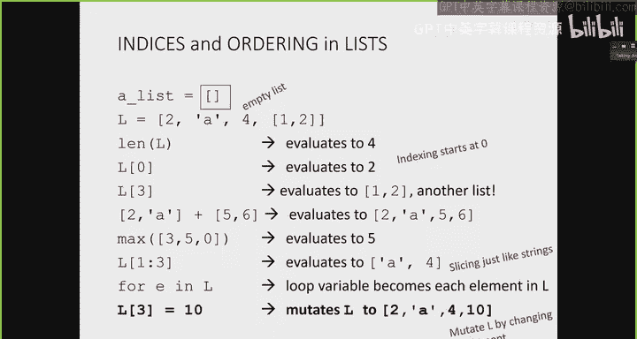

And they are all of different types， right， This is an integer。 This is a string。 This is an integer。

 and this is another list。 And that's totally okay to do with， with these data types。

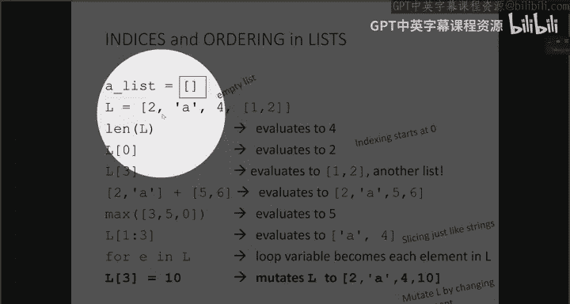

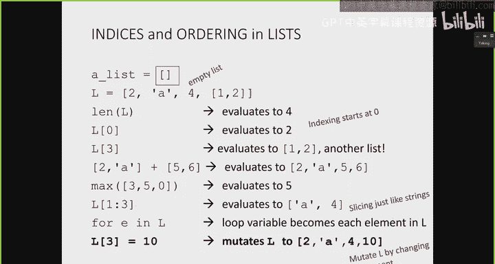

Doing all of these operations， getting the length， indexing， slicing， concatenation， getting the max。

 all that is should be a review， as well as iterating a four loop over the elements in a list directly。

 So just like we iterated a four loop over characters in a string， this loop basically makes E。

 our loop variable， take on the value of every single element in our list L。😊。

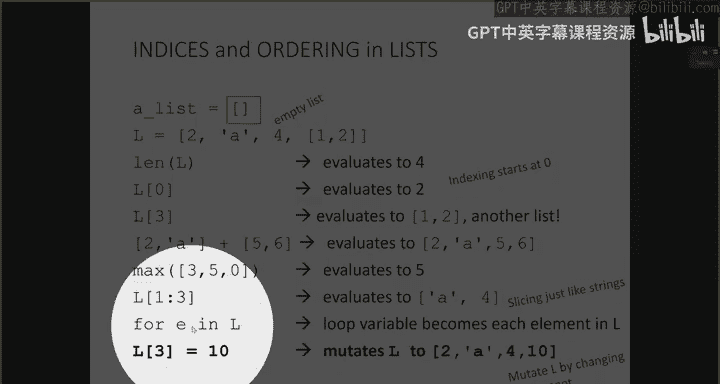

What's new， the bolded thing here is something we haven't been able to do before。

 and this basically goes into memory and changes the element at index 3 and L。

 so that's kind of how we read that and it changes that element to have the value on the right hand side。

So this is kind of， I mean， we read it in the same way as we do other assignment statements。

 We look at the right hand side and we evaluate that。 In this case， it's only a 10。

But the left hand side looks different， right， It's not a variable name， as we have seen before。

 but in fact， it's this it's referencing the item in list named L at index 3。

 So that would be index 0，1，2，3。 This line of code down there。 L square brackets 3 equals 10。

 basically replaces this entire element here with the number 10。

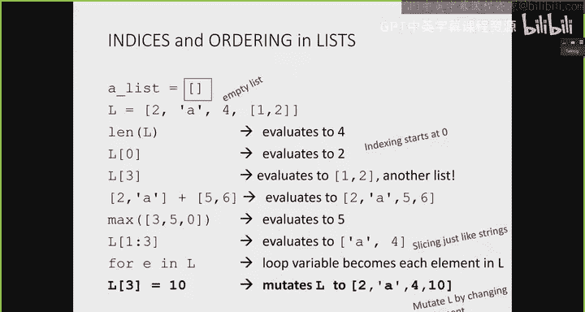

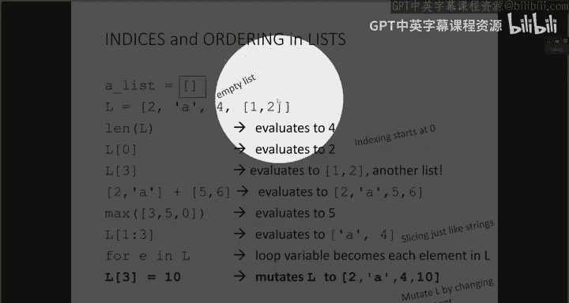

Okay， so on the next few slides， we're gonna talk about what exactly this means inside memory because it。

It's， it's， it's different than what we've been able to， what we've been doing before。

So what exactly happens when we go into a mutable object like a list and we change an element using this exact syntax。

 All right， well， let's draw our memory diagrams the way we have been in the past here's a little cloud representing the memory L equals 2。

4，3 creates this list for me in memory， this list object。

 and L is the name that I'm referencing to this list object right so I'm basically binding the name L to that object and memory。

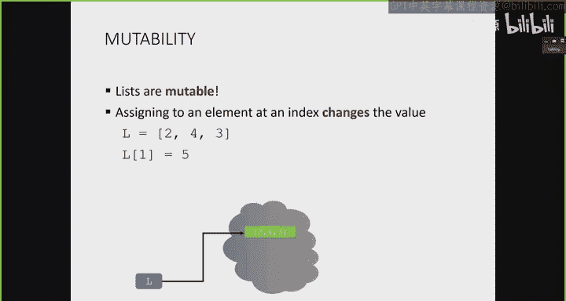

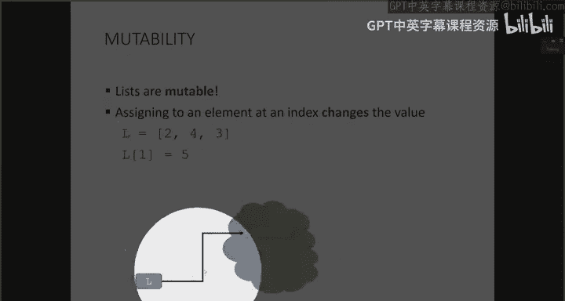

L scrub brackets 1 equals 5s tell tells Python to follow the name L to the object in memory。

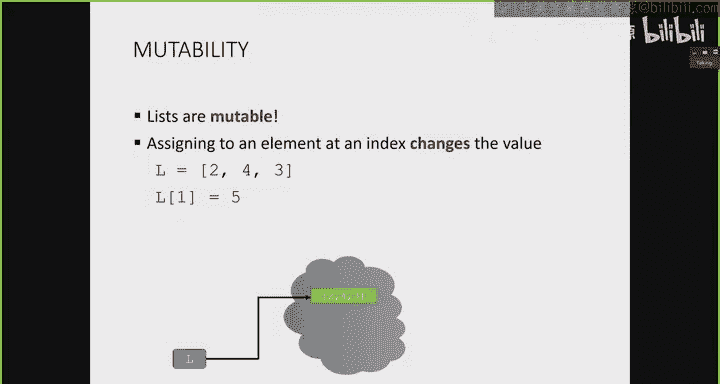

And then look up the index in the square brackets。 In this case， index 1。 So that's 0，1， this 4。

 and take the element at this location。

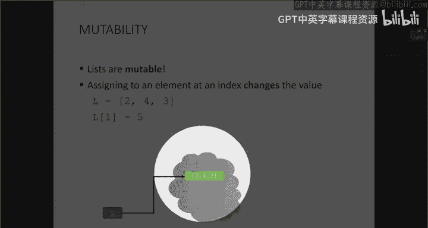

And override it to be whatever the right hand side says。 So the right hand side says 5。 So basically。

 we're going into memory and changing that middle element。So this is different than strings and tus。

 We were not allowed to do anything like this with strings and tuples。

 So let's look at an example on the next slide about what this means。

 But the idea here I'm trying to get at is this object that we have changed one of the elements inside。

1 for which we've changed one of the elements。 we've changed the object itself。

 We didn't make a new copy。 We didn't kind of make a version of that object。

 We have changed the object itself。So let's see maybe similar code that might have kind of that you might think does the same thing。

 except with tus。Alright， so the first two lines of code are are going to be the same。

 We've got L in memory being the object 2，4，3 or L being the name bound to the object 2，4，3。

 L square brackets 1。 So L at index 1 equals 5 changes that middle element to be a5 same as the previous slide。

 Now， what if we had these two lines of code T is going to be a variable name that's bound to the twopo 2。

4，3。 So notice this is now the twofold denoted in parentheses。If I say t is equal to 2，5，3。

What happens。Basically， with this line， I am creating a new object in memory。 Okay。

 so there's my new object。And I'm taking the name T， and I'm binding it to this new object。Right。

 the old object 2，4，3 as a tuple still remains in memory。 I have not modified that object at all。

 It's still there。 I've just lost the binding to it。

So the name T is separate from the actual object in memory， right。In terms of tus。

 what that means for us is we can never change the the tuple object in memory once we've created it。

 But with lists using this specific operation， this one right here， L square brackets 1 equals 5。

 This does allow us to go into memory and literally change that object。 right。

 that is associated with with the name L。Is everyone okay with this slide？ Does this make sense。

 And This showcases the difference， right， So you need to think about what is the name of the object versus the object itself in memory。

O。So that shows you how to create a list and then go ahead and change elements to different values within that list。

 But now that we have a list object， right， that we can mutate。

Other operations we can do with it is to， let's say。

 add more items to the end of the list so we can make the list bigger， right。

We can mutate the object by doing that， using this append function。

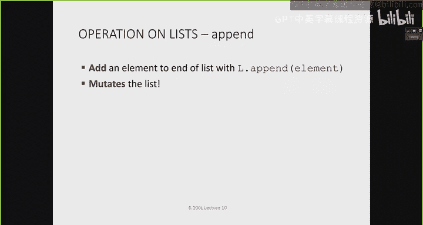

Now， I'm gonna talk about the syntax is syntax of the append function in a little bit。 But basically。

 if I want to mutate L to add an item to the end of it， I have to use this syntax。 There isn't。

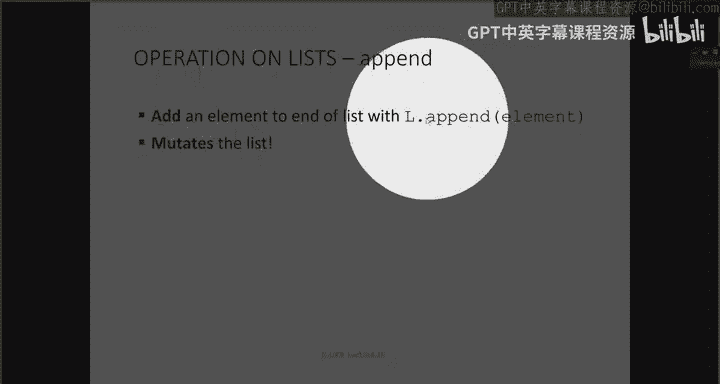

A different form， a different function to do this。 So this specific syntax has to be used。

Aend is basically the function name。Okay。😊，Element is going to be the parameter。

 The thing that I want to add on to the end of my list。And L。

 the thing before the dot is going be the， the object。

 I want to add the element to the end of the list， right。So。L， in this case。

 I'm using it generically， but you can imagine creating a list of employees in your company， right。

 Then you might name that list employees。 In that case， we would say employees dot append， you know。

 Anna or whatever。So that L is just kind of generic for now。

 but it gets replaced with whatever variable name your list is。

So this operation basically mutates the list。 Okay， so it mutates it to be one extra element longer。

And the element you're adding to the end of the list to the right hand side of the list is going be whatever is in the parentheses to append。

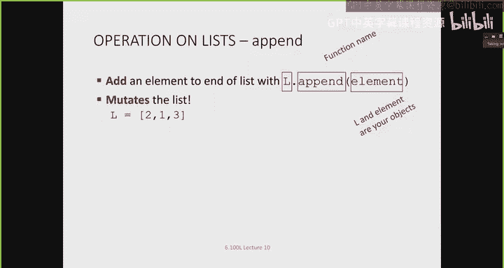

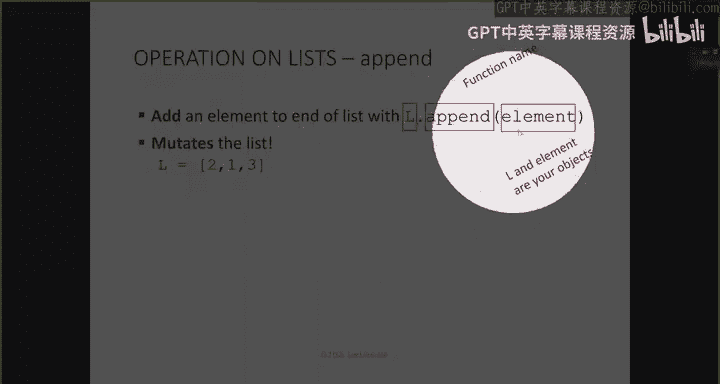

So let's look at an example。 So we're gonna to create L is equal to 2，1，3 in memory。

And then let's say we do L dotta pen 5。Alright， well， this line of code says， look up L。

 It's this object in memory here，2，13。 and add the object 5 to the end of it。

 So I'm gonna add the5 to the end of the list。 Now it's no longer three elements long。

 It's  four elements long。 And again， I didn't make a copy。

 I didn't preserve the original list with just 2 and3 in it。

 I have literally changed this list in memory。 That's referenced by L。

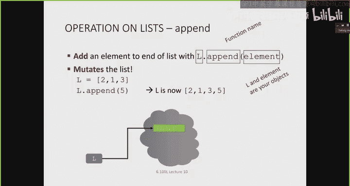

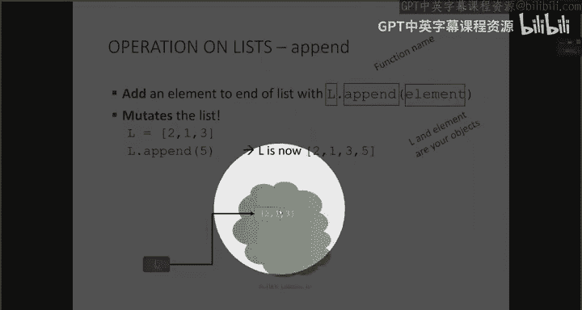

Now。This function， append， is being used basically for its side effect。

 And the side effect here is mutating the list。After the after the function adds the five in this particular case to the end of the list。

 the function doesn't need to return anything back。It's basically done its job to do the mutation。

And so。Functions like a pen。 And we're gonna to see other functions later。

Don't have any return value。Okay， so one really common mistake as we're kind of learning about mutable mutable objects and using these functions that mutate is to say。

 well， I'm gonna do L dota pen 5 and save this。 The result of this function back into the variable named L。

 And this would be incorrect。 So let's see if we do this line of code。 What exactly will happen。

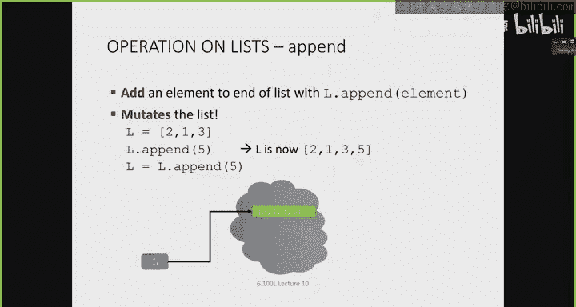

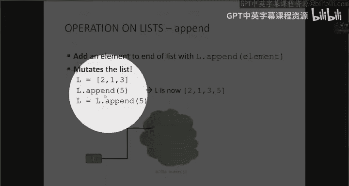

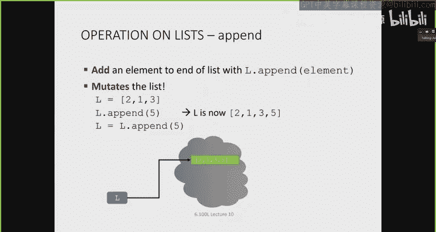

Okay， so it's an assignment。 So the first thing we do is we look at the right hand side and we evaluate that。

 Well， the right hand side basically says L dota pen 5。

 which is exactly the same as the previous line。

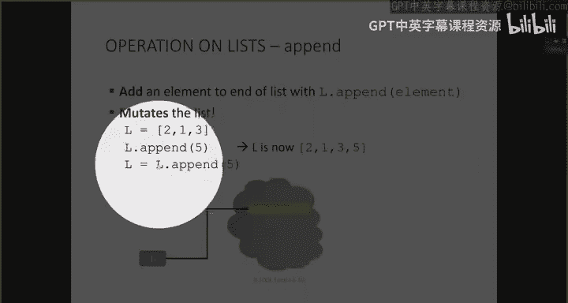

So we're gonna put another 5 to the end of our currently mutated list。Right。

 just kind of going with these operations in order。And then I said this， this function。

 this append function has done its job to mutate the list by adding a 5 to the end of it。

 So it returns nothing。 There's nothing of value that it could return because it already did its job of mutation。

So it actually returns none。So the， the， the assignment， the equal sign then basically says。

 take the name L and bind it to the return of this function。 L dotta pen 5。 Well。

 the return of the function is none。 So basically， now we're losing the binding from。

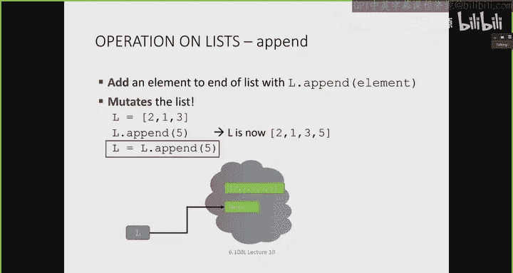

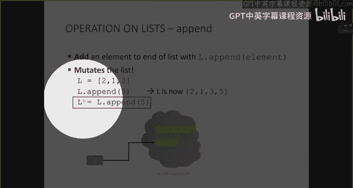

2，1，3，5，5， which was our mutated list and rebinding it to the return， none。

So that is an incorrect way to do the mutation of adding an item to the end of the list。

Everyone okay with that， so far。Yes， okay， excellent。 So what should we have done instead。 Sorry。

 yes， be careful about the append operation， right。

 youre doing a mutation and you return none as a result， right， So you do not。

 you do not want to resave this to any variable。 So instead， what we would do is we would just。

Do the operation， right， There's nothing to save。Nothing to save in any return variable。 So we。

 if you wanted to add 25s to the end of that list， you would just say El dota pen 5 again。

And L would then have been mutated to be 2，1，3，5，5。And so in your code。

 if you just print L in between these appends， if you printed L in between after the first append 5。

 it would print this 2，1，3，5。 and then if we print L after the second， the pen 5， it would print 21。

3，5，5 right because it's kind of it's an ongoing operation。

 it's mutating this list and now you're doing operations on the newly mutated list。

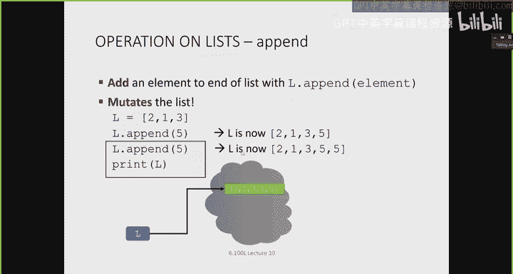

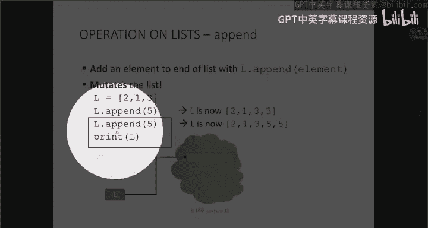

Everyone of， yeah。For the element， can you do， do you have to do one integer or can use 5 comma 5。

 So you can the append only works with one，1 thing。 So if you wanted to append a tuple。

You could append one tuple object that has many things in it。

 but it would just append that one tuple。 We're going to see towards the end of this lecture。

 an operation that allows us to extend the list by a bunch of items。 Yeah。

 but there is a way just not with aend。第二。

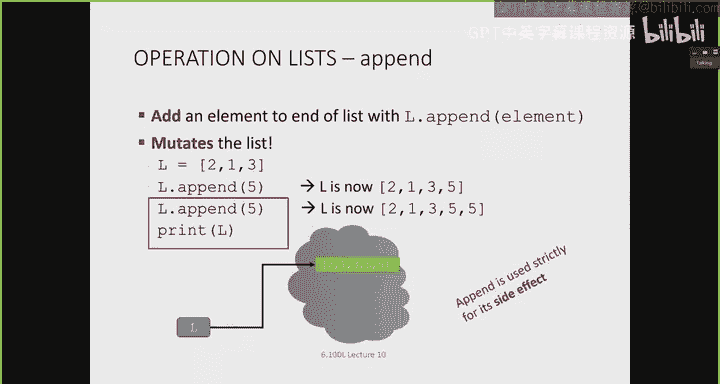

So the other thing， so this， this operation always returns none， right， L dotta pen 5 or whatever。

 The pen always returns none。 But here it's just sitting on a line by itself。

 We're not saving it back to anything。

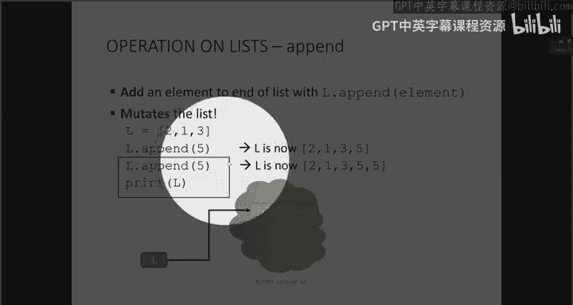

Right， in the previous one， we took the return and saved it back into L。

 And that's why we lost the binding to our the actual list。

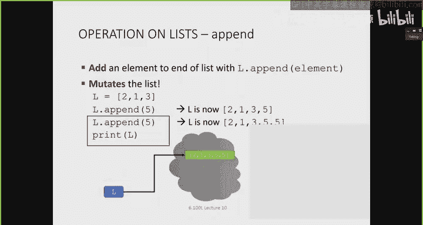

So what we usually say is that we use append and a bunch of these other mutable functions for their side effects。

 And the side effect in this case is to mutate the， the object that I'm calling the append on right。

 in this case， the list named L。

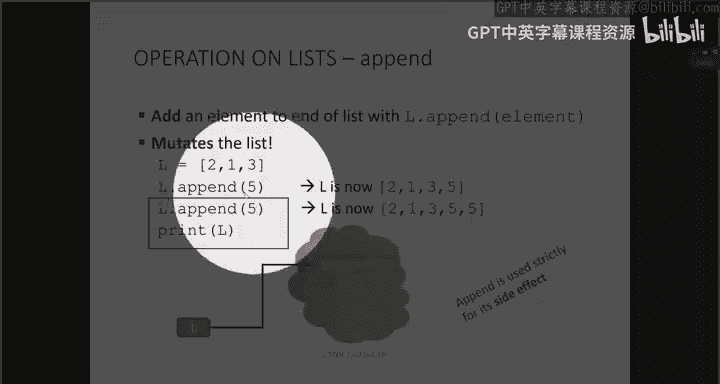

So let's have you think about this problem。 And while you do it。 and。

 and then we can write it on the board together。 So as we go through this， these lines of code。

1 at a time， what will the values of the lists be become Okay， so L 1 is the string Ray， L 2 is me。

 L 3 is dough， What is L 4 going to be right with that line， L 4 equals L 1 plus L 2。

 Does anyone know。What's the type？It's concatenation， right。

 So concatenation with lists is like concatenation with strings， yes。やゃ。What are the elements in it？

要。Yeah。I'm not gonna do the strings， but you know what I mean。Alright。

 so L 4 with that line is just these two elements in， in a new list。Now。

 what happens to with the next line， L3 dot append L 4， which one gets mutated， L3 or L4。

L 3 gets mutated exactly。 And what does it get mutated to。So L3 originally has dough in it。

What am I adding to the end of L 3。Rin New。Exactly， yes， I'm adding one item， right。

 And that it's linked to the question that was here。 What am I appending， I'm appending one item。

 It's whatever L4 is。And L 4 is this list。 So I'm going to be adding Ray and me。Within my list here。

I've got to close this list。So this is one item， one object， one element。

 and this is another element right here。It just happens to be a list。Okay。What about the next line。

 L equals L1 dotta pen 3。 What is the right hand side gonna give me。Am I mutating L1 or L3？😡，Yes。

 and what am I mutating L1 to be， L1 is originally Ray， And what am I adding to the end of it。Yeah。

 exactly。 this L 3， which is this big thing here， right， So it's a list with two with two elements。

 The first one being a string and the second one being。Another。List like that。

So that's the right hand side。 And then what is the left hand side going be， What is L going be。Yeah。

 exactly。Okay， so now that we've introduced mutable objects。

 we have to be careful about what functions we're using。 Some of them mutate the list， right。

 and don't return anything。 Append is one of them。 and we're gonna see a few more in today's lecture。

So these， these functions are just being used for their side effect， right。

 They mutate the thing you're， you're calling the function on。 and that's it。

 They don't need to return。 They don't return anything。 They don't need to return anything。

 They have done their job purely by the mutation aspect of it。

So I want to just quickly make an aside on this dot notation that we've been that we've introduced with this append function。

 Okay， this is something we haven't actually seen before。

 but it's something that we will learn about in the future when we create our own object types。

 right So right now， we're using object types that somebody else wrote like a list or a two bowl or something like that。

 But in in a future class。 We're going to learn how to create our own object types。And when we do。

 we're going to use this dot notation a lot。 But for now。

 you basically just kind of have to remember which functions use dot notation and which which don't。

 But I'll give you a little bit of intuition for what this dot notation actually means。

 So when we have， so everything in Python is an object。 And then we have objects in Python。

 the idea here is that。The objects that you have。Have data associated with them。

 So what kind of what makes up the object， And they have certain behaviors， right。

 So we touched upon this on maybe the first lecture where we said things you can do with integers。

Are different than the things you can do with strings。 right， That's， that's that's pretty clear。

 And that's different than the things you can do with lists， right。

And so the kinds of things that you could do with each one of these object types differs depending on the type。

And at its core， really everything can be written in terms of this dot notation。

 But some of the more common operations， like getting the length of something or adding two numbers together are actually。

 we， we do them in this shorthand notation。 like using the plus operator using the L， right。

 But at their core， really， we can take all of those operations and convert them to a dot notation。

 We're not doing this today。 But that's's what we can do。And so when we see this donnotation。

 the way we usually read it is we say， well， what's to the left of the dot。

 It's going to be our object， The thing that we want to do an operation on right。

 In this particular case， it's a list named L， right， but it could be a list name。

 employees or words or whatever， you know， book or whatever the list contained。

 whatever the list name is。The dot then comes for the dot notation。

 And then the thing on the right hand side is going to be the operation that you want to perform on the object to the left of the dot。

 right So the operation， if you basically cover up L dot， the operation looks just like a function。

 right， It's a pen parentheses some parameters。And so the operation is basically just a function that you want to run on an object of type list。

 this specific object named dial， and you can see it has a name， aend。

 and it has parameters or arguments in this case， it's the thing you want to add to the end of the list。

So again， unfortunately， at this point in the class。

 you just have to kind of remember which functions are dot notation and which which ones are not。

 But it will become clear what this dot notation actually means towards the end of the class。Okay。

 so let's have you work on this on this little code here。It's going to use a pen， obviously。

 and it's gonna to have you create a list。 So the name of the function you should make here is called make ordered list。

 And it takes in one parameter an integer N。It's positive。And I want you to create， from a list。

That that has all of the integers from 0 all the way up to and including n inside that list in order。

Okay， so as an example down in here。Around。34。If we call make ordered list with6。

 it's going to create for us this list inside the function。And return this list。Alright。

 so a couple minutes to work on that。 and then we can write it together。All right。

 what's the first thing we should do here？Or how would you approach this problem？Yes。

You want to create an empty list。What do you want to name it？You named it L。List is an O name。

 But notice list is also the name of the， the type of the object。

 So I would refrain from naming anything。Things that change color。

So we can use L or my list or whatever， something else。My list is an empty list。 Allright。

 so it's originally empty。 And now we need to populate it with some stuff。有那个。Make a for loop。

That goes over what。Yep，0 to n plus  one， exactly， because we need our boundary to go up to and including n。

Perfect， so now。That I've got I changing to be 0 then one then two then three。

 What do I need to do to my list。Yeah， exactly。 append eye。 So my list right。

 is the name of the list I've created dot， a pen I。Okay。The last thing， return the list， right。

 So return my list。So， run it。Perfect。If we change this to two。Still works。

So just testing it out with a couple different inputs。Just to make sure it works。

Questions about this code。Ptty， yeah。I your history。The zero is not necessary in the range。 Yeah。

 it defaults to  zero， exactly。O。We're not done yet。 You have more writing to do。

 So let's write a slightly different function now called remove L M。It takes in two parameters。

 The first one is a list， right， And the second one is going to be its just some variable。

 It could be an integer。 It could be a string。 It could be whatever。

And what the function should do is create a new list。

Populate it with the same elements of L in the same order， but exclude the ones that are equal to E。

 Okay， so you don't want to include the ones that are equal to E。

 Otherwise keep everything in in the original list L in the same order。So as an example here。

 we've got a volume input list is 1，2，2，2，2， and I call the function with L and2。

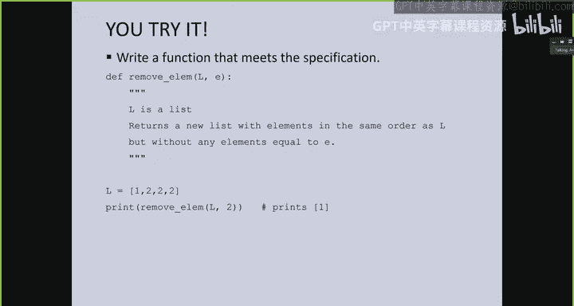

The list that this function returns to just contain one element in it， just the one。

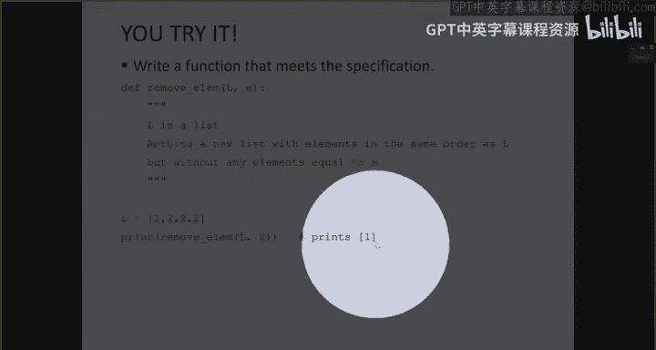

So that。Try your code for the next couple minutes around line 50。 and then we can write it together。

All right。How can we start。Yes。Yep， what did you name it？说。What did you make it called empty。

 empty list， okay？Yep， so for I in L， okay， and at this point。

 I would make a note for myself because you use I， which。In my brain means index。

 but I would make a note for myself that I is maybe one then two then two then  two。

 just according to this first example。 So if I'm reading the code， I would just。

I will remember that it's not the index， but go on， so for I and L directly。Like this？Okay。Yeah。Okay。

And then's。Return。New list， okay。Let's try it。Yeah， so E is not a list。 E is gonna be a。An element。

 right， So I I I that's my bad。 I should have put this in here。 E is， you know， like。You know。

 an object or something。 It's， it's。You know， it could be a list。

But then I would be looking for that exact sub list， that exact list as a sub element。

 So maybe we think of E as an object like 5 or something like that。Yeah。Not equal to E。

So if I'm just looking for that element directly， I want I to be not equal to E。In which case。

 I keep the element in my new list。 So if we run that。That gives me one， according to this。

 looks like it's correct。 And then we can run it with these other two cases。

 So here I'm removing the element 1。Right so I'm going to keep 222 as my return list。

And here I'm removing0， which doesn't exist in my list at all。

 so I should just keep and it does my original list unchanged。Any questions about this example。

 anyone try a different way。O。Alright， so other useful list operations。

 we can convert strings to lists and then lists back to strings。 Okay， and this is very useful when。

 you know， you're reading in text or something like that to a function is's going to be useful for problem set 3。

 so on and so on。 So let's first see how we can take a string S and convert it to a list。

 So if we just cast S to a list right the way we used to cast you know， the number5 to a float。

 we would just say float parentheses 5。 Well， we can take a list and cast it to a list by saying list parentheses。

 S。😊。

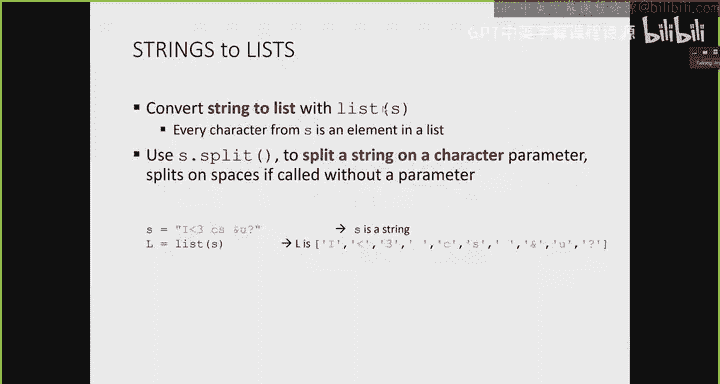

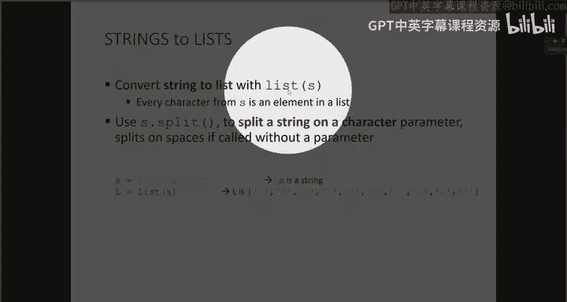

And if we cast it like this， Python takes every single character in S and makes it be a separate element in a list。

 so you can see here I've got this string Ihar CSS andU。

 it makes for me a list where every single character including the space and all the special characters becomes a separate entry in my list。

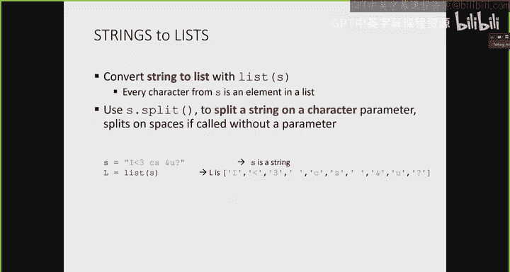

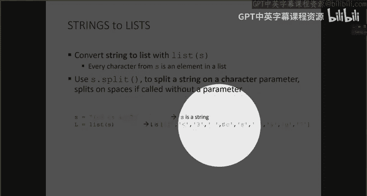

That's not that useful。 I mean， it can be， but it's not that useful。

 What is more useful is to take an input string and split it on a particular character。

 So one very common character that we would split on is the space。 And if we do something like that。

 it basically extracts from us from our string， all of the individual words， which is pretty useful。

 So here I've got S dot split。

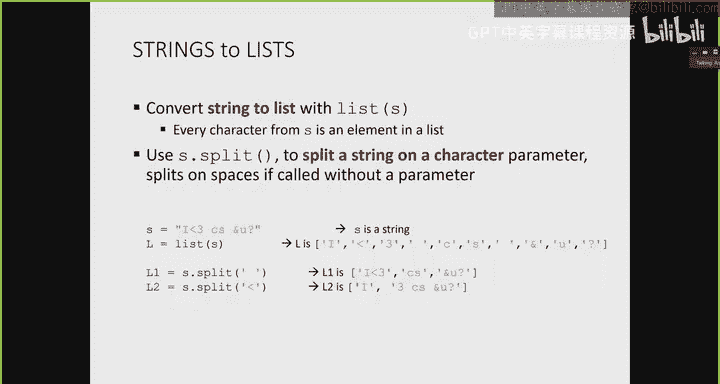

And in parentheses， I've got the character I want to split on in this particular case a space。

 So if I take S and I split on this space， Python will go from the beginning of the list to the first space。

 make that be one element in a list。

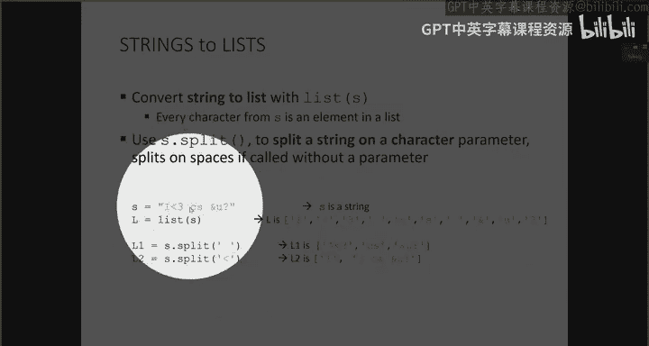

It'll go from the first paste in the next space in my string and make that be the next element in the list and so on and so on until it gets to the end of the list and makes that last bit。

 the last element in my list。 So here when I've split on the space。

 I've got three three three base words quote unquote words。

 I heart is going to be one and there it is as my first entry。

 Cs is in between these two spaces and that's my next entry。

 and and you question mark is my last entry here。

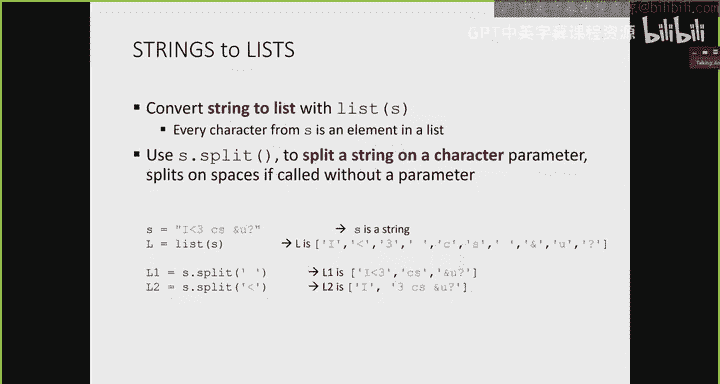

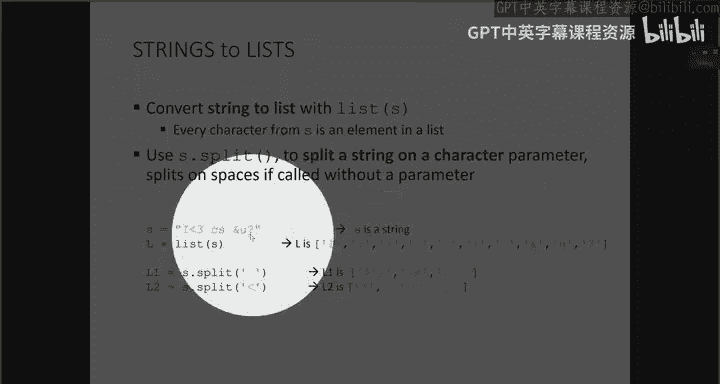

So this is a very useful function。

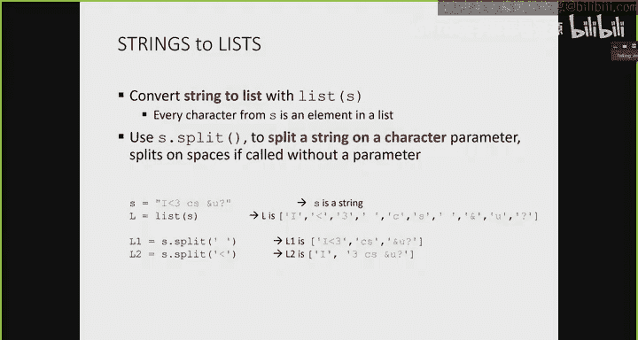

We can， of course， split on any character we'd like。

 So here I am splitting on the less than character。 So if I， there's only one。

 So if I split on the less than character， one an element in my resulting list is just the capital I。

 and the remaining element in my resulting list is the three space C， S N U。

 And there it is right there。

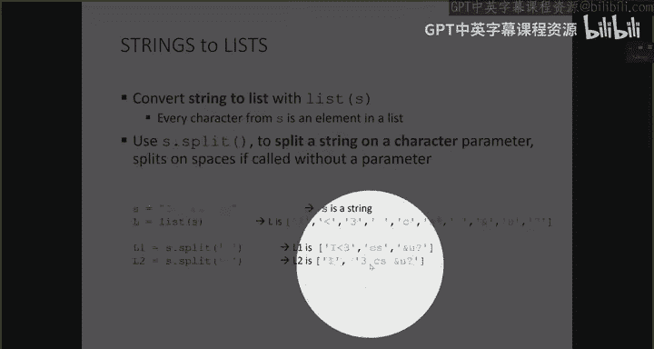

Alright， so once we have a list， we can also go backward。

 We can take this list and convert it back to strings。 So we use this， this join function here。

 And the thing before the dot is going to be what character you want to join the list elements with。

 And this is the list you want to join back into a string。 So let's look at an example。

 So let's say I have list L that has three entries in it， A， B and C。

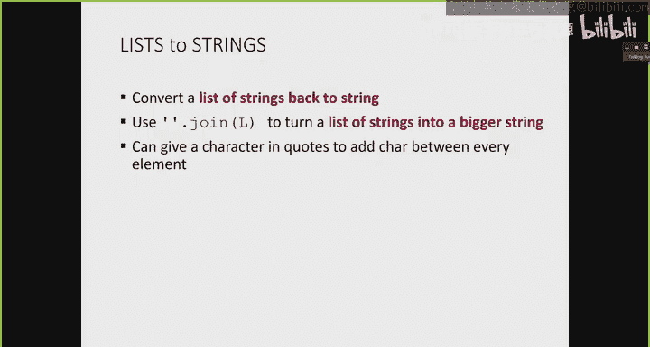

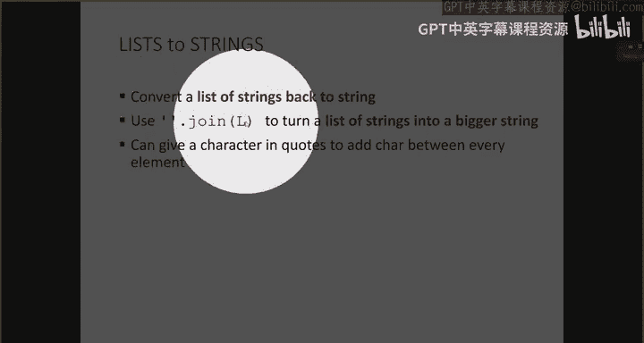

If I join on the empty string。 so here this is just quote quote right beside each other。

 there's no space or anything in there。 that's going to take for me all the elements in the list L and join them together as one。

 Nothing in between the A or A B， and C， and that bring this operation here will basically make for me A。

 B， the string， ABC。

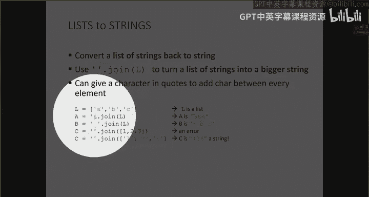

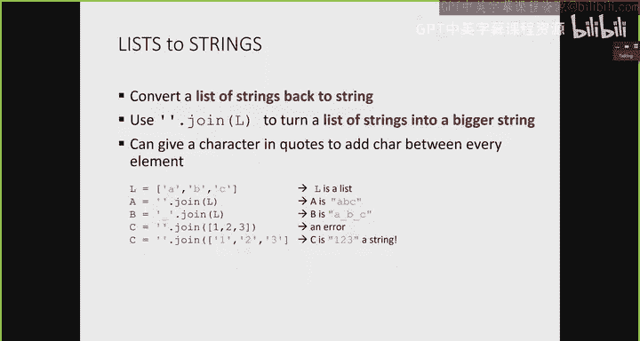

If I join on an underscore， right， you might have guessed it'll join A。

 B and C with an underscore in between each character。 So there it is A underscore， B， underscore C。

 You can join on any character you'd like。

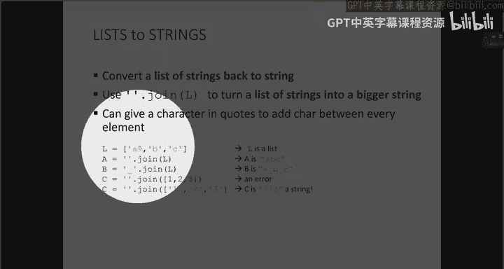

I don't know if you can join on multiple characters， but I don't see why not。

 you could try this out on your own。

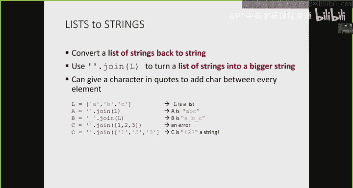

Join only works with lists that contain only string elements。

 so if we try to join a list that has just integers or floats or booleans。

 anything that doesn't contain a string in it， then youll get an error。

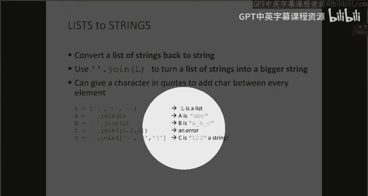

RightBecause it's basically trying to put all these back into a big string。

 If you wanted to join non string elements， you would have to be basically loop through and cast every one of these to a string first and then join them together。

So if you want to join one，2，3， you would have cast them to strings and then you could join them to make the string1。

2，3。

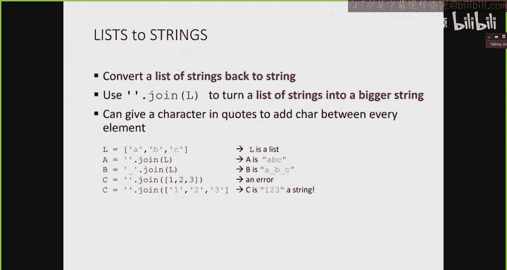

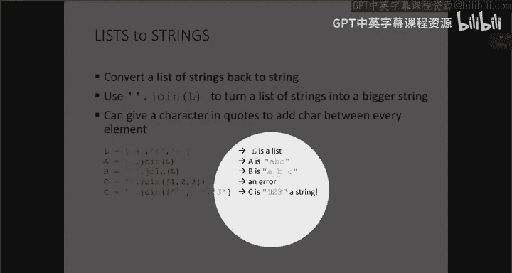

Okay， so let's have you work on this example。 So here we're gonna try to split the input。

 So here is a function called count words。 It takes in one input send for sentence。

And I I wanted to use something that's not S just to make it clear that the thing before the dot doesn't isn't always S。

 It's whatever object you want to split or join or whatever。

So this function is going to return how many words are in S， right， quote unquote words in this case。

 because it's just， I'm just interested in the the elements or the characters between spaces and between the start and the end of a word。

 right， So if it's a number， I still count that as a word。

 If it's a special character dot exclamation point， I would still count that as a word as well。

So this should be just a couple lines of code。Down around 99。Okay。

 so I'll give you about a minute to work on it， and then we can write it together， okay。

So thoughts on how we can do this。L1 equals send dot split， yep。Yep， sorry， parentheses space， yep。一。

And then we can return the length of L1， perfect。Let's run it on these two examples and should print 3 and 12。

 and it does。So notice how easy this was with lists， right， because lists are data structure。

 that's just kind of naturally iterative。 And so running L on this split list or split string。

 which gave us a list is is is really easy， right， It's a two line piece of code。Without lists。

 you could imagine creating variables that keep track of where you see the first space right。

 and then iterating through one character at a time。 And if it's a space。

 keep track of the fact that you saw space and then look for the next space right。

 and then resetting things every time you see a space。 And that would be really， really tedious。

 It would be a really good quiz one question。😊，But not once we've introduced lists。

 because it becomes really， really easy to do it with， with lists， okay。All right。

So now that we have lists， we can we can do other really interesting and useful operations to mutate the list。

😊，So we saw the dot notation on a list to do a pen。 So basically。

 to add an item to the end of our list。That was useful。

 Other things we can do in terms of mutating the list is to sort a list and reverse a list。

 And these are also very useful operations on list。

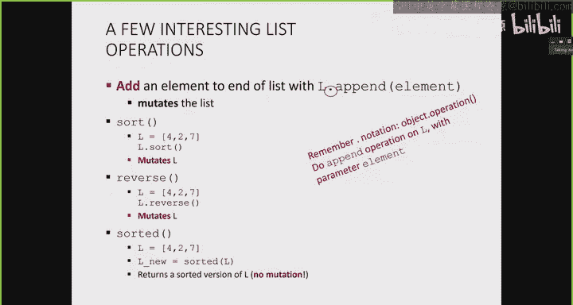

So the first two here， sort and reverse is the notation for how we sort a list and how we reverse a list。

 and these will mutate the list that you call the functions on。

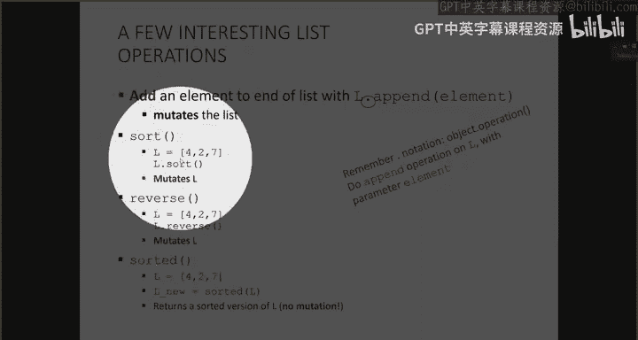

So if I have list 4，2，7 here， and I call L dot sort。

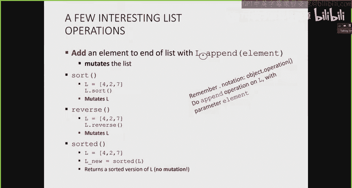

And I print L as the next line after this， L will have changed in memory to be 2，4 and 7。

 right in that order。😡。

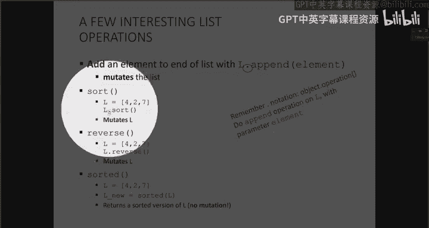

It didn't make a copy for me。 It didn't preserve the original order。

 It changed that list to be now in sorted order。

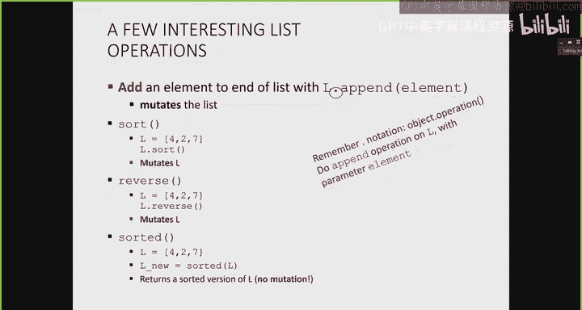

Reverse similarly。 So if we do L dot reverse on 4，2，7， it will reverse all the elements。

 So the one at the end becomes at the beginning。 The one second last is the second one。

 third last is the third element in the list and so on。

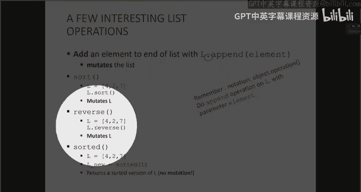

And again， this mutates my list。 So I would have lost my original order with this command。

 Eldot reverse and with Eldot， sort， of course。

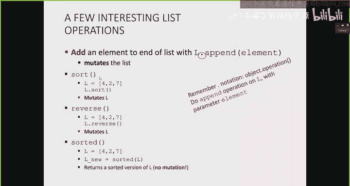

Now， there are many situations where you want to preserve the original order like， I don't know。

 maybe like the order that people joined a company or the order that people joined a grocery queue。

 I don't know， things like that right， you might want to preserve that original order。

 but you might also get maybe the sortrdid names of people for a function that does something with those sortded names。

In that case， you don't want to call sort on your original list because you would lose the original order。

 You could， of course， make a copy， or you could call this sorted function。

And the sortded function is going to keep my original list L intact in the same order that I had created it in。

But it would return for me。 So this function will actually make a copy and return for me the sorted version of L。

Okay，And L remains unchanged。 So this function does not do any mutation。

 We have to take the return and save it into a new variable。 This case， I called it L new。

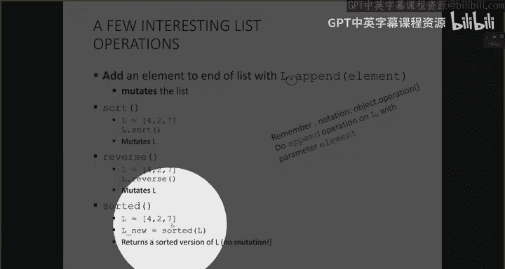

So might be a little bit sort of hard to keep straight in your mind sort of whether to use sort or sorted。

 you could， of course， always try it in the console， right， to see which one does what。

 The way I sort of remember and think about it is the sort to me feels like a command。

 It's like sort this list， right， mutate this list and sort it。 whereasas sorted。

Is more of a request like， can you please get me the sorted version of of L， right？

 And so that's kind of how I keep things in in in， in my mind as to whether I'm calling sort to do the mutation or asking to get the sorted version of the list。

Yes。It is sorting it by whatever the built in sort is for those particular object types。

 So in in the case of integers， it's just increasing order in the case of strings。

 it'll be alphabetical。You can choose different sorting functions， but we we don't get into that。

ゆしてい。That's a good question。 I think they do in order for it to work so we can try like L equals。1。

 and then we can give it a tu or something。And then we can ask sort L。Yeah， so in this case。

 it doesn't know how to resolve， right， It's trying to do behind the scenes less than to figure out which ones bigger than which。

 And in this case， it doesn't know how to resolve。How do you choose whether the tu is bigger than an integer。

 But you can imagine， again， as I mentioned， this is not something we do。

 But you could write your own sorting function where， depending on the type you would， you know。

Decide which one is bigger。So， yes， question。Yes。So you would just do L dot sort without parentheses。

 But L has to be a list that contains things that can be sorted， right， So all integers。

 all strings or something like that。So let's look at the memory diagram for how this would look just to kind of bring the point home about。

Objects that are being mutated。 So original L is 9，6，0，3。 So in memory。

 I've got the name L bound to 9，6，0，3。Again， let's do an append just for fun。

 El do aend 5 is going to add a 5 to the end of that list。

 and append sort and reverse will all be used for a side effect。 right。

 That means they're going be mutating the object whereas sorted will not do a mutation。

So let's do an append to the end。That's going to put a five at the end of the list。

Something we already know how it works。Now let's do a equals sorted L。So， again， it's in equality。

 right。 So the thing on the right hand side is going to be the function that returns for me the sorted version of L。

 So it's going to create a new object。 However， it does the sort。

 It's going to create for me a new list that contains that sorted order。

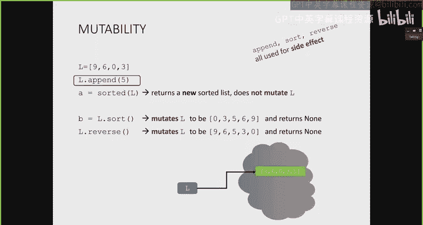

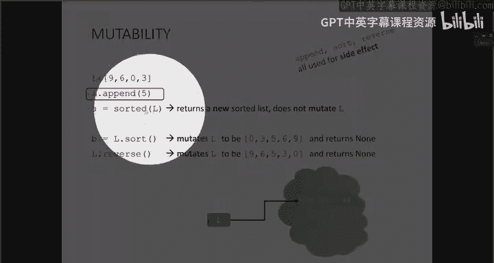

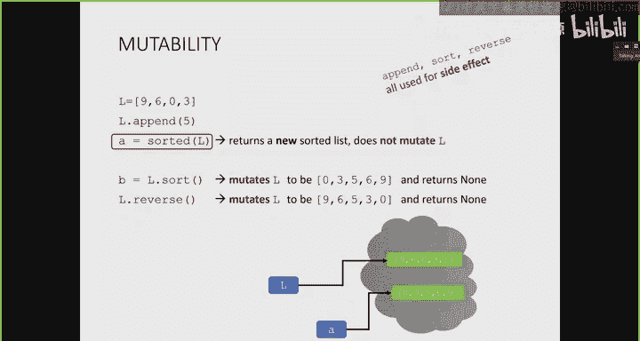

The original L notice in memory remains unchanged。 So if I want to reference L in my program from here on out。

 I will use this unchanged L。

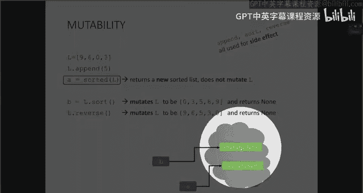

So now the return of sorted is this list， and I bind it to a。 Okay。

 so name A now points to the sorted list version。Alright， now。

 what if I do this line here B equals L dot sort。Again， let's look at the right hand side。

 L dot sort。Is going to mutate L。

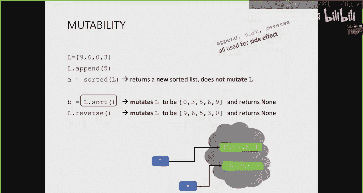

So this function itself will go and change L to be to the L's object。

 the object that L points to to be the sorted list。

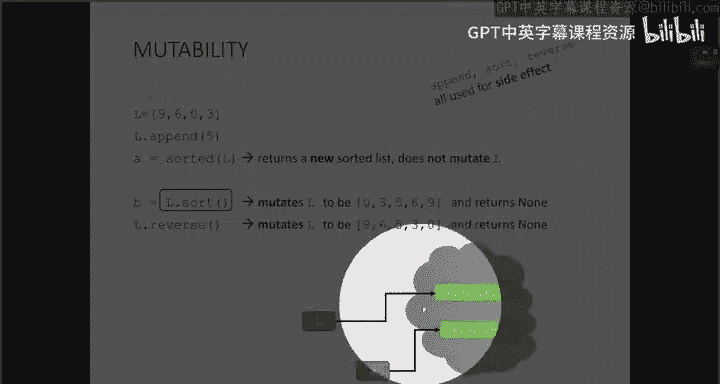

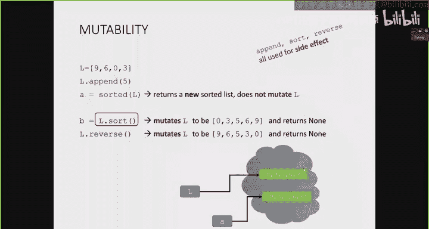

But it's not done。This function is being used for a side effect。 So what is the return from it。

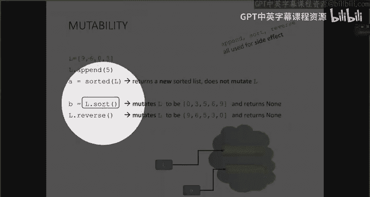

None， right， It's like the append。 So this example here will make B point to the return of that function。

 which is just none。Now， please don't ever do this。

 All you would have to do to sort L is to just on on a line by itself。 say L dot sort。

 I just did this to kind of show you again that if you do L equals L dot sort。

 bad things will happen。 You're gonna reassign L to be none。 In this case。

 I saved it under a different variable。 But it's an easy mistake to make。😊。

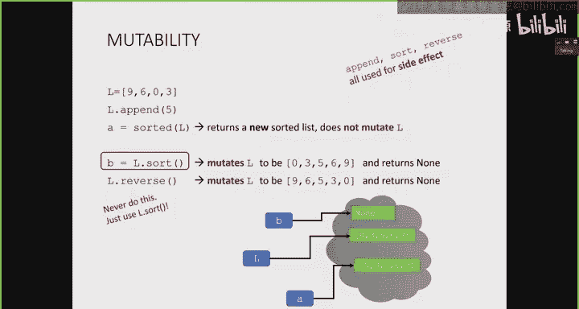

Okay， and then what about the last one here， L dot reverse。 Again。

 I'm going to go and grab the object pointed to by L。 And I'm gonna reverse all the elements。

 So here doing L dot sort and then L dot reverse right afterward makes my function makes my list be in reverse sorted order。

 So biggest number to smallest number。 So with that command there， I've got 9，6，5，3，0。 instead of 0。

3，5，6，9。

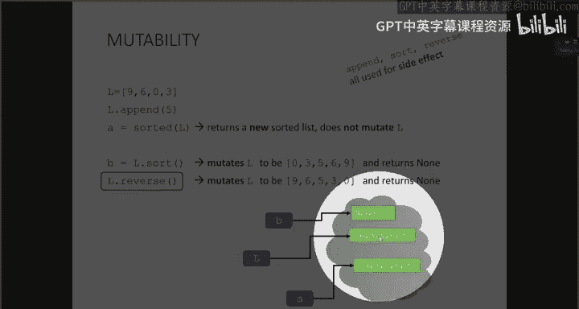

And again， sort and reverse changed my list L directly。 So I've lost that initial order of 9，6，0。

3 that I had up here。

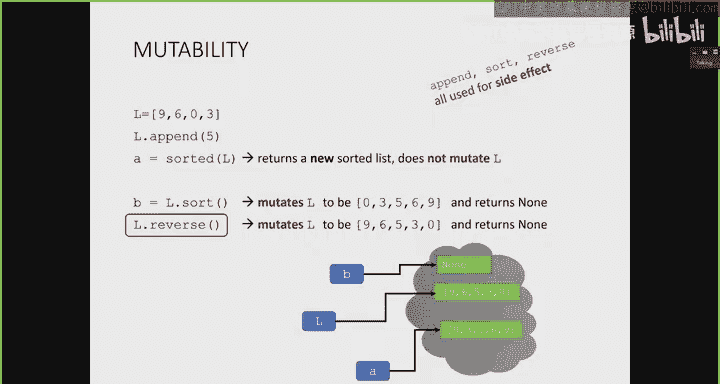

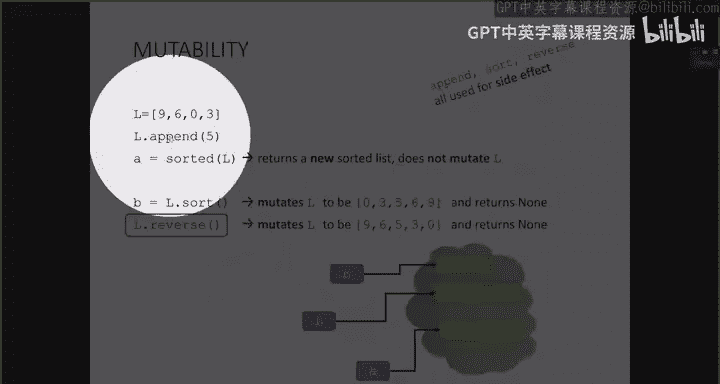

Okay。One last point I want to make。 I know we've usually seen functions that take in parameters。

 right， sort andverse are still functions， and they just happen to not need any parameters， right。

 you call them on the object L using this dot notation。 So in effect。

 it does have sort of a quote unquote parameter， the thing before the dot。

 but it doesn't take anything else in in their own respective parentheses， right。

 but they do still need the parentheses there because they are functions， right。

 They are operations that will do something for us。

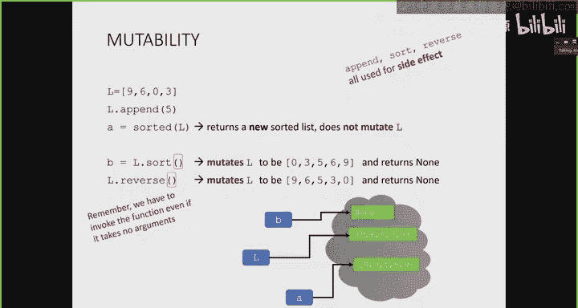

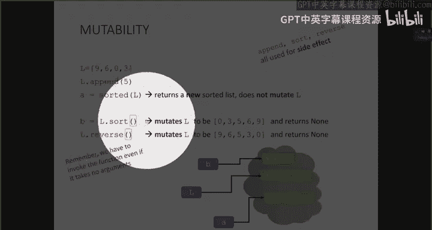

Okay， questions about this， I it okay？Okay， very good。 because now you get a chance to try it out。

 So let's have you do something similar to what we did last time。 Take in a parameter send。

 which is a string representing a sentence。 I want you to figure out all the words。

 quote unquote the same in the same manner that we did before in the previous example。

 but now return from me a list with these words in sorted order。

So if the input was look at this photograph as my sentence。

 then I would return a list which has at look photograph and this as my three my four elements in that order。

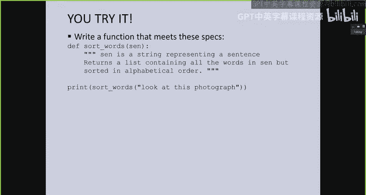

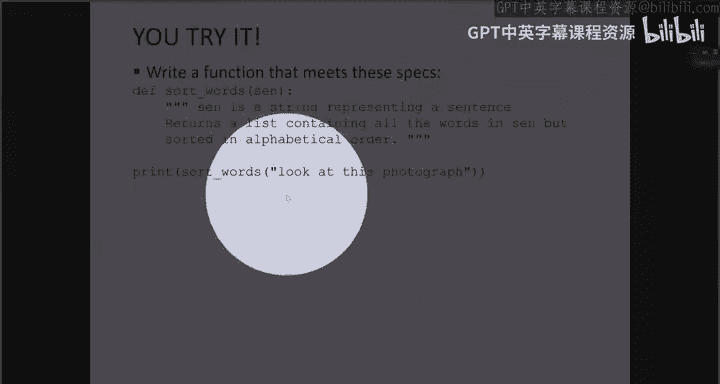

So here start writing it down on line 134。O。What is the solution， What do you have so far。Yes。

L equals sun dot split， and we split on a space。Got it， okay。Got it。Return L， perfect。 Okay。

 let's see if that worked with our two examples。一。There's my first one。 There's my second one。

Anybody do it a different way that anyone you sorted， yeah。Return。Sored parentheses L。Is that。

How you。Yep， we could do it all in one， perfect。 Yeah， this could be a one liner for sure。Yeah。

 so this。Works because this thing here creates for me a new object。

I could have saved it in a different variable and then returned that variable。

 But this does it all in one。So， just for。Completion's sake， if we comment out the other solution。

 this way still't work。Question so far。Okay。Alright。

 so what we've seen so far is a bunch of these functions built in functions， right。

 that have these side effects。 They mutate the input， the input list。

So we can actually write our own functions that have a side effect where if we pass in a parameter that's a list。

 we can have our functions mutate that list however we'd like。So let's go through this example。

 let's say we were given the task of writing a function that takes an input list L and mutates the list L such that each element in L。

Is changed to be the elements square。So2，3， and  four as an input list becomes 4916。

And I'm mutating that list， I'm not creating a new list and returning the new list。

 I want to actually mutate the input list。So if we were faced with this task。

 the way that we would kind of go about it， maybe based on what we've learned so far is to say， well。

 I'm going to iterate through each element in L because that's the very pythonic way to do this。

 right， So I'm grabbing the element in the list L。But then I would be stuck。

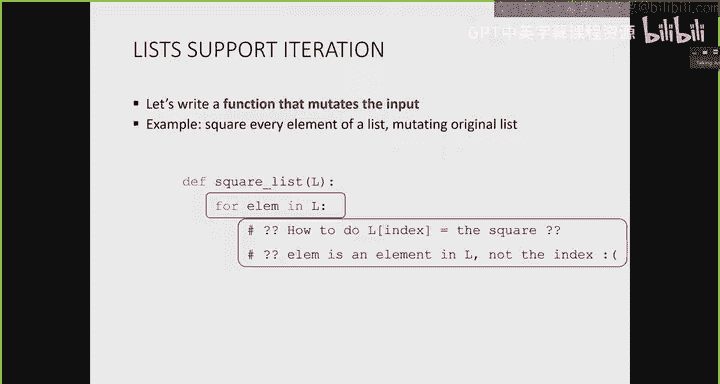

Because the syntax for changing an element at a particular location。

 right is L at I equals whatever the changed thing is。

But my loop variable is iterating through the element directly。

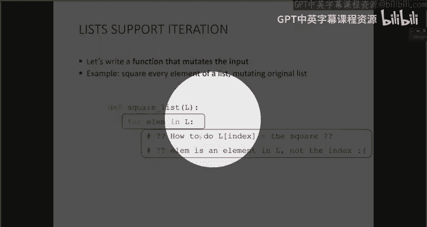

So what's my index in this particular case。 I don't have it in hand， right， I have the element。

 but I don't have the index。So what are some solutions。Well。

 a first solution could be right before the loop to create a new variable that keeps track of the index right。

 So you make I equals0 right before the four loop and inside the four loop。

 you increment I each time。 Now you're keeping track of the index yourself。

Option 2 is to change what we iterate over。 So instead of iterating through each element and L directly。

 let's iterate over the index。So iterate over range length L in that case。

 the range length L basically becomes range 5 or 20 or whatever the length of my list is。

And a last option is to try to use this this thing called enumerate， which is a Python keyword。

 I guess function， Python function。And the syntax for that would be for tuple I comma E in enumerate L。

 So I'm basically enumerate wrapping L inside this enumerate function and Python each time through the loop。

 makes this little tuple I comma E be the index。And the element at each location through each time through the loop。

 And so it gives you a two for one kind of deal here using the synumerate function。

I'm not going to go over option one or option  three。

 I do encourage you to try to look these up or try to implement them yourself。

 but I will go over option2 in these slides。So if I were to iterate over the index directly。

 the way I do it is I'd have to change the loop variable， right， for I in。

 And then the thing I want to loop over is all of the indexes， indices， right。

 So I want to get the number 0，1，2，3，4 all the way up to the but not including the length of L。

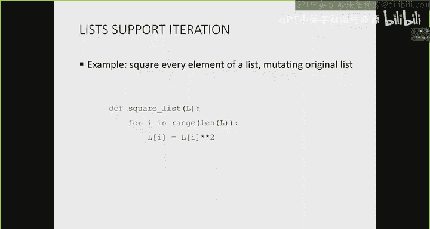

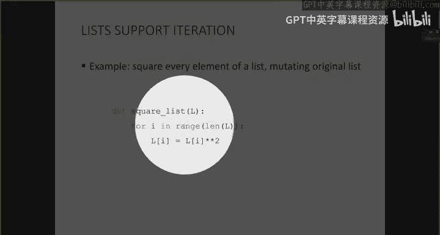

So once I have this index in hand， I can do something like this very easily， right。

 because this I here is going to be my index。

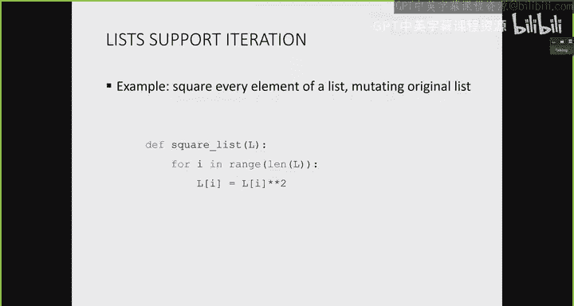

Right。And the thing on the right hand side is just going to be a matter of grabbing the element at that index and squaring it。

Okay。So here， L square brackets I on the right hand side grabs for me the element at index I。

 So what's the value of that element at that particular location， 23， whatever， square it。

 so star star 2 squares it。

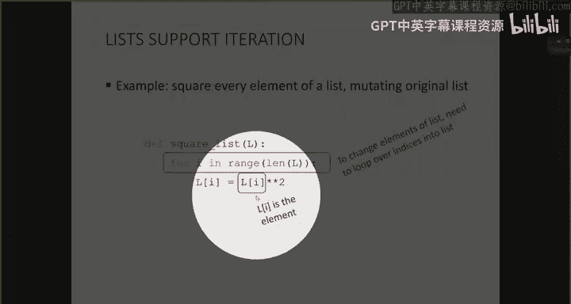

And then the thing on the left hand side is the syntax for changing the element at a particular location。

 right， We saw this way back on slide 2。So with this line of code。

 Python goes through each element in the list and squares it and saves it back into that same list。

 No new list is created。 It's mutating the original list。Right。No return。Nothing to return。

 This function will return none because it does its job of doing the mutation。

So if we go through an example， suppose that L is 2，3，4， What is this loop going to do。So I。

 the first time through the loop， will be 0。And then。That first time through the loop。

 it will mutate I。 So it says L square bracket 0 equals whatever the element at 0 is。

 the two squared。 So L square bracket 0 will be changed to 4。

 So we've mutated the first the element at index 0 to be a 4。 and everything else is the same。

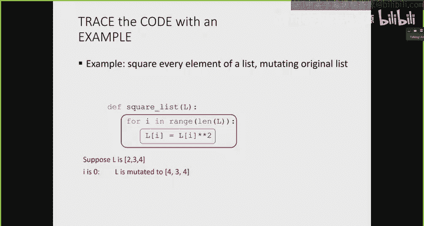

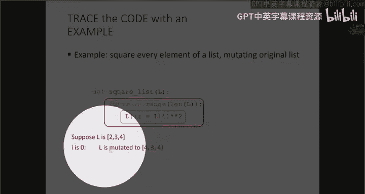

Next time through the loop， I'm mutating the list that I had just mutated， right。

 So the first element is still the mutated value 4。

 But now I'm going to change my element and index 1 to be 3 squared of 9。

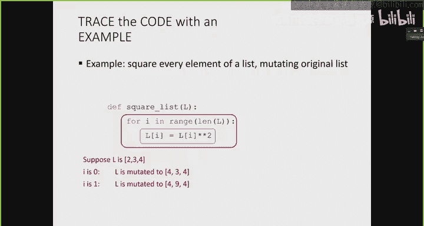

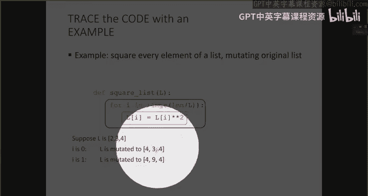

Last time through the loop， every all the elements up to index2 are going to be the mutated elements。

 So 4 and 9。 And then the last time through the loop， I'm mutating the6 the4 to be 16。

 the square version of that。Okay， so。To check that we did the mutation correctly。

 what we would do is we would create an input list。 I called it L N。

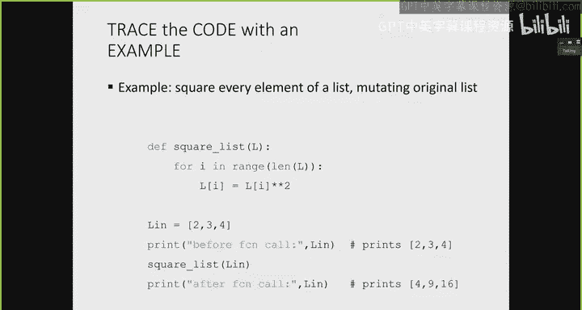

And， you know， I've set it to 2，3，4， my example。If I print before the function call。

 the value of L in， it's 2 comma 3 comma 4 as expected。 It shouldn't be anything different than that。

 Then I make a function call to the function that we just wrote。

 Note I'm not returning anything here， so I'm not saving the function call to any any variable。

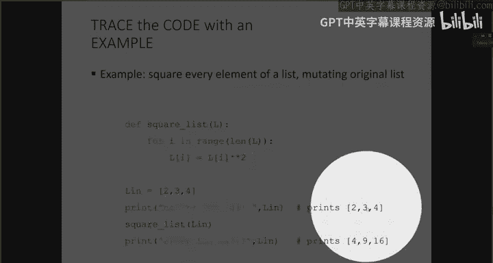

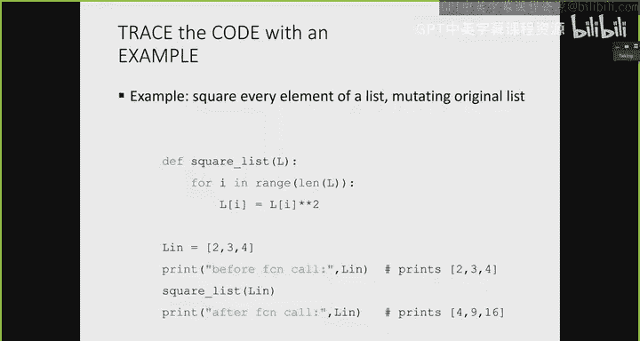

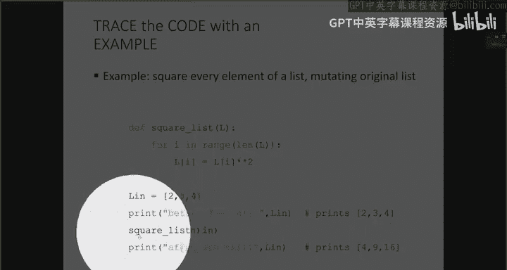

Right。If I print L in after the function call， it will print the mutated list。

 So this L in here and here and here is the same object。

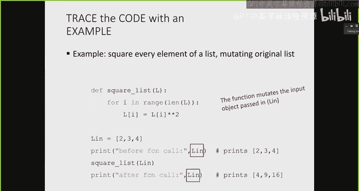

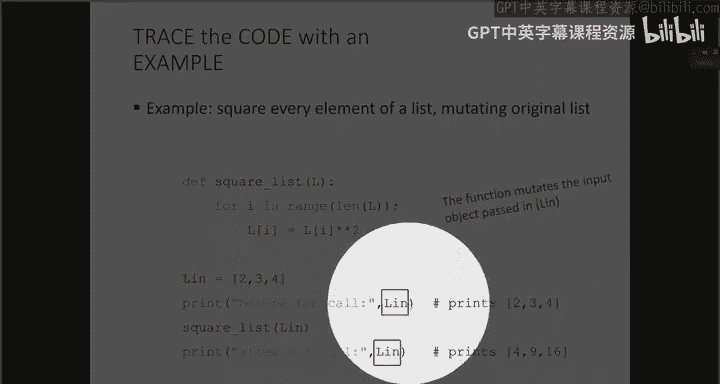

Nothing was returned。 This， this function here has nothing to assign its return to。

 If we assign it to something， that variable would be none。Just like the pen， Just like the sort。

 just like the reverse。

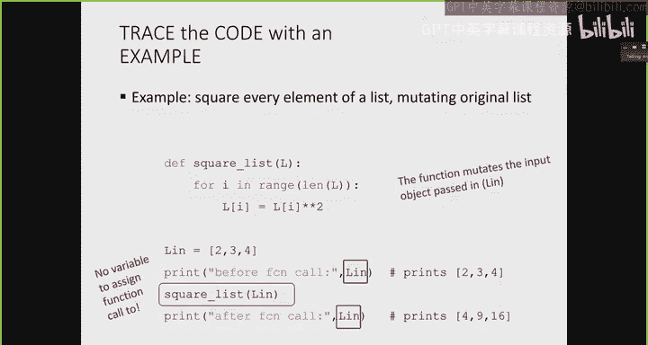

Alright， So when you're writing， oh， yeah， question。We created a function。 It doesn't have a return。

 It doesn't say none because we didn't save the function call to any variable。 right。

 If we said like a equals this function call， if we print a， it would show none。

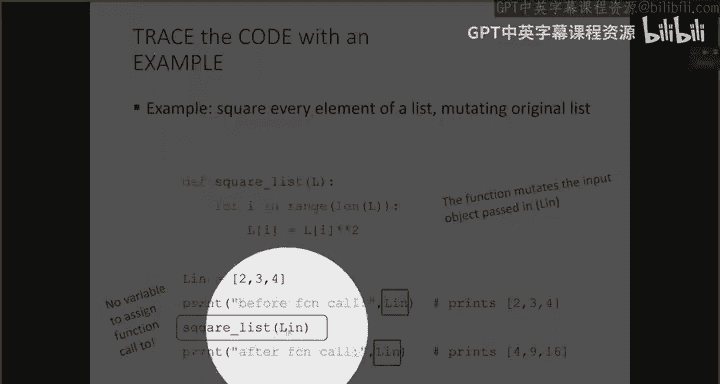

Okay， so when we're writing functions that mutate input lists。

 the two likely things you're gonna to have to do and it depends on what your function is actually doing。

 but most likely you're going to have to iterate over the length of the list。

 So for I range length L to grab the index as well as the element to be able to grab the index as well as the element。

And these functions， I mean， they could do other stuff。 But if you're using them for。

 for mutation and things like that， they're going to return none。

 So when you make function calls to them， they those function calls will likely just be on a line without saving the return to any variable。

Okay， so we've talked about mutable objects。 They're very， very useful。嗯。

Places where they're useful or the reason that they're useful is because they allow you to have。

Basically， large databases of objects like employee employees in a， you know。

 in a company list of all the students at M T， things like that。

And if you want to make a change to something about that list。

 like a student changes their name or their address or something like that。With two poles。

 you'd have to make a new copy of that entire list。

 so it could be very space inefficient because every time a student changes their address or their name or something about themselves or their grades or something like that。

 you're making a new copy of this potentially thousands long data structure。

Lists don't have that issue with lists， you're just mutating the object in place and you're done。

 No extra copies are being made。 So it's a very efficient data stretch。

But with lists come some unexpected challenges。 And we're going to go through three tricky examples today。

 in next lecture， we're going to see tricky example number  four。

 And these three tricky examples involve looping over the list in one way or another。

 over the range of the length of the list or through the list directly。

So let's look at the first example。In this code down here。

 we're going to loop over the range of the length of the L。

 And then what we're going to do is append the loop variable I to the end of my list。Now， what。

Does range length L do。 So remember the， the thing that a for loop iterates over is a sequence of values。

Now， range some number creates for us a tuple like object， not a tuple specifically。

 but you can think of it like a tuple。 So range 4， the length of this particular list would create for us in memory something like a tuple。

 the sequence 0，1，2，3， and this is the sequence that the loop variable I will go over first。

 it'll be 0。 then it'll be 1， then it'll be2， then it'll be 3。

So when we iterate through this sequence， Python says， okay， the first time I see this。

 I encounter this for loop， I'm going to save this sequence I need to iterate over as as an object in memory。

 And then I'm going to have my loop variable iterate over each one of these elements。

 The thing I'm doing is a pending I to the end of a list。So the first time through the list。

 I'm going to append a 0 to the end。 So the0 being this loop loop variable here。

Next time through the list， I'm appending the one to the list I just mutated。

Next time I'm appending the two to the list I just mutated。And last time through the list。

 I'm appending the three to the list I just mutated。And we finish。 We've gone through four times。

 We've appended four items to the end of the list，0，1，2， and 3， right。

 this this thing this the elements of my sequence that I'm iterating over。

Let's look at the memory diagram。So。Originally， L is 1，2，3，4。

 What exactly happens when we first encounter range length L that gets put as a variable。

 this tuple like thing。 I made it be a tuple， but it's not exactly a tuple in memory。

And this I will iterate through each one of these values in my sequence， right。

 This is the sequence of values that。That I'm going to iterate over。

So the first time through the loop， Python has I pointing to  zero here。

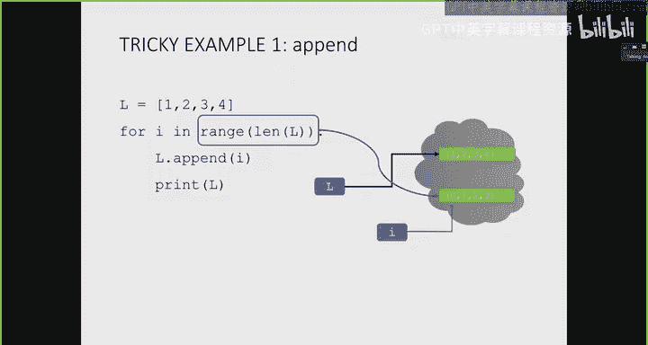

And so what's it doing inside the loop， It's going toend the 0 to the end of L， right。

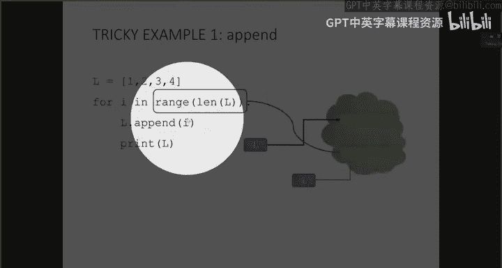

Next time through the then it's gonna print L， sorry。

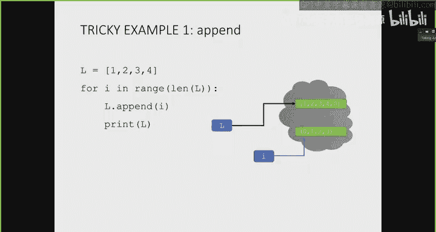

And then next time through the loop， the loop variable increments by one， right。

 So we've already looked at the0。 Now we're gonna do the one。

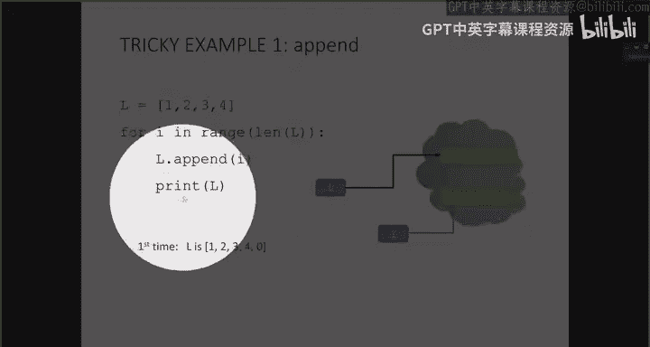

So the loop variable I is now one。 So we're gonnaend the loop variable 1 to the end of L。Prince L。

Loop variable becomes 2。 Append the loop variable to the end of L。 So now it has a2。Print L。

 And then the last time weend the loop variable 3 to the end of the list L and print L。

Pretty straightforward， the code terminates because we've created this original tuple like object here。

 which tells Python what values you need to iterate over。

 This is your sequence of values to go through。

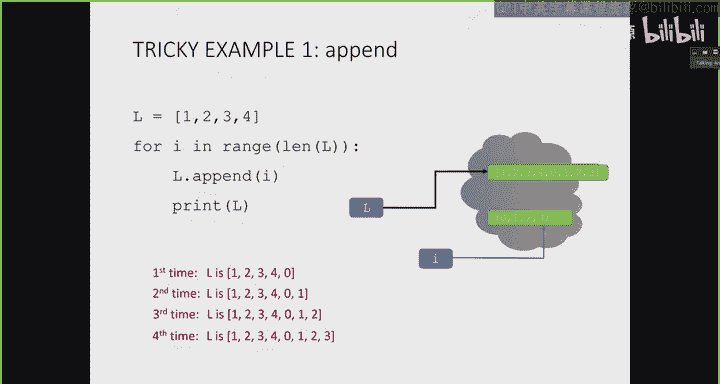

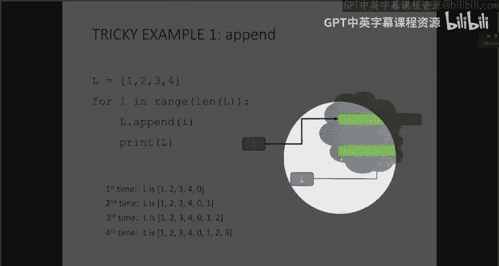

So that's basically what I said。So let's look at a slightly different example。 So in this case。

 instead of iterating over the range length L， let's iterate over the elements in L directly。

 So for E and L。

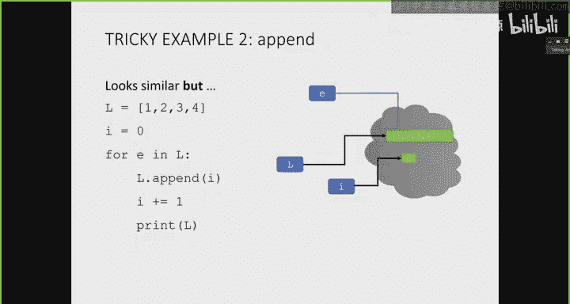

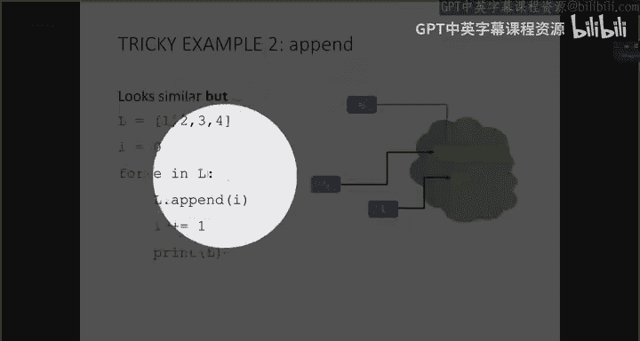

Now， to keep things sort of in parallel to what we had done before。

 let's create a loop variable I equals 0 before the four loop。

 and let's incremented by one each time through the loop。 So we're gonna still append 0 then one。

 then two then3 to the end of our list。

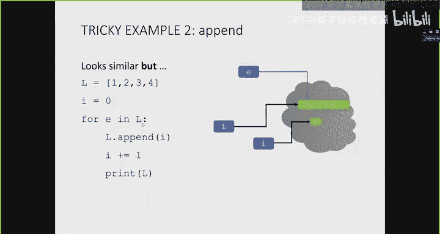

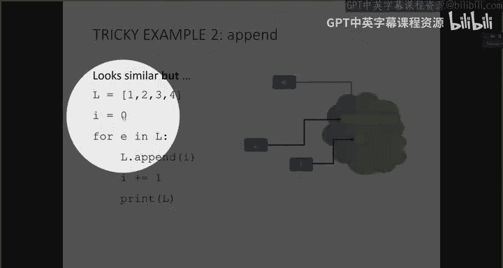

So， in this particular case。

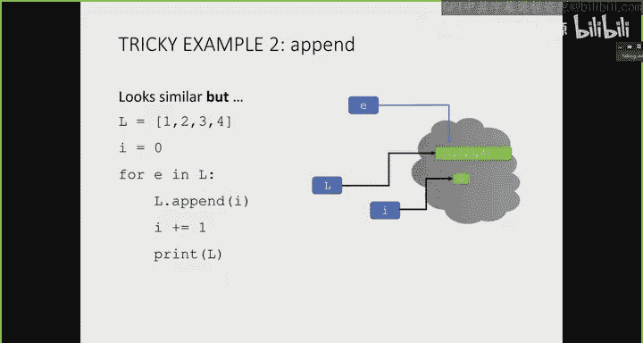

We start out with the memory diagram like this。 So we have L pointing to 1，2，3，4。

Loop variable I is going to be 0 originally， and E will first point to the first element in the list。

 That's what the four loop over the elements in the list does。

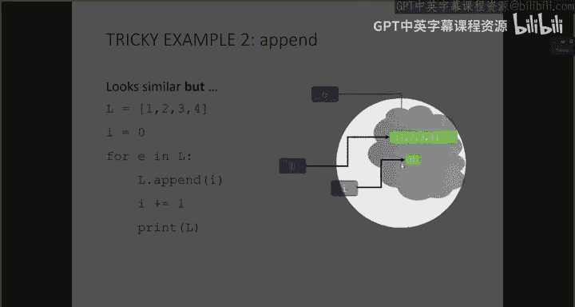

So。

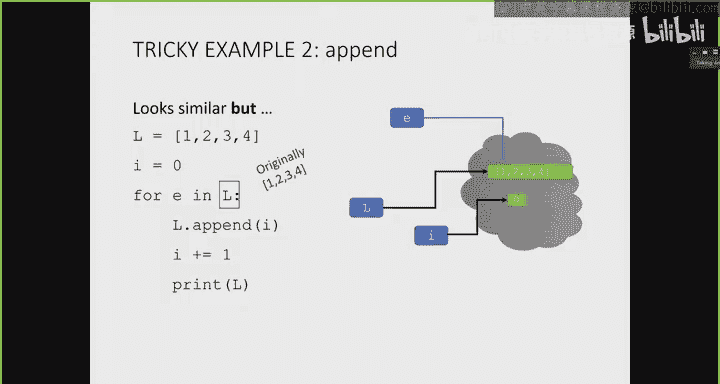

Going into the list， we say L dot aend I。 So at the end of L， I'm going to mutate it to contain a 0。

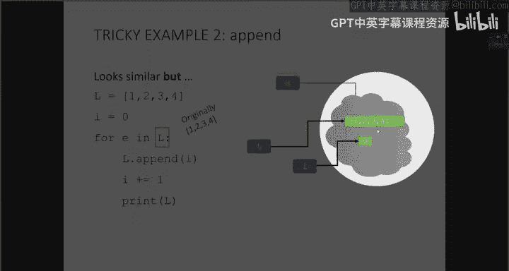

Good。I increment I by one。Good。I print L。 Okay， good。 And then the next time through the loop。

 Python says， alright， what's the next element in my sequence。

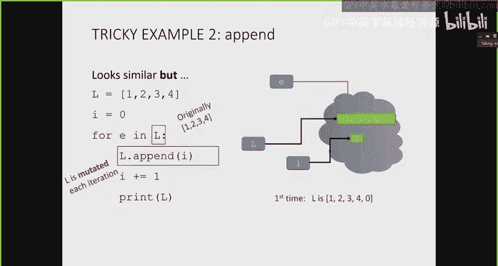

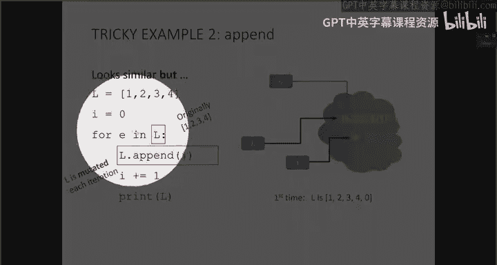

Well， I looked at the one first。 Now， let me look at the two。Alright。

 now I'm looking at the two as my next element sequence。 I'm gonna append I to the end of the list。

 right， So I'm gonnaend one to the end of L。Increment I by one to be2 print out。Okay。

 next value in my sequence。 E increments to the next element in the sequence， the three。

We append I to the end of the list。 We append 2 to the end of L， Icrement I by one， print L。

 What do you notice。

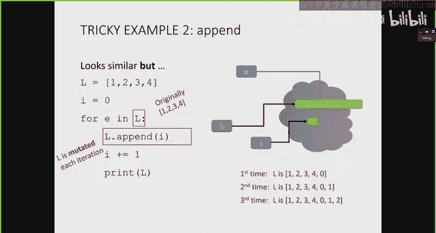

Is this code going to terminate？No， because our loop variable will always be four elements away from the list。

 the end of the list。

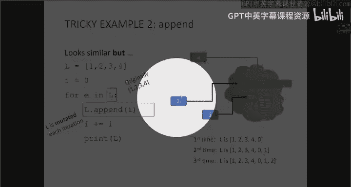

Right， as I'm adding an item to the end of my list， loop variable iterates to the next item。

 But then I'm adding another item to the end of my list and my loop variable iterates。

 And so we're always going to be for behind the end of the list。

 So this code will actually never stop。All right。So the difference here is what I'm iterating over in the previous example。

 as soon as Python saw range length， whatever， it made this predefined sequence of values it needed to iterate over。

But here， it doesn't do that because it's iterating over my object L。

 There's no predefined sequence to create。 It's supposed to iterate over L directly。

 so that's the difference between these two。Alright。

 so now I'm going to show you before I do the last tricky example of involving concatenation。

 I wanted to mention one thing， which is there was a question earlier。

 How do we actually add more than one item to the end of our list。

 And we do that using this extend operation。And this extend operation will is kind of like a pen。

 But we are going to add all of the elements of some list as the parameter to the end of our list L。

So in effect， we're mutating L to be extended by all the elements in some underscore list。

So here's an example。 First， let's do concatenation just to remind ourselves what it does。

 So L1 is 2，1，3 in memory。 L2 is 4，5，6 in memory。 L3 is going to be L1 concatenated with L2。

 pretty straightforward。 It's concatenation。 So Python creates for me a new object。

 which is all the objects in L1 and L2 put together。

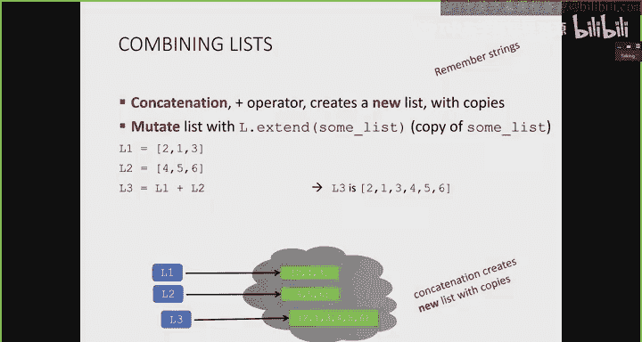

As this completely new object bound to the name L 3。 So L 1 and L2 remain unchanged。

 No problems there。

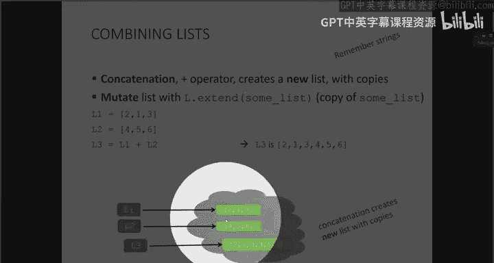

But the extent is going to take， is going to mutate。 Not the dot notation format of extent。

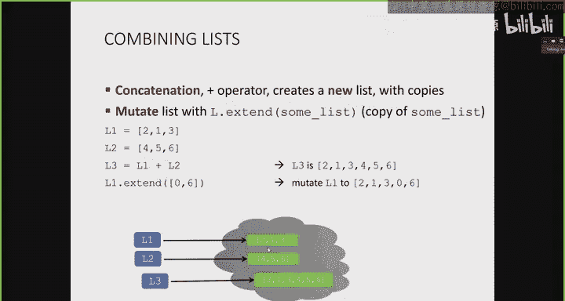

It's going to mutate L1 to be extended by all the elements in this list。

 So it's going to add a 0 and a 6 to the end of L1。

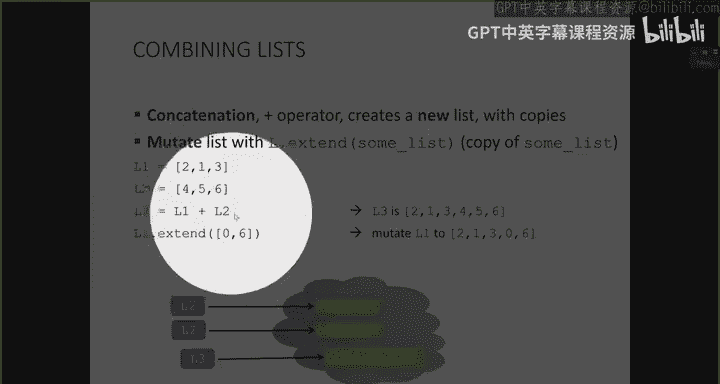

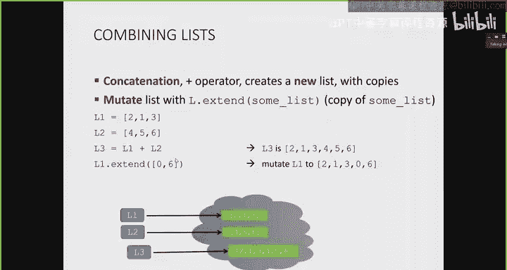

So here it is。 I've got L1 mutated to be 2，1，3， and then 0 and then 6。

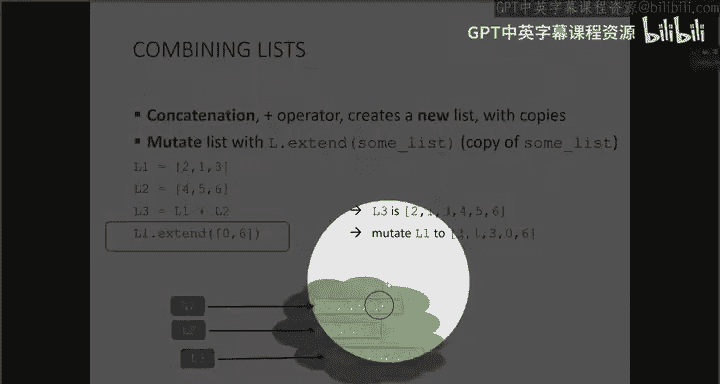

So just to bring the point home， the thing we're extending by is all of the elements of this list in the parameter。

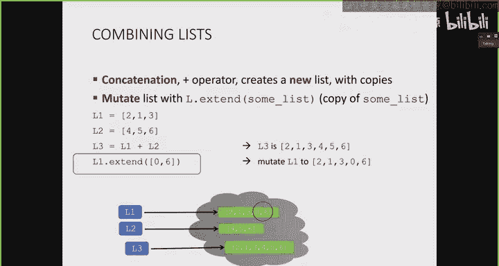

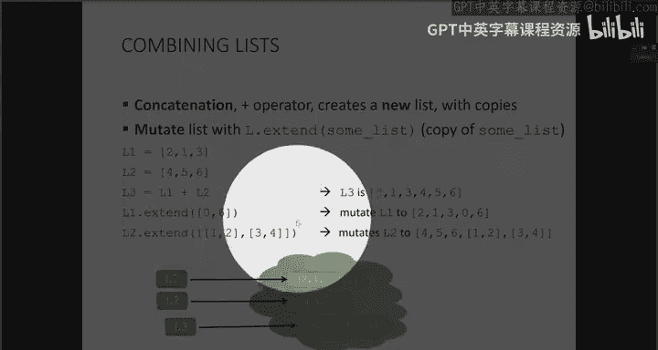

So in this particular case， L2 dot extend will be extended by how many elements？Two or four。Yeah。

I C 2。 exactly。 it'll be extended by two elements at the top level， right。

 This list has two elements in it， a list， and then another list。

So this command here will extend L2 by these two elements specifically， one comma 2 as a list。

And 3 comm4 is a list， right， But these are individual objects。

 They're single objects that are lists。 They happen to have a bunch of elements as part of the list。

 but they are two objects。

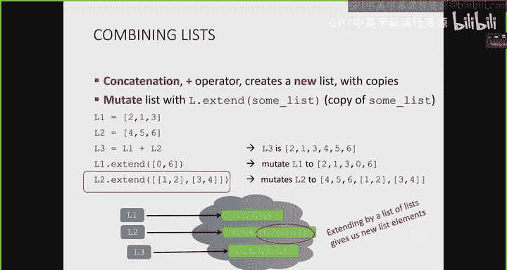

Yeah。やっぱり。When we extend by zero comma 6， there's no brackets because we're extending it by the elements of this top level list。

 so it's two integers right and here we're extending it by the elements of this top level list so in a sense the outermost parentheses。

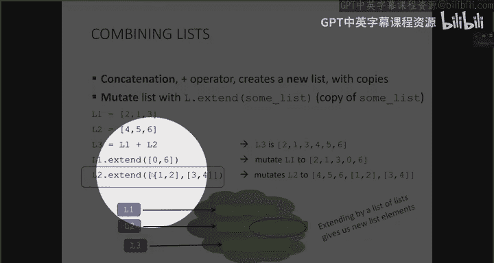

Which are actually， they are lists。on this。Okay。So that introduces Xt。

 We're not actually going to use X for this particular example， but I did want to mention it。

 In this example， we're going to use the plus the concatenation operator to create for us this。

 this new， this new object and bind it to L again。So let's see what this is going to do。 First。

 I'm going to actually tell you the answer， and then we'll do the memory diagram again to bring the point home so。

This loop will again， loop through all the elements in e。Originally， it's 1，2，3，4 in a list。

All right。So what is the actual loop going to do， It's going to take whatever is an L。 double it。

 right？ So originally， L is 1，2，3，4。 The first time through the loop is going to create a new object。

 which is just a L 1，2，3，4， doubled， I've concatenated L with itself。

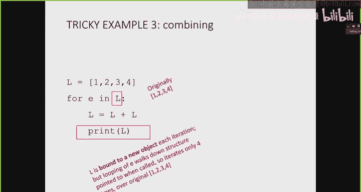

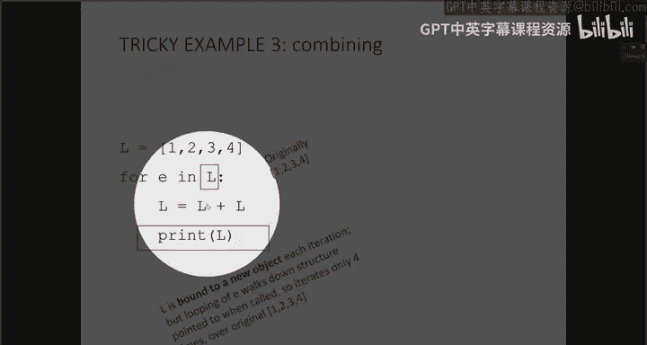

And then I'm going to save it in my new as this new object with the name L again。

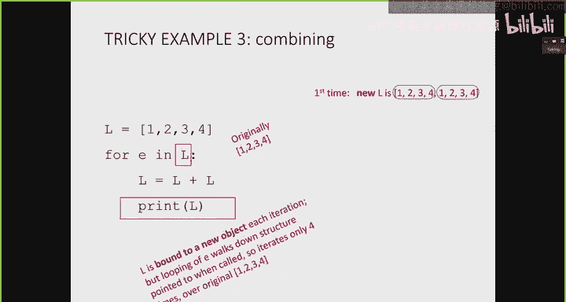

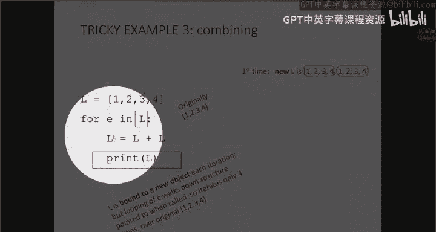

That's the first time through the loop。Second time through the loop。

 I'm gonna take whatever L was mut or whatever L was before。 sorry， not mutated。

 but whatever L was before。 So it's 1，2，3，4，1，2，3，4。

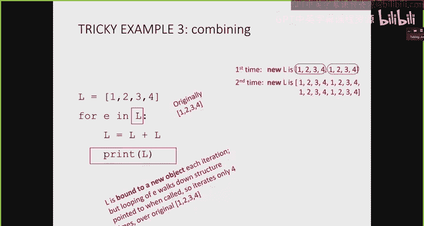

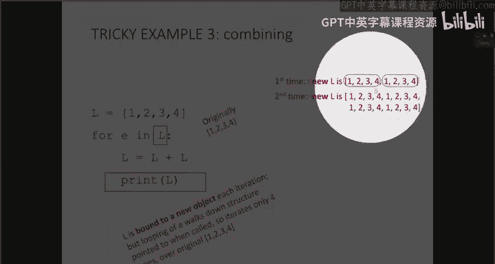

Double that。And save it under the name L。Second time through the loop。 Now。

 third time through the loop， I'm going take whatever L is right now。 So these two rows of 1，2，3，4，1。

2，3，4。 double that。

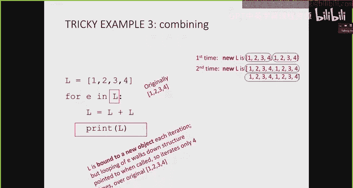

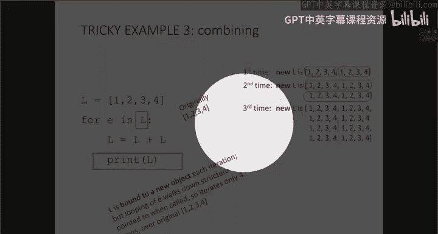

And save it under the name L。And then the last time， through the loop。

I'm going to take whatever L was before。 So these four rows of 1，2，3，4，1，2，3。

4 double those and save that as the new L。 and that's it。 This code does not go to infinity。Now。

 let's see why exactly that is。 So this will help。

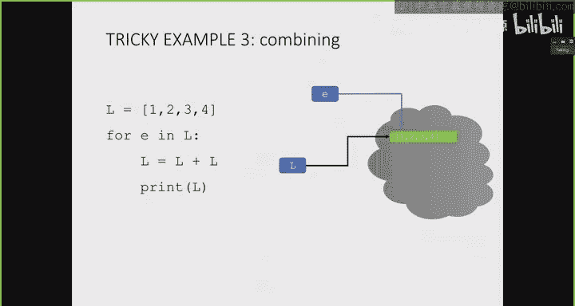

Originally， I've got L is 1，2，3，4， right， so that's straightforward。

My loop variable E goes through each element in this object， right。

 so first it's going to point to the one。

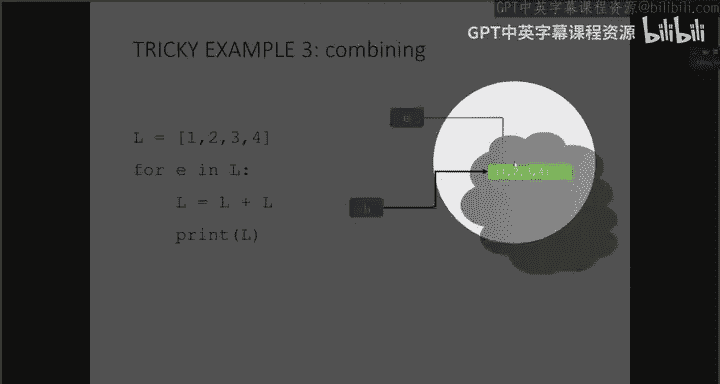

So far， the same。

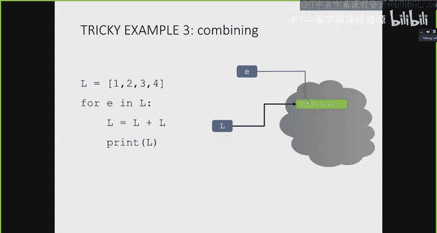

L equals L plus L。 Let's look at the right hand side first。 Okay， this creates for me a new object。

 right， remember， concatenation creates for me a new object。 It doesn't mutate anything。

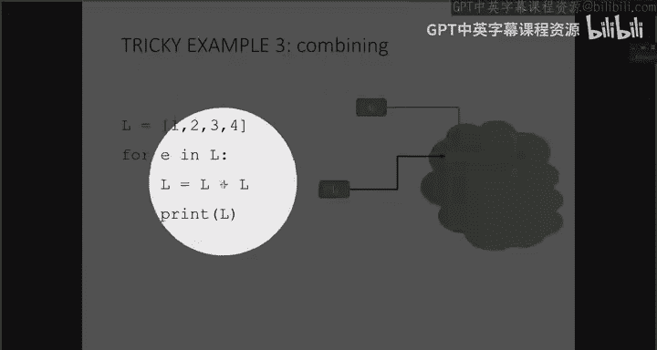

So in memory， I'm gonna to get 1，2，3，4，1，2，3，4。 I've doubled L， L with itself。

What is L equals going to do。Do remember， we did a slide like this， very similar to this。

 it's like when we reassigned the tuple。The L equals will actually take the binding from my original object。

And put it on the new object that I had just created。

Right exactly that that memory diagram with the tuple， right， I had happen to have the same name。

 but it's pointing to a new object， same here。 I happen to have the same name L。

 but it's now pointing this new object。 The old object， this thing that I'm iterating over。

 I've lost the binding to it。

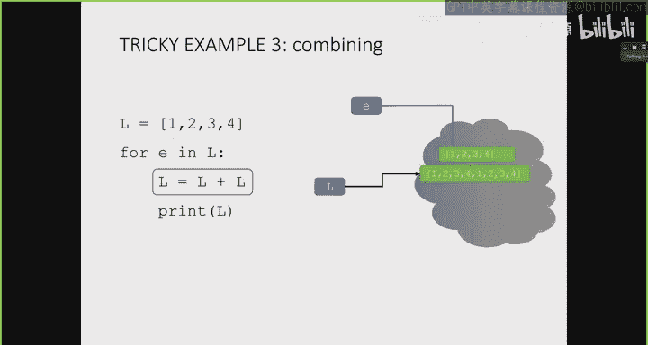

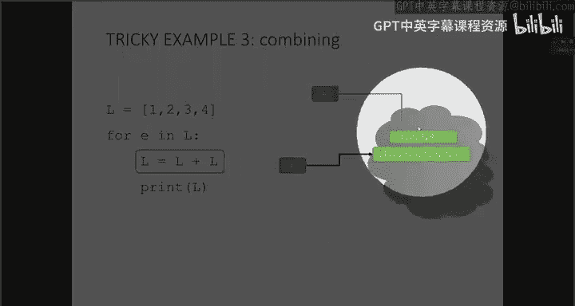

And really， the only way I can even reference that old object is through this E。

 because that E is still going to go through this old object element。So that's the first time。 Yeah。

 Yes， question。Yes， you define E to to be the object in memory， not the name L。 So it's。

 so E is bound to the object in memory。 That's this thing here。

 That's why it was so important to kind of separate ourselves from the object in memory versus the name we give an object。

 because that name can change to anything to a bunch of other stuff。

 But the object itself remains in memory。

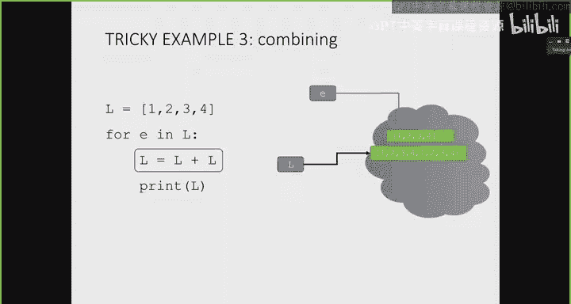

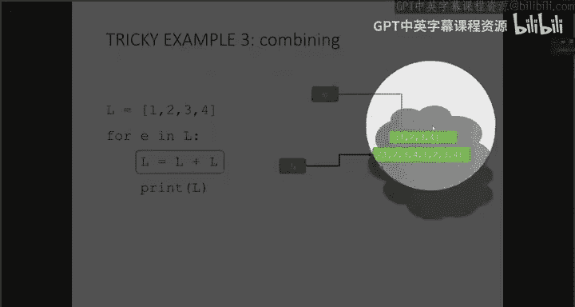

Right， so then this becomes pretty straightforward。 if you understand that piece， right。

 the first time through the loop， I've got L assigned to this new object here。

 I've lost the binding to my original list that I'm iterating over。So when I print L， I print this。

Next time E increases to the next element in my sequence， right。

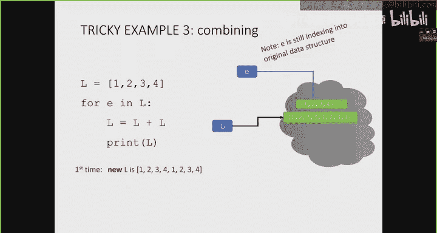

L will double what it currently is。 So it's currently this thing here。 It's gonna double to that。

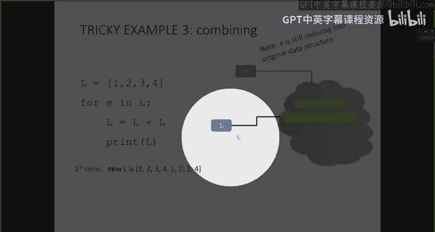

And I'm going lose the binding from the original or not the original。

 But this thing that I had just bounded to to bind it to the next object that I just created。

And then that's the second time through the loop。 It looks like this。 third time through the loop。

E increments by one， right to the next value in my sequence。I'm going take L plus L。 So double that。

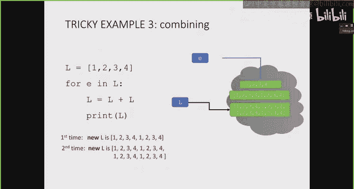

Previous data object。

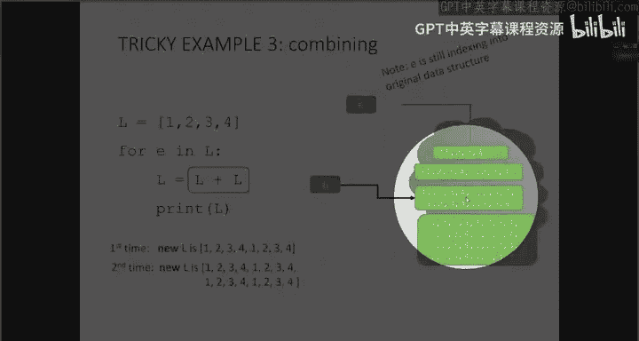

Take the binding from that previous object to the new one。Increment。E by one more， right。

 And this will be the last time E is going to change because after this。

 E will have gone through all the elements in its sequence。

 It's gone through the end of the that list。Right， so the last time through the loop。

 I've doubled that L。And I've lost the binding from the previous one， made it to the new one。

 And then that's it。 It's done。Questions。Is it straightforward， Does the picture help。好吧。Okay。

 one more thing I want to mention。 And this is kind of a preview of what we're gonna do next time。

 One very useful operation that you might want to do is to take a list and remove all of its elements。

 But not， yeah， go ahead。は。Oh， here it's， that's in range。

 So here it's just iterating through all the elements in the sequence， right， going to every one。

So one useful operation we might want to do is to remove all the elements in a list， but not sorry。

 but by mutating the list。 So we want to keep our original list object。

 we just want to basically clear it out of all of its elements。

 And so the command for that has a pretty nice name。 It's called clear。

So if you want to take a list L and clear it， so to remove all the elements inside it。

You say L doc clear。Okay， and that mutates my original list L to be empty。

So one thing that might help sort of with this mutation lecture and figuring out which object is which and whether you've created a new object or not is to figure out is to ask。

 how do I know that this object is the object that I'm mutating。And to do that。

 we're actually going use this function called I D。An I D lets us kind of get the memory。

 location or memory object or the idea of the object itself in memory。So the code on the left。

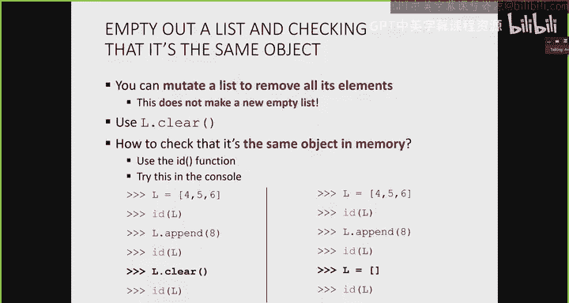

Is code that takes in a list L。 We get its ID to see what is this what is this object in memory。

 What's its number， app penant8 to it， We're going to see that the I of this is going to be the same as the I of this because we're mutating L。

 we're not adding we're not changing it。 We're not creating a new object。😡，And then lastly。

 we're going to clear it and check the ID again。 and you're going to see that the idea is exactly the same in all of these different cases。

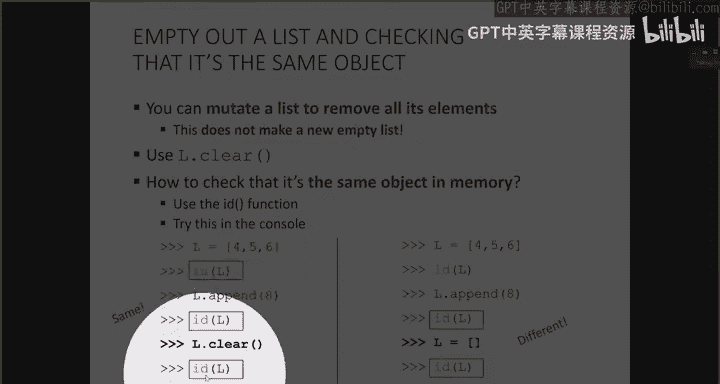

So I'm doing this in the， just in the console just to show you real quick。 So here I have 4，5。

6 as my L， right， Here's L 4，5，6。 The idea of it。Is this number here？

You could just look at the last four three letter three digits or whatever，808。Let's append。

An item to the end of our list。Right， L。Mutated to contain that item。 The idea of L remains the same。

 right， ends in 8，08。 It's the exact same object in memory。 We've mutated it。L doc clear。L。

Empty list， right， I've removed all the elements of L。

 and the idea of L will show me that it's this exact same object， right。

 I'm just mutating this same object in memory。😊，Let's do that again。Except in the new version。

 instead of using L dot clear， I will say L is equal to the empty list。

 And this is also a really common common mistake to make。

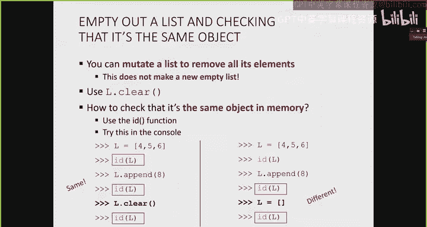

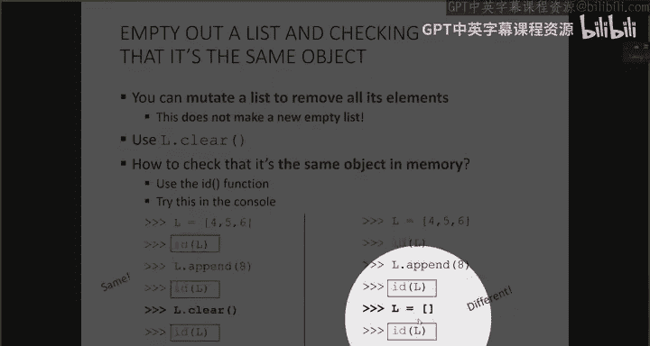

So here I have L is 4，5，6。 Again， this is my L。 Let's get the idea D of L。

 It's gonna be a new one because I've reassign L to this new list， right， So this one ends in 3，1，2。

Again， let's do an append just for fun， right， the I D R L。I D of L is going to be， again，3，1，2。

But now， if I say L is equal to the empty list， this is exactly the same as the situations we've seen before with the two pole and with the that tricky example number 3。

 When I say L is equal to the empty list， Python takes my name L and assigns it to this object。

 That is the empty list。My original object，4，5，6，8 is still in memory。

 I've just lost the binding to it。Right， so here's L。It's an empty list。

 but the idea of L is now going to be different， right， Orinally。

 I was working with this list at I D 3，1，2。 But after I said L is equal to the empty list。

 I've lost the binding from that old list。And rebound my list， my name L to this new empty list。

 right， And you can see this using the， the this I D。 just pretty cool。Okay， quick summary。

 So we saw lists and tus as a way for us to create these compound data structures that can contain any kind of object as their elements。

 Tups are immutable。 So for things like， things that don't change。 They're very useful。

 like country latitude， longitude， those things won't change or， you know。

 the word that appears on a page number and a line number， something like that。嗯。😊。

Lists are mutable objects。 So you use them in situations where you need that dynamic aspect， right。

 So if you want to maintain a list of employees， you want to maintain a list of students。

 list of grocery items or things in your fridge。 right。

 Those are really good situations where you'd want to list because things are constantly changing。

 You don't want to make copies of everything all the time because it becomes very inefficient to do so。

 Okay so next lecture， we will continue with tricky examples。 And we'll also have a quiz。 right。

 Remember， quizzes are now on Monday。

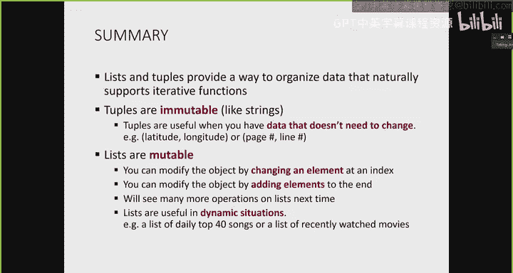

