# 《计算机科学和Python编程｜6.100L Introduction to CS and Programming using Python, 2022》 - P11：-11-Lecture 11_ Aliasing and Cloning.zh_en - GPT中英字幕课程资源 - BV1PAxJzVEs3

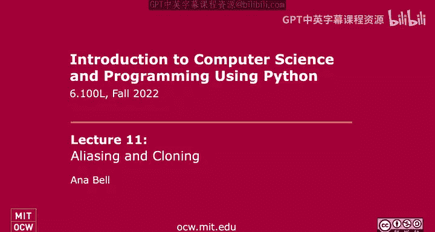

So let's， let's get started with lists and mutability。 So last lecture。

 we talked a lot about what it means to have these mutable data structures lists。Today。

 we're not off the hook。 We will continue talking about the idea of mutability。

 but we're gonna to do it in the context of removing items from lists and some of the pitfalls that come with that。

 And then we'll go into along the way， ideas about cloning or making copies of lists and aliasing。

 making another name for the same object and memory。So first。

 let's quickly talk about making a copy of a list because so far when we we're dealing with these mutable objects。

 we notice that it's sometimes inconvenient to have to mutate the list right and it's hard to keep track of the fact that we're mutating a list and there are some problems for when it does make sense to make a copy of our list so that we can mutate the copy or mutate the original while still having that sort of original those original items in saved somewhere else so you can ask Python to make a copy of a list and basically behind the scenes。

 it creates a new list object for us in memory and copies over every single element from the list you'd like a copy like to copy into the new list。

So the syntax for doing a copy of a list is as follows。

 So we've got a list that's already made called L。 and we want to make a copy of it。

 So the syntax is L square brackets with a colon inside it。

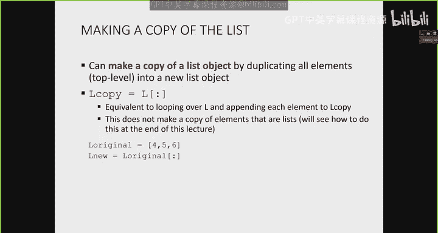

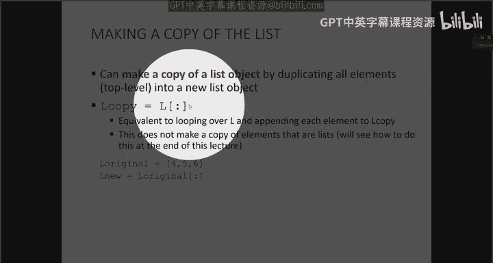

And behind the scenes， Python makes this list inside memory。

 and then we save that new list that has the exact same elements as L into a list named L copypy。

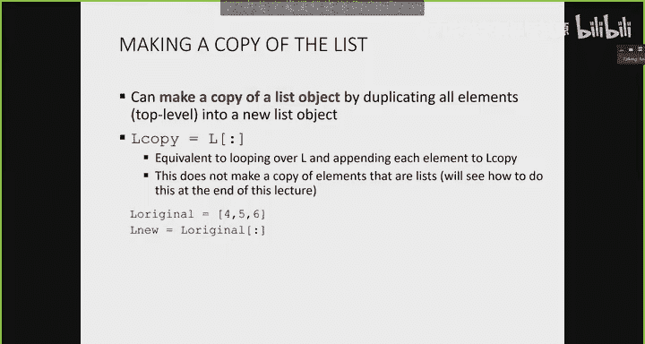

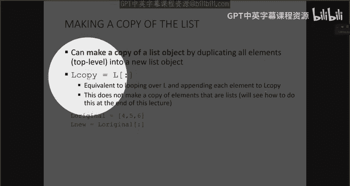

And so in memory， the way this looks。 So if I have this code here where I name my list L original。

 again， I'm choosing a different name than L just to show you that whatever list object I have。

 That's the name I need a reference。

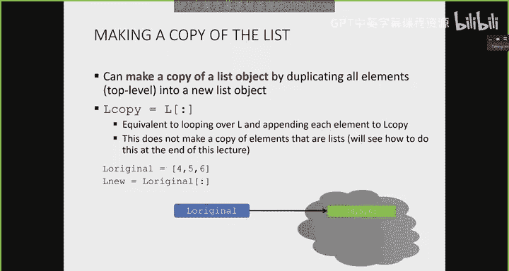

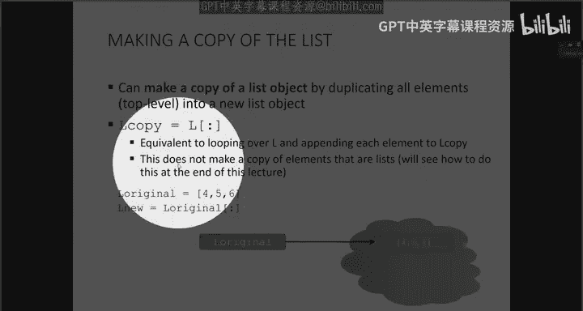

So if I have L original is 4，5，6 in memory， If I want to make a copy of my list。

 I just say L original square brackets with a colon inside it。

 That means copy every single element from beginning to end of this list and bind it to the name L new。

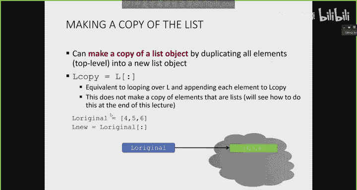

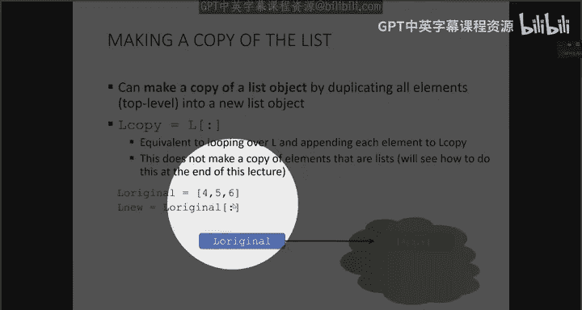

So notice in memory。 now I have two list objects。 They're referenced by different names。

 And so if I change one of them， the other one will not change， right， There'， there's。

 they're now completely separate object。So we're starting this lecture off with a quick little exercise just to kind of get you to remember what we did last time and to practice writing a little bit of code with mutable function with mutable objects。

So I would like you to write this function called Remove All。

This is going to feel very similar to something we did last lecture。 So last lecture。

 I asked you to write a similar function which took in a list L and an element E。

And that function from last lecture created a new list。

And then basically populated that new list with all the elements from it had all the same elements as L。

 except for omitting the ones that were equal to E。Okay。

 this version that I would like you to write for me is not going to create a new list and return this new list。

It will mutate my input L。Such that you're going to only keep the elements from L that do not match E。

😡。

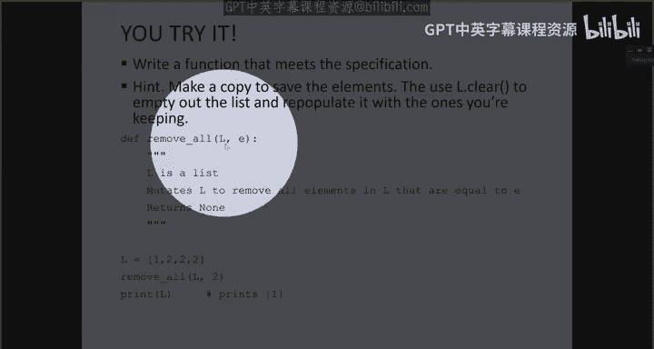

So I'm going to give you a hint for how to do this。

 So the process for this is going to make is going to make use of this thing that we just saw。

 which is I want you to first save the list as is into a copy。And then at the end of last lecture。

 we saw a way for us to mutate a list to empty it out of all the elements。

 So we still have that object in memory， but we're just essentially clearing it out。

 We remove all the elements from it。So first make a copy and save the elements， then clear the list。

 we want to mutate L。And then。Iterate through the copy and add all of the elements that do not equal E back into L。

 So that should be the process。 And in the end， when we call this remove all function。

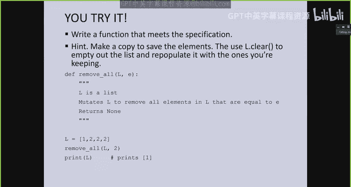

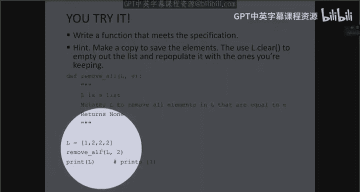

The thing that we're passing in will have been mutated。 We don't have anything to return。 Okay。

 We're just mutating the thing that's being passed。So I'll give you a couple minutes to work on that。

 and you can start writing it on around line 30。O。Does anyone have some code to start with？Yes。Yep。

 initialize a new list， yep。What do you want to call it Elnew？Good name。 L new equals。

 How do we make a copy and what do we copy。So， so what we'd like to do is mutate L， right。

 But L already contains a bunch of items in it。Right。

 so that's why we first want to make a copy of it。 right， So just like in the syntax from the slides。

 this will essentially save for us everything that we already have in L in a new list called L new。

Okay， so now that we have that， does anyone。So L dot clear does not take a parameter in， right？

 It's just a function that empties out L fully。 So basically drop every single element in L。Okay。

 but we will see some function a function that will remove elements。 Okay， so if we do L dot clear。

 then L becomes the empty list， right， L just becomes this。

 So now that I've mutated my object to contain none of my elements in it。

 How do I add back in the elements that satisfy the condition。Yeah， so for N in L new， right。

 So I'm iterating over the list that actually contains stuff。 The thing I've copied。And then。Yeah。

 exactly。 L dotta pen。 So notice I am。I am appending to L。But I'm iterating over L new。

 right L new has all of these elements in it。 I want to touch each element to see what value it has。

 If it's not equal to the one， the one from the parameter E， then I add it to my list。 L。

 the one that's currently empty。Okay， and then do I need to return anything？We don't need to return。

 It won't hurt to return L， but L will already be mutated by virtue of this function。

So we don't need to return any， any L。Right， L is my parameter that I've passed in。

So there's nothing to return。 It's just being mutated。嗯。In the function。

So when I make my function call here， right， I'm passing an L in。

 I'm just making a call to remove all。With this L in object， which is this one here。

And notice there's no， I'm not saving the return from this function to anything， right。

 Who this function will just mutate whatever I passed in。

And then if I just print the value of LN after this function call， it will print the mutated value。

Yes， sorry。 We should depend。N9， thank you。Yep， and that looked weird。Perfect。

And so if I run the other two examples here， I'm removing one。

 so it should just show me a list with all twos， and here I'm removing zero。And 0 doesn't even exist。

 so it doesn't mutate that input list at all。Okay。So。Now。

 we can start talking about other operations on lists， which deal with removing lists。

 making the lists smaller。 So we're actually going to take elements away from the list。

 And this is similar to kind of what the suggestion was instead of kind of to clear out an element。

 a specific element， right， but the clear function removes all the elements。 However。

 these functions will remove certain elements from our lists。

So there's three different ways that are on this slide。

 and I'm going to show you an example with this list L kind of showcasing what each one of these functions do。

 But first， I'll just explain them。So one option for removing an item from a list is if you know the index of the item you want to remove。

 like， you want to remove the very first one in the list or the last one in the list or the halfway point or something like that。

You can tell Python to remove the item from list L at a particular index with this Dell parentheses。

 so this function Dell， and you pass in L at whatever index you want to remove。Now， sometimes you。

 you want to remove the item all the way at the end of the list。 So the farthest most right。

 In that case， there's a operation called pop。And you call pop onlist L。

 So if you just say L dot pop with nothing in the parentheses。

 Python will automatically grab that last value from the list and drop it from the list。Now。

 pop is a little bit interesting because it。It has a return value。We're using this Don notation。

 which we used with append and clear and a bunch of other things from last lecture。 But here。

 this pop， not only does it have the side effect of mutating my list by dropping the last element from it。

 but it also return something。 So this function call here will return for me the value of the element that got dropped。

 Just in case you want to do something with it。And lastly。

 if you know the element you'd like to remove specifically。

 so if you have a list of a bunch of names and you want to remove Anna from that list and you know the string AN A is what you'd like to remove。

 you do that using the function L dot remove， So whatever list your names are part of。

 you say that list dot remove， and then you'd pass it in the string Anna or the number five or whatever actual element you'd like to remove。

Now， if there are many elements that that match that value， right。

 if there's many anna's in my list of names， it will only remove the first one it finds。

 So from index 0， all the other ones will remain， you'll have to call that function again。

So let's look at this example here。 I've got this list of 7。Yes，7 elements within it。

 Let's do a few of these operations all in a row。 So each one of these operations will mutate my list。

 So the operation operation right after it will work on the mutated list。O。

So let's start with this L。 If we say L dot remove 2。

 Python will look for the element whose value is 2。Well， there it is。 It's at the front of my list。

 That's fine。 And Python will remove that element。 So this list will now be one element less shorter。

 right？ And that， too is going to be gone。 So the list L will now be mutated to be 1，3，6，3，7，0。

All right， Well， what if we remove 3 now， right， So we've done the operation to remove 2。

 We've ended up with this mutated list。 Now， what if we remove 3 from this mutated list。

There's two of them in there， right？The element that's going to be removed is the first one it finds。

 So just this one here。And again， this is an operation that mutates my list。 So this。

List here that I've started with would be one element shorter。And that three will have been removed。

 right， So now I've got 1，6，3，7，0。Alright， what if we want to delete an element at a particular index。

 So now again， we're working with the mutated list 1，6，3，7，0。This dell function takes an。

 an index in a specific list and removes the element that is there。So in this case。

 I want to remove the element at index1。 So in this list here， the element at index 1 is the6。

 This is0。 This is one。 so the6 will be removed。And my list will be mutated to just contain these four elements。

1，3，7， and 0。And lastly， if we pop。That function will just remove the element at the end of the list。

The end limit at the end of the list is this 0。 So the list。Through this side effect of pop， right。

 is going to be mutated to contain just the three elements， except for the last one。

So them contain one，3， and seven。And additionally， if I'd like to save the value of the element that got removed from the end of the list。

 the zero。You can， because this function call here， L dot pop。

 you can save the return value into a variable。None of the other ones dell or remove。Have any return。

 Right， So if you saved a variable from that function， the function called to a variable。

 that variable will be none。Pop is special because it actually grabs that variable value and returns it。

So all of these operations mutate the list， right。So that means as we did operation after operation。

 we were working with a mutated list。O。Yes， there was a question。I'm sorry， Sagan。L at index 1。 Yeah。

 so the L at index1 here works on the list we had just mutated。 So this one。

 the element at index 1 is the6。Oh， yeah。Nse。Okay， so let's look at the code we just wrote in the you tried it exercise and try to rewrite it using this remove operation。

Well， the way we can think of it is we'd like to remove the element that is E， right。

 So we know the value of the element we'd like to remove。 It's， you know。

3 or 5 or one or two or whatever。 So that's E。And we know of an operation that can remove the element from the list。

 It's called remove。 unsurprisingly。 So what we can do is we can say L dot remove E。Right。

 and that would remove the first instance of the element in the list。

 But I might have many of these elements in my list。

 so we can just write a little while loop around this operation。 and we say。

 while we still have this value in our list。Remove it。

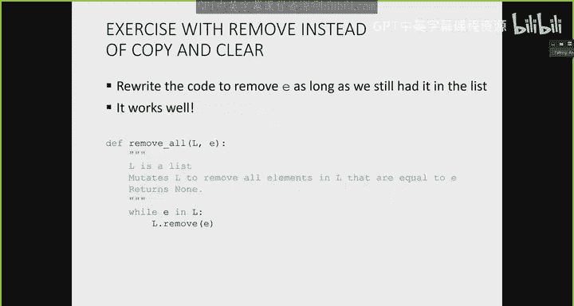

Right， so that's what this Y loop is doing。 E and L is going to be either true or false。 whether。

 you know， the number， you know，5 or whatever is in my list。

 And as long as I still have a5 in my list， call L dot remove on 5 or whatever。

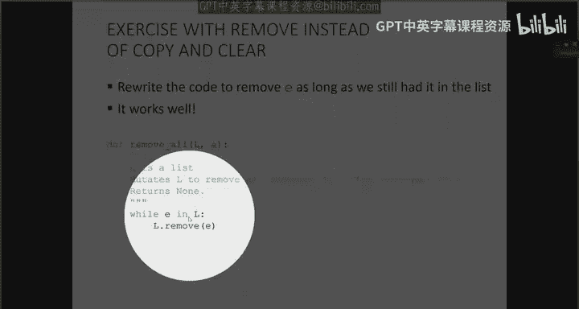

So a nice little two liner here to solve the same problem。Now。

 what if we rewrote that code in a slightly different way， again， using remove。

 But let's say maybe we didn't realize we could use a while loop。 And instead。

 we used a four loop to iterate over each element in L。 And if that element is equal to E， remove it。

 seemsm reasonable。So what would happen， And I can run it for you guys。

 So if we run it with this code here， this is the one from the slides。

Just to show you that I'm not making it up。 So if this is the code that we wrote。

 I tried to remove the two from the list。 And when I printed the result。

 it actually printed one comma 2。 So I have two elements left in my list。

 It looks like it didn't correctly remove。A two。And。At first， it's surprising why this is right。

 because the code seems to it looks right。 It seems to work just fine。

But let's step through sort of this memory diagram and see exactly what happens step by step。

 So with each iteration of our for loop。So originally， I've got L containing 1，2，2，2， right， so far。

 so good。 That's just us doing this line here。

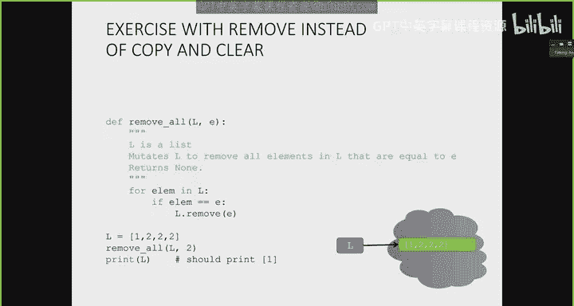

And then I make a function call to remove all。 So I want to remove the number  two from my list。

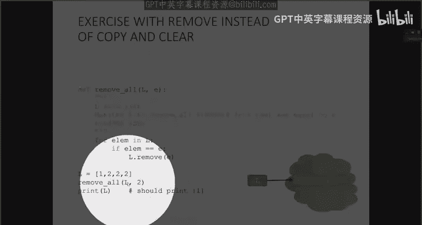

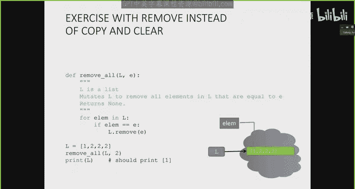

I've got a four loop。Where my loop variable is called LM。

 and it will iterate through each element in my sequence。

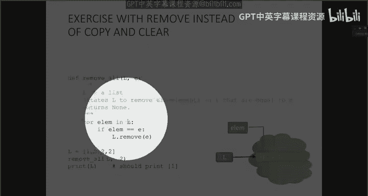

Right， where my sequence is the list is all the elements in L。

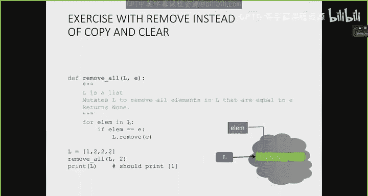

So first， it'll be one， right， then it'll be the next value a sequence 2 and then 2 and then 2。

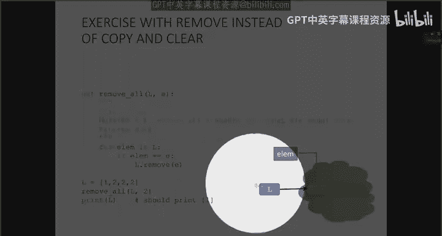

Allright， so here I've just got LM initialized to the first value in the sequence。

 If L M equal equal E， well the one does not equal the two。 so then we do not remove anything。

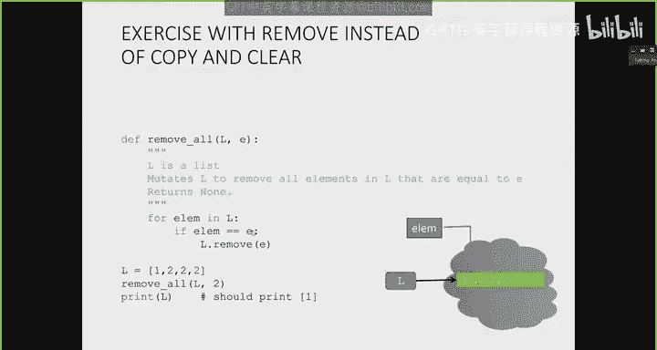

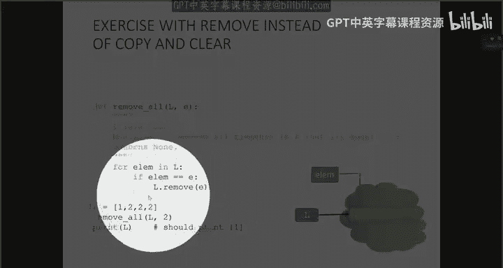

Next， the for loop goes on to the next value in my sequence， the two。So now， LM is2。

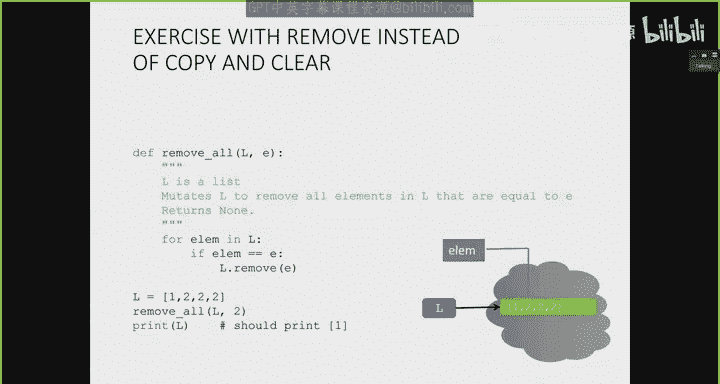

And if L M equal equal2， it does equal  to， what am I going to do？ Well， I need to do L dot remove E。

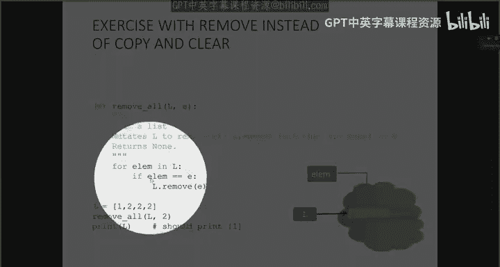

So this is where。Bad things happen。 I'm going to remove an element from my list， right。

 So I still have those three twos in there。 But as soon as I drop one of the twos。

 all the elements beyond that two shift over。But Python doesn't know that it should also shift over the pointer。

Right，It's still pointing to that。Element that it's currently at。

 It's not going to shift itself backward just because you removed an element。

And so Python just finished removing the element， and now it says I finished this loop through。

 so I need to go back up here and make element be the next value in my sequence。

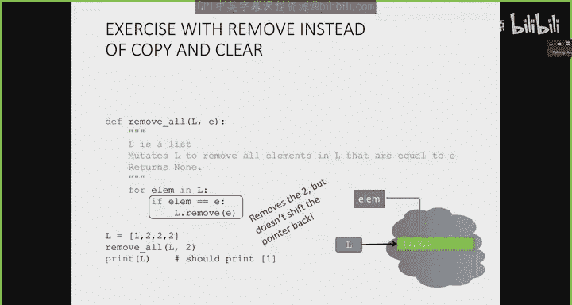

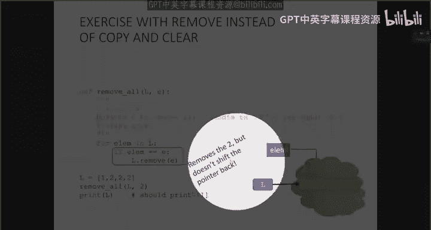

The next two。So I've essentially skipped over one thing that I needed to remove。

 because when I removed the item， everything else shifted over as well。

 but my pointer didn't decrement。o k 。So this is a big problem。 I mean， we can finish off here。

 but we've already seen， you know， we've already seen the problem。 The last time through the loop。

 Python sees， well， is this too equal to the thing I want to remove。 It is。 So it removes it。

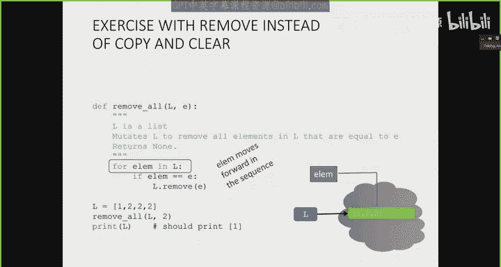

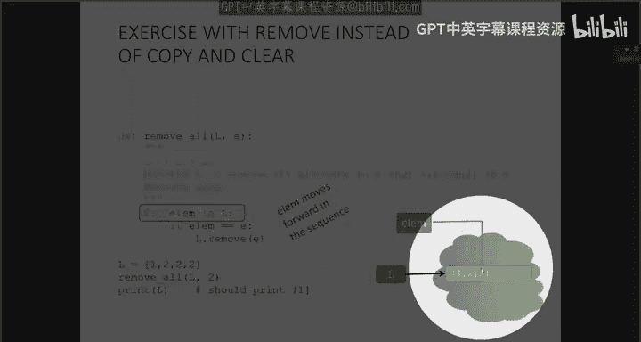

And this is the end。 It has no more values left to go through in the sequence because it's already。

 its pointer already out of the bound。Is everyone okay with that issue。

Okay so the problem here with remove is that we're iterating over a list as we're mutating it right And so removing these items can cause unpredictable behavior。

 something like this could still happen， if we were adding items except that we're usually adding items to the end of the list right with a pen。

 if we were adding items somewhere in the middle or somewhere around where our pointer supposed to be。

 I think we could theoretically run into the same issue when we're adding items where we might skip elements or we might see an element twice。

 It's just more apparent when we're removing items。

So this is the big thing that we're going to talk about in this lecture。

 So I'm going go through another example。 This is tricky example number 4。

 where we're going to do a very similar thing， but we're gonna have a loop iterating over L's elements directly just like we we did。

 but doing a different task， just so we're not doing that same removal all task。

So let's look at a slightly different problem。 This will be in the context of a function called remove duplicates。

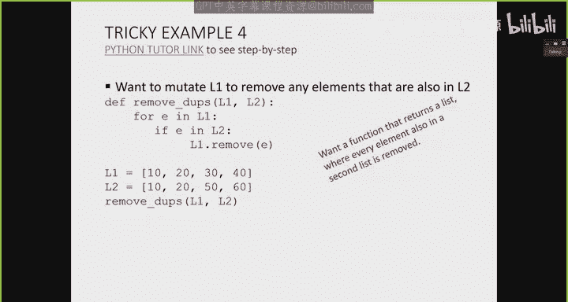

This function will take in two lists， so as an example here， I've got a list with 10， 20。

30 and 40 in it and I've got another list of 10，20，50 and 60 in it。

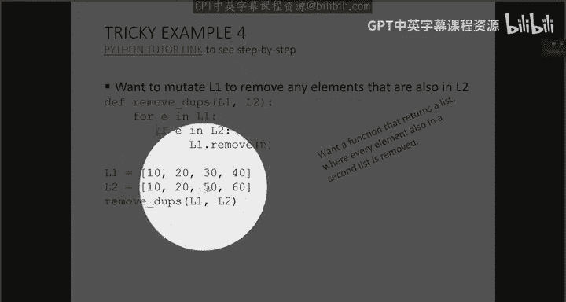

The purpose of this function is to mutate L1。

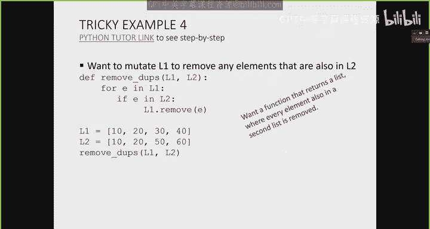

And the way I want to mutate L 1 is such that if if， if an element in L 1 is also an L2。

 I want to remove it。So the 10 and the 20 notice are common to L1 and L2。

 So I would like to remove the 10 and the 20 from L1。

The 30 and the 40 stay because there's no 30 or 40 in L2。

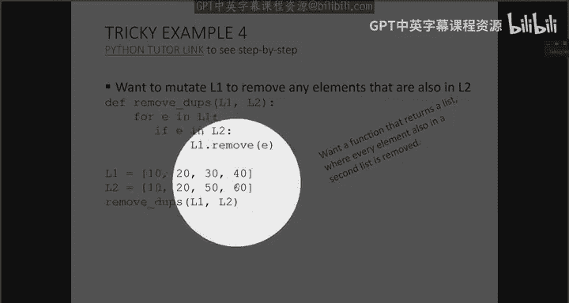

So that's our task。

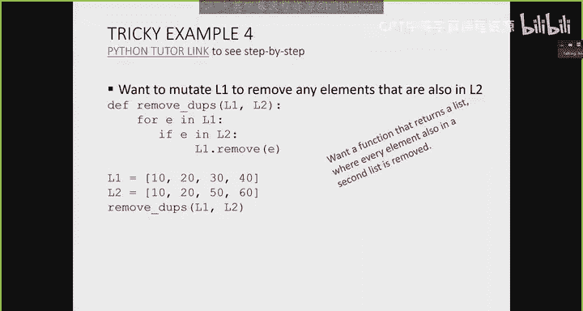

And this is the code that supposedly does this。 So I've got a loop that goes through each element and L1。

 So 10 then 20 then 30 then 40。And I ask if that element is in L2。 So you know， here they are。

 There's two of them here， then remove it from L1。

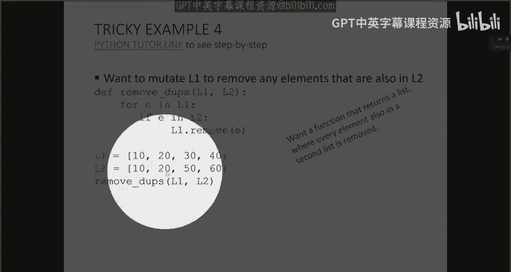

Very similar thing to what we just did。This code doesn't work because if we actually run it。

 in the end， Python will mutate L1 to contain the 20 and the 30 and the 40。

 whereas we only want it to keep the 30 and the 40。Because the 20 also appeared in L2。

 So why in the world did we keep it？Well， we kept it because of the same issue that we just saw。

 we're mutating a list as we're iterating over it， and we're doing a removal。

 so we're again skipping over an element。So let's just step through this one just to show you again what can happen。

 So here I've got 10，20，30，40 for L 1。And 10，20，50，60 for L 2。In my loop， my variable is E。 So first。

 it'll be 10。

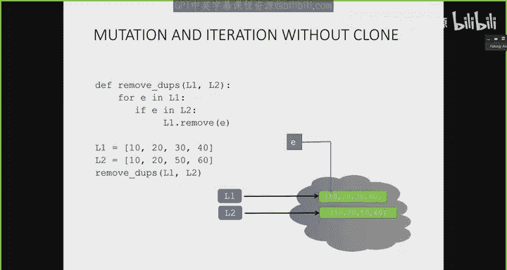

And we ask。If 10 is in L2， that's true， remove it from L1。 so you can see what's going to happen。

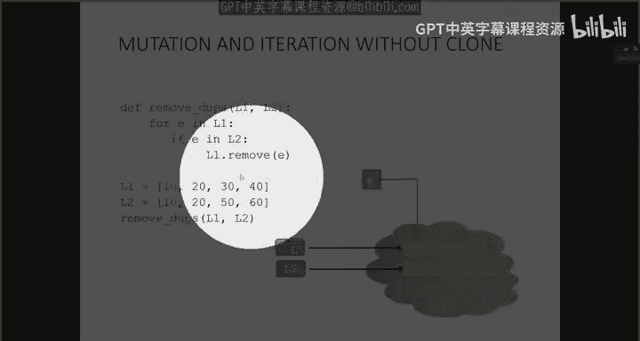

My 10 is removed。 Everything else shifts over by one， but my loop index is stays， stays fixed。

Next， Python says I'm going to increment my variable E to go to the next like next item in my sequence。

 So E becomes the 30。

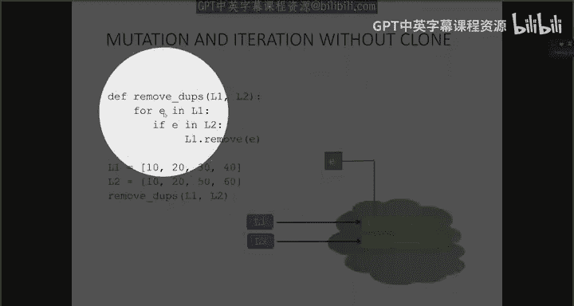

And already， I've skipped over one element that I was interested in removing。

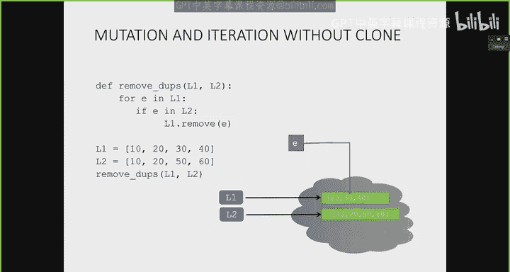

So here， when we're pointing to the 30， Python says， well， the 30 is not an L2。

 so we don't do anything， and then it points to the 40， the 40 is not an L2， so we don't do anything。

 and then the code is done。

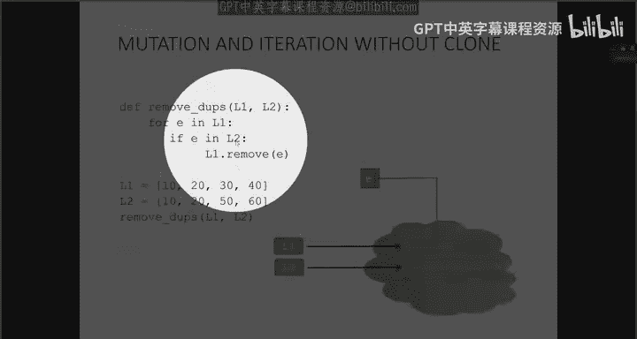

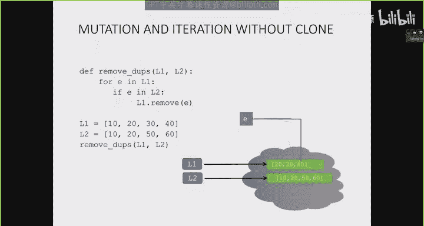

And we've erroneously finished with mutating L1 to just be the 20，30 and the 40。

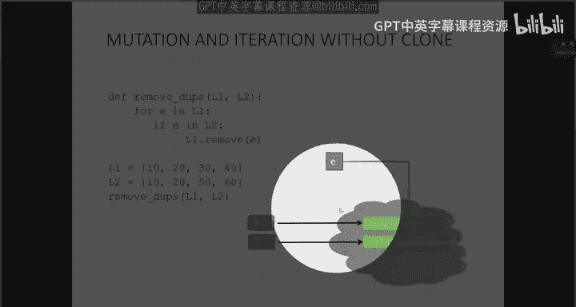

Okay。So let's try to rewrite the code to actually work。By using copies。

So we certainly could use the same trick。 We did previous。

 We had the the first you tried exercise where we could make a copy， clear L1。

 and then add the elements back。 We could do that。 But we can also do a slightly different version of that where。

 again， we make a copy。 So here I've got L1 copy equals L1 square bracket colon。

And then the key thing here is we're iterating over the copy， right？So if we iterate over the copy。

 we're not going to mutate the copy， but we will mutate L 1。

 So for the for loop variable goes over the copy， but the removal is done from L1。

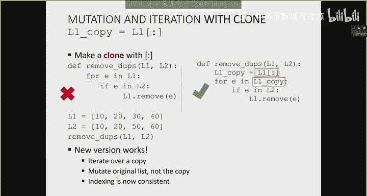

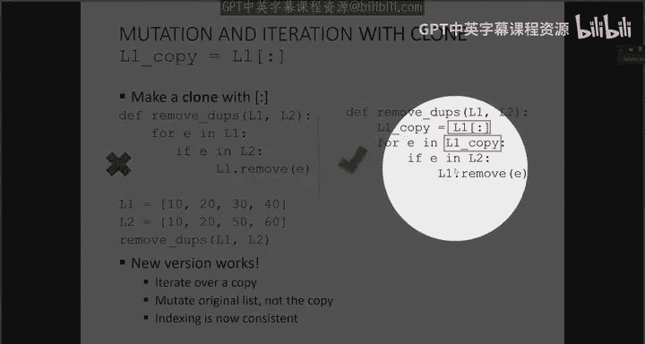

So to visualize that， this is what happens。 So I've got L1 and L2 as before。

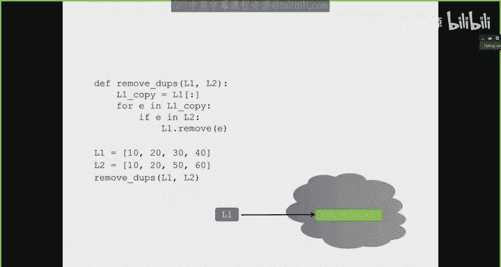

So when I make my function call here， I have L1 copy equals L1 square back in colon。

 So this makes for me a new variable inside memory， which is an exact duplicate copy or clone of L1。

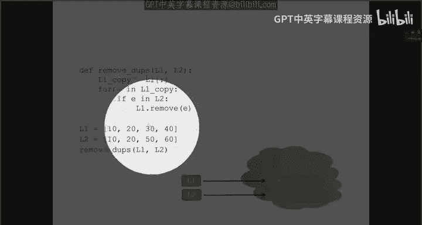

So every one of my elements is now saved， so I can do whatever I'd like to L1 and know that I can still have a way to iterate and look at each variable from the original L1。

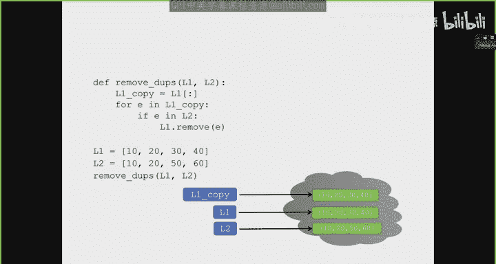

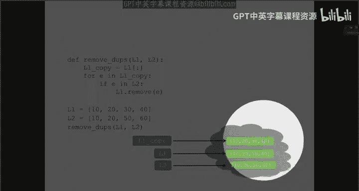

So now my loop variable E goes over elements in L 1 copy。So first。

 we look at the 10 and I say if the 10 is in L 2， it is remove it from L1。

 So notice I have just mutated L 1， not the copy to be one element less。

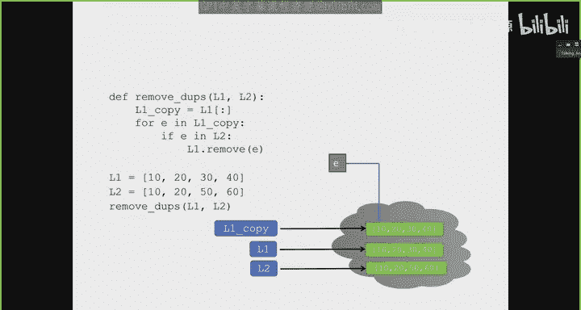

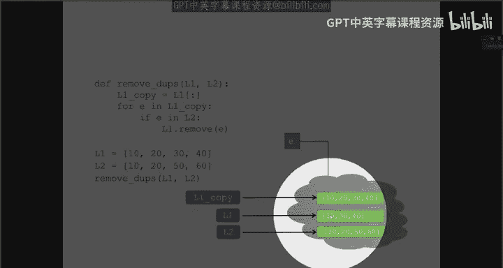

Then the loop variable E goes to the next value in my sequence。

 So I'm not skipping anything here because I didn't mutate L1 copy。

 So now we look at the 20 correctly this time， right。So now we ask， is the 20 in L2， it is。

 so we remove it from L1？And then the 30 and the 40， we do nothing。Questions about this。 Is this O。

 Is this too fast， iss this too slow。O。So that's using copies or A K clones to help you keep。

Track of values in an original list without overriding them or without removing them accidentally。

Now I want to talk about aliases， because this is a very important topic when we have these mutable data structures。

So let's do a quick overview of what an alias is。 So we think about city， for example， Boston。

An alias for Boston is basically any other name that refers to the same city， right， the same object。

 So Boston， also known as the hub or beantown or Athens of America。

All of these names refer to the same inherent city， right？

 So if I say Boston is small and tech savvy， then those two attributes or properties refer to this object itself。

 right， the city， So the hub is small and tech savvy or being town as small and tech savvy， right。

 It doesn't matter what I refer what name I refer to this object as it's the same set of properties still apply to it。

And so if I add an attribute or if I take away an attribute through one of these aliases through one of these names。

 Well， if it's suddenly snowing in Boston， then， yes。

 it's snowing in the hub or it's snowing in beantown， right。

 because these are just names for the same object。And so， that idea。

Is also something that comes up when we deal with these mutable objects。

If you don't explicitly tell Python， you'd like to make a copy of a list and you just use the equal sign between a mutable object。

And another name for this mutable object。Then Python only creates an alias for that object。Okay。

 so notice， we had to say explicitly， I want to make a copy with the square brackets colon。

If we write code that looks like this。 So here， the only difference I've done。

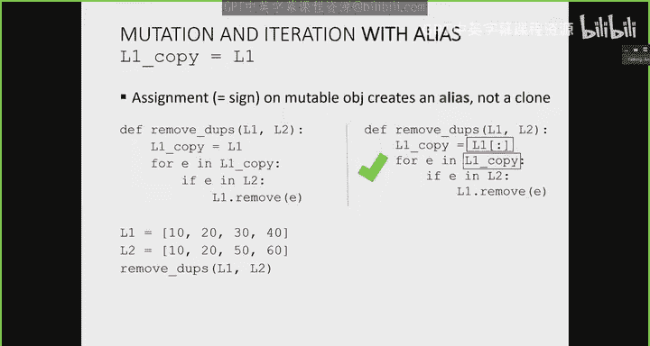

So the code on the right is the one that worked。 The code on the left is me not making a copy of my L 1。

 I'm only using the equal sign directly。

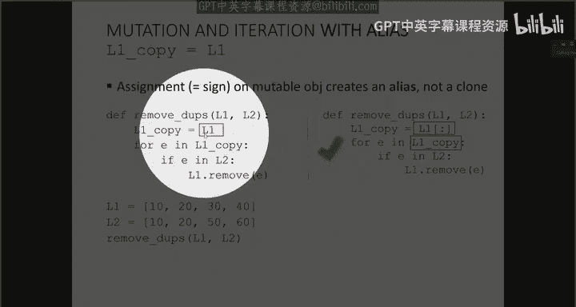

And in Python using this assignment operator， the equal sign tells it means that。You are。

 you are making an alias for that same object in memory。

So it's just another name to refer to that same object。If you mutate that object through L1。

 L1 copy will also have been mutated because it's this。

 it's pointing of the same object and vice versa。

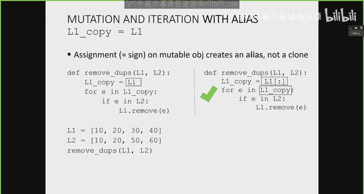

So really， this particular code on the left here is not any better than saying4 E in L1。

 because L1 copy is pointing to the exact same object in memory。

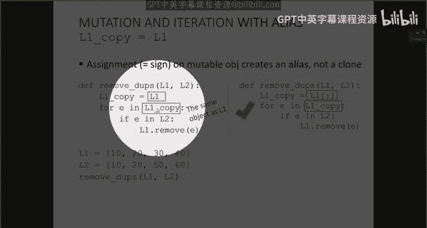

So let me show you exactly what this means in the little cloud diagram that we've been doing。

So this is the， this is the code that creates an alias， not a copy。 So I've got L1 equals 10，20，30。

40。 L2 is 1020，50，60， just like before。

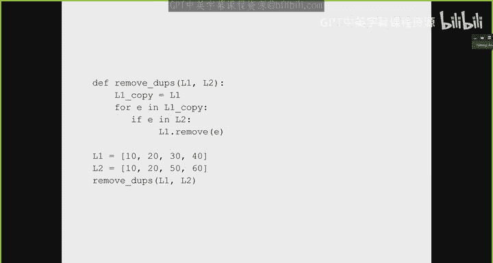

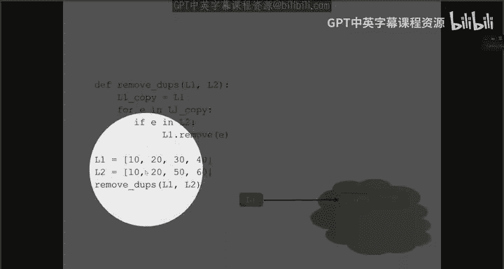

The code up here。 So L1 copy equals L1。 I just named a copy， but it's not actually making a copy。

 right， because I nowhere did I say explicitly to make a copy using the square brackets colon。

So the alias in memory means that it's just another name pointing to that exact same object。

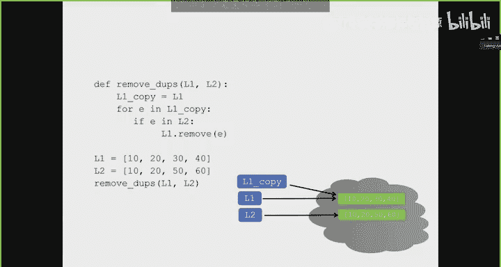

Okay， so then。The for loop for E and L1 copy is iterating through this object here。

 which is being pointed to by L1 copy and L1。

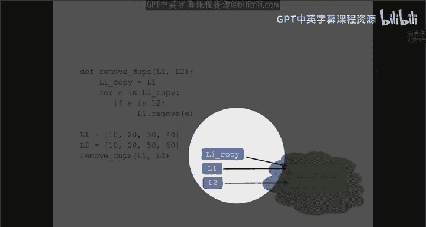

So if I'm iterating through and removing elements， as I'm doing so。

 this is just the original buggy code that we had that iterated through L1， right。

 So I'm removing the 10。Incrementing the element， the E variable to the next element。

 and then not doing anything with the 30 and not doing anything with the 4。Does that make sense。

 aliases， I that all right。Okay。So the big idea that will kind of tie a couple things together。

Is related to functions， formal parameters and actual parameters。

So when we make a function definition， right， the things inside the the parameters inside the function definition are called formal parameters。

 right， We're just writing the function， assuming that these will eventually get some actual values associated with them。

When we make a function call， that's when we pass actual values。

And when we have mutable objects being passed into a function。

The formal parameter actually becomes an alias for the for the actual parameter in the function call。

So here's our function， once again。The difference between what we've been seeing so far。

 This is the code that we had just seen。

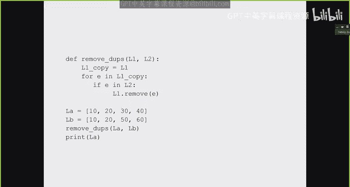

The difference that I've done in this particular code is not named this L 1 and L2。

 like it was named up here， right， it doesn't have to be named L1 and L2。 I named it L A and L B。

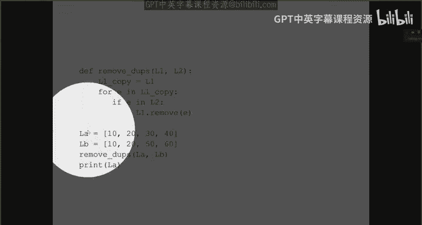

And this will sort of bring the point home。

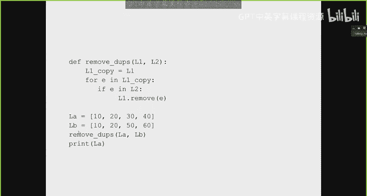

So when I make my function called to remove duplicates with L， A and L B。

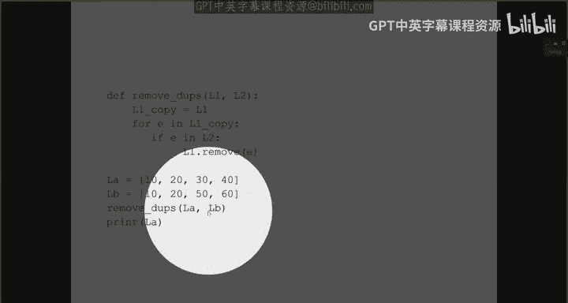

Python takes this object and this object and passes them in as parameters。So in my memory diagram。

 I've got L A is 10，20，30，40 and L B 1020，50，60。 right， That's what I have down here。

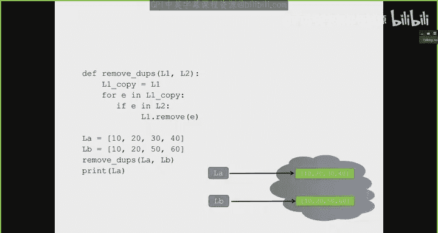

As soon as I make my function call， remember， Python maps out formal parameters to actual parameters。

 but when we're dealing with these mutable objects， L1 and L2 are aliases。

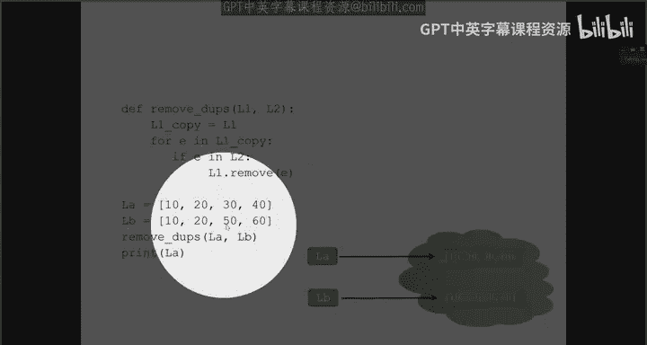

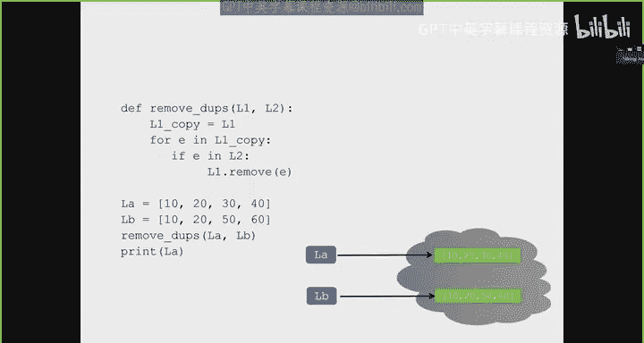

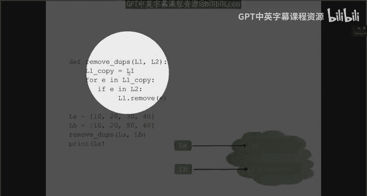

For the things being passed in。So L1 will point to you tell me。

Yes， exactly。 So here I've got the same name for the same object。

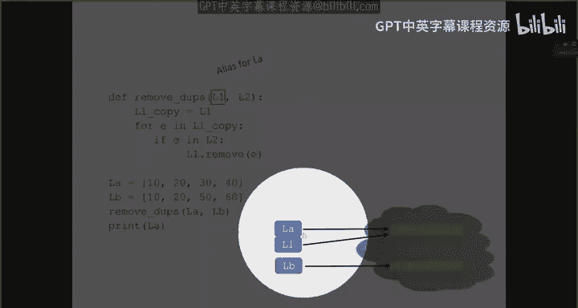

And L 2 will point to L B， right， Two different names pointing to the same object。

And that's why when I'm iterating through and doing whatever I am doing to these these formal parameters here。

 Python actually mutates the objects that were passed in。

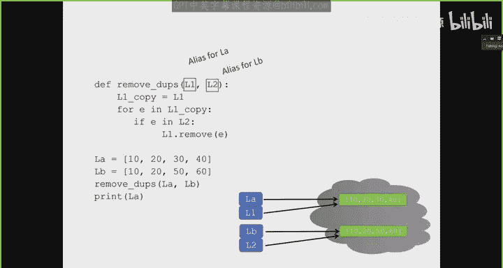

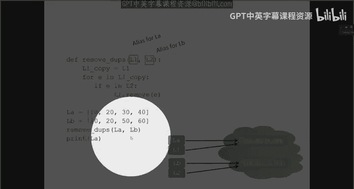

Yes。😊，L A and L1 will have the same I Ds。 Yeah， yeah。Yeah。

 using that I D function we we did last time。I invite you to try it too。

 but I think they should because they're modifying the same object。Everyone， okay， so far。

2 two names， aliases for that same object。 And so that's why when we're mutating L1 here。

 this L A and L B that we passed in will be mutated， right？ So here's my L1 copy as well。

 So I've got three names for this particular object。

And then we do the thing where we mutate the thing， right， And then at the end of the function。

 when it's done。

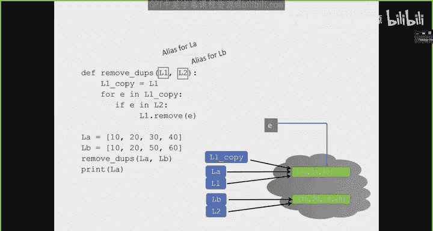

This entire thing has no return。 It returns none。

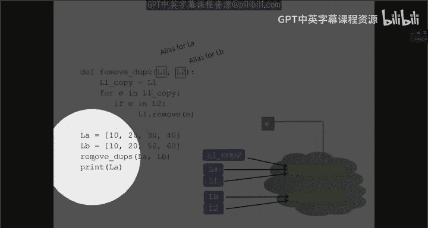

But when we print L A。

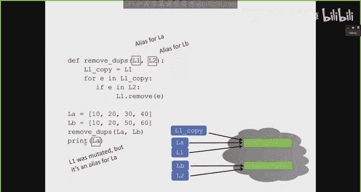

The thing we're printing is this object here。 It's like it's whatever L A points to。

 And it's this thing that was mutated through L1。

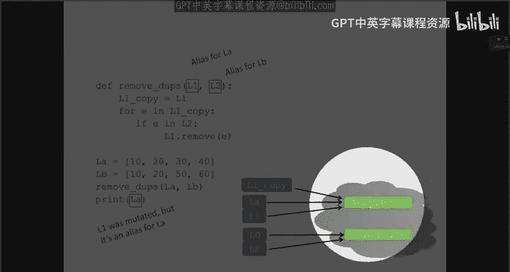

Yes， no， thumbs up， thumbs down This a good。 This is very cool， you guys。😊，Okay。

 this was a nice loose end to tie up。Okay， so the last。10 minutes。

I want to talk about what happens when we have lists that contain lists themselves， right。

 So you so far， the examples we've been working with are lists that just contain， you know。

 strings or integers or things that are immutable。But what exactly happens behind the scenes when we have elements that are mutable themselves。

So we're going to do an example。 We're going to go through and a lot in all of these slides。

 working through an example where we start out with this old list that looks something like this。

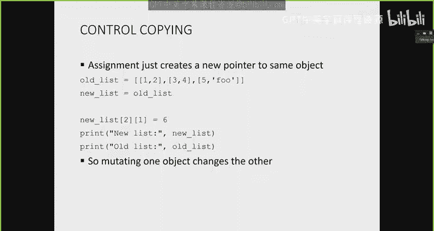

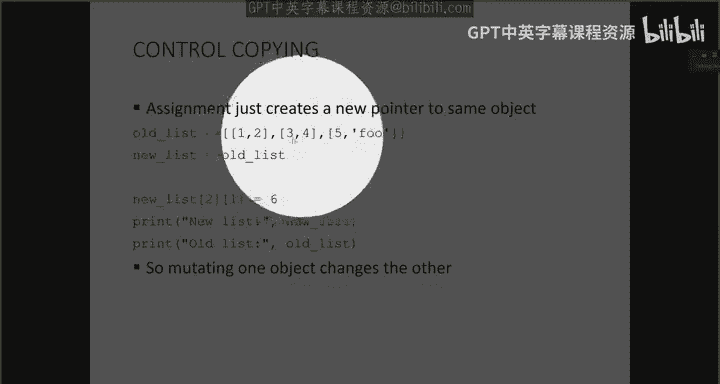

So we have a list that contains three elements。 right， The first one is another list。

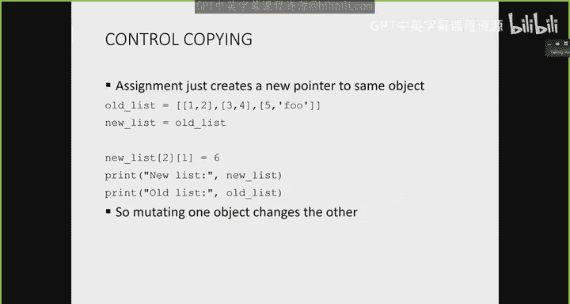

The second is another list， and the third is another list。

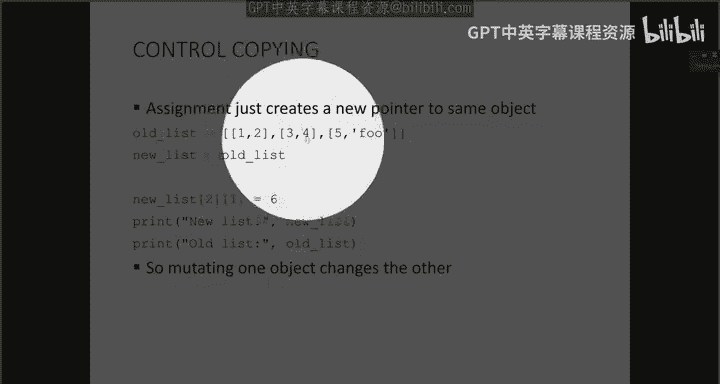

I don't care what elements those lists have for now。 All I know is at the top level。

 old list contains three things。Okay， so let's do aliasing。

 and then we'll do a shallow copy of this list， and then we'll do a deep copy of this list and show you what happens。

So in this example， what we're going to do is just the straight up alias of old list。

 so we're going to make old list and new list be aliases for the exact same object， this thing here。

 So I do that with just the plain old assignment operator。

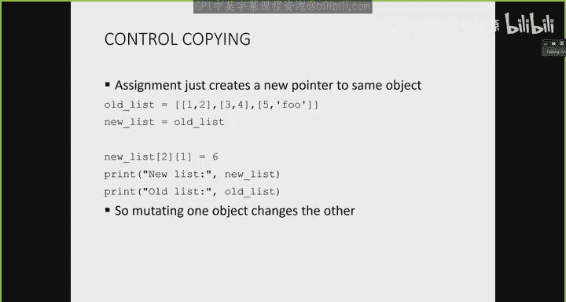

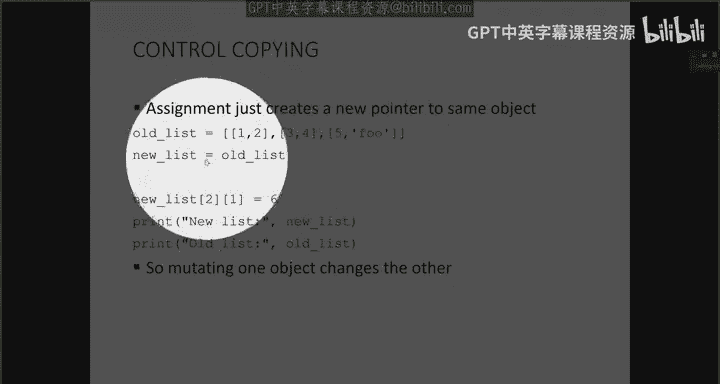

So inside memory， the way we're going to represent this old list is here is my list with three elements in it。

 And because each element is itself a list， so a mutable object， I'm not going plop it in here。

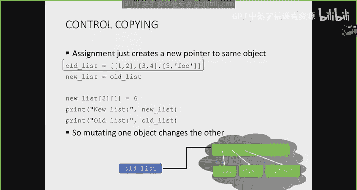

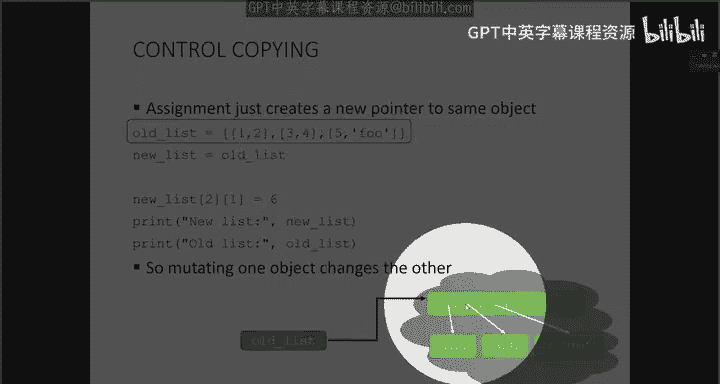

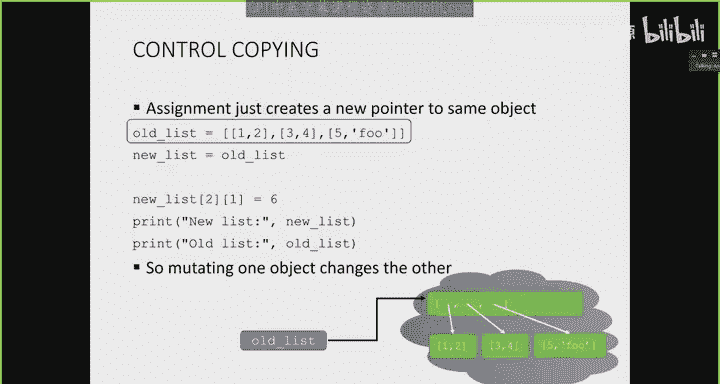

But instead， Python generally tends to make a pointer to that mutable object somewhere else in memory。

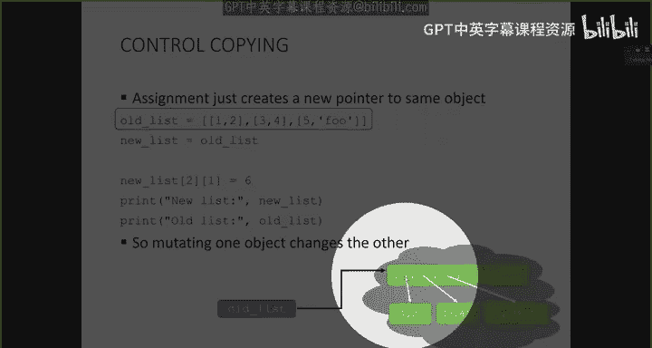

And you'll see why in a couple slides。But for now， I mean， it will。

 it will look cluttered if I did so。 But for now， it helps to visualize the structure。

 So old list contains three elements， and each one of those elements are kind of pointed to over here。

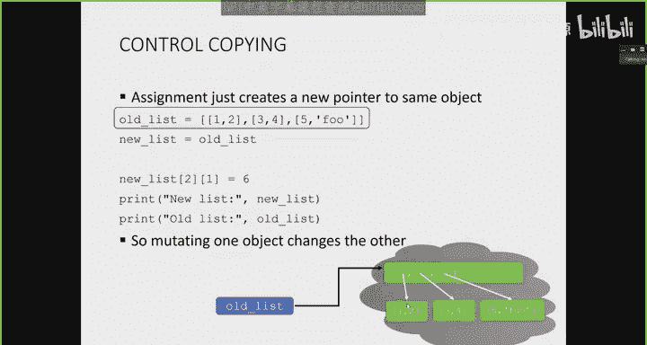

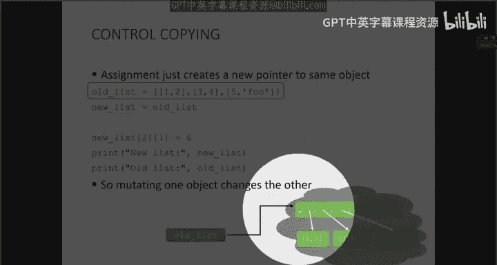

So if I say new list equals old list， Python will make another name for the same thing in memory。

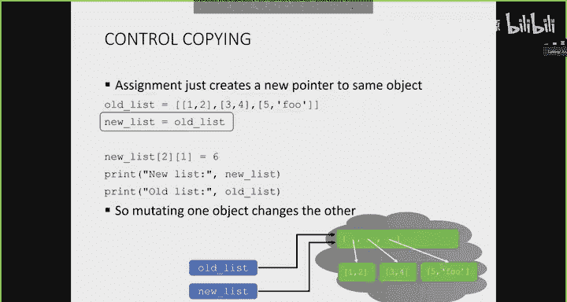

When I do this line here， where I index new list at index 2。 So that's 0，1，2。

 And then I follow it to index1 over here， right？ So this guy here， the6。

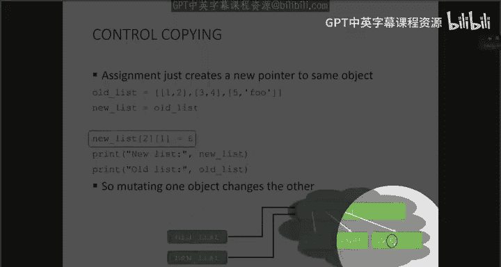

I have changed the string F to B 6。 And now new list and old list both are pointing to the same object。

 So it will have been mutated to contain that6 in that sub list。Okay， so that's aliasing。Now。

 what we can do is we can create copies of mutable objects。

 and we can create either something called a shallow copy or a deep copy。

The shallow copy is equivalent to what we've been doing with the square brackets colon。

And that's perfectly okay if we're dealing with lists that just contain immutable things。

But as soon as we create a shallow copy of a list that can contain other lists or other mutable things。

Interesting things happen。 Only the top level gets copied。

But anything that's mutable at a deeper level than that top level。Does not get copied。

Because if it did， and you had many， many levels deep of all these mutable things。

 that would be a lot of things for Python to copy。So what we're doing with this particular code is we're going to create this old list here。

 so it's one， two， as first element， three， four as a second element， and five。

 six as the last element。

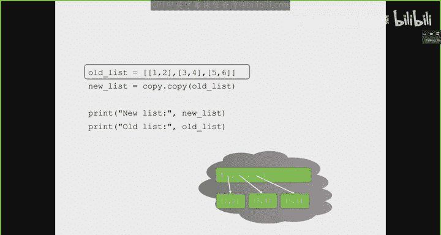

We're going to create something called a shallow copy。

 And we could have also said old list square brackets colon。 It would be equivalent。

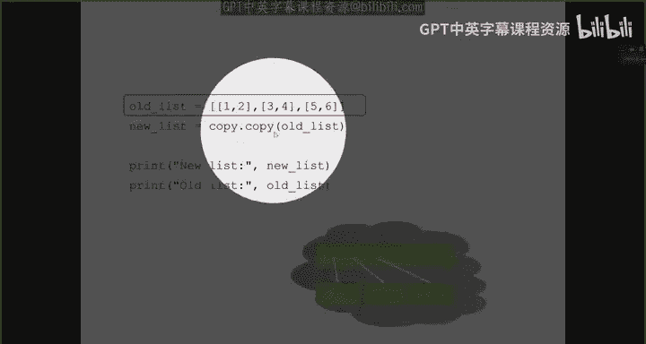

And in this shallow copy， Python only creates a copy of the top level。

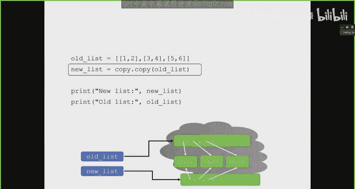

So notice new list is pointing to a list with three elements in it。

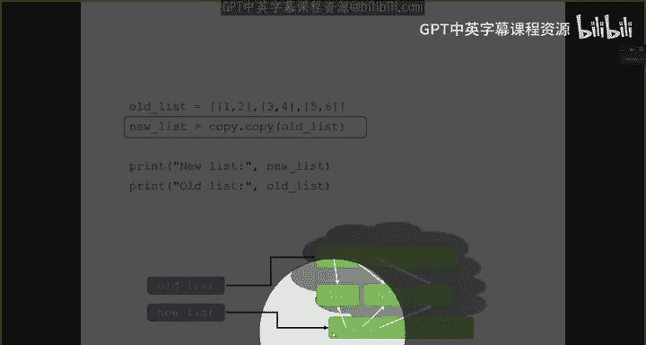

But anything that's at a deeper level than that top level does not get copied。

So all these mutable things that are my elements， this list and this list and this list。

 These are three mutable elements。

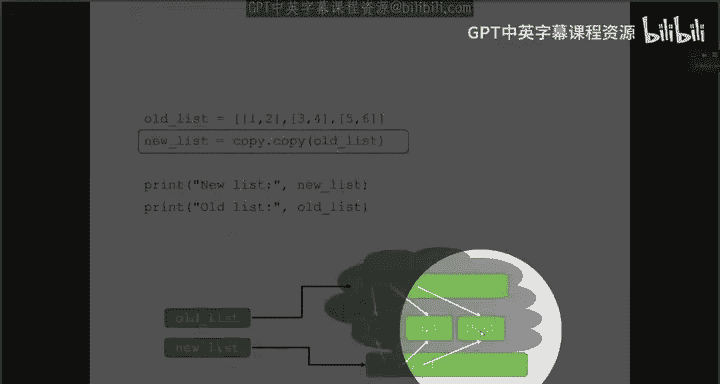

They do not get their own copies because we've， we've only made a shallow copy。So。

What this means is at the top level， sorry， So this is just what it prints out。So at the top level。

 we can add elements to old list and it won't interfere with the top level of new list。

 So as an example here， we're going to add this 7，8 list to old list。

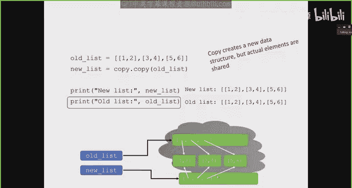

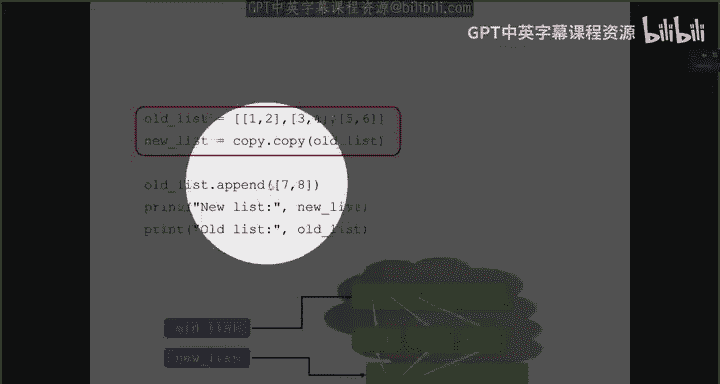

So we follow old list。And we add another element to the end of it。So there it is。

But that element didn't get added to new list。Right。

 because we only added it to the top level of old bs。

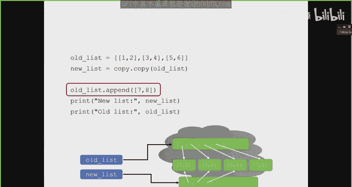

So now question is， what happens if we go in and mutate one of these three shared items？

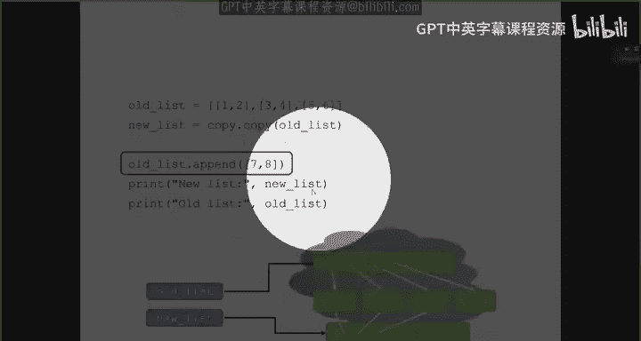

Od list and new list is as we would expect。So let's do one more operation。

 So instead of appending or in addition to appending the7 and the eight， like we do over here。

 let's also mutate one of those shared items。

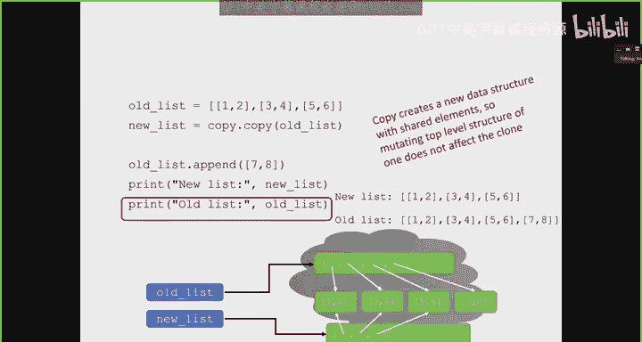

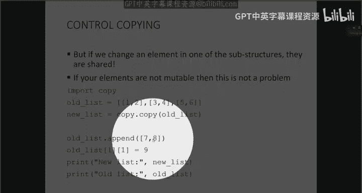

So here it is。 This is what we just did on the previous slide。 There's my 7 and 8。

 And now let's go into old list at index 1。 So 0，1。

 that's this middle one here and add index 1 in that。 So that's 0，1， the 4 over here。

 Let's change the4 to the9。

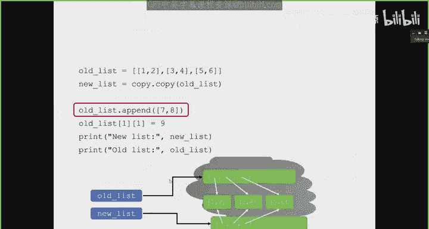

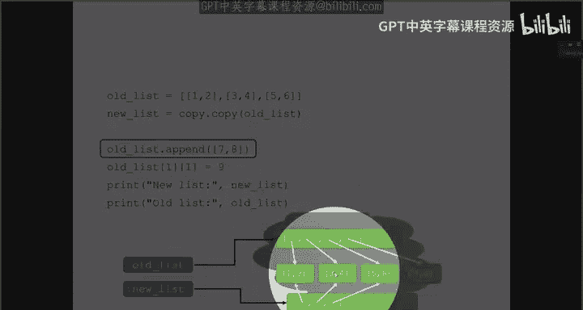

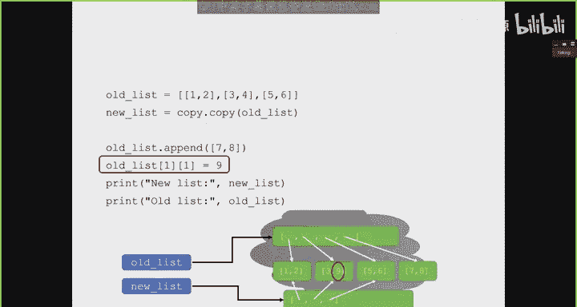

Okay， well， when we print new list。We're going to be printing a list with three things in it。

 The first one is the list 1，2。 The second one is 3，9。

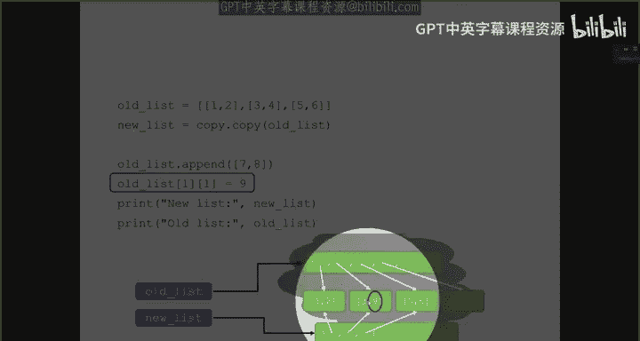

We just mutated that。 And the last one is 5，6。And when we print old list。

 this one will also have that nine over there。

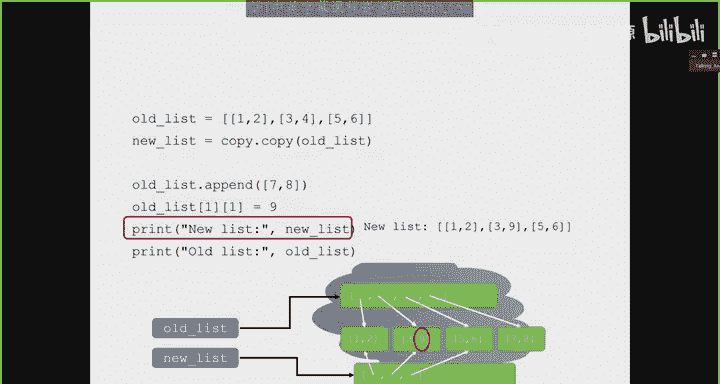

Because those middle elements are shared， but we will also have an extra element at the top level。

 the seven comma 8 that we just added only to old list。

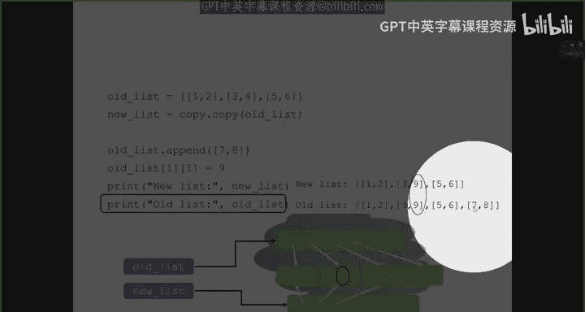

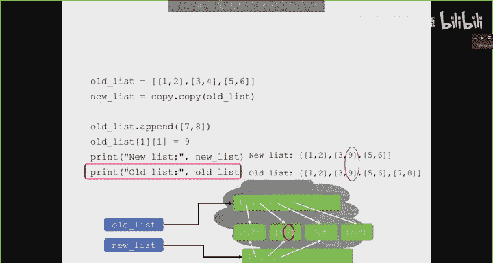

Okay， thoughts on this example。 What is confusing。Yeah。Yeah。

 why does the 9 get added or get changed through to the new list？ Yeah， so the operation。Called copy。

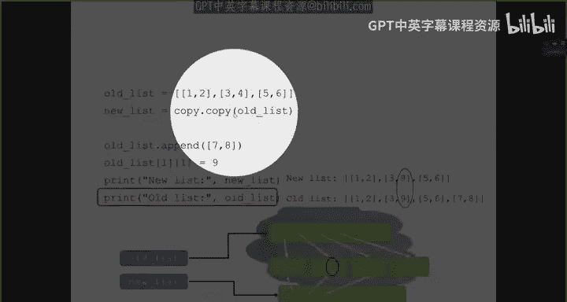

From this library， which is also named copypy， only creates a shallow copy of the list。

 So a shallow copy means that if you have a list with some elements within it， right。

 So here in this case， you know， we have those three elements in it。

All you're doing is copying the top structure。Right， so this structure here。

But if you have any elements that are themselves mutable， they don't get their own copies。

 so really inside the memory， if this one is pointing to some object like it does to that list1 comma 2。

The copy is also going to point to that same。Sub objectject， substructure。

And so if you're mutating this substructure through one name。

If you're accessing it through the other name， that other name is still accessing the thing that was mutated。

Does that make sense， Is that okay， yeah。And so this shallow copy is just copying the top structure here。

 So you can see at the top level we have these two different lists。 So that means to this one。

 I can add another item to the end of it， right， and that item will not be duplicated up here because this is one thing。

 This is another thing。 But the middle ones or any levels that are beyond that top level are shared。

 They're not copies。Yes， yes， exactly。 great question。 So if you edit it。

 if we edited this number one here through the new list， then yeah。

 the old list will still see the edits because they're both pointing to this to these。

 these shared things。 But if I edit the 7 and 8， it will only be edited。Through old list。

Because that 78 is only seen by old list。That's basically what I've。And so if you really， really。

 really want to copy every single mutable object or every single object at all the different levels。

 we would have to create something called a deep copy。 So we do this using copy do deep copy。

OkayAnd so this is exact same example， except that we've just changed copy copy to copy dodeepco。

 And so here we've got our old list exactly as we had before。 and if we deep copy old list。

 Python will make copies of every single object at every single level in you know from old list so everything becomes its own object。

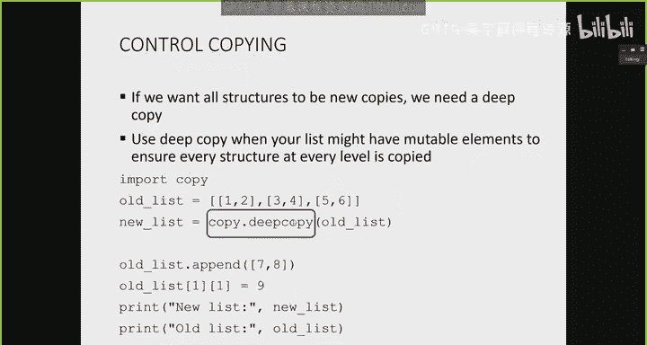

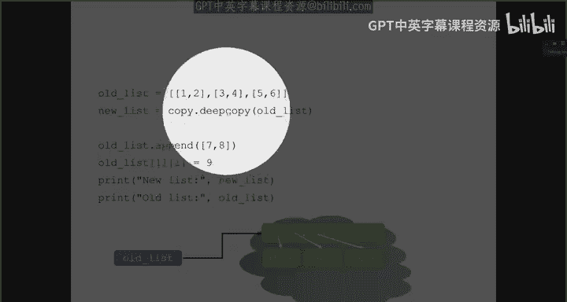

So now if I mutate old list to a pen 7 and 8， that only gets added to old list。

 and if I mutate old list to have this element be a 9， that only gets mutated through old list。

 So old list contains the changed values， but new list remains untouched because I've made copies at every level。

 yes。かい？Yes， but then it goes further down at every single level。 So the。

 the regular copy dot copy does the square bracket colon。

And the deep copy goes further to all the other levels。Okay。

 so lots of ideas in this lecture and last， I would highly suggest going through the Python tutor and all these examples just to so you see them in a kind of different way to see exactly how itll be the same sort of memory diagram but we've done except that you know through the Python tutor so it will be very helpful for you I think I would give that a try as you're setting for the quiz。

 I think what's important to realize is that we have objects in memory and we have names that point to these objects。

 and so if you kind of get that and keep that straight in your in your mind， it will be very。

 very helpful to understanding what's an alias， what's a clone when you're iterating over certain objects and things like that。

 And the big idea here is just side effects。 every one of these operations has some sort of side effect and it's important to make sure that you're not changing something you don't want to be changing。

O。I guess I just had one last thing to say about lists of tus。 I guess we've seen both of them。

 when do you want to use tus and not lists， when you want something that shouldn't be changed。

 So if you have something that might accidentally get changed， do not save it as a list。If you， okay。

 and then on the other side， why would you use a list， but not a tuple， You would use a list because。

You don't want to be creating copies all the time。 So when you have， again， these large databases。

 every time you want to make a change to it， you don't want to make a copy of everything with that small change in it。

 And so mutating an object is， is good from that respect。

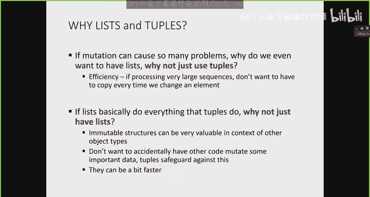

So that wraps up lists and notability next lecture will just tie up a bunch more loose ends and then we'll get into a new topic。

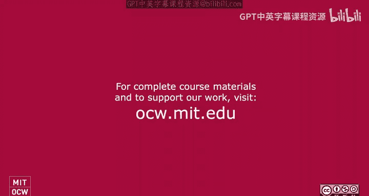