# 《计算机科学和Python编程｜6.100L Introduction to CS and Programming using Python, 2022》 - P12：-12-Lecture 12_ List Comprehension, Functions as Objects, Testing, and Debugging - GPT中英字幕课程资源 - BV1PAxJzVEs3

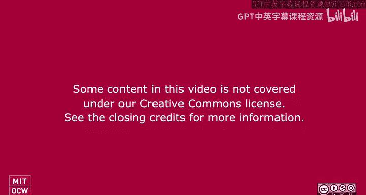

O。Let's get started with today's lecture。It's going to be more of a chill lecture than what we've done in the past。

 even though we've got quite a few things to cover， as you can see from this title slide。

 I'm not gonna go super duper fast。 So please feel free to ask lots of questions。

 And then the second half of the lecture will be really chill because we're gonna to be talking about testing and debugging strategies。

 So super high level topic。But first， we're going to tie up some loose ends related to lists and relating to functions。

 So we're not going to introduce a lot of new syntax。

 These ideas are sort of more optional in your day to day coding。 but they're just really。

 really nice to know。😊，So let's first start talking about this idea of a list comprehension。

So you've been writing functions that deal with lists。

 And one really common pattern that I hope you've seen so far is the following。

 So this code right here shows something that we've definitely coded together and you've definitely coded in the finger exercises and the quizzes。

 And so it is a really common pattern。 So the idea here is you have a function that creates a new list where the elements of this new list are a function of the input list。

 Okay so the pattern here is we create a new empty list inside the function。😊。

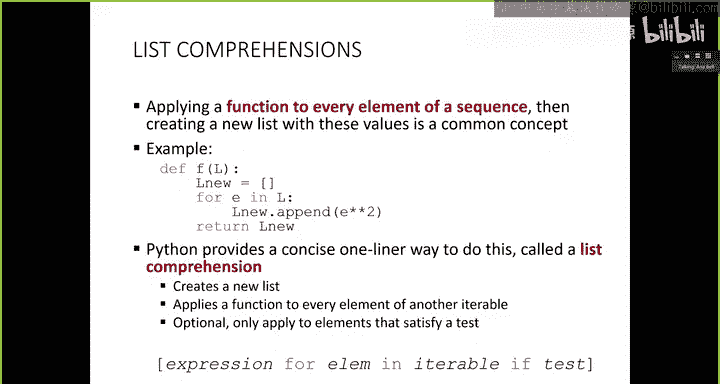

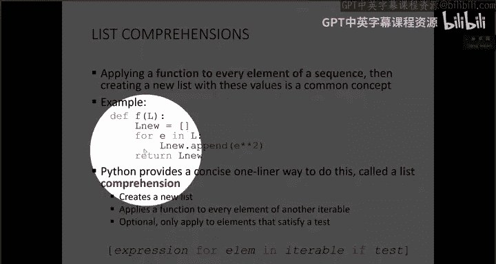

We have a loop over every element in the input。And to each one of these elements in the input。

 we apply the same function。 So in this particular case， we're taking that element and squaring it。

And each one of these elements were appending to this new list， originally empty。Until we've reached。

 we've done this function to every element in L。 And then we return this newly created list。

So since this is a really common thing that programmers do。

 Python allows you to do this exact functionality with one line of code。

 And the way we do this is using something called the list comprehension。

So the way that we do a list comprehension， essentially taking these four lines of code from this function。

 we are going to write it， write them in this one line of code that looks something like this。

 So the idea here is with this one line of code， we're going to create a new list。

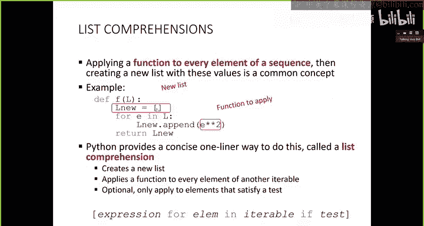

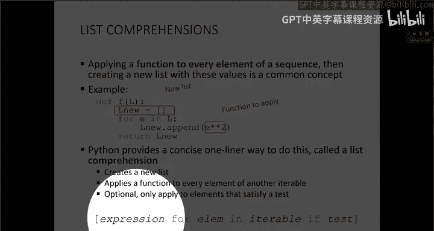

We're going to have an iterator that goes through some sort of sequence of values and we're going to apply the same function to every one of those elements and the other optional piece that we can add inside this list comprehension is to only apply that function if some condition holds。

So earlier， let's look at this how， let's look at this example and see how we can convert this。

 these four lines of code to one line of list comprehension code。

So we've got creating a new empty list。

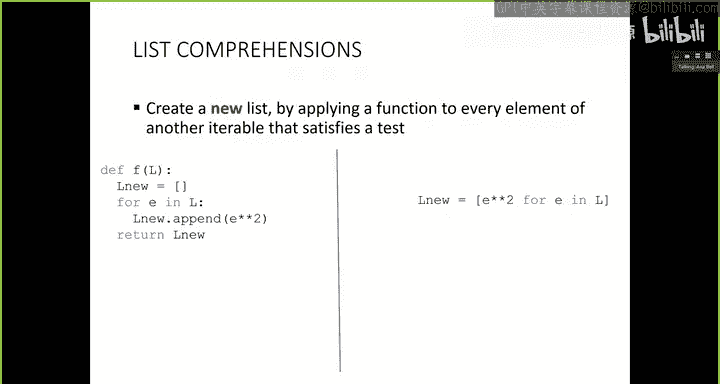

This is going to。Tell Python to create a new empty list for us。 Okay。

 so just open and close square brackets。

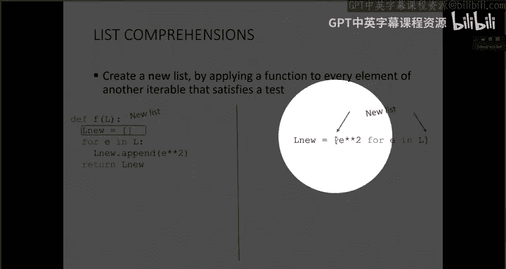

And within these open and closed cr brackets， we're going to write a one liner expression。

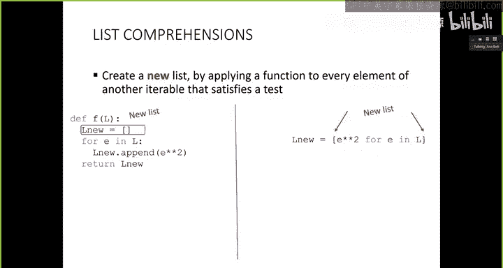

And this one liner is going to encapsulate these， these two lines of code here。

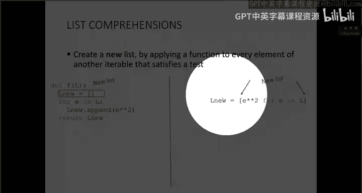

So the expression sorry， the function we're going to apply to every element in L。

Is going to be taking that element and squaring it。

 So on the right hand side here in the list comprehension， we've got some E squared。

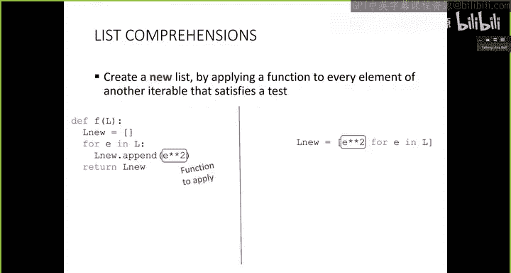

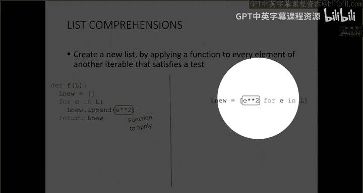

Well， what is E， Well， it's going to be every element， E in L。Okay， so if we read this in English。

 we basically say L New is gonna contain elements。 E squared for E and L， right， So it sounds weird。

 but it kind of makes sense， even if we read it in English。And behind the scenes。

 Python will take one by one， each element in L square it。

 and that's the sequence of elements it will populate this L new with。

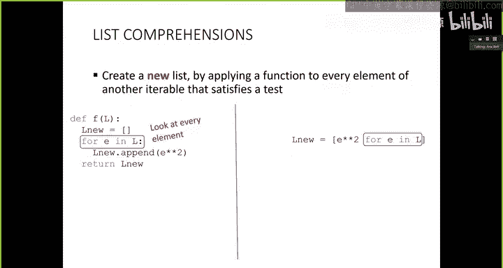

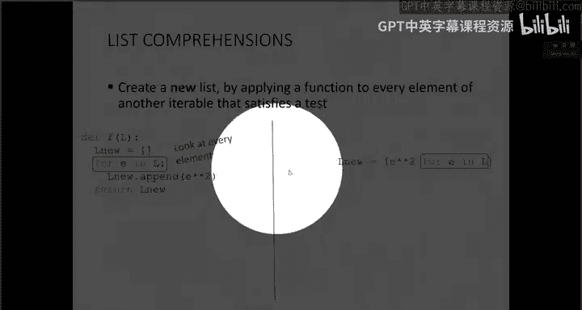

O。Now， what if we add a condition to that， So let's say we want to create this new list of elements only。

For even elements。 So we only want to square the even elements within my original list， L。

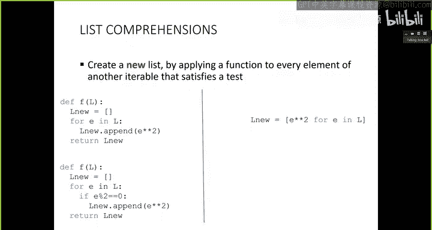

Well， if we were to write a function that does that， we have to add this extra condition here。

 so everything else is the same， except for this if  E% 2 equal to0。

 this tells Python to only grab elements that are even divisible by  two。

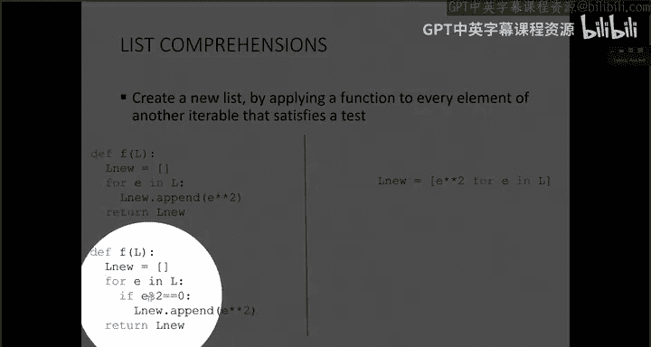

So how do we write this in list comprehension form， So here's a new list。

 and this is the function to apply only if the test is true in list comprehension。

 this is my new list。I've got the for loop is over here。

And then the test to apply is at the end here， if e%2 equal equals 0。

 and then what is the function we're applying， it's just e squared like before。

 So the test just gets appended to the end of this list comprehension expression here。

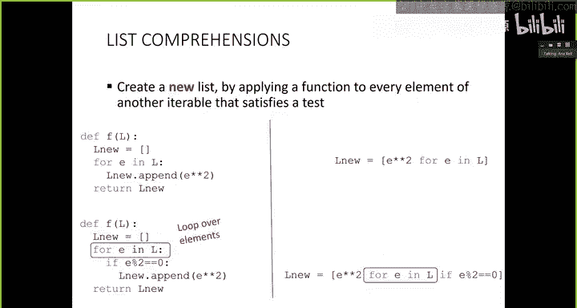

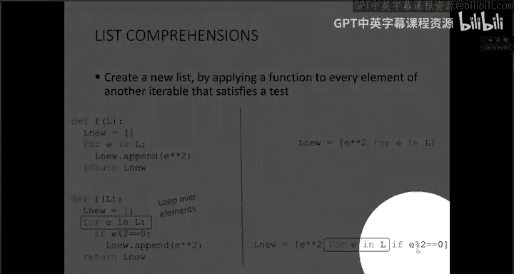

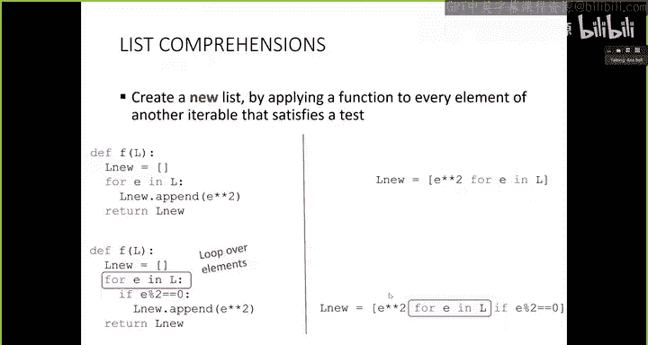

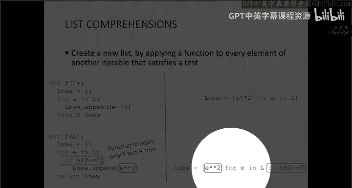

Yeah。Does it run faster， I'm not sure， actually， it might run marginally faster。

 but probably not significantly。 The reason to do this is because as you get more practice with it。

 this will be easier to read in code。And often， if you see a large chunk like this。

 your eyes will glaze over。 right， You're not going to want to read a chunk like that。

 But if you see it all in one line， you're going to think， well， how bad can it be。

And so you can come up with really complicated list comprehension expressions。

 but usually we reserve them for you know really simple。

 really quick ways to create these lists that you just populate with some values right off the bat。

 so it just makes the code a lot easier to read。Okay， so list comprehensions are are pretty useful。

 if you get a little bit of practice with them， you'll find yourself kind of using them all over the place。

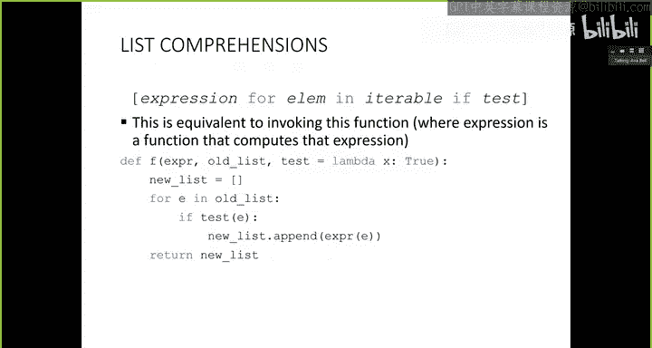

And they basically replace code that looks like this。 Okay。

 so these lines of code is a very generic way of writing this one liner list comprehension。

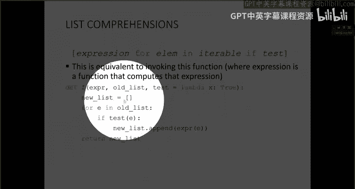

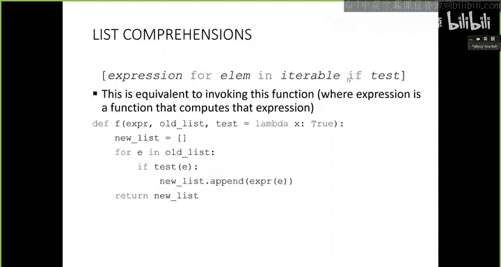

So here I've got a function F that I would like to apply。

 This X PRR expression is the function I would like to apply to each element。

 This is the list I would like to apply that function to。

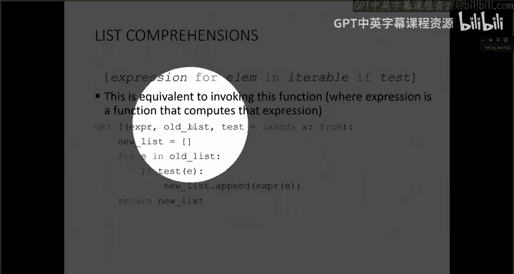

And the test is going to be， you know， the conditional in this particular case。

 this this test means I apply it to every single element。

 but you can imagine having a function which， you know， in the previous case。

 we would say lambda X X percent2 equal equals 0 as our conditional。

And then the function that we're essentially replacing is is this with list comprehensions， right。

 we create this new list。 again， this is the pattern that we saw in the previous slide。

 We loop through every element in the list if that condition holds append that function applied to each element。

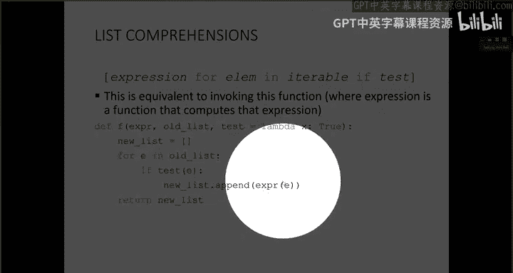

And then at the end， return the list。So this is just a very generic way to write a list comprehension。

So let's look at some concrete examples。 So here I'm not applying the function e squared to a particular set of elements from a list。

 I'm applying it to the sequence of values given by range。

 remember when we were talking about four loops iterating through things。

 they can iterate through integerors following some pattern like range 6 range one comma 9 comma2。

 something like that。 as long as you have a sequence of values， you can iterate over。

 you can plop that into this list comprehension， so you could iterate over lists。

 you could iterate over tuples， you could iterate over these direct ranges。

 you could iterate over range of the length of a list， whatever creates an iterable for you。

 you can put put that in the list comprehension。So in this particular case。

 the way I read this is I've got something that I'm squaring。 And what's the thing that I'm squaring。

 It's going to be each value in range 6。 So I think about it like。

 what is this sequence of values that I'm going to operate on。 Well， it's going to be the number 0，1。

2，3，4，5。And the thing that I'm going to do to them is square each one of those values。

So the end list that I get out of this one liner here is a list containing 0 squared，1 squared。

2 squared，3 squared，4 squared， and 5 squared。

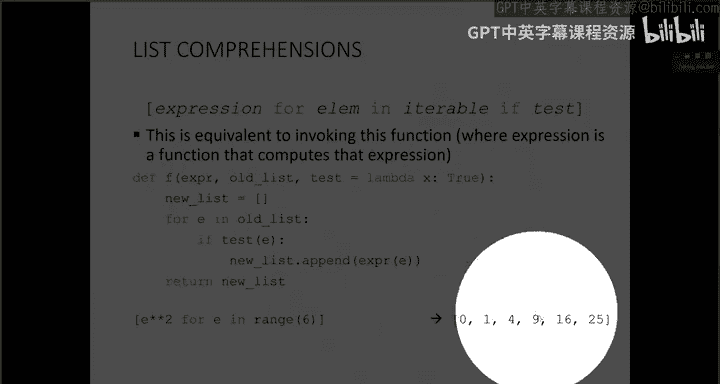

We can add a condition to that。 So here I've got the each element squared for E and range 8， only if。

He is even。So then the way I think about it is， let's start off with what every element in the range is。

 Well， it's 0，1，2，3，4，5，6，7。The condition I'm applying to that is that it's even。 So the numbers I。

 I'm going end up with。 I'm filtering all those to only contain 0，2，4， and 6。Because we go up to。

 but not including8。And then I'm gonna square every one of those。

 So the end result from this list comprehension is a list containing the elements，0 squared。

2 squared，4 squared and 6 squared。😊，And lastly， you know。

 we've been doing just single integers in the resulting list。 But as I mentioned。

 we can do more complicated things。 So as long as we can write a little expression here for the thing that we'd like to calculate or add to the list。

 we can put it in the list comprehension。So in this particular case。

 the element that I'm adding to my list comprehension or my resulting list from the list comprehension is a list itself。

So each element in my resulting list is another list。

RightAnd that inner list is going to contain two elements every time the thing I'm actually iterating over and it's square。

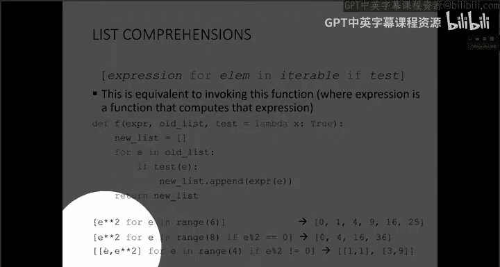

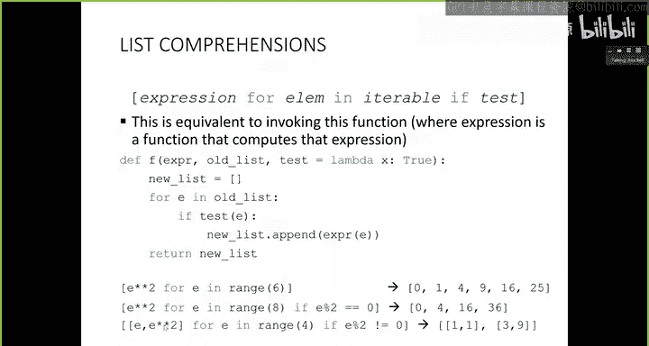

And I've got a condition here。 So I've got the elements 0，1，2， and 3。 That's the range。

But I'm only grabbing the odd ones in this particular case。

 So the resulting set of numbers that I'm going， I'm going to apply this。

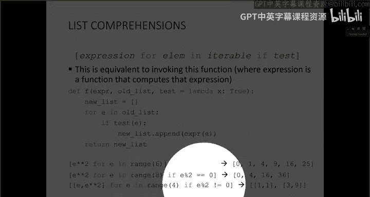

2 is going to be the number is the numbers  one and 3。

Because those are the two odd numbers in range  four。

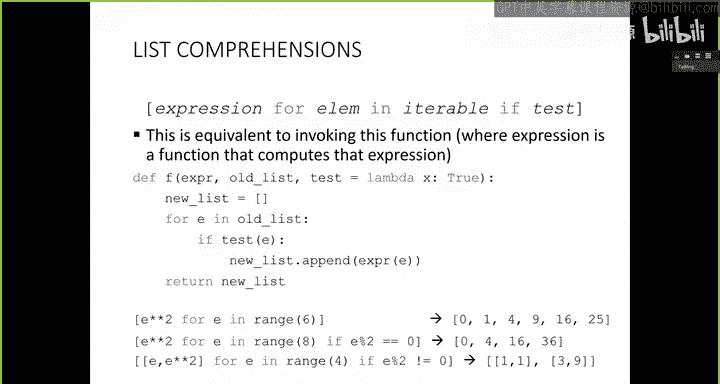

And so the resulting list。Is going to contain two elements。

 So this outer square bracket is the list that I've created。

 and its elements will be the element that I have actually iterated over and itss square as a list。

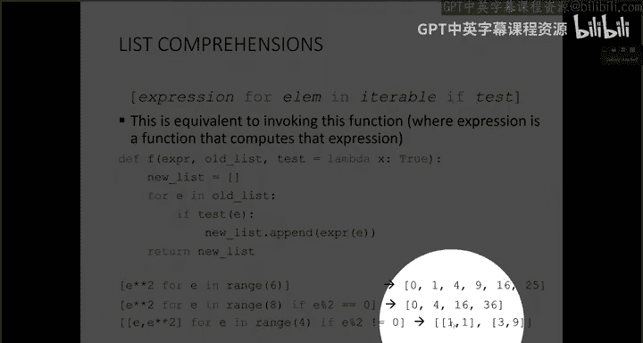

，So one and one squared。

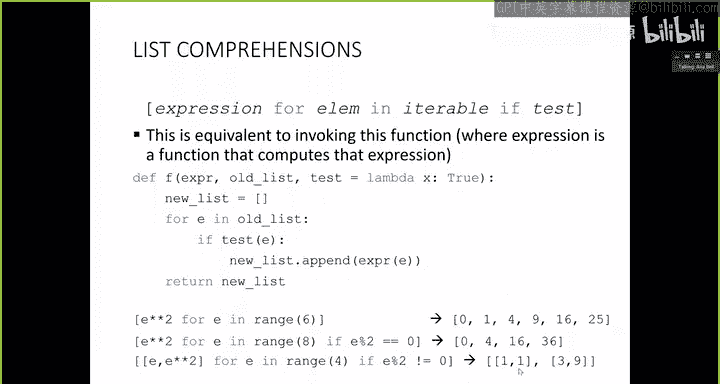

For E and E squared when E is 1， and then 3 and 9。3 squared when E is3。

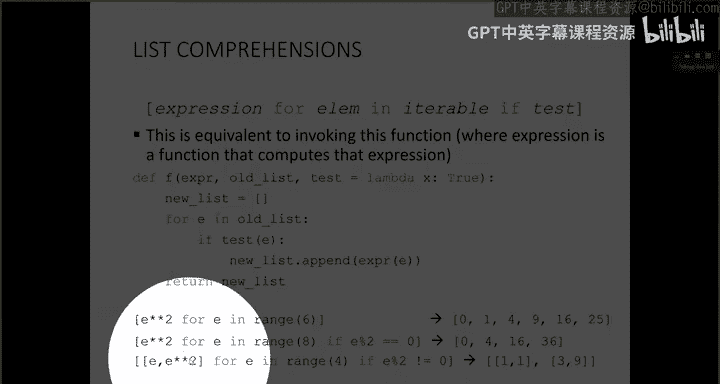

Questions about that。O。So pretty cool。 It's a really nice way to create lists really quickly。 Like。

 if you wanted to create a list full of zeros， full of 100 zeros， no need to do a loop。

 You basically do a list comprehension that says square brackets，0，4 E and range 10 and1 or 100。😊。

Right， and then you've got yourself a nice list full of 100 zeros。Alright。

 so think about this and then tell me what the answer is。

So the idea here is we have this list comprehension。And。Just go through it step by step。

 It looks a little bit intimidating。 But the first step is to look at the for loop and ask yourself。

 what are the values I'm iterating over。

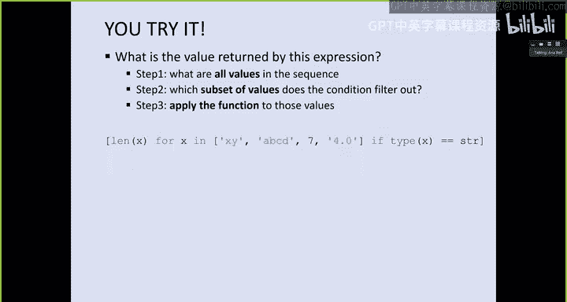

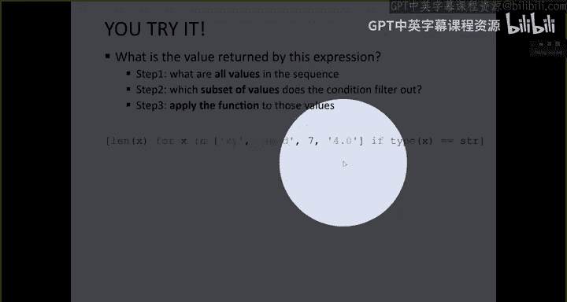

Then look at the condition if there is one。There is one。 In this case， it's at the end here。

 So now what subsets of those original things you're iterating over are you actually keeping。

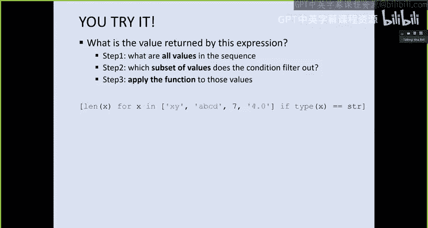

And then from those things that you're keeping， what function are you applying。

 It's the one right at the beginning。

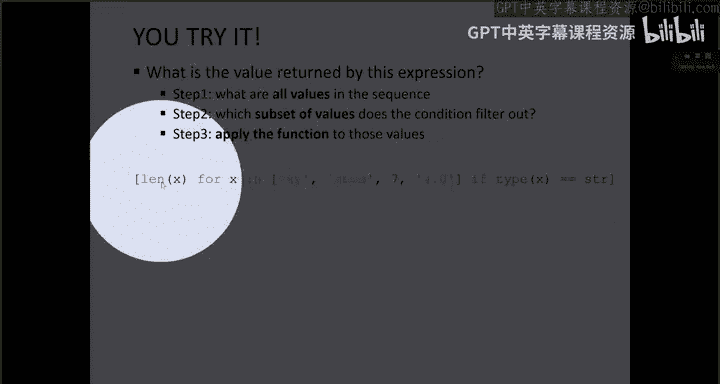

So think about it， and then I'll ask you to tell me。So step 1。

 what are the values I'm iterating over。Go for the full values， not including the condition。

Someone yelled up。Yeah， that list in the middle。 Awesome。 Okay， so X， Y。ABCD， right？And then，7。

And then what's the last thing， Is it the number 4。0 or a string。Yeah， exactly for point。O。String。

 string， step 2， from this list， what are the values that I'm actually keeping， right。

 based on the condition。If there're string， all right， which one's a string is X， Y。Is ABCD。Is7。

Nope is 4。0。Okay， so then these are the elements that I'm keeping。

 And now what's the function I'm applying and what's the result going to be。

It's going to be a list containing。3。2。🤢，2，4，3， yeah，2， because that's length 2，4。

 because that's length 4 and 3， because that's length 3。Great。

 and we've got ourselves a nice little list based on that condition。

 that sequence of values and that function applied light， yeah。😊，Why does it return a list？The。

 the whole thing。Oh， yeah。 So we're not printing things out here。

 When we're writing this as a list comprehension， we're essentially telling Python to create this resulting list of values。

 That's just what a list comprehension does。 And so just kind of this expression here with these outer square brackets around our entire expression tells Python that the resulting thing is a list。

 Yeah， this is a good question。😊，Other questions。Okay， so that yeah， question。さぽい。

Does it support multiple conditions， Yes， so at the end here， you know， you would say if。

And then you could wrap them in parentheses。 I think， I don't know if you have to。

 But just to be safe， I would wrap my conditions in parentheses and you'd use and or or or whatever you want to combine the expressions or the conditions with。

's a question， yeah。This one， the lambda。Here， this is a Lambda function that we talked about。

 I forget when a couple lectures ago， it's basically an anonymous function。

 and all it does is return true all the time。So the test will always be true。

Which means that when we do， if test。Prenheses E， this will always be true in this particular case。

 But we' given a different lambda function。 that might not be the case。Okay。

 so let's move on to the next topic。 The next， I guess， two topics will be dealing with functions。

 And I want to wrap up a couple things here just to give you a couple more ideas regarding functions。

 So the first one is actually related to this last question is the idea of a default parameter。

 So this is going to be a way for us to add parameters to our functions that get some default value。

 And that's what that lambda thing actually was in that example。

 But hopefully this piece of the lecture makes that a little bit more clear。

And then the second part regarding functions we're gonna go over is the idea of functions as objects。

 kind of working up on that。 And we're going to see what happens when we return a function object。

From another function， right， we've seen functions as parameters to other functions。

 But we're gonna to see what happens when you make a function be the return value of another function。

But that's in a little bit。 for now， let's look at default parameters。Okay。

 we've seen this code before。Tggering flashbacks。 So this is bi section route。

 I'll go over it just to remind ourselves what it does。

 We've got this code inside this function we wrote a long， long time ago， right。

 And then we decided to wrap it in a function so that it's a really nicely useful piece of code that we can run many。

 many times。😊。

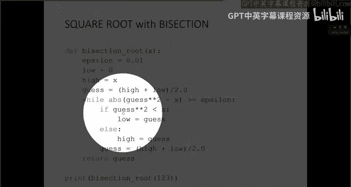

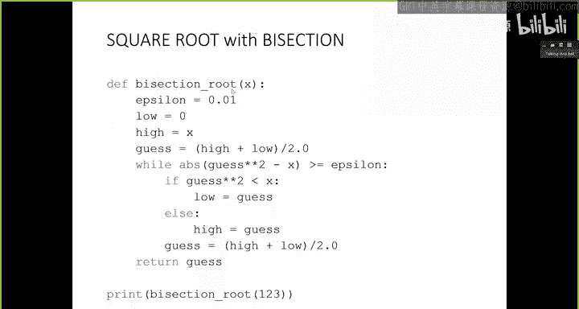

So the parameter to this function was x of value we'd like to approximate the square root of。

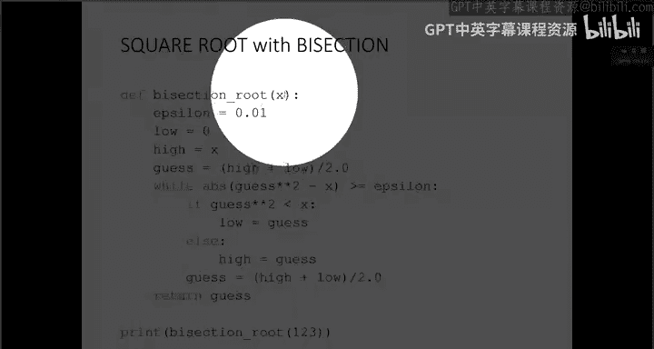

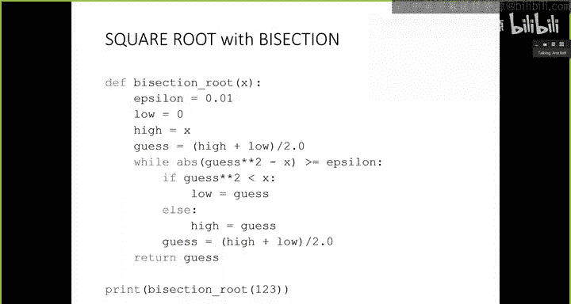

Right， and the code we're using to approximate is using the bisection search algorithm。

Which initializes some variables， namely epsilon， how。

 how sort of how close we want to be to the fine answercer， low and high end points。

 We remember that。 and then initial guess， the halfway between low and high。

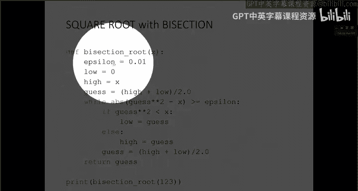

And then we keep making guesses between low and high， right。Being the midpoint of low and high。

As long as we're not close enough to the the final we're not close enough to the final answer。

 right So we're going to either reinitialize our low endpoint or our high endpoint。

 depending on whether that guess was too low or too high。 And then within the loop。

 we make another guess using those changed values of either low or high， based on if or else。

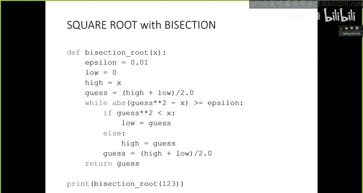

And then we keep doing this process of making more guesses at the halfway point as long as we're still farther than epsilon away。

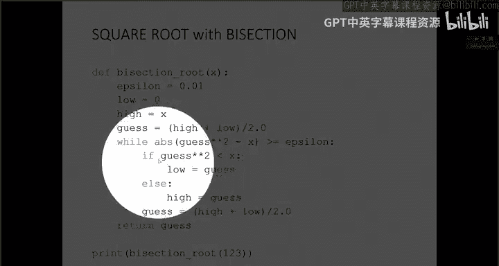

Okay， that was a recap of what we've done so far。 The interesting thing that we had done with this function was。

 or when we turned it into a function was to return our approximation。 So this guess。

 instead of just printing it to the to the user， we returned it so that it could be useful in other parts of the code。

😊。

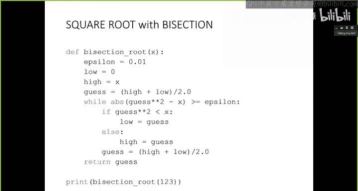

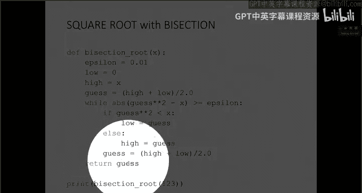

And so when we called the function， we just said name of function， and then some value of x。Now。

 there are situations where a user would want to change the value of Epsilon right right now。

 the way we wrote this code， Epsilon is set to 0。01。 And whenever you run the function。

 it always finds the approximation to the squared of x to that precision0。01。Now， sometimes。

 you know， depending on the application， the user might want an even better approximation。 So 0。

000001， or they might not care to be as precise and they want， you know。

 maybe approximated to 1 or to 05 or something much bigger than 001。

So what are the options in this particular case， right， for this， these scenarios。

 One option would be obviously， to go inside our function and say， well。

 I'm going change epsilon to be something super duper precise 。000001。

 And so people who call this function will always get an approximation to that precision。

What about people who don't want it that precise， right？

So all the function calls are going to be affected by making that change。

 And so that's not really desirable。 We'd like to let the person who makes the function call be in charge of what precision they'd like。

Another option is to put epsilon outside the function。 So to say， okay， well。

 the only parameter is going to be X。And let's not set Epsilon within the function。

 Let's let the user maybe set Epsilon outside the function。 and then they can use。

 and then our code will basically pop up one level to the global scope and use the epsilon that the user chose。

Not a good idea， because as soon as we allow somebody using our code to kind of。

Make their own variables within our code。 We're putting our trust in somebody else's hands。 And。

 you know， they might forget to reset epsilon， or they might forget to set it to begin with。

 And so that's just using global variables is not a good idea in the first place。

 We'd like to keep control of the epsilon that's being used inside our function。So unsurprisingly。

 the last option is going to be our best option。 Let's just add epsilon as another parameter to the function。

 right。So there it is。 We've got a bisection root。 again， as a function。 We've got a parameter X。

 and we have epsilon as a second parameter that the user can。

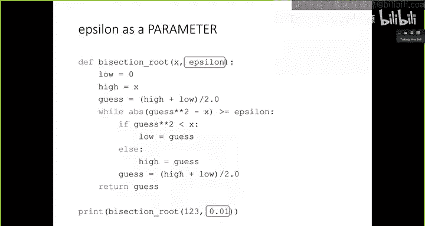

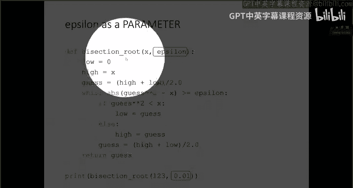

Can， can call the function with。

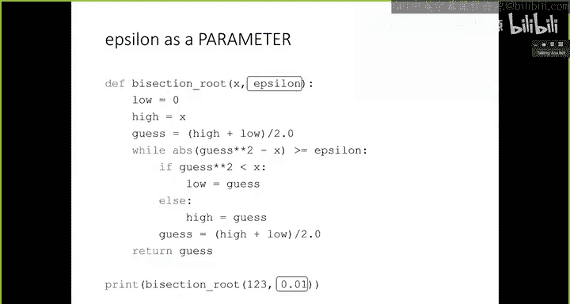

So other other than that， the function body is exactly the same， right， except that right now。

 when we make a function call， we have to pass in epsilon as the second parameter。

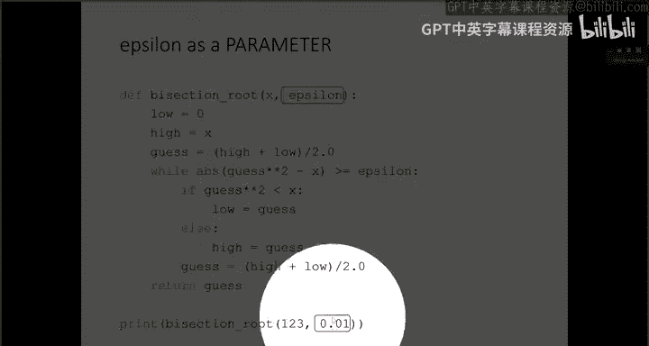

So， in terms of code。This is the bisection route with epsilon as a parameter。

 And so now the user can find the approximation to 123 to 。1。

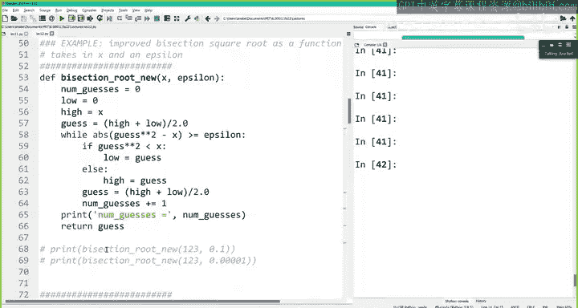

It's 11。088 in case you were wondering。 and then the approximation to under attorney3 to 。000001。

 which is 11。0905。So much better， the user can now be in charge of。

Deciding how close they'd like the approximation to be for every one of their values。

But notice that this code is kind of rebose。 And really， most of the time。

Maybe the users don't want to be in charge of setting the epsilon。

 Maybe they don't know what a good epsilon might be。Right。

 so how do they know that they should choose 001 by default。

 Maybe that's something you could put in the function specification for anyone using your function。

But it's， you know， you're gonna rely on users reading your specification。

 And that's a little bit scary。 So instead， the functionality that would really like to have is to say。

 okay， I want to write a function that does take in two parameters。But by default。

 one of those parameters is something that I set as the person who's writing this function。Right。

 so what I would really like to have is epsilon to have some sort of a default value。

 So if users don't know what to call it with that， that code will just use that default value。

And otherwise， if the user is more experienced and they know they'd like an epsilon of you know。

 one times 10 to the negative 10 or whatever it might be， then they can be in charge of setting it。

So most of the time， we want to call the bisection root function without an epsilon parameter so that it may use a default one。

 But sometimes we'd like to allow the user to actually set the epsilon。And so to that end。

 we're introducing the idea of keyword parameters， also known as default parameters。

 and they are set like this。

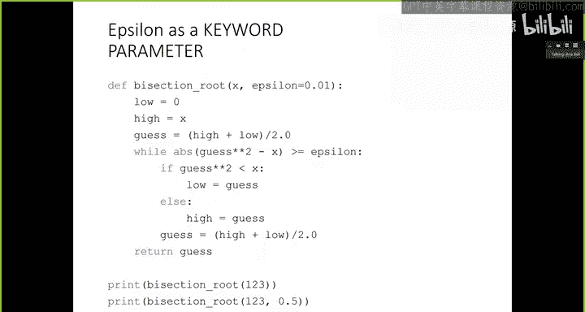

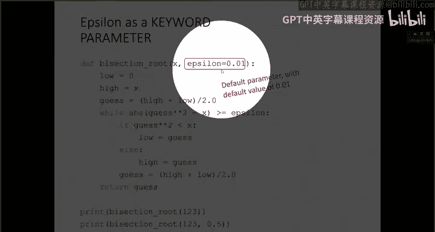

So the bisection function definition still takes in the thing we'd like to approximate the square root of x。

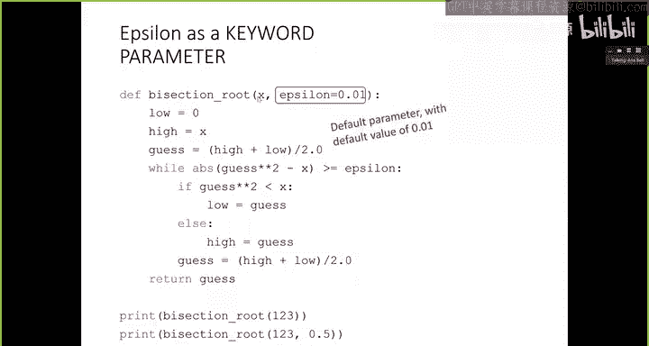

But the second parameter here， Epsilon will be equal to something inside the function definition。

 So we， as the people who are writing this function are going to say the default value of epsilon is 001。

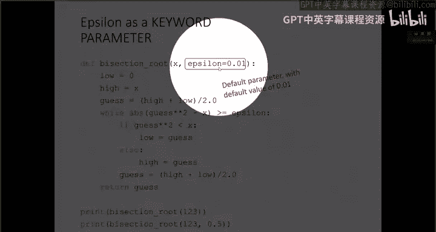

So that means when we call the function down here。If the user makes a function call without explicitly passing in a second parameter。

Python will use the default one that the person who wrote the function set， right。

 So Python will run by section root of 123 with epsilon being 。01。And otherwise。

 if the user does want to override that epsilon， they can just pass it in themselves。

 and that default value of 0。01 will be overwritten to be 05。And so， in our code here。

This is the bisection root with the default values。 And so you can see here if I run it with 123。

 even though there are two parameters here for the bisection square root function。

It's Python doesn't complain because it's using epsilon as 001。 So I run it， and it runs just fine。

But in the second line here， if I actually want to use 05 as my default per as my epsilon value。

 it overrides my default parameter， and it calculates squared of 123 with Epsilon being 05。

Questions so far。So now that we've introduced default parameters。

 there's a few sort of rules about making function calls。When you create the function definition。

 So over here， right when you're the one defining a function and you decide to allow some default parameters in your parameter list。

 everything that's a default parameter needs to go at the end。

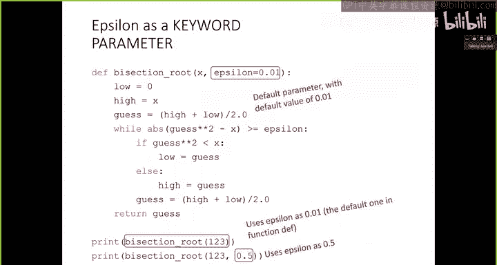

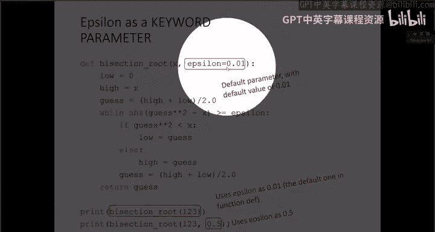

You can't switch these around。 You can't say epsilon equals 001 comma x。 Python will not allow that。

So any time you have default parameters， they always have to go to the end。

That's the only rule for making the function called or making defining the function with default parameters。

 And then once you have default parameters， you can actually call the function in many， many。

 many different ways。 Okay， And I know these， some of these will be confusing。

 You might not know whether they're allowed or not。 You can never go wrong with the last one。

 as we're gonna see in a bit。

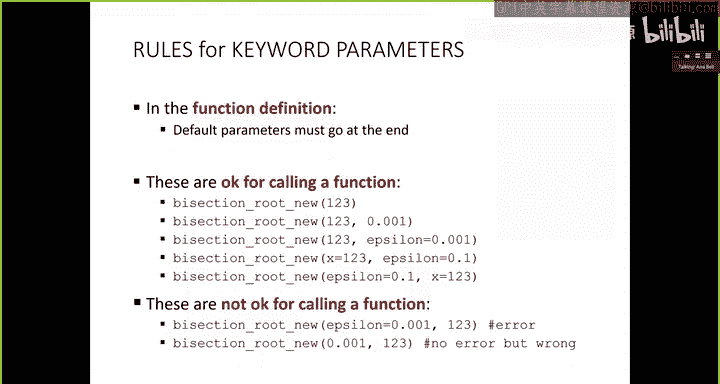

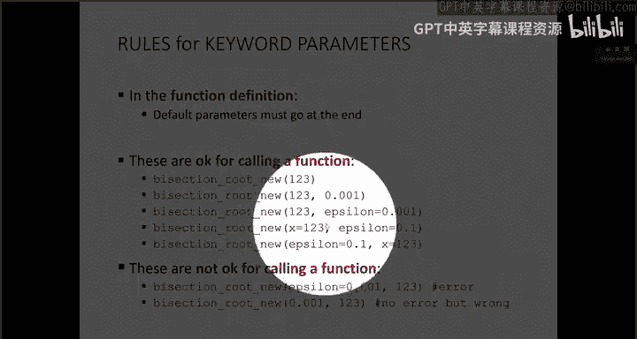

So the first one here showcases what happens when you give values for everything that's not a default parameter。

 in this case， just X。If you just give a value for non default parameters。

 Python sets default parameters for everything else。 So not a big deal。Alternatively。

 you can pass in just like we have in the past when we write our own functions with multiple parameters。

 you can pass in one at a time in the same order， values for every one of those parameters。

 defaultult or not。 And if you pass in values for all of them。

 Python will not be confused and it'll just match them one at a time。Variations on that。

 you can always pass in a value。For a parameter name。So looking at the function definition。

 we can see the parameter names， the formal parameters are named X and epsilon。

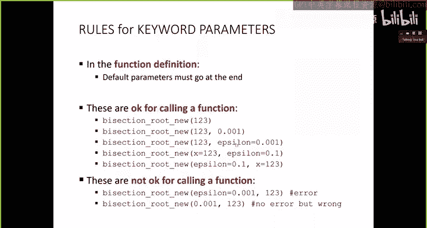

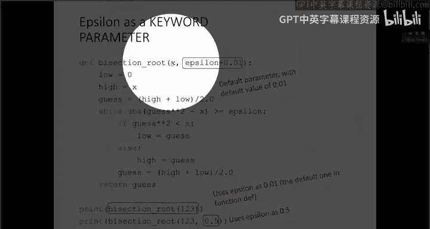

So when you make your function calls， you can actually explicitly tell Python something like this。

 X equals 1，23。 Epsilon equals 0。1， right， And if you have more parameters。

 you say that parameter equals whatever value you want to run it with。😊。

And so that will not confuse Python。 And if you do it in that way， you can actually。

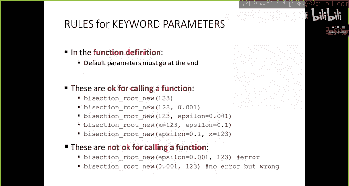

Do it in any order you'd like， because Python will just assign each one of these variables to be whatever you told them to。

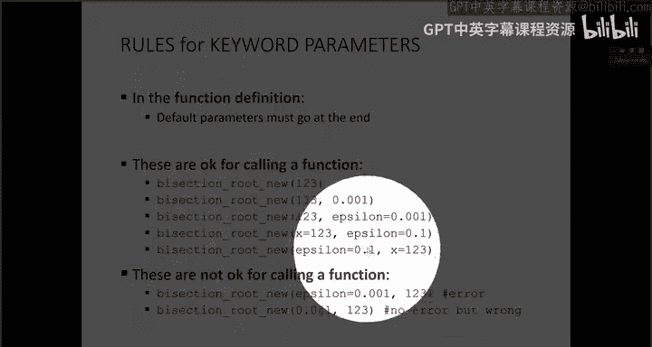

So in a， worst case， you just do something like this， right， where you one at a time。

 you just say what the formal parameter is and its value。 And then Python will not get confused。

The ones at the bottom， though， is where we run into trouble。So for example。

 if you put the default parameter first and then you put an actual parameter sorry。

 you put the default parameter first and then any parameter that's not a default one afterward。

 Python gives an error because the default ones have to go after the non-default ones。

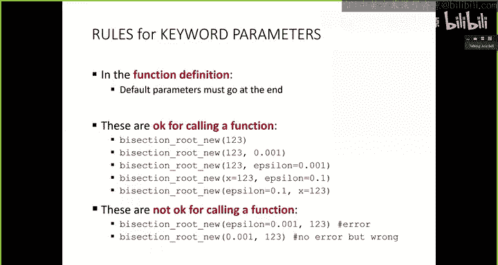

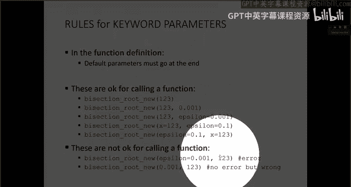

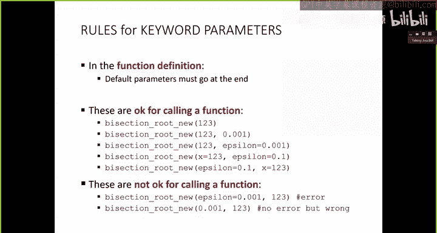

And the last one doesn't actually give an error， but Python remember， matches parameters  one by one。

 So it's actually going to find an approximation to the square root of 0001。To an epsilon of 123。

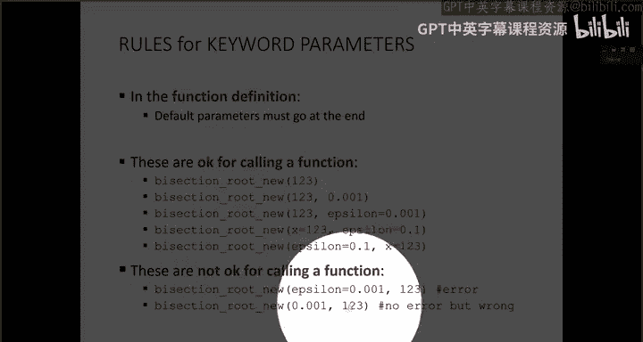

Okay， because it's just mapping the parameters one at a time。 And so that's not an error。

 but it's not exactly what we wanted to do。Questions about this。O。

So now let's move on to another thing， another sort of nuance about functions。

And we're gonna go back to the idea of functions being objects in Python。

So I drew this picture back when we first learned of objects of functions as objects。

 So I'll just do it again just to jog your memory。 So remember that when we make a function definition。

😊，Inside the memory Python creates an object。

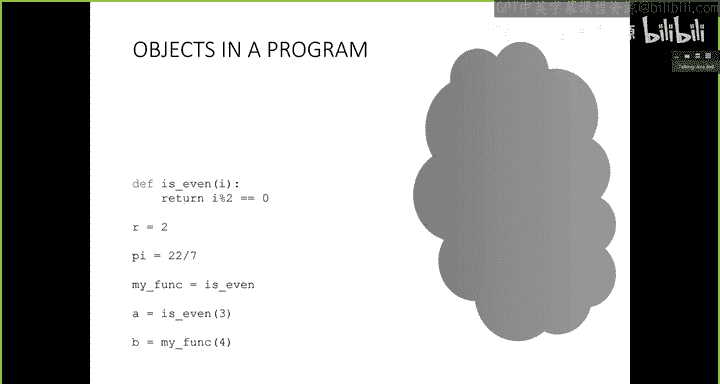

Right， as soon as we see just this function definition。

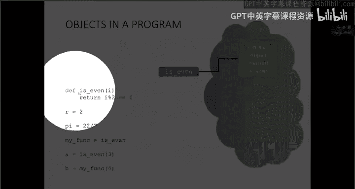

Python doesn't care what code is inside here。 This code does not run， right。

 It only runs when it's being called。 And right here， I have not made a function call at all。

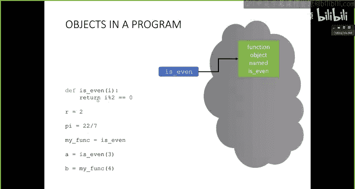

All Python knows at this point is that there is a function object inside memory。And it's the name。

 Its name is， is even。

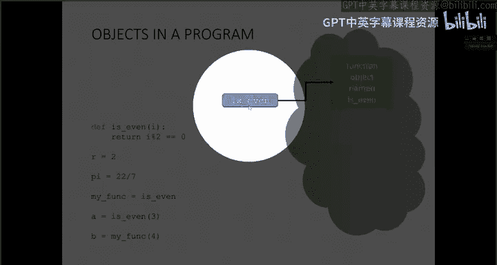

And this is exactly the same as creating an integer object inside memory and giving it the name R through a line like this or creating a float object in memory and giving it the name Pi。

 right， It's just some object with some name。😊。

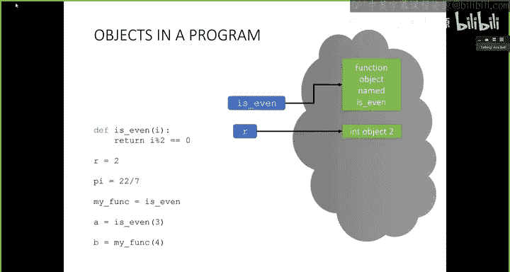

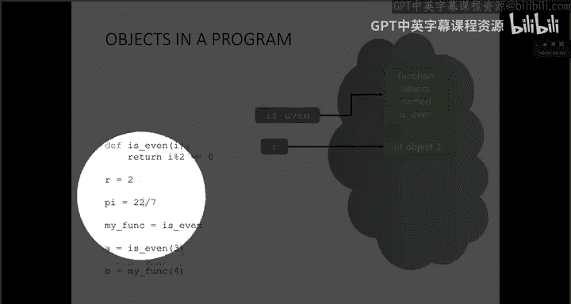

And so that means that we can have some code that looks like this。

 which is going to essentially create an alias for that function object in memory。

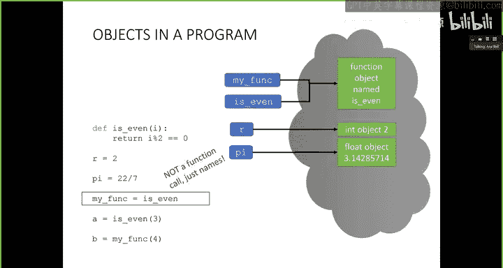

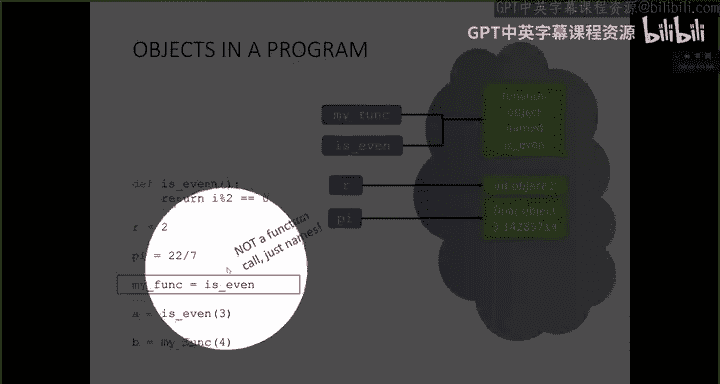

So here， the name is even。Refers to that function object。

And I'm telling Python that I would like to refer to that function object using the name my funk。

 as well。So both my funk and is even are names that point to this object in memory。

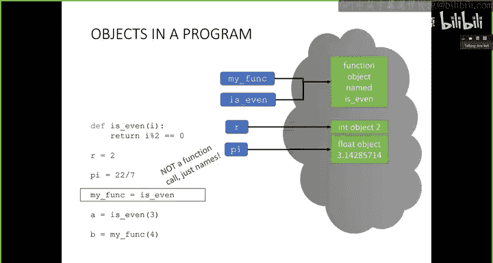

It's not a function call， right？ I'm not I'm not trying to figure out if some number is even。

 I am literally giving another name to this function。 This code， right， that does this thing here。

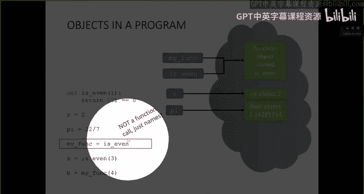

Okay， and so that means that if I have two names that point to the same object。

 if I am going to invoke those two names， as I do here， with some parameters， Python is going to say。

 well， I'm gonna run the code pointed to by these names with these parameters。

 So they will both run the code that they're pointing to right， This is even。

 And so it's just going to turn true or false we've seen。So remember。

 just another name for that object in memory。So we've seen already how we can pass functions as parameters to other functions。

And now we're going to see what happens when we return a function from another function。

 So we're not returning a function call here， right。We are returning a function object。

So in this particular code， we have only one function。 It's named makeprod。

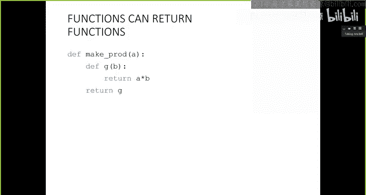

And it happens to have some stuff going on inside it。 So what's the stuff that this function will do。

 Well， this function itself will create another function。

 So this G only exists whenever make prod exists。

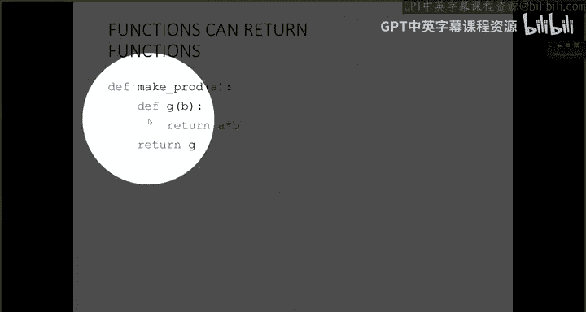

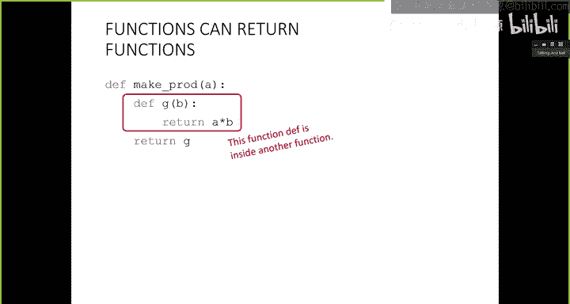

The main program。At you can think of it as sort of this level of the code。

 right in terms of indentation， the main program。

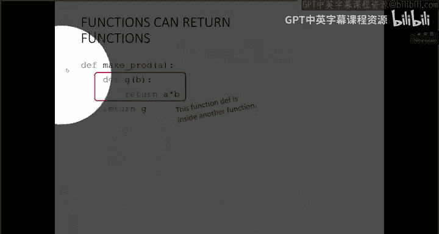

Does not know about G。G is only defined inside makeprod right， So when we first run this program。

 as is， there's no function called being done。 So the main program does not know anything about the internals of makepro。

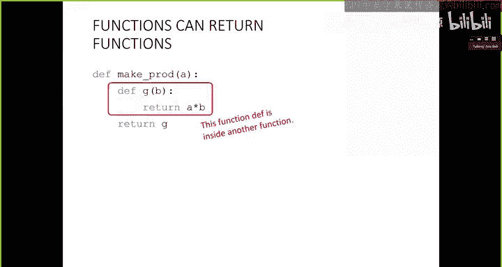

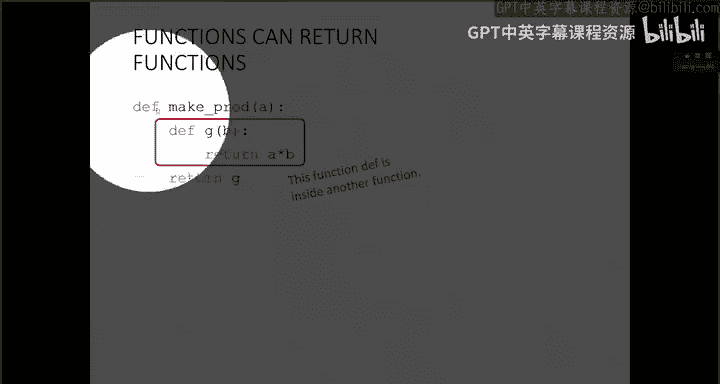

Okay， so make prod creates its own function here。 And then all it does is return this function object。

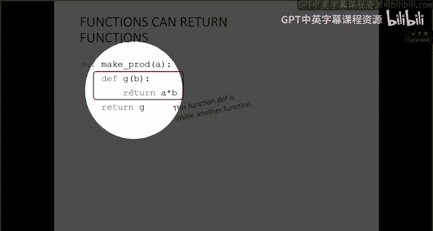

Right， noticeice it's not a function call。 There's no open close parentheses with a parameter in it。

 It's just the name G。 It's this function object。That's the key thing here。So let's run two codes。

This one and this one， they will do the exact same thing。They're going to call make Prod。

With some parameters。 And then we're gonna see what happens when we return this G。

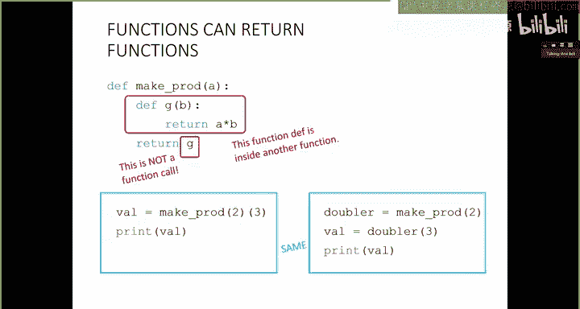

And notice already， it's looking slightly different than what we've been doing before。 Yes。

 we have a call to make prod here， but we've kind of chained another function call right after Makeprod。

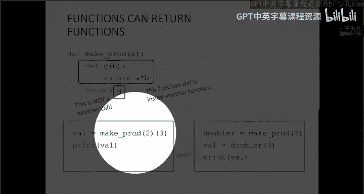

Right， we've got makeprod parentheses 2， parentheses 3。And so this is kind of like。

 I think of it as chaining a bunch of function calls together。

 And this is possible as we're gonna to see when we step through the the function environments that are being created。

 this is made possible because make prod， this function call returns a function itself。

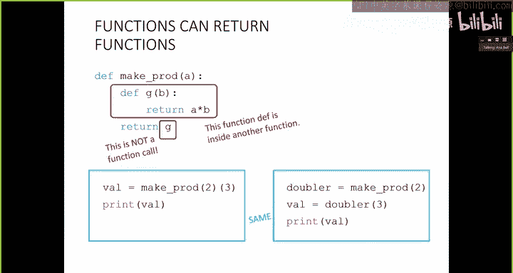

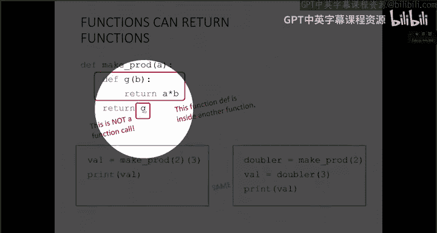

So let's step through the code on the left。Very carefully。

 And then I'll step through the code on the right， which will do the exact same thing。 And hopefully。

 it will clear up confusions if we do it twice。So this is the code from the left。

 Let's say we have this exact program here。

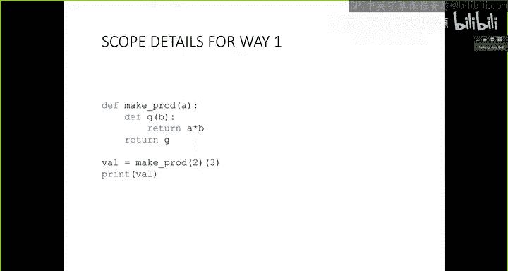

I've got one function definition。

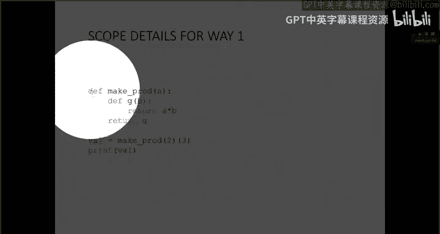

And then I've got one function called here。 And then I'm going to print the return value。

So as soon as I run my code， Python creates my global environment。 and in the global environment。

 this is the scope of， you know， the the， the main program。😊。

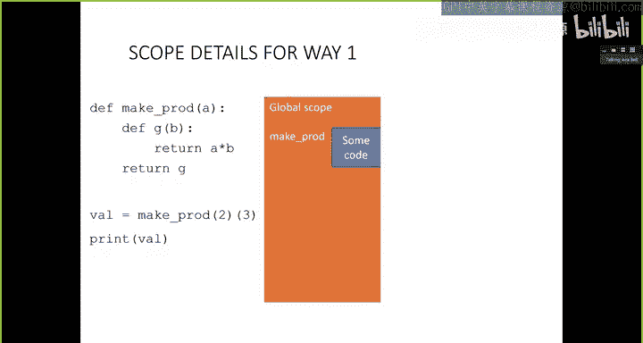

What do we have， Well， we have one function definition， which has some code within it。

 I don't care what it is at this point because I don't have a function call。

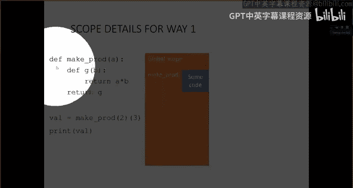

So then the next thing that I need to do is go down here and say v equals。

 So I'm going to create a variable v in my global environment。 And I'm going to make a function call。

 So function calls are done left to right， right， just like expressions。

 And the first thing Python C's is this function call make pro parentheses2。

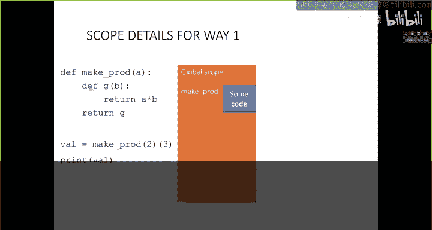

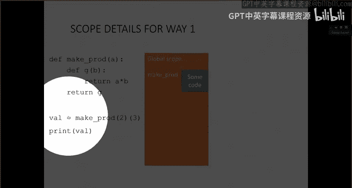

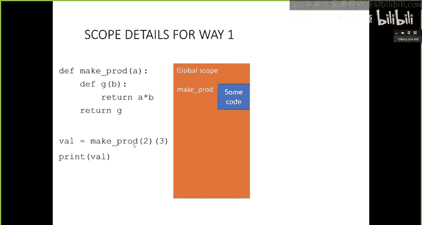

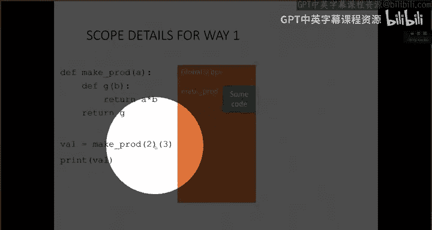

It's a function call。 So we need to create another orange box because a new environment gets created every time we create。

 we make a function call。So here I have my scope， my environment for make prod。

And I'm currently just stuck here trying to figure out what this is going to return。

 just the red box here。

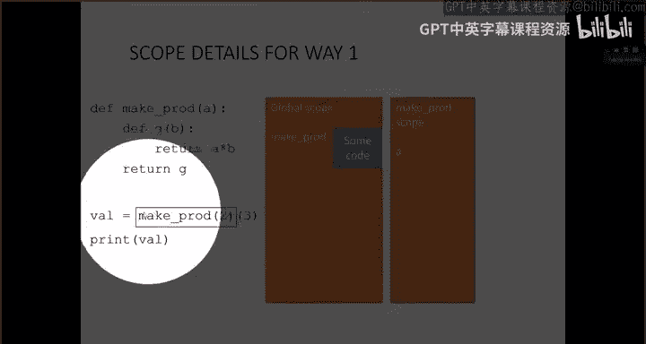

Well， every time I have a function call， I need to look at the function definition and the function definition says。

 there's one formal parameter A that I need a map to the actual parameter。

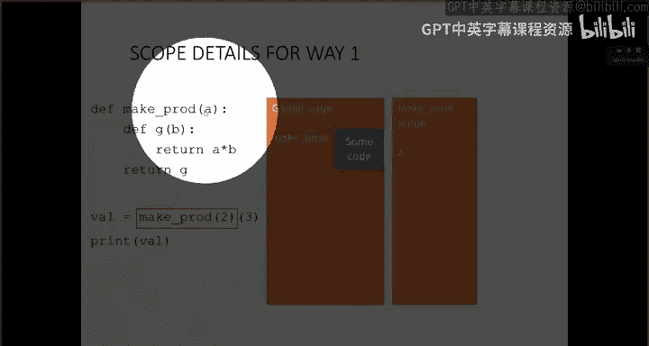

So the thing I'm calling make prod with is2。Should be pretty straightforward， right？And then。

I can move on to do the body of makeprod。Okay， so the body of make Prod says。

I would like to create a function definition。 The name of this function is G。So， there's G。

And it contains some code。 Again， I don't care what this code is because I'm not making a function called to G yet。

 right Right now， I'm just defining G。OK。So， so far so good。So this G， I want you to notice。

 only exists。Inside this call to make prod。The global environment does not know about G at this point。

 right， because we only define G inside make Prod。 It's here， right。

 I didn't define it outside of Make Prod， So the global scope doesn't know about it。

 but make Prod does know about it。

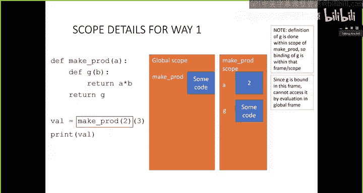

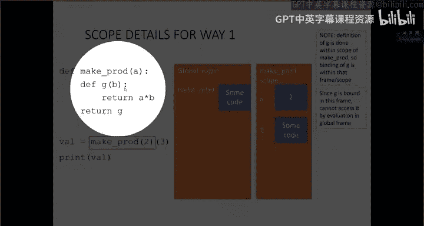

And so the only way that the global environment can know about G is if this make pro function somehow returns G。

Okay， so if we pass G back as a parameter as a value， sorry， to the main program scope。

 the main program can know about G， but otherwise G is kind of stuck in this little， you know。

 little subtask little environment of makeprod and the main program doesn't know about it。

And so that's what this code is doing。 It's essentially saying， well， I've made my definition。

 And now I return G。So， here。

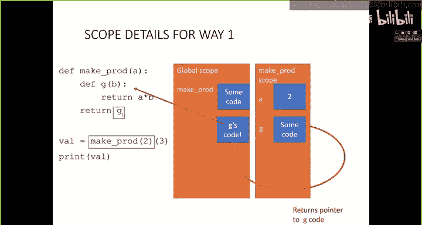

This G， the code and， and its code and the associated code， right， So this object pointed to by G。

Is going to be returned back to the main program。

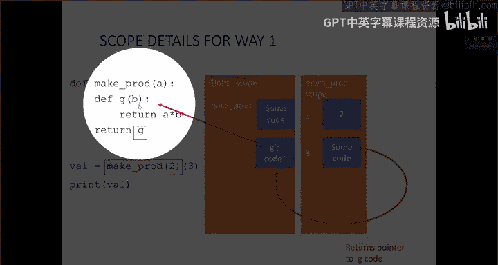

Okay， so now the main program knows about this object G that has some code associated with it。 right。

 this line here where it returns a star B。

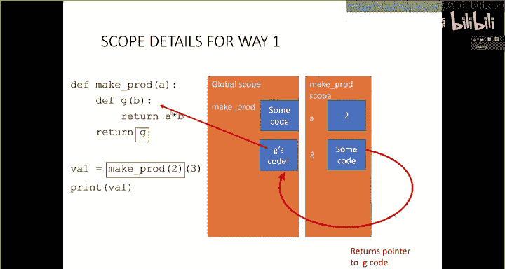

So the thing that I've。Boxed in red down here is the return value from make prod 2。

And make prod 2 return G。 So this you can essentially say， is G。

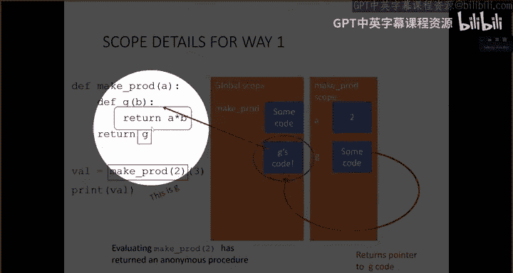

Is that okay。Does that make sense。Right，We're passing functions along， right， not function calls。

 And so this is just a function named G。And so now this line of code v equals。

 if we replace the red box with G v equals。G parenthesesis 3。

So G parenthesesis 3 is another function call， right， Just clearly， we， we look at it。

 It's a function call。 It's got a function name， parentheses， and a parameter。

And so since it's a function call， we create another scope for this function call。

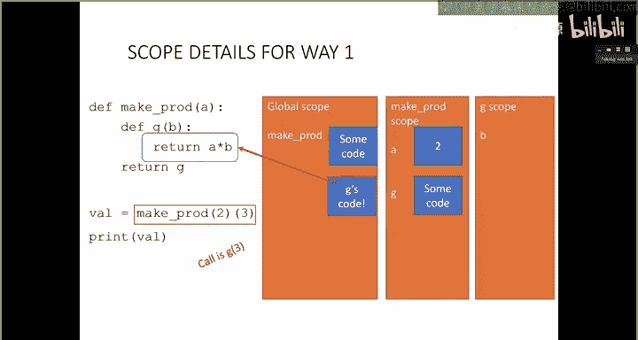

As before we look at what G takes in as a parameter。 It's about a variable named B， right。

 a formal parameter B， and we map it to 3。

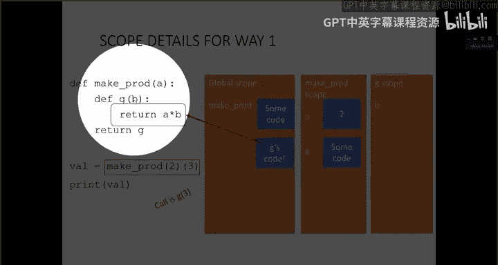

Because that's our function called G parenthesesis 3。And then we have to do the body of G。

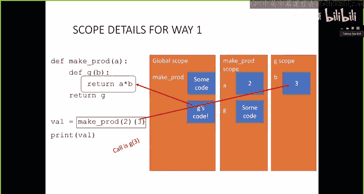

The body of G says return A multiplied by B。 Well， I know what B is。

 It's 3 because you just called me with that value。 But what is a， right。

 The scope of G has no a within it。

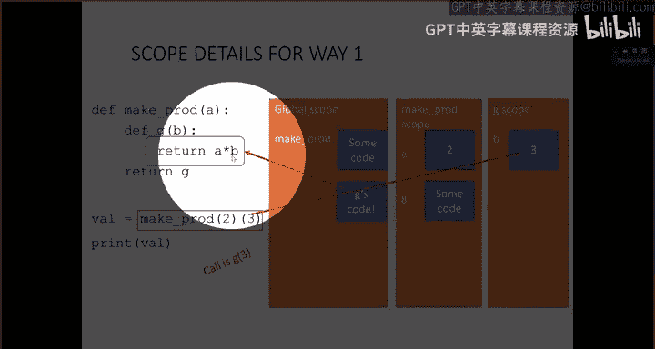

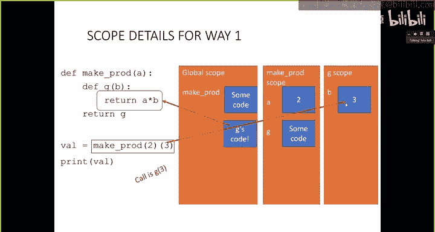

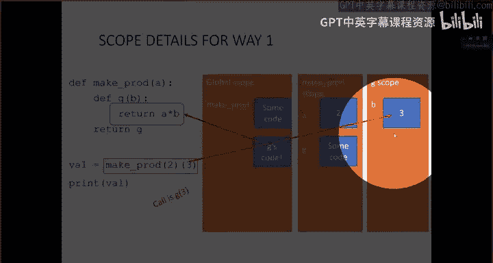

So thinking back to our function， our electron functions。

 if a function called doesn't know about a variable name within its environment， within its scope。

It moves up sort of the the， the function called hierarchy。 So it says， who called me。Right。

 where was G defined。Well， G was defined inside make Prod。 And so it was called from make Prod。

 Does make Prod have a variable named a。It does， right， And its value was 2。

So we didn't need to go any further up the hierarchy。 We've already found a variable named a。

 So Python will use B S 3， and a is 2。Multiplies that to be 6。

 And then the G function call can return 6。

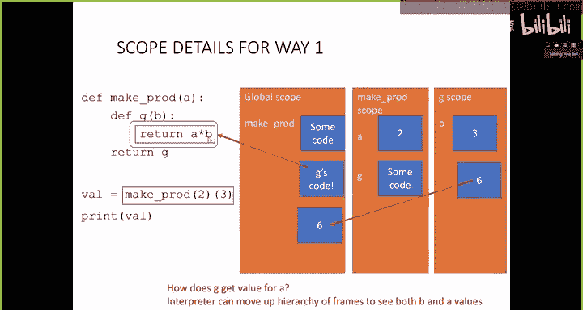

It returns it back to the main program because that's where this function call was being done。 right。

 Remember， we had this replaced with G parenthesesis 3 out in this global scope here。

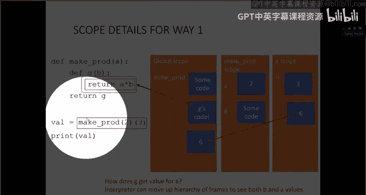

And so that6 gets returned back to the main main program。 and then Val becomes 6。

And we print 6。Okay， so that was showing you how to chain function calls together。

 And this was only made possible because makeprod has a function returned another function object If makeprod returned。

 I don't know， a tuple or an integer or something that was not a function， this code would fail。

 because the return from makeprod would be， let's say it returned the number 10。

 The return from makeprod would be replaced with 10。

 and then Python would see this line as 10 parentheses 3。 what the heck is that。

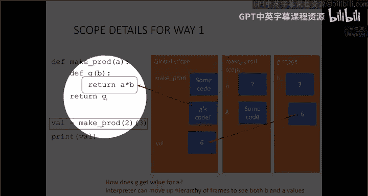

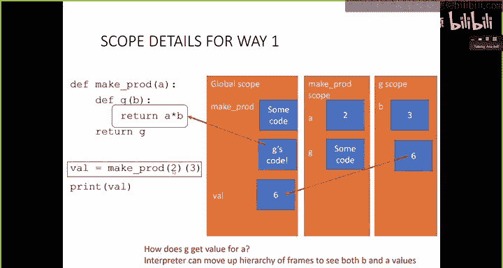

And so it would completely fail。 And so this is only made possible by the fact that this makeprod function returns a function object。

 And so we're able to chain these function calls together。

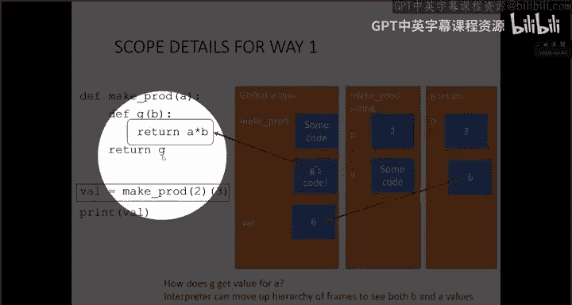

So let's look at the exact same code， except this time， instead of chaining them in a row。

Let's explicitly save the intermediate steps。So what I'm gonna do is say， make pro parentheses 2。

 I'm going to save as a variable。

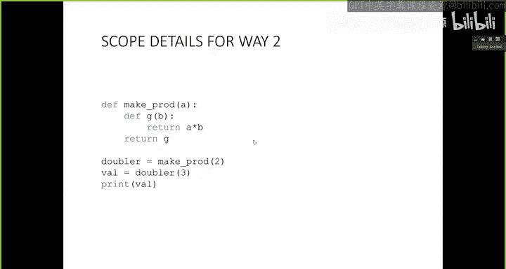

And then， make that variable。

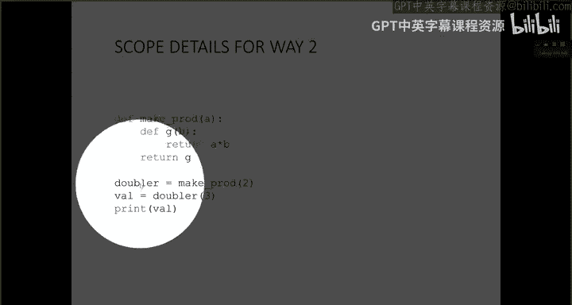

Call。The three， right， the， the second part of my chain from the previous line。

And it's going to do the exact same thing。So here I've got the global scope。

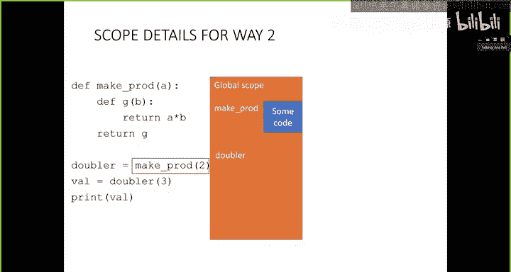

Just like before。I've got a function definition for make prod。 So this is the name makeprod。

 It it points to some code。 And then I've got this variable doubler that's going to equal something。

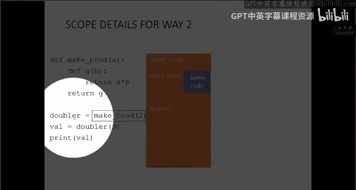

So that's a function call。The function call says here's my environment for make prod with its scope。

 So in this particular scope， I've got my formal parameter A that maps to2。

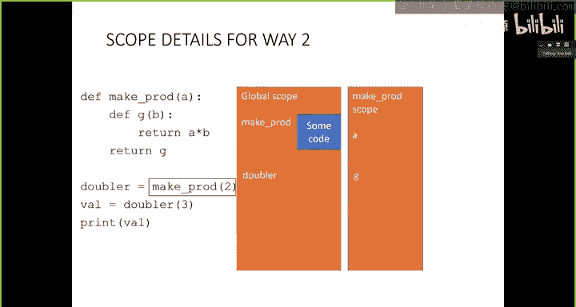

And then the function body itself creates this variable G。 That's just some code。

 exactly the same as before。

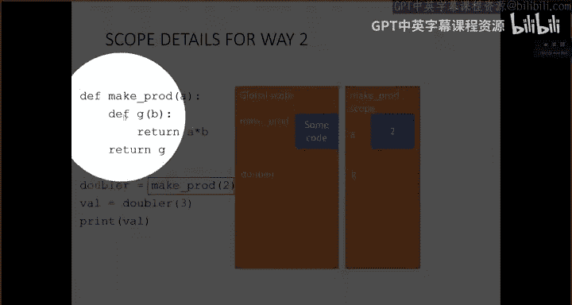

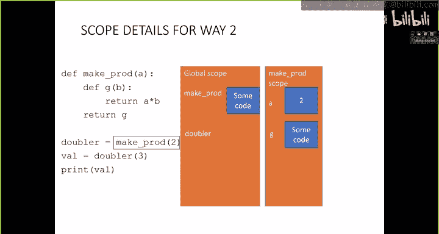

Any questions so far based on what happened last in the last sort of example and here。

 or is this okay so far。O。So now I've set up my， my code。

 and this is where the interesting part comes in， right， Make prod。

Is going to finish its call by saying， I'm going to return something。 And the thing it returns is G。

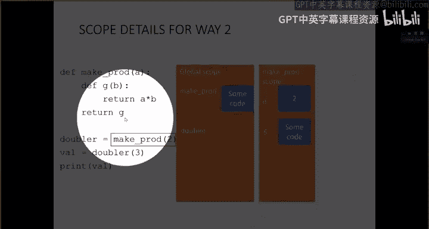

So it returns this name G just happens to It happens to be a function object， but you。

 think of it as anything else。 We're basically saying doubleubr equals 10 or doubleubr equals some list or some tuple。

 Doubr is going to be some， some value， right？ This value is just code associated with a function。

So in my main program scope， I've got doubleubr equals G。

 which based on the memory diagram we did like 5 or 10 slides ago， right。

 It's like when we had my funk equals is even。 I basically have two names for the same function object。

Right， Doubr is a name， and G is the other name。 And they both point to。This function object。

Does that make sense that that's okay。O。So now that I've got two names that point to the same function object。

 we can just use this doubleubr in the next line。

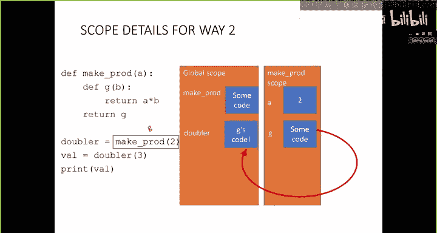

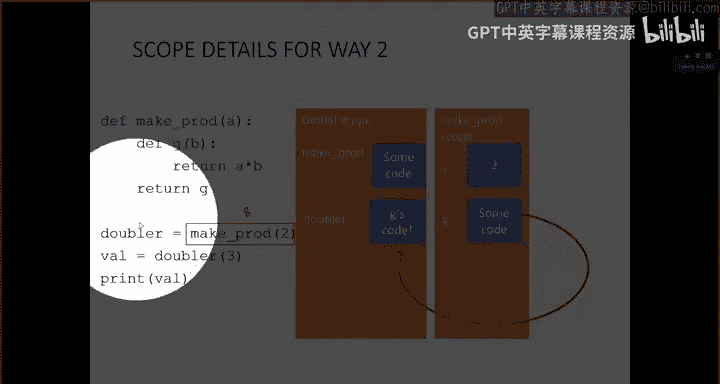

And this doubler is like saying G parentheses 3。Except that I'm using the name Doubr。

 which I saved it as on the previous line。So G parenthesesis 3 is another function call。

Create another environment for， for G or doubleubr whatever name。

 And here I've got one formal parameter， B。It's values 3。

 and then we do the same trick where you ask， what is the value of a。

 I'm going to look up the hierarchy of things that got called to see what the first value of a that I grab and the first value of a that we grab is the two right？

 And so we're going to multiply the two at the three。

 And that six gets returned back to whoever called it， which was out here in the main program scope。

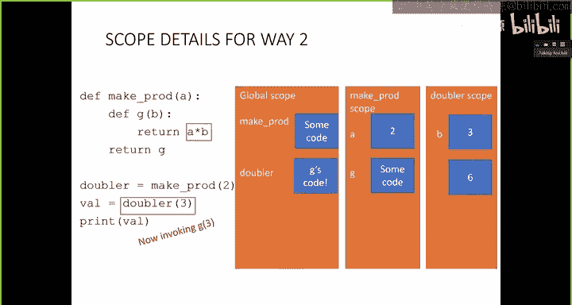

And so this vow will be equal to 6。

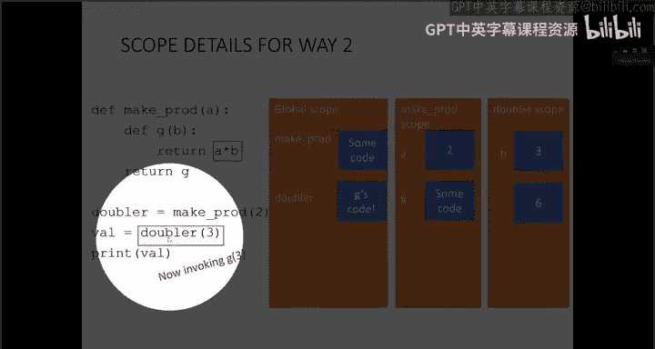

And that's it。Questions。Which one was easier to understand this one or the one where we did the chaining。

 Just show of hands。 Who liked this one more。Who liked the training more。Oh， interesting， okay。

Was the chaining just easier to grasp because there were less names， okay， cool？

I'm glad I showed it first， then。Any questions， though？呀。No reason。 In fact。

 you would want to do the chaining way because then you avoid extra lines of code。 And again。

 with practice， it just becomes really easy to know what's going on。O。So。嗯。

That might have been confusing。Why do we bother doing that， Because that particular example。

 all we were doing is multiplying to or I guess， doubling a number。

We could have easily written that code。To。You know。

 to double a number and without actually returning a function。

 that seemed way overkill for what that code was trying to do。Well。

 it was kind of showing you what you can do with an easy example。 And you would definitely never。

 ever write， you know， functions returning other functions for such simple examples。But。😡。

It's really a method for cases where you have larger pieces of code that you'd like to write。Because。

If you're trying to so， so if you're writing a larger piece of code， right。

 some software project and every single function you'd ever want to use is kind of defined at the top level in the main program。

It would become really messy。Right， and so there are cases where you would like some functions to only be visible or accessible by other functions。

 right， And so you'd only define those functions within the scope of other functions。 That's。

 that's one thing。The other thing is using this sort of chaining method allows you to have some control over the。

 the flow of control of a program。And so you can imagine in the pre， in the example here where。

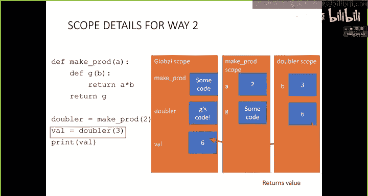

You basically create this， you you have this line here。 and at some point， you return G， right。

 and you don't want to do the doubling right away， right。

 so you don't want to do value equals doubleubr right away。

 You can imagine having a bunch more lines of code here that do other stuff before you actually do the the doubling。

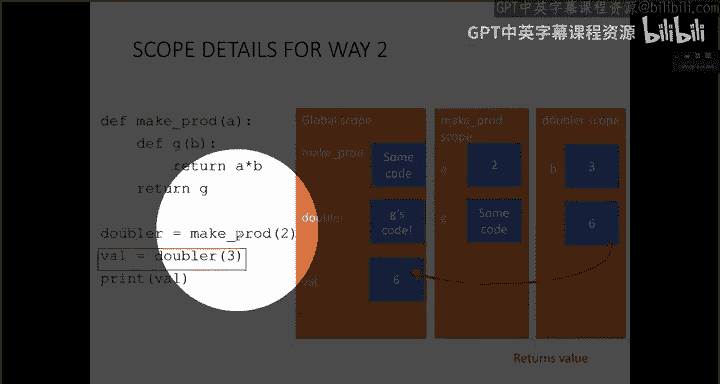

Right。And so in that， in that case， in this larger， more complex program。

 you're essentially interrupting the flow of control here。 You're not doing the doubling right away。

 but you did grab this function back。 and then you can maybe do other things with that function before finally doing the the doubling。

And so in that case， you， you can basically execute some code partially。

 do some other operations and then finish executing， you know。

 at the end after you've done these operations。So again， for this example。

 it doesn't make much sense。 but in a larger piece of code。

 it's this this idea of functions returning functions is just another tool to achieve these ideas of decomposition abstraction。

 which lead you to write more organized code， more robust code。

 more easy to read code and so on and so on。So you don't have to do this。

 but you do have to understand what it means for a function to return another function。

Any other questions？O。So now we're going to do the last piece of today's lecture。

 ideas of testing and debugging。This。This lecture is usually pretty dry。

 so I'm going to try to make it more fun as fun as I can。

 The reason why we introduce this lecture now is because I'm hoping that by this point in the course。

 you've had a chance to do some testing and debugging strategies on your own by kind of a trial and error thing on quizzes and on Pets。

 So you've gotten a chance to maybe use the Python tutor。

 you've gotten a chance to use print statements know various things like that and see what works best for you。

 what doesn't work at all， things like that。 So you've maybe gone a little bit burned by some of these strategies。

 but I hope that by you being burned by you know some things that you've tried that work that didn't work。

 youll maybe appreciate this lecture a little bit more than if I just showed you this lecture know back on day one or day two or something like that。

 because it's a lot of common sense stuff。 but there's a little bit of。

Actual strategy as well in this particular set of slides。So your programming experience so far。

 I know this is certainly mine is I hope that when I run my code， it immediately runs perfectly。

 But instead， what ends up happening for me is I run my code and it immediately crashes。

 I've got my red errors on the side， and， I get a little bit flustered。😊。

So this is exactly what happens， probably for you too。

And the idea here is that you want to write the code in such。

 a way that it makes it easy to test and debug。And I know I always say this。

 and I actually don't always practice it。 but it's important to write the code by writing it with。

By adding comments as you're writing the code， right， So writing specifications。

 writing comments for yourself as you're actually writing the code。

 not when you' finished it is very important。 It helps you as you're writing it or coming when you're coming back to it in a couple days。

Modularizing the programs also help。 So if you see a chunk of code that you're copying and pasting all over the place。

 you'll want to you know plop it out in a little function that you call multiple places。

 so ideas like that kind of employ this defensive programming mechanism and it allows you to perform really easy testing and validation when it comes time to do that and then possibly debugging when it comes time to do that。

So the lecture is gonna be divided into two pieces。 The first。

 we're going to talk about testing and validation。Some nice testing strategies。

 And then we're gonna talk about some strategies for debugging， as well。

So the testing and validation part is where you come up with a set of input test cases and expected outputs and all you're doing is running the test running your code to make sure that the expected output matches the output that you actually get from running the code。

The debugging strategy， the debugging part is where one of your tests don't match the expected output。

One of the outputs that you get don't match the expected output。 And at that point。

 you have to figure out why the code is not working。Obviously。So before you even test your code。

As I mentioned before， it you have to set yourself up to do the testing and debugging。

 So to ease this part， it's important to write documentation very well。

 So when you're writing your own function， not functions that we've given you。

 document the dock string。 What are the inputs you expect， What should the function do。

 What should the function return， things like that。

If you're writing the code in a sort of a strange way or if you use some piece from stack overflow or something like that。

 documented to make sure that if you're looking at it a week from now。

 you still remember what that piece of code did so really。

 really simple things like that can make a really big difference when it comes time to test and debug。

Breaking up the code obviously， into smaller chunks is very important because if you're copying and pasting the same piece of code over and over again。

 you remember to make a change in one place。 you might forget to make that same changes on in all these different places。

 And so that'll be very frustrating。When it comes time to actually run and debug the code。

So once you have code that's written。You would start the testing process。嗯。

You remove all the errors static errors， static semantic errors and syntax errors are really easy to remove。

 Python immediately tells you， right， index error on this line or syntax error on this line。

 Those are really easy to figure out。Using a paper and pen or typing it out on your you know your in your Python file。

 you come up with a bunch of test cases。And。For each one of those test cases， the way we， you know。

 the way we write on your microquiz test cases， you say what you expect the output to be。

 So when you actually run it， you don't need to remember what this output should be。 right。

 It's just written down on， down somewhere on paper or on the on the screen。

So when you're creating a bunch of test cases， you can create some different classes of tests。

So hopefully we're modularizing our programs， which means that we're creating functions。

The simplest classes of tests are called unit tests。 and these tests。Basically， test a function。

With different inputs。Okay， so what you're gonna do is come up with a bunch of different test cases for one particular function and run these test cases on the function。

If they all work perfect， but if they don't or if you find a bug as you're writing test cases in the code。

 you'll want to perform regression testing。 And regression testing means that as you find a bug。

 you add a new test case for them， or as you fix a bug。You make， you run the code。

 you run the same the same code with all of the previous test cases to make sure that the bug you fixed didn't introduce errors in a previous test case。

 Okay so you there's a bunch of iterations of unit testing and regression testing to test all of these different modules。

 all the functions in your program。And at some point， you're ready to do integration testing。

And in integration testing， you've got all these modules， for example， as you did in Hangman。

 you've got all these little functions， right， that do individual things。

 You put them all together into a larger program。 right in Hangman， it was， you know。

 a bunch of big while loop where you check all these different things that the user might input。

 and then you call the different functions you wrote。And as you find errors in the integration。

 when you've written code thatt integrated all these different pieces together。

You might have to go back and do more unit tests for some of the。

 some of the functions that you wrote。O。So you've done the unit testing。

 regression testing and integration testing。 What are some actual testing approaches。

 How do you actually create these test cases to run your code with。

So I guess the most natural way to write a test case is just intuition about the problem。

 So given dog string， what are going to be some natural boundaries， some natural values of X and Y。

 for which you test this code with。 You guys tell me。

 what's some values that we could test this code with。Think about the boundaries to the question。

Yeah，3 and 4 is good。 So x is less than y is a good one。Vice versa， right。

4 and 3 is another one where y is greater less than x。We could test them being equal， right？

 What about 0 and 0， What about 1000 and 1000。 So we could do extremes。

 We could do bigger than less than we could do equal things like that。 right。

 So mathematical functions are kind of easy to apply this idea to。

 because they just have natural boundaries。 But often there are functions which don't have these natural boundaries。

 And then we might be stuck doing random testing。 And in random testing， obviously。

 the more test cases you have。Of the better chance you have of finding a buck。

But there are actual techniques for coming up with test cases。

 So the first one is called black box testing。 Second is called glass box testing。Now。

 in black box testing， you're going to treat the code of the function。As a black box。

 So we don't even look at what the code is doing。 All we're looking at。

To guide writing our test cases is the specification， the dock string。Right，And so hopefully。

 the person who wrote this function wrote a really nice doc string because that's what we're going to use to write our test cases。

So the way that we're gonna write a test case for this square root function is by saying。

 what is the value of x and epsilon according to this， to these constraints here。Right， so obviously。

 we're not gonna test the code with values that don't match those constraints because the person who wrote this function doesn't guarantee that this function will work for those out of。

 you know， those， those weird values。So the good thing about black box testing is if we're the ones testing this function。

 we're only using the specification to write the test cases。 So if， for example。

 this person implemented square root using approximation method， I don't care。

 My test cases will work if the person changes their implementation to use the bisection method。

Right， my set of test cases will still work。 even if the person who wrote this function changed the。

 the， the black box， right， the implementation。So its black box testing is really nice in that respect。

And so for this particular function， here's a bunch of test cases that I would run it with， right。

 So obviously， x being a 0， perfect square， less than one are， are kind of， you know。

 nice ones to test irrational values。 And then a bunch of extremes is also good to test。😊。

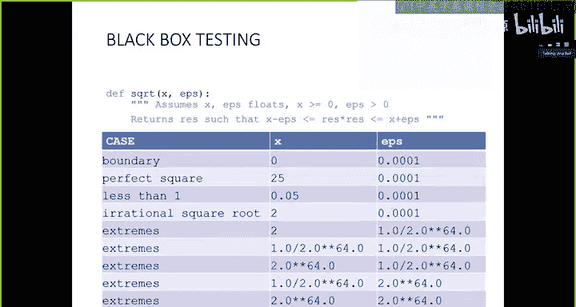

And then epsilon， the same。 We've got some reasonable values of epsilon and then some extremes。

 And we can even， you know， mix and match。 We can have zero and extremes epsilons and perfect squares and extremes epsilons and things like that。

😊。

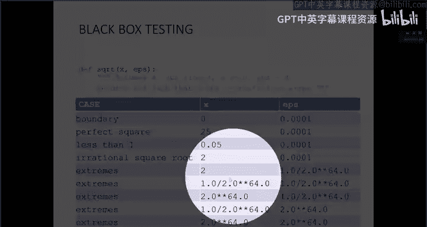

So lots more test cases than this。 But this is a really good start。In glass box testing。

 we're going to use the code itself to guide the test cases that we write。

So if we write something a test suite that's path complete。

 that means that we're going to hit every single path inside the program。

So that means we have to look at the code to guide the test cases that we're writing。

 which means that we're gonna have to write a test case for the code hitting the if part of a branch。

 We have to write a test case for the code hitting the else part of a branch or the L if part of the branch。

 If we have a for loop， we need to write a test case where the code doesn't go through the loop at all。

 it goes through once or goes through many times through the loop same with y loops。

 We write a test case so that the code doesn't go through the Y loop at all。

 it matches the condition once or it matches the condition many times So you can imagine that this glass box testing leads to a whole lot more test cases。

 especially when we have a whole bunch of different combinations of all of these conditionals and loops and things that we'd like to hit。

The problem with blast box testing and having a complete path path complete test suite is that we might accidentally miss a bug。

 So here's an example of a code that's not correct。 So it finds absolute value of x。

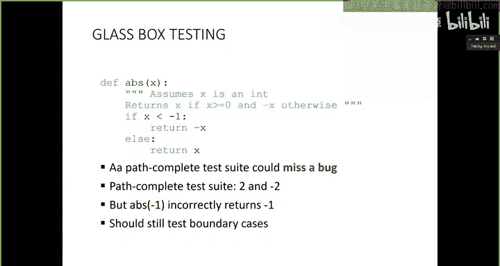

If x is less than negative 1， we return negative x else， we return x。

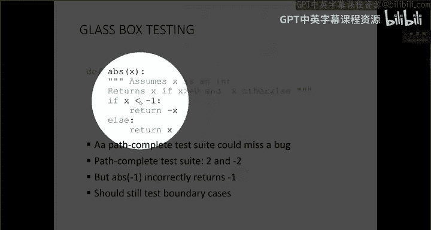

So a path complete test suite could be testing 2 and negative 2， the two。

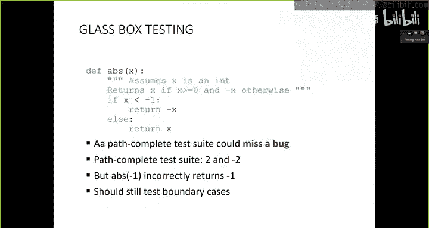

Brings us through the L。 So we return2， and the negative2 brings us through the if。 So we return2。

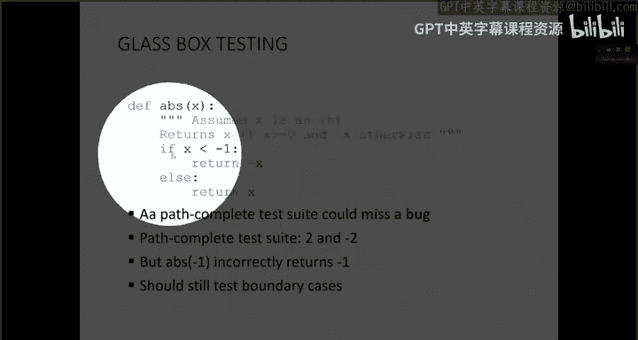

We might say this code works， but it doesn't， right。

 We already can tell that negative one is returned incorrectly as negative  one。

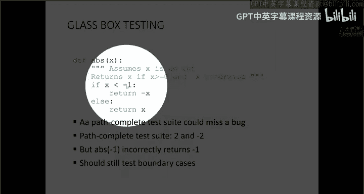

And so in addition to testing all the paths through the code。

 we'll also want to look at boundary condition， especially for conditionals when we do glass box testing。

Okay， so we have a go a whole bunch of test cases。 We've run our code with all these test cases。

 And then at some point， we've gotten an output from a test case that does not match what we expected to do。

Then we have to do the debugging process。And this is where， this is where。

A little creativity is required。 There is no recipe like there was in glass box testing and black box testing for writing test cases。

 There is no similar sort of， you know， recipe for debugging a program。

There is a lot of experience that's needed， right， a lot of times that you've seen a bug crop up in order to figure out sort of what the problem might be。

 And so a lot of experience writing code is very useful in the debugging process。嗯。

There are tools to help you do the debugging process。

 but there aren't many tools to actually do the debugging。 You kind of just have to do it。

 So there's tools built into into Ananaconda。 They're not very good。 I've used them。 Python tutor。

 obviously is a really good one， especially for small programs because you get to just go step by step and see the values of each variable as the code is running。

 So I like that a lot。 Print statements are also really good。

 but you have to know where to put them right And you have to use them effectively。So in that sense。

 you know， if you're not as familiar with print statements。

 Python Tutor might be a better better suited for debugging。But no matter what。

 it's important to be systematic， don't just start changing random， you know。

 random variables or random conditions and then run the code through the tester again。

 That's not going to work very well。When we see error messages in the debugging process。

 these are really easy to figure out。 right， index error。 Oh， shoot。 I got to check my indices。

 Maybe I went over。If you see an index error， you should probably print out the variable that you're indexing into。

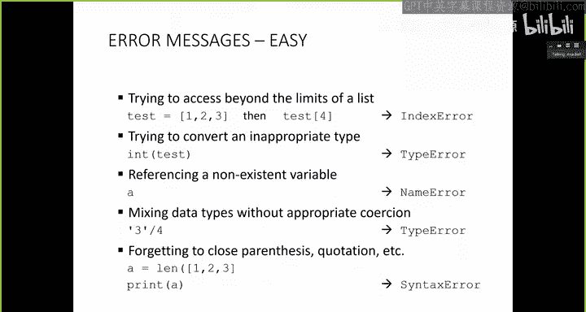

Are indexing with。Type errors。 Oh man， look， I'm casting a list to an integer。

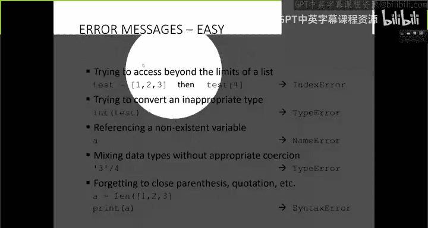

What is that going do， Nothing， It's going to give us an error。 Or here。

 I'm dividing a string by an integer。 Again， something really simple to fix Na errors， of course。

 here's I have a， here。 I have a variable that I've never initialized。

 And then syntax errors basically mean things like your indentations off or you're missing app parentheses or something like that。

Logic errors are a lot harder。 Okay， these ones， you cannot just look at the line and say this is where the problem is。

 These ones happen when your output is， does not match the expected output。And this is where。

Kind of engaging another part of your brain is very important。 I've definitely done this a lot。

 I've had some errors。 I went for a walk， come back， and I figured it out。

 I figured it out in the shower， or I figured out out in bed， right。

 So thinking a little bit before you even start the problem is good for this for these logic errors。

 drawing a pictures， taking a break， talking to friends。 All these are really good。

 explaining the code to something else。 Some else is also a really nice thing to do。

 That's me explaining the code for something we're gonna do in a couple minutes。 to my son。

 He's 7 now， and he's doing scratch。 So that's pretty cool， but he was helping me debug。

 And now I'm helping him debug。 Yeah， or you can explain code to some inanimate object like a rubber ducky。

😊，Now， having said that， you guys came on a good day。Because you will all。Yes。

To have your own rubber duck。Different kinds。 grab your personality， duck。

That matches your personality after class， I've got Minecraft ducks， giraffe ducks， princess ducks。

 police ducks。Elephant ducks， whatever ducks you'd like， Come grab one， use it for your quizzes。

 use it for your Pets， whatever you'd like to use it for。Go for it， okay。

So hopefully it comes in handy。Use it well。 All right。 So we're not quite done yet， though。E。Okay。

 so I will give you a little bit of。Debugging tips， though。

 So I know it's I said it's a creative process。 I said it's really hard to come up with a recipe to do the actual debugging。

 But there are there there is maybe one way one really nice way to do it。

 So the idea behind debugging is basically use the scientific method。 Like I said。

 don't just randomly change things expecting for it to work out。

 What you want to do is look at a bunch of test cases that failed。 It's possible that they're all。

 they all have something in common。 And that might lead you to a small piece of code in your program that is the one that you should be focusing on changing。

 right， So you want to look at the data form a hypothesis and try to see if another test case also fails that particular one。

As you as you're doing the debugging method， right， if you really have no idea about where to start。

Try putting print statements at reasonable places in the code。 So when you first enter functions。

 when you first enter a loop， write all the values of the loop variable and all the variables that you're creating in the loop or modifying the loop and things like that。

 And if all else fails， using the bisection method is a really nice way to try to solve the problem。

 So bisection method and debugging basically says put a print statement about halfway in the code。

If everything looks right for all the variables at that point， you know the problem is after this。

 If something is wrong， you know the problem is in the first half of the code。

 then put a print statement in the quarter of the code， right， And then at that point。

 see if the values， all the values at that point match what you expect them to be。If do great。

 you know， the problem is in the second quarter。 I guess， yes， the second quarter。 And if they don't。

 you know， the problem is in the first quarter。 Okay， so the bisection method is。

 is a nice way to try to debug the code。

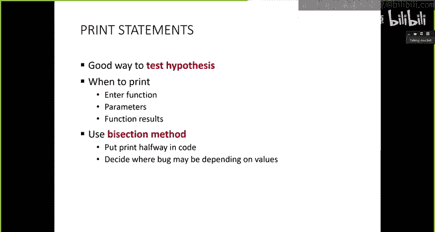

So what we're gonna do in the last bit of lecture is we're gonna debug some code together。

 That's in the Python file。 And then what I have is included in today's zip file is actually a worldle game that I wrote。

 it's like 12 underscore world dot pi or whatever。 And it's buggy。 So I I introduced some bugs in it。

 And I would， if you'd like to practice debugging， you can try to fix the wordle game to get it to work。

 And then you can play yourself or you can amaze your friends and get them to play your game in case you'd like to do something like that。

😊，So before we end， I would like to actually do some debugging with you just to show you the。

 the bisection method for debugging。So the code we're going to debug is this one right here。

And I've already included sort of the， the， the fixed code step by step。

 But we're going to talk through it together。So， this function。Is buggy。

It's a function called IP that takes in a list X。And it's supposed to return true if the list elements are a palindrome and false otherwise。

So， using the input。ABC B， A cast as a list。 So， you know， the input is gonna be the string A。

 string B， string C， string B， string A。 This list is a palindrome， right。

 because it's the same forwards as it is backwards。So if I run it， it should print true。Okay。

 so that test case worked well。But now， what about the second test case。

 surprise it's not going to work？If I pass in the list A B， right。

 So my input is gonna be the string， A and the string B， this is not a palindrome。

So I expect it to print false， but it prints true。So I have a nice test case here that I can。

 I can make fixes with and see whether it actually gets fixed。 Now， of course， A， B， C， D E， F， G， H。

 I， J， K L M， this also doesn't work， right， So this is another test case that's not going to work。

But I don't want to use this long one as my test case。

 I want to use the simplest test case I can find that doesn't work。 right。

 So A B seems like a really nice one to test with。O。

So now the first thing we want to do way that we figured out the input I'd like to test with is put a print statement at about halfway through the code。

 Yes， there's only like five lines of code here。So there's only probably one place that makes sense to put a print statement。

 but let's just work with me here。 So the print statement。

Could be put right here right before the if statement， right。

 So I've got two lines of code that do something and then an if。

 So let's just put it right before the if。Scroll down， step 2。 Here I go。

 I've put my print statement right before the if。Now we can run the code again。

 So I'm not gonna to run the one that worked to Let me try to run the one that didn't work to figure out what the problem is。

 So I run this。The print statement is printing the temp。 So the reverse。Of X and x。So。

 what I'm expecting。In， and I should have probably written this over here。 What I'm。

 what I'm expecting to get。 What I'm expecting is to see the reverse of A， B， So B， A。

 and then the original X， A B。But， I don't。So I see A B and A B。 This first one should be B。

So already， I have something that's unexpected。 And so I know the problem is going to be in these first two lines of code。

 right， somewhere in here。Alright， so then what I would like to do is figure out which one of these lines of code is the problem。

 So I'm going put another print statement a quarter of the way through the code。Okay， well。

 there's only one more place to put it。 So let's put it in here。

 I've got another print statement right before the reverse。

So what I'm going to be checking is before the reverse。

 the value of my temp variable and my original variable。And after the reverse。

 the value of my reverse variable and the original variable。

So what I'm expecting to see is this one here， they should be the same， A， B， A， B。But this one here。

 I'm expecting to see B， A， A B。So run it with this buggy example。So before the reverse。

 I'm expecting A B and A B。 And I do get that。 So that's good。 I'm happy to see that。

 And then after the reverse。😊，That's my problem， right， I'm expecting this one to be reversed。

 but it's not。So now I know the problem lies here， temp dot reverse。

 because here in this print statement here， temp and X were as expected。

So what do you think the fix should be to the reverse， yeah。Yeah， exactly。

 We need to add parentheses。 This is a function。 We need to call it like a function， right。

So let's do that fix。We've done it here。 So here I've added the parentheses to the reverse。

And run it again。 So now what I'm expecting is before the reverse， I need to see A， B， A B。

 So this one should be the same。 It shouldn't change because I didn't do anything to that temp equals X。

 And after the reverse， I'm expecting the temp to be B， A。And the x to be A B unchanged。 right。

 let's run it。So before the reverse， everything looks O。 Temp and X are the same。After the reverse。

 look at that， I've got my B， A as my reverse variable。 I'm happy。😊，But then， my X has also changed。

I'm sad。Yes。Exactly。There's a clue。 right， we， we see a clue。 We've made a change to temp。

And X has also changed。 So as was suggested from the back， we need to make a copy of X。

What we've done here is called an。When I did 10 equals x on a mututable variable， what did I make。

An alias， exactly， right。So let's make a copy of that X。Right here。哎。So hopefully。

 that fixes things because I've run out of lines to fix。 So we run this code again with A， B and。

See the output before the reverse temp and X should be the same， and they are。 They're both A B， A B。

 And after the reverse， the temp should be the reversed B A。And it is。

 And the X should remain the same， A B。And。It's false。 So it's not a palinro。

Last thing I need to do is double check my original test case。

 the one that actually worked before I made all my changes to see whether it still works。And it does。

So that particular list is a palindrome。 So that still returns true。So that's it。

 So I've got a couple just one， I guess list comprehension for you to try on your own to write。

 And then， of course， the buggy wordle game for you to try as well。

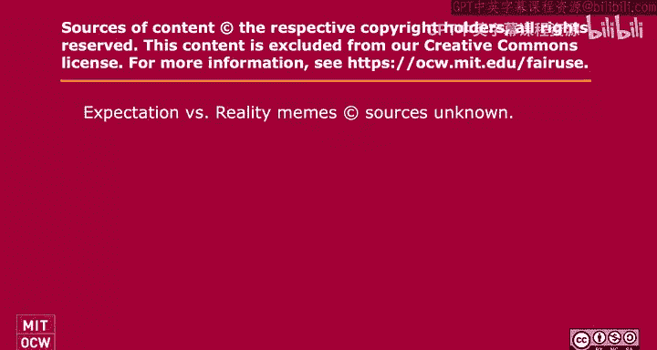

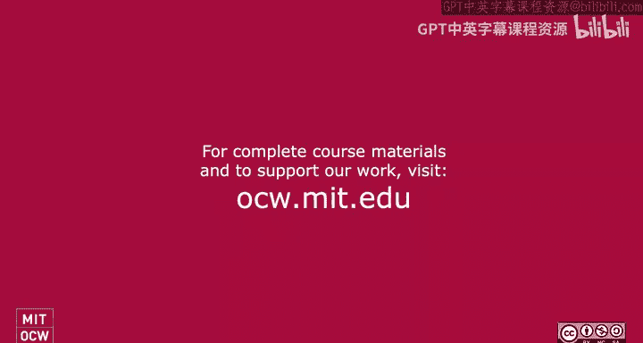