# 《计算机科学和Python编程｜6.100L Introduction to CS and Programming using Python, 2022》 - P13：-13-Lecture 13_ Exceptions and Assertions.zh_en - GPT中英字幕课程资源 - BV1PAxJzVEs3

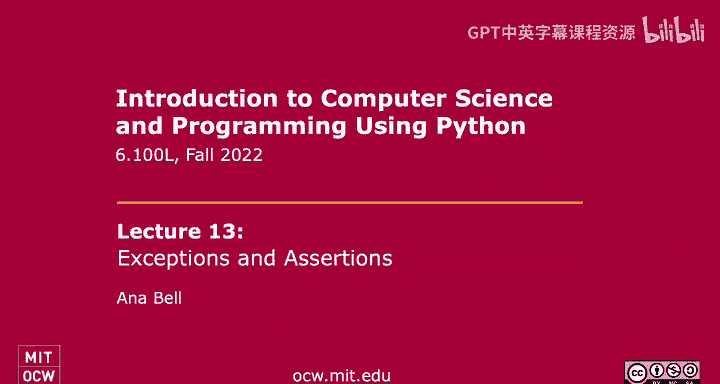

Alright， welcome， everyone。 So in case you missed last lecture。

 I've got some extra debugging buck debugging ducks。😊。

That were left over from last lectures debugging lecture。 Please take them home。

 I don't want to have to take them back to my office and then bring them back so many times。

 So please give them a good home。 If you find them useful in your debugging strategy throughout your programming careers。

 I suggest you upgrade to carrying a debugging a duck with you everywhere， as I have on my phone。

 I use it in my day to- day life。 So that's just the next step beyond an actual duck。Alright。

 so let's get started on today's lecture。 We will be going over the idea of exceptions and assertions。

 And these are basically those scary red errors that we get when our program crashes。 Okay。

 today's lecture will hopefully shed some light on exactly what these exceptions are and how we can actually use them to our advantage in our code。

 So let's start by talking about exceptions。😊，So when you run your code。

 usually it runs without without error， produces the right output all the time like mind does。

 But sometimes it so happens that your code hits an unexpected condition。

 And when that unexpected condition is run， you get an exception to something that was expected。

 So we've already seen a bunch of different exception examples。

 So we even talked about a couple of these last lecture。

 So we've got index errors where you index too far into some list。

 type errors where you're doing funky things with types that Python doesn't like。

 syntax errors are also exceptions， name errors are also exceptions。

 So a bunch of these errors that we've encountered are types of exceptions。

So it turns out so far in our programming experience that whenever we get an exception。

 the program immediately crashes。 and really， we don't have any way to handle these exceptions。

 We just accept the fact that it crashed and we go back to the debugging board。

But it turns out that in Python， we can actually write code to handle these exceptions。

 So if your code does happen to throw an exception。

 So an error occurs or something unexpected happens。

 you can write code that deals with that situation and either decides to ignore the fact that an error occurred。

 set some default values or just， you know， let the or just raise your own exception and move on。

 So we're gonna see a bunch of examples of these of these cases。

So the way that we deal with exceptions is using some code blocks， okay。

The way that we handle exceptions is using these try and accept blocks。 So the way that we write。

An exception handler is to put some potentially problematic code inside this try block。

 So the try is a keyword in Python。 So obviously， you can't name a variable try or anything like that。

 If you type it in your code， you'll see it turns blue and try tells Python that you're starting a code block that contains some lines of code。

 You'd like Python to execute。 So just normal code。

If Python is able to successfully execute these lines of code without an exception being raised。

 So without the program crashing， then nothing happens。 Nothing is run inside this except block。

 and the code just continues as normal。But if it so happens that in that code that you ran。

 something strange has happened， and the code would have crashed。

The code actually doesn't crash because we can catch the exception that gets raised inside this accept block。

So if we have an associated accept block。Over here to a try block from here。

 Pythons is going to try to run this potentially problematic code， and if an exception is raised。

 it will stop running any further lines inside the try block and immediately hop to the lines in the accept block。

 and the lines in the accept block will then get executed。

So to just kind of draw a parallel to if I were to kind of say this in terms of if and else。

 the way that I would describe the try and accept blocks is I would say if。

And then I would put all the potentially problematic lines of code that I'd like to write inside this condition for the if。

And if all of these lines of code managed to successfully run， then nothing else happens。

 The inside of this if is essentially just a pass， and we don't execute the else。

 And then we just carry on with the rest of our lives。

But if there is some line of code here that we're trying to run that crashes or that causes the program to crash。

 Python will say， no， I'm not going to crash just yet。 Let me see what the code would like me to do。

 And so we'd hop inside this else。 And then we'd do something to handle the problem and。

The something we do is inside this accept block。 So again， this is not code we'd ever write。

 It's just kind of a way to draw parallel with what we know so far。

The code that we would write is this try a bunch of code。

 except do something you'd like do do some lines of code if an error should come up in the。

 in the try block。So let's look at some examples with code that you should be able to write at this point in the course。

 So we have some code on the left here。 It's a function called some digits。

 And we're writing this code without any exceptions。 Okay。

 We're just writing it as if you were given this code， you know， on a quiz。

 What would be one solution。

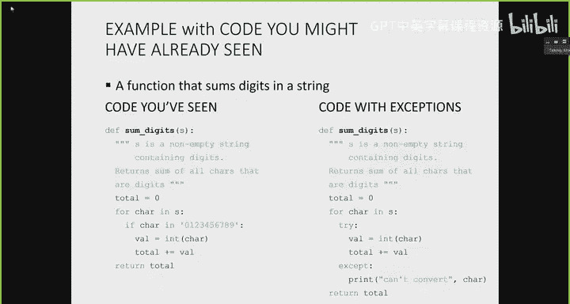

So this sum digits takes in a string S。And we say it's non empty containing some digits。

 And I want to return to sum of all the characters that are digits。

 So I don't actually say anything about whether this string S contains non-digit characters。

 But let's write it in a robust way anyway。 So the we'd have a loop that goes through every character in that string S。

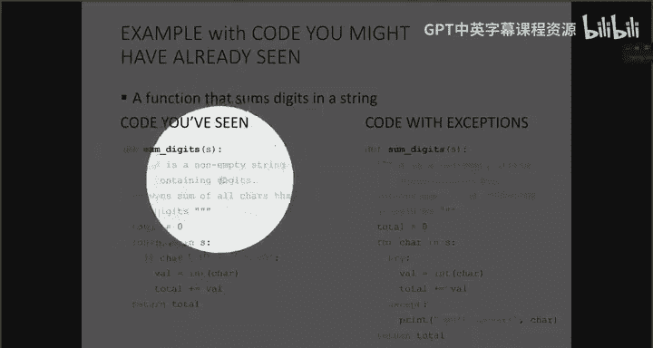

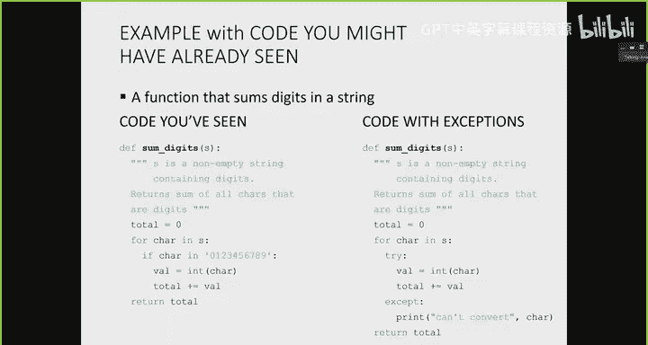

And I'm using this in keyword here， this nice little trick here that says if that character。

 so whatever character it may be is inside one of these is inside this string of digits。

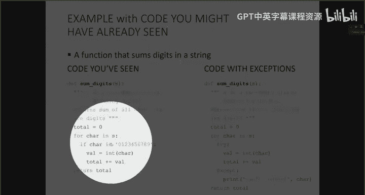

Then I know it's a number。 sorry， I know it's a digit。And I'm going to cast that digits 0 through 9。

 whatever it may be to an integer。

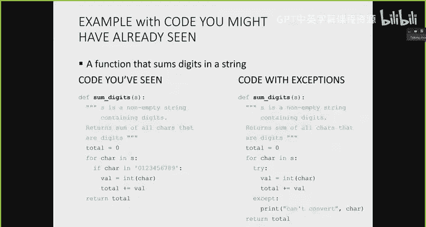

Add it to my running total。 And then that loop does its thing until it's done。

 And then I return the total。

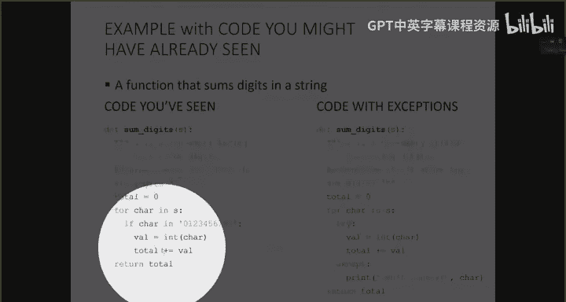

So in terms of running the code。This is just as I have it on the slide。 So here。

 if the user gives me the string 1，2，3， I'm gonna sum 1 plus 2 plus 3。6， perfect。

And if the user gives me 1，2，3， and then some random characters that I know I can't add。

 Python will still， will still be able to evaluate it because that if statement will not be run。

 right， for A B and C， we don't go inside the if。 so there's no need to cast anything。

So the code still works。If I didn't have this if here， right。

 if I decided to just cast to an end every single thing that comes my way。

The first line of code will still work， but the second line of code will throw an exception。 You see。

 I have on right hand side my scarier red text that says value error in literal for int with base 10 a。

Kind of。Hard to parse。But after you've seen a bunch of these。

 you'll figure out that there's something going on with my types。 and then I'm trying to cast。

 you know， I'm trying to cast to an integer the the string A。 And obviously。

 it doesn't know how to do that。So that's the potentially problematic line， right。

 Caing to an integer。So let's try to write the same code。

 except that now we'll do it with exception handling。 Okay， so a bunch of it is going to be the same。

What we're gonna change is the potentially problematic code is this， these two lines here， right， I。

 I don't need the if anymore。

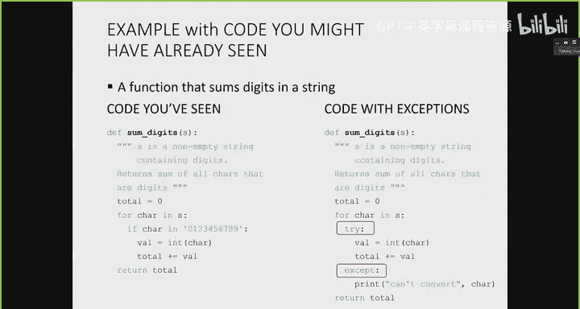

Instead， I'm going to just assume I can cast every single character to an integer。

 and I'm going to try to do that。 So I'm going to try to cast every single character to an integer and and then add it to my running total。

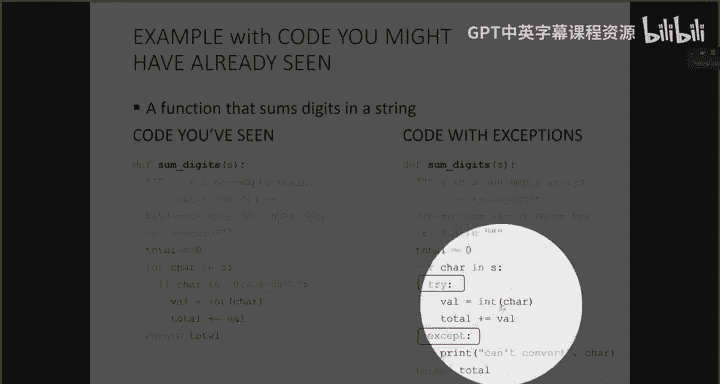

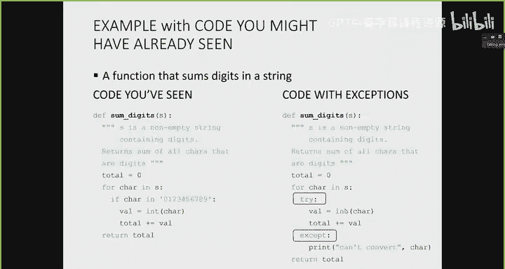

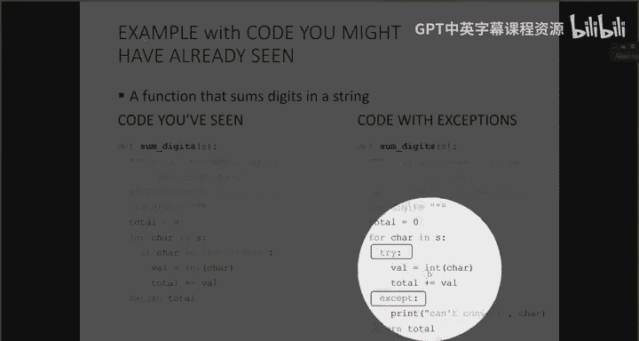

Most of the time that's going to work if the input is a digit。

 but sometimes the users give me something that's non digit。In that case， you saw what happened。

 The code throws a value error。

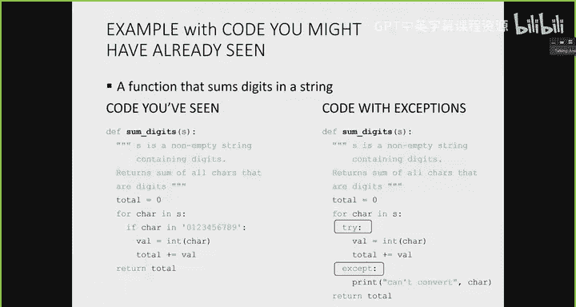

So if we didn't have the accept block， nor the try block， the code crashes immediately。

 no answer is even given。But with the accept block， Python will say， oh。

 in this particular for loop run， I had an exception raised。

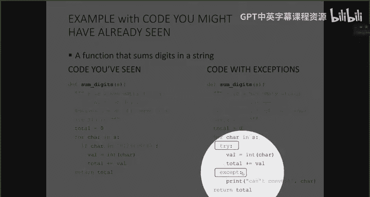

So I'm gonna execute whatever is inside the accept block。

 And the accept block says print can't convert。 And then the character that it couldn't convert that time through the loop。

And then that loop iteration is done， and it goes on to the next character in the sequence。

So let's run the code。And。This is the sum digits with the accept。

 So here I've got the user giving me perfectly fine input。 No exceptions were raised。

 The code worked well。If the user gives me some characters within there。The loops go through。

 It adds 1 plus 2 plus3。But then when it tries to cast to an integer， the A。Over here， right。

 as as the iteration goes to a， it's going to say this raises a value error。As we just saw。

And I'm gonna execute whatever's inside the accept block。 So print couldn't convert character。

 There it is。 And then I actually gave the user the character it couldn't convert。

It goes on to the next iteration， the next character in the sequence， the B again。

 tries to convert B。 It can't cast it to an integer。 So we print couldn't convert B。 And then lastly。

 the C， same with the C。Does that make sense， Is that all right， so far。

So kind of like a little if else situation going on here。

Nice places to put try accept blocks are when you're dealing with user input。Because the users。

 when they give you some inputs， right for using the actual input command。

 they're very unpredictable。 We don't know what kinds of things they'll give you。

 even though you give them clear instructions to tell me one number。Or tell me another number。

So in this， in these three lines of code。Down here。I've got the user giving me two numbers。

 and then I print the first one divided by the second one。So I'm a nice user。 I do what I'm told。

 So I'm gonna to do 5 divided by 8。 perfectfect。 The code runs well。😊。

Let's say somebody else runs the code。 And this time they decides， they decide to do 7 divided by。

 I don't know 5 like that。Value error。So that's one thing that could go wrong。

 the user tries to be funny。And then another thing that could go wrong is。

 let's say the user gives me a0 for the second number。So in this case， I get a zero division error。

 You can see Python doesn't know how to divide by 0。 So it it raises an exception。 this thing。

 zero division error。So these are this is a case where I'm dealing with potentially problematic input。

 So I'm gonna wrap my potentially problematic lines of code in a try and accept block。

 So I've got those three lines that I'm gonna try to do。 And if anything goes wrong， I'm gonna。

 I'm going to execute whatever is in the accept block。 And all I do is。

 is say print bug in user input。So let's run that， that's this one here。So here again。

 proper input works well。If the user gives me a letter。Bug and user input。 So a much nicer。

 friendlier way to crash the program， right， than， you know， value error or whatever it was。

 And then again， if the user gives me a0 bug and user input。Again。

 much nicer way to crash the program。So what we can actually do is give specific。

 have have specific behaviors， depending on what exceptions are raised， right。

 So maybe I don't want a generic text that says bug and user input for both of those cases。 right。

 Maybe if the user divides by 0， I want to give them a different message。

 than if the user gave me a letter， right。So in that case。

 what I can do is I can have different except blocks for every different error that I know might come up。

 right， So as I'm writing this code， I can think ahead， right。

 and I can try to catch specific errors。 So here I can catch the value error。

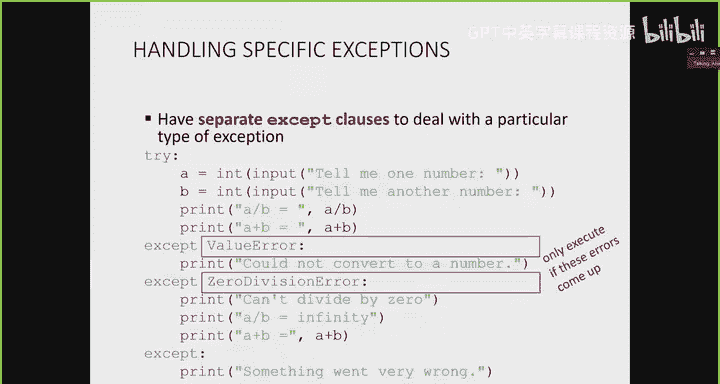

So I say， accept， and then I say the name of the error that I'd like to catch。And this block of code。

 this except block of code， will be run only if the code in the try block crashes with that specific value error。

Right。And then I can also catch my zero division error down here。 And in this particular case。

 only this this except block is only run when the zero division error is raised， right。

So here in the value error， I'm gonna print for the user。 I could not convert to a number。

 So a more specific error message。 So they know what's up。 And in a zero division error。

 I can also flag that there was an issue。 I can't divide by 0 by printing that to the screen。

 And then I can say， you know， a divided by B is infinity， and I can continue。

The last statement that was supposed to be done in the tri block， A plus B。

 I can give the answer to a plus B because we can add a 0 to to a， no problem。

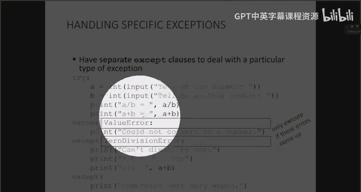

The last except block down here is capturing anything else that's not a value error and not a zero division error。

 So I can't think of anything that would go wrong。 So if we happened to go in here。

 something went very wrong。I would say the only thing I can think of is if our computer is almost out of memory and running this little piece of code pushes it over the edge。

 right， then the Python will probably crash and maybe it'll print that error before completely shutting down the computer or something。

But that， that last one should never really run。So let me show you what happens when we run the code with these specific accept blocks now。

 So if the user gives me perfectly nice input， then the program proceeds as normal。

 Every line of code inside the try block is executed。 Over here。

 None of the accept blocks are executed。😊，The user gives me a letter。

I end the program gracefully with the message could not convert to a number。

 so then they know that I caught them。And then the last one is， if I try to divide by 0。 again。

 I've got the little message can't divide by 0。 and then I give them their division to be infinity and a plus be 6。

 So I do all the lines of code that are caught over here。Question so far。Seems all right so far。O。

So really nice ways for us to deal with with exceptions that get raised in our programs。 Now， the。

 the things that I that I've told you that we can associate with a try block is an accept block。

 right？ So we've done that。 but we can actually associate a couple other things with try block。

 And we don't really use them in this class。 But I just thought I'd mentioned them。

 So if you have an else block associated with a try block。That means the。

 the lines of code inside the else block will execute whenever everything inside the try block is executed perfectly。

So if everything goes according to plan， whatever you put inside the else block will also get executed。

And then you can have a finally block， as well。So， you know， just like we have a try and accept。

 you can also have a finally associated with those。 and the body of the finally will be executed。

 no matter what if an exception was raised， you also execute the finally。

 If the code work perfectly fine without raising any errors， the finally also gets executed。

 So I gave an example here of something that you might put inside the finally block sort of cleanup code。

 So if you're you know writing code that opens files from the file system。

 a good idea is to close them before you finish your program。

 So that's something that you might want to do inside the finally block。

 Just close files before shutting down before your program terminates。Okay， so。

I've shown you how to deal with exceptions。 But now， what do we do inside the accept blocks。

 We've done a couple different things， mostly printing out that something went wrong。

But we can do various other things。One thing， and I don't recommend doing this is to just fail silently。

 Certainly， we could write code that basically， you know， has， yeah， there's a question。有。

So this is an else that we'd associate with a try。 So we would do something like else。

 And then you would， you know， print something here， success or something。

And then if the code executes perfectly without an error， then you will also print success。Yeah。

So what do we do inside the inside the accept blocks。 One thing is to fail silently。

 which means that， well， you could say， you could try your entire piece of code and then you could say accept。

 And then the only line you haven't except is maybe a line that says pass。

 So that means any error that happens。 you would catch。 but you'd do absolutely nothing。

 and let the program continue with a potentially bad value being passed along。

 That's not a good idea。 You could also silently substitute values that。

 you know might be might be problematic without， you know， flagging things happening。

 also not good ideas。At the very least， you should flag something to the output that something weird has happened。

Another thing you could do is return some error value so you could have a whole bunch of variables in your code that you could set to some values like flags kind of thing。

 When your code runs into an exception block， right？

 But the problem with that is that you have to now check for all these values further on in your code。

 right， So now your code becomes overly complicated because you have a whole bunch of extra variables。

 you're constantly checking to see if any errors were flagged or something like that。One last thing。

 and this is what I'll show you you can do is to actually still stop the execution。

 So much like when we input， when we tried to run the。

 the sum digits program and it crashed with a value error， we could still make our program crash。

But it's on our own terms。 So we can raise our own value errors or whatever kind of error you'd like to raise with your own custom message。

So the code still crashes， which is fine because maybe you don't want problematic codes to move on。

 but you're basically having a crash with a custom message and a custom error type being raised。😡。

So this is a keyword in Python。 You raise your own value error and then app parentheses。

 you put whatever message you'd like to put。So here's an example of the sum digits where we raise our own exception。

 So let's say that indeed， we only wanted the user to give us digits。

 and we don't actually want this function to keep running and passing along the total。

 if the user ever gave us a string that contains letters。 right， So in that particular case。

 I'm going to still put a try block。

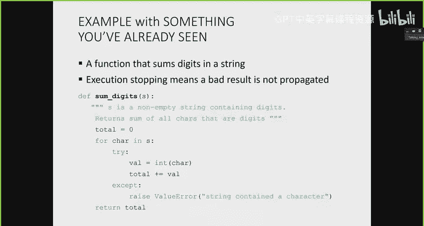

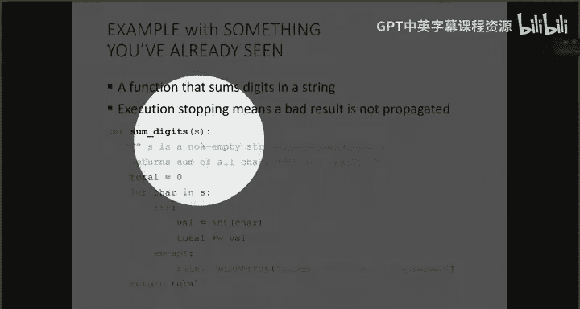

And an accept block around a try block around the problematic code and accept block to catch any errors。

 But now， instead of printing something and letting the code carry on with the loop。

 we're going to raise a value error。With our own message。

 So my message is that this string contained a character。So if I run this code。

And it's actually up here。 If I run this code with perfectly fine inputs， there's no issue， right。

 we just calculate the total as we want。 but if the user gives us some code that some string that does contain extra characters。

 which maybe we don't actually want。To have happened， you see I still have a value error。

 which is the same kind of exception that was raised without the try and accept。

 but now the message that I've passed in is string contained a character。

As opposed to invalid literal or whatever that， you know， that cryptic message was。

So this is a much nicer way to， to flag or to to stop the term stop the program。

 to terminate the program， but do it on your own terms。

So let's have you work on this for a couple minutes。 You'll raise your own value errors。

 I'd like you to write this function that's called pairwise division。 It takes in two lists。

 The lists should be not empty and they're equal length right So as per this example。

 here's two lists that are not empty and they're the same length。

 And I would like the code to basically go element by element。 and create a new list。

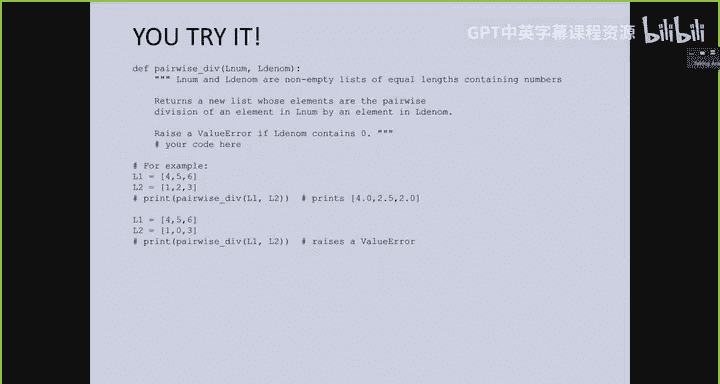

Where each element is going to be， for example，4 divided by 1，5 divided by 2 and 6 divided by 3。

 So pair wise， you do the division， put all those elements in a new list and return that list。

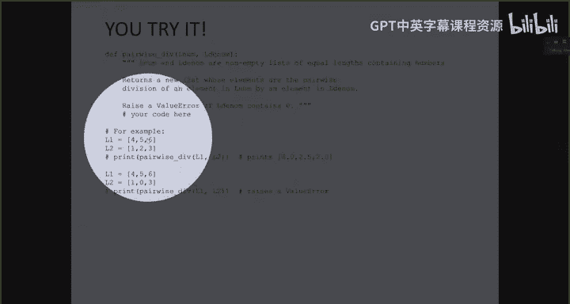

If。

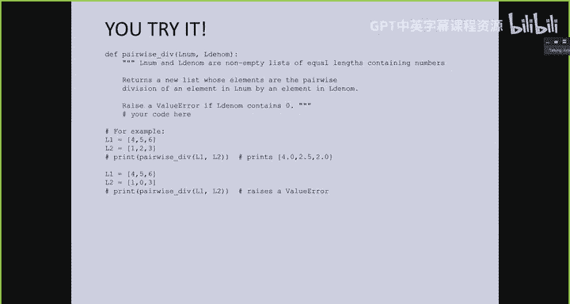

The denominator。 So the， the second parameter passed in L denome contains any zeros。

 raise a value error。

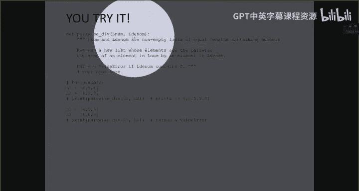

So don't let the code crash with this zero division error。

 but instead raise a value error with a nice message。

So start with just the code to do the task and then add the value error bit。

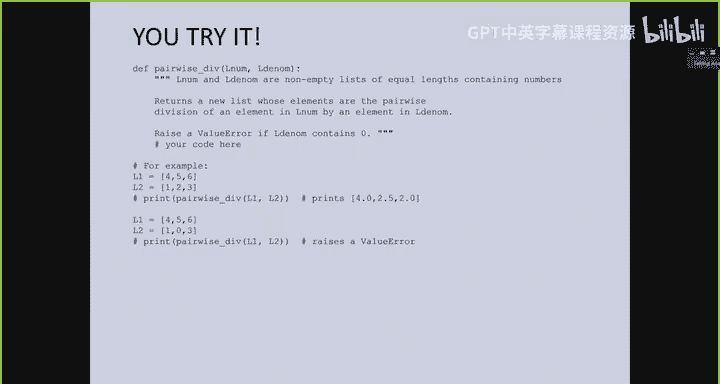

At the end。

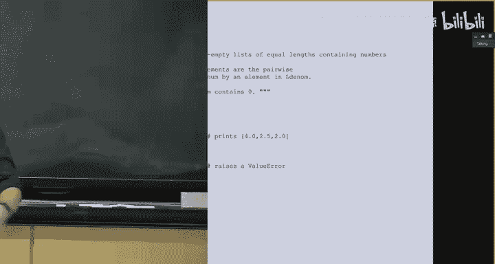

Okay， does anyone have a start， How would you like to solve。This problem。

 How do you want to write it。呀。Yep。L numb at I， divided by。Oh D。hi系。So we do the division 4 I。And。

So here， what is I， Is it the element or is it an index。Yeah。

 so how do we grab like basically numbers zero through the length of one of these lists？

If you w to do。Yeah， so we have to do range。 Remember， yeah， range， L， Elna， yep。

I think those are my parenthesess。Cool， that you did list comprehension right away。

Does anyone want to rewrite this using if or using a loop？It's two。 Oh， yeah， good。一。Out。

So we still want to use the index， right， because if we're looking at the element in L nuum。

It's gonna be hard for us to grab the same element in Eldino。

 So let's iterate through the the like 0 through the range， right， So basically what we did up there。

 range， L， and then pick one of them because they're the same length。

So now let's change this to I just so we're not confused。 I would say I is 0，1，2，3，4， right。

 So now we know this is the index。 So with this index in hand。This is the right start， right。

 L nu at I gives me the element in L num。Divide by L D No， exactly at I。Yeah。We can do L dotta pen。

Something like that。We can't say L at I equals that， because our L is。Not made。 exactly， yes。

So we could do like this。So this is just another way。And then at the end， we can return。Our variable。

 right？Okay， so that solves our problem。 How do we add the piece where we raise a value。

 So how do you want to check that there's a。That L Dome has a0。

Cause this should hopefully run work with our code without。Oh， oops did I do it twice， Sorry， yes。

 I did。 Let me just comment one of these out。Oops。😔，So how do I add the piece about value errors？呃。

Yes。Yep， so we can pop this into a try and then accept。And raise value error。

And with some nice message here。Nice message。And we can also put the entire for loop under the try。

 The code is not very long that it does。 it， it wouldn't make a difference。Right。

 so if we try to run it like that now， I've got my value error with my nice message。Another， yeah。

 another way we could raise the value there just for completion sake is to say something like you can even raise things inside if statements。

 They don't have to be part of except blocks before we even do anything with the code。

 we can say if 0 is in L D。Raise value error。 That would also be a fine thing to do。

So we can raise values wherever we'd like。So now I'd like to talk a little bit about assertions。

 So assertions are actually still exceptions that get raised。

 They're just a very special type of exceptions that we mostly use as a defensive programming tool。

 so。😊，Asertions are basically used to enforce these contracts that we make between somebody who writes a function and somebody who uses a function。

 So that's basically the function doc strings， right， when we talked about doc strings。

 I said that it's very hard for us to enforce the the text within the do string， right。

 because it's just the person who's writing the function， saying， you know。

 the input list should not be empty or， you know， the input to input lists。

 like in the previous example should be the same length。

 And there's no ways for us to really enforce that。 It's just something that's nice to have。

 And we're gonna to guarantee that the code runs if these things are upheld。

But it turns out that assertions are actually a nice way for us to add to a nice thing to add to our functions that do try to enforce these。

 this contract through the specification。So the way we create an assert， we say assert。

 and I'm asserting that this statement is true。 So if I want that the input length for function to be nonze。

 I would assert that the length L is not equal to 0 or something like that。

And if the assertion is true， right， If that condition is met， then the code carries on as normal。

 But if the assertion is not true， then Python ends with an assertion error and then some message。

That the condition was not true。 And these are really nice because it halts the execution of a program as soon as that contract is not held。

 right， As soon as something within the specification has gone wrong。

Then the program terminates with those assertion errors。

 and it's nice to see them because if you're debugging your code。

 you don't want to propagate bad values or you know or bad values through functions because that value might get propagated later and later and later。

 and then it would make your debugging very hard so if you stop the execution as soon as something is just stranger off as in something like an an assumption on parameters not met。

 then that's that's good。So in our sum digits example， here is the code that we wrote last。

 So total down to the bottom is exactly what we had before。

 All we're going to add is this assert statement up here that the length of S is not empty because part of my contract here is that S is a non empty string。

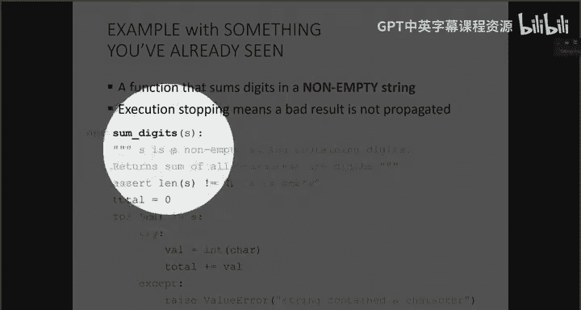

Right， so that's a nice thing to assert。 If the user ever gives us an empty string。

 the program will terminate。So in this example here， I've got。The sum digits with the assert。

 So if the user gives us an empty string。No total was created。And the assert was immediately false。

 right， So length S was equal to 0。 The assertion error was raised with the message S is empty。

 So what I had here。If I have。Fine input。 Then no assertion is raised。

 and the code carries on as norm。 So that's nice。So let's have you add one more line of code to your the program that we just wrote。

 just add an assert statement that enforces the contract。

 So I have El Nm and Eldum are non-empty lists of equal lengths。

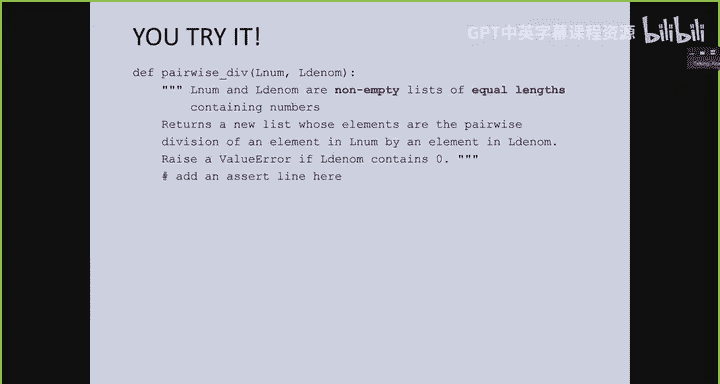

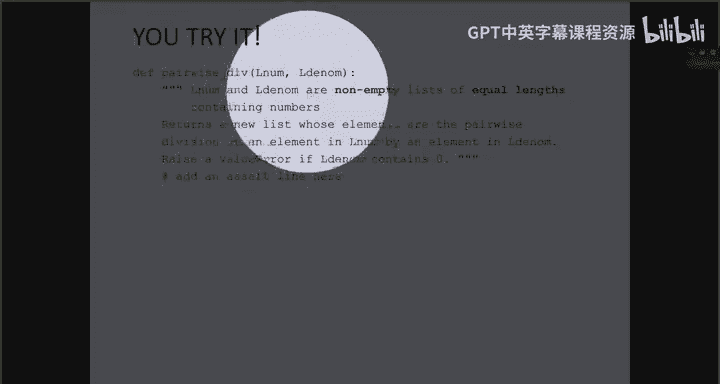

So you can do this all in one assert statement， or you can put two separate assert statements with two separate messages。

 However you'd like， it is fine with me。 So I'll give you a minute to work on that。

 and then we can write it。Art。What assertions should I put in here？Yeah。

So the thing I'm asserting should be true。 So I， do I want them to be equal。 Yes， exactly。

 So we I want L L nu to equal L。L。てい。Yeah， data like that。 Yep， that's one。So the thing you want。

 you're asserting that this is true。And if not， comma。

 we're going to put a message right list lengths different or something like that。

Do you want to do the other assert statement or does somebody else want to take a crack at the other assert。

So the other one is that they are non empty lists。呀。Yep， so we can definitely do that。

 not equal to zero comma。MT list or something like that。要。Very nice。

So here we're trying to enforce our nice contracts and I've got two examples down here。

 so here I've got two different lengths of lists， so there you go， my assertion has raised。

 was raised with the my nice message lengths differ。

And then the code would immediately stop and it would force us to check to see why these lengths are different。

 so these bad lists won't propagate any further if I had larger pieces of code and then same here。

 I've got this assertion error that I have an empty list。Any questions so far。O。

One more example I want to go through。 I'm not gonna actually run this one。

 but it is in the Python slides。 I just wanted to give you another example of how we can use exceptions and assertions in just a different setting。

 And it hopefully shows that as a programmer， you get to choose how how you add these exceptionions and assertions。

 right， So wherever they they seem reasonable to add。 you should add them。

 So in this particular example， we're assuming that we have a class list in this case。

 I only have two students in my class。 So these are their their test grades。

So I've got a list that looks like this。 It looks complicated， but I'll walk you through it。

 This is one student。In my list。 And this is another student in my list。

 So I've got a list of lists right， where these things that I've highlighted and read is my students。

And for each student， I have more lists as part of their sort of information。 So the first。List。

Related to one student is their name， right， The first element is their first name。

 Second element is is their last name。 And then the second list for that student is their grades in the class。

 So just another list of all the grades in the class。开。So what I would like to do。

 and this is the code I'm gonna I'm going to go through is， what I is I'd like to create a new list。

Based on the original test grades that contains the same information as before。

 So you can see I still have two lists of students， the first row in the second row。And in。

 in each student's information， I again still have their name and their list of grades。

 But I'm adding one more item at the end。For each student。

 which is the average of the list of grades。 So I've taken the average of these and plopped it as my integer or float at the end。

 And same with my next student。So the code that's going to do this looks like this。 I've got。

 that's just the original list to give you an example to look at because I find it hard to。

 to see things without examples。 So this is the code that gets the stats for the class。

 So that creates this new list containing my average at the end。

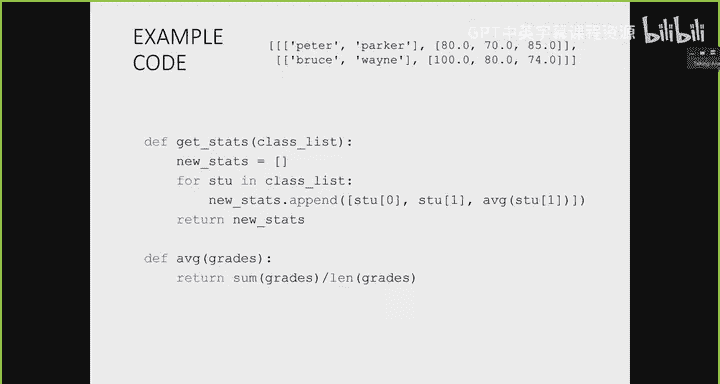

For each student in the class list， so for example。

 student here do is going to be this list of two lists。

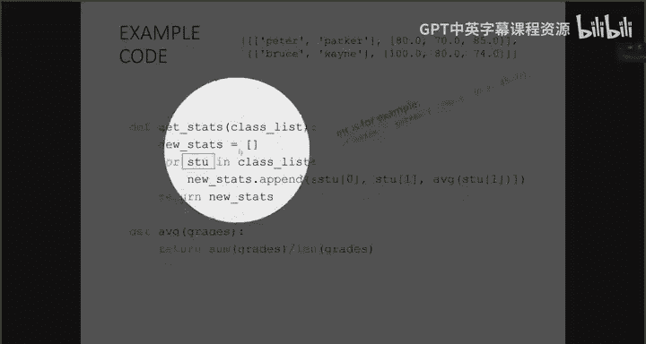

What I'm going to do in my new list that I'm creating here。

 new stats is I'm going to pen student at 0， which is just their name。

 So just a straight copy and paste student at one， which is just their grades， again。

 a straight up copy and paste of all their list of grades。

 and then I'm going to apply a function named average。To the list of student grades。

And what we're gonna see in the next couple slides is we're gonna see a few variations of this average function。

 and what happens when we， when we apply these different these different functions。But for now。

 I will assume that this code will do the job， so the original average function will take in a list of grades。

 So this grades here will look like this blue box here， right， so just a list of numbers。

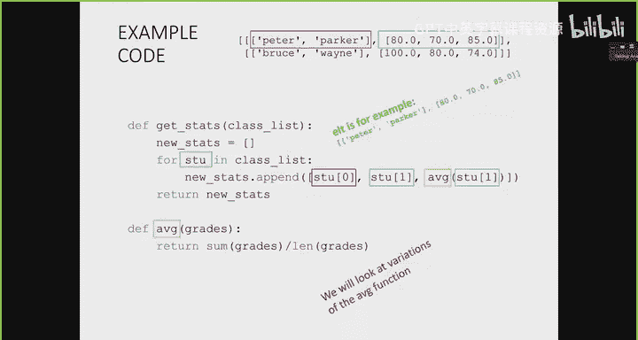

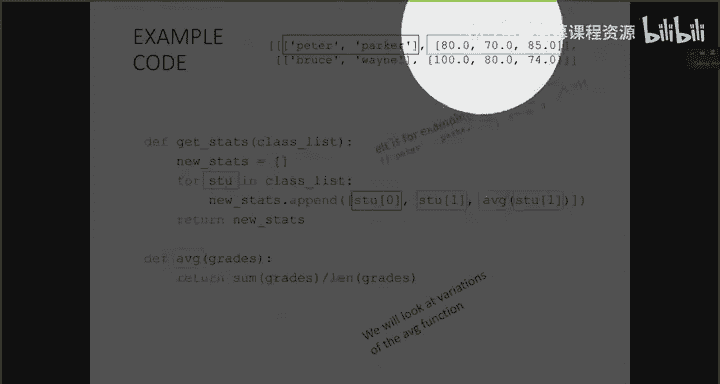

It's going to sum all the grades。 So sum of all the elements inside the list and divide by how many there are average。

O。Now。Let's say that I have a student that contains no。Quz grades or no grades at all。

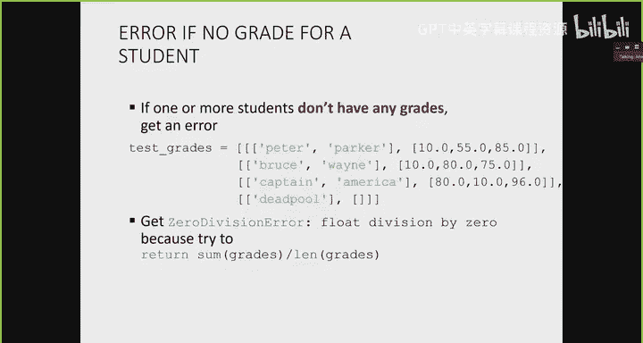

In that case， their list of grades will be empty。

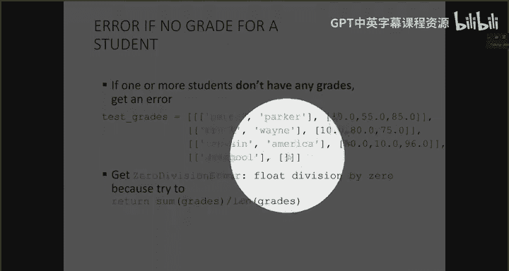

So if I try to apply the sum of all the grades divided by the length of the grades for somebody who has no grades information。

 that length will be 0。 So I'm going to get a zero division error when I run my code and it will crash。

So what I'd like to do is to change my average function to try to catch such an error。

 So I'm going to try to do the sum divided by the length。

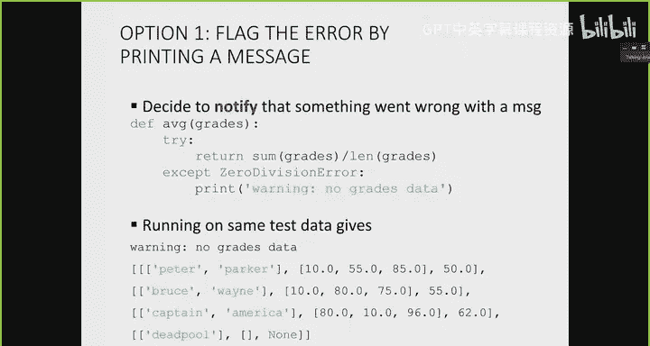

And I'm going catch this zero division error inside this accept block。

 And all I'm going to do is print warning。 No grades data。

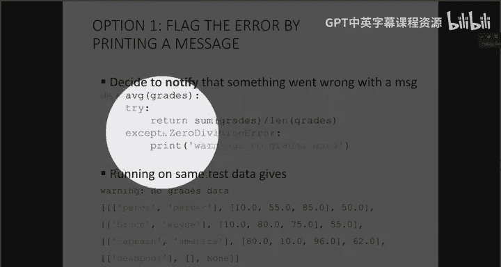

So for any student that actually has grades information here。

The code will work for the code to get the average will work just fine because it will do the sum divided by the length。

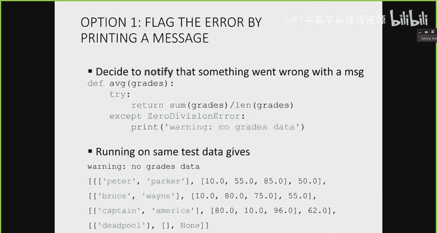

But， and， and then， so that means the try block will succeed。

 And we're gonna return the sum divided by the length。

 But if any student enters the zero division error here。We're going to print something。

 and what do we return。

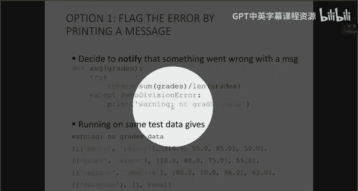

What is the function return if we enter the accept block。嗯。That's what's gonna to be printed。

 But what does this function actually return， What value。None， exactly right。

 There's no return inside this except block and no code after it either。

So you can see here if it successfully completes for these three students， we've got our numbers。

 those that's what we return。 but for the last student that has no grades information we're returning them。

I don't like that。 What I would like in my grades book is to have numbers as my as my value there。

 So instead， let's add a return for that for that accept block。

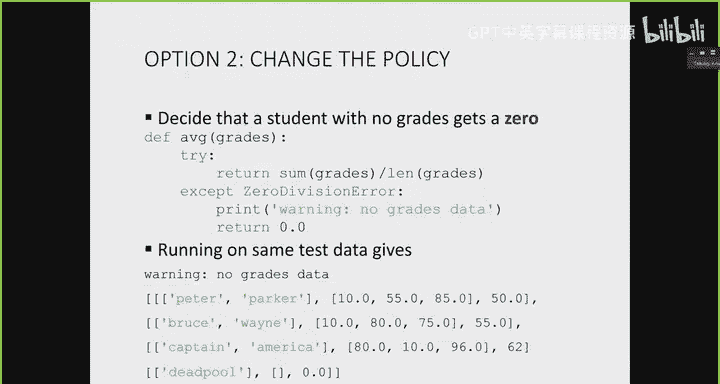

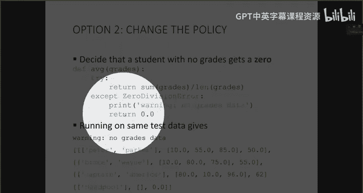

So we're still going to flag the error。We still want to know that something weird has happened。

 I don't just want to replace return a 0 without actually telling the user that something。

 something's gone down。 I still flag the air， but then I can return a0 so that it's still a number。

 And then if I do something with numbers at the end， then， it all works out。

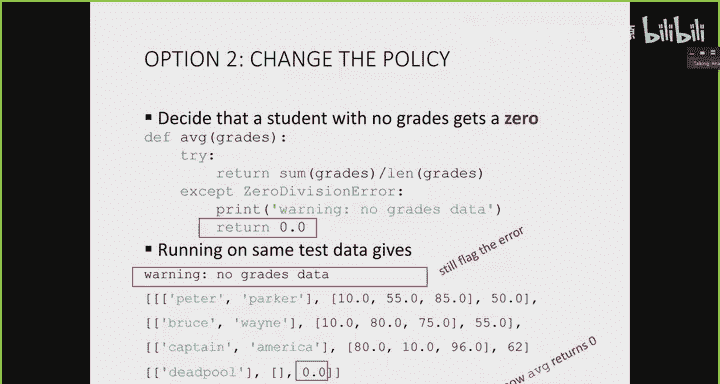

This was a particularly hard first quiz，110。

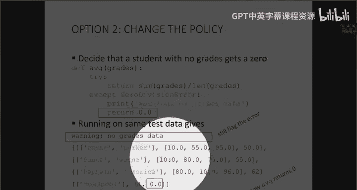

Okay， one last thing we can do is to just assert， right So if we if we want to make sure that every student had some sort of grades information。

 maybe if the grades data was empty， something weird happened from a previous function that might have been called I don't know。

 but maybe we say let's just assert that the length of the grades is not zero。

 So we only want this code to execute if there are some grades information and if not。

 let's just raise an assertion error just in case。So we can assert that the length of grades is not equal to 0。

And in that case， the code will terminate as soon as we try to get that last student's information。

 right it will crash and it will crash with this assert statement that there's no grades data。

 and then we can go back to the code and see did we actually expect the student to have information or not。

 and then we can try to work through it。So just a quick summary of exceptions and assertions。

Hopefully， this lecture kind of demystified some of these exceptions that we've been getting。

It showed you they're not as scary as they might have seemed originally they don't always have to terminate the program right you can catch them。

 you can deal with them in whatever way that makes sense for that particular function or program you can print a nice output to the screen。

 you can set some default values， you can still terminate the program but do it on your own terms with your own errors with your own custom messages so that the users can see something nicer than the default Python messages right and so exceptions。

 exception handling is very important is a very important part of writing a program。

 especially if you expect weird things to happen right。Assertionions， on the other hand。

 are a type of exception， and they're useful， as I've mentioned， to try to enforce these。

 these contracts， these specifications。You basically use assertions because you don't want bad values to propagate。

 Okay， so as soon as something that isn't as you expect it to be。Happens。

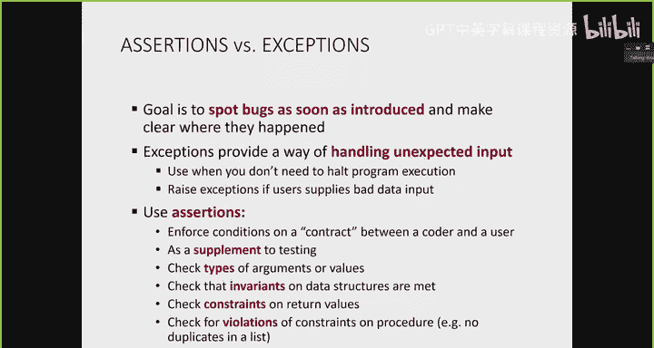

Assertion error is raised， and the program immediately terminates。

 allowing you to check to see why exactly those conditions were not met。So that's it。

 That's all I had。

