# 《计算机科学和Python编程｜6.100L Introduction to CS and Programming using Python, 2022》 - P14：-14-Lecture 14_ Dictionaries.zh_en - GPT中英字幕课程资源 - BV1PAxJzVEs3

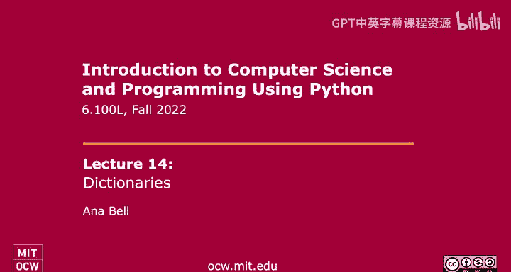

Alright， everyone， let's get started。 So today's lecture will be on this thing called dictionaries。

 And it's not the dictionaries that our parents and grandparents used。

 Notice Id never actually used regular book dictionaries either， maybe once in my entire life。

But it's actually on a Python dictionary。 So this is going to be a new data type that we have not worked with before。

 but it'll be a compound data type， much like we've seen lists and tus to be。

 It's just going to be very different than lists and tus。So before I introduce a bunch of syntax and。

 and what a Python dictionary is， let's try to just motivate the need for such a data structure。

So suppose we have the following problem。 We've been dealing with this problem in many of our lectures。

 but we once again want to store student information。

So let's say we want to store great information for a bunch of students。With what we know so far。

 we can store information using lists。 It's a very reasonable data structure to use because we might get new students in the class。

 Students might drop。 grades might change， things like that。

 So let's use this mutable data structure list。Let's say we want to store names of students and their grades in the class like their final letter grade。

 Additionally， we can store things like microquiz grades and Pets grades。 But for now。

 let's just assume we're storing just the names in the final grades in the class。

 So if we do this using lists， one reasonable way to store this information is by saying， well。

 I'm going have a list of all the names of the students in my class。

 I'm going to have a list of all the grades of these students in the class。

 And I'm basically going to go index by index。 And make the rule that says， at a particular index。

 I'm storing all the information related to this one person。

 So at index 0 here I'm storing the name of the student and their grade。😊，At index 1。

 I'm storing the name of that student， John and their grade。 at index 2。

 I'm storing the name of that student in their grade and at index 3 and so on and so on。Right。

 so now I basically have to remember that for a particular index。

 I am storing all the information related to that student， right。Okay。

 so seems like a reasonable way to， to do this。 Now。

 let's say that I wanted to look up the grade for a particular student。

So I write this function called getgrade。It takes in some parameters。

 So the first thing it'll take in is the name of the student。 So Anna， for example。

 and I would pass in the list of all the names in my class and the list of all the grades in the class。

 So these are these two lists that I've previously created right so these get passed in to this function。

 So you can imagine if we have a list of everybody at MIT。

 these lists are going to be pretty large that we're passing in as parameter。

How do we actually grab the letter grade associated with a student？ Well。

 we're gonna use the fact that the letter grade for the student at index I is in。

 in the grades list is going to be。Grabbing the letter grade for the student at that same index in the name list。

 Okay， so we have to figure out this particular student being passed in here。

 what index they're at in the names list。 So that's what this line of code is doing。

 It's using this index function。

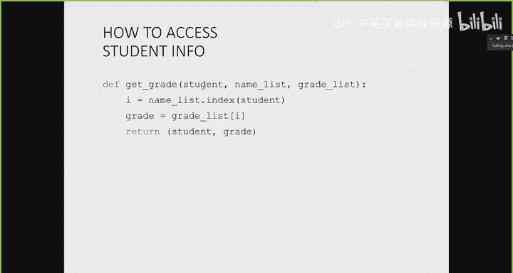

On the name list。With a parameter， for example， Anna。

 So this will return for us the index where Anna is in my list。 So from the previous example。

 it's going to say that it's going to turn the number 0 because Anna is stored in the name list at index 0。

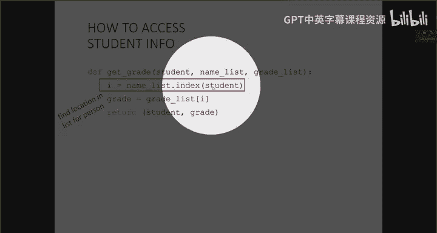

So now that I have that index in hand， sort in variable I。

 I can just index into the grade list at that same index。

So I can get grades list at index 0 will return for me the grade that I got for that particular class or whatever we're storing here。

And then we just returned the TL student comma grade。So this becomes really messy， right。

 I already mentioned that if I have a list of a whole bunch of students for a really large class or you know the entire university。

 then it becomes really unwieldy to just keep passing in all these lists if I have in addition all these microquiz lists and all these problem set lists that also store additional information for the student。

 I then have to pass those in for their respective functions and so it gets really messy。

Right writing these functions that retrieve these this information。 And additionally。

 if we're mutating these lists， like if a new student comes in and we need to add all their information。

 I need to make sure to update every single one of these lists that I'm maintaining。

 If a student leaves right or drops the class， I need to remember to remove that index from all of these different lists。

 So really， really messy situation that we could get into by using this method to store information about students。

So let's try a different approach。 Instead of using all of these different lists。

 let's say that we're going to store everything in a master list。So we're not storing many lists。

 we'll just store one list for the grades in the class。

And the way that it'll be stored according to this in the slide is going to be this grades list。

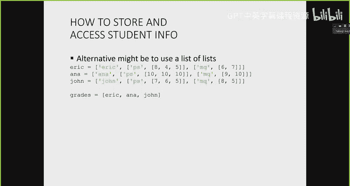

So this is one list with three elements in it， and you can imagine if we have more students。

 we would just put all these students in this master list。

 So what is each one of these student elements？

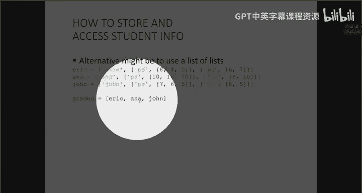

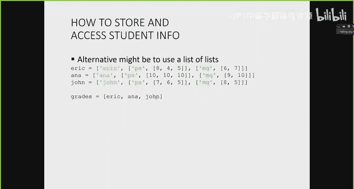

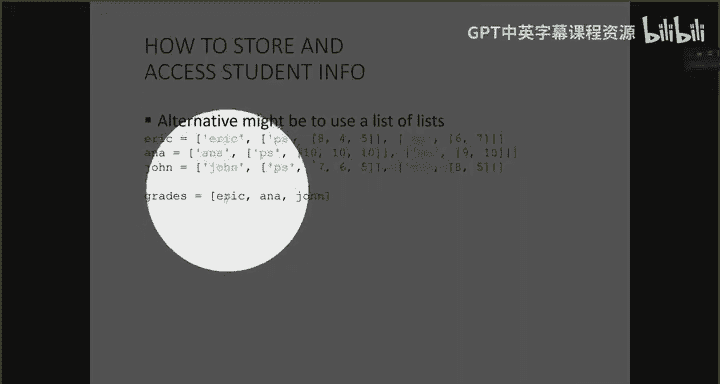

Well， each student element is itself a list。 So already I've got my master list。

 and each element within this list is also a list。 So this is a list for Eric。

 a list for Anna and a list for John。 These are variable names。

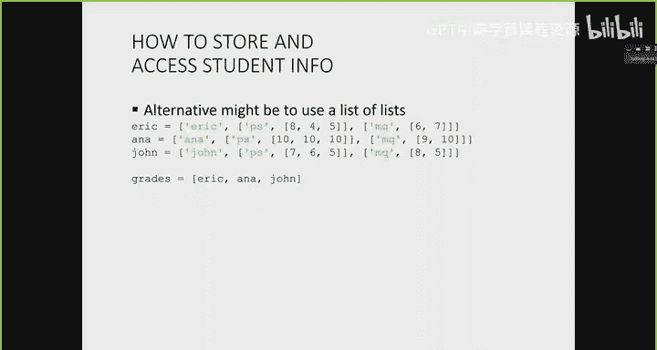

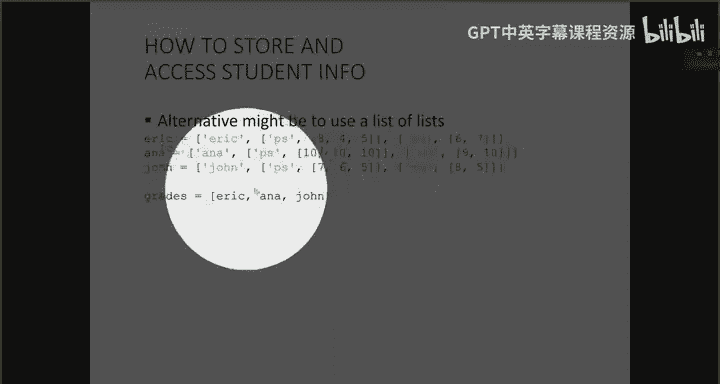

What are these lists going to be comprised of Well they will be comprised of three things so notice right two commas here so the first thing is their name。

 the second thing is another list containing their problem set grades and I'm kind of using this element of that list to denote what that set of numbers represents and then another list as my third element being for the being the scores for the microquiz grades and again I'm denoting the first element of that list telling me what this list contains。

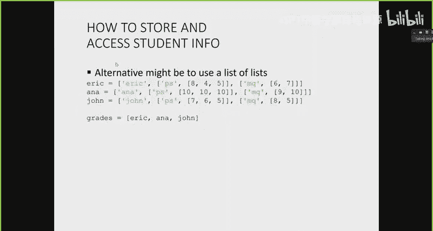

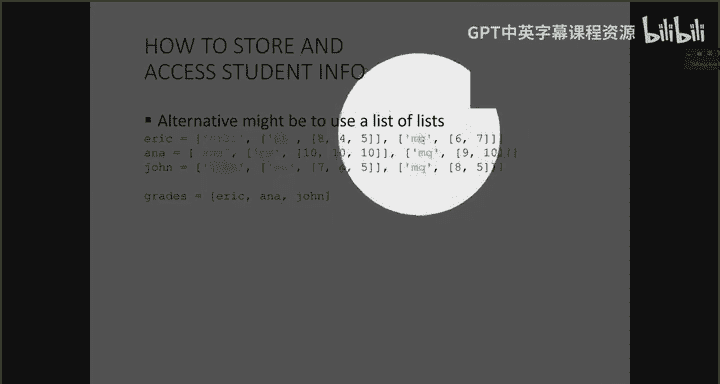

Okay， so I've got lists。Master list with three sublists for my three students。

 and each one of those lists contains three elements， a string， a list and another list。

 And those two lists are then also comprised of a string and a list themselves。 So super complex。

 a data structure or a sort of composition or design choice that I've made here。

But it solves the problem of maintaining all these different lists， you know， in separate variables。

So now let's say I wanted to write a function that gets the grades for a particular student for either you know。

 problem set or microquis grade。

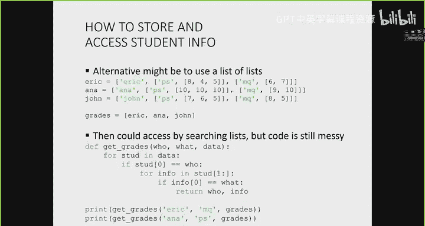

This is the function that does that。 So again， it's not looking super nice。

 So what is this function going to take in， The who is going to be a string representing the name。

 So， for example， Anna。The what will be also a string representing what information I'd like to grab either P or M Q。

 And the data is going to be my master list of all the grades。

 So this grades equals this list of everybody。

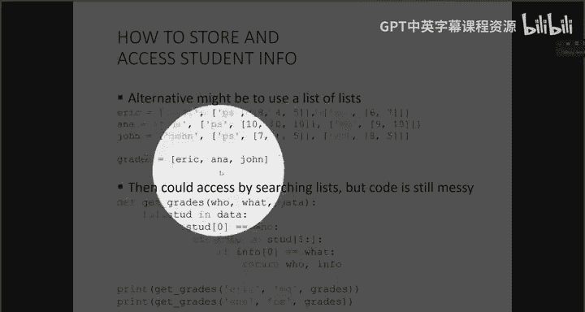

So what is this code going to do， Well， it has a for loop。

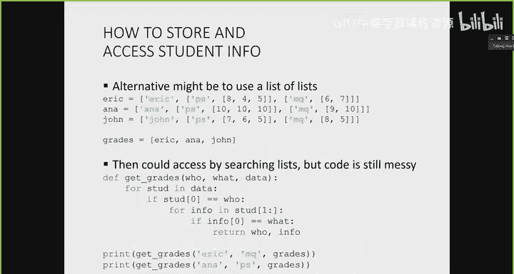

Down here。And a nested for loop inside it。The outer for loop basically looks through each one of these elements here。

And looks at the element at index 0。 So either Eric。

 Anna or John and grabs only the list where that piece， This string here matches the who。 right。

 So if student at index 0 equals who right here， then we' found the student I'm interested in grabbing the information for。

😊。

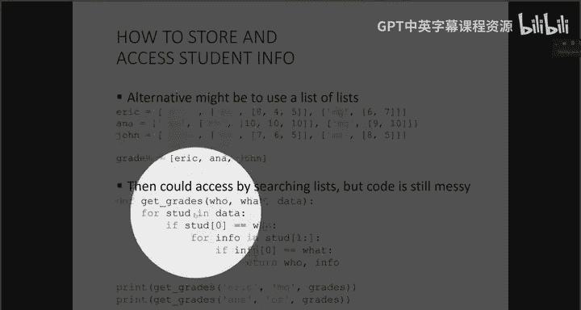

Cool， so now I've gone， I've grabbed the right piece， the right list。

 and now I'm interested in their grades for a particular what right， So either M Q or P。

 So I do the exact same thing again for that list here， right。

 So if I'm interested in Anna's P grades， Ive I grab these lists here。

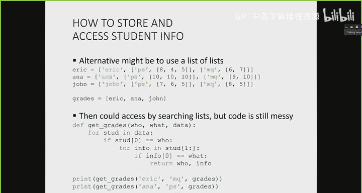

Right。And then I'm going to check if the info index0。 So either this P or this MQ matches the what。

 So either P or MQ to match what I'm interested in grabbing the information。

 what information I'm interested in grabbing， and then I'm going to go inside this if statement if they match。

 and then I return the who in the info。

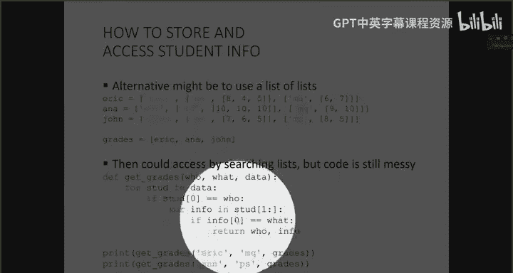

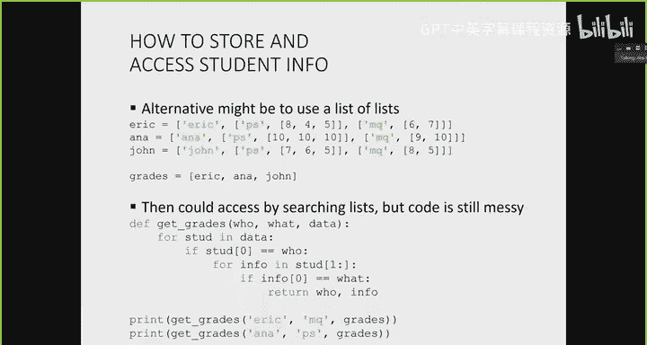

So， again， super complex。 no need to understand this that well because we're not going use this method for long。

 So this get grades here。For example， if I grab Eric microquiz grades and I run the code。

 it will return for me this tuple that grabs that returns from me the name of the student。

 And then this just this sublist of the thing that I was interested in in this case， microquiz。

 And it grabs for me all the grades。 And then I can then index into this returned tuple to grab either the first quiz or the second quiz grades。

😊，And， and same for Anna， right， in this particular case， it grabs for me。

 just the tuple with my name。 and then that sublist with the promise I creates。Okay， so again。

 really messy。 I have to， I've made my design choice for how to create this。

 all these lists with sublists and sublists within those。

 And so I'd have to document that probably if I was using this method。

 and then this function to grab this information， again， super complex。

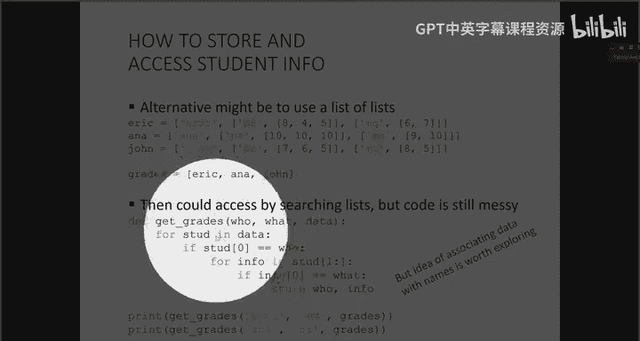

Hard to read。So it's not really a great way to store information either。 but the idea behind this。

 which is to try to store some data associated with some sort of key， right， the P S or M Q。

 or in this case， I'm storing， you know， a bunch of grades for Eric or An， that idea we can explore。

And that's basically what dictionaries will do for us。 It'll allow us to create data structures。

That map， some sort of custom index， a key to some value。 So much like a book dictionary does， right。

 it maps the word to its definition。We'll be able to create our own dictionaries that map some object to another object。

So。When we create a dictionary， we call every sort of quote unquote element in the dictionary an entry。

 And that entry is， is that mapping of a key to a value。So just to draw a parallel with a list。

We can think of a list as mapping something to another something。

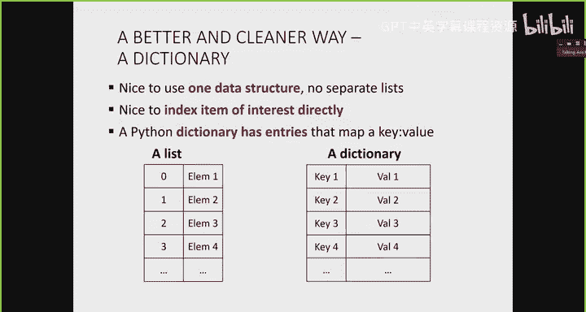

The thing that a list maps。Is this index number 0，1，2，3 in that order， right？ so it has to start。

 have an element at index 0， and then that index increases by one from there on。

 and for each one of these index indices， I'm mapping that index to some element in my list， right。

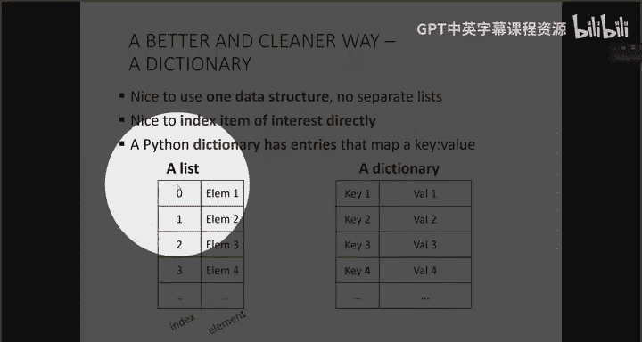

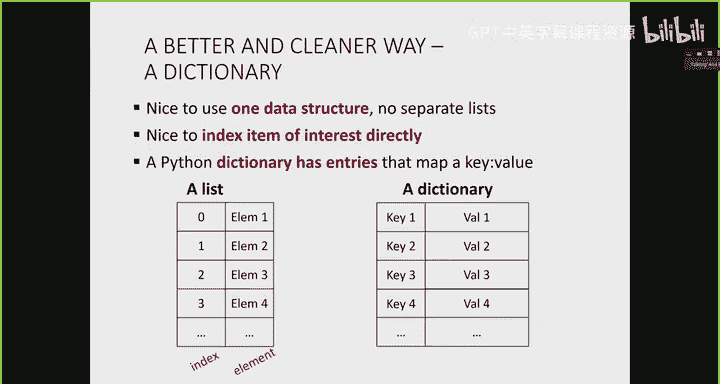

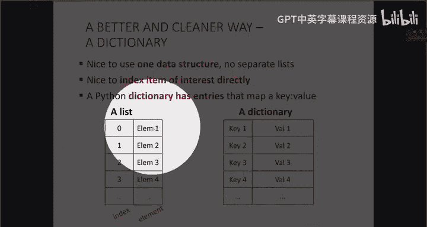

That's basically what the list does。 There's something associated with index index 0。

 something associated with index 1 and so on。So it's kind of like a very restrictive dictionary。

 right。An actual Python dictionary works in similar way。

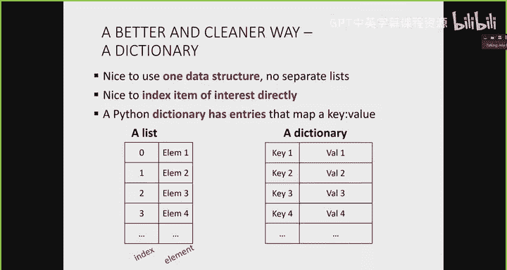

Except that now I am not putting any restrictions on my indices。

 My indices here become these sort of custom indices called a key。

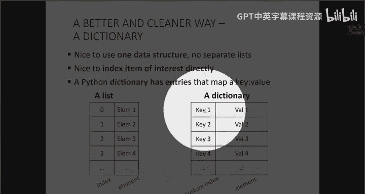

And so now I'm able to associate a value。

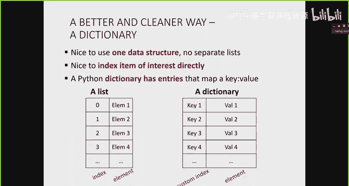

Equivalent element in my list with that key。 so I can have an element associated with any object。

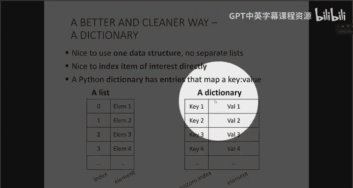

So I am using the term value here and in a dictionary， the key is associated with a value。

 and that's one entry in the dictionary。 Now， this is going to be a little bit confusing because we've been using the term value to refer to just some object's value right。

 like you know you know variable A has value 5 or something like that。

But now I'm gonna try to make a conscious effort now that we're introducing dictionary and dictionary values associated with a key to whenever I'm talking about the dictionary's value to say dictionary value。

 just so it's not confusing。But just， just keep that in mind。

 It can be a little bit confusing at first。 Now that we're using the same terminology for two different things。

So we're going to go through in this lecture。 we're going to introduce a bunch of syntax and operations with dictionaries。

 and there will be lots of you tried exercises just to give you a little bit of practice with the syntax because this is kind of a syntax heavy lecture。

So hopefully it helps a little bit。 But let's first see how to store data in a Python dictionary。

So as I mentioned， a Python dictionary stores entries。And that entry is a key value pair。Okay。

So you're mapping one key to its value。The key can be any immutable object。

 and we're going to see what this means in a little bit。

 and the value associated with that key or the python value associated with that key can be any object you'd like。

 even lists or other dictionaries。So the way we create a Python dictionary is by using these open and closed curly braces。

 so tworals were open and close parentheses。 Ls were open and close square brackets。

 dictionaries are open and close curly braces。 And this creates inside memory and empty dictionary。

 So an dictionary with zero entries。 So the length of that dictionary is 0。😊，To add。

 to create a dictionary with one entry in it， again， we have curly braces and we add one entry in it。

 So this something colon， something else is an entry in my dictionary， one entry。

And the thing before the colon is the key。 And the thing after the colon is the value associated with that key。

So you can think of it if we're drawing a parallel to lists， this is now mapping， you know。

 sort of at this custom index 4。 we're putting element 16。

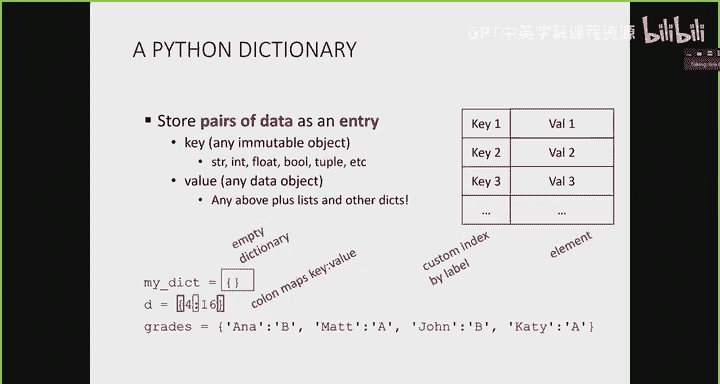

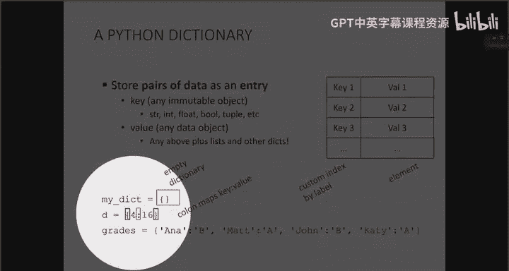

Okay， so we can also create dictionaries that aren't just full of integers。

 and you can mix and match data types as you'd like。 But usually in dictionaries。

 we kind of have the keys all be the same type and the values， you know， all be the same type。

 but you can certainly mix and match types。 just like you， you could。

 you could create lists and tus full of an integer and a float and another list。 you know。

 in mix and match in that way。😊，So here I'm creating a dictionary。 again。

 open and close curly braces starts my dictionary， and it has four elements in it。 So each， sorry。

 four entries in it。 and each entry is separated by comma。I've got here my first entry。

 So it is mapping the key Ana to the dictionary value B。My second entry maps key map to value A。

 Third entry maps key drawn to value B， and last entry maps key K D to value A。

 So this is a dictionary that essentially maps strings to other strings。

So you can see here I've kind of visualized the dictionary that we just created。

 We've got these custom indices， right， So we're basically mapping names to letter grades。

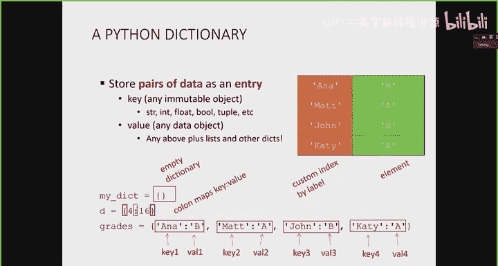

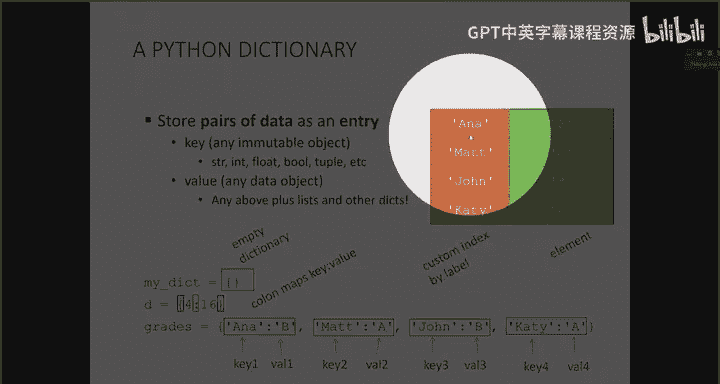

Everything O so far。 Does it make sense， I guess， conceptually。啊。Okay。

 so the first thing we'd like to do is once we have a dictionary full of a bunch of entries。

 how do we grab an entry， How do we look up a value associated with a key。

So the way we do that is in a very similar way to the way we look up an element in a list， right。

A key in a dictionary is just a custom index。 So how did we look up an element in a list。

 So if I wanted the element at index 3， I would basically say L square brackets 3。

 And that grabs for me the value at that index。Well， now I've got my custom indices， right。

 My custom indices are these strings。

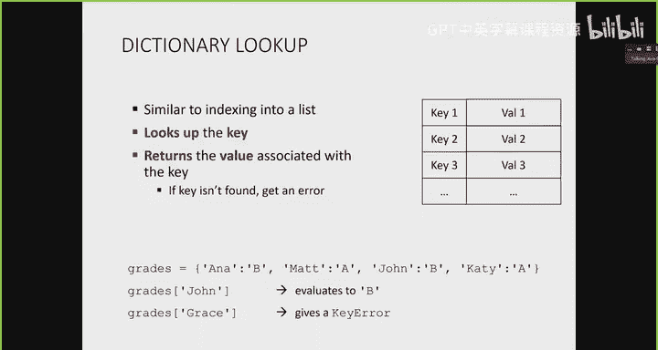

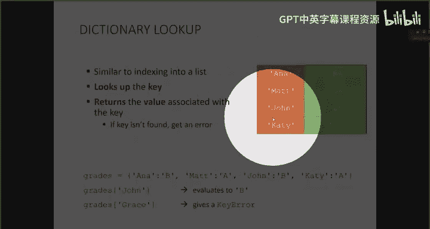

The syntax will be exactly the same。 I've got this custom index。 I'd like to look up。

 So I say dictionary name， square bracket， custom index。So if I say grade Sc bracket John。

 Python will go in to my dictionary named grades。 Itll look up the key John。And inll return for me。

 the value associated with that key。B。So this entire expression here。

Is evaluates or gets replaced with the string B。 Just like when we indexed into a list L square brackets 3。

 we replaced that entire index indexing operation with the value of the element at that location。

So similar here。If I try to index into a dictionary and that key doesn't exist。

 So notice my dictionary has no string grace。 Python will give me a key error。

 So if you run code with dictionaries and you get a key error exception being raised in the console。

 you'll know that you're trying to index into a key that doesn't exist。So the question might be， yes。

 we're able to look up a value。Right， given a key， can we do the same thing， But backwards。

 given a key， sorry， given a value like ABC， whatever。

 Can we look up a key associated with that value。And the answer is no。

 We'd have to write some sort of loop or some sort of code that goes through every item in my dictionary to look to to。

 to check each value and see whether that the key associated with that value is equivalent to the1 I'm looking。

So there is no nice expression to do that backward operation。

And that's because the values in my dictionary can be repeated。 So if I look up the value B。Right。

 and I want， what's the key associated with B。Well， there's actually two of them。

 So how does Python know， I want both of them。 How does it know， I want only one of them。

 How does it know I want maybe a list of all these things， It doesn't， right。

 So you'd have to write code that does something， you know， for that operation。

And we're going to see how to do that later。Okay， so let's have you work on this。 You try it。

 And this is just an exercise in looking up a value。

 So this is a function I'd like to write according to the specification。 So it's called fine grades。

Gras is a dictionary mapping student names to grades。 So string to string。

 exactly like we've seen in the previous slide。

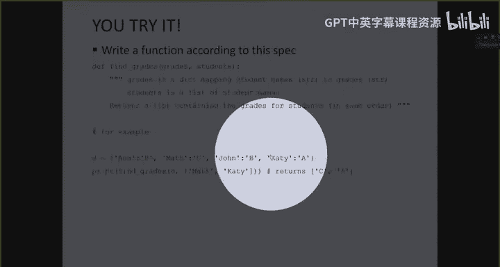

And students is going to be a list of student names。

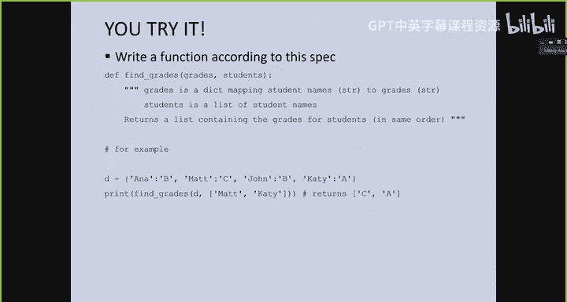

So in the example here， I've got my input dictionary， this thing we just saw。

 And then my list of student grades is， for example， you know， these two strings， Matt and Katie。

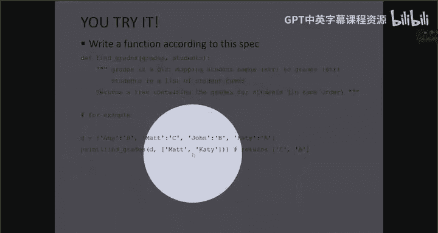

For a bunch of these questions， especially even on the microquiz and things like that。

 if it gets a little confusing when I try to write the specification in a very detailed way to make it clear what I'd like from。

 from this function， it's important to try to use the example to help you figure out what we'd like。

 because we're writing the specification in a general sense。

 but the example should hopefully make things really clear for what we'd like。

So in this particular case， what we want the function to return is a list of the grades for the students being passed in。

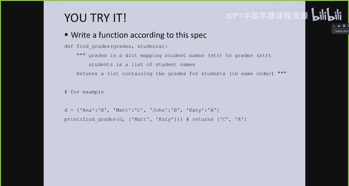

Right， so we look up Matt。 We see the， their grade is a C。 We look up Katie。 their grade is an A。

 So I want to return the list C comma A right in the same order that I passed in my。

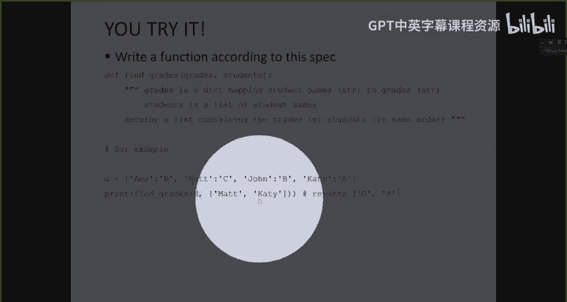

So I'll give you a couple minutes to work on that。 And then we can write it together。 So that's。

Line 94。So this is just an exercise on looking up values in the dictionary。Alright。

 does anybody have a start for me。Yes， please。Yep， L new。 How about that。

So this will be my results list， yep。Yep， for loop。Yep。

 so grade square bracket L M looks up the value associated with my student named L M。

And maybe we can save it like this grade equals this。 And then you set aend。 Yep。

 so we can do L new dot append， the grade。Anything else。Yep， a return。 so we can return El new。Yep。

 so very reasonable code。 I like it a lot。You know， beside the first lecture。

 I don't know that we've written any code that didn't involve a loop。

 So your best bet for writing code， you know， from， for any sort of thing in this class is to think。

 what loop can I do。 So let's run the code。 And it should return for me C comma A， and it does。

Now that we can iterate， so， you know， I mentioned this before。 but once we're iterating over。

 you know， twoos and lists and things like that， one thing I would add just for debugging purposes is say something like L M is。

 And then you can， you know， say like an example of what it could be like Anna or Matt or whatever it could be just to remind yourself that that thing。

 that loop variable is a string。 And so it's one less thing to remember as you're writing for their code。

This is really nice。Okay， so dictionaries are already proving to be really， really useful。

 We can create values associated with custom indices。

 And if we want to grab the value associated with that custom index。

 It's really just a matter of indexing using a key using that specific key much like we did indexing into a list。

 Okay， no need to loop none of that， you know， iteration。

 it's just in a single line of code that indexes into the list。😊。

So let's see a few more operations before we do the next you try it。

 So I've got my list of grades that we've been working with in the past couple slides。

 Let's say that we now want to add a new student in their grade。

The way we do that is very similar to the way that we would add an element to a list once we already have an index for that list right here。

 notice we don't actually have a slot for grace。Yet， I'd like to add her to my dictionary。

That's okay。With this particular syntax here。 So grades at key grace。

 If Python does not find grace in my list in my dictionary of keys， it'll just add her。ok k。😊。

Which is really nice， right， I don't need to check if she's already in there。 there's no looping。

 You just say you know， grades that grace equals a boom。 It adds it for you。

What if I want to change an entry in my dictionary。Well。

 let's say I want to change Grace's grade to a C grades at。Custom index grace equals C will go in。

 look at my keys。When Grace didn't exist， Python added。Her with her value。

 But she already exists there。 So Python will just overwrite her value。So really nice， you know。

 something to look out for in case you already have values in the dictionary。 You， you know。

 you want to be careful if you actually do want to overwrite things， but it's really。

 really nice behavior。 And it's different than lists， right。

Especially adding an entry to the to the dictionary。

You can delete entries much like we deleted entries from a list。 We use the Dell function。

And the Dell function says what entry you'd like to delete from what list。

 So here we just say the name of our dictionary at index Anna。

So this will completely remove Anna and her value and the value associated with Anna from the。

 from the dictionary。So what I want to make a note of is that are dictionaries being mutated with all of these different methods or all of these different functions。

 right， So here， when I added grace， I've mutated my original dictionary， right。

 the animation didn't make a copy of this dictionary with grace added。

 leaving the original unchanged。 I've literally gone in and mutated my original dictionary to add grace。

 I've mutated the original dictionary to add to change her grade。

 I've mutated the original dictionary to remove Anna from the dictionary， So all these。

 all these functions are actually mutating my dictionary。

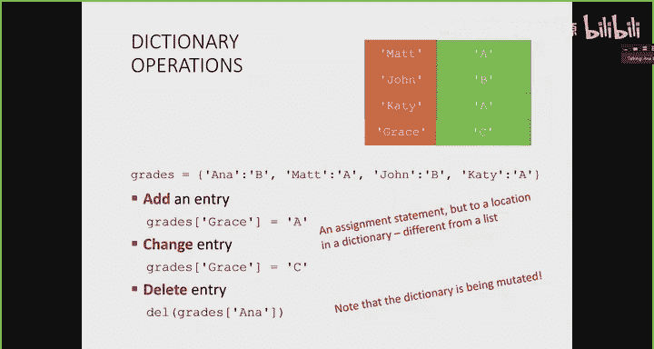

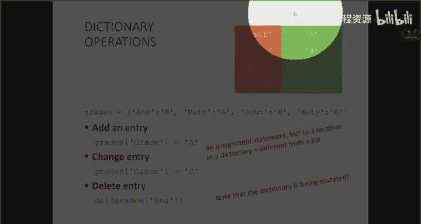

Okay， one other very useful thing that you can do with dictionaries is to check if a key is in my dictionary。

😊，So we do this using the in operator， this in keyword。

 we've seen the in keyword being used to check if an element is in a list to check if a substr or a character is in a string to check if some element is in a tuple。

 we can also use it to check if an element or a key is in my dictionary。So。I want to make a note。

 It's only checking the keys。 It does not look for the values in the dictionary。

 We'll see how to check if some value is in the dictionary in a little bit。

 But the N keyword specifically only looks at the keys in the dictionary。

So if I have the expression you， the string John is in grades， Python only looks at the keys and say。

 yep， there it is， I don't care what values associated with it I just care that it's in my keys。

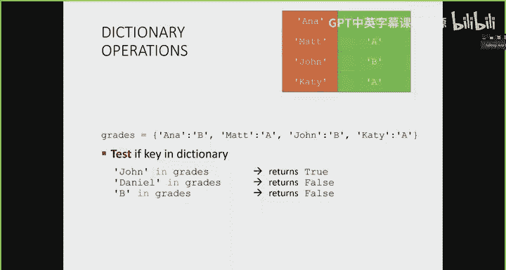

So this entire expression here， John in Gs will evaluate so be replaced with true。

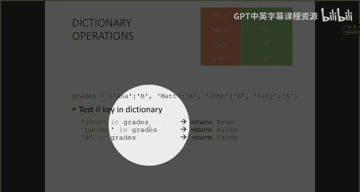

Daniel obviously is not in my dictionary keys， so it returns false。 B is not in my dictionary keys。

 even though it's in my values， it still returns false because it only looks at the keys。

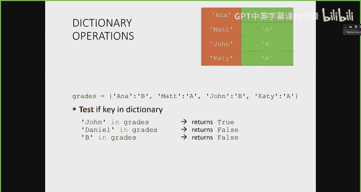

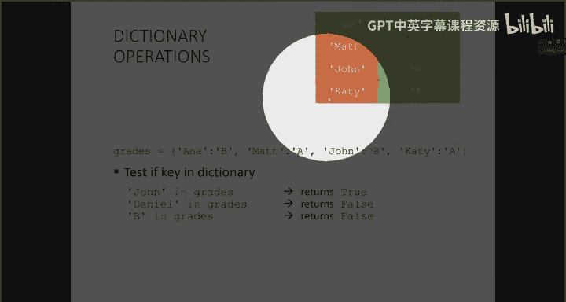

Alright， let's have you try this。Exercise。So function is called find in L。 Again。

 we can use the specifications and the example to help us figure out what we'd like from this function。

 So L D is going to be a list of dictionaries。

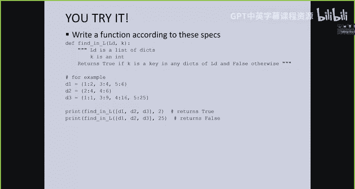

So in the example here I've got three dictionaries defined and the first parameter here。

 the thing being passed as LD is the list with D1 D2 D3 as my elements， and K is just an integer。

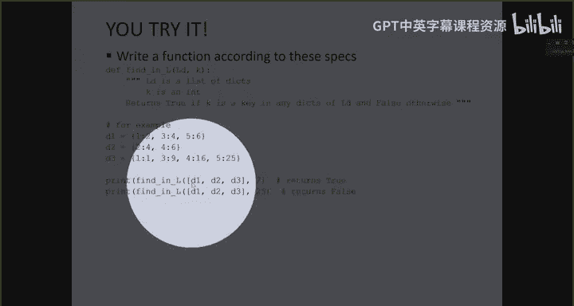

What I'd like to do is return true from the function。

 If that K K is a key in any of these dictionaries and false otherwise。

 So as soon as I see a key that matches K， I want to return true。

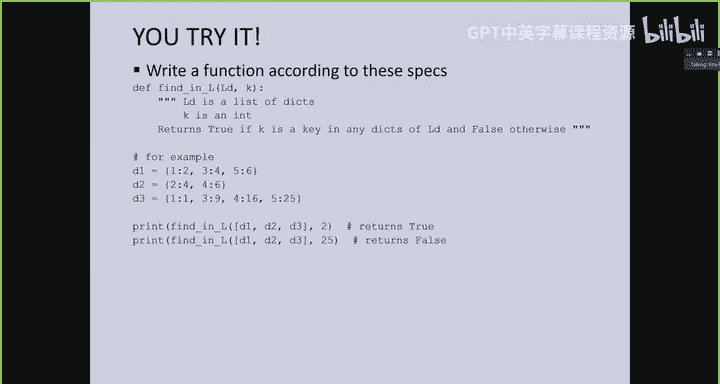

So in this example here， when I look at look for the K2 inside these dictionaries。

 D1 doesn't have it， but D2 has it。 so I would return true。

When I look for 25 in that same list of dictionaries， 25 is a value in one of these in D3。

 but it's not a key in D1， D2 or D3。 so that would return false。

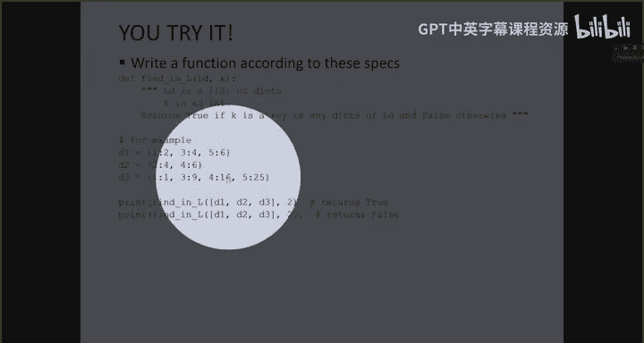

Allright， so that's just a little lower line 1，15。Give you a couple moments。

 and then we can write it together， like usual。Alright， does anyone wantan to start me off here， so。

How can we do this？Create a loop， yes。4our。Yep， okay， so that will means that D is， you know。

 I can say like K1 mapped to V1 or something like that， right， A key to value。If。K。In D， yep。

 so that will check for me my keys in that particular dictionary that I'm looking at right now。Yep。

 we can immediately return true。Right， as soon as we found it。

 no need to check the other dictionaries， just， pop out of the function and return true。

Same inside the F or inside the4 or outside the4。Outside the floor， we can return false yep。

I like this code a lot。嗯。Uses this in operatortor， right， to do that the task。

 So the return false outside of the for loop works really well because if I've gone through every D inside LD here。

 then I'm checking every single dictionary right As soon as I find one that has that key。

 This return true， acts like a break and a return。Right。

 so it breaks out of the loop and returns immediately。And it doesn't， you know， return false。

But if I've gone through every dictionary and didn't find the the key matching K。

 then I return false。Did anybody try it a different way or is this。

We could certainly try it with a Boolean flag， right？

 We could flag the fact that we found it through some loop， you know， and keep track of it。

 And at the end， just return that flag。 That's another way to do it。

 But this is probably the most pythonically。So we can run it on these two examples here， Right。

 So I'm expecting to looking up  to to return true and looking up 25 to return false。 and it does。

Questions about this code or dictionary so far is everything。O， so far。Okay。Alright。

 a couple more operations。 So so far， we've looked up values in the dictionary。

 We've added stuff to the dictionary。 We've deleted stuff from the dictionary。

One really useful thing to do is to be able to look at every single entry in my dictionary。

The reason why we'd want to do this is because we should assume that when we create our dictionaries。

 there's no order to them。 right， This is very much unlike lists。 Ls had an order to them。

 We knew that the first element in our list was at index 0。 The next one was at index 1 and so on。

 right， Ls were ordered sequences of， of， of element。

But dictionaries are not ordered sequences of elements。I that's not super true。

 there are up until a very recent version of Python。 there was no guaranteed order。

 They would put in some order that couldn't that I I couldn't figure out how it was determined。

 But I forget which Python version maybe 3。6 or something like that started to guarantee an order when you in for for the list for the dictionary elements。

 And that order was the same order that you inserted the element。

But if you'd like to write robust code that could be run by people， you know。

 using an older version of Python， you should write the code assuming that no such order exists。

 And it's okay。's， it doesn't make the code that much harder to write。

But if we're not assuming any order to Python El entries to in the dictionary。

 then that means a lot of times we actually have to look at each entry in the dictionary to do some sort of task。

So one of the first things you might want to do is to iterate through all the keys in the dictionary。

To do that， we use a function called grades dot keys。

And this grades dot keys function here doesn't mutate the dictionary at all。

 but instead it returns for me an iterable， a sequence of values。

 which are all the keys in my dictionary。Now， the data type of this return value is called died underscore keys。

 It's not a data type we've worked with before。Okay， it looks really weird。

But if you'd like and you don't have to do this， you can always cast this sequence of values。

 That's type died keys to a list like this。 So if you cast to a list grades dot keys。

 it gives for us this more recognizable list with each key being an element in the list。

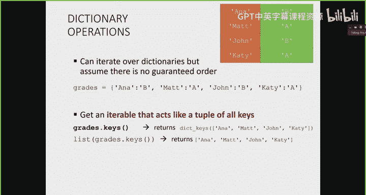

You don't have to do this， but if it makes it easier for you， you can。Okay。

 so this line of code here， grade Z keys returns for you。 You can think of it like this iterable。

 this list of all the keys in the dictionary。 Again， they're not ordered， right， I mean。

 they're ordered in the order that I added them into the dictionary， right。

 Anna then Matt then John then Katie， but they're not sorted in， you know， alphabetical order。

 If you have integers。 They won't be sorted in ascending or descending order。

 So it's best to just not assume an order to begin。

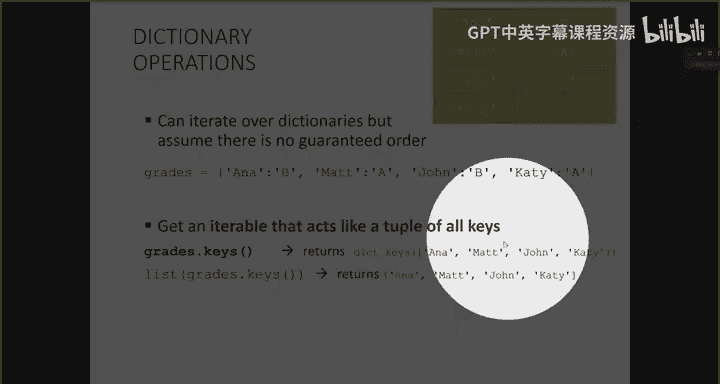

Similarly， we can get an iterable of all the values in the dictionary。

And to do this no surprise there， we use grades do values。

 and this is again a function where doesn't mutate the grades at all。

 but instead it gets replaced with this diiced values data type，'ve never seen it before either。

 and you can cast it to a list if you'd like because it makes more sense to us at this point in time。

 which just returns for us this list of every single value in my dictionary。 Again， no order， right。

 we can see that there's no order except for the order that we actually added the element。Yeah。Yeah。

 yeah。 it'll print out the same， the same iterable， I guess， if you do it again， yeah。

If you're iterating over the dictionary， not in the Python version we're using。

 but in a previous version， if you ran， you know， your on your machine or if I ran the same code on my machine。

 it might have given me a different order。But in the the versions we're using from now on in Python。

 right， because you guys all probably downloaded the latest version of， of， you know。

 Anaconda and Sp， it will it will guarantee the order that you inserted the elements in。

 But if somebody using an older version of Python takes your code and runs it。

 they might actually get， you know A， A， B B or some other order for these for these functions here。

Yeah， you're welcome。So it， these being iterable just means that we can have something like 4 I or so 4K in grades dot keys。

Basically， giving us a loop where K is going to be each element in this list。So that's fine。

 So we can iterate over the keys or we can iterate over the values directly。

 But what I find personally most effective is to iterate over each entry in the dictionary。

 So not just over the keys or the values by themselves。

 it's to iterate over the keys and the values together。So， to do that。

We use this function called grades dot items。And unsurprisingly。

 this will return also an iterable where each element in my iterable is not just the key or the value。

 It's a tuple of the key comma， the value。

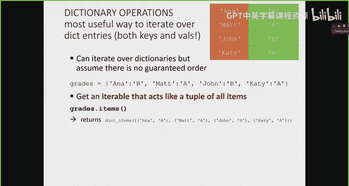

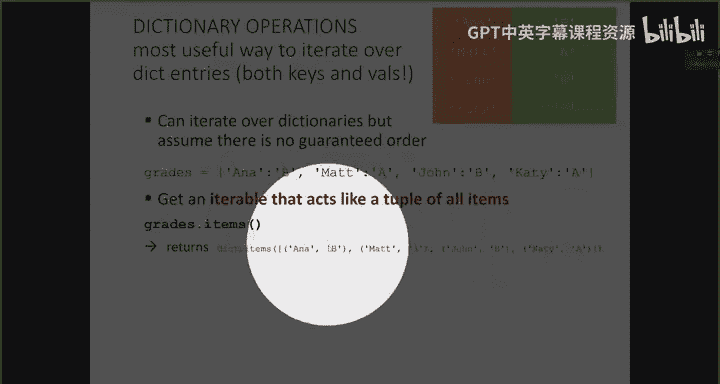

And again， we can cast it to a list to give us something that's more recognizable。

 You can see now each element in the returned list is going to be the tuple where I have an entry。

 right， So my entry and a comma B is this first element in my return list。

 And then Matt A and then John B and then K D， A。 So I grab these entries together where I have access to both the key and the value for that entry。

😊，Which means， and this is the important part that we can do something like this。

 and we can do this for the previous slide as well。

 but for this particular grade dot items iteration， if we're grabbing a key value pair out of items。

 that means we can do something like this for K comma V in grades do items。

Means that Python will map K to the key for that entry and V to the value for that entry。

 as I'm iterating over each one of these pairs。 right So with each iteration。

 I have access to both the key and the value for that entry， which is pretty useful。

So if I have this line of code here， if I print key K has value V。

 the K and the V will change with each entry。And I'm just grabbing both the key and the value for that entry。

It's not a tuple。 so the actual object type is this thing di to underscore items。So again。

 not a type that we've， we've worked with before， but that's just the the， the type， right。

 Like we've seen lists， tus， dictionaries， dit underscore items is another data type。

But the cool thing is that it's iterable。 So it's a sequence of values。

 which means that you can cast it to a list， which is also a sequence of values in and knows how to do that casting。

 And you get the more recognizable list that we've been using。😊，Other questions。Okay。

 so I really like using grade that items to iterate over entries。

 So let's have you try this exercise。 So it's a function called count matches。😊。

It takes in one dictionary， D。

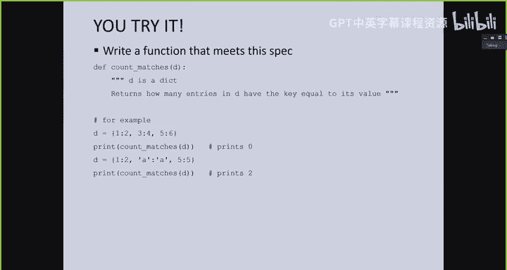

I didn't say what the elements are， but you know you can mix and match。

 so here I have a dictionary with just ins mapped to ints。

 and here I've got a dictionary where it maps， you know ints and strings and things like that。

And what I want this function to do is tell me how many entries in this input dictionaries have the key match its value。

 So here in this first example， the key here is one。 the values 2。 So they don't match。

 These don't match and these don't match。 So the count should be 0。 But down here in this example。

 the one doesn't match 2。 So that's fine。 But the key A matches its value。

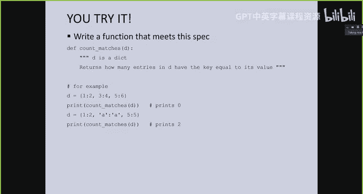

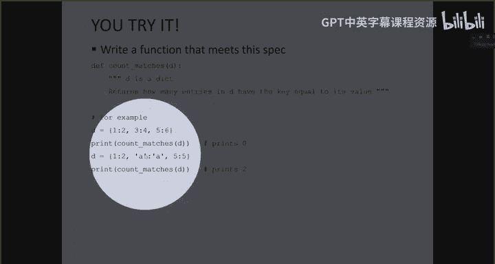

1 count， key 5 matches its value，2 counts。 right， So this should return count2。All right。

 let's have you work on that down by line 137。And then we'll write it together。Alright。

 how could I start this。Yes。Account， yes。0， yep。A for loop， yep。Yep， as a function， yep。

V equal equal K。 yep， so this is where my value equals my key for that particular entry。

Count equals count plus one perfect。Yep， return count。Did anybody do it a different way。No， okay。

 awesome。都员。We can write it， yeah。Yeah， so we can say for X and D dot keys or something like that。

 right。Something like that or't no。 We can also say for X and D， I think that might work， too。

 because it will grab the key for us。But just to be save keys。And now we need to grab the value。

 So how do you grab the value associated with K X。Yeah， square bracket。 It's just indexing， right。

 So D square brackets x。oops， if。D square brackets x equals。 so that's the value equals the key。哎。

Then again， we， you know， count plus one。So， this is there。Other way。要。So we don't have to use items。

 but it just items makes things easier because we have in hand a variable that's， you know。

 the value and the variable that's the key。 And doing things like indexing starts to get confusing。

If， you know。I mean， it can be confusing。But yeah， both ways are very valid。 So let's run it。

And it should work。 Y， so the first count is 0， as we expected， and the second count is 2。

Is that any questions about this code， Does it make sense。

Is there another way that somebody tried it？No， okay。Okay， so dictionaries。A mututable objects。Right。

 so all the aliasing and cloning rules apply。 remember when we talked about lists and using the equal sign between a list and another variable name。

 just a plain old equal sign means that you are making an alias for that list。

Same thing applies to dictionaries。 So using， you know， saying D1 equals D 2。

 where D 2 is a dictionary means that you've just created an alias for that dictionary。

 So if you change the dictionary through either of those variables。

 you're changing the object itself。If you want to actually make a copy。

 you use D dot copy where D is the name of the dictionary。 You'd like a copy。

 and that gets you a copy of that dictionary。 And then you can change it without changing the original one。

So let's talk a little bit about the values for a dictionary and the keys。

 because there are some restrictions on the keys for the dictionary。 No restrictions on the values。

 So dictionary values can be any type， right， You can have a dictionary value。 that's a float。

 int string， tuple。 You can have a dictionary value。 That's a list， right， which is a mutable object。

 You can have a dictionary value。 That's another dictionary。All are okay。

 whatever you'd like for the values to be。You can have dictionary values that are duplicates。

 So you can have one key that maps to value 5， another key that maps to value 5。All good。

So the key so the values don't need to be unique。 We do have restrictions on the keys， though。 Okay。

 the first restriction on the keys is that it has to be unique， right？ So if you're mapping a key。

One to value 5。You cannot map a key 1 to value 6。Cause if you go and look up the value associated with one。

 how does Python know which value you'd like， the five or the6。Right， so the keys have to be unique。

 first of all。Second， the keys have to be immutable， technically hashable。

 but for the purposes of this class， just think of them as having to be immutable。

So a key can only be one of these types that we've seen so far。 It， float， string， tuple or bo。

 You cannot have a key。 That's a list。 You cannot have a key that's a dictionary because they're mutable objects。

So let's look at that a little bit further in detail。

So the reason why we can't have a key that is mutable is because of the way keys are stored in Python。

sorry， the way the dictionaries are stored in Python。

So I'm going to show you an example on the next slide。 First。

 I'm going to explain how they're stored， and then we'll go through an example showing you exactly you know why you can't have a mutable structure。

So the way keys are the way dictionaries are stored in Python is you first need a key， right。

 to associate with a value。 So everything starts off with the key you'd like to add to your dictionary。

So Python basically runs a function called the hash function on the key。For simplicity's sake。

 let's say the key you're trying to store is a number。

 That hash function might return that same number。 It might return something else。

If you're trying to store a string as a key， Python。

 again runs maybe a different hash function that takes in that string， which might be a。

 bunch of characters， and it converts it to some number。

 So the hash function always takes in your key and converts it to a number。That number。

 think of it like representing a memory location where you're going to store the value associated with that key。

Right， so you're always grabbing a number that represents a memory location。At that memory location。

 you'll store the value。 So next time you want to look up the value associated with the key。

 you just run that same hash function。The function won't change。

 You run the same hash function on your object， and you'll be able to get that same integer back。

 You'll be able to grab that same value back。But if you're storing mutable objects。

 that means that object can change。 So if you run the hash function。

The thing that gives you a number on something that's changed。That number might not be the same。

Right，Because you've changed the thing that you're passing into the function。

 So why would it give you the same value back。So let's look at this example。 So again。

 we're storing grades。 And let's say we're trying to store a bunch of grades inside our memory。

 And let's say our memory is just you know，616 locations， So 0 through 15。😊。

So at each at these locations， I'm gonna store grades associated with a person。

The function I'm going to run on the student is using their name。

 So I'm going to store Anna's grade somewhere。But I need to run a function that takes in the string。

 A N A。And gets for me a number。 That number is where I'm going to store my grade。

So a simple hash function we might do is to say， well， I'm gonna take A and map it to 1， B。

 map it to 2， C， map it to 3， and so on。

I can sum all of those numbers associated with my letters in my name， right 16。

 and then I can mod it with 16， which is how many entries I have in my memory。

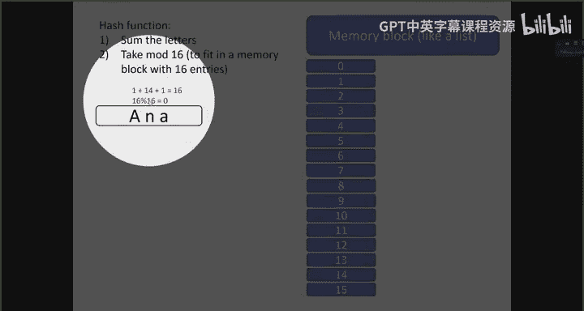

So if I mo it with 16， that's going give me a number 0 through 15。

If you take the remainder when you divide by 16， you'll either get 0 all the way up through 50。

So if I mad my name， that means I'm going to store my grade。

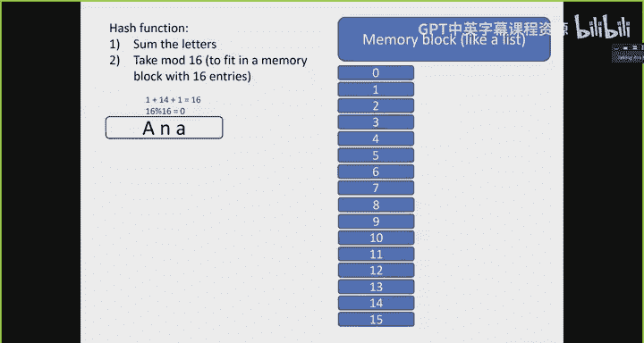

And at memory location，0。

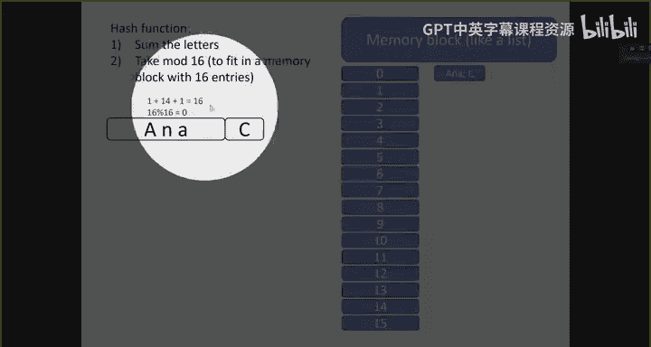

So far so good。So I'm basically， I made up this hash function that tells me where to put my my grade。

Now， I add another person。Again， I'm gonna look， I'm gonna convert the letters in their name to numbers so that I can easily get a number out of their out of their。

 their letters。 So I'm basically hashing their number， their letters to a number。

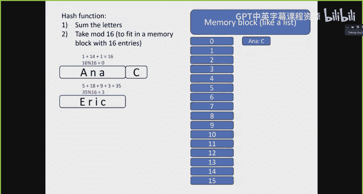

Again， summing this for Eric is 35。 I'm gonna mod it with 16。

 which means I'm gonna put Eric's grade at location 3。

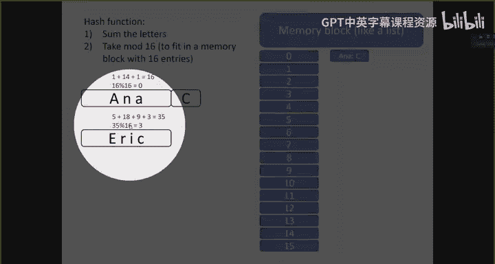

Next person， John， same thing， right， I add the numbers modd 16。

 I'm going to put John at location 15。 So this is my memory where I'm storing the values associated with these students。

 So if I want to grab back my grade， I run the exact same hash function。😊。

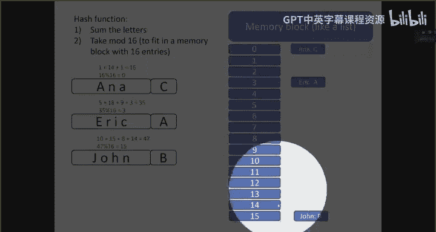

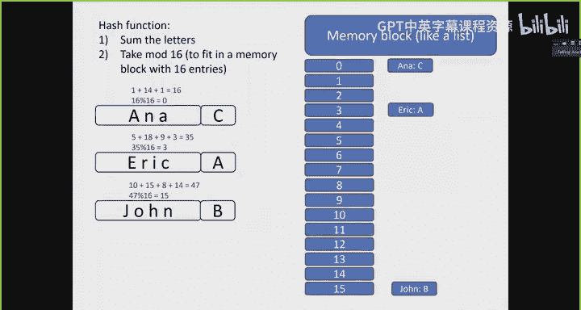

So I'm gonna run the same hash function on my name。 My name hasn't changed， right。

 It's still the string。 I'm not allowed to change it because it's a string。

 And so I'm going to get the same value back 0。 So that means to grab the letter associated with my name。

 I just need to go straight into my memory location and look up the value associated the value at that memory location。

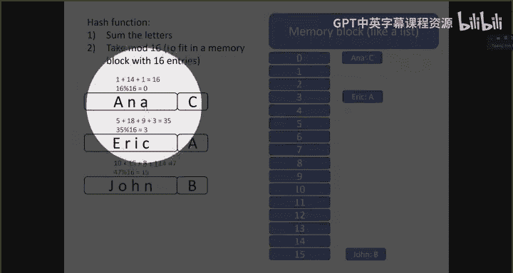

So I know it's going to be a C。Now， let's say I'm storing a list。A student name as a list。So again。

 Anna， Eric and John are immutable， right， They will not change。 But if I store Kate as a list。

 her name might change。Again， I can run the same hash function on her name。

 That means her grade when I first store it， is going to be at location 5。

 So I'm storing Kate at location 5。All these three strings。

 I know I can get back because they cannot change。But let's say that Kate goes and changes her name from Kate with a Kate to Kate with a C。

It's the same object， right， The same person。 She earned her grade B originally。

 So if I want to grab her grade back， even though her name has changed。

 I would still like to grab the B associated with her as a person。But Kate， with a C。

 if I run that same hash function that I ran to put her grade in my table。

Tells me that I now need to look up her grade at memory location 13， no longer at memory location 5。

She's not there。So now it's like， you know， did the student disappear and all that stuff。

So you see now that means I thats， that's the reason why I cannot have a a mutable object as a key to my list。

 because if that object changes， running that hash function on that changed object might not give me the same memory location where I originally stored the value associated with that object。

that makes sense。OK。So let's revisit our original example。

 The one where we tried to store everything in a master list， all these grades in a master list。

Now let's store it in a master dictionary， okay。So I've got my grades。 Notice curly bracket。

 Curly bracket is a dictionary。 I've got two students in my class， Anna。Right。

 so this is Anna's information And Bob。 That's Bob's information。

So just two students in my master dictionary。 So the key Anna right is going to be one entries。

 one entry key。 key Bob is the other entry key。And what's the information associated with these keys？

 Well， with Anna， I've got this dictionary associated with her name。So that's this big thing here。

 I'll explain it in a bit。And similarly with Bob， Bob has one thing associated with it， him。

 And it's another dictionary。So I'm mapping paying strings to dictionaries here。

 And that's fine because values in a dictionary can be other dictionaries。

So what are these dictionaries about？Well。The number of items in the dictionary for purse for a particular person。

 there's three elements， right， so comma comma separates my three elements。

 The first one is going to be mapped with key M Q。 The second one mapped with key P for problem set and the last one mapped with the string f for final。

So each one of these students has this dictionary associated with them And that dictionary。

 then itself has three entries， one for the micro quiz， one for the PS1 for the final scores。So now。

 what's the values associated with those keys？ Well， the microquiz is going to be a list。

 The problem set is going to be a list， and the final is going to be a string。

So a really nice representation of my， of my class， right， and same for Bob。😊。

So now what if we want to grab a students exam grade or the student's list of exam grades。

Remember that big function， right， with the two nested four loops and the nested ifs。

 that becomes this line。Isn't that cool。😀呵呵。😊，Applause， I like that。 Yeah， exactly。

 we should applaud this because， look how easy it is now to。 Yes， thank you， yes。😊。

Dictionaries are awesome guys。 So， yeah， So， look， that line becomes this， you know， grabbing one。

 one quiz score becomes this single line of code right here。😊，So let's break it down。 Again。

 we do left to right whenever we've got this chain of stuff going on。 So the first thing we say is。

 well， we're looking up grades at some index。 So grades at some index gives me that dictionary。

 So something like this whole thing here。Okay， good。 That's first chain。 Now。

 this box here gets replaced with that dictionary。 and I'm doing another index into that dictionary。

 So that means I'm gonna grab the M Q associated with。That that dictionary。

So the value associated with M Q is going to be this list 5，4，4。

So this box here gets replaced with the list 5，4，4。

 And then if I want to grab just the first quiz value， I say now I'm going index in the list 5，4。

4 and index 0。 So that grabs for me just the5。 So then the first quiz score for Anna was a 5。

It's pretty bad。O。So。U。Let's have you think about this。This is a function。Nothing to code here。 just。

 just to think， this is a function that grabs。The average of every single。

Thing。Where that thing is what in the class。 So if what is M Q as you know。

 is in down here in this example， if what is M Q， this code is supposed to get the average of all of the microquizzes for all the students in the class。

 So you basically want to grab the average of 10 plus 8 plus 3。

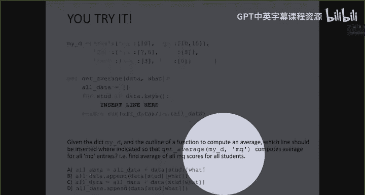

And if it's PS， I would like to grab the average of all the problem sets for all the students in the class。

 so the average of 10，10，7，8， and0。

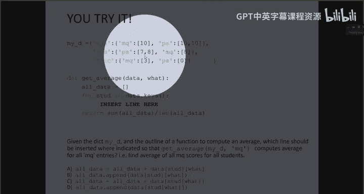

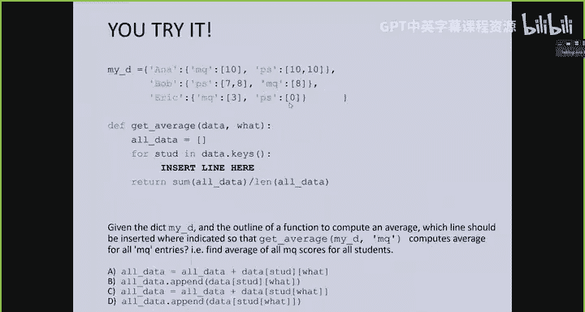

So we've got a loop， right， that goes through every student in the keys。 So the student。

St stud st here is going to be this dictionary， right。So given this dictionary。

 what line should you insert here。Such that you're creating a list。

 just a single top level list of all of the values in there。

 So the thing you actually want to end up with。 And if we're looking at the P scores just because it's a little easier to think about is going to be10。

10， right，7，8 and 0。

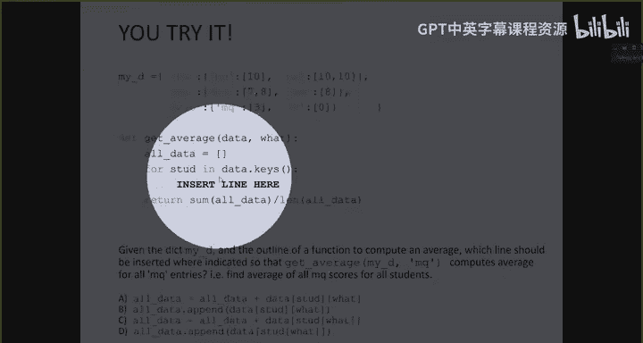

So in the end， what I would like to get in my all data。

 this list that I'm maintaining here is something like this for the P S。

So think about which one of these lines will accomplish that。And just to help you out， we can say。

Student is， you know， my dictionary of。Who thinks it's the first one。Second one。Third one。Fourth one。

OK。Nobody thought it's the first one。 Are you guys sure。Why do you think it's the second one？

Is it because of the append。呀。Let's think about it。 So all data is a list。And what are we appending。

 So what is data at stud at what going to give us。Data at student。

Is the dictionary， this dictionary here， right， this value here。

And if we take this value and index into the what， will it be an integer or will it be a list。

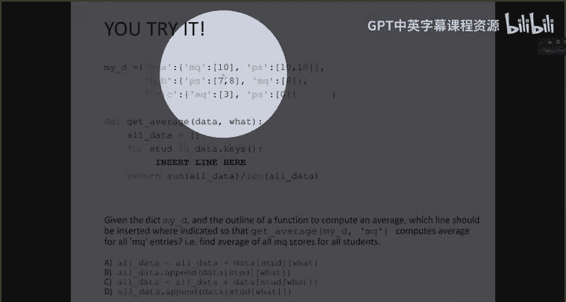

A list。So when we append a list to another list， what is that going to give us？

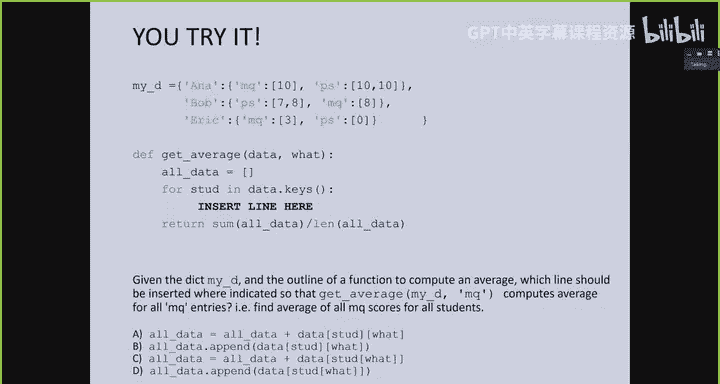

So if we have a list already with， you know。You know， ABC。If I append another list to this。

 will it put the element within that list or the list itself。Yeah， exactly。So I don't。

 that's not going to work for us。Clearly， D is not right either。

 and definitely indexing into data at student at what is not going to be right。

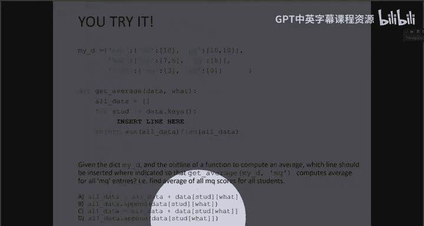

So that leaves one other choice。The first one。So let's see why the first one works。

We're concatenating， right， so the plus concatenates。So let's say I already have a list， A，BC。

I'm going to concatenate something I already have with data at student at what。Which we said is。

 what， is it a single element or another list。Exactly， so we would concatenate with something like。

 you know，10，10 or something like。So that will return for us A，B， C，10，10。

 which will allow us to do something like getting the sum of all these elements。Questions about that。

 Does that make sense， Is it right。Yes。Yeah。他他。Because we're indexing into M Q。

 So if you index into M Q， M Q is your key。 So you grab the value associated with that key。

 So that would be this list here， the 10， or for P， S， it would be the list 1010。

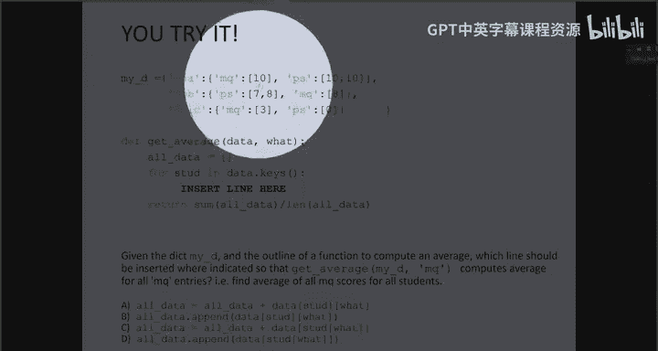

So quick recap on lists and dictionaries before we do one final longer example。 So again。

 lists are ordered sequences of elements， right， there is some element at index 0。

 There's some element in index 1， some element in index 2。 So we do have these unquote indices。

 right， But there's there's an order to these indices。

 And there has to be an element in index 0 and further up from there， right。

diicctionaries also have these quote unquote indices， which we call keys。 but these are customs。

 So you can basically rearrange。 You can think of it as being allowed to rearrange indices。

 however you'd like， right， There's no order to the indices in a dictionary。

There are some restrictions on the keys or these indices， so they can't be immutable hashable。

 but other than that， you know， the the things that you store related to that key can be any type。

 just like you can store any type in a list。So the last thing I'd like to go through is a larger example。

 And this would showcase a whole bunch of things that we've been talking about so far。

 It will showcase sort of how to。First of all， create dictionaries， which is what we did today。

 It will showcase how to reuse functions， You know。

 how to write functions and reuse functions in other places。

 It will showcase a little bit of mutability as well。 But you know， this is all in。

 in a larger example and。You know， if I go a little bit faster through this。

 I've given you Python Tutor links， and it's also in the file to run on your own。

So that the goal of this function of this last example is to basically find the most common words in a song's lyrics。

 And dictionaries are going be really useful for doing something like this。 So I'm going to show you。

 first of all， what we want to end up with。 And then we can talk about how to divide this larger problem into smaller pieces。

😊，So， okay， so those are all the pieces。 But basically， what I want to end up with is。

I want to have a song。Be stored as a string。😡，Okay。You'll recognize these， but these are very old。

 I actually haven't updated these songs for a few years。 But yeah， anyway， don't judge。

 So I've got a song stored as a string。And I'm going to run each individual function。 But in the end。

 what I'd like to do is come up with something like this。

So I wantna present the user the top most common words in the song。So here I have a list。

 you can see open close square bracket tells me it's a list。 and I've got elements in my list。

 So here's the first element in my list， which tells the user that the， the word I occurs 18 times。😊。

The next element in my list tells the user that the word we occurs 17 times。

The next element tells the user that the words ain't ever getting older， occur all 16 times。

And then so on。 right， So we're decreasing in frequency with the most common word occurring 18 times。

 And then I'm showing the user。The most common words。Down to and including 6。

 So I would choose some arbitrary value。 I want to find in the song。

 the words that occur at least six times， for example。So that's the goal of this program。

So how will we achieve this， It's obviously a pretty big task。 I wouldn't want to code， you know。

 the the entire thing right off the bat， But we can actually divide it into three smaller pieces。

The first piece， and we're gonna write the code for this。

 is to create something called a frequency dictionary。 So given a string of words。

 we're going to create a dictionary that maps each word to how often it occurs。

 So fancy word frequency dictionary。 But it's pretty simple。

 It just maps the word to its count inside my long string。😊，So this presents the data。

 which is this string of words in a much nicer format， right。

 It's a dictionary that tells me the frequency of each word。Once I have that in hand。

 things get a little bit easier。 I can write another function that finds the word that occurs most often in that dictionary。

So the way I'm gonna do that is look up the frequencies and the values。

Find the maximum of those values and then figure out which keys are associated with that maximum value。

And this is all made possible because I've reimagined my data in this frequency dictionary format。

The last step， once I figure out how to write a function that returns for me。

 the words that occur the most times is to find the words that occur at least some number of times。

And I'll go through an example of this one in in a few slides when we get to it。

 But this last function here， number3， you can actually rewrite it in a whole bunch of ways。

 I'm just gonna to show you one way to write it thatll involve mutability。

 but you don't have to do it using mutability。 You can definitely do it in a whole bunch of。

 you know， with a whole bunch of other implementations。

So let's begin by first creating a dictionary that maps the word to their frequencies。

So I've picked a song。That it has is a real song， and it has some repetition。

 and it's short that it fits in one line。So I've got this song here。

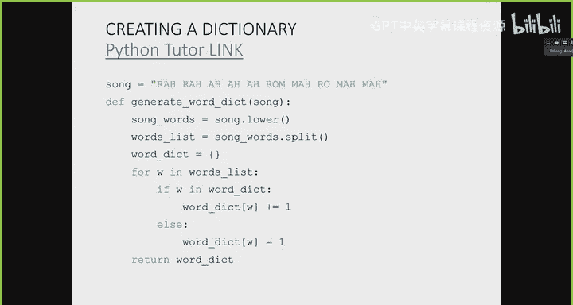

And I've got my function generate word dictionary， the song。

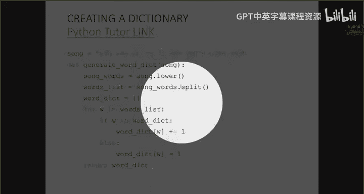

Is a string， right， So it's basically the song a little bit cleaned up， not in terms of words。

 but in terms of removing punctuation， removing， you know， comms， maybe exclamation。 or I I。

 I might have kept quotations or something like that。 But basically。

 it's removing all of the punctuation and stuff。 because that will mess up my word count。

So what is this function going to do， given a string for my song。Well， first。

 I'm going to convert all my letters to lowercase。This means that， you know。

 capital T H E will be counted as the same， know， the same word as lower K T， lowercase T H E。

 which is the correct way to do it。So convert everything to lowercase。

Then I'm gonna use our friend the split function。 remember。

 which takes in my string and splits on a character。 So by default， itll split on the space。😊。

This puts our string of。Words。In a very manageable format， a list of words， right。

 much nicer to work with lists than work with a string。Now that I have my word list。

 I'm going to create my empty dictionary and then populate it。So I'm iterating over my list of words。

And then， I have a choice。Either I've seen this word already， and I want to update the frequency。

 right， so I want to increase the frequency by one because I've already added this diction。

 this word to my dictionary。Or this is the first time I'm seeing this word。

 and I want to add it to my dictionary with a frequency of one。So the first， if， the first case here。

 the if will update the frequency because I've already seen the word in my dictionary。

 So here I'm using the n keyword to check if the key， the word is already in my dictionary。 If so。

 I increase its frequency by one。

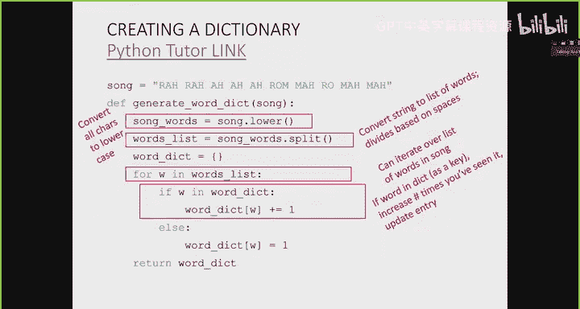

Otherwise， this is the first time I'm adding my word to my dictionary。 So give it a frequency of one。

And then I return the word dictionary。 So this will map strings to integers。

Let's work through it in the Python Tutor。So step， step， step， step， step。Lowercase。

 my input string step。 I've split it。 So now I've got this list of all of my words。

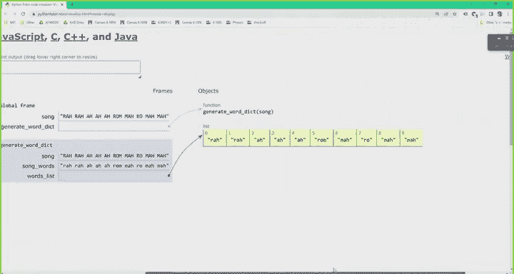

Sttop。This is where we begin。 So I've created my empty dictionary over here。

 This is keep an eye on this area here。 It will become populated soon。The first word。W is raw， right。

 It's the first word in my list。 It's obviously the first time I'm seeing it。

 I have nothing in my dictionary right now。 So I'm gonna pop in my else。

 and I'm gonna add it to my dictionary with a frequency of one。Yay， that worked。

Next word in my dictionary is this in my list， is this one。Same word I've already seen。

So I'm gonna go inside the if and increase the frequency to 2。Right， Ro is now too。Next is R。Right。

 so here's my word。 I've got the next one in my list。 It's the first time I'm seeing it。

 Add it to my dictionary with a frequency of one。Next word I'm seeing is， again。

 increase its frequency to two。And I'm gonna go faster now。 This is increasing frequency to 3， right。

 because I've seen it three times now。 And then I'm adding。Rome， for the first time。

 Ma for the first time and Ro， for the first time。And lastly， I'm going to increase ma。

Frequency two more times because it occurs two more times in my song， right。

 so that it's increased to 2。 and now it's increased to 3。 And then we're done。

 So we return the word dictionary。Really nice way to represent my list my， my song right， Very nice。

😊，Okay， so now that I have this frequency dictionary and I've put it up here。

 This is what we ended up with。 How can we write a function that returns for me the most frequent word。

So。One thing we can recognize is the most frequent word has the highest value。

 Python dictionary value in my dictionary， right， So as a human。

 I would kind of look to see which which one of these entries have the biggest value。 as a computer。

 I can't really do that because I have to do it a little bit more systematically。

 So what we can say is， well， let's look at our values and grab the maximum of the values。

 So here I'm using this dot values function on my dictionary to grab for the to grab for me all of the values in my dictionary。

 So this will be kind of like the list two comma 3， comma 1， comma 3， comma 1。😊。

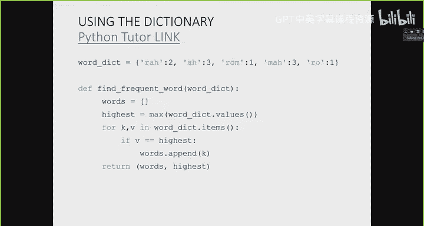

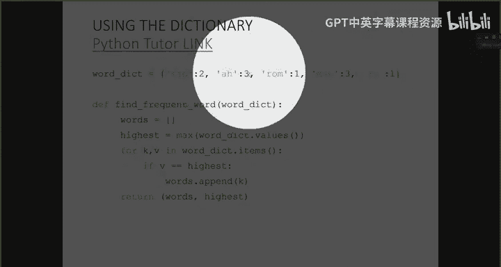

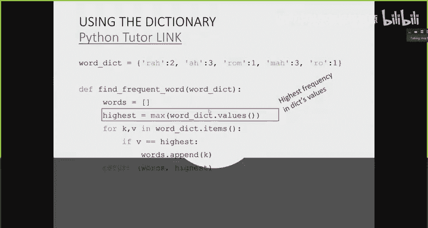

And then I'm running the max function on that list。

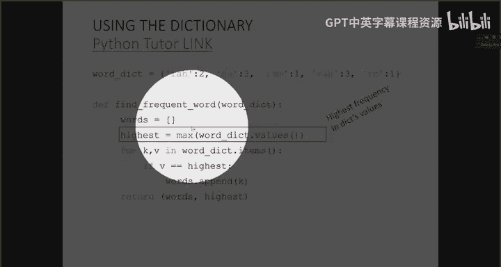

So max of this list of numbers gives me the maximum value in that list， the three。

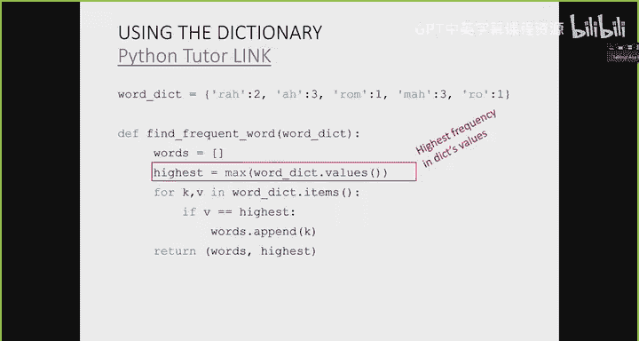

So highest now has the value integer 3。And now all I need to do is iterate over my element entries in my dictionary。

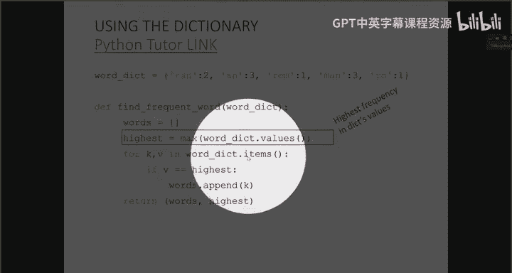

， so this is K V in the items。And I'm checking now inside this iteration is if the value is equal to the highest。

 So as I'm looking at each entry， is the value for that entry the same as the highest 1 I've seen。

If it is， I'm going to maintain a list of all the words with that highest value because there might be more than one word that has that highest value。

 As we saw when we actually ran it here， right， here。

 I had a list of all of these words that occurred 16 times。

 So that's kind of the output that I want to maintain。看。So I'm appending to my words list。

 And then at the end， I'm returning this tuple with the words comma。 that highest be。

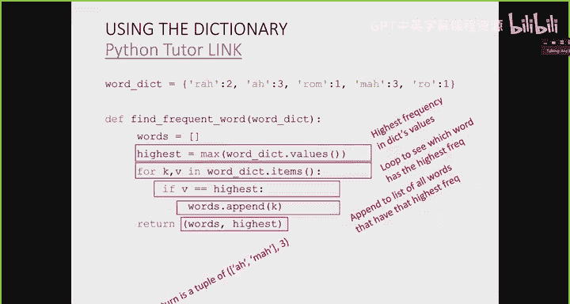

So。Python Tutor。like like in the previous time。 So let's create our original dictionary。

 This is what we ended up with last time。 So the highest value is three here。

 And I'm going to look through each entry in my dictionary。

 So you can say see K V is going to be each one of these in order。 So first， it's raw 2。

 Then it's 3 and so on。 Obviously， the two is not equal to the3。 So we move on。

The three equals the three。 So we take the a and boom， add it to my list here。

 So this is the list I'm maintaining of all the words that occur with that frequency 3。Next， no。

 for Rome， yes， for ma。 So I'm gonna add it to my list。And then no， for row。 And I'm done。

So the return is going to be this list， this tuple here with the list of the words that occur three times。

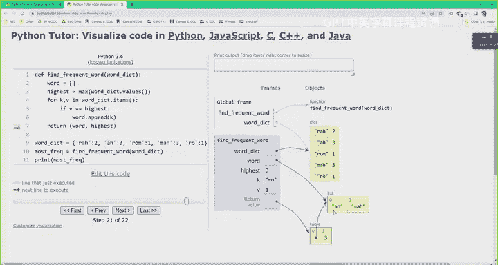

O。Last part， I'm not gonna go through Python Tutor。

 I did include a link to it because it becomes very messy with the arrows。

 but I do encourage you to try it， try to follow it along on your own time。 I will explain the。

 however， the the way that I chose to solve this problem。

 So I chose to solve this problem to include mutation。

And reusing the function that we just wrote that grabs for me the highest value and the words associated with that highest frequency value。

So， this is the idea。I have my original word dictionary。Right。

 this is the frequency dictionary we created right off the bat。What I'm gonna to do。

Is look to see which words occur with the highest frequency。So the highest frequency。

 my function from before grabs for me， it figures out that it's 3。

And it figures out the words associated with that three are a and Ma。That's exactly what we just did。

So I'm gonna grab those words and those entries in the dictionary。

And then I'm going to mutate the dictionary to remove those words。

 because I know those words occur with the highest frequency。So now I've removed those words。

 and I've saved them because they were the result of the function that I had just run ran。

So I'm maintaining this frequency list， which will contain all the words that occur at least。

 I guess I said one greater than one time。 So at least two times。

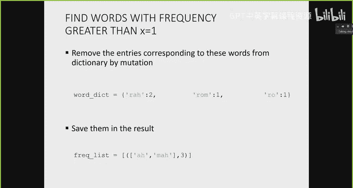

So I'm going to grab the ones that occur three in two times。So right now。

 I had just grabbed the words that occur three times。

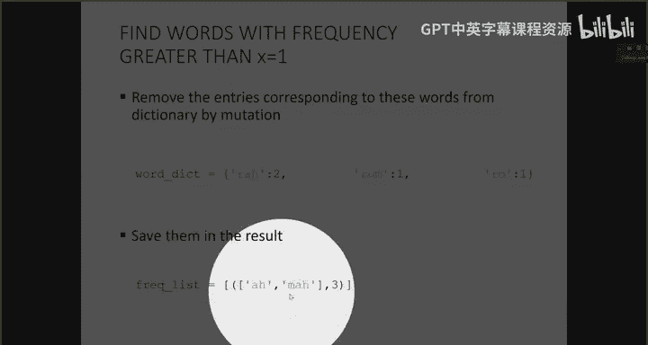

I've removed them from my dictionary。 So I've actually mutated my dictionary to remove those words。

Now， if I run the exact same function that I just wrote on the previous slide on this mutated dictionary。

Which words will it give me， Which words occur the most now。Exactly， right。 Now。

 the highest value in my dictionary in this frequency dictionary。Is 2。

 cause I mutated to remove what was previously the highest value。

 So I'm running the same function again on the mutated dictionary to give me just the raw。 right。

 So I grabbed that。 Keep track of that in my frequency list。😊，Right。

 mutate the dictionary to remove that。And as I'm doing that， I'm。

 I'm also keeping track to make sure that the highest frequency I have in the remaining dictionary is at least。

 you know， whatever I was interested in。 So here I wanted at least two。

 So this function the 1 I will write will no longer grab any other values from the dictionary because now one frequency 1 I don't want to grab。

 So this is the resulting value。

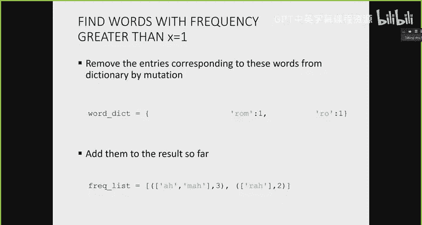

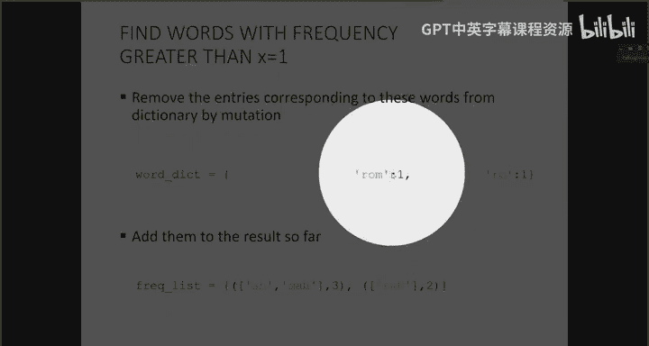

And that's the idea。 We're using mutability and the function we just wrote to do this task。

 And this is the code that does that。 So this runs the function we wrote previously， step number 2。

Gives us that list， that tuo with the list of all the words。

This loop here makes sure I still have frequencies that are at least x in the dictionary。

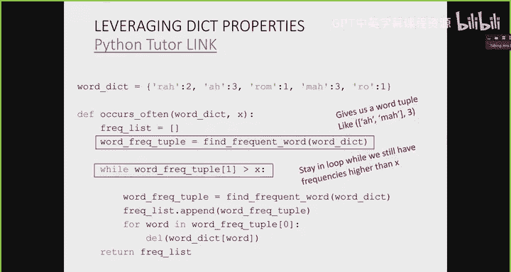

I grabbed the the tuple that I just created。 So something like this and added it to my frequency list。

 So this is the resulting list that I'm keeping track of。

 And then this bit here removes the word from my dictionary。

 So I'm mutating the dictionary using this Dell keyword that we saw you know。

 at the beginning of this lecture。Yeah， question。気ちる。没这个。Yeah。喂。

So I think maybe it's because the function， I forget what the specification said。

 but I don't know if its said at least two or greater than2 or greater at least x or greater than x。

 It depends on which 1 I actually said in the specification。

 But you can imagine changing this to greater than or greater than or equal to。

And then we're running this function again inside this Y loop to grab the the frequency。Yeah。

 so these are just the observations I actually stated at the beginning of this example。

 a bunch of the different things that we've learned that we're using within this example。

 So slicing or splitting， iterating over the list directly， mutability， you know， using the items。

 things like that。So that's it。 That's all I have。 I'll see you guys on Monday。 Monday is Halloween。

 If you'd like to bring a costume。I love Halloween。 I will wear something different。

Thenhan what I usually wear。

