# 《计算机科学和Python编程｜6.100L Introduction to CS and Programming using Python, 2022》 - P15：-15-Lecture 15_ Recursion.zh_en - GPT中英字幕课程资源 - BV1PAxJzVEs3

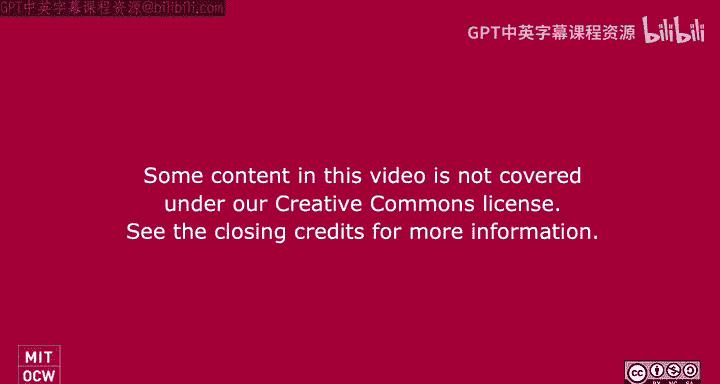

Alright， so let's get started on today's lecture。 So today we're going to be doing one of two lectures on the topic of recursion。

 And you may or may not have heard of recursion。 It's a programming technique and a way to algorithmically solve problems。

It's not something that it's going to come easy because it's going to force our brain to think about problems that we've seen in a completely different way。

Okay， so it you don't have to use recursion if you don't want to。

 but there will be problems where the idea of recursion and applying or writing recursive code is going to come a lot more naturally than writing code that we have been so far。

But I'm just warning you， it's going to take a little bit of kind of forgetting everything we've learned about loops and things like that to train our brain to think recursively for the next two lectures to help you。

 We will have an interactive portion of today's lecture。

 So think about whether you want to come up on stage or whatever this is the front。

 and be a part of the the interaction。 You'll be forever immortalized in on the open course where。😊。

Awesome， I love it on the open courseurseware videos。😊，All right。So， let's think about。

Ittererative algorithms that we've seen so far。 So iterative algorithm basically means we are writing code that has a loop within it。

 right， So either a four loop or a Y loop。Writing code with these for loops or while loops really lead to iterative algorithms。

 So things that that do some task， some for some repetition。

So the idea of an iterative algorithm is that there are some variables that capture the state of the computation。

 So each time through the loop， these variables will change their value。

 essentially capturing what the values are at each step in the loop。

So when we're writing these iterative algorithms， we basically think about what is something that's changing each time through the loop。

 Like we keep a running sum。 like that's the easiest example， right？

 What is a variable that's changing each time through the loop。

 kindnd of like a counter that keeps track of how many times we've been through a loop。

When do you stop， So for four loops， you stop after you've exhausted a sequence for while loops。

 you stopped when you have a condition that becomes false。 And then at the end of the loop。

 you have some sort of result that you've been storing and accumulating or changing each time through the loop。

 So that's an iterative algorithm。 And we've been working with these a lot。

So to show you we're going to go through the next few slides showing you an iterative algorithm to do multiplication。

 It's going to be very， very simple， but we're also then after going to look at the same problem。

 which is doing multiplication， but in the context of recursion and hopefully that gives you a sense for how we think about the exact same problem we're trying to solve。

 multiply two numbers together in a completely different way。

So this is not the function that I want to write with iteration。

 I don't want to create a function named Molt and then return a a star B。

 right I don't want to use the builtin function。 I want to assume that I don't know how to do a star。

 a multiplication。 And so instead， what I'm going to do is I'm going to rely on。

 let's say I know how to do addition。 I'm going to rely on the idea of addition to actually write my multiplication function。

So let's think about how to make multiplication iterative。We can have a loop， right。

 that that adds a to itself B times， right， That is the definition of multiplication。

So let's write a function that does this using a for loop。 Then we'll write it using a Y loop。

With a for loop， we're going to write this iterative algorithm。

 It's capturing the state of the computation just like we said we should。

 So the for loop will iterate will have my sort of range of values being from0 to B。

 So we're going to repeat this loop B times。The variable total is capturing my state of the computation。

 right， It's keeping track of what the total is at each step through my loop。At the end of the loop。

 I return the total。So very， very simple iterative of， of function here。Now。

 let's think about another iterative solution。 instead of keeping a loop variable B that goes from 0 all the way up to B。

 or what was that my loop variable。 And， I think， yeah。

 instead of keeping a loop variable and that goes from 0 to B， let's work our way backward。

 And this time， let's use a while loop just for fun。

 Let's say that I'm gonna start at B and count down to 0。 So again。

 going and repeating some task B times。😊，So what I'm going to do is I'm going to have some， you know。

 counter that starts at B and decreases down to 0。Again， within my loop。

 I have to keep track of the result。 So my total in the previous code is now being called result in this code。

And so what I'm gonna do is my iteration will start right we 0。

 And then I'm going to keep adding a to itself， B times。So the code looks like this。

I've got my wide loop this time instead of a four loop。

 I'm going to start out with knowing what B is， and I'm going to decrease B by one each time through the loop。

So here I've got B equals B -1。So that's capturing the state of the counter at each iteration。

 The result， just like the total in the previous slide。

 is capturing the state of my sum at each time through the iteration。 And at the end。

 I return result。So hopefully， very simple， very review code here。But now。

Let's look at the code in a recursive sense。 So here， let's not look at the code yet。

 But let's think about， is there something thing that we're repeating over and over and over again。

 If we recognize it， we can think recursively。 Okay。

 so let's try to figure out this recursive pattern。So I work best with example， like actual numbers。

 So instead of using an abstract A And B， let's use A as 5 and B as 4 as an example。

So let's say I want to use the star operator。 That's basically the function I'm trying to implement。

 the star operator between5 and 4。So in the iterative sense， we said that's 5 plus 5 plus 5 plus5。

 adding 5， four times。The idea of recursion is that we're trying to take our original problem。

 which is using the star operator between two numbers。And try to solve a very similar problem。

 if not the same， but in a slightly changed way，So instead of saying I'm going to multiply 5 by 4。

 what I will do is recognize that five times 4， which is my original problem。

Can be rewritten by extracting out one of my fives。 right。

 So I'm going to take a five out and add it to。5ive times 3。So this is my recursive pattern。 Okay。

 I'm using the star operator between 5 and some number。But if I extract a 5 out。

I can use the star operator between 5 and a slightly smaller number。One， less than four。Well。

 what if I do the， What， what about five times 3， Can I do the same thing again。I can， right。

 for five times 3， I can， again， notice that I can extract the five out again。

 and I have 5 plus 5 times 2。And then I can do the same thing again to figure out what five times 2 is。

 I can again extract a five out and be left with five times 1 or five star 1， right。

And so notice the thing inside the boxes is basically me solving my original problem。

 which is using the star operator between  five and some number。

But that number is changing each time on each line。At some point。

 I can say this problem is so easy that I know the answer。 So 5 star 1。

 So a number multiplied with one is just the number itself。And so at that point， I can say。

 I don't need to continue dividing my problem into smaller and smaller pieces。

So just to bring the point home， let's use parentheses to illustrate sort of which pieces I'm replacing where。

 So I've got my original problem，5， applying the star operator rate the multiplication on 5 and 4。

I extract the five out， and I recognize that I can have five plus and then solving5 star 3。嗯。

I need to have some trust here， right， I don't know what 5 star 3 is。

 but if I decompose that problem in the exact same way， I can extract the five out of that。Right。

And add it to5 star 2。Right， so the thing in the boxes our equivalent。And then again，5 star2。

 I'm going to recognize this is the same problem I've been trying to solve。

 let's apply the same solution， which is to extract a five out multi and add it to the multiplication of five star1 less。

So again， the two boxes are equivalent。So this idea here where we're recognizing the same problem and kind of dividing it。

 dividing it， dividing it。Having， you know， this trust that at some point。

 we're gonna divide it so much that we've reached a fundamental fact that we can solve is this divide step。

Okay， so we're gonna divide it all the way up to all the way down here where I've got 5 plus 5 star 1。

At this point， I can say， well，5 star 1 is going to be 5。Okay。

This is a basic fact that I can just solve。 I don't need to divide this problem any further。

So once I solve this fact， I can start building back up my answer， right。

 And I can start passing the answer back up the chain of， of multi multiplication calls， right？

 So if I'm at this step here， and I figured out that this is 5 star 1。 This5 star1 is equal to 5。

 I can just replace it with the  five。And then I can build up the solution to this five star 2。

 because now5 star 2 is just 5 plus5。So this is going to be T。 right， It's just simple addition。

 right， There's no more multiplication， which is the thing that we were trying to avoid。

So then the five star 2 gets replaced with 10。 and I'm still building back up my solution until I get to the five star 4。

So。I was trying to figure out what5 star 3 is。 But before I could do that。

 I had to solve the rest of the， the two lines beneath it。 But now I can finally solve it。

 It's just 5 plus 10， right， That's the similar problem I was trying to solve。

So I can replace the five star3 with 15。And finally。

 my original problem was trying to figure out 5 star 4。

 And now I can finally solve it because I've finally built back up my solution as 5 plus 50。

Any questions about these steps？Should be。Pretty straightforward。

 I know it's a weird roundabout way of figuring out what the answer is。

 But what I'm trying to get at is trying to recognize the problem that we're trying to solve and then find solving a very similar problem just slightly changed。

 In this case， we're multiplying five star1 less than what we were just trying to figure out。

So in terms of the recursion for this particular problem， multiplying A with B。

We recognize that A star B is going to be a plus a plus A plus A B times。If we extract an A out。

 just like when we extracted the five out and added it to something else。

 we'll recognize that that's just a plus。A plus A plus a plus A B -1 times， right。Okay。Well。

 that A plus A plus A B -1 times is just our original problem， just。Multiplying a with B -1。

So this is my recursive step。We recognize that a star B is equal to a plus a star B -1。

 So I'm using the same operation I'm trying to find here。

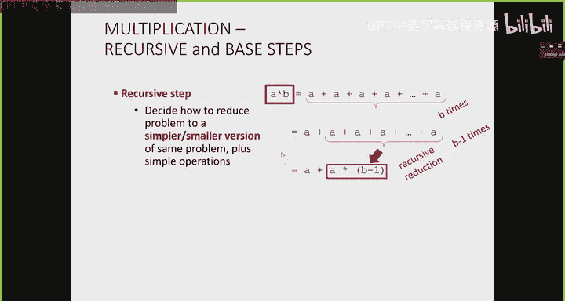

Down here in my， in my quote， unquote solution。

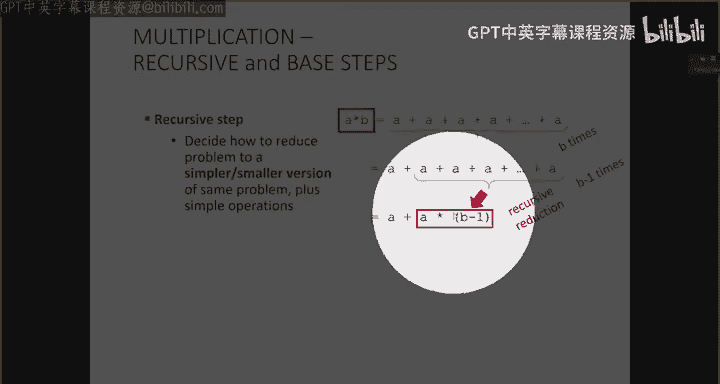

But this is not the end of recursion， because if I just had this as my， as my definition。

 then I would have infinite recursion。 I don't have a way to stop。And so this recursive step。

 in conjunction with a base case， something that is fun that that we know fundamentally about the star operator is going to give us our solution。

 So we knew on the previous slide， when we multiply a with one， we just get back a。So our base case。

 very simple case of multiplication with between A And B is going to be when B is 1。

 Then that's going to be A times B is equal to a。So these might look like the mathematical definitions that you might come up with。

 you know， in a math class。 And we have them right here， right， So if B is not equal to1。

 A times B is a plus a times B -1。 And then the base case， right is when B is equal to1。

 A times B is equal to a。

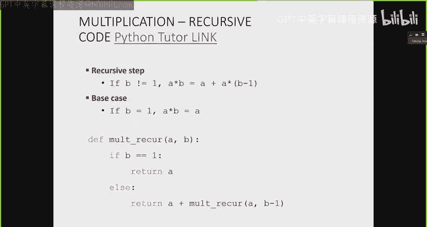

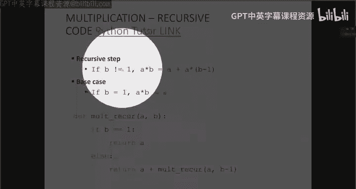

So with these two lines， we can actually come up with the code。The programming version of。

 of this function。So here we're creating a function named Molt recur。

And its parameters are going to be A and B， right， So I'm multiplying A with B。

And I have to encode these two cases when B is one and otherwise。

 So we usually start with the base case。 It's the simplest to think about。

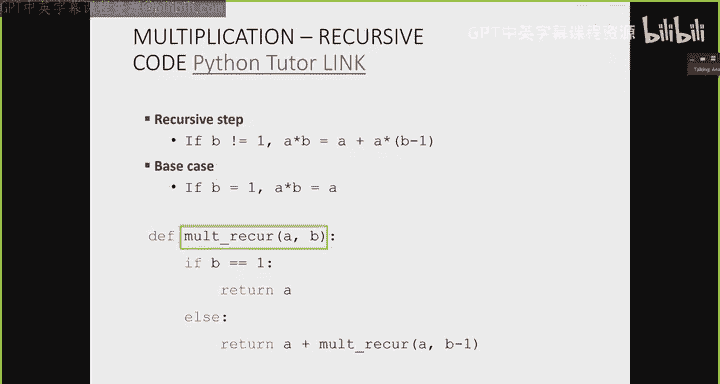

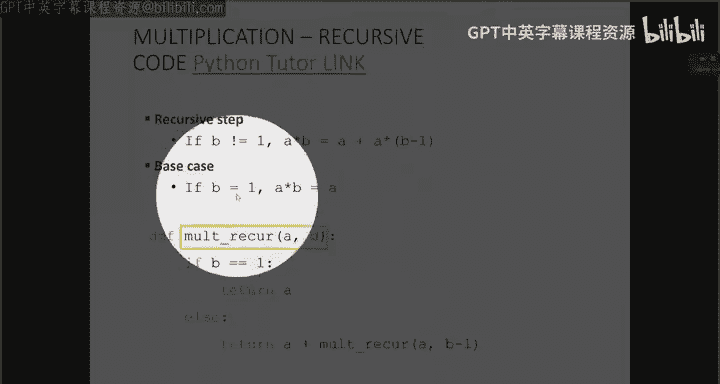

So when B is 1， a times B is equal to a， right？ So when if B is equal to1， then what is a times B。

It's just a， right， So the function can just immediately immediately return A。Else。

 so that's our base case。 else， this is gonna be our recursive step。We're not going to return a。

 but we will return this， right， A plus a star B -1。 Well， the a is just a plus， and this。

 the star operator between A and B -1 is just the function again。

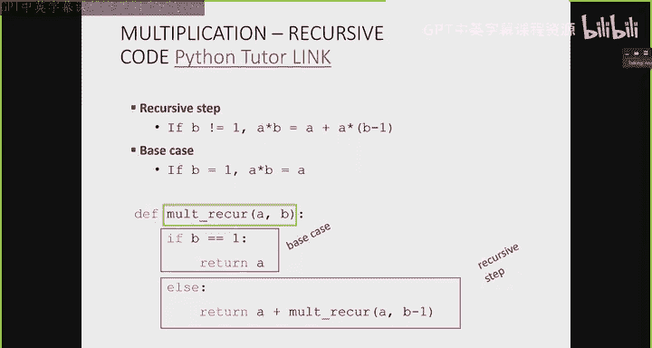

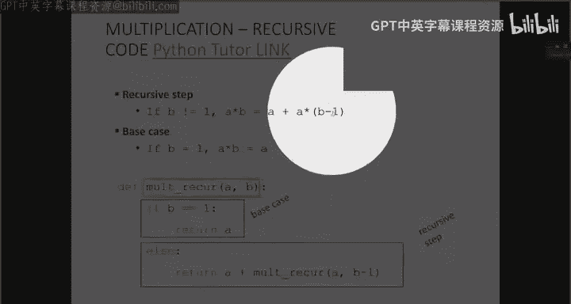

Isn't that really cool。 We're using the function name。😊。

In the body of this function that we're defining。And it's not a problem because the parameter to the one at bottom in the recursive step is changing。

 right， I'm not calling M't recur with a comma B again。

 That would be very silly of me because that would lead to infinite recursion。

 I'm not making any progress towards a base case， but I am calling it with B -1。

So this function will just keep calling won't recur with A with B， B-1。

 mu minus subbu 3 and so on until it gets to B as one。

 And then it'll build back up the solution just like we had in the slides with all the parentheses that we were replacing。

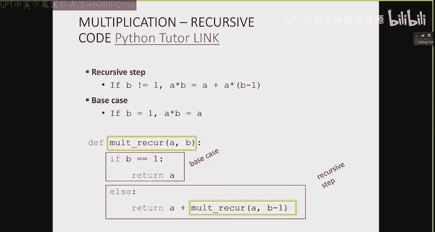

So let's step through the Python tutor and I will show you how it actually looks when we make all these function calls。

 and then we'll do another example。So here I've got Mt recur with a is。

 I think I ran it y with 5 and 4。Just like the one we've been looking at。

So this is going to be my main function， it makes a function called to molt recur。Excuse me。

5 comma 4。 So my A is5 and my B is4。 right This is this little blue thing here is one function environment。

 right Like when I draw boxes on my slides that are orange， they do them in blue。Okay。

 now in this function call， what do we do is B1。No， so we go in the else case and we return 5 plus。

What happens next？ Does anyone know。有。Yes， Mo Recur will run again with A is 5 and B S 3， exactly。

It is a function call， right？ So as a function call， we are going to create a new environment。

 So here's boom， another box。My previous box is currently hung up。Right。

 it cannot finish because it's trying to figure out what a what5 plus。

The result of this function call is， but this one's not done yet， right， It's。

 it's still figuring out it's， it's， it's it result。So we've put that one on hold。

 And now we're trying to figure out mol recur 5 comma 3。 Well， what is mol recur 5， comma 3。

 It's going be B is not one。 So this one will also go in else。And it will return。

 it will return 5 plus。What。Exactly 5， the function call when when B becomes 2， exactly。

 But notice it is another function call， right？ So here I have boom， another box。😊。

Now I've got two function calls， this original one back here and this which was waiting on this one that I've highlighted here。

 But now this one that I've highlighted here had to make another function call down here。

So I've got currently three function calls in the works that are trying to figure out what their results are。

Alright， finally， this mo recur 5 comma 2 is going to make another function call。

 So it's B is not one。 So we're gonna go into the L。And what is it else going to say。

 We're going return 5 plus。And it's another function call。So now I'm four function calls deep。

 and I haven't done any sort of。Visible work， right， I've just kept kind of， you know。

 kicking the can down the road to try to figure out what the values are。

And everybody's waiting for somebody else to finally return a value。Okay。

 so this first one is waiting for the one right underneath it to return a value。

 But this one is waiting for the one underneath it to return a value。

 And this one is waiting for the one underneath it to return a value。 That's the chain of callss。

What's this last one going to do， Is it going to make another function environment。No。

 it's going to return A， which is5。There's my return value 5。

So this one will return the5 to whoever called it and whoever called it was this one here。

 won't recur 5 comma 2， right，5 comma 2 was trying to figure out what 5 plus。

This bottom function call us。Well， now it can figure out that it's gonna be 5 plus 5。

 So its return will be 10。This one returns a value up one level to whoever called it。

 And that was mol recur 5 comma 3。 And now Molt recur 5 comma 3 can finish， its finish its job。

 It was trying to figure out what 5 plus。It's function call was， which is we figured out is' 10。

 So this one can figure out it's 15。And finally， this last value can return back up to the original function call 5 comma 4。

And5 comma 4 will return 5 plus the 15 that got returned， which is 20。Okay。

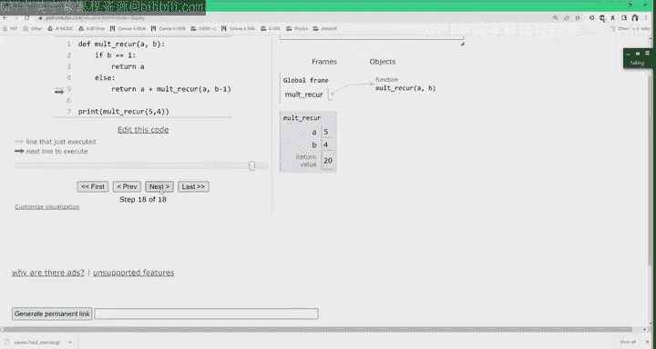

Questions about what just happened。Does everything make sense。All right。Okay。

 so let's look at one more example。 I mean， we'll look at a few more examples this lecture。

 But let's look at a real world example for now。This one will hopefully illustrate the difference between iterative algorithms and recursive algorithms in a more real life setting。

So let's assume that in this real world setting， a student asks for regrade for an exam。

In an iterative setting， we have basically one function call， right。

 regrade or whatever you want to call it。 There's my student。

How is a student going to iteratively get the regrade？ Well。

 the student will be in charge of basically looping through each staff member。Right。

 so the student goes to the instructor and says， can I have a regrade， please。Okay。

 the instructor may have graded one problem。 Maybe they didn't。

 but they will regrade the problem that， you know， maybe they were in charge of。

Then the student will go to the next person on staff， the T A。Could I have a regrade， please？

Let's say the T A maybe regrades the problem they were in charge of。 Maybe they didn't。

 But in any case， they'll give the score back or they'll answer， you know， the students's request。

The student then goes to the next person on staff。The， the lab assistant。Can I a regrade， please。

 The lab assistant might regrade the problem in charge of， you know。

 whatever gives the grade back to the student。 The student is keeping track of all these regrade scores that they're getting to kind of figure out what their new total score is。

 And finally， the student might go to the grader。Who did probably most of the work asks to regrade。

 The grader will dutifully agree to do the regrade and pass back the values。 So here。

 notice the student is in charge of iteratively going to every single person on staff and getting the result back and the student is keeping track of what their new score is。

 Obviously， the staff members will， do， for the purposes of assigning grades。

 But the student is as well。Right， so the students's basically adding up all these values。

 But there is only one function call。 So I've denoted the function call using just this black circle here。

Okay， so that's iteration。 right， We know how to do that。

 We've been doing this for a really long time in this class。

 But now let's look at the same problem recursively。So the recursion， we've got these two steps。

 right， There's the problem of decreasing our original problem into smaller problems。

Right until we reach some sort of base case。And then at that point。

 we have the task of building back up our answer。So in the recursive setting， again。

 I've got my one function called to regrade on behalf of the student。

But the student will only interact with one person， maybe the instructor。

The student will not interact with anybody else in staff。

 The student will just go up to the instructor and say， hey， I would like to regrade for this exam。

Okay。Now， the student is going to wait， right， The instructor is also a function call to regrade。

 So maybe the instructor didn't do any of the grading。

 but the instructor will make their own function call to the T A。 Can you please regrade this exam。

Right。The TA may be graded one problem。 They'll keep track of the problem they need to grade。

 but there are other problems that need to be graded。 So the T A will then ask。

 make their own function call to the lab assistant。 maybe the lab assistant graded some problems。

 And then the lab assistant will also make further the request sort of passing along the function call to the graders。

 So we have the task of doing the regrading as a function being passed along all of the staff members。

Okay， when we reach the base case， which is the last， the greater that needs that probably knows。

Or probably graded the last question。 We've got the answer being passed back up the chain of function calls。

 right， So the grader will say， all right， I've graded my problem。 There's nobody else I need to ask。

 So here's my score。 So this score is being passed back up the chain of function calls to the lab assistant。

 The lab assistant will take that score and added to their score。

Passes it back up the chain of function calls to the teaching assistant。

 The teaching assistant adds their that score to their score， maybe they graded a problem。

 maybe they didn't。 but anyway， they're compiling the result little by little back up until passes it to the instructor and then the instructor says here you go。

 this is your score。So you see the difference， right， The student is is the iteration， right。

 They ask everybody on staff， so they interact with everybody on staff。 But in recursion。

 the student is basically hung up waiting for an answer。

Until we've gone down all these chain of function calls and the answer has been built back up。

 So the student is not keeping track of the answer at all。 They only get the final answer at the end。

Did that help at all。Okay， I've refined this example a couple of times。 Hopefully this is。

 this is good。So the big idea and recursion here is got。

 I've got these quote unquote earlier function calls， right。

 the ones I've made way back at the beginning， these function calls are just waiting on results to come back。

 right， They're not doing any useful work at the beginning。

 They only do useful work when they're assembling the the results after getting a return back from later function calls。

So。Hopefully， that gives you a sense of when of how we can apply recursion。 Now。

 what exactly is recursion。 So algorithmically， it's a way for us to come up with some solutions to some problems in this divide and conquer approach or decrease in conquer approach。

 right？ You have your original problem。 You divide it so much。

 until the same problem just slightly changed until you reach a base case。

 That base case can kick off the conquer step and start passing back a value that you can start assembling from your earlier function calls。

Okay， now， semantically， as we saw in the example where we multiplied the functions。

 we've got a function that calls itself。Obviously， it's not calling itself with the exact same parameters because that would lead to infinite recursion。

 and that's not what we want。 We're going to call ourselves with a slight change in our parameters in such a way that we will reach our base case。

And once we reach the base case， then again， we kick off the conquer step and we can start reassembling back。

 And you saw how the function calls do that when they when they help each other back up。Okay。

 I'm gonna give you a couple of minutes to try this。

 So complete the function that calculates n to the power of P for these variables。

 So if you come up with the mathematical definition。

 it will be a pretty straight translation to code。 I did include two base cases here。

 So maybe base cases when n is 0 and another base cases when n is one。

 figure out what you should return。 and then how to write this recursive step。 So I've got。

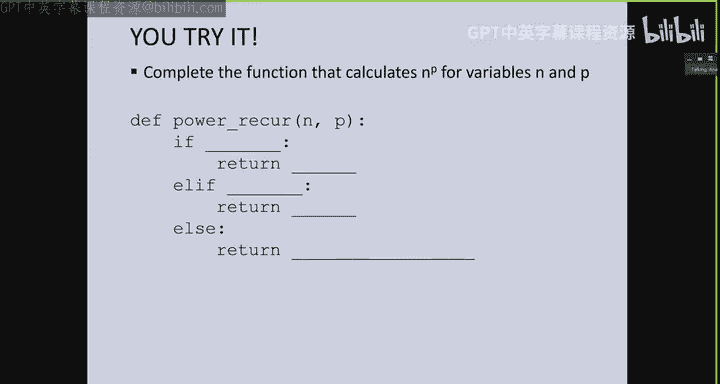

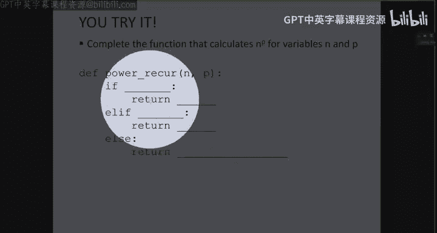

Line。50，50 ish is where you can type it the。Alright， what's my first base case。Yeah。Yep。

 if p is equal to 0， then we can return one。Oops， just one time。 What's another base case。Pierers 1。

We can return in， awesome。How about my recursive step。Yep， we can return n times。Like this。Now。

 let's assume I don't know how to do star star。 How do you rewrite this in terms of the thing we're trying to write。

 There was a solution back there。Yep， we can do that， too。 Yep， exactly。 So here we're assuming that。

We don't know the star star operator， right， Otherwise。

 this would be a very fun easy function to write。 We are trying to define the star star operator ourselves using this function in power recur。

So we're just going to call it again down here。With n and P -1。 So if we run it。This will give us 8。

Is that yeah。Yes， a great question。 What is the necessity of this， There is no necessity。

 I actually just included it there to just show you how we can have two base cases。

 So in this particular case， we would actually never hit this one if the n is greater than one。

 because we always stop here。If the student， if the， the user gives us 0。

 we would just return that one。 But it would work if we completely removed that as well。Yeah。

 great questions。Okay， let's look at one more one more example。

 And this one is the one that I'm gonna ask for some participation。 I would like。

Four of you to come down with me， but before we do that， let's think about factorial。

So the definition of n factorial is n times n-1 times n -2 times n -3 down to1。What is a base case。

 What is the simplest thing that we know the factorial of， You guys tell me。What is， and。

 what is  zerofactorial。What。I chose one， but both could work， yep。If n is equal to 0。

 we can also return  one， or we can do n is equal to1， return  one。What's our recursive step？

Do you recognize the recursive pattern here？And factorial equals。And。Times。N -1 factorial， right。

 If we extract the first n out， N-1 times n minus2 times n minus-3 and so on is just n -1 factorial。

And so our recursive step just says it's n times the same function， factorial。With n -1。

Is everyone okay with that？够。Okay， so let's look through this example with some participation。

 So four people， one， yes， and you'll be on OCW forever。 You guys，2， yep， two more。Yes， thank you。

Thank you， awesome。Okay， and I'll have you guys stand right here。I'll ask you guys to come in。

One at a time。As we are working through this exam。 So we're just gonna demonstrate sort of once again。

 what happens when we make function calls。 you w to just stand right here beside behind my computer。

 Thank you。 Yep， behind my computer。Okay， so。I'll just stand here。

 So I am going to be the main program， right， I am you， you run this code。

 I am going to be the main program。I am going to keep track of。The， the。

 the variables and everything that's in this global scope。Okay， so in the global scope。

 just like we have it in the past， I've got a definition for the myfactorial function here。 Okay。

 And this is just some code。 At this point。 I've just defined it。 I don't care what it actually is。

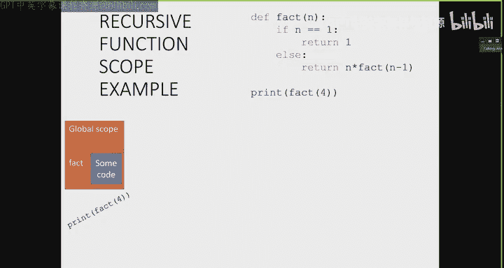

But I have one function call。 So my one and only job is to print the result of factorial 4。 right。

 I have a pretty easy job。

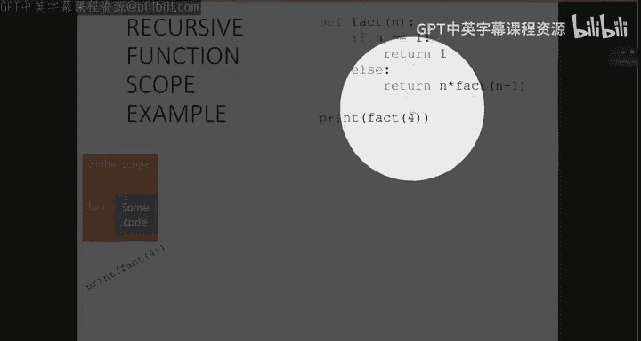

So what happens？ You guys audience tell me what happens when I've got factorial 4， What is this。

Do I just know right off the bat what factorial 4 is。No， it is a function call， right？

 So as a function call， what do I need to do。Exactly， I need to create an environment。 Okay， so。

You will be my first environment。 Hello， my name is， you can put it on。 there go。 Hello， my name is。

 and then you can step right over there。 So you are my first function call。

 Your name is fact for factorial。 Asome。 So I have just called you。😊，嗯。What is your job。

 So you guys tell me what is factorial 4's job is from running the code。

Are they going to do the if or the else？The else。 So this is your job。 You keep track of that。

 Your N is going to be4， and your job is to return four times factorial of 3。

 Do you know what factorial of three is right now， No， so what do you need to do？ Yes。

 please call somebody else。 Who are you gonna call。Next。What is your name going to be？Your。

 your name is also factorial exactly。 And you are going to be called with n is equal to 3。

 So you can stand right beside factorial of 4。Very nice。 So now， notice we've got two function calls。

😊，Both of their names are factorial， right。But they are completely separate function calls。

 They are completely in different environments。 They have their own end values。

 They have their own jobs to do， right， just because their name is factorial for both of them does not mean that they'll interfere with each other's variables。

 right， Very， very important point to make。Factial 3。 Do you know what factorial of 2 is。No。

 so what do you need to do。Exactly， who are you going to call？Here you go。

 What is your name going to be。Yes， we are a two。 exactly。 So you are factorial。

 Your name is also factorial， and you are going to be with called with n is equal to 2。 Again。

 now I have three factorial calls。 They're all to the name factorial。

 but they're all independent function calls。 So your job is to return two times factorial of one。

 Do you know what factorial of one is。😊，As a human， you do， but as factorial， you do not。

 what do you need to do。Call her。 exactly。 Here you go。 Your name is also factorial。

 You can stand beside our lovely other factorials。 So your job。😊，Audience I've already given away。

 Your last job is to。Return 1， Okay， excellent。 So here is your return value now。Factorial of one。

Are you going to return that value to me？Which one will you return it to。Exactly。

 so factorial with n is equal to 2 can now replace their factorial  one function with one。

 So what is your return value going be factorial of 2。I got it。2， exactly。 So who。

 Where do you pass your value along to， Okay， now， one thing we forgot。

 as soon as you made the return value， you disappear。You had a very simple job。 I'm sorry。

 but it was really important You were our base case Without you， we would have had。

Infinite recursion。Okay， so you've passed along your value。 So as a function that's done its job。

 what do you do。Disappear exactly。 Thank you。 Alright， factorial of where are we3， exactly。

 what do you， what is your value going to be now。6， exactly。 So here's your return value。

 You give it to me， there you go。 And as give exactly， Very good。We disappear。

 So we've got three function calls that disappeared as soon as they returned to value。 And finally。

 four times 6。24。 And who do you give your。Me， whichch I just gave you， sorry， yeah。

 that was confusing。Thank you so much， you guys， that。

Illustrated a couple of things you guys can head back。Thank you so much。

So we illustrated a couple things here。 I'm gonna， I can do it on the slides， as well。Just to bring。

 bring the point home。But。Let's go through it。 So I've got factorial 4。

 Every time I make a function call， even though it's the same name， all factorial。

 it's a completely separate environment， right， happens to have the same name。

 but they're just in charge of doing their own job。 So here I've got factorial 4 calling。

Four times factorial of three。As soon as I see factorial of 3， this creates another environment。

 This is going to be returning three times factorial of 2。 Again， another environment。

 This returns two times factorial of one and a final environment， right。

 our most important environment is that last one with the base case。

 It allows us to kickstart our conquer step。 So this base step will return the value one to whoever called it。

 Again， we're not skipping around。 We only return the value to the function that called us。

 And I know it gets really confusing because everything is called fact in this particular case。

 But we just have to remember which function called us。 And so we return the one back up here。

This becomes two times1， and they can finish their job。 right？ So notice at this point， we've got。

 we were 1，2，3，4 functions just kind of hung up and waiting for values to be passed back to us。

 But now we can finally finish our jobs 1 by one。 So this one returns the2。 This one returns the 6。

 This one returns the 20。24 and the 24 get Z thats printed out。So。嗯。Big idea here。

 We've got each function call， even though it has the same name， is completely separate， right。

 completely independent environment with their own parameters。

 Those parameters can change within those environments。 And that's totally okay。

 They won't interfere with any parameters in any other environment。

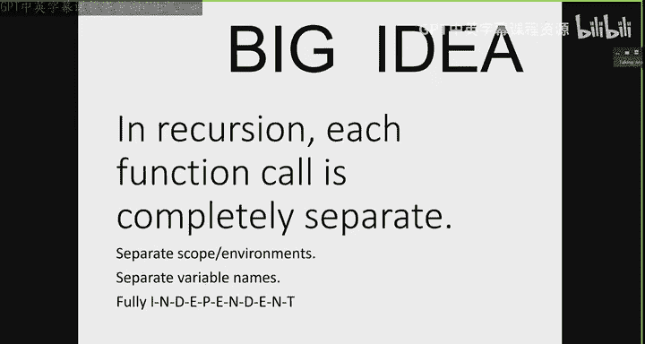

All right。So let's do the Python tutor link。 And then again。

 we can just do one more time just to show you what this looks like in in terms of the Python tutor。

 So here I've got my factorial with n is equal to 4。Calls n is equal to 3。

 Call factorial with n is equal to 2。 Calls factorial with n is equal to 1。At this point， right。

 just like with a multiplication， I've got all these factorials in the works。

But we can start returning values back to whoever called us。

Until we get back to the original the original function call。

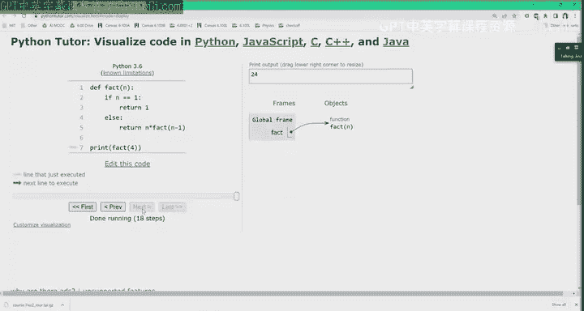

O。So this is another recap of the observations that we've seen right。

 Each different function call has its own environment。

 The variables within these environments are specific to those environments。

 They don't interfere with each other。And the flow of controls right。

 So when we make a function call， all we know is the function that we call next。

 We don't skip around。 All we know is who we call next and who we need to give the value back up to。

嗯。One last thing I wanted to point out。 So here I've got the code for factorial。

The iterative version。And the recursive version。So the one on the left is sorry。

 The one on the right is what we already wrote。 So it's factorial recursive。

And the one on the left is the iterative version， so。嗯。

I personally think the one on the right is more readable because it's。

 it's very similar to the way that we would write the expression mathematically。

But if you kind of if you had a little bit of time to think about it。

 you can just as easily come up with code that does the exact same job iteratively， right？

 So remember， in iteration， we've got our loop。 There's no more function， no other function calls。

 We have a loop that， you know， iterate some number of times。

 There's some sort of loop variable or loop counter。

 and there is a state variable that keeps track of the answer of interest in this particular case。

 the product from one all the way up to and including it。

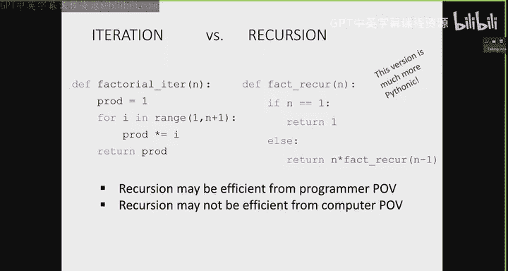

So I want to end today's lecture with just a couple of observations。 So today。

 we saw some really simple examples of recursion。😊，But I think it outlined some really。

 really tricky ideas that people usually have trouble grasping when you first see recursion。

 And that's because you basically write a function in terms of itself。

 And that can be a little bit confusing。 So， of course， we applied recursion to some really。

 really simple things。 We did multiplication。 We did， and we did factorial。Depending on how you feel。

 the recursive version or the iterative version might be more intuitive for you。 And certainly。

 for these examples， you did not need to write them recursively。There are。

 there's a lot of code out there that you actually don't need to implement recursively。

 The iterative solution is far more intuitive， especially since you guys were first introduced to iteration。

 right， You introduced four loops in while loops back in lecture like3 or something like that， right。

 So if that's the first thing you saw， that's usually the first thing that's going to be your go to。

 But there are several problems that are more intuitive to write using recursion。

So a couple of examples where recursion is more intuitive is any time when you need to repeat a task that for。

 for which you don't know how sort of deep you need to go。In which case。

 the recursive calls will take care of making calls to itself to itself。

 to itself to itself until it reaches the base case。

 You don't need to think about that in your iteration。

 So an example of that is this kind of classic one where we have a file inside a file system。Someone。

 you know， if we're looking for a， you knowet dot text， we can have a student whoseet dot text is。

 you know straight under their users slashet do text folder。

 But we might have another person whose Pet dot text is going to be within their users。

 their documents， their schools， their MIt， their classes， their 6。

100 L their theiret1 slashet dot text right So that uncertainty for how far deep you need to search the file system in order to get to the file of interest is a perfect place to apply recursion。

 Another one is where you have an expression if you're building your own calculator and code and you have order of expressions sorry order order of operations using parentheses again。

 you don't know how many parentheses， you might need to have a loop go through in order to get to that base expression right to figure out the one that you need to do first。

 And so that's another case where。Using recursion is is is very useful。 So in the next lecture。

 what we're going to do is a recap of recursion using another example Fibonacci sequence。

 And then we're going to start looking at recursion applied to lists。

 and specifically if we have lists within lists within lists within lists。

 And we don't know how many nested lists we might have recursion is going to be a perfect example for that。

O。

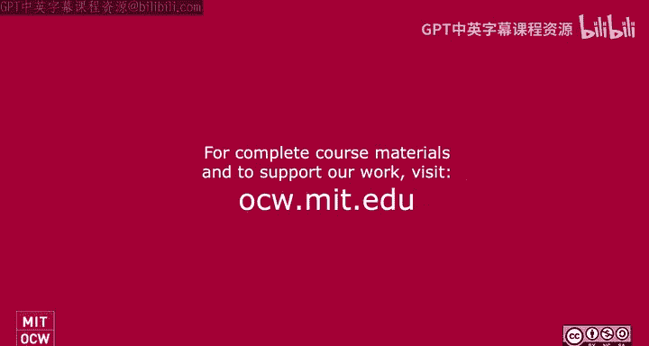